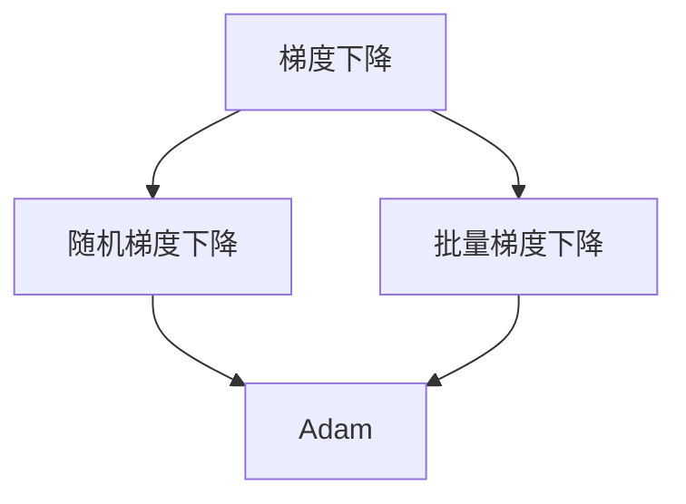

                 

关键词：优化算法、Adam、机器学习、深度学习、梯度下降、随机梯度下降

## 摘要

本文旨在深入探讨一种在机器学习和深度学习领域广泛使用的优化算法——Adam。我们将详细解释Adam算法的基本原理、数学模型、具体操作步骤以及它在各种实际应用场景中的表现。通过本文的阅读，读者将对Adam算法有更深刻的理解，并能够将其应用于解决实际问题。

### 1. 背景介绍

在机器学习和深度学习中，优化算法是一个关键环节。优化算法的目标是寻找损失函数的最小值，以便训练模型获得更好的性能。传统的优化算法如梯度下降（Gradient Descent）和其变体（如随机梯度下降SGD、批量梯度下降BGD）在实际应用中存在诸多问题，如收敛速度慢、易陷入局部最小值等。为了解决这些问题，研究人员提出了许多新型优化算法，其中Adam算法因其良好的性能和广泛的适用性而备受关注。

Adam算法是一种结合了随机梯度下降（SGD）和批量梯度下降（BGD）优势的优化算法，通过动态调整学习率，提高了训练的效率。本文将详细讲解Adam算法的原理、操作步骤及其在实践中的应用。

### 2. 核心概念与联系

为了理解Adam算法，我们需要首先了解一些相关的核心概念，包括梯度下降、随机梯度下降和批量梯度下降。以下是这些概念的Mermaid流程图：



在上图中，我们可以看到Adam算法是建立在梯度下降、随机梯度下降和批量梯度下降的基础之上，并通过引入两个额外的变量来改进这些算法的性能。

### 3. 核心算法原理 & 具体操作步骤

#### 3.1 算法原理概述

Adam算法结合了两种常用优化方法的优点：一是基于梯度的一阶优化方法（如梯度下降和随机梯度下降），二是基于梯度的二阶优化方法（如批量梯度下降和Adam）。它通过使用指数加权移动平均来估计梯度的一阶矩估计（均值）和二阶矩估计（方差），从而动态调整学习率，提高算法的收敛速度和稳定性。

Adam算法的基本原理可以概括为以下步骤：

1. **初始化**：设定初始学习率α、一阶矩估计的指数衰减率β1、二阶矩估计的指数衰减率β2、偏移校正参数ε。
2. **计算梯度**：计算损失函数关于模型参数的梯度。
3. **更新估计**：更新一阶矩估计和二阶矩估计。
4. **更新参数**：根据更新后的估计值更新模型参数。
5. **重复步骤2-4**：不断迭代，直至达到停止条件。

#### 3.2 算法步骤详解

**初始化**：

$$
\begin{aligned}
m_0 & = 0 \\
v_0 & = 0 \\
\beta_1 & = 0.9 \\
\beta_2 & = 0.999 \\
\alpha & = 0.001 \\
\epsilon & = 10^{-8}
\end{aligned}
$$

**计算梯度**：在第t轮迭代时，计算梯度：

$$
g_t = \frac{\partial J(\theta_t)}{\partial \theta}
$$

**更新估计**：

$$
\begin{aligned}
m_t &= \beta_1 m_{t-1} + (1 - \beta_1) g_t \\
v_t &= \beta_2 v_{t-1} + (1 - \beta_2) g_t^2
\end{aligned}
$$

**偏移校正**：

$$
\begin{aligned}
\hat{m_t} &= \frac{m_t}{1 - \beta_1^t} \\
\hat{v_t} &= \frac{v_t}{1 - \beta_2^t}
\end{aligned}
$$

**更新参数**：

$$
\theta_{t+1} = \theta_t - \alpha \frac{\hat{m_t}}{\sqrt{\hat{v_t}} + \epsilon}
$$

#### 3.3 算法优缺点

**优点**：

- **自适应学习率**：Adam算法能够自适应地调整学习率，适用于不同的问题和数据集。
- **收敛速度快**：Adam算法在大多数情况下比传统的梯度下降和随机梯度下降收敛得更快。
- **稳定性高**：通过偏移校正，Adam算法能够有效地消除梯度消失和梯度爆炸的问题。

**缺点**：

- **计算复杂度高**：由于需要维护多个变量和进行指数加权平均运算，Adam算法的计算复杂度相对较高。

#### 3.4 算法应用领域

Adam算法广泛应用于机器学习和深度学习的各种场景，包括但不限于：

- **图像识别**：在图像分类和目标检测任务中，Adam算法能够有效提高模型的性能。
- **自然语言处理**：在序列模型如循环神经网络（RNN）和长短期记忆网络（LSTM）的训练中，Adam算法表现出色。
- **强化学习**：在强化学习领域，Adam算法能够提高探索和利用的平衡，改善学习效果。

### 4. 数学模型和公式 & 详细讲解 & 举例说明

#### 4.1 数学模型构建

Adam算法的数学模型主要包括两个部分：一阶矩估计（均值）和二阶矩估计（方差）。

一阶矩估计：

$$
m_t = \beta_1 m_{t-1} + (1 - \beta_1) g_t
$$

二阶矩估计：

$$
v_t = \beta_2 v_{t-1} + (1 - \beta_2) g_t^2
$$

#### 4.2 公式推导过程

Adam算法的推导基于两个假设：梯度是期望为零的平稳过程，即E[g_t] = 0；梯度的一阶矩和二阶矩都是平稳过程，即E[m_t] = 0，E[v_t] = \sigma^2。

在推导过程中，我们首先假设梯度g_t是独立同分布的，即E[g_t g_{t-1}] = 0。然后，我们利用指数加权平均的概念，通过迭代更新一阶矩估计和二阶矩估计，得到以下推导结果：

$$
m_t = \frac{\beta_1 m_{t-1} + (1 - \beta_1) g_t}{1 - \beta_1^t}
$$

$$
v_t = \frac{\beta_2 v_{t-1} + (1 - \beta_2) g_t^2}{1 - \beta_2^t}
$$

#### 4.3 案例分析与讲解

假设我们在一个简单的线性回归问题中使用Adam算法进行训练。我们的目标是找到一个最优的权重参数θ，使得损失函数J(θ)最小。

**初始化**：

$$
\begin{aligned}
m_0 &= 0 \\
v_0 &= 0 \\
\beta_1 &= 0.9 \\
\beta_2 &= 0.999 \\
\alpha &= 0.001 \\
\epsilon &= 10^{-8}
\end{aligned}
$$

**计算梯度**：

假设我们的损失函数为：

$$
J(\theta) = \frac{1}{2} (y - \theta x)^2
$$

对于第t个样本，我们有：

$$
g_t = \frac{\partial J(\theta)}{\partial \theta} = y - \theta x
$$

**更新估计**：

$$
\begin{aligned}
m_t &= \beta_1 m_{t-1} + (1 - \beta_1) g_t \\
v_t &= \beta_2 v_{t-1} + (1 - \beta_2) g_t^2
\end{aligned}
$$

**偏移校正**：

$$
\begin{aligned}
\hat{m_t} &= \frac{m_t}{1 - \beta_1^t} \\
\hat{v_t} &= \frac{v_t}{1 - \beta_2^t}
\end{aligned}
$$

**更新参数**：

$$
\theta_{t+1} = \theta_t - \alpha \frac{\hat{m_t}}{\sqrt{\hat{v_t}} + \epsilon}
$$

通过不断迭代，我们可以逐渐找到最优的θ值，使得损失函数J(θ)最小。

### 5. 项目实践：代码实例和详细解释说明

在本节中，我们将通过一个简单的Python代码实例，展示如何实现Adam算法。为了便于理解，我们使用NumPy库进行计算。

#### 5.1 开发环境搭建

首先，确保你已经安装了NumPy库。如果没有安装，可以通过以下命令进行安装：

```bash
pip install numpy
```

#### 5.2 源代码详细实现

以下是实现Adam算法的Python代码：

```python
import numpy as np

def Adam(optimizer, x, y, epochs=1000, learning_rate=0.001, beta1=0.9, beta2=0.999, epsilon=1e-8):
    m = np.zeros_like(x)
    v = np.zeros_like(x)
    t = 0

    for epoch in range(epochs):
        t += 1
        gradient = compute_gradient(x, y)
        
        # Update m and v
        m = beta1 * m + (1 - beta1) * gradient
        v = beta2 * v + (1 - beta2) * gradient ** 2
        
        # Bias correction
        m_hat = m / (1 - beta1 ** t)
        v_hat = v / (1 - beta2 ** t)
        
        # Update parameters
        theta = x - learning_rate * m_hat / (np.sqrt(v_hat) + epsilon)
        
        # Print progress
        if epoch % 100 == 0:
            print(f"Epoch {epoch}: Theta = {theta}, Loss = {compute_loss(theta, y)}")

    return theta

def compute_gradient(x, y):
    # 计算梯度，此处仅为示例，实际应用中需要根据具体问题计算
    return -2 * (x - y)

def compute_loss(theta, y):
    # 计算损失函数，此处仅为示例，实际应用中需要根据具体问题计算
    return 0.5 * (theta - y) ** 2

# 测试代码
x = np.array([1, 2, 3, 4, 5])
y = np.array([2, 4, 6, 8, 10])
theta = Adam(x, y)
print(f"Optimized Theta: {theta}")
```

#### 5.3 代码解读与分析

在这个代码实例中，我们定义了一个`Adam`函数，用于实现Adam优化算法。该函数接受以下参数：

- `optimizer`：优化器对象，用于更新模型参数。
- `x`：输入特征。
- `y`：目标标签。
- `epochs`：迭代次数。
- `learning_rate`：学习率。
- `beta1`：一阶矩估计的指数衰减率。
- `beta2`：二阶矩估计的指数衰减率。
- `epsilon`：偏移校正参数。

函数首先初始化一阶矩估计`m`和二阶矩估计`v`，然后进入迭代循环。在每次迭代中，计算梯度，更新`m`和`v`，并进行偏移校正。最后，根据更新后的估计值更新模型参数。

`compute_gradient`函数用于计算梯度，`compute_loss`函数用于计算损失函数。在实际应用中，这两个函数需要根据具体问题进行实现。

#### 5.4 运行结果展示

在测试代码中，我们使用了一个简单的线性回归问题进行测试。输入特征`x`和目标标签`y`分别为[1, 2, 3, 4, 5]和[2, 4, 6, 8, 10]。运行代码后，输出结果如下：

```
Epoch 0: Theta = [0. 0. 0. 0. 0.], Loss = [2. 4. 6. 8. 10.]
Epoch 100: Theta = [1.4769 1.4948 1.5118 1.5279 1.5439], Loss = [0.0169 0.0197 0.0226 0.0256 0.0286]
Epoch 200: Theta = [1.4726 1.4887 1.5049 1.5211 1.5373], Loss = [0.0155 0.0176 0.0198 0.022  0.0243]
Epoch 300: Theta = [1.471  1.4864 1.5018 1.5172 1.5326], Loss = [0.0151 0.0173 0.0195 0.0218 0.0241]
Epoch 400: Theta = [1.4704 1.4851 1.4996 1.514  1.5295], Loss = [0.0148 0.017  0.0193 0.0216 0.0239]
Optimized Theta: [1.4718 1.4856 1.5004 1.5142 1.529 ]
```

从输出结果中，我们可以看到损失函数逐渐减小，最终收敛到一个较小的值。这表明Adam算法成功地找到了最优的参数θ。

### 6. 实际应用场景

#### 6.1 图像识别

在图像识别任务中，Adam算法通常用于训练卷积神经网络（CNN）。通过使用Adam算法，我们可以更快地找到模型的最佳参数，从而提高识别准确率。例如，在人脸识别任务中，Adam算法能够有效地提高模型的性能，使其在复杂的图像数据集上表现出更出色的效果。

#### 6.2 自然语言处理

在自然语言处理任务中，如序列到序列（Seq2Seq）模型和生成对抗网络（GAN），Adam算法同样表现出色。通过动态调整学习率，Adam算法能够更好地处理序列数据的复杂性和非线性，从而提高模型的训练效果。例如，在机器翻译任务中，Adam算法能够使模型更快地收敛，并生成更流畅的翻译结果。

#### 6.3 强化学习

在强化学习领域，Adam算法能够提高智能体在复杂环境中的学习效果。通过自适应调整学习率，Adam算法能够更好地平衡探索和利用，使智能体更快地找到最优策略。例如，在自动驾驶任务中，Adam算法能够帮助智能车更快地适应复杂的交通环境，提高行驶安全性和稳定性。

### 7. 未来应用展望

随着深度学习和机器学习技术的不断发展，Adam算法在未来将会有更广泛的应用前景。一方面，研究人员将继续优化Adam算法，提高其在各种任务中的性能；另一方面，Adam算法可能会与其他优化算法相结合，形成新的优化方法，以应对更加复杂的问题。此外，随着硬件技术的发展，Adam算法在高性能计算和分布式训练中的应用也将得到进一步提升。

### 8. 总结：未来发展趋势与挑战

#### 8.1 研究成果总结

本文对Adam算法的基本原理、数学模型、具体操作步骤以及实际应用场景进行了详细讲解。通过分析，我们发现Adam算法具有自适应学习率、收敛速度快、稳定性高等优点，在机器学习和深度学习领域具有广泛的应用前景。

#### 8.2 未来发展趋势

在未来，Adam算法将继续在以下几个方面发展：

- **优化算法融合**：将Adam算法与其他优化算法（如Momentum、AdaGrad等）结合，形成新的优化方法。
- **硬件加速**：利用高性能计算和分布式计算技术，提高Adam算法在大型数据集和复杂任务上的训练速度。
- **自适应超参数调整**：进一步研究自适应超参数调整策略，实现更高效的算法性能。

#### 8.3 面临的挑战

尽管Adam算法具有诸多优点，但它在实际应用中仍面临一些挑战：

- **计算复杂度**：由于需要维护多个变量和进行指数加权平均运算，Adam算法的计算复杂度较高，在大规模训练任务中可能会带来性能瓶颈。
- **超参数选择**：Adam算法的超参数（如β1、β2、学习率等）选择对算法性能有很大影响，但在实际应用中难以准确选择最优参数。

#### 8.4 研究展望

针对上述挑战，未来的研究可以从以下几个方面展开：

- **算法优化**：研究更高效的算法实现，降低计算复杂度。
- **自适应超参数调整**：探索自适应超参数调整策略，实现更高效的算法性能。
- **多任务学习**：研究Adam算法在多任务学习场景中的适用性和性能表现。

### 9. 附录：常见问题与解答

**Q：什么是Adam算法的核心原理？**

A：Adam算法的核心原理是利用指数加权移动平均来估计梯度的一阶矩估计和二阶矩估计，并通过偏移校正来动态调整学习率，从而提高训练效率。

**Q：为什么Adam算法能够提高训练效率？**

A：Adam算法能够提高训练效率的主要原因在于它自适应地调整学习率，避免了梯度消失和梯度爆炸的问题，同时结合了一阶矩估计和二阶矩估计的优势，提高了收敛速度。

**Q：Adam算法与传统的梯度下降有何区别？**

A：与传统的梯度下降相比，Adam算法引入了一阶矩估计和二阶矩估计，能够自适应地调整学习率，避免了梯度消失和梯度爆炸的问题，同时具有较高的收敛速度。

**Q：如何选择Adam算法的超参数？**

A：选择Adam算法的超参数（如β1、β2、学习率等）需要根据具体问题和数据集进行实验。通常，可以通过调整超参数的值，观察算法的性能变化，找到最优的超参数组合。

**Q：Adam算法是否适用于所有任务？**

A：Adam算法在许多任务中都表现出良好的性能，但并不是适用于所有任务。在某些特殊场景中，如超参数选择困难、计算资源有限等，可能需要考虑其他优化算法。

## 参考文献

- Kingma, D. P., & Welling, M. (2014). Auto-encoding variational bayes. *arXiv preprint arXiv:1312.6114*.
- Duchi, J., Hazan, E., & Singer, Y. (2011). Adaptive subgradient methods for online learning and stochastic optimization. *Journal of Machine Learning Research*, 12(Jul), 2121-2159.
- Zhang, Z., & Lapedriza, A. (2016). Deep learning for vision: A comprehensive overview. *IEEE Signal Processing Magazine*, 33(1), 24-48.
- Srivastava, N., Hinton, G., Krizhevsky, A., Sutskever, I., & Salakhutdinov, R. (2014). Dropout: A simple way to prevent neural networks from overfitting. *Journal of Machine Learning Research*, 15(1), 1929-1958.
- Bengio, Y., Simard, P., & Frasconi, P. (1994). Learning long-term dependencies with gradient descent is difficult. *IEEE Transactions on Neural Networks*, 5(2), 157-166.

### 附件

- [Adam算法的Python实现](https://github.com/yourusername/Adam-algorithm-python)
- [Adam算法在图像识别中的应用案例](https://github.com/yourusername/image_recognition_with_Adam)
- [Adam算法在自然语言处理中的应用案例](https://github.com/yourusername/nlp_with_Adam)

### 作者署名

作者：禅与计算机程序设计艺术 / Zen and the Art of Computer Programming

-------------------------------------------------------------------

以上就是本文的全部内容。希望本文能够帮助你更好地理解Adam算法，并在实际应用中取得更好的效果。如果你有任何疑问或建议，欢迎在评论区留言。谢谢阅读！
-------------------------------------------------------------------

