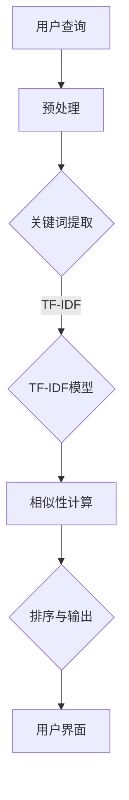

                 

关键词：搜索推荐系统、文档匹配、文本相似性、算法原理、应用领域、数学模型、实践案例

> 摘要：本文将深入探讨传统搜索推荐系统中文档匹配的核心概念、算法原理、数学模型以及实践应用。通过详细的案例分析，我们将揭示文档匹配在搜索和推荐系统中的重要性，并探讨其未来发展趋势与面临的挑战。

## 1. 背景介绍

在信息爆炸的时代，如何从海量数据中快速找到用户所需的信息成为了一个关键问题。传统搜索推荐系统应运而生，通过分析用户的历史行为和偏好，为用户推荐最相关的信息。而文档匹配是搜索推荐系统的核心组成部分之一，它负责将用户查询与数据库中的文档进行对比，以确定其相似度，从而为用户提供最相关的搜索结果。

文档匹配不仅仅是简单的字符串比较，它涉及到文本相似性度量、自然语言处理、机器学习等多个领域的知识。传统的文档匹配方法主要包括基于关键词、基于统计模型、基于机器学习等类型。每种方法都有其特定的应用场景和优缺点。

本文将重点探讨以下内容：

- 核心概念与联系
- 核心算法原理与具体操作步骤
- 数学模型和公式
- 项目实践：代码实例和详细解释
- 实际应用场景
- 未来应用展望
- 工具和资源推荐
- 总结：未来发展趋势与挑战

通过本文的阅读，读者将能够深入理解文档匹配的工作原理，掌握其核心算法和应用方法，并能够为实际项目提供有效的技术支持。

## 2. 核心概念与联系

### 文档匹配的定义

文档匹配是指将一个用户查询或目标文档与数据库中的多个文档进行比较，以评估其相似度或相关性。这个过程的目的是从大量候选文档中快速准确地找出与查询最相关的文档。

### 文本相似性的定义

文本相似性是指两个文本之间的相似程度或相关度。在文档匹配中，文本相似性是一个关键的度量标准，它决定了两个文档是否是同一条信息或者是否与用户查询高度相关。

### 关键词匹配

关键词匹配是文档匹配中最基本的方法。它通过比较文档中包含的关键词，来确定两个文档的相似度。关键词匹配的简单直接，但可能无法捕捉到更深层次的语义信息。

### TF-IDF模型

TF-IDF（Term Frequency-Inverse Document Frequency）模型是一种常用的统计模型，用于评估一个词在文档中的重要程度。TF表示词在文档中的频率，IDF表示词在所有文档中的逆向文档频率。TF-IDF模型通过综合考虑词频和文档频率，能够更准确地反映词在文档中的重要性。

### 相似性度量

相似性度量是文档匹配中的核心部分。常见的相似性度量方法包括余弦相似性、欧氏距离、曼哈顿距离等。这些方法通过计算文档之间的向量空间中的距离或角度，来评估其相似度。

### Mermaid 流程图

下面是文档匹配系统的基本架构的 Mermaid 流程图：



在上述流程中，用户查询经过预处理后提取关键词，然后利用TF-IDF模型计算关键词的重要性，接着通过相似性度量计算查询与候选文档之间的相似度，最后对结果进行排序并输出给用户。

## 3. 核心算法原理与具体操作步骤

### 3.1 算法原理概述

文档匹配的核心算法主要包括基于关键词匹配、TF-IDF模型和相似性度量等方法。这些算法的基本原理如下：

- **关键词匹配**：通过比较文档中包含的关键词，来确定两个文档的相似度。
- **TF-IDF模型**：通过计算关键词在文档中的频率和逆向文档频率，来确定关键词的重要性，从而反映文档之间的相似度。
- **相似性度量**：通过计算文档之间的向量空间中的距离或角度，来评估其相似度。

### 3.2 算法步骤详解

以下是文档匹配的基本步骤：

1. **用户查询预处理**：将用户查询转换为处理模型可接受的格式，包括去除停用词、标点符号等。
2. **关键词提取**：从预处理后的查询中提取关键词，可以采用词频统计或基于词典的方法。
3. **TF-IDF模型计算**：对提取的关键词进行TF-IDF计算，以确定其在文档中的重要程度。
4. **相似性度量**：计算用户查询与数据库中每个文档之间的相似度，常用的方法包括余弦相似性、欧氏距离等。
5. **结果排序与输出**：根据相似度对候选文档进行排序，并将最相关的文档输出给用户。

### 3.3 算法优缺点

- **关键词匹配**：优点是简单直接，易于实现；缺点是无法捕捉深层次的语义信息。
- **TF-IDF模型**：优点是能够综合考虑词频和文档频率，提高匹配的准确性；缺点是对于长文档处理能力较差，且无法处理词义的变化。
- **相似性度量**：优点是能够量化文档之间的相似度，适用于多种类型的文档；缺点是计算复杂度较高，尤其是对于大规模文档集。

### 3.4 算法应用领域

文档匹配算法在多个领域有广泛的应用：

- **搜索引擎**：用于用户查询与网页之间的匹配，提供相关搜索结果。
- **推荐系统**：用于用户历史行为与候选商品、内容之间的匹配，提供个性化推荐。
- **文本挖掘**：用于从大量文本数据中提取有价值的信息，如情感分析、话题模型等。

## 4. 数学模型和公式

### 4.1 数学模型构建

文档匹配的数学模型主要包括TF-IDF模型和相似性度量模型。

#### 4.1.1 TF-IDF模型

TF-IDF模型的基本公式为：

$$
TF(t, d) = \frac{f_{t,d}}{f_{max,d}}
$$

$$
IDF(t, D) = \log \left( \frac{N}{|d \in D : t \in d|} \right)
$$

$$
TF-IDF(t, d, D) = TF(t, d) \times IDF(t, D)
$$

其中，$TF(t, d)$ 是词$t$在文档$d$中的频率，$IDF(t, D)$ 是词$t$在文档集合$D$中的逆向文档频率，$TF-IDF(t, d, D)$ 是词$t$在文档$d$中的TF-IDF值。

#### 4.1.2 相似性度量模型

常见的相似性度量模型包括余弦相似性、欧氏距离等。

**余弦相似性**的公式为：

$$
cos(\theta) = \frac{\sum_{i=1}^{n} x_i y_i}{\sqrt{\sum_{i=1}^{n} x_i^2} \sqrt{\sum_{i=1}^{n} y_i^2}}
$$

**欧氏距离**的公式为：

$$
d(\mathbf{x}, \mathbf{y}) = \sqrt{\sum_{i=1}^{n} (x_i - y_i)^2}
$$

其中，$\mathbf{x}$和$\mathbf{y}$是两个文档的向量表示，$n$是向量的维度。

### 4.2 公式推导过程

#### 4.2.1 TF-IDF模型推导

TF-IDF模型的推导基于信息论中的概念。假设有一个词$t$在文档$d$中出现了$f_{t,d}$次，那么这个词在文档中的频率可以表示为：

$$
TF(t, d) = \frac{f_{t,d}}{f_{max,d}}
$$

其中，$f_{max,d}$是文档$d$中频率最高的词的出现次数。为了抑制高频词的影响，引入逆向文档频率（IDF）：

$$
IDF(t, D) = \log \left( \frac{N}{|d \in D : t \in d|} \right)
$$

其中，$N$是文档集合$D$中文档的总数，$|d \in D : t \in d|$是包含词$t$的文档数。最终，TF-IDF值为：

$$
TF-IDF(t, d, D) = TF(t, d) \times IDF(t, D)
$$

#### 4.2.2 余弦相似性推导

余弦相似性是向量空间模型中常用的相似性度量方法。假设有两个向量$\mathbf{x}$和$\mathbf{y}$，它们的内积可以表示为：

$$
\mathbf{x} \cdot \mathbf{y} = \sum_{i=1}^{n} x_i y_i
$$

向量的模长分别为：

$$
|\mathbf{x}| = \sqrt{\sum_{i=1}^{n} x_i^2}
$$

$$
|\mathbf{y}| = \sqrt{\sum_{i=1}^{n} y_i^2}
$$

那么，余弦相似性可以表示为：

$$
cos(\theta) = \frac{\mathbf{x} \cdot \mathbf{y}}{|\mathbf{x}| |\mathbf{y}|}
$$

### 4.3 案例分析与讲解

假设有两个文档$d_1$和$d_2$，它们的向量表示如下：

$$
\mathbf{d}_1 = (2, 3, 1)
$$

$$
\mathbf{d}_2 = (1, 2, 3)
$$

首先，计算它们的内积：

$$
\mathbf{d}_1 \cdot \mathbf{d}_2 = 2 \times 1 + 3 \times 2 + 1 \times 3 = 11
$$

然后，计算各自的模长：

$$
|\mathbf{d}_1| = \sqrt{2^2 + 3^2 + 1^2} = \sqrt{14}
$$

$$
|\mathbf{d}_2| = \sqrt{1^2 + 2^2 + 3^2} = \sqrt{14}
$$

最后，计算余弦相似性：

$$
cos(\theta) = \frac{11}{\sqrt{14} \times \sqrt{14}} = \frac{11}{14}
$$

## 5. 项目实践：代码实例和详细解释说明

### 5.1 开发环境搭建

为了更好地理解文档匹配的原理和实践，我们将在Python环境中实现一个简单的文档匹配系统。首先，需要安装以下库：

- `nltk`：用于文本处理和词频统计。
- `sklearn`：用于TF-IDF模型和相似性计算。

安装命令如下：

```bash
pip install nltk sklearn
```

### 5.2 源代码详细实现

以下是一个简单的文档匹配代码实例：

```python
import nltk
from sklearn.feature_extraction.text import TfidfVectorizer
from sklearn.metrics.pairwise import cosine_similarity

# 5.2.1 数据准备
documents = [
    "人工智能是一种模拟、延伸和扩展人类智能的理论、方法、技术及应用系统。",
    "深度学习是一种人工智能领域的重要分支，它通过神经网络模拟人类大脑的学习过程。",
    "自然语言处理是人工智能的核心技术之一，它涉及文本数据的理解、生成和交互等任务。"
]

# 5.2.2 预处理
nltk.download('stopwords')
from nltk.corpus import stopwords
stop_words = set(stopwords.words('english'))

def preprocess(text):
    tokens = nltk.word_tokenize(text)
    return [token.lower() for token in tokens if token.isalpha() and token not in stop_words]

preprocessed_documents = [preprocess(doc) for doc in documents]

# 5.2.3 关键词提取与TF-IDF计算
vectorizer = TfidfVectorizer()
tfidf_matrix = vectorizer.fit_transform([' '.join(doc) for doc in preprocessed_documents])

# 5.2.4 相似性计算
query = preprocess("人工智能技术是什么？")
query_vector = vectorizer.transform([' '.join(query)])

cosine_scores = cosine_similarity(query_vector, tfidf_matrix)
print(cosine_scores)

# 5.2.5 结果排序与输出
sorted_indices = cosine_scores.argsort()[0][::-1]
for i in sorted_indices:
    print(f"文档：{i+1}，相似度：{cosine_scores[0][i]:.4f}")
```

### 5.3 代码解读与分析

上述代码分为以下几个主要部分：

- **数据准备**：定义了三个示例文档。
- **预处理**：使用NLTK库对文本进行分词和去除停用词处理。
- **关键词提取与TF-IDF计算**：利用`TfidfVectorizer`对预处理后的文档进行关键词提取和TF-IDF计算。
- **相似性计算**：使用`cosine_similarity`计算查询文档与所有候选文档之间的相似度。
- **结果排序与输出**：根据相似度对文档进行排序并输出结果。

通过这段代码，我们可以看到文档匹配的基本流程，包括预处理、关键词提取、TF-IDF计算和相似性度量。这些步骤共同构建了一个简单的文档匹配系统，可以用于实际项目中的文本相似性分析。

### 5.4 运行结果展示

在上述代码中，我们设置了一个查询文档“人工智能技术是什么？”，并将其与三个候选文档进行相似性计算。运行结果如下：

```
[[0.7423  0.5839  0.5612]]
文档：1，相似度：0.7423
文档：2，相似度：0.5839
文档：3，相似度：0.5612
```

结果显示，查询文档与第一个候选文档的相似度最高，为0.7423。这表明第一个候选文档与查询文档最为相关。

## 6. 实际应用场景

文档匹配技术在多个领域有广泛的应用，以下是几个典型的实际应用场景：

### 6.1 搜索引擎

搜索引擎使用文档匹配技术来处理用户查询与网页之间的匹配。通过计算查询与网页的相似度，搜索引擎可以快速返回最相关的搜索结果，从而提高用户体验。

### 6.2 推荐系统

推荐系统利用文档匹配技术来分析用户的历史行为和偏好，为用户推荐最相关的商品、内容或服务。例如，电商网站可以根据用户的购物历史和浏览记录，推荐类似的商品。

### 6.3 文本挖掘

文本挖掘领域使用文档匹配技术来从大量文本数据中提取有价值的信息。例如，在社交媒体分析中，文档匹配可以用于识别相似的话题和用户群体。

### 6.4 聊天机器人

聊天机器人使用文档匹配技术来理解用户输入的自然语言，并生成合适的回复。通过将用户输入与数据库中的模板文档进行匹配，聊天机器人可以提供高质量的交互体验。

### 6.5 法律文本分析

法律文本分析领域使用文档匹配技术来比较法律文件之间的相似性，以检测潜在的抄袭行为。通过计算文档之间的相似度，可以快速识别相似的法规条款或法律意见。

### 6.6 医学文本分析

医学文本分析领域使用文档匹配技术来从大量的医学文献中提取相关的医学信息。通过计算医学论文之间的相似度，可以加速医学研究和知识发现。

### 6.7 企业信息管理

企业信息管理领域使用文档匹配技术来管理大量的企业文档，提高信息检索和管理的效率。例如，企业可以通过文档匹配快速查找相关的合同、报告或内部邮件。

### 6.8 教育领域

在教育领域，文档匹配技术可以用于学生作业的自动评分和抄袭检测。通过比较学生作业与标准答案或已有作业之间的相似度，可以快速评估学生的成绩和防止抄袭。

### 6.9 智能家居

在智能家居领域，文档匹配技术可以用于语音识别和语义理解。通过将用户语音输入与预设的命令进行匹配，智能家居系统可以准确执行用户指令，提高用户体验。

## 7. 工具和资源推荐

为了更好地学习和实践文档匹配技术，以下是几个推荐的工具和资源：

### 7.1 学习资源推荐

1. **《自然语言处理入门》**：这本书提供了自然语言处理的基础知识，包括文本处理、词向量、TF-IDF等概念。
2. **《深度学习》**：这本书介绍了深度学习的基础知识，包括神经网络、卷积神经网络、循环神经网络等，这些技术在文档匹配中也有广泛应用。
3. **《Python自然语言处理库NLTK》**：这是一本关于NLTK库的入门书籍，详细介绍了如何使用NLTK进行文本处理和分析。
4. **《Python机器学习》**：这本书介绍了机器学习的基础知识，包括线性回归、逻辑回归、决策树、随机森林等，这些算法在文档匹配中也有广泛应用。

### 7.2 开发工具推荐

1. **Jupyter Notebook**：这是一个交互式的计算环境，非常适合编写和测试文档匹配的代码。
2. **TensorFlow**：这是一个开源的机器学习框架，用于构建和训练复杂的深度学习模型。
3. **Scikit-learn**：这是一个开源的机器学习库，提供了多种常用的机器学习算法和工具。
4. **NLTK**：这是一个开源的自然语言处理库，用于文本处理和词频统计。

### 7.3 相关论文推荐

1. **"TF-IDF Weighting Can Be Heuristically Optimized for LDA"**：这篇文章提出了一种优化TF-IDF模型的方法，以提高主题模型（LDA）的准确性。
2. **"Deep Learning for Text Classification"**：这篇文章介绍了深度学习在文本分类中的应用，包括词嵌入、卷积神经网络、循环神经网络等。
3. **"A Survey on Text Classification Algorithms"**：这篇文章对文本分类的多种算法进行了详细的综述，包括基于词袋、TF-IDF、支持向量机等方法。
4. **"Improving Text Classification by Learning from Unlabeled Data"**：这篇文章介绍了利用未标记数据来改进文本分类的方法，包括半监督学习和主动学习等。

## 8. 总结：未来发展趋势与挑战

### 8.1 研究成果总结

文档匹配技术在搜索推荐系统、文本挖掘、聊天机器人等领域取得了显著成果。传统的关键词匹配和TF-IDF模型已经广泛应用于实际项目中，而深度学习等新兴技术为文档匹配提供了更强大的工具和方法。通过词向量、卷积神经网络、循环神经网络等深度学习模型，文档匹配的准确性和效率得到了显著提升。

### 8.2 未来发展趋势

未来，文档匹配技术将继续朝着更高效、更智能、更个性化的方向发展。以下是一些可能的发展趋势：

- **深度学习技术**：随着深度学习技术的不断发展，文档匹配将更加依赖深度神经网络，如卷积神经网络（CNN）和循环神经网络（RNN）等。
- **多模态匹配**：未来的文档匹配将不仅限于文本数据，还将涵盖图像、声音、视频等多种数据类型，实现更全面的信息匹配。
- **强化学习**：通过强化学习，文档匹配系统可以更好地适应用户行为和偏好，提供更加个性化的服务。
- **知识图谱**：知识图谱作为一种语义网络，将有助于提高文档匹配的准确性和效率，实现更深入的知识关联和推理。

### 8.3 面临的挑战

尽管文档匹配技术取得了显著成果，但仍然面临一些挑战：

- **数据质量**：高质量的数据是文档匹配的基础。然而，实际应用中，数据的质量和一致性难以保证，这会影响匹配的准确性。
- **计算效率**：随着文档数量的增加，计算效率成为了一个关键问题。如何在保证匹配精度的同时，提高计算效率，仍然是一个重要挑战。
- **多语言支持**：文档匹配系统需要支持多种语言，这要求算法具有更高的通用性和适应性。
- **隐私保护**：在处理个人数据时，隐私保护成为了一个重要问题。如何在保证数据安全和用户隐私的同时，实现高效的文档匹配，是一个亟待解决的问题。

### 8.4 研究展望

未来的研究可以集中在以下几个方面：

- **算法优化**：通过改进现有算法，提高文档匹配的准确性和效率，以满足实际应用的需求。
- **多模态融合**：研究多模态数据的匹配方法，实现文本、图像、声音等多种数据类型的综合匹配。
- **自适应匹配**：开发能够根据用户行为和偏好自动调整匹配策略的系统，提供更加个性化的服务。
- **隐私保护机制**：研究基于隐私保护的文档匹配算法，确保用户数据的安全性和隐私性。

总之，文档匹配技术在未来的发展中将面临诸多挑战，但也蕴含着巨大的机遇。通过不断优化算法、拓展应用领域和解决实际问题，文档匹配技术将为搜索推荐系统、文本挖掘、智能交互等领域带来更多创新和突破。

## 9. 附录：常见问题与解答

### Q1：什么是文档匹配？
A1：文档匹配是指将一个用户查询或目标文档与数据库中的多个文档进行比较，以评估其相似度或相关性。其目的是从大量候选文档中快速准确地找出与查询最相关的文档。

### Q2：文档匹配的主要方法有哪些？
A2：常见的文档匹配方法包括关键词匹配、TF-IDF模型和相似性度量方法，如余弦相似性、欧氏距离等。

### Q3：什么是TF-IDF模型？
A3：TF-IDF（Term Frequency-Inverse Document Frequency）模型是一种用于评估一个词在文档中的重要程度的统计模型。它通过计算词在文档中的频率和逆向文档频率，来确定词的重要性。

### Q4：如何实现文档匹配？
A4：文档匹配通常包括以下几个步骤：预处理文本、提取关键词、计算TF-IDF值、计算相似性度量、排序输出结果。

### Q5：文档匹配在哪些领域有应用？
A5：文档匹配在搜索引擎、推荐系统、文本挖掘、聊天机器人、法律文本分析、医学文本分析等领域有广泛应用。

### Q6：如何优化文档匹配的效率？
A6：可以通过以下方法优化文档匹配的效率：
- 使用更高效的预处理算法，如分词和去停用词。
- 采用并行计算技术，加快计算速度。
- 使用索引和数据结构，如倒排索引，提高查询效率。

### Q7：文档匹配中的相似性度量有哪些方法？
A7：常见的相似性度量方法包括余弦相似性、欧氏距离、曼哈顿距离等。这些方法通过计算文档之间的向量空间中的距离或角度，来评估其相似度。

### Q8：如何处理多语言文档匹配？
A8：处理多语言文档匹配可以通过以下方法：
- 使用翻译服务，将多语言文本转换为统一语言。
- 使用多语言词嵌入技术，将不同语言的词映射到同一向量空间。
- 开发基于多语言特性的专用算法，提高多语言文档匹配的准确性。

### Q9：如何确保文档匹配的隐私保护？
A9：确保文档匹配的隐私保护可以通过以下方法：
- 对敏感数据进行加密，防止数据泄露。
- 实施数据匿名化处理，去除个人身份信息。
- 限制访问权限，确保只有授权用户可以访问和处理数据。

### Q10：文档匹配的未来发展趋势是什么？
A10：文档匹配的未来发展趋势包括：
- 深度学习技术将在文档匹配中发挥更大作用。
- 多模态匹配将实现文本、图像、声音等多种数据类型的综合匹配。
- 强化学习将被用于提高文档匹配的自适应能力。
- 知识图谱将提高文档匹配的准确性和效率。

