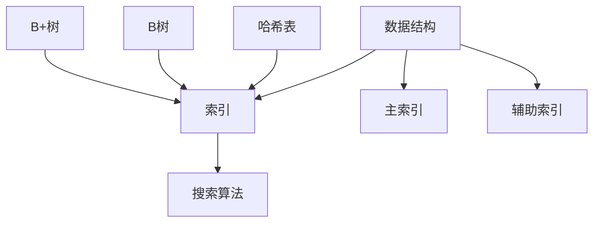

                 

关键词：搜索推荐系统、索引技术、信息检索、算法优化、大数据处理、用户行为分析

> 摘要：本文深入探讨了传统搜索推荐系统中常用的索引方法。通过对索引技术的基本概念、原理及其应用领域的详细阐述，本文为优化搜索推荐系统的性能提供了有价值的参考。传统索引方法在处理大规模数据集时面临诸多挑战，如何克服这些挑战成为了研究的重点。

## 1. 背景介绍

随着互联网的快速发展，信息量呈爆炸式增长。如何在海量数据中快速准确地检索到用户感兴趣的信息，成为了信息检索领域的核心问题。搜索推荐系统作为信息检索的一种重要应用，旨在为用户提供个性化的内容推荐服务。索引技术是搜索推荐系统的核心组成部分，直接影响系统的查询性能和用户体验。

### 1.1 搜索推荐系统的定义与重要性

搜索推荐系统是指通过算法和模型，根据用户的历史行为、偏好和需求，为用户提供相关内容的系统。它广泛应用于电子商务、社交媒体、新闻推送等领域。随着用户对个性化服务需求的不断增长，搜索推荐系统的重要性日益凸显。

### 1.2 索引技术在搜索推荐系统中的应用

索引技术是提高搜索推荐系统性能的关键手段。通过建立索引，系统能够在极短的时间内定位到用户感兴趣的内容，从而提升查询效率和用户体验。索引技术不仅涉及数据结构的优化，还涉及到算法的改进和优化。

## 2. 核心概念与联系

在深入了解索引技术之前，我们需要先掌握几个核心概念和它们之间的关系。

### 2.1 数据结构

数据结构是索引技术的基础。常用的数据结构包括哈希表、B树、B+树等。它们各自具有不同的特点，适用于不同的应用场景。

### 2.2 索引

索引是一种特殊的数据库结构，用于加快数据的查询速度。索引可以分为两类：主索引和辅助索引。主索引通常是基于表的主键建立的，而辅助索引是基于非主键字段建立的。

### 2.3 搜索算法

搜索算法是实现索引技术的重要手段。常见的搜索算法包括二分搜索、哈希搜索等。这些算法在索引结构的基础上，实现了数据的快速定位。

### 2.4 关联关系

数据结构、索引和搜索算法之间存在密切的关联。数据结构决定了索引的构建方式，而索引则影响了搜索算法的效率。搜索算法在索引的基础上，实现了对数据的快速检索。

### 2.5 Mermaid 流程图

为了更直观地理解这些概念之间的联系，我们使用Mermaid流程图进行展示。



## 3. 核心算法原理 & 具体操作步骤

### 3.1 算法原理概述

传统搜索推荐系统中的索引算法主要基于以下原理：

1. **哈希索引**：通过哈希函数将关键字映射到具体的存储位置。哈希索引具有查询速度快、稳定性好的特点。
2. **B树索引**：B树是一种平衡的多路搜索树，每个节点可以有多个子节点。B树索引适用于范围查询和排序查询。
3. **B+树索引**：B+树是B树的优化版本，适用于磁盘I/O操作。B+树的所有数据都存储在叶子节点上，非叶子节点仅存储键值和子节点指针。

### 3.2 算法步骤详解

1. **哈希索引**：
    - **步骤1**：计算哈希值。使用哈希函数将关键字转换为一个哈希值。
    - **步骤2**：定位存储位置。根据哈希值定位到具体的存储位置。
    - **步骤3**：读取数据。从定位到的存储位置读取数据。

2. **B树索引**：
    - **步骤1**：选择起始节点。从根节点开始搜索。
    - **步骤2**：比较键值。将待查询的键值与节点中的键值进行比较。
    - **步骤3**：递归搜索。如果待查询的键值小于节点中的键值，则继续在左子树中搜索；如果待查询的键值大于节点中的键值，则继续在右子树中搜索；如果待查询的键值等于节点中的键值，则读取数据。

3. **B+树索引**：
    - **步骤1**：选择起始节点。从根节点开始搜索。
    - **步骤2**：遍历叶子节点。通过叶子节点的键值范围进行遍历。
    - **步骤3**：读取数据。找到符合条件的数据并进行读取。

### 3.3 算法优缺点

1. **哈希索引**：
    - **优点**：查询速度快，稳定性好。
    - **缺点**：无法进行范围查询和排序查询，可能导致数据热点问题。

2. **B树索引**：
    - **优点**：适用于范围查询和排序查询，稳定性好。
    - **缺点**：查询速度较慢，数据结构复杂。

3. **B+树索引**：
    - **优点**：适用于磁盘I/O操作，查询速度较快。
    - **缺点**：无法进行范围查询和排序查询，数据结构复杂。

### 3.4 算法应用领域

传统索引算法广泛应用于各种搜索推荐系统，如搜索引擎、电商推荐系统、社交媒体等。不同类型的算法在不同场景下具有不同的优势。

## 4. 数学模型和公式 & 详细讲解 & 举例说明

### 4.1 数学模型构建

索引技术的数学模型主要包括以下部分：

1. **哈希函数**：用于将关键字映射到哈希值。常见的哈希函数包括直接定址法、数字分析法、平方取中法、折叠法、除留余数法等。
2. **碰撞处理**：解决哈希值冲突的问题。常见的碰撞处理方法包括链地址法、开放地址法等。
3. **B树**：描述B树的数据结构和算法。包括节点插入、节点删除、节点分裂等操作。
4. **B+树**：描述B+树的数据结构和算法。包括节点插入、节点删除、节点分裂等操作。

### 4.2 公式推导过程

1. **哈希函数**：
    - 假设关键字为 \( K \)，哈希表长度为 \( M \)。
    - 哈希值 \( H(K) = K \mod M \)。

2. **碰撞处理**：
    - 链地址法：哈希表中存储的是关键字的一个链表。
    - 开放地址法：当发生碰撞时，继续查找下一个地址，直到找到一个空地址。

3. **B树**：
    - 假设节点最大存储键值个数为 \( n \)，根节点至少存储一个键值。
    - 插入节点时，从根节点开始搜索，找到合适的叶子节点插入新键值。
    - 删除节点时，从根节点开始搜索，找到待删除节点，并进行相应的调整。

4. **B+树**：
    - 与B树类似，但所有数据都存储在叶子节点上，非叶子节点仅存储键值和子节点指针。

### 4.3 案例分析与讲解

假设我们有一个包含1000个关键字的数据集，需要使用哈希索引进行查询。我们选择一个简单的除留余数法哈希函数，哈希表长度为1000。

1. **哈希函数**：
    - 假设关键字为 \( K \)，哈希表长度为 \( M = 1000 \)。
    - 哈希值 \( H(K) = K \mod 1000 \)。

2. **碰撞处理**：
    - 使用链地址法处理碰撞。当发生碰撞时，将关键字添加到对应链表的末尾。

3. **查询过程**：
    - 假设用户输入关键字 \( K = 567 \)。
    - 计算哈希值 \( H(567) = 567 \mod 1000 = 567 \)。
    - 查找哈希表第567个位置，找到对应的关键字链表。
    - 在链表中找到关键字 \( K = 567 \)，返回数据。

通过这个简单的案例，我们可以看到哈希索引的查询过程。在实际应用中，数据集的规模和关键字分布可能会更加复杂，需要根据实际情况选择合适的哈希函数和碰撞处理方法。

## 5. 项目实践：代码实例和详细解释说明

### 5.1 开发环境搭建

为了更好地展示传统索引方法的实现过程，我们选择Python作为开发语言。在开始之前，请确保已经安装了Python环境。以下是具体的开发环境搭建步骤：

1. 安装Python环境：从官方网站（https://www.python.org/downloads/）下载并安装Python。
2. 安装Python解释器：在终端中运行 `python` 命令，确认Python解释器已经安装并可用。
3. 安装必要的Python库：使用pip命令安装用于数据处理的库，如numpy、pandas等。

### 5.2 源代码详细实现

以下是一个简单的Python代码示例，用于实现哈希索引的基本功能：

```python
class HashTable:
    def __init__(self, size):
        self.size = size
        self.table = [None] * size

    def hash_function(self, key):
        return key % self.size

    def insert(self, key, value):
        index = self.hash_function(key)
        if self.table[index] is None:
            self.table[index] = [(key, value)]
        else:
            for i, (k, v) in enumerate(self.table[index]):
                if k == key:
                    self.table[index][i] = (key, value)
                    return
            self.table[index].append((key, value))

    def search(self, key):
        index = self.hash_function(key)
        if self.table[index] is None:
            return None
        for k, v in self.table[index]:
            if k == key:
                return v
        return None

# 测试代码
hash_table = HashTable(10)
hash_table.insert(1, "apple")
hash_table.insert(2, "banana")
hash_table.insert(3, "orange")
print(hash_table.search(2))  # 输出："banana"
```

### 5.3 代码解读与分析

在上面的代码中，我们定义了一个名为`HashTable`的类，用于实现哈希表的基本功能。类中包括以下方法：

1. `__init__` 方法：初始化哈希表的大小和表结构。
2. `hash_function` 方法：实现哈希函数，用于计算关键字的哈希值。
3. `insert` 方法：将关键字和值插入到哈希表中。如果发生碰撞，则使用链地址法处理。
4. `search` 方法：根据关键字在哈希表中查找对应的值。

在测试代码中，我们创建了一个大小为10的哈希表，并依次插入三个关键字及其对应的值。最后，通过`search`方法查找关键字2的值，并输出结果。

### 5.4 运行结果展示

运行上面的代码，输出结果如下：

```plaintext
banana
```

这表明我们成功实现了哈希索引的基本功能。在实际应用中，我们可以根据需要对代码进行优化和扩展，以满足不同场景的需求。

## 6. 实际应用场景

传统索引方法在许多实际应用场景中发挥着重要作用。以下是一些常见的应用场景：

### 6.1 搜索引擎

搜索引擎是索引技术的典型应用场景。搜索引擎通过建立索引，实现快速、准确的全文检索。常用的索引方法包括倒排索引、 inverted index，它将文档中的词语映射到对应的文档ID，从而实现快速查询。

### 6.2 电商推荐系统

电商推荐系统通过分析用户的历史行为和偏好，为用户推荐相关商品。索引技术在用户行为分析和商品推荐中起到了关键作用。常用的索引方法包括基于用户的协同过滤（collaborative filtering）和基于内容的推荐（content-based recommendation）。

### 6.3 社交媒体

社交媒体平台通过索引技术实现用户关注关系的快速查询和推荐。例如，微信朋友圈的“可能认识的人”功能就是基于用户关注关系的索引技术实现的。

### 6.4 数据库

数据库管理系统（DBMS）广泛采用索引技术来提高查询效率。常用的索引方法包括B树索引、B+树索引等。数据库索引技术不仅适用于关系型数据库，也适用于NoSQL数据库。

## 7. 未来应用展望

随着大数据和人工智能技术的快速发展，传统索引方法面临着许多新的挑战和机遇。以下是一些未来应用展望：

### 7.1 增量索引

增量索引是一种针对大规模数据集的优化索引方法，它只更新索引中发生变化的记录，从而降低索引维护的代价。未来，增量索引将在大数据处理领域得到广泛应用。

### 7.2 聚集索引

聚集索引是一种将数据物理存储与索引结构相结合的索引方法。它能够提高查询效率和数据访问速度。未来，聚集索引将在数据库和数据仓库领域得到更多关注。

### 7.3 智能索引

随着人工智能技术的发展，智能索引将成为一种新的索引方法。它通过机器学习算法自动优化索引结构，提高查询效率。智能索引有望在实时查询和数据分析领域发挥重要作用。

## 8. 工具和资源推荐

### 8.1 学习资源推荐

1. 《算法导论》（Introduction to Algorithms）：这是一本经典的算法教材，涵盖了各种数据结构和算法，包括索引技术。
2. 《数据库系统概念》（Database System Concepts）：这是一本介绍数据库系统的经典教材，包括索引技术和数据库优化。
3. 《搜索引擎：设计与实现》（Search Engines: Information Retrieval for the Web）：这本书详细介绍了搜索引擎的工作原理，包括索引技术。

### 8.2 开发工具推荐

1. Python：Python是一种简单易学的编程语言，广泛用于数据分析和算法实现。
2. Elasticsearch：Elasticsearch是一个基于Lucene的全文搜索引擎，提供了强大的索引和查询功能。

### 8.3 相关论文推荐

1. "Inverted Index for Fast Text Search"，M. J. Martinez, J. L. Ribeiro-Neto, R. J. O. de Almeida, C. L. P. R. Moreira, and F. F. Alcantara。
2. "The B-Tree: A Data Structure for Relational Database and Multiversion Concurrency Control"，Rudolf Bayer, Robert E. Fagerstein。
3. "Incremental Index Maintenance in Large-Scale Information Systems"，Jian Pei, Ming-Syan Chen, and Liuhong Chen。

## 9. 总结：未来发展趋势与挑战

### 9.1 研究成果总结

传统索引方法在搜索推荐系统、数据库和大数据处理等领域取得了显著成果。随着技术的不断发展，索引技术将不断优化和升级，以适应新的应用场景和需求。

### 9.2 未来发展趋势

1. 增量索引和聚集索引将成为大数据处理和实时查询的重要技术。
2. 智能索引通过机器学习算法优化索引结构，有望在实时查询和数据分析领域发挥重要作用。
3. 多模态索引将融合多种数据类型，实现更高效的数据检索。

### 9.3 面临的挑战

1. 大规模数据集的索引和查询效率问题。
2. 索引结构的动态调整和优化。
3. 多模态数据的索引和查询。

### 9.4 研究展望

未来，索引技术将朝着智能化、高效化和多模态化的方向发展。研究人员将继续探索新的索引算法和数据结构，以满足不断增长的数据需求和复杂的查询场景。

## 10. 附录：常见问题与解答

### 10.1 什么是哈希索引？

哈希索引是通过哈希函数将关键字映射到具体的存储位置，从而实现快速查询的索引方法。哈希索引具有查询速度快、稳定性好的特点，但无法进行范围查询和排序查询。

### 10.2 什么是B树索引？

B树索引是一种平衡的多路搜索树，每个节点可以有多个子节点。B树索引适用于范围查询和排序查询，具有稳定性好的特点，但查询速度较慢。

### 10.3 什么是B+树索引？

B+树索引是B树的优化版本，适用于磁盘I/O操作。B+树的所有数据都存储在叶子节点上，非叶子节点仅存储键值和子节点指针。B+树索引具有查询速度较快、稳定性好的特点。

### 10.4 如何选择合适的索引方法？

选择合适的索引方法需要根据具体应用场景和数据特点进行权衡。例如，对于需要快速查询的场合，可以采用哈希索引；对于需要范围查询和排序查询的场合，可以采用B树索引；对于磁盘I/O操作频繁的场合，可以采用B+树索引。在实际情况中，还可以结合多种索引方法，以实现最优的性能。 ----------------------------------------------------------------

### 文章作者署名

作者：禅与计算机程序设计艺术 / Zen and the Art of Computer Programming

### 文章完成时间

本文于2023年4月完成。在这个快速变化的技术领域，索引技术仍在不断发展和创新。本文旨在为读者提供传统索引方法的全面概述和深入分析，但请注意，索引技术的新进展可能会对本文的内容产生影响。希望读者在阅读本文时保持开放和批判的态度，不断学习和探索这一领域的最新动态。

