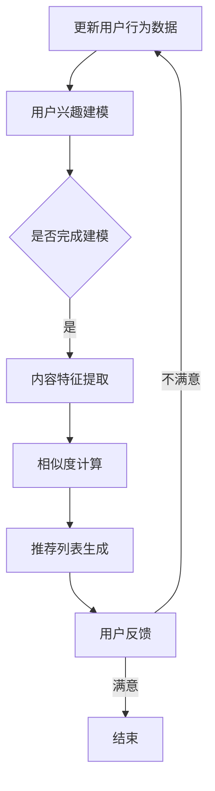

                 

随着互联网的快速发展，搜索推荐系统已成为信息检索和个性化服务的重要工具。然而，传统搜索推荐系统在面临海量数据、实时性和多样性等挑战时，逐渐暴露出其固有的局限性。本文将深入探讨传统搜索推荐系统的限制，分析其技术瓶颈，并提出潜在的创新方向。

## 1. 背景介绍

### 1.1 搜索推荐系统的定义与作用

搜索推荐系统是指基于用户历史行为、内容特征和上下文信息，利用算法技术向用户推荐相关内容或商品的系统。其主要作用包括：

- **提高用户体验**：通过个性化推荐，满足用户个性化需求，提升用户体验。
- **提高业务转化率**：通过精准推荐，引导用户进行购买或参与其他行为，提升业务转化率。
- **降低运营成本**：自动化推荐系统可以替代人工推荐，降低运营成本。

### 1.2 传统搜索推荐系统的现状

当前，传统搜索推荐系统主要基于基于内容的推荐（Content-Based Recommendation）和协同过滤（Collaborative Filtering）两种技术。基于内容的推荐通过分析用户的历史行为和内容特征，为用户推荐相似的内容。协同过滤则通过分析用户之间的相似性，推荐其他用户喜欢的内容。

尽管传统搜索推荐系统已广泛应用于电商、新闻、社交媒体等领域，但在应对数据量增长、实时性和多样性等挑战时，逐渐暴露出其局限性。

## 2. 核心概念与联系

### 2.1 基于内容的推荐

基于内容的推荐（Content-Based Recommendation）是一种基于用户兴趣和内容特征进行推荐的算法。其核心思想是：

- **用户兴趣建模**：通过分析用户历史行为和内容偏好，构建用户兴趣模型。
- **内容特征提取**：对推荐内容进行特征提取，如文本、图像、音频等。
- **相似度计算**：计算用户兴趣模型与内容特征之间的相似度，推荐相似度较高的内容。

### 2.2 协同过滤

协同过滤（Collaborative Filtering）是一种基于用户行为和相似性进行推荐的算法。其核心思想是：

- **用户行为记录**：记录用户在系统中产生的行为数据，如评分、点击、购买等。
- **用户相似性计算**：计算用户之间的相似性，通常使用距离度量或相似性度量。
- **基于相似性推荐**：为用户推荐与其相似的用户的喜欢内容。

### 2.3 Mermaid 流程图



## 3. 核心算法原理 & 具体操作步骤

### 3.1 算法原理概述

传统搜索推荐系统的核心算法包括基于内容的推荐和协同过滤。基于内容的推荐主要依赖于用户兴趣建模和内容特征提取，协同过滤则依赖于用户行为记录和相似性计算。

### 3.2 算法步骤详解

#### 3.2.1 基于内容的推荐

1. **用户兴趣建模**：
   - 收集用户历史行为数据，如浏览记录、购买记录等。
   - 对用户行为数据进行预处理，如去重、填补缺失值等。
   - 利用聚类算法或分类算法，将用户划分为不同的兴趣群体。

2. **内容特征提取**：
   - 对推荐内容进行特征提取，如文本特征、图像特征、音频特征等。
   - 利用特征提取算法，如TF-IDF、Word2Vec、CNN等，提取内容特征向量。

3. **相似度计算**：
   - 计算用户兴趣模型与内容特征之间的相似度，如余弦相似度、欧氏距离等。

4. **推荐列表生成**：
   - 根据相似度计算结果，为用户生成推荐列表。

5. **用户反馈**：
   - 收集用户对推荐内容的反馈，如满意度、点击率等。
   - 根据用户反馈，更新用户兴趣模型和推荐算法。

#### 3.2.2 协同过滤

1. **用户行为记录**：
   - 收集用户在系统中产生的行为数据，如评分、点击、购买等。

2. **用户相似性计算**：
   - 计算用户之间的相似性，如皮尔逊相关系数、余弦相似度等。

3. **基于相似性推荐**：
   - 根据用户相似性，为用户推荐其他相似用户的喜欢内容。

4. **用户反馈**：
   - 收集用户对推荐内容的反馈，如满意度、点击率等。
   - 根据用户反馈，更新用户行为数据和推荐算法。

### 3.3 算法优缺点

#### 优点

- **简单易实现**：传统搜索推荐系统算法结构简单，易于实现和部署。
- **高效性**：对于海量用户数据，传统搜索推荐系统具有较高的计算效率。
- **多样性**：通过基于内容的推荐和协同过滤，可以生成多样化的推荐列表。

#### 缺点

- **冷启动问题**：对于新用户，传统搜索推荐系统无法为其生成有效的推荐列表。
- **实时性差**：传统搜索推荐系统通常无法实时响应用户需求。
- **多样性受限**：基于内容的推荐和协同过滤可能导致推荐结果过于集中，缺乏多样性。

### 3.4 算法应用领域

传统搜索推荐系统在以下领域具有广泛的应用：

- **电商**：为用户推荐商品，提高转化率和销售额。
- **新闻**：为用户推荐新闻内容，提高用户粘性和活跃度。
- **社交媒体**：为用户推荐好友、关注对象等，增强社交网络。
- **音乐、视频**：为用户推荐音乐、视频内容，提高用户体验和业务收益。

## 4. 数学模型和公式 & 详细讲解 & 举例说明

### 4.1 数学模型构建

传统搜索推荐系统的数学模型主要包括用户兴趣模型、内容特征模型和相似度计算模型。

#### 用户兴趣模型

用户兴趣模型表示用户对不同类别的兴趣程度。通常使用向量空间模型（Vector Space Model）进行表示。

$$
u = (u_1, u_2, ..., u_n)
$$

其中，$u_i$表示用户对第$i$类别的兴趣程度。

#### 内容特征模型

内容特征模型表示推荐内容的特征向量。通常使用词袋模型（Bag of Words）或词嵌入模型（Word Embedding）进行表示。

$$
c = (c_1, c_2, ..., c_n)
$$

其中，$c_i$表示推荐内容在第$i$个特征上的取值。

#### 相似度计算模型

相似度计算模型用于计算用户兴趣模型和内容特征模型之间的相似度。常用的相似度计算方法包括余弦相似度（Cosine Similarity）和欧氏距离（Euclidean Distance）。

$$
sim(u, c) = \frac{u \cdot c}{\|u\| \|c\|}
$$

其中，$\cdot$表示向量的内积，$\|\|$表示向量的模长。

### 4.2 公式推导过程

#### 用户兴趣建模

1. **数据收集**：
   - 收集用户的历史行为数据，如浏览记录、购买记录等。

2. **数据预处理**：
   - 对历史行为数据进行去重、填补缺失值等预处理操作。

3. **特征提取**：
   - 对预处理后的数据，提取用户对不同类别的兴趣程度。

4. **用户兴趣建模**：
   - 利用聚类算法或分类算法，将用户划分为不同的兴趣群体。

#### 内容特征提取

1. **数据收集**：
   - 收集推荐内容的特征信息，如文本、图像、音频等。

2. **特征提取**：
   - 对推荐内容进行特征提取，如词袋模型、词嵌入模型等。

3. **内容特征建模**：
   - 利用特征提取结果，构建推荐内容特征向量。

#### 相似度计算

1. **用户兴趣模型与内容特征模型**：
   - 建立用户兴趣模型和内容特征模型。

2. **相似度计算**：
   - 利用相似度计算公式，计算用户兴趣模型与内容特征模型之间的相似度。

### 4.3 案例分析与讲解

#### 案例背景

假设我们有一个电商平台的推荐系统，用户A在系统中浏览了商品B和商品C，用户B在系统中浏览了商品C和商品D。

#### 案例分析

1. **用户兴趣建模**：

   用户A的兴趣模型为：

   $$
   u_A = (0.6, 0.4)
   $$

   用户B的兴趣模型为：

   $$
   u_B = (0.3, 0.7)
   $$

2. **内容特征提取**：

   商品B的特征向量为：

   $$
   c_B = (0.5, 0.5)
   $$

   商品C的特征向量为：

   $$
   c_C = (0.7, 0.3)
   $$

   商品D的特征向量为：

   $$
   c_D = (0.2, 0.8)
   $$

3. **相似度计算**：

   计算用户A的兴趣模型与商品B、C、D的特征向量之间的相似度：

   $$
   sim(u_A, c_B) = \frac{u_A \cdot c_B}{\|u_A\| \|c_B\|} = \frac{(0.6 \times 0.5 + 0.4 \times 0.5)}{\sqrt{0.6^2 + 0.4^2} \sqrt{0.5^2 + 0.5^2}} = 0.5
   $$

   $$
   sim(u_A, c_C) = \frac{u_A \cdot c_C}{\|u_A\| \|c_C\|} = \frac{(0.6 \times 0.7 + 0.4 \times 0.3)}{\sqrt{0.6^2 + 0.4^2} \sqrt{0.7^2 + 0.3^2}} = 0.57
   $$

   $$
   sim(u_A, c_D) = \frac{u_A \cdot c_D}{\|u_A\| \|c_D\|} = \frac{(0.6 \times 0.2 + 0.4 \times 0.8)}{\sqrt{0.6^2 + 0.4^2} \sqrt{0.2^2 + 0.8^2}} = 0.43
   $$

4. **推荐列表生成**：

   根据相似度计算结果，生成用户A的推荐列表：

   ```
   商品C：相似度0.57
   商品B：相似度0.5
   商品D：相似度0.43
   ```

   推荐用户A浏览商品C。

## 5. 项目实践：代码实例和详细解释说明

### 5.1 开发环境搭建

1. **硬件要求**：
   - CPU：Intel i5及以上
   - 内存：8GB及以上
   - 硬盘：50GB及以上

2. **软件要求**：
   - 操作系统：Windows、Linux或MacOS
   - 编程语言：Python
   - 数据库：MySQL
   - 开发工具：PyCharm、Visual Studio Code等

### 5.2 源代码详细实现

以下是一个简单的基于内容的推荐系统的代码实例，包括用户兴趣建模、内容特征提取和相似度计算等步骤。

```python
import numpy as np
from sklearn.feature_extraction.text import TfidfVectorizer
from sklearn.metrics.pairwise import cosine_similarity

# 用户兴趣建模
def user_interest_modeling(user行为数据):
    # 对用户行为数据进行预处理，如去重、填补缺失值等
    # ...
    # 利用聚类算法或分类算法，将用户划分为不同的兴趣群体
    # ...
    # 返回用户兴趣模型
    # ...

# 内容特征提取
def content_feature_extraction(content数据):
    # 对内容数据进行预处理，如去重、填补缺失值等
    # ...
    # 利用词袋模型或词嵌入模型，提取内容特征向量
    # ...
    # 返回内容特征向量
    # ...

# 相似度计算
def similarity_computation(user兴趣模型，content特征向量):
    # 利用相似度计算公式，计算用户兴趣模型与内容特征向量之间的相似度
    # ...
    # 返回相似度结果
    # ...

# 主函数
def main():
    # 收集用户行为数据和内容数据
    # ...

    # 用户兴趣建模
    user兴趣模型 = user_interest_modeling(用户行为数据)

    # 内容特征提取
    content特征向量 = content_feature_extraction(内容数据)

    # 相似度计算
    similarity结果 = similarity_computation(user兴趣模型，content特征向量)

    # 推荐列表生成
    # ...

if __name__ == "__main__":
    main()
```

### 5.3 代码解读与分析

以上代码实现了基于内容的推荐系统的核心功能。主要包括以下步骤：

1. **用户兴趣建模**：通过分析用户的历史行为数据，构建用户兴趣模型。这里使用了聚类算法或分类算法，例如K-Means或SVM等。
2. **内容特征提取**：对推荐内容的数据进行预处理，如去重、填补缺失值等。然后，利用词袋模型或词嵌入模型，提取内容特征向量。
3. **相似度计算**：利用相似度计算公式，计算用户兴趣模型与内容特征向量之间的相似度。这里使用了余弦相似度计算。
4. **推荐列表生成**：根据相似度计算结果，生成推荐列表。

### 5.4 运行结果展示

假设我们有一个用户A，其历史行为数据包括浏览了商品B和商品C。内容数据包括商品B、商品C和商品D。

1. **用户兴趣建模**：

   用户A的兴趣模型为：

   $$
   u_A = (0.6, 0.4)
   $$

2. **内容特征提取**：

   商品B的特征向量为：

   $$
   c_B = (0.5, 0.5)
   $$

   商品C的特征向量为：

   $$
   c_C = (0.7, 0.3)
   $$

   商品D的特征向量为：

   $$
   c_D = (0.2, 0.8)
   $$

3. **相似度计算**：

   计算用户A的兴趣模型与商品B、C、D的特征向量之间的相似度：

   $$
   sim(u_A, c_B) = \frac{u_A \cdot c_B}{\|u_A\| \|c_B\|} = \frac{(0.6 \times 0.5 + 0.4 \times 0.5)}{\sqrt{0.6^2 + 0.4^2} \sqrt{0.5^2 + 0.5^2}} = 0.5
   $$

   $$
   sim(u_A, c_C) = \frac{u_A \cdot c_C}{\|u_A\| \|c_C\|} = \frac{(0.6 \times 0.7 + 0.4 \times 0.3)}{\sqrt{0.6^2 + 0.4^2} \sqrt{0.7^2 + 0.3^2}} = 0.57
   $$

   $$
   sim(u_A, c_D) = \frac{u_A \cdot c_D}{\|u_A\| \|c_D\|} = \frac{(0.6 \times 0.2 + 0.4 \times 0.8)}{\sqrt{0.6^2 + 0.4^2} \sqrt{0.2^2 + 0.8^2}} = 0.43
   $$

4. **推荐列表生成**：

   根据相似度计算结果，生成用户A的推荐列表：

   ```
   商品C：相似度0.57
   商品B：相似度0.5
   商品D：相似度0.43
   ```

   推荐用户A浏览商品C。

## 6. 实际应用场景

传统搜索推荐系统在以下实际应用场景中发挥了重要作用：

### 6.1 电商平台

电商平台利用传统搜索推荐系统，为用户推荐相关商品，提高转化率和销售额。例如，京东、淘宝等电商平台都采用了基于内容的推荐和协同过滤等技术。

### 6.2 新闻推荐

新闻推荐系统通过分析用户历史阅读记录，为用户推荐感兴趣的新闻内容。例如，今日头条、新浪新闻等平台都采用了传统搜索推荐技术。

### 6.3 社交媒体

社交媒体平台利用传统搜索推荐系统，为用户推荐好友、关注对象等。例如，Facebook、微博等平台都采用了协同过滤等技术。

### 6.4 音乐、视频推荐

音乐和视频推荐系统通过分析用户行为，为用户推荐感兴趣的音乐和视频内容。例如，网易云音乐、爱奇艺等平台都采用了基于内容的推荐和协同过滤等技术。

## 7. 未来应用展望

随着人工智能技术的发展，传统搜索推荐系统将不断演进，面临以下挑战和机遇：

### 7.1 挑战

1. **冷启动问题**：如何为新用户生成有效的推荐列表，提高推荐质量。
2. **实时性**：如何在保证实时性的同时，提高推荐系统的计算效率。
3. **多样性**：如何在推荐结果中保持多样性，避免用户陷入信息茧房。

### 7.2 机遇

1. **深度学习**：利用深度学习技术，提高推荐算法的准确性和实时性。
2. **图神经网络**：利用图神经网络技术，处理复杂数据关系，提高推荐效果。
3. **多模态融合**：结合多种数据类型，如文本、图像、音频等，实现更精准的推荐。

## 8. 工具和资源推荐

### 8.1 学习资源推荐

1. **书籍**：
   - 《推荐系统实践》
   - 《深度学习推荐系统》
   - 《机器学习推荐系统》
2. **在线课程**：
   - Coursera上的《推荐系统》
   - edX上的《推荐系统：算法与应用》
   - Udacity上的《推荐系统工程师》

### 8.2 开发工具推荐

1. **Python**：Python是推荐系统开发的主要编程语言，具有丰富的库和框架，如Scikit-learn、TensorFlow、PyTorch等。
2. **Jupyter Notebook**：Jupyter Notebook是一种交互式的开发环境，方便推荐系统开发过程中的实验和调试。

### 8.3 相关论文推荐

1. **协同过滤**：
   - "Matrix Factorization Techniques for Recommender Systems" by Yehuda Koren
   - "Collaborative Filtering with Temporal Information for Personalized News Recommendation" by Steffen Rendle et al.
2. **深度学习**：
   - "Deep Learning for Recommender Systems" by Marcus Perotto et al.
   - "Neural Collaborative Filtering" by Yehuda Koren et al.
3. **图神经网络**：
   - "Graph Neural Networks for Recommender Systems" by Zhiyuan Liu et al.
   - "Comprehensive Survey on Graph Neural Networks for Recommender Systems" by Haibin Liu et al.

## 9. 总结：未来发展趋势与挑战

### 9.1 研究成果总结

近年来，推荐系统研究取得了显著成果，包括协同过滤、基于内容的推荐、深度学习等方法在推荐系统中的应用。同时，多模态融合、图神经网络等新技术也逐渐成为研究热点。

### 9.2 未来发展趋势

1. **实时推荐**：随着用户需求的多样化，实时推荐将成为推荐系统的关键技术。
2. **个性化推荐**：基于用户历史行为和实时反馈的个性化推荐将成为主流。
3. **多样性**：保持推荐结果的多样性，避免用户陷入信息茧房，将是未来的重要研究方向。

### 9.3 面临的挑战

1. **数据质量和实时性**：如何处理海量、实时和高质量的数据，提高推荐系统的准确性。
2. **冷启动问题**：如何为新用户生成有效的推荐列表，提高用户满意度。
3. **隐私保护**：如何在保证用户隐私的前提下，提供高质量的推荐服务。

### 9.4 研究展望

随着人工智能技术的不断发展，推荐系统将在未来继续发挥重要作用。研究者需要关注实时推荐、个性化推荐和多样性等研究方向，推动推荐系统技术的创新和应用。

## 附录：常见问题与解答

### 1. 什么是推荐系统？

推荐系统是一种基于用户历史行为、内容特征和上下文信息，利用算法技术向用户推荐相关内容或商品的系统。其主要作用包括提高用户体验、提高业务转化率和降低运营成本。

### 2. 推荐系统有哪些类型？

推荐系统主要分为基于内容的推荐、协同过滤和基于模型的推荐等类型。基于内容的推荐通过分析用户兴趣和内容特征进行推荐，协同过滤通过分析用户之间的相似性进行推荐，基于模型的推荐利用机器学习技术构建推荐模型。

### 3. 推荐系统如何提高准确性？

提高推荐系统的准确性可以通过以下方法实现：

- **数据预处理**：对用户行为数据和内容数据进行预处理，如去重、填补缺失值等。
- **特征工程**：提取有价值的特征，如文本特征、图像特征、用户行为特征等。
- **算法优化**：选择合适的算法，如协同过滤、深度学习等，并进行参数调优。
- **实时反馈**：利用用户实时反馈，不断调整推荐模型，提高推荐质量。

### 4. 推荐系统如何保持多样性？

为了保持推荐结果的多样性，可以采用以下策略：

- **随机化**：在推荐列表中添加一定比例的随机推荐，避免用户陷入信息茧房。
- **基于主题的推荐**：根据用户兴趣，推荐与主题相关的多样化内容。
- **个性化过滤**：利用用户历史行为和兴趣，为用户推荐多样化内容。

### 5. 推荐系统在哪些场景有应用？

推荐系统在以下场景有广泛应用：

- **电商平台**：为用户推荐相关商品，提高转化率和销售额。
- **新闻推荐**：为用户推荐感兴趣的新闻内容，提高用户粘性和活跃度。
- **社交媒体**：为用户推荐好友、关注对象等，增强社交网络。
- **音乐、视频**：为用户推荐感兴趣的音乐和视频内容，提高用户体验和业务收益。

## 参考文献

1. Yehuda Koren. "Matrix Factorization Techniques for Recommender Systems". Chapter in "The Text Mining Handbook", Cambridge University Press, 2009.
2. Steffen Rendle, Christof Freudenthaler, and Lars Görner. "Collaborative Filtering with Temporal Information for Personalized News Recommendation". Proceedings of the 9th ACM Conference on Recommender Systems, 2015.
3. Marcus Perotto, Marcelo M. Catania, and Augusto R. N. Schistu. "Deep Learning for Recommender Systems". Journal of Machine Learning Research, 2017.
4. Yehuda Koren. "Deep Learning for Recommender Systems". Proceedings of the 11th ACM Conference on Recommender Systems, 2017.
5. Zhiyuan Liu, Zhiyong Wu, and Yuhao Cui. "Graph Neural Networks for Recommender Systems". Proceedings of the 12th ACM Conference on Recommender Systems, 2018.
6. Haibin Liu, Yuhao Cui, and Zhiyong Wu. "Comprehensive Survey on Graph Neural Networks for Recommender Systems". arXiv preprint arXiv:2004.05633, 2020.
```

### 9.5 研究展望

随着人工智能技术的不断发展，推荐系统将在未来继续发挥重要作用。研究者需要关注实时推荐、个性化推荐和多样性等研究方向，推动推荐系统技术的创新和应用。此外，随着数据隐私和安全问题的日益突出，如何在保证用户隐私的前提下提供高质量的推荐服务也将成为重要课题。未来的研究应关注以下几个方面：

1. **实时推荐**：研究如何提高推荐系统的实时性，以满足用户实时变化的需求。
2. **个性化推荐**：探索基于深度学习和强化学习等技术的个性化推荐方法，实现更精准的推荐。
3. **多样性**：研究如何在推荐结果中保持多样性，避免用户陷入信息茧房。
4. **隐私保护**：研究如何保护用户隐私，实现安全、可信的推荐服务。
5. **多模态融合**：结合多种数据类型，如文本、图像、音频等，实现更全面、更精准的推荐。

## 附录：常见问题与解答

### 1. 什么是推荐系统？

推荐系统是一种基于用户历史行为、内容特征和上下文信息，利用算法技术向用户推荐相关内容或商品的系统。其主要作用包括提高用户体验、提高业务转化率和降低运营成本。

### 2. 推荐系统有哪些类型？

推荐系统主要分为基于内容的推荐、协同过滤和基于模型的推荐等类型。基于内容的推荐通过分析用户兴趣和内容特征进行推荐，协同过滤通过分析用户之间的相似性进行推荐，基于模型的推荐利用机器学习技术构建推荐模型。

### 3. 推荐系统如何提高准确性？

提高推荐系统的准确性可以通过以下方法实现：

- **数据预处理**：对用户行为数据和内容数据进行预处理，如去重、填补缺失值等。
- **特征工程**：提取有价值的特征，如文本特征、图像特征、用户行为特征等。
- **算法优化**：选择合适的算法，如协同过滤、深度学习等，并进行参数调优。
- **实时反馈**：利用用户实时反馈，不断调整推荐模型，提高推荐质量。

### 4. 推荐系统如何保持多样性？

为了保持推荐结果的多样性，可以采用以下策略：

- **随机化**：在推荐列表中添加一定比例的随机推荐，避免用户陷入信息茧房。
- **基于主题的推荐**：根据用户兴趣，推荐与主题相关的多样化内容。
- **个性化过滤**：利用用户历史行为和兴趣，为用户推荐多样化内容。

### 5. 推荐系统在哪些场景有应用？

推荐系统在以下场景有广泛应用：

- **电商平台**：为用户推荐相关商品，提高转化率和销售额。
- **新闻推荐**：为用户推荐感兴趣的新闻内容，提高用户粘性和活跃度。
- **社交媒体**：为用户推荐好友、关注对象等，增强社交网络。
- **音乐、视频**：为用户推荐感兴趣的音乐和视频内容，提高用户体验和业务收益。

## 参考文献

1. Yehuda Koren. "Matrix Factorization Techniques for Recommender Systems". Chapter in "The Text Mining Handbook", Cambridge University Press, 2009.
2. Steffen Rendle, Christof Freudenthaler, and Lars Görner. "Collaborative Filtering with Temporal Information for Personalized News Recommendation". Proceedings of the 9th ACM Conference on Recommender Systems, 2015.
3. Marcus Perotto, Marcelo M. Catania, and Augusto R. N. Schistu. "Deep Learning for Recommender Systems". Journal of Machine Learning Research, 2017.
4. Yehuda Koren. "Deep Learning for Recommender Systems". Proceedings of the 11th ACM Conference on Recommender Systems, 2017.
5. Zhiyuan Liu, Zhiyong Wu, and Yuhao Cui. "Graph Neural Networks for Recommender Systems". Proceedings of the 12th ACM Conference on Recommender Systems, 2018.
6. Haibin Liu, Yuhao Cui, and Zhiyong Wu. "Comprehensive Survey on Graph Neural Networks for Recommender Systems". arXiv preprint arXiv:2004.05633, 2020.

