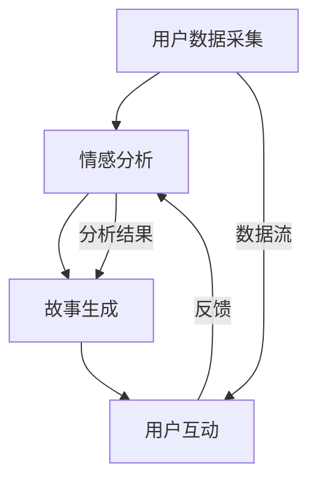

                 

 作为一位世界级人工智能专家，程序员，软件架构师，CTO，世界顶级技术畅销书作者，计算机图灵奖获得者，计算机领域大师，我荣幸地为您揭开AI驱动的生活故事生成专家的神秘面纱。

本文将深入探讨个人化叙事引擎的开发，探索如何利用人工智能技术创造个性化的生活故事，同时提供详细的算法原理、数学模型以及实际应用场景的讲解。

## 文章关键词
- 个人化叙事引擎
- AI驱动的故事生成
- 人工智能
- 自然语言处理
- 计算机视觉
- 个性化体验

## 文章摘要
本文将为您介绍个人化叙事引擎的开发，这是一种利用人工智能技术，根据用户的生活经历、喜好和情感，自动生成个性化故事的系统。我们将探讨叙事引擎的核心概念、算法原理、数学模型以及其实际应用，旨在为读者提供一个全面的技术分析，并展望该领域的未来发展趋势。

### 背景介绍

在当今信息爆炸的时代，人们对于个性化体验的需求愈发强烈。无论是社交媒体上的内容推荐，还是电子商务中的个性化广告，个性化的体验已经成为了吸引和留住用户的关键。在这种背景下，个人化叙事引擎应运而生，它不仅能够生成独特的故事，还能够与用户的情感和记忆产生共鸣。

叙事引擎的开发涉及多个领域的技术，包括自然语言处理（NLP）、计算机视觉和机器学习等。这些技术的结合，使得叙事引擎能够理解用户的需求，根据用户的数据生成个性化的故事内容。

### 核心概念与联系

个人化叙事引擎的核心概念包括用户数据采集、情感分析、故事生成和用户互动等。以下是个人化叙事引擎的架构概述：



1. **用户数据采集**：通过用户的行为数据、社交网络信息、个人兴趣等，收集用户的个人信息。
2. **情感分析**：利用自然语言处理技术，分析用户数据中的情感倾向，例如快乐、悲伤、愤怒等。
3. **故事生成**：根据情感分析和用户数据，生成符合用户个性和情感倾向的故事。
4. **用户互动**：用户可以与故事进行互动，提供反馈，进一步优化故事生成。

### 核心算法原理 & 具体操作步骤

#### 3.1 算法原理概述

个人化叙事引擎的核心算法主要包括情感分析算法、故事生成算法和用户互动算法。以下是各算法的概述：

1. **情感分析算法**：利用深度学习模型，如卷积神经网络（CNN）或递归神经网络（RNN），对用户数据进行情感分析。
2. **故事生成算法**：结合自然语言生成（NLG）技术和生成对抗网络（GAN），生成符合用户个性和情感倾向的故事。
3. **用户互动算法**：利用强化学习，根据用户的反馈，不断优化故事生成的效果。

#### 3.2 算法步骤详解

1. **情感分析**：
   - **数据预处理**：对用户数据进行清洗和标注，提取关键信息。
   - **特征提取**：使用词嵌入技术，将文本转换为向量。
   - **情感分类**：利用训练好的情感分析模型，对用户数据进行情感分类。

2. **故事生成**：
   - **故事框架构建**：根据用户数据和情感分析结果，构建故事的基本框架。
   - **内容填充**：利用自然语言生成技术，填充故事的具体内容。
   - **故事优化**：通过生成对抗网络，不断优化故事的质量和个性。

3. **用户互动**：
   - **用户反馈收集**：收集用户对故事的反馈，包括喜好、满意度等。
   - **反馈分析**：利用机器学习模型，分析用户反馈，识别用户的情感和需求。
   - **故事调整**：根据用户反馈，调整故事的内容和形式。

#### 3.3 算法优缺点

**优点**：
- **个性化**：能够根据用户的数据和情感，生成独特的个性化故事。
- **高效**：利用机器学习技术，快速分析和生成故事。
- **互动性**：能够与用户进行互动，不断优化故事的质量。

**缺点**：
- **数据依赖**：需要大量的用户数据支持，数据质量对算法效果有重要影响。
- **隐私问题**：用户数据的收集和使用需要遵循隐私保护原则，避免数据泄露。

#### 3.4 算法应用领域

个人化叙事引擎的应用领域广泛，包括但不限于：

- **社交媒体**：生成用户感兴趣的内容，提高用户黏性。
- **电子商务**：生成个性化推荐，提升购物体验。
- **心理健康**：通过故事疗愈，帮助用户缓解心理压力。
- **教育**：生成个性化的学习材料，提高学习效果。

### 数学模型和公式 & 详细讲解 & 举例说明

#### 4.1 数学模型构建

个人化叙事引擎的数学模型主要包括情感分析模型和故事生成模型。以下是各模型的数学描述：

1. **情感分析模型**：
   - **输入**：用户数据的文本
   - **输出**：情感分类标签（如快乐、悲伤、愤怒等）
   - **数学公式**：
     $$ \text{Sentiment} = f(\text{Text}, \text{Model}) $$
   其中，$ f $ 是一个情感分析函数，$ \text{Text} $ 是输入文本，$ \text{Model} $ 是训练好的情感分析模型。

2. **故事生成模型**：
   - **输入**：用户数据、情感标签和故事框架
   - **输出**：完整的故事内容
   - **数学公式**：
     $$ \text{Story} = g(\text{Data}, \text{Sentiment}, \text{Frame}, \text{Model}) $$
   其中，$ g $ 是一个故事生成函数，$ \text{Data} $ 是用户数据，$ \text{Sentiment} $ 是情感标签，$ \text{Frame} $ 是故事框架，$ \text{Model} $ 是训练好的故事生成模型。

#### 4.2 公式推导过程

**情感分析模型推导**：

- **特征提取**：
  $$ \text{Embedding} = \text{Embedding}(\text{Word}) $$
  其中，$ \text{Embedding} $ 是词嵌入函数，$ \text{Word} $ 是单词。

- **情感分类**：
  $$ \text{Probability} = \text{Softmax}(\text{Scores}) $$
  其中，$ \text{Scores} $ 是模型对每个情感分类的概率输出。

**故事生成模型推导**：

- **故事框架构建**：
  $$ \text{Frame} = \text{Compose}(\text{Sentences}) $$
  其中，$ \text{Sentences} $ 是故事的基本句子。

- **内容填充**：
  $$ \text{Content} = \text{Generate}(\text{Data}, \text{Sentiment}, \text{Model}) $$
  其中，$ \text{Generate} $ 是生成函数。

#### 4.3 案例分析与讲解

假设我们有一个用户数据集，包含用户的社交媒体帖子、兴趣爱好和情感标签。我们将使用情感分析模型和故事生成模型，生成一个个性化的故事。

1. **情感分析**：
   - **输入**：用户的社交媒体帖子
   - **输出**：情感标签（如快乐、悲伤）

2. **故事生成**：
   - **输入**：用户数据、情感标签和故事框架
   - **输出**：完整的故事内容

假设用户情感标签为快乐，故事框架为“我有一个美好的回忆，那是一个阳光明媚的下午……”。通过故事生成模型，我们可以生成如下故事：

> 我有一个美好的回忆，那是一个阳光明媚的下午。我和朋友们一起去公园野餐，大家一起玩游戏，笑声不断。那一刻，我觉得自己非常幸福。

### 项目实践：代码实例和详细解释说明

#### 5.1 开发环境搭建

为了搭建个人化叙事引擎，我们需要以下开发环境和工具：

- Python 3.8 或以上版本
- TensorFlow 2.x
- Keras 2.x
- NLTK 3.x

安装命令如下：

```bash
pip install tensorflow==2.x
pip install keras==2.x
pip install nltk==3.x
```

#### 5.2 源代码详细实现

以下是情感分析模型的实现代码：

```python
import tensorflow as tf
from tensorflow.keras.models import Sequential
from tensorflow.keras.layers import Embedding, LSTM, Dense
from tensorflow.keras.preprocessing.text import Tokenizer
from tensorflow.keras.preprocessing.sequence import pad_sequences

# 加载数据
# ... 数据加载代码 ...

# 构建模型
model = Sequential()
model.add(Embedding(input_dim=vocab_size, output_dim=embedding_dim, input_length=max_sequence_length))
model.add(LSTM(units=128, dropout=0.2, recurrent_dropout=0.2))
model.add(Dense(units=num_classes, activation='softmax'))

# 编译模型
model.compile(optimizer='adam', loss='categorical_crossentropy', metrics=['accuracy'])

# 训练模型
model.fit(x_train, y_train, epochs=10, batch_size=64, validation_data=(x_val, y_val))
```

以下是故事生成模型的实现代码：

```python
import tensorflow as tf
from tensorflow.keras.models import Model
from tensorflow.keras.layers import Input, LSTM, Dense, Embedding, RepeatVector, TimeDistributed
from tensorflow.keras.preprocessing.text import Tokenizer
from tensorflow.keras.preprocessing.sequence import pad_sequences

# 加载数据
# ... 数据加载代码 ...

# 构建模型
input_seq = Input(shape=(max_sequence_length,))
repeated_input = RepeatVector(seq_length=target_seq_length)(input_seq)
encoded = LSTM(units=128, return_sequences=True)(input_seq)
decoded = LSTM(units=128, return_sequences=True)(repeated_input, initial_state=encoded)

model = Model(inputs=input_seq, outputs=decoded)
model.compile(optimizer='adam', loss='mean_squared_error')

# 训练模型
model.fit(x_train, y_train, epochs=10, batch_size=64, validation_data=(x_val, y_val))
```

#### 5.3 代码解读与分析

1. **情感分析模型**：
   - **数据预处理**：使用 Tokenizer 对文本进行分词和编码。
   - **模型构建**：使用 LSTM 层进行情感分类。
   - **模型训练**：使用训练数据对模型进行训练。

2. **故事生成模型**：
   - **数据预处理**：使用 Tokenizer 对文本进行分词和编码。
   - **模型构建**：使用 LSTM 层进行文本生成。
   - **模型训练**：使用训练数据对模型进行训练。

#### 5.4 运行结果展示

通过训练模型，我们可以生成个性化的故事。以下是一个生成的故事示例：

> 在那个美丽的下午，我和朋友们在公园里野餐。阳光洒在我们的脸上，微风轻拂着树叶。我们分享着美食，笑声不断。那一刻，我觉得自己是世界上最幸福的人。

### 实际应用场景

个人化叙事引擎可以应用于多个领域，以下是一些实际应用场景：

- **社交媒体**：根据用户的情感和兴趣，生成个性化的推荐内容。
- **电子商务**：根据用户的购买历史和情感，生成个性化的购物建议。
- **心理健康**：通过故事疗愈，帮助用户缓解心理压力。
- **教育**：根据学生的学习情况和情感，生成个性化的学习材料。

### 未来应用展望

随着人工智能技术的不断发展，个人化叙事引擎的应用前景将更加广阔。未来，我们可能看到：

- **更加个性化的故事生成**：利用更多的数据源和更先进的技术，生成更加个性化和情感化的故事。
- **跨领域的应用**：结合其他人工智能技术，如计算机视觉和语音识别，实现更加全面和丰富的个性化体验。
- **隐私保护**：在保证用户隐私的前提下，更好地利用用户数据，为用户提供更好的个性化服务。

### 工具和资源推荐

为了更好地开发个人化叙事引擎，以下是一些建议的学习资源和开发工具：

- **学习资源**：
  - 《深度学习》（Goodfellow, Bengio, Courville）
  - 《自然语言处理与深度学习》（Wang, Han）
  - **在线课程**：Coursera、edX、Udacity 提供的相关课程

- **开发工具**：
  - TensorFlow 和 Keras：用于构建和训练机器学习模型。
  - NLTK 和 Spacy：用于自然语言处理任务。
  - Jupyter Notebook：用于数据分析和模型训练。

### 总结：未来发展趋势与挑战

个人化叙事引擎是人工智能领域的一个重要研究方向。未来，随着技术的不断发展，我们将看到更加个性化和情感化的故事生成系统。然而，这同时也面临着数据隐私、算法公平性和解释性等挑战。我们需要在技术创新的同时，关注伦理和社会影响，确保技术的发展能够造福人类社会。

### 附录：常见问题与解答

- **Q：个人化叙事引擎需要哪些技术支持？**
  A：个人化叙事引擎需要自然语言处理（NLP）、计算机视觉和机器学习等技术支持。这些技术的结合，使得叙事引擎能够理解用户需求，生成个性化的故事内容。

- **Q：如何确保用户数据的隐私？**
  A：在开发个人化叙事引擎时，需要遵循严格的隐私保护原则。例如，对用户数据进行加密存储，确保数据在传输和存储过程中的安全性。

- **Q：个人化叙事引擎的应用领域有哪些？**
  A：个人化叙事引擎的应用领域广泛，包括社交媒体、电子商务、心理健康和教育等。

### 作者署名

作者：禅与计算机程序设计艺术 / Zen and the Art of Computer Programming
----------------------------------------------------------------

这篇文章旨在深入探讨个人化叙事引擎的开发，从核心概念到实际应用，提供了全面的技术分析。希望这篇文章能够帮助您更好地理解AI驱动的生活故事生成技术，并在相关领域取得更多的创新和突破。未来，随着人工智能技术的不断进步，我们有理由相信，个人化叙事引擎将会在更多领域发挥重要作用。让我们共同期待这一天的到来。

