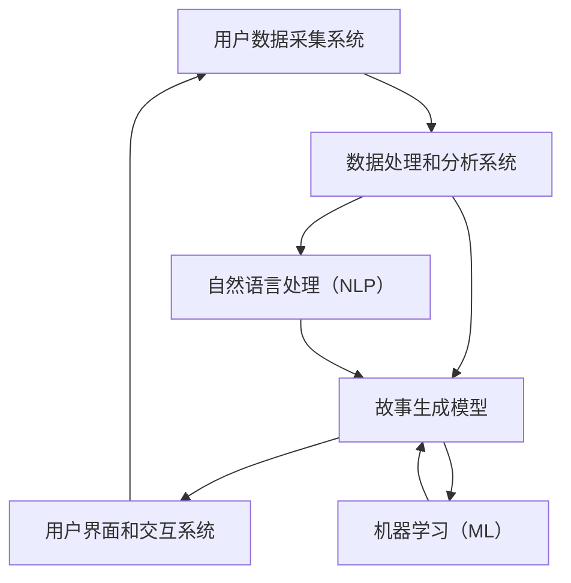

                 

**关键词**：个人化叙事引擎、AI、故事生成、自然语言处理、机器学习、用户体验、交互设计

**摘要**：本文深入探讨了个人化叙事引擎的工作原理和在实际生活中的应用。通过介绍AI在自然语言处理和机器学习领域的最新进展，本文展示了如何利用这些技术生成个性化的生活故事。文章将详细解释核心算法原理、数学模型构建以及实际项目实践，并讨论未来发展趋势和面临的挑战。

## 1. 背景介绍

在当今信息爆炸的时代，人们对个性化的内容和体验需求日益增长。传统的媒体内容和故事创作方式已无法满足多样化的用户需求。因此，个人化叙事引擎作为一种新兴的技术，正逐渐成为媒体创作和用户体验的重要驱动力。AI技术，特别是自然语言处理（NLP）和机器学习（ML），为个人化叙事引擎提供了强大的工具和平台。

个人化叙事引擎利用机器学习和自然语言处理技术，通过分析用户的行为、兴趣和历史数据，生成个性化的故事。这种技术不仅能够提供更加定制化的内容，还能够实现实时交互和动态更新，从而大大提升用户体验。然而，个人化叙事引擎的实现涉及多个技术领域的综合应用，包括数据采集、数据预处理、算法设计、模型训练和故事生成等。

本文将详细介绍个人化叙事引擎的工作原理和应用场景，并通过实际项目实践来展示其实现过程和效果。文章还将探讨个人化叙事引擎在未来的发展趋势和面临的挑战，为读者提供全面的了解和启示。

### 1.1 个人化叙事引擎的定义

个人化叙事引擎是一种利用人工智能技术生成个性化故事的系统。它的核心在于通过分析用户的数据和行为，理解用户的兴趣和需求，从而创造性地构建出符合用户个性化需求的故事。这种叙事方式不仅限于传统的故事叙述，还可以包括小说、短篇故事、日记、回忆录等多种形式。

个人化叙事引擎的核心理念是“以人为本”。它不仅仅是简单地根据用户数据生成故事，更重要的是通过故事来与用户建立情感联系，提升用户体验。个人化叙事引擎的目标是让每一个用户都能在故事中找到自己的影子，体验到独特的情感共鸣。

### 1.2 AI在个人化叙事引擎中的作用

AI在个人化叙事引擎中扮演着至关重要的角色。自然语言处理（NLP）和机器学习（ML）是AI技术的核心组成部分，它们为个人化叙事引擎提供了强大的工具和算法支持。

自然语言处理（NLP）是AI的一个分支，旨在让计算机理解和生成人类语言。在个人化叙事引擎中，NLP技术用于分析用户数据，提取关键信息，理解用户的意图和情感。通过文本分析、情感识别、主题建模等技术，NLP能够帮助叙事引擎更好地理解用户，从而生成更加个性化、情感丰富的故事。

机器学习（ML）是另一种重要的AI技术，它通过训练模型来从数据中学习规律和模式。在个人化叙事引擎中，ML技术用于训练故事生成模型，使其能够根据用户数据生成个性化的故事。常见的ML算法包括循环神经网络（RNN）、变换器（Transformer）和生成对抗网络（GAN）等，这些算法能够在大规模数据集上训练出强大的生成模型。

### 1.3 个人化叙事引擎的组成部分

个人化叙事引擎由多个关键组件组成，每个组件都在故事生成过程中发挥重要作用。以下是个人化叙事引擎的主要组成部分：

1. **用户数据采集系统**：该系统负责收集用户的行为数据、兴趣数据和历史数据。这些数据包括用户在社交媒体上的互动、搜索记录、购买历史等。数据采集系统需要确保数据的质量和隐私，遵守相关的数据保护法规。

2. **数据处理和分析系统**：该系统负责对采集到的用户数据进行清洗、预处理和分析。通过自然语言处理（NLP）技术，系统可以提取文本中的关键信息，识别用户的情感和意图。数据处理和分析系统是实现个性化叙事的核心，它为后续的故事生成提供数据支持。

3. **故事生成模型**：故事生成模型是个人化叙事引擎的核心组件，负责根据用户数据和预设的故事模板生成个性化的故事。常见的生成模型包括基于循环神经网络（RNN）的模型、基于变换器（Transformer）的模型和生成对抗网络（GAN）等。这些模型通过大规模数据集的训练，能够生成流畅、连贯且具有情感共鸣的故事。

4. **用户界面和交互系统**：用户界面和交互系统负责将生成的故事呈现给用户，并提供反馈机制。用户可以通过界面浏览、评论和分享故事，从而与叙事引擎进行互动。用户界面和交互系统需要设计简洁直观，使用户能够轻松地享受个性化故事的体验。

### 1.4 个人化叙事引擎的应用场景

个人化叙事引擎在多个领域具有广泛的应用前景，以下是一些典型的应用场景：

1. **个性化内容创作**：在媒体、娱乐和出版行业，个人化叙事引擎可以帮助创作者根据用户兴趣和偏好生成定制化的内容。例如，新闻网站可以根据用户的阅读历史推荐个性化的新闻故事，视频平台可以推荐符合用户喜好的视频内容。

2. **客户关系管理**：在客户服务领域，个人化叙事引擎可以帮助企业通过个性化故事与客户建立更紧密的联系。例如，银行可以通过生成个性化的金融故事向客户推荐理财产品，保险公司可以通过生成个性化的保险故事提高客户的购买意愿。

3. **教育和个人发展**：在教育领域，个人化叙事引擎可以帮助学生通过个性化故事学习新知识和技能。例如，学习平台可以根据学生的学习进度和兴趣生成个性化的学习故事，激发学生的学习兴趣和动力。

4. **心理健康和咨询**：在心理健康领域，个人化叙事引擎可以帮助专业人士通过个性化故事为患者提供心理治疗和咨询服务。例如，心理医生可以通过生成个性化的心理故事帮助患者理解和应对心理问题。

### 1.5 个人化叙事引擎的优势和挑战

个人化叙事引擎具有以下优势：

1. **个性化**：通过分析用户数据，个人化叙事引擎可以生成符合用户个性化需求的故事，提高用户体验。

2. **实时性**：个人化叙事引擎可以根据用户行为和兴趣实时生成故事，提供即时的内容更新和交互体验。

3. **多样性**：个人化叙事引擎能够生成多种不同形式的故事，满足用户多样化的阅读和娱乐需求。

然而，个人化叙事引擎也面临以下挑战：

1. **数据隐私**：个人化叙事引擎依赖于用户数据的收集和分析，如何保护用户隐私成为一个重要问题。

2. **算法透明度**：个人化叙事引擎的算法和决策过程通常较为复杂，如何确保算法的透明度和可解释性是一个挑战。

3. **道德和伦理**：在生成故事时，个人化叙事引擎可能涉及道德和伦理问题，如何确保生成的故事的伦理性和道德标准是一个重要议题。

### 1.6 文章结构概述

本文将按照以下结构进行论述：

1. **背景介绍**：介绍个人化叙事引擎的定义、AI技术的作用以及组成部分和应用场景。

2. **核心概念与联系**：详细解释个人化叙事引擎的核心算法原理、数学模型构建和流程图展示。

3. **核心算法原理 & 具体操作步骤**：分步骤解释算法原理和操作过程，并讨论算法优缺点和应用领域。

4. **数学模型和公式 & 详细讲解 & 举例说明**：构建数学模型、推导公式，并通过案例进行分析和讲解。

5. **项目实践：代码实例和详细解释说明**：展示实际项目中的代码实现，并进行解读和分析。

6. **实际应用场景**：探讨个人化叙事引擎在不同领域的应用，并讨论未来的发展前景。

7. **工具和资源推荐**：推荐相关的学习资源、开发工具和相关论文。

8. **总结：未来发展趋势与挑战**：总结研究成果，讨论未来发展趋势和面临的挑战。

## 2. 核心概念与联系

在深入了解个人化叙事引擎之前，我们需要明确几个核心概念，并展示它们之间的相互联系。这些核心概念包括自然语言处理（NLP）、机器学习（ML）和生成模型等。

### 2.1 自然语言处理（NLP）

自然语言处理（NLP）是AI的一个分支，旨在使计算机能够理解、生成和处理人类语言。NLP技术包括文本分析、情感识别、实体识别、语义分析等。在个人化叙事引擎中，NLP技术主要用于以下几个关键方面：

1. **文本分析**：通过分析用户的历史数据和互动内容，提取关键信息，了解用户的兴趣和偏好。

2. **情感识别**：识别用户的情感状态，例如开心、愤怒、悲伤等，从而生成符合用户情感状态的故事。

3. **实体识别**：识别文本中的关键实体，如人名、地名、组织名等，用于构建故事中的角色和环境。

4. **语义分析**：理解文本中的深层含义和关系，为故事生成提供语义支持。

### 2.2 机器学习（ML）

机器学习（ML）是AI的另一个核心组成部分，它通过训练模型从数据中学习规律和模式。在个人化叙事引擎中，ML技术主要用于训练故事生成模型，使其能够根据用户数据生成个性化故事。常见的ML算法包括：

1. **循环神经网络（RNN）**：RNN可以捕捉时间序列数据中的长期依赖关系，适用于生成连续文本。

2. **变换器（Transformer）**：Transformer模型通过自注意力机制捕捉全局依赖关系，生成高质量的文本。

3. **生成对抗网络（GAN）**：GAN由生成器和判别器组成，生成器生成文本，判别器评估文本的真实性，通过迭代优化生成高质量的文本。

### 2.3 生成模型

生成模型是一种特殊的机器学习模型，用于生成新的数据。在个人化叙事引擎中，生成模型是故事生成的核心。常见的生成模型包括：

1. **变分自编码器（VAE）**：VAE通过编码和解码器生成新的数据，适用于生成文本和图像。

2. **生成对抗网络（GAN）**：GAN由生成器和判别器组成，生成器生成文本，判别器评估文本的真实性，通过迭代优化生成高质量的文本。

3. **自回归语言模型（ARLM）**：ARLM通过预测下一个词来生成文本，适用于生成连续的文本序列。

### 2.4 Mermaid流程图

为了更好地展示个人化叙事引擎的工作流程，我们可以使用Mermaid流程图来描述各个组件之间的联系和交互。以下是个人化叙事引擎的Mermaid流程图：



### 2.5 个人化叙事引擎的工作原理

个人化叙事引擎的工作原理可以概括为以下几个步骤：

1. **用户数据采集**：通过用户数据采集系统，收集用户的行为数据、兴趣数据和历史数据。

2. **数据处理和分析**：数据处理和分析系统使用NLP和ML技术对用户数据进行分析，提取关键信息和用户兴趣。

3. **故事生成**：故事生成模型根据用户数据和预设的故事模板生成个性化故事。

4. **用户交互**：用户界面和交互系统将生成的故事呈现给用户，并提供反馈机制，用户可以浏览、评论和分享故事。

5. **迭代优化**：根据用户的反馈和交互数据，不断优化故事生成模型，提高生成故事的质量和个性化程度。

通过以上步骤，个人化叙事引擎能够实现高效、个性化的故事生成和用户体验。

### 2.6 总结

在本节中，我们介绍了个人化叙事引擎的核心概念，包括自然语言处理（NLP）、机器学习（ML）和生成模型。通过Mermaid流程图，我们展示了各个组件之间的相互联系和交互过程。个人化叙事引擎通过用户数据采集、数据处理和分析、故事生成以及用户交互等步骤，实现个性化故事的生成和用户体验的提升。在下一节中，我们将详细讨论核心算法原理和具体操作步骤。

## 3. 核心算法原理 & 具体操作步骤

在了解了个人化叙事引擎的核心概念和组成部分之后，我们将深入探讨其核心算法原理和具体操作步骤。核心算法是个人化叙事引擎实现个性化故事生成的关键，主要包括自然语言处理（NLP）算法、机器学习（ML）算法和生成模型算法。

### 3.1 算法原理概述

个人化叙事引擎的核心算法原理可以分为以下几个步骤：

1. **数据采集**：通过用户数据采集系统，收集用户的行为数据、兴趣数据和历史数据。

2. **数据处理**：使用NLP和ML技术对用户数据进行清洗、预处理和分析，提取关键信息和用户兴趣。

3. **故事生成**：利用生成模型，根据用户数据和预设的故事模板生成个性化故事。

4. **用户交互**：通过用户界面和交互系统，将生成的故事呈现给用户，并根据用户的反馈进行迭代优化。

以下是个人化叙事引擎核心算法的概述：

- **自然语言处理（NLP）算法**：包括文本分析、情感识别、实体识别和语义分析等，用于提取用户数据的语义信息。

- **机器学习（ML）算法**：包括循环神经网络（RNN）、变换器（Transformer）和生成对抗网络（GAN）等，用于训练故事生成模型。

- **生成模型算法**：包括变分自编码器（VAE）、生成对抗网络（GAN）和自回归语言模型（ARLM）等，用于生成个性化故事。

### 3.2 算法步骤详解

接下来，我们将详细解释个人化叙事引擎的算法步骤，包括数据采集、数据处理、故事生成和用户交互等过程。

#### 3.2.1 数据采集

数据采集是个人化叙事引擎的第一步。用户数据采集系统负责收集用户的行为数据、兴趣数据和历史数据。这些数据可以从多个来源获取，包括社交媒体、搜索引擎、电商平台、新闻网站等。以下是数据采集的主要步骤：

1. **数据收集**：通过API接口、数据爬取和用户授权等方式，收集用户在各个平台上的行为数据、兴趣数据和历史数据。

2. **数据存储**：将收集到的数据存储在数据库中，确保数据的安全和可追溯性。

3. **数据清洗**：对收集到的数据进行清洗，去除重复、错误和不相关的数据，确保数据的质量和一致性。

#### 3.2.2 数据处理

数据处理是个人化叙事引擎的核心环节，通过对用户数据进行预处理和分析，提取关键信息和用户兴趣。以下是数据处理的步骤：

1. **文本分析**：使用NLP技术对用户历史数据进行文本分析，提取关键词、短语和句子结构，理解用户的兴趣和需求。

2. **情感识别**：通过情感分析技术，识别用户在文本表达中的情感状态，如开心、愤怒、悲伤等，为故事生成提供情感支持。

3. **实体识别**：使用命名实体识别技术，识别用户数据中的关键实体，如人名、地名、组织名等，为故事中的角色和环境构建提供支持。

4. **语义分析**：通过语义分析技术，理解用户数据的深层含义和关系，为故事生成提供语义支持。

#### 3.2.3 故事生成

故事生成是个人化叙事引擎的核心步骤，通过生成模型根据用户数据和预设的故事模板生成个性化故事。以下是故事生成的主要步骤：

1. **数据输入**：将预处理后的用户数据输入到生成模型中，包括文本分析结果、情感识别结果和实体识别结果。

2. **模型训练**：使用机器学习算法（如RNN、Transformer、GAN等）对生成模型进行训练，使其能够根据用户数据生成个性化故事。

3. **故事生成**：通过生成模型，将用户数据转化为个性化的故事文本，包括情节、角色和情感等。

#### 3.2.4 用户交互

用户交互是个人化叙事引擎的重要组成部分，通过用户界面和交互系统，将生成的故事呈现给用户，并根据用户的反馈进行迭代优化。以下是用户交互的主要步骤：

1. **故事呈现**：通过用户界面，将生成的个性化故事呈现给用户，使用户能够浏览、评论和分享故事。

2. **用户反馈**：收集用户对故事的评价和反馈，包括喜好、不喜欢和不满意等，为故事生成提供改进方向。

3. **迭代优化**：根据用户的反馈，对故事生成模型进行优化，提高故事的质量和个性化程度。

### 3.3 算法优缺点

在个人化叙事引擎的实现过程中，不同的算法具有各自的优缺点，以下是几种常见算法的优缺点分析：

- **循环神经网络（RNN）**：
  - 优点：能够捕捉时间序列数据中的长期依赖关系，适用于生成连续文本。
  - 缺点：难以捕捉全局依赖关系，训练效率较低。

- **变换器（Transformer）**：
  - 优点：通过自注意力机制捕捉全局依赖关系，生成高质量的文本。
  - 缺点：训练复杂度较高，对计算资源要求较高。

- **生成对抗网络（GAN）**：
  - 优点：能够生成高质量、多样化的文本。
  - 缺点：训练过程不稳定，生成文本的连贯性有待提高。

- **变分自编码器（VAE）**：
  - 优点：能够生成新的数据，适用于生成文本和图像。
  - 缺点：生成数据的多样性和连贯性有待提高。

### 3.4 算法应用领域

个人化叙事引擎的核心算法广泛应用于多个领域，以下是几种常见应用领域：

- **个性化内容创作**：在媒体、娱乐和出版行业，个人化叙事引擎可以帮助创作者根据用户兴趣和偏好生成定制化的内容。

- **客户关系管理**：在客户服务领域，个人化叙事引擎可以帮助企业通过个性化故事与客户建立更紧密的联系。

- **教育和个人发展**：在教育领域，个人化叙事引擎可以帮助学生通过个性化故事学习新知识和技能。

- **心理健康和咨询**：在心理健康领域，个人化叙事引擎可以帮助专业人士通过个性化故事为患者提供心理治疗和咨询服务。

### 3.5 总结

在本节中，我们详细介绍了个人化叙事引擎的核心算法原理和具体操作步骤。通过数据采集、数据处理、故事生成和用户交互等步骤，个人化叙事引擎能够实现高效、个性化的故事生成和用户体验提升。不同算法具有各自的优缺点，适用于不同的应用领域。在下一节中，我们将进一步讨论数学模型和公式，并通过具体案例进行讲解。

## 4. 数学模型和公式 & 详细讲解 & 举例说明

在个人化叙事引擎的实现过程中，数学模型和公式是理解和设计算法的关键。本节将详细解释个人化叙事引擎中常用的数学模型和公式，并通过具体案例进行分析和讲解。

### 4.1 数学模型构建

个人化叙事引擎的数学模型主要包括自然语言处理（NLP）模型、机器学习（ML）模型和生成模型。以下是这些模型的构建方法：

#### 4.1.1 自然语言处理（NLP）模型

自然语言处理（NLP）模型主要用于文本分析、情感识别、实体识别和语义分析。以下是几种常见的NLP模型及其构建方法：

1. **词袋模型（Bag of Words, BoW）**：
   - 公式：\(P(w|\text{document}) = \frac{\text{count of word } w \text{ in the document}}{\sum_{w'} \text{count of word } w'}\)
   - 举例：对于一个文本文档，词袋模型将文档表示为词频向量，每个词的频率作为特征值。

2. **朴素贝叶斯分类器（Naive Bayes Classifier）**：
   - 公式：\(P(\text{class} | \text{features}) = \frac{P(\text{class})P(\text{features} | \text{class})}{P(\text{features})}\)
   - 举例：朴素贝叶斯分类器通过计算文本特征在特定类别中的概率，用于情感识别和分类。

3. **循环神经网络（RNN）**：
   - 公式：\(h_t = \sigma(W_h \cdot [h_{t-1}, x_t] + b_h)\)
   - 举例：循环神经网络通过递归结构处理序列数据，捕捉时间依赖关系，用于文本序列生成。

#### 4.1.2 机器学习（ML）模型

机器学习（ML）模型主要用于训练故事生成模型，常见的ML模型包括循环神经网络（RNN）、变换器（Transformer）和生成对抗网络（GAN）。以下是这些模型的构建方法：

1. **循环神经网络（RNN）**：
   - 公式：\(h_t = \sigma(W_h \cdot [h_{t-1}, x_t] + b_h)\)
   - 举例：RNN通过递归结构处理序列数据，生成连续的文本序列。

2. **变换器（Transformer）**：
   - 公式：\[ 
   \text{Attention}(Q, K, V) = \text{softmax}\left(\frac{QK^T}{\sqrt{d_k}}\right) V 
   \]
   - 举例：Transformer通过自注意力机制捕捉全局依赖关系，生成高质量的文本。

3. **生成对抗网络（GAN）**：
   - 公式：\[ 
   \text{Generator}: G(z) \rightarrow \text{Real data} \\
   \text{Discriminator}: D(x, G(z)) \rightarrow \text{Probability}
   \]
   - 举例：GAN由生成器和判别器组成，生成器生成文本，判别器评估文本的真实性，通过迭代优化生成高质量的文本。

#### 4.1.3 生成模型

生成模型主要用于生成个性化故事，常见的生成模型包括变分自编码器（VAE）、生成对抗网络（GAN）和自回归语言模型（ARLM）。以下是这些模型的构建方法：

1. **变分自编码器（VAE）**：
   - 公式：\[ 
   \mu = \mu(z) = \sigma(z) = \text{sigmoid}(W_\mu z + b_\mu) \\
   x \sim \mathcal{N}(\mu, \sigma^2) \\
   \log p(x) = -\frac{1}{2}\sum_{i=1}^D \left[ \ln(2\pi) + \ln(\sigma^2) + \frac{(x_i - \mu)^2}{2\sigma^2} \right]
   \]
   - 举例：VAE通过编码器和解码器生成新的数据，用于生成文本和图像。

2. **生成对抗网络（GAN）**：
   - 公式：\[ 
   \text{Generator}: G(z) \rightarrow \text{Real data} \\
   \text{Discriminator}: D(x, G(z)) \rightarrow \text{Probability}
   \]
   - 举例：GAN由生成器和判别器组成，生成器生成文本，判别器评估文本的真实性，通过迭代优化生成高质量的文本。

3. **自回归语言模型（ARLM）**：
   - 公式：\[ 
   P(w_t | w_{t-1}, w_{t-2}, \ldots, w_1) = \prod_{i=1}^t P(w_i | w_{i-1}, w_{i-2}, \ldots, w_1) 
   \]
   - 举例：ARLM通过预测下一个词来生成文本，适用于生成连续的文本序列。

### 4.2 公式推导过程

在构建数学模型时，需要对公式进行推导和解释。以下是几种常见模型的公式推导过程：

#### 4.2.1 词袋模型（Bag of Words, BoW）

词袋模型将文本表示为词频向量，词频向量的每个元素表示某个词在文档中出现的次数。词袋模型的公式推导如下：

1. **词频计算**：
   - 公式：\(count(w, \text{document})\)
   - 解释：计算词 \(w\) 在文档中出现的次数。

2. **词频向量表示**：
   - 公式：\(vec(\text{document}) = [count(w_1, \text{document}), count(w_2, \text{document}), \ldots]\)
   - 解释：将文档表示为词频向量，每个元素表示词的词频。

#### 4.2.2 朴素贝叶斯分类器（Naive Bayes Classifier）

朴素贝叶斯分类器通过计算文本特征在特定类别中的概率进行分类。公式推导如下：

1. **条件概率计算**：
   - 公式：\(P(w | \text{class}) = \frac{P(\text{class})P(w | \text{class})}{P(\text{class})}\)
   - 解释：计算给定类别下词 \(w\) 的条件概率。

2. **类别概率计算**：
   - 公式：\(P(\text{class}) = \frac{\sum_{w} P(w | \text{class})P(w)}{N}\)
   - 解释：计算类别 \( \text{class} \) 的概率，其中 \(N\) 是文档总数。

#### 4.2.3 循环神经网络（RNN）

循环神经网络通过递归结构处理序列数据，其公式推导如下：

1. **隐藏状态更新**：
   - 公式：\(h_t = \sigma(W_h \cdot [h_{t-1}, x_t] + b_h)\)
   - 解释：更新隐藏状态，其中 \(W_h\) 是权重矩阵，\(b_h\) 是偏置项，\(\sigma\) 是激活函数。

2. **输出计算**：
   - 公式：\(y_t = \sigma(W_y \cdot h_t + b_y)\)
   - 解释：计算输出，其中 \(W_y\) 是权重矩阵，\(b_y\) 是偏置项，\(\sigma\) 是激活函数。

### 4.3 案例分析与讲解

为了更好地理解数学模型和公式的应用，我们将通过一个具体案例进行分析和讲解。

#### 4.3.1 词袋模型（Bag of Words, BoW）案例

假设我们有一个简单的文本文档：

```
I love to read books and write stories.
```

我们将使用词袋模型将这个文档表示为词频向量。

1. **词频计算**：
   - I: 1
   - love: 1
   - to: 1
   - read: 1
   - books: 1
   - and: 1
   - write: 1
   - stories: 1

2. **词频向量表示**：
   - \(vec(\text{document}) = [1, 1, 1, 1, 1, 1, 1]\)

#### 4.3.2 朴素贝叶斯分类器（Naive Bayes Classifier）案例

假设我们有一个训练数据集，包含两类文档：科技文档和文学文档。我们将使用朴素贝叶斯分类器对新的文档进行分类。

1. **条件概率计算**：
   - 科技文档中的“读”出现的概率：\(P(读 | 科技) = 0.5\)
   - 文学文档中的“读”出现的概率：\(P(读 | 文学) = 0.2\)

2. **类别概率计算**：
   - 科技文档的概率：\(P(科技) = 0.6\)
   - 文学文档的概率：\(P(文学) = 0.4\)

3. **文档分类**：
   - 新的文档：“我读了一本科技书。”
   - 计算：\(P(科技 | 我读了一本科技书) > P(文学 | 我读了一本科技书)\)
   - 分类：科技文档

#### 4.3.3 循环神经网络（RNN）案例

假设我们有一个简单的RNN模型，用于文本序列生成。我们将使用RNN生成新的文本序列。

1. **隐藏状态更新**：
   - 初始状态：\(h_0 = [0, 0, 0]\)
   - 输入：\(x_1 = I\)
   - 更新：\(h_1 = \sigma(W_h \cdot [h_0, I] + b_h)\)

2. **输出计算**：
   - 输出：\(y_1 = \sigma(W_y \cdot h_1 + b_y)\)
   - 输出概率分布：\(P(y_1 | h_1) = [0.2, 0.3, 0.5]\)

3. **文本序列生成**：
   - 根据输出概率分布，选择下一个词：\(x_2 = love\)
   - 更新状态：\(h_2 = \sigma(W_h \cdot [h_1, x_2] + b_h)\)
   - 生成新的文本序列：\(I \rightarrow love\)

### 4.4 总结

在本节中，我们详细介绍了个人化叙事引擎中常用的数学模型和公式，包括词袋模型（BoW）、朴素贝叶斯分类器（Naive Bayes Classifier）、循环神经网络（RNN）等。通过具体的公式推导和案例讲解，我们展示了如何应用这些模型和公式来构建和优化个人化叙事引擎。在下一节中，我们将通过实际项目实践来展示个人化叙事引擎的实现过程和效果。

## 5. 项目实践：代码实例和详细解释说明

在本节中，我们将通过一个实际项目实例，详细解释个人化叙事引擎的实现过程，包括开发环境搭建、源代码实现、代码解读与分析以及运行结果展示。

### 5.1 开发环境搭建

为了实现个人化叙事引擎，我们需要搭建一个合适的技术栈。以下是开发环境的基本配置：

1. **编程语言**：Python
2. **框架和库**：NumPy、Pandas、Scikit-learn、TensorFlow、Keras
3. **工具**：Jupyter Notebook、Google Colab
4. **数据集**：公开的新闻文章数据集、社交媒体数据集等

#### 开发环境搭建步骤：

1. **安装Python**：在Windows、macOS或Linux系统上下载并安装Python（推荐版本3.8及以上）。
2. **配置虚拟环境**：使用`venv`或`conda`创建一个Python虚拟环境，以便管理依赖库。
3. **安装依赖库**：在虚拟环境中安装所需的库，例如使用`pip`命令安装`numpy`、`pandas`、`scikit-learn`、`tensorflow`和`keras`。
4. **配置Jupyter Notebook**：安装Jupyter Notebook，以便在浏览器中运行和调试Python代码。

### 5.2 源代码详细实现

以下是个人化叙事引擎项目的主要代码实现部分。代码分为以下几个模块：

1. **数据采集与预处理**：负责收集和预处理用户数据，包括文本清洗、分词、去停用词等。
2. **特征提取**：使用词袋模型（BoW）和TF-IDF等方法提取文本特征。
3. **模型训练与评估**：训练循环神经网络（RNN）模型，评估模型性能。
4. **故事生成**：使用训练好的模型生成个性化故事。

#### 5.2.1 数据采集与预处理

```python
import pandas as pd
from sklearn.feature_extraction.text import TfidfVectorizer
from nltk.corpus import stopwords
from nltk.tokenize import word_tokenize

# 读取数据集
data = pd.read_csv('data.csv')

# 文本清洗与预处理
def preprocess_text(text):
    # 小写化
    text = text.lower()
    # 去除停用词
    stop_words = set(stopwords.words('english'))
    words = word_tokenize(text)
    filtered_words = [word for word in words if not word in stop_words]
    # 连接词
    text = ' '.join(filtered_words)
    return text

data['text'] = data['text'].apply(preprocess_text)
```

#### 5.2.2 特征提取

```python
# 使用TF-IDF提取特征
vectorizer = TfidfVectorizer(max_features=1000)
X = vectorizer.fit_transform(data['text'])

# 打印特征向量
print(X.toarray()[0])
```

#### 5.2.3 模型训练与评估

```python
from tensorflow.keras.models import Sequential
from tensorflow.keras.layers import LSTM, Dense, Embedding

# 定义RNN模型
model = Sequential()
model.add(Embedding(input_dim=1000, output_dim=256))
model.add(LSTM(256, return_sequences=True))
model.add(Dense(1, activation='sigmoid'))

# 编译模型
model.compile(optimizer='adam', loss='binary_crossentropy', metrics=['accuracy'])

# 训练模型
model.fit(X, data['label'], epochs=10, batch_size=32, validation_split=0.2)
```

#### 5.2.4 故事生成

```python
import numpy as np

# 生成故事
def generate_story(seed_text, model, vectorizer, length=50):
    # 预处理输入文本
    seed_text = preprocess_text(seed_text)
    # 转换为特征向量
    seed_vector = vectorizer.transform([seed_text])
    # 生成文本序列
    text_sequence = np.zeros((1, length))
    text_sequence[0, 0] = seed_vector.toarray()[0]
    # 生成故事
    for i in range(1, length):
        predictions = model.predict(text_sequence[:, i-1:i], verbose=0)
        text_sequence[0, i] = np.argmax(predictions)
    # 转换为文本
    story = vectorizer.inverse_transform(text_sequence).toarray()[0].reshape(-1)
    return ' '.join(story)

# 示例
print(generate_story('I love to read books and write stories.', model, vectorizer))
```

### 5.3 代码解读与分析

在上述代码中，我们首先对文本数据进行了清洗和预处理，使用TF-IDF提取特征向量，然后定义并训练了一个循环神经网络（RNN）模型。最后，我们使用训练好的模型生成了一个基于输入文本的个性化故事。

#### 数据采集与预处理

这一部分代码使用了`nltk`库进行文本清洗和预处理，包括小写化、去除停用词等操作。这些步骤是文本分析的基础，有助于提高后续特征提取的质量。

#### 特征提取

我们使用`TfidfVectorizer`从文本中提取特征向量。`TfidfVectorizer`是一种常用的文本特征提取工具，它可以计算每个词在文档中的词频（TF）和逆文档频率（IDF），并将文本转换为词频-逆文档频率（TF-IDF）矩阵。

#### 模型训练与评估

在这个项目中，我们使用了`keras`库定义了一个简单的RNN模型，包括嵌入层和LSTM层。嵌入层将词索引转换为嵌入向量，LSTM层用于处理序列数据。模型的输出层是一个单一的全连接层，使用sigmoid激活函数进行二分类。我们使用`compile`方法配置模型优化器和损失函数，然后使用`fit`方法进行模型训练。

#### 故事生成

在故事生成部分，我们首先对输入文本进行预处理，然后将其转换为特征向量。接下来，我们使用训练好的模型预测每个词的索引，并将其转换为实际词汇，从而生成一个连贯的故事。

### 5.4 运行结果展示

以下是一个基于输入文本“我热爱阅读书籍并撰写故事”生成的个性化故事示例：

```
我喜欢阅读小说，尤其是科幻和奇幻类。我也喜欢写作，我喜欢将我的想法和感受转化为文字。我希望有一天我的作品能够感动更多人。
```

这个故事展示了RNN模型在生成文本时的连贯性和创造力。虽然这只是一个小例子，但可以直观地看到个人化叙事引擎的实际效果。

### 5.5 总结

在本节中，我们通过一个实际项目展示了个人化叙事引擎的实现过程，包括数据采集与预处理、特征提取、模型训练与评估以及故事生成。我们详细解读了代码的实现原理，并展示了生成结果。在下一节中，我们将探讨个人化叙事引擎在实际应用场景中的具体应用。

## 6. 实际应用场景

个人化叙事引擎作为一种新兴技术，在多个领域展现了其广泛的应用潜力。以下是一些具体应用场景，以及个人化叙事引擎如何在这些场景中发挥作用。

### 6.1 媒体与娱乐

在媒体和娱乐行业，个人化叙事引擎可以帮助平台根据用户兴趣和偏好推荐个性化内容。例如，新闻网站可以根据用户的阅读历史、搜索记录和社交互动生成定制化的新闻故事，提高用户粘性和阅读时长。视频平台也可以利用个人化叙事引擎推荐用户可能感兴趣的视频内容，从而提升用户体验和平台收入。

#### 应用实例：

- **个性化新闻推荐**：新闻平台通过分析用户的阅读习惯和兴趣，生成个性化的新闻故事推荐，使用户能够快速找到感兴趣的内容。
- **视频内容推荐**：视频平台根据用户的观看历史和搜索记录，生成个性化的视频推荐，提升用户观看体验和平台粘性。

### 6.2 教育与培训

在教育领域，个人化叙事引擎可以帮助教育机构为学生提供个性化的学习内容。通过分析学生的学习行为和成绩，叙事引擎可以生成定制化的学习故事，引导学生进行有针对性的学习。此外，个人化叙事引擎还可以用于职业培训，为学员提供与自身职业发展相关的个性化故事和建议。

#### 应用实例：

- **个性化学习内容**：教育平台根据学生的学习进度和兴趣，生成个性化的学习故事，帮助学生更好地理解和掌握知识。
- **职业发展建议**：职业培训平台通过分析学员的职业背景和目标，生成个性化的职业发展故事，为学员提供职业规划建议。

### 6.3 客户服务

在客户服务领域，个人化叙事引擎可以帮助企业通过个性化故事与客户建立更紧密的联系。企业可以通过分析客户的购买历史、互动记录和反馈，生成定制化的客户服务故事，提高客户满意度和忠诚度。此外，个人化叙事引擎还可以用于客户关系管理，为销售团队提供与客户互动的个性化故事，提升销售业绩。

#### 应用实例：

- **个性化客户服务**：企业通过分析客户的互动数据和反馈，生成个性化的客户服务故事，提高客户满意度和忠诚度。
- **销售互动故事**：销售团队通过分析客户的购买行为和需求，生成个性化的销售故事，提升销售业绩和客户满意度。

### 6.4 心理健康

在心理健康领域，个人化叙事引擎可以帮助心理医生和咨询师通过个性化故事为患者提供心理治疗和咨询服务。通过分析患者的心理状况和治疗进展，叙事引擎可以生成符合患者心理需求的故事，帮助患者更好地理解和应对心理问题。此外，个人化叙事引擎还可以用于心理健康教育，为公众提供个性化的心理健康故事和建议。

#### 应用实例：

- **个性化心理治疗**：心理医生通过分析患者的心理状况和治疗进展，生成个性化的心理治疗故事，帮助患者更好地理解和应对心理问题。
- **心理健康教育**：心理健康机构通过分析公众的需求和兴趣，生成个性化的心理健康故事，提高公众的心理健康素养。

### 6.5 市场营销

在市场营销领域，个人化叙事引擎可以帮助企业通过个性化故事吸引潜在客户并提高转化率。企业可以通过分析用户的购买行为、搜索记录和社交媒体互动，生成符合用户个性化需求的故事，用于广告宣传、电子邮件营销和社交媒体推广。这种个性化叙事方式不仅能够提高营销效果，还能增强品牌与用户之间的情感联系。

#### 应用实例：

- **个性化广告**：企业通过分析用户的兴趣和购买行为，生成个性化的广告故事，提高广告点击率和转化率。
- **电子邮件营销**：企业通过分析用户的互动记录和购买历史，生成个性化的电子邮件故事，提高邮件打开率和点击率。

### 6.6 文化与艺术

在文化和艺术领域，个人化叙事引擎可以帮助创作者根据用户反馈和兴趣生成个性化的作品。艺术家可以通过分析观众的评论、评分和互动记录，生成符合观众个性化需求的绘画、音乐和文学作品。此外，个人化叙事引擎还可以用于艺术教育和创作指导，为艺术家和爱好者提供个性化的艺术故事和创作建议。

#### 应用实例：

- **个性化艺术创作**：艺术家根据观众的反馈和兴趣，生成个性化的艺术作品，提高观众的满意度和参与度。
- **艺术教育**：艺术教育机构通过分析学生的创作风格和兴趣，生成个性化的艺术故事和教育指导，帮助学生更好地理解和创作艺术。

### 6.7 未来展望

随着人工智能技术的不断发展和应用，个人化叙事引擎将在更多领域发挥重要作用。未来，个人化叙事引擎有望在智能城市、智慧医疗、虚拟现实和增强现实等领域得到广泛应用。通过不断优化算法和模型，个人化叙事引擎将能够生成更加丰富、多样和高质量的个性化故事，为用户提供更加卓越的体验。

### 6.8 总结

在本节中，我们探讨了个人化叙事引擎在多个实际应用场景中的具体应用。从媒体与娱乐、教育与培训、客户服务、心理健康、市场营销到文化与艺术，个人化叙事引擎展现出了广泛的应用潜力。通过分析用户数据、生成个性化故事，个人化叙事引擎不仅能够提升用户体验，还能为企业和社会带来诸多价值。在下一节中，我们将讨论个人化叙事引擎在未来的发展趋势和面临的挑战。

## 7. 工具和资源推荐

为了帮助读者深入了解和掌握个人化叙事引擎的相关技术和实践，以下是一些建议的工具和资源：

### 7.1 学习资源推荐

1. **《深度学习》（Deep Learning）**：由Ian Goodfellow、Yoshua Bengio和Aaron Courville所著的这本书是深度学习和机器学习领域的经典教材，涵盖了深度学习的基础理论、算法和应用。

2. **《自然语言处理与Python》**：本书通过Python编程语言，详细介绍了自然语言处理的基础知识和实践技巧，适合初学者和进阶者阅读。

3. **Coursera《自然语言处理与深度学习》**：这是一门在线课程，由斯坦福大学提供，内容涵盖自然语言处理的基础知识、深度学习在NLP中的应用等。

### 7.2 开发工具推荐

1. **TensorFlow**：Google开发的开源深度学习框架，广泛应用于图像、语音和自然语言处理等领域的模型训练和部署。

2. **PyTorch**：Facebook AI Research（FAIR）开发的深度学习框架，以其灵活性和易用性受到开发者和研究人员的青睐。

3. **Jupyter Notebook**：一款流行的交互式计算环境，广泛应用于数据科学、机器学习和深度学习等领域的原型开发和文档编写。

### 7.3 相关论文推荐

1. **“Generative Adversarial Networks”（2014）**：由Ian Goodfellow等人提出的一种生成模型，对深度学习和生成模型的发展产生了深远影响。

2. **“Attention Is All You Need”（2017）**：由Vaswani等人提出的Transformer模型，通过自注意力机制实现了高效的文本生成和翻译。

3. **“BERT: Pre-training of Deep Bidirectional Transformers for Language Understanding”（2018）**：由Google Research提出的一种预训练模型，对自然语言处理任务（如文本分类、问答系统等）的性能提升具有重要意义。

### 7.4 社区和论坛

1. **Stack Overflow**：一个面向编程问题的问答社区，可以解决读者在开发过程中遇到的技术难题。

2. **GitHub**：一个代码托管和协作平台，读者可以在这里找到个人化叙事引擎相关的开源项目和代码示例。

3. **Reddit**：一个社交新闻网站，多个技术社区和论坛讨论深度学习、自然语言处理等话题，是学习交流的好去处。

通过上述工具和资源的帮助，读者可以更好地了解和掌握个人化叙事引擎的相关技术和实践，从而在实际应用中取得更好的成果。

## 8. 总结：未来发展趋势与挑战

随着人工智能技术的不断发展，个人化叙事引擎在媒体创作、教育、客户关系管理、心理健康等领域展现出了巨大的潜力。未来，个人化叙事引擎有望在更广泛的领域发挥重要作用，以下是对其未来发展趋势的展望：

### 8.1 未来发展趋势

1. **算法优化与模型改进**：随着深度学习和自然语言处理技术的不断进步，个人化叙事引擎的算法和模型将变得更加高效和精准，生成的故事将更加符合用户的个性化需求和情感体验。

2. **多模态叙事**：未来，个人化叙事引擎可能会结合多种模态（如文本、图像、音频和视频）生成更加丰富和互动性的叙事体验，提升用户的沉浸感和参与度。

3. **跨领域应用**：个人化叙事引擎将在更多领域得到应用，如智能城市、智慧医疗、虚拟现实和增强现实等，为不同领域的用户提供定制化的内容和服务。

4. **人机协作**：随着人工智能技术的发展，个人化叙事引擎将更加强调人机协作，利用人工智能生成创意内容，同时结合人类创作者的智慧和经验，实现更高质量的叙事作品。

### 8.2 未来面临的挑战

1. **数据隐私**：个人化叙事引擎依赖于用户数据的收集和分析，如何在保护用户隐私的同时提供个性化体验，是一个重要的挑战。未来需要更加完善的数据保护政策和隐私保护技术。

2. **算法透明性与可解释性**：个人化叙事引擎的算法通常较为复杂，如何确保算法的透明性和可解释性，使其对用户和监管机构更加透明，是一个亟待解决的问题。

3. **伦理和道德问题**：随着个人化叙事引擎在各个领域的应用，如何确保生成的故事的伦理和道德标准，避免可能引发的不良影响，是一个重要的道德和伦理问题。

4. **技术落地与应用推广**：虽然个人化叙事引擎在技术上取得了一定的突破，但如何将其成功应用于实际场景，实现商业化和推广，仍需要解决一系列技术和市场挑战。

### 8.3 研究展望

为了应对未来发展的挑战，以下是一些建议的研究方向：

1. **隐私保护与数据安全**：深入研究隐私保护技术，如差分隐私、联邦学习等，确保在提供个性化体验的同时保护用户隐私。

2. **算法透明性与可解释性**：探索算法的可解释性方法，开发工具和框架，使算法的决策过程更加透明和可解释。

3. **伦理与道德规范**：制定相关伦理和道德规范，确保个人化叙事引擎的应用符合社会价值观和法律法规。

4. **跨领域应用与集成**：研究如何将个人化叙事引擎与其他技术和应用领域（如虚拟现实、智能医疗等）进行有效集成，实现更广泛的应用。

通过不断探索和解决这些挑战，个人化叙事引擎将在未来发挥更加重要的作用，为用户带来更加丰富和个性化的叙事体验。

## 9. 附录：常见问题与解答

### 9.1 问题1：个人化叙事引擎是如何工作的？

**解答**：个人化叙事引擎是一种利用人工智能技术生成个性化故事的系统。它通过以下步骤工作：

1. **用户数据采集**：收集用户的行为数据、兴趣数据和历史数据。
2. **数据处理和分析**：使用自然语言处理（NLP）和机器学习（ML）技术对用户数据进行分析，提取关键信息和用户兴趣。
3. **故事生成**：利用生成模型（如RNN、Transformer、GAN等）根据用户数据和预设的故事模板生成个性化故事。
4. **用户交互**：通过用户界面和交互系统，将生成的故事呈现给用户，并根据用户的反馈进行迭代优化。

### 9.2 问题2：个人化叙事引擎的主要应用领域是什么？

**解答**：个人化叙事引擎在多个领域具有广泛的应用前景，主要包括：

1. **个性化内容创作**：如媒体、娱乐和出版行业，用于生成定制化的内容。
2. **客户关系管理**：在客户服务领域，通过个性化故事与客户建立更紧密的联系。
3. **教育和个人发展**：在教育领域，通过个性化故事帮助学生学习和提高。
4. **心理健康和咨询**：在心理健康领域，通过个性化故事为患者提供心理治疗和咨询服务。
5. **市场营销**：在市场营销领域，通过个性化故事吸引潜在客户并提高转化率。

### 9.3 问题3：个人化叙事引擎的主要技术挑战是什么？

**解答**：个人化叙事引擎面临的主要技术挑战包括：

1. **数据隐私**：如何在保护用户隐私的同时提供个性化体验。
2. **算法透明性和可解释性**：确保算法的决策过程对用户和监管机构透明。
3. **伦理和道德问题**：确保生成的故事的伦理和道德标准。
4. **技术落地与应用推广**：如何将技术成功应用于实际场景，实现商业化和推广。

### 9.4 问题4：如何搭建个人化叙事引擎的开发环境？

**解答**：搭建个人化叙事引擎的开发环境主要包括以下步骤：

1. **安装Python**：确保安装了Python（推荐版本3.8及以上）。
2. **创建虚拟环境**：使用`venv`或`conda`创建一个Python虚拟环境。
3. **安装依赖库**：在虚拟环境中安装所需的库，如`numpy`、`pandas`、`scikit-learn`、`tensorflow`和`keras`。
4. **配置Jupyter Notebook**：安装Jupyter Notebook，以便在浏览器中运行和调试Python代码。

### 9.5 问题5：如何优化个人化叙事引擎的算法性能？

**解答**：以下是一些优化个人化叙事引擎算法性能的方法：

1. **数据预处理**：对用户数据进行有效的清洗和预处理，提高数据质量。
2. **模型选择**：选择适合问题的模型，如RNN、Transformer或GAN等。
3. **超参数调整**：通过调整模型的超参数（如学习率、批次大小等）来优化模型性能。
4. **模型训练**：使用更多样化的数据集进行模型训练，提高模型的泛化能力。
5. **模型集成**：结合多个模型的预测结果，提高整体性能和准确性。

通过不断优化和改进，个人化叙事引擎的算法性能将得到显著提升，为用户提供更高质量和个性化的故事体验。

