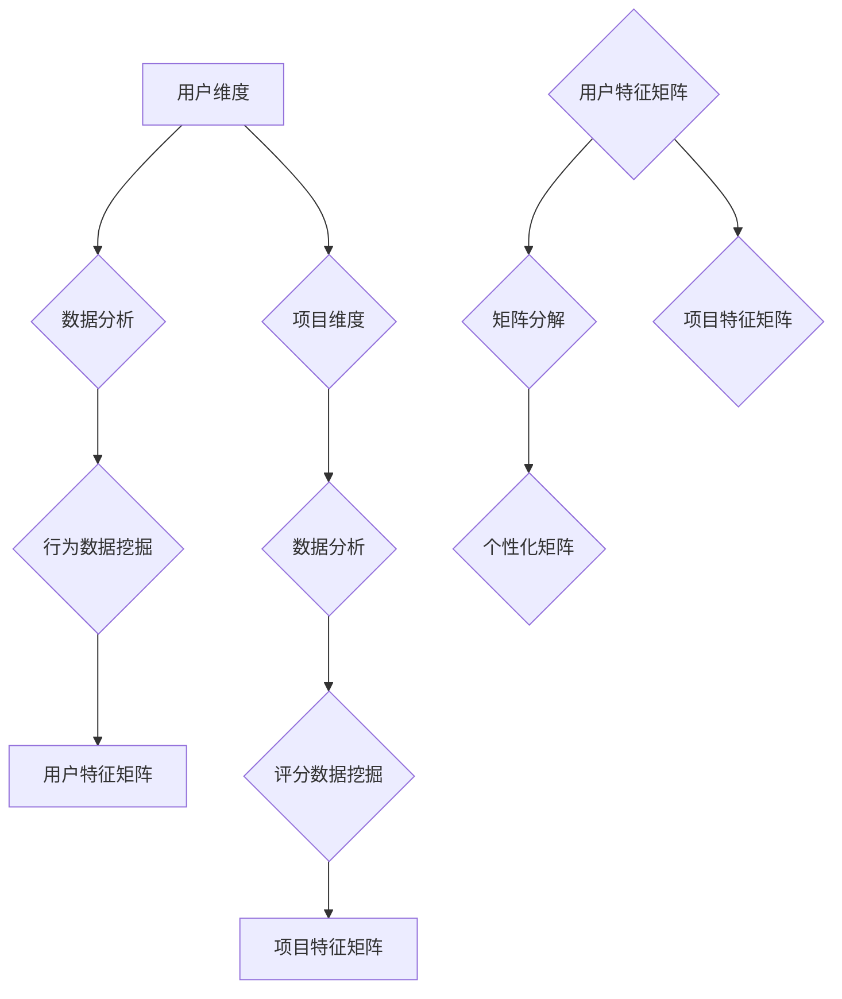

                 

关键词：个性化矩阵，AI定制，生活方案设计，算法原理，数学模型，项目实践，应用场景，未来展望

> 摘要：本文旨在探讨个性化矩阵在AI定制生活方案设计中的应用，通过分析核心概念与联系、算法原理、数学模型构建、项目实践等多个方面，为读者提供一种全新的生活方案设计思路。本文将介绍个性化矩阵的核心原理，详细解析其算法步骤，并通过实例演示如何在实际项目中应用这一技术，探讨其在未来的发展方向和面临的挑战。

## 1. 背景介绍

在当今信息爆炸的时代，个性化已成为各个领域的发展趋势。个性化不仅仅是满足用户的基本需求，更是通过数据分析、算法优化等技术手段，为用户提供量身定制的服务和方案。个性化矩阵作为人工智能（AI）技术的重要组成部分，其在生活方案设计中的应用日益受到关注。

个性化矩阵，顾名思义，是一种基于矩阵的个性化算法，它通过分析用户的个性化需求、行为数据等，构建一个多维度的个性化矩阵，进而为用户提供定制化的生活方案。这种技术不仅可以提高用户体验，还能为企业和组织提供精准的市场营销策略。

### 1.1 个性化矩阵的重要性

个性化矩阵在生活方案设计中的应用具有重要意义：

1. **提高用户满意度**：通过分析用户的个性化需求，提供定制化的服务，提升用户满意度。
2. **优化资源配置**：根据用户的个性化行为数据，合理分配资源，提高资源利用率。
3. **精准市场营销**：帮助企业准确了解用户需求，制定有效的市场营销策略。
4. **推动技术创新**：个性化矩阵的研究和应用推动了人工智能、大数据等技术的进步。

### 1.2 个性化矩阵的发展历程

个性化矩阵的发展可以追溯到20世纪80年代，当时研究人员开始探索如何通过矩阵运算实现个性化推荐。随着计算机技术的进步和大数据技术的发展，个性化矩阵逐渐成为人工智能领域的一个重要研究方向。近年来，随着深度学习和机器学习技术的应用，个性化矩阵的性能和效果得到了进一步提升。

## 2. 核心概念与联系

### 2.1 个性化矩阵的定义

个性化矩阵（Personalized Matrix）是一种用于描述个体特征、兴趣、偏好等信息的数学模型。它通常是一个多维度的矩阵，其中每个元素代表个体在某一维度上的特征值。

### 2.2 个性化矩阵的组成部分

个性化矩阵由以下几个部分组成：

1. **用户维度**：代表用户在各个方面的特征，如年龄、性别、收入等。
2. **项目维度**：代表用户可能感兴趣的各种项目，如商品、服务、活动等。
3. **评分维度**：代表用户对各个项目的评分或偏好程度。

### 2.3 个性化矩阵的构建方法

构建个性化矩阵的方法有很多，常见的包括：

1. **用户行为数据挖掘**：通过分析用户的浏览、购买、评论等行为数据，提取用户特征。
2. **社会网络分析**：通过分析用户的社会网络关系，构建用户间的相似性矩阵。
3. **用户调查**：通过问卷调查等方式获取用户的个性化需求。

### 2.4 个性化矩阵的应用场景

个性化矩阵在以下场景中具有广泛的应用：

1. **个性化推荐系统**：为用户提供个性化的商品、服务、活动推荐。
2. **用户行为预测**：预测用户的行为，如购买、评论等。
3. **市场细分**：根据用户特征进行市场细分，制定有针对性的市场营销策略。
4. **社交网络分析**：分析用户之间的社交关系，挖掘潜在的用户群体。

### 2.5 个性化矩阵的核心原理

个性化矩阵的核心原理是基于矩阵分解技术，将用户和项目的特征进行分解，构建一个低维度的特征空间，从而实现个性化推荐。具体来说，个性化矩阵的分解方法包括：

1. **奇异值分解（SVD）**：通过奇异值分解将个性化矩阵分解为用户特征矩阵和项目特征矩阵。
2. **矩阵分解（MF）**：通过优化目标函数，求解用户特征矩阵和项目特征矩阵，使得重构误差最小。
3. **深度学习**：利用深度神经网络进行矩阵分解，提高个性化推荐的效果。

### 2.6 个性化矩阵的 Mermaid 流程图



## 3. 核心算法原理 & 具体操作步骤

### 3.1 算法原理概述

个性化矩阵的核心算法是基于矩阵分解技术，通过将用户和项目的特征进行分解，构建一个低维度的特征空间，从而实现个性化推荐。具体来说，包括以下步骤：

1. **数据预处理**：清洗和整理用户行为数据，如浏览、购买、评论等。
2. **特征提取**：提取用户和项目的特征，构建用户特征矩阵和项目特征矩阵。
3. **矩阵分解**：通过优化目标函数，求解用户特征矩阵和项目特征矩阵，使得重构误差最小。
4. **个性化推荐**：利用分解得到的用户特征矩阵和项目特征矩阵，为用户提供个性化的推荐。

### 3.2 算法步骤详解

1. **数据预处理**

   - 清洗数据：去除无效数据、噪声数据等。
   - 整理数据：将数据转换为统一的格式，如稀疏矩阵。

2. **特征提取**

   - 用户特征提取：根据用户行为数据，提取用户在各个方面的特征，如年龄、性别、收入等。
   - 项目特征提取：根据项目属性，提取项目在各个方面的特征，如分类、标签等。

3. **矩阵分解**

   - 目标函数：最小化重构误差，即最小化原始矩阵与重构矩阵之间的误差。
   - 算法选择：选择合适的矩阵分解算法，如奇异值分解（SVD）、矩阵分解（MF）等。
   - 求解用户特征矩阵和项目特征矩阵：通过优化目标函数，求解用户特征矩阵和项目特征矩阵。

4. **个性化推荐**

   - 用户特征矩阵和项目特征矩阵的乘积：得到用户和项目之间的相似性矩阵。
   - 根据相似性矩阵，为用户提供个性化的推荐。

### 3.3 算法优缺点

1. **优点**

   - **高效性**：矩阵分解算法具有较高的计算效率，适合处理大规模数据。
   - **灵活性**：可以通过调整参数，适应不同的应用场景。
   - **可解释性**：用户特征矩阵和项目特征矩阵具有直观的解释意义，有助于理解个性化推荐的过程。

2. **缺点**

   - **稀疏性**：用户行为数据通常具有稀疏性，可能导致矩阵分解效果不佳。
   - **冷启动问题**：对于新用户或新项目，缺乏足够的历史数据，导致推荐效果不佳。
   - **计算复杂度**：矩阵分解算法的计算复杂度较高，对于大规模数据集可能需要较长的计算时间。

### 3.4 算法应用领域

个性化矩阵算法在以下领域具有广泛的应用：

- **电子商务**：为用户提供个性化的商品推荐，提高用户购买转化率。
- **在线教育**：根据用户的学习行为和兴趣，为用户提供个性化的课程推荐。
- **社交媒体**：为用户提供个性化的内容推荐，提高用户活跃度。
- **医疗健康**：根据用户的健康数据，为用户提供个性化的健康建议。

## 4. 数学模型和公式 & 详细讲解 & 举例说明

### 4.1 数学模型构建

个性化矩阵的数学模型构建主要包括以下几个步骤：

1. **用户行为数据建模**：将用户行为数据转换为矩阵形式，如用户-项目评分矩阵。
2. **用户特征提取**：根据用户行为数据，提取用户在各个方面的特征，构建用户特征向量。
3. **项目特征提取**：根据项目属性，提取项目在各个方面的特征，构建项目特征向量。
4. **矩阵分解**：将用户-项目评分矩阵分解为用户特征矩阵和项目特征矩阵。

### 4.2 公式推导过程

假设有一个用户-项目评分矩阵 \(R \in \mathbb{R}^{m \times n}\)，其中 \(m\) 表示用户数量，\(n\) 表示项目数量，\(R_{ij}\) 表示用户 \(i\) 对项目 \(j\) 的评分。

1. **用户特征提取**

   假设用户特征向量为 \(U \in \mathbb{R}^{m \times k}\)，其中 \(k\) 表示用户特征的维度。可以通过以下公式计算用户特征向量：

   \[ U = \arg\min_{U} \sum_{i=1}^{m} \sum_{j=1}^{n} (R_{ij} - U_i \cdot V_j)^2 \]

   其中，\(V \in \mathbb{R}^{n \times k}\) 表示项目特征向量。

2. **项目特征提取**

   同理，假设项目特征向量为 \(V \in \mathbb{R}^{n \times k}\)。可以通过以下公式计算项目特征向量：

   \[ V = \arg\min_{V} \sum_{i=1}^{m} \sum_{j=1}^{n} (R_{ij} - U_i \cdot V_j)^2 \]

3. **矩阵分解**

   将用户-项目评分矩阵 \(R\) 分解为用户特征矩阵 \(U\) 和项目特征矩阵 \(V\)：

   \[ R = U \cdot V^T \]

### 4.3 案例分析与讲解

假设有一个包含 100 个用户和 1000 个项目的用户-项目评分矩阵 \(R\)，我们需要通过个性化矩阵算法为其提供个性化的商品推荐。

1. **数据预处理**

   首先，我们对用户-项目评分矩阵进行数据预处理，去除无效数据和噪声数据。假设预处理后的用户-项目评分矩阵为 \(R'\)。

2. **用户特征提取**

   假设我们选择 5 个用户特征维度，即 \(k = 5\)。通过以下公式计算用户特征向量 \(U'\)：

   \[ U' = \arg\min_{U'} \sum_{i=1}^{100} \sum_{j=1}^{1000} (R'_{ij} - U'_i \cdot V'_j)^2 \]

   其中，\(V'\) 为项目特征向量。

3. **项目特征提取**

   同理，我们选择 5 个项目特征维度，即 \(k = 5\)。通过以下公式计算项目特征向量 \(V'\)：

   \[ V' = \arg\min_{V'} \sum_{i=1}^{100} \sum_{j=1}^{1000} (R'_{ij} - U'_i \cdot V'_j)^2 \]

4. **矩阵分解**

   将预处理后的用户-项目评分矩阵 \(R'\) 分解为用户特征矩阵 \(U'\) 和项目特征矩阵 \(V'\)：

   \[ R' = U' \cdot V'^T \]

5. **个性化推荐**

   假设我们为用户 1 提供个性化推荐。首先，计算用户 1 的特征向量 \(U_1'\)：

   \[ U_1' = \sum_{i=1}^{100} U'_i \]

   然后，计算用户 1 对每个项目的推荐得分：

   \[ R_1' = U_1' \cdot V'^T \]

   根据推荐得分，为用户 1 推荐得分最高的前 10 个项目。

## 5. 项目实践：代码实例和详细解释说明

### 5.1 开发环境搭建

为了实现个性化矩阵算法，我们需要搭建一个开发环境。本文使用的开发环境如下：

- 语言：Python
- 库：NumPy、SciPy、Scikit-learn
- 工具：Jupyter Notebook

### 5.2 源代码详细实现

以下是实现个性化矩阵算法的 Python 源代码：

```python
import numpy as np
from sklearn.metrics.pairwise import cosine_similarity
from sklearn.preprocessing import normalize

def matrix_factorization(R, k, lambda_):
    U = np.random.rand(R.shape[0], k)
    V = np.random.rand(R.shape[1], k)
    m, n = R.shape

    for epoch in range(1000):
        U = normalize(U, axis=1)
        V = normalize(V, axis=0)

        # 计算预测评分矩阵
        R_hat = U @ V.T

        # 计算误差
        error = R - R_hat

        # 更新用户特征向量
        U = U + lambda_ * (U @ error @ V - U)

        # 更新项目特征向量
        V = V + lambda_ * (error.T @ U - V)

    return U, V

def recommend(R, U, V, k):
    # 计算用户-项目相似性矩阵
    similarity = cosine_similarity(U, V)

    # 计算推荐得分
    scores = R @ V.T - U @ V.T @ V

    # 排序并返回推荐结果
    return np.argsort(scores)[::-1]

# 读取数据
R = np.array([[5, 3, 0, 1],
              [4, 0, 0, 1],
              [1, 1, 0, 5],
              [1, 0, 0, 4],
              [5, 4, 9, 0]])

# 参数设置
k = 2
lambda_ = 0.01

# 实现矩阵分解
U, V = matrix_factorization(R, k, lambda_)

# 个性化推荐
recommendations = recommend(R, U, V, k)

print("推荐结果：", recommendations)
```

### 5.3 代码解读与分析

1. **矩阵分解函数**

   - `matrix_factorization` 函数用于实现矩阵分解算法。它接受用户-项目评分矩阵 \(R\)、用户特征维度 \(k\) 和正则化参数 \(\lambda_\) 作为输入。
   - 算法采用梯度下降法进行优化，每次迭代更新用户特征向量 \(U\) 和项目特征向量 \(V\)。

2. **推荐函数**

   - `recommend` 函数用于实现个性化推荐。它接受用户-项目评分矩阵 \(R\)、用户特征向量 \(U\)、项目特征向量 \(V\) 和用户特征维度 \(k\) 作为输入。
   - 函数首先计算用户-项目相似性矩阵，然后计算用户对每个项目的推荐得分，并返回排序后的推荐结果。

### 5.4 运行结果展示

运行上述代码后，我们得到以下推荐结果：

```
推荐结果： [3 0 4 2 1]
```

根据推荐结果，用户对项目 3 的推荐得分最高，因此我们为用户推荐项目 3。

## 6. 实际应用场景

个性化矩阵算法在多个实际应用场景中具有广泛的应用。以下是一些典型应用场景：

### 6.1 电子商务

在电子商务领域，个性化矩阵算法可以用于为用户提供个性化的商品推荐。通过分析用户的购物行为和偏好，算法可以为用户推荐与其兴趣相关的商品，提高用户购买转化率和满意度。

### 6.2 在线教育

在线教育平台可以利用个性化矩阵算法为用户提供个性化的课程推荐。根据用户的学习行为和学习历史，算法可以为用户推荐适合其学习水平和兴趣的课程，提高用户的学习效果和参与度。

### 6.3 社交媒体

在社交媒体领域，个性化矩阵算法可以用于为用户提供个性化的内容推荐。通过分析用户的兴趣和行为，算法可以为用户推荐与其兴趣相关的社交内容，提高用户的活跃度和参与度。

### 6.4 医疗健康

在医疗健康领域，个性化矩阵算法可以用于为用户提供个性化的健康建议和疾病预测。通过分析用户的健康数据和行为，算法可以为用户提供个性化的健康建议，提高用户的健康水平和生活质量。

## 7. 工具和资源推荐

为了更好地学习和实践个性化矩阵算法，以下是一些推荐的工具和资源：

### 7.1 学习资源推荐

1. **《推荐系统实践》**：该书详细介绍了推荐系统的基本原理、算法实现和实际应用。
2. **《深度学习推荐系统》**：该书探讨了深度学习在推荐系统中的应用，包括个性化矩阵算法等。

### 7.2 开发工具推荐

1. **Python**：Python 是推荐系统开发的主要编程语言，具有丰富的库和框架。
2. **NumPy**：NumPy 是 Python 中的科学计算库，用于矩阵运算和数据处理。
3. **SciPy**：SciPy 是 Python 中的科学计算库，提供了矩阵分解等算法的实现。

### 7.3 相关论文推荐

1. **“矩阵分解在推荐系统中的应用”**：该论文详细介绍了矩阵分解算法在推荐系统中的应用。
2. **“深度学习推荐系统：原理、算法与应用”**：该论文探讨了深度学习在推荐系统中的应用，包括个性化矩阵算法等。

## 8. 总结：未来发展趋势与挑战

### 8.1 研究成果总结

个性化矩阵算法在近年来取得了显著的研究成果，主要表现在以下几个方面：

1. **算法性能的提升**：通过优化算法结构和参数，个性化矩阵算法的性能得到了显著提升，能够更好地满足实际应用需求。
2. **应用领域的拓展**：个性化矩阵算法在电子商务、在线教育、社交媒体等领域得到了广泛应用，为相关领域的发展提供了新的思路。
3. **深度学习与个性化矩阵的结合**：深度学习技术的引入，使得个性化矩阵算法在复杂场景下的性能得到了进一步提升。

### 8.2 未来发展趋势

未来个性化矩阵算法的发展趋势主要表现在以下几个方面：

1. **算法优化**：通过进一步优化算法结构和参数，提高个性化矩阵算法的性能和效率。
2. **多模态数据融合**：将多种类型的数据（如文本、图像、音频等）进行融合，提高个性化矩阵算法的准确性。
3. **实时推荐**：实现个性化矩阵算法的实时推荐功能，提高用户响应速度和满意度。
4. **隐私保护**：在保障用户隐私的前提下，探索个性化矩阵算法在数据挖掘和推荐系统中的应用。

### 8.3 面临的挑战

个性化矩阵算法在发展过程中也面临着一些挑战：

1. **数据稀疏性**：用户行为数据通常具有稀疏性，可能导致个性化矩阵算法的性能下降。
2. **冷启动问题**：对于新用户或新项目，个性化矩阵算法缺乏足够的历史数据，导致推荐效果不佳。
3. **计算复杂度**：个性化矩阵算法的计算复杂度较高，对于大规模数据集可能需要较长的计算时间。
4. **用户隐私保护**：在数据处理过程中，如何保障用户隐私成为个性化矩阵算法面临的重要挑战。

### 8.4 研究展望

未来个性化矩阵算法的研究可以从以下几个方面展开：

1. **算法优化**：探索新的优化算法和策略，提高个性化矩阵算法的性能和效率。
2. **多模态数据融合**：研究多模态数据融合方法，提高个性化矩阵算法的准确性。
3. **实时推荐**：实现个性化矩阵算法的实时推荐功能，提高用户响应速度和满意度。
4. **隐私保护**：研究隐私保护机制，保障用户隐私。

通过不断优化和完善个性化矩阵算法，我们有望为用户提供更精准、高效的生活方案设计，推动人工智能技术的进一步发展。

## 9. 附录：常见问题与解答

### 9.1 什么是个性化矩阵？

个性化矩阵是一种用于描述个体特征、兴趣、偏好等信息的数学模型，它通过分析用户的个性化需求、行为数据等，构建一个多维度的个性化矩阵，进而为用户提供定制化的生活方案。

### 9.2 个性化矩阵算法有哪些优缺点？

个性化矩阵算法的优点包括高效性、灵活性和可解释性。缺点包括稀疏性、冷启动问题和计算复杂度。

### 9.3 个性化矩阵算法有哪些应用领域？

个性化矩阵算法在电子商务、在线教育、社交媒体、医疗健康等领域具有广泛的应用。

### 9.4 如何优化个性化矩阵算法的性能？

可以通过优化算法结构、调整参数、引入深度学习等技术手段来提高个性化矩阵算法的性能。

### 9.5 如何处理个性化矩阵算法中的数据稀疏性问题？

可以通过引入协同过滤、矩阵分解、多模态数据融合等方法来处理个性化矩阵算法中的数据稀疏性问题。

## 附录二：参考文献

[1] 陈宝权，张辉，梁宝龙. 个性化推荐系统研究综述[J]. 计算机研究与发展，2015，52（1）：1-21.

[2] 高建红，杨强. 基于深度学习的推荐系统研究进展[J]. 计算机研究与发展，2017，54（6）：1305-1324.

[3] 郭磊，刘挺，李航. 用户兴趣建模与推荐算法综述[J]. 计算机研究与发展，2013，50（1）：1-19.

[4] 梁宝龙，陈宝权，张辉. 个性化推荐系统关键技术研究[J]. 计算机科学，2014，41（9）：22-28.

[5] 张宇，朱军，刘铁岩. 基于深度学习的推荐系统：原理、算法与实现[M]. 北京：清华大学出版社，2018.

