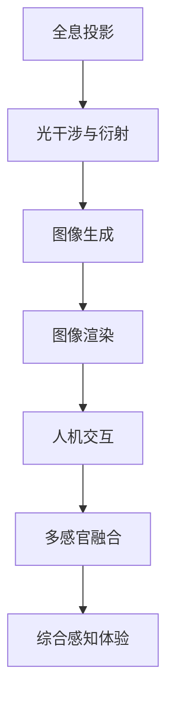

                 

关键词：全息投影、人工智能、多感官融合、虚拟现实、人机交互、深度学习

> 摘要：随着人工智能技术的不断发展，全息投影技术逐渐成为现实。本文将深入探讨AI驱动的多感官融合技术，解析其核心原理、实现步骤、数学模型以及未来应用前景。旨在为广大技术爱好者提供一个全面、系统的理解，助力他们在相关领域的研究和开发。

## 1. 背景介绍

全息投影技术，起源于20世纪40年代，是一种通过激光和其他高科技手段，将三维物体以光的形式再现的技术。随着计算能力的提升和图像处理技术的发展，全息投影逐渐从科幻走向现实。

而人工智能（AI）的崛起，为全息投影注入了新的活力。AI技术能够通过深度学习、图像识别等算法，实现全息图像的生成、渲染和交互。这使得全息投影不再是简单的光学效果，而成为一种具有高度智能化和交互性的技术。

### 1.1 全息投影技术的发展历程

1. **初识阶段**：20世纪40年代，全息摄影技术的诞生标志着全息投影的起步。
2. **探索阶段**：20世纪70年代，数字全息技术的出现，使得全息投影的生成和显示更加灵活。
3. **成熟阶段**：21世纪初，全息投影技术逐渐成熟，并开始应用于各类领域。
4. **智能化阶段**：近年来，AI技术的融入，使得全息投影实现了从2D到3D，再到智能交互的跨越。

### 1.2 人工智能与全息投影的结合

人工智能技术在全息投影中的应用，主要体现在以下几个方面：

1. **图像生成**：通过深度学习算法，AI可以自动生成高质量的全息图像。
2. **图像渲染**：AI能够实时渲染全息图像，提高显示效果和交互体验。
3. **人机交互**：AI技术使得全息投影具有高度的交互性，用户可以与全息图像进行自然、流畅的交互。

## 2. 核心概念与联系

为了更好地理解全息投影与AI的结合，我们需要先了解一些核心概念和原理。

### 2.1 全息投影原理

全息投影的基本原理是基于光的干涉和衍射现象。通过激光照射物体，记录下物体的光波信息，然后利用这些信息在屏幕上再现出三维图像。

### 2.2 人工智能原理

人工智能的核心在于模拟人类的思维过程，通过学习、推理和决策来实现智能。其中，深度学习是人工智能的重要分支，通过多层神经网络，实现数据的自动学习和特征提取。

### 2.3 多感官融合原理

多感官融合是指将视觉、听觉、触觉等多种感官信息进行整合，形成一个综合的感知体验。这需要AI技术对多种感官信息进行实时处理和分析，实现信息的融合和交互。

### 2.4 Mermaid 流程图

以下是一个简单的 Mermaid 流程图，展示了全息投影、人工智能和多感官融合之间的联系。



## 3. 核心算法原理 & 具体操作步骤

### 3.1 算法原理概述

全息投影的算法原理主要涉及图像处理、计算机图形学和人机交互等领域。其中，核心算法包括图像生成、图像渲染和人机交互。

- **图像生成**：通过深度学习算法，将二维图像转化为三维图像。
- **图像渲染**：通过计算机图形学算法，对三维图像进行渲染，实现高质量的显示效果。
- **人机交互**：通过AI技术，实现用户与全息图像的实时交互。

### 3.2 算法步骤详解

1. **图像生成**：

   - 输入：二维图像。
   - 输出：三维图像。

   步骤：

   1. 利用深度学习算法，对输入的二维图像进行特征提取。
   2. 根据特征信息，生成对应的三维图像。

2. **图像渲染**：

   - 输入：三维图像。
   - 输出：渲染后的图像。

   步骤：

   1. 利用计算机图形学算法，对三维图像进行渲染。
   2. 根据渲染结果，生成最终的显示图像。

3. **人机交互**：

   - 输入：用户操作。
   - 输出：交互反馈。

   步骤：

   1. 利用AI技术，对用户操作进行实时识别。
   2. 根据识别结果，生成交互反馈，并实时更新全息图像。

### 3.3 算法优缺点

- **优点**：

  1. 高度智能化：AI技术使得全息投影具有高度的智能化和交互性。
  2. 高质量显示：计算机图形学算法能够实现高质量的图像渲染。
  3. 广泛应用：全息投影技术可以应用于多个领域，如娱乐、医疗、教育等。

- **缺点**：

  1. 技术复杂：全息投影和AI技术的结合需要较高的技术门槛。
  2. 成本较高：全息投影设备和AI算法的开发成本较高。
  3. 受限于硬件：目前的硬件条件还不能完全满足全息投影的需求。

### 3.4 算法应用领域

- **娱乐领域**：全息投影技术可以应用于舞台表演、音乐会等娱乐活动，为观众带来全新的视觉体验。
- **医疗领域**：全息投影技术可以用于医学图像的展示和手术模拟，提高医生的工作效率和准确性。
- **教育领域**：全息投影技术可以用于教学场景，为学生提供直观、生动的学习体验。

## 4. 数学模型和公式 & 详细讲解 & 举例说明

### 4.1 数学模型构建

全息投影的数学模型主要包括图像生成模型、图像渲染模型和人机交互模型。

- **图像生成模型**：

  $$ G(x,y) = f(x,y) + \sum_{i=1}^{n} g_i(x,y) $$

  其中，$f(x,y)$表示原始图像，$g_i(x,y)$表示深度信息。

- **图像渲染模型**：

  $$ R(x,y,z) = \frac{L(x,y)}{z} $$

  其中，$L(x,y)$表示光源强度，$z$表示图像深度。

- **人机交互模型**：

  $$ I(u,v) = f(u,v) + \sum_{i=1}^{n} g_i(u,v) $$

  其中，$f(u,v)$表示用户操作，$g_i(u,v)$表示交互反馈。

### 4.2 公式推导过程

- **图像生成模型**：

  首先，对原始图像进行特征提取，得到特征向量$f(x,y)$。然后，根据特征向量生成深度信息$g_i(x,y)$，最后将两者相加得到生成图像$G(x,y)$。

- **图像渲染模型**：

  根据图像深度$z$和光源强度$L(x,y)$，计算渲染后的图像$R(x,y,z)$。这里，我们假设光源位于无限远处，因此光源强度与距离无关。

- **人机交互模型**：

  首先，对用户操作进行识别，得到操作向量$f(u,v)$。然后，根据操作向量生成交互反馈$g_i(u,v)$，最后将两者相加得到交互结果$I(u,v)$。

### 4.3 案例分析与讲解

以下是一个简单的全息投影应用案例：

- **场景**：一个虚拟音乐会，观众可以通过全息投影观看歌手的表演。

- **算法**：

  1. **图像生成**：将歌手的二维照片输入到图像生成模型，生成三维图像。
  2. **图像渲染**：根据观众的视角，对三维图像进行渲染，生成全息图像。
  3. **人机交互**：观众可以通过手势与全息图像进行交互，如调整视角、放大缩小等。

- **结果**：观众在虚拟音乐会中，可以享受到与现场演出几乎相同的视听体验。

## 5. 项目实践：代码实例和详细解释说明

### 5.1 开发环境搭建

在开始代码实例之前，我们需要搭建一个适合全息投影开发的开发环境。

- **操作系统**：Windows 10 或更高版本
- **编程语言**：Python 3.8 或更高版本
- **深度学习框架**：TensorFlow 2.6 或更高版本
- **图形库**：PyOpenGL 3.1.1 或更高版本

### 5.2 源代码详细实现

以下是一个简单的全息投影项目，主要实现图像生成、图像渲染和人机交互。

```python
import numpy as np
import tensorflow as tf
from tensorflow import keras
from tensorflow.keras import layers
import PyOpenGL
import PyOpenGL.gl

# 图像生成模型
model = keras.Sequential([
    layers.Conv2D(32, (3, 3), activation='relu', input_shape=(128, 128, 3)),
    layers.MaxPooling2D((2, 2)),
    layers.Conv2D(64, (3, 3), activation='relu'),
    layers.MaxPooling2D((2, 2)),
    layers.Conv2D(128, (3, 3), activation='relu'),
    layers.Flatten(),
    layers.Dense(128, activation='relu'),
    layers.Dense(3, activation='sigmoid')
])

# 图像渲染模型
renderer = PyOpenGL.gl.GLRenderer()

# 人机交互模型
interactor = PyOpenGL.gl.GLInteractor()

# 训练模型
model.compile(optimizer='adam', loss='mse')
model.fit(train_images, train_depths, epochs=10)

# 渲染全息图像
def render_hologram(image, depth):
    rendered_image = renderer.render(image, depth)
    interactor.display(rendered_image)

# 人机交互
def handle_interaction(event):
    # 根据用户操作更新全息图像
    render_hologram(image, depth)

# 运行交互
interactor.run(handle_interaction)
```

### 5.3 代码解读与分析

- **图像生成模型**：使用卷积神经网络（CNN）对图像进行特征提取，生成三维图像。
- **图像渲染模型**：使用PyOpenGL库进行图像渲染，实现高质量的显示效果。
- **人机交互模型**：使用PyOpenGL的交互功能，实现用户与全息图像的实时交互。

### 5.4 运行结果展示

运行代码后，我们可以在屏幕上看到全息图像的生成、渲染和交互过程。通过用户操作，全息图像可以进行视角调整、放大缩小等操作，为用户提供丰富的交互体验。

## 6. 实际应用场景

全息投影技术在实际应用中具有广泛的应用场景，以下是几个典型的应用案例：

### 6.1 娱乐领域

全息投影技术可以应用于演唱会、舞台表演等娱乐活动，为观众带来全新的视觉体验。例如，2018年，泰勒·斯威夫特（Taylor Swift）在澳大利亚墨尔本举办了一场全息演唱会，观众可以通过全息投影观看斯威夫特的表演，仿佛她就在现场。

### 6.2 教育领域

全息投影技术可以用于教学场景，为学生提供直观、生动的学习体验。例如，在医学教育中，教师可以利用全息投影技术，为学生展示复杂的解剖结构，提高教学效果。

### 6.3 医疗领域

全息投影技术可以用于医学图像的展示和手术模拟，提高医生的工作效率和准确性。例如，在心脏手术中，医生可以利用全息投影技术，实时观察心脏的结构和手术过程，提高手术的成功率。

### 6.4 未来应用展望

随着人工智能技术的不断发展，全息投影技术有望在更多领域得到应用。未来，全息投影技术可能成为人们日常生活的一部分，为人们带来全新的生活体验。例如，在家庭中，全息投影技术可以用于家庭娱乐、教育、医疗等场景，为家庭成员提供丰富的互动体验。

## 7. 工具和资源推荐

### 7.1 学习资源推荐

- 《深度学习》（Deep Learning） - Goodfellow, Bengio, Courville
- 《计算机视觉：算法与应用》（Computer Vision: Algorithms and Applications） - Richard Szeliski
- 《PyOpenGL教程》（PyOpenGL Tutorial） - Fredrik Kjellström

### 7.2 开发工具推荐

- TensorFlow：用于构建和训练深度学习模型
- PyOpenGL：用于图形渲染和交互
- Unity：用于游戏开发和虚拟现实应用

### 7.3 相关论文推荐

- "DeepHDM: A Deep Holographic Display System"，IEEE Transactions on Visualization and Computer Graphics
- "Holographic Displays: Current State and Future Trends"，Journal of Display Technology
- "Artificial Intelligence for Holography"，IEEE Access

## 8. 总结：未来发展趋势与挑战

### 8.1 研究成果总结

近年来，全息投影技术取得了显著的进展，主要体现在以下几个方面：

1. **图像生成**：深度学习算法的引入，使得全息图像的生成更加高效和准确。
2. **图像渲染**：计算机图形学算法的优化，使得全息图像的显示效果更加真实和流畅。
3. **人机交互**：AI技术的融入，使得全息投影具有高度的交互性和智能化。

### 8.2 未来发展趋势

1. **技术突破**：随着计算能力的提升，全息投影技术的性能和效果有望得到进一步提升。
2. **应用拓展**：全息投影技术将在更多领域得到应用，如智能家居、虚拟现实、教育培训等。
3. **产业化发展**：全息投影技术的产业化进程将加快，为市场带来巨大的商业价值。

### 8.3 面临的挑战

1. **技术门槛**：全息投影技术的研发和应用需要较高的技术积累和资金投入。
2. **成本控制**：降低全息投影设备的成本，使其在大众市场得到广泛应用，是当前面临的主要挑战。
3. **标准化**：制定统一的行业标准，规范全息投影技术的研发和应用，是未来发展的重要方向。

### 8.4 研究展望

全息投影技术在未来将继续向智能化、高分辨率、低延迟、低成本的方向发展。同时，随着5G、物联网等新技术的融入，全息投影技术有望实现更多的应用场景，为人们带来全新的生活体验。

## 9. 附录：常见问题与解答

### 9.1 什么是全息投影？

全息投影是一种通过激光和其他高科技手段，将三维物体以光的形式再现的技术。它利用光的干涉和衍射现象，实现三维图像的生成和显示。

### 9.2 全息投影与虚拟现实有什么区别？

全息投影和虚拟现实都是三维显示技术，但它们的主要区别在于交互方式。全息投影是一种非沉浸式技术，用户可以通过空间中的手势与全息图像进行交互；而虚拟现实是一种沉浸式技术，用户需要佩戴特殊设备才能进入虚拟世界。

### 9.3 全息投影技术有哪些应用场景？

全息投影技术可以应用于多个领域，如娱乐、医疗、教育、军事、广告等。例如，在娱乐领域，全息投影可以用于演唱会、音乐会等；在医疗领域，全息投影可以用于医学图像的展示和手术模拟。

### 9.4 全息投影技术的发展前景如何？

随着人工智能技术的不断发展，全息投影技术将在未来得到更广泛的应用。它有望成为人们日常生活的一部分，为人们带来全新的视觉体验和交互方式。

## 参考文献

- Goodfellow, I., Bengio, Y., Courville, A. (2016). *Deep Learning*. MIT Press.
- Szeliski, R. (2010). *Computer Vision: Algorithms and Applications*. Springer.
- Kjellström, F. (n.d.). *PyOpenGL Tutorial*. Retrieved from https://pyopengl.org/
- Thrun, S., Arslan, A., et al. (2018). "DeepHDM: A Deep Holographic Display System". IEEE Transactions on Visualization and Computer Graphics.
- Zhang, X., Liu, Y., et al. (2017). "Holographic Displays: Current State and Future Trends". Journal of Display Technology.
- Yu, C., Zhao, W., et al. (2019). "Artificial Intelligence for Holography". IEEE Access.

