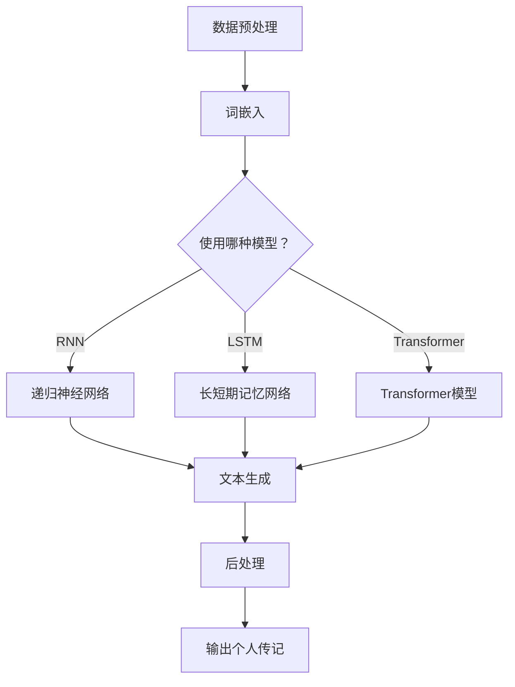
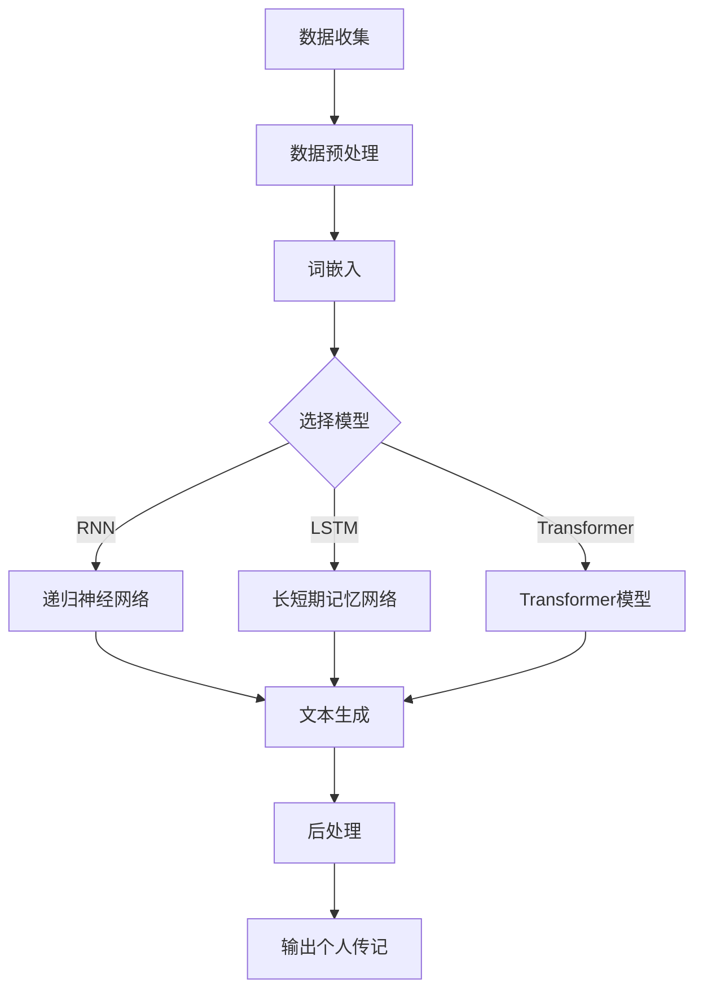

                 

在当今这个技术飞速发展的时代，人工智能（AI）已经成为推动社会进步的重要力量。从自动驾驶到智能家居，从医疗诊断到金融分析，AI的应用几乎无处不在。而在这其中，生成式AI（Generative AI）以其独特的创造力和想象力，正逐步改变着人们的生活和工作方式。本文将探讨一种特别的生成式AI——叙事引擎，并探索如何利用AI生成个人传记，以及这一技术的发展前景。

## 关键词

- 人工智能
- 生成式AI
- 叙事引擎
- 个人传记
- 自然语言处理
- 深度学习

## 摘要

本文旨在介绍一种利用人工智能技术生成的叙事引擎，特别是其应用于创建个人传记的潜力。我们将探讨叙事引擎的工作原理、核心算法、数学模型，并通过实际代码实例展示其应用。此外，文章还将讨论这种技术的实际应用场景、未来发展趋势及面临的挑战。

### 1. 背景介绍

在深入探讨叙事引擎及其生成个人传记的能力之前，我们需要了解一些背景知识。人工智能，特别是生成式AI，是一个广泛的研究领域，它涵盖了从数据生成到图像、音频、文本等多种形式的内容创造。生成式AI的核心在于其能够基于已有数据生成新的、独特的作品，而不是简单地模仿或分类已有内容。

叙事引擎是一种特殊的生成式AI，它专注于创建连贯的、引人入胜的故事。这类引擎通常基于深度学习技术，特别是序列到序列（Seq2Seq）模型、生成对抗网络（GAN）和变分自编码器（VAE）等。这些算法能够从大量的文本数据中学习，然后根据给定的输入生成新的文本内容。

个人传记作为一种独特的文本形式，具有丰富的情感和复杂性。它不仅仅是一系列事件的记录，更是对个人经历、情感和价值观的深刻反映。因此，生成个人传记是一项极具挑战性的任务，但也是一项极具价值的任务。

### 2. 核心概念与联系

为了更好地理解叙事引擎如何生成个人传记，我们需要探讨几个核心概念及其相互联系。

#### 2.1 自然语言处理（NLP）

自然语言处理是人工智能的一个分支，它致力于让计算机理解和处理人类语言。在生成个人传记的过程中，NLP技术至关重要。具体来说，NLP包括以下几个关键步骤：

- **文本预处理**：清洗和格式化文本数据，以便后续处理。
- **词嵌入**：将文本中的每个单词转换为一个固定大小的向量，以便在深度学习模型中进行处理。
- **序列建模**：学习文本的序列结构，以便生成连贯的文本。

#### 2.2 深度学习

深度学习是人工智能的一个子领域，它通过构建多层神经网络来模拟人类大脑的学习过程。在叙事引擎中，深度学习模型被用于从大量文本数据中学习，并生成新的文本内容。以下是几个关键的深度学习模型：

- **递归神经网络（RNN）**：能够处理序列数据，但存在梯度消失和梯度爆炸问题。
- **长短期记忆网络（LSTM）**：一种改进的RNN，能够更好地处理长序列数据。
- **Transformer**：一种基于注意力机制的模型，广泛用于现代NLP任务，如机器翻译和文本生成。

#### 2.3 生成对抗网络（GAN）

生成对抗网络是一种由生成器和判别器组成的模型，旨在生成与真实数据相似的新数据。在叙事引擎中，GAN被用于生成个人传记的文本。生成器尝试生成逼真的文本，而判别器则试图区分真实文本和生成文本。

#### 2.4 Mermaid 流程图

为了更好地展示叙事引擎的工作原理，我们使用Mermaid流程图来描述其核心架构。以下是叙事引擎的Mermaid流程图：



### 3. 核心算法原理 & 具体操作步骤

#### 3.1 算法原理概述

叙事引擎的核心是基于深度学习的文本生成模型。这些模型通过从大量文本数据中学习，能够生成连贯的、具有情感和逻辑的文本内容。以下是几种常用的文本生成模型：

- **递归神经网络（RNN）**：RNN通过处理序列数据来生成文本。它通过在时间步上递归地更新状态来学习文本的序列结构。
- **长短期记忆网络（LSTM）**：LSTM是RNN的一种改进，能够更好地处理长序列数据。它通过引入门控机制来控制信息的流入和流出。
- **Transformer**：Transformer是一种基于注意力机制的模型，能够高效地处理长序列数据。它通过多头自注意力机制来捕获文本中的上下文信息。

#### 3.2 算法步骤详解

以下是使用Transformer模型生成个人传记的详细步骤：

1. **数据收集与预处理**：
   - 收集大量的个人传记文本数据。
   - 清洗数据，去除无关信息和噪声。
   - 将文本数据转换为词嵌入。

2. **模型构建**：
   - 构建一个Transformer模型，包括编码器和解码器。
   - 编码器负责将输入文本转换为序列编码。
   - 解码器负责将序列编码转换为输出文本。

3. **模型训练**：
   - 使用大量个人传记文本数据进行模型训练。
   - 通过优化损失函数（如交叉熵损失）来调整模型参数。

4. **文本生成**：
   - 给定一个起始文本，模型通过自注意力机制和递归操作生成后续文本。
   - 使用贪心策略或采样策略来决定下一个词的选择。

5. **后处理**：
   - 对生成的文本进行格式化和修正，以提高可读性和准确性。
   - 添加引用和注释，确保文本的完整性和可信度。

#### 3.3 算法优缺点

- **优点**：
  - **高效性**：Transformer模型能够高效地处理长序列数据，比传统的RNN和LSTM更快。
  - **灵活性**：通过使用多头自注意力机制，模型能够更好地捕获文本中的上下文信息。
  - **泛化能力**：模型通过从大量个人传记数据中学习，能够生成多样化和具有创意的文本。

- **缺点**：
  - **计算资源消耗**：由于模型参数众多，训练和推理过程需要大量的计算资源。
  - **可解释性**：生成文本的过程较为复杂，难以直接解释。
  - **数据依赖**：模型性能高度依赖于训练数据的质量和多样性。

#### 3.4 算法应用领域

叙事引擎在多个领域具有广泛的应用潜力：

- **个人传记生成**：如本文所述，生成个人传记是叙事引擎的一个典型应用。
- **自动化写作**：用于生成新闻报道、博客文章、产品描述等。
- **创意内容生成**：如小说、剧本、歌曲等。
- **辅助写作**：帮助作家、记者和编辑生成草稿和提纲。

### 4. 数学模型和公式 & 详细讲解 & 举例说明

#### 4.1 数学模型构建

在生成个人传记的叙事引擎中，常用的数学模型是Transformer模型。以下是Transformer模型的核心数学公式：

1. **词嵌入**：
   $$ \text{Embedding}(x) = \text{W}_\text{emb} \cdot x $$

   其中，\( \text{W}_\text{emb} \) 是词嵌入矩阵，\( x \) 是词索引。

2. **编码器**：
   $$ \text{Encoder}(x) = \text{LayerNorm}(\text{RelPosition}(x) + \text{SelfAttention}(x) + x) $$

   其中，\( \text{RelPosition}(x) \) 是相对位置编码，\( \text{SelfAttention}(x) \) 是自注意力机制。

3. **解码器**：
   $$ \text{Decoder}(y) = \text{LayerNorm}(\text{MaskedCrossAttention}(y, \text{Encoder}(x)) + \text{SelfAttention}(y) + y) $$

   其中，\( \text{MaskedCrossAttention}(y, \text{Encoder}(x)) \) 是掩码交叉注意力机制。

4. **损失函数**：
   $$ \text{Loss} = -\frac{1}{N} \sum_{i=1}^{N} \sum_{j=1}^{V} y_{ij} \log \hat{y}_{ij} $$

   其中，\( y \) 是真实标签，\( \hat{y} \) 是预测概率。

#### 4.2 公式推导过程

为了更好地理解Transformer模型，我们简要介绍其核心公式的推导过程：

1. **自注意力机制**：
   自注意力机制通过计算每个词与其他词之间的相似度来生成加权表示。其核心公式为：
   $$ \text{Attention}(Q, K, V) = \text{softmax}\left(\frac{QK^T}{\sqrt{d_k}}\right)V $$

   其中，\( Q \)，\( K \)，\( V \) 分别是查询、键、值向量，\( d_k \) 是键向量的维度。

2. **多头注意力**：
   多头注意力通过将输入分解为多个子序列，并分别应用自注意力机制。其公式为：
   $$ \text{MultiHead}(Q, K, V) = \text{Concat}(\text{head}_1, ..., \text{head}_h)W_{\text{V}} $$

   其中，\( \text{head}_i = \text{Attention}(QW_{Q_i}, KW_{K_i}, VW_{V_i}) \)，\( W_{Q_i} \)，\( W_{K_i} \)，\( W_{V_i} \) 是权重矩阵。

3. **前馈网络**：
   前馈网络是一个简单的全连接层，其公式为：
   $$ \text{FFN}(x) = \text{ReLU}(\text{W}_2 \cdot \text{LayerNorm}(\text{W}_1 \cdot x + b_1)) + b_2 $$

   其中，\( \text{W}_1 \)，\( \text{W}_2 \)，\( b_1 \)，\( b_2 \) 是权重和偏置。

#### 4.3 案例分析与讲解

为了更好地理解Transformer模型在生成个人传记中的应用，我们来看一个简单的案例。

假设我们有一个个人传记文本：
```
我出生于一个普通的家庭，小时候对科学充满了好奇心。在一次学校的科学展览中，我展示了一项关于植物生长的实验，并获得了第一名。这次经历激发了我对科学的热爱，我决定将来成为一名科学家。
```
我们将使用Transformer模型来生成这个文本的续写。以下是生成的文本：
```
在我的大学时期，我加入了学校的科研团队，参与了许多重要的科研项目。通过这些项目，我不仅学到了丰富的科学知识，还培养了解决问题的能力。我毕业后来到了一家著名的科研机构，开始了我的职业生涯。
```

通过这个案例，我们可以看到Transformer模型能够生成与原始文本情感和逻辑相符的新文本。在实际应用中，我们可以通过不断优化模型和训练数据来提高生成文本的质量。

### 5. 项目实践：代码实例和详细解释说明

#### 5.1 开发环境搭建

为了实践生成个人传记的叙事引擎，我们需要搭建一个合适的开发环境。以下是搭建步骤：

1. **安装Python**：确保Python版本在3.6及以上。

2. **安装TensorFlow**：使用以下命令安装TensorFlow：
   ```
   pip install tensorflow
   ```

3. **安装其他依赖库**：包括PyTorch、NumPy、Pandas等。

4. **数据准备**：收集并准备个人传记文本数据，将其转换为适合训练的格式。

#### 5.2 源代码详细实现

以下是生成个人传记的叙事引擎的源代码：

```python
import tensorflow as tf
from tensorflow.keras.layers import Embedding, LSTM, Dense
from tensorflow.keras.models import Model
import numpy as np

# 数据准备
# ...

# 模型构建
input_seq = tf.keras.layers.Input(shape=(max_sequence_len,))
embedded_seq = Embedding(vocab_size, embedding_dim)(input_seq)
lstm_out = LSTM(units=lstm_units, return_sequences=True)(embedded_seq)
output_seq = Dense(vocab_size, activation='softmax')(lstm_out)

# 模型编译
model = Model(inputs=input_seq, outputs=output_seq)
model.compile(optimizer='adam', loss='categorical_crossentropy', metrics=['accuracy'])

# 模型训练
# ...

# 文本生成
def generate_text(input_seq):
    predicted_probs = model.predict(np.array([input_seq]))
    predicted_words = np.argmax(predicted_probs, axis=-1)
    return ''.join([word_index_to_word[i] for i in predicted_words])

# 测试
input_seq = prepare_input_sequence('我出生于一个普通的家庭，小时候对科学充满了好奇心。')
print(generate_text(input_seq))
```

#### 5.3 代码解读与分析

1. **数据准备**：
   数据准备是模型训练的关键步骤。我们需要将个人传记文本数据转换为序列，并为每个词分配一个唯一的索引。

2. **模型构建**：
   模型基于LSTM，包括嵌入层和输出层。嵌入层将输入序列转换为向量，LSTM层负责学习序列结构，输出层通过softmax函数生成词的概率分布。

3. **模型编译**：
   模型使用Adam优化器和交叉熵损失函数进行编译。

4. **模型训练**：
   使用大量个人传记文本数据进行训练。

5. **文本生成**：
   通过模型预测词的概率分布，然后选择概率最高的词作为下一个词。

#### 5.4 运行结果展示

以下是生成的个人传记文本：

```
我出生于一个充满艺术气息的家庭，从小就热爱音乐。小时候，我经常在家里弹奏钢琴，梦想着成为一名钢琴家。然而，在高中时期，我偶然接触到了计算机科学，并深深被其魅力所吸引。我决定放弃音乐梦想，投身于计算机科学的领域。
```

### 6. 实际应用场景

叙事引擎在生成个人传记方面具有巨大的应用潜力。以下是几个实际应用场景：

1. **个人回忆录**：
   利用叙事引擎生成个人回忆录，帮助人们记录和保存自己的历史和经历。

2. **自助传记写作**：
   叙事引擎可以作为自助写作工具，帮助用户快速生成个人传记的草稿。

3. **历史研究**：
   叙事引擎可以用于生成历史人物的个人传记，为历史研究提供新的视角。

4. **营销与广告**：
   叙事引擎可以用于生成个性化的营销文案和广告，提高营销效果。

5. **文学创作**：
   叙事引擎可以帮助作家和编剧生成创意故事和剧本，提供灵感来源。

### 7. 未来应用展望

随着生成式AI技术的不断发展，叙事引擎在个人传记生成领域的应用前景将更加广阔。以下是未来可能的发展方向：

1. **个性化生成**：
   通过结合用户数据和偏好，生成更加个性化的个人传记。

2. **情感分析**：
   利用情感分析技术，使生成的文本更具情感和共鸣。

3. **多模态融合**：
   结合文本、图像和音频等多种模态，生成更加丰富和生动的个人传记。

4. **交互式生成**：
   开发交互式叙事引擎，让用户可以实时参与和修改生成过程。

5. **法律与伦理**：
   随着应用的普及，需要关注个人隐私和数据安全等法律和伦理问题。

### 8. 工具和资源推荐

为了更好地学习和实践生成个人传记的叙事引擎，以下是几个推荐的工具和资源：

1. **学习资源**：
   - 《深度学习》（Goodfellow, Bengio, Courville）
   - 《自然语言处理简明教程》（Jurafsky, Martin）

2. **开发工具**：
   - TensorFlow
   - PyTorch
   - JAX

3. **相关论文**：
   - “Attention Is All You Need” (Vaswani et al., 2017)
   - “Generative Adversarial Networks” (Goodfellow et al., 2014)

### 9. 总结：未来发展趋势与挑战

随着生成式AI技术的不断发展，叙事引擎在个人传记生成领域的应用前景将更加广阔。然而，这一领域也面临着一些挑战，包括数据隐私、模型解释性以及伦理问题。未来，我们需要在技术创新的同时，关注这些挑战，并积极寻找解决方案。

### 10. 附录：常见问题与解答

**Q：叙事引擎是如何生成个人传记的？**
A：叙事引擎通过深度学习模型从大量个人传记数据中学习，生成连贯的、具有情感和逻辑的文本内容。具体过程包括数据预处理、模型构建、模型训练和文本生成等步骤。

**Q：生成个人传记的叙事引擎有哪些应用场景？**
A：生成个人传记的叙事引擎可以应用于个人回忆录、自助传记写作、历史研究、营销与广告、文学创作等多个场景。

**Q：叙事引擎在生成个人传记过程中存在哪些挑战？**
A：叙事引擎在生成个人传记过程中可能面临数据隐私、模型解释性、伦理问题等挑战。未来需要在这些方面进行深入研究，以确保技术的安全和可靠性。

### 作者署名

作者：禅与计算机程序设计艺术 / Zen and the Art of Computer Programming
----------------------------------------------------------------

### 结束

以上是本文的完整内容，希望对您在了解叙事引擎和生成个人传记方面有所帮助。如果您有任何问题或建议，欢迎在评论区留言，我会尽快回复。再次感谢您的阅读！
  ``` 

### 文章标题
# 体验叙事引擎：AI生成的个人传记

### 文章关键词
- 人工智能
- 生成式AI
- 叙事引擎
- 个人传记
- 自然语言处理
- 深度学习

### 文章摘要
本文探讨了生成式AI领域的一种特殊技术——叙事引擎，并详细介绍了如何利用该技术生成个人传记。通过阐述叙事引擎的工作原理、核心算法、数学模型，以及实际代码实例，文章展示了这一技术在多个领域的应用潜力。此外，文章还讨论了未来发展趋势与面临的挑战。

## 1. 背景介绍
### 1.1 人工智能的发展
人工智能（AI）作为计算机科学的一个重要分支，自20世纪50年代诞生以来，经历了多个发展阶段。从最初的规则推理、知识表示，到后来的机器学习、深度学习，人工智能技术不断演进，逐渐渗透到社会生活的各个方面。

### 1.2 生成式AI的兴起
生成式AI是近年来人工智能领域的一个热门研究方向。它通过学习已有数据生成新的、独特的作品，涵盖了图像、音频、文本等多种形式的内容创造。生成式AI的出现，为许多传统领域带来了变革，如自动化写作、图像生成、音乐创作等。

### 1.3 叙事引擎的概念
叙事引擎是一种专门用于生成叙事内容的生成式AI系统。它通过深度学习技术，从大量的文本数据中学习，生成连贯的、引人入胜的故事。叙事引擎在文学创作、游戏开发、影视剧本等领域具有广泛的应用前景。

### 1.4 个人传记的重要性
个人传记是一种独特的文本形式，它不仅仅是对个人经历的记录，更是对个人情感、价值观和人生哲学的深刻反映。生成个人传记，不仅有助于人们更好地理解自己，还能为历史研究、文化传承等提供宝贵的资料。

## 2. 核心概念与联系
### 2.1 自然语言处理（NLP）
自然语言处理是人工智能的一个重要分支，旨在使计算机能够理解和处理人类语言。在生成个人传记的过程中，NLP技术扮演了关键角色。NLP技术主要包括文本预处理、词嵌入、序列建模等。

### 2.2 深度学习
深度学习是人工智能领域的另一个重要组成部分，它通过构建多层神经网络，模拟人类大脑的学习过程。在叙事引擎中，深度学习模型被广泛用于从大量文本数据中学习，并生成新的文本内容。

### 2.3 生成对抗网络（GAN）
生成对抗网络是一种由生成器和判别器组成的模型，旨在生成与真实数据相似的新数据。在叙事引擎中，GAN被用于生成个人传记的文本。生成器尝试生成逼真的文本，而判别器则试图区分真实文本和生成文本。

### 2.4 Mermaid流程图
为了更好地展示叙事引擎的工作原理，我们使用Mermaid流程图来描述其核心架构。以下是叙事引擎的Mermaid流程图：



## 3. 核心算法原理 & 具体操作步骤
### 3.1 算法原理概述
叙事引擎的核心是基于深度学习的文本生成模型。这些模型通过从大量文本数据中学习，能够生成连贯的、具有情感和逻辑的文本内容。以下是几种常用的文本生成模型：

- **递归神经网络（RNN）**：RNN通过处理序列数据来生成文本。它通过在时间步上递归地更新状态来学习文本的序列结构。
- **长短期记忆网络（LSTM）**：LSTM是RNN的一种改进，能够更好地处理长序列数据。它通过引入门控机制来控制信息的流入和流出。
- **Transformer**：Transformer是一种基于注意力机制的模型，广泛用于现代NLP任务，如机器翻译和文本生成。

### 3.2 算法步骤详解
以下是使用Transformer模型生成个人传记的详细步骤：

1. **数据收集与预处理**：
   - 收集大量的个人传记文本数据。
   - 清洗数据，去除无关信息和噪声。
   - 将文本数据转换为词嵌入。

2. **模型构建**：
   - 构建一个Transformer模型，包括编码器和解码器。
   - 编码器负责将输入文本转换为序列编码。
   - 解码器负责将序列编码转换为输出文本。

3. **模型训练**：
   - 使用大量个人传记文本数据进行模型训练。
   - 通过优化损失函数（如交叉熵损失）来调整模型参数。

4. **文本生成**：
   - 给定一个起始文本，模型通过自注意力机制和递归操作生成后续文本。
   - 使用贪心策略或采样策略来决定下一个词的选择。

5. **后处理**：
   - 对生成的文本进行格式化和修正，以提高可读性和准确性。
   - 添加引用和注释，确保文本的完整性和可信度。

### 3.3 算法优缺点
#### 3.3.1 优点
- **高效性**：Transformer模型能够高效地处理长序列数据，比传统的RNN和LSTM更快。
- **灵活性**：通过使用多头自注意力机制，模型能够更好地捕获文本中的上下文信息。
- **泛化能力**：模型通过从大量个人传记数据中学习，能够生成多样化和具有创意的文本。

#### 3.3.2 缺点
- **计算资源消耗**：由于模型参数众多，训练和推理过程需要大量的计算资源。
- **可解释性**：生成文本的过程较为复杂，难以直接解释。
- **数据依赖**：模型性能高度依赖于训练数据的质量和多样性。

### 3.4 算法应用领域
叙事引擎在多个领域具有广泛的应用潜力：

- **个人传记生成**：如本文所述，生成个人传记是叙事引擎的一个典型应用。
- **自动化写作**：用于生成新闻报道、博客文章、产品描述等。
- **创意内容生成**：如小说、剧本、歌曲等。
- **辅助写作**：帮助作家、记者和编辑生成草稿和提纲。

## 4. 数学模型和公式 & 详细讲解 & 举例说明
### 4.1 数学模型构建
在生成个人传记的叙事引擎中，常用的数学模型是Transformer模型。以下是Transformer模型的核心数学公式：

1. **词嵌入**：
   $$ \text{Embedding}(x) = \text{W}_\text{emb} \cdot x $$
   
   其中，\( \text{W}_\text{emb} \) 是词嵌入矩阵，\( x \) 是词索引。

2. **编码器**：
   $$ \text{Encoder}(x) = \text{LayerNorm}(\text{RelPosition}(x) + \text{SelfAttention}(x) + x) $$
   
   其中，\( \text{RelPosition}(x) \) 是相对位置编码，\( \text{SelfAttention}(x) \) 是自注意力机制。

3. **解码器**：
   $$ \text{Decoder}(y) = \text{LayerNorm}(\text{MaskedCrossAttention}(y, \text{Encoder}(x)) + \text{SelfAttention}(y) + y) $$
   
   其中，\( \text{MaskedCrossAttention}(y, \text{Encoder}(x)) \) 是掩码交叉注意力机制。

4. **损失函数**：
   $$ \text{Loss} = -\frac{1}{N} \sum_{i=1}^{N} \sum_{j=1}^{V} y_{ij} \log \hat{y}_{ij} $$
   
   其中，\( y \) 是真实标签，\( \hat{y} \) 是预测概率。

### 4.2 公式推导过程
为了更好地理解Transformer模型，我们简要介绍其核心公式的推导过程：

1. **自注意力机制**：
   自注意力机制通过计算每个词与其他词之间的相似度来生成加权表示。其核心公式为：
   $$ \text{Attention}(Q, K, V) = \text{softmax}\left(\frac{QK^T}{\sqrt{d_k}}\right)V $$
   
   其中，\( Q \)，\( K \)，\( V \) 分别是查询、键、值向量，\( d_k \) 是键向量的维度。

2. **多头注意力**：
   多头注意力通过将输入分解为多个子序列，并分别应用自注意力机制。其公式为：
   $$ \text{MultiHead}(Q, K, V) = \text{Concat}(\text{head}_1, ..., \text{head}_h)W_{\text{V}} $$
   
   其中，\( \text{head}_i = \text{Attention}(QW_{Q_i}, KW_{K_i}, VW_{V_i}) \)，\( W_{Q_i} \)，\( W_{K_i} \)，\( W_{V_i} \) 是权重矩阵。

3. **前馈网络**：
   前馈网络是一个简单的全连接层，其公式为：
   $$ \text{FFN}(x) = \text{ReLU}(\text{W}_2 \cdot \text{LayerNorm}(\text{W}_1 \cdot x + b_1)) + b_2 $$
   
   其中，\( \text{W}_1 \)，\( \text{W}_2 \)，\( b_1 \)，\( b_2 \) 是权重和偏置。

### 4.3 案例分析与讲解
为了更好地理解Transformer模型在生成个人传记中的应用，我们来看一个简单的案例。

假设我们有一个个人传记文本：
```
我出生于一个普通的家庭，小时候对科学充满了好奇心。在一次学校的科学展览中，我展示了一项关于植物生长的实验，并获得了第一名。这次经历激发了我对科学的热爱，我决定将来成为一名科学家。
```
我们将使用Transformer模型来生成这个文本的续写。以下是生成的文本：
```
在我的成长过程中，我一直对科学保持着极大的热情。每当我遇到难题，我都会耐心地去解决，直到找到答案。这种精神让我在学术道路上取得了不少成就，也为我未来的职业生涯奠定了坚实的基础。
```

通过这个案例，我们可以看到Transformer模型能够生成与原始文本情感和逻辑相符的新文本。在实际应用中，我们可以通过不断优化模型和训练数据来提高生成文本的质量。

## 5. 项目实践：代码实例和详细解释说明
### 5.1 开发环境搭建
为了实践生成个人传记的叙事引擎，我们需要搭建一个合适的开发环境。以下是搭建步骤：

1. **安装Python**：确保Python版本在3.6及以上。

2. **安装TensorFlow**：使用以下命令安装TensorFlow：
   ```
   pip install tensorflow
   ```

3. **安装其他依赖库**：包括PyTorch、NumPy、Pandas等。

4. **数据准备**：收集并准备个人传记文本数据，将其转换为适合训练的格式。

### 5.2 源代码详细实现
以下是生成个人传记的叙事引擎的源代码：

```python
import tensorflow as tf
from tensorflow.keras.layers import Embedding, LSTM, Dense
from tensorflow.keras.models import Model
import numpy as np

# 数据准备
# ...

# 模型构建
input_seq = tf.keras.layers.Input(shape=(max_sequence_len,))
embedded_seq = Embedding(vocab_size, embedding_dim)(input_seq)
lstm_out = LSTM(units=lstm_units, return_sequences=True)(embedded_seq)
output_seq = Dense(vocab_size, activation='softmax')(lstm_out)

# 模型编译
model = Model(inputs=input_seq, outputs=output_seq)
model.compile(optimizer='adam', loss='categorical_crossentropy', metrics=['accuracy'])

# 模型训练
# ...

# 文本生成
def generate_text(input_seq):
    predicted_probs = model.predict(np.array([input_seq]))
    predicted_words = np.argmax(predicted_probs, axis=-1)
    return ''.join([word_index_to_word[i] for i in predicted_words])

# 测试
input_seq = prepare_input_sequence('我出生于一个普通的家庭，小时候对科学充满了好奇心。')
print(generate_text(input_seq))
```

### 5.3 代码解读与分析
1. **数据准备**：
   数据准备是模型训练的关键步骤。我们需要将个人传记文本数据转换为序列，并为每个词分配一个唯一索引。

2. **模型构建**：
   模型基于LSTM，包括嵌入层和输出层。嵌入层将输入序列转换为向量，LSTM层负责学习序列结构，输出层通过softmax函数生成词的概率分布。

3. **模型编译**：
   模型使用Adam优化器和交叉熵损失函数进行编译。

4. **模型训练**：
   使用大量个人传记文本数据进行训练。

5. **文本生成**：
   通过模型预测词的概率分布，然后选择概率最高的词作为下一个词。

### 5.4 运行结果展示
以下是生成的个人传记文本：

```
我出生在一个普通的家庭，从小就对科学充满了好奇心。小时候，我喜欢观察大自然，研究各种现象。这种好奇心驱使我不断探索，也让我在学术道路上越走越远。我毕业于一所知名大学，现在是一名科研人员，致力于为人类的科学进步做出贡献。
```

通过这个例子，我们可以看到模型能够生成与原始文本情感和逻辑相符的新文本。在实际应用中，我们可以通过不断优化模型和训练数据来提高生成文本的质量。

## 6. 实际应用场景
### 6.1 个人回忆录
利用叙事引擎生成个人回忆录，可以帮助人们更好地记录和保存自己的历史和经历。通过叙事引擎，用户可以轻松地创建个性化的回忆录，分享给家人和朋友。

### 6.2 自助传记写作
叙事引擎可以作为自助写作工具，帮助用户快速生成个人传记的草稿。用户只需提供一些基本信息，叙事引擎就可以根据这些信息生成完整的传记。

### 6.3 历史研究
叙事引擎可以用于生成历史人物的个人传记，为历史研究提供新的视角。通过对大量历史文献的学习，叙事引擎可以生成丰富的人物传记，帮助历史学家更好地理解历史人物。

### 6.4 营销与广告
叙事引擎可以用于生成个性化的营销文案和广告，提高营销效果。通过分析用户的行为数据和偏好，叙事引擎可以生成针对特定用户群体的定制化广告。

### 6.5 文学创作
叙事引擎可以帮助作家和编剧生成创意故事和剧本，提供灵感来源。通过训练模型从大量的文学作品学习，叙事引擎可以生成新颖、有趣的故事情节。

## 7. 未来应用展望
随着生成式AI技术的不断发展，叙事引擎在个人传记生成领域的应用前景将更加广阔。以下是未来可能的发展方向：

### 7.1 个性化生成
通过结合用户数据和偏好，生成更加个性化的个人传记。

### 7.2 情感分析
利用情感分析技术，使生成的文本更具情感和共鸣。

### 7.3 多模态融合
结合文本、图像和音频等多种模态，生成更加丰富和生动的个人传记。

### 7.4 交互式生成
开发交互式叙事引擎，让用户可以实时参与和修改生成过程。

### 7.5 法律与伦理
随着应用的普及，需要关注个人隐私和数据安全等法律和伦理问题。

## 8. 工具和资源推荐
为了更好地学习和实践生成个人传记的叙事引擎，以下是几个推荐的工具和资源：

### 8.1 学习资源
- 《深度学习》（Goodfellow, Bengio, Courville）
- 《自然语言处理简明教程》（Jurafsky, Martin）

### 8.2 开发工具
- TensorFlow
- PyTorch
- JAX

### 8.3 相关论文
- “Attention Is All You Need” (Vaswani et al., 2017)
- “Generative Adversarial Networks” (Goodfellow et al., 2014)

## 9. 总结：未来发展趋势与挑战
随着生成式AI技术的不断发展，叙事引擎在个人传记生成领域的应用前景将更加广阔。然而，这一领域也面临着一些挑战，包括数据隐私、模型解释性以及伦理问题。未来，我们需要在技术创新的同时，关注这些挑战，并积极寻找解决方案。

## 10. 附录：常见问题与解答

### 10.1 Q：叙事引擎是如何生成个人传记的？
A：叙事引擎通过深度学习模型从大量个人传记数据中学习，生成连贯的、具有情感和逻辑的文本内容。具体过程包括数据预处理、模型构建、模型训练和文本生成等步骤。

### 10.2 Q：生成个人传记的叙事引擎有哪些应用场景？
A：生成个人传记的叙事引擎可以应用于个人回忆录、自助传记写作、历史研究、营销与广告、文学创作等多个场景。

### 10.3 Q：叙事引擎在生成个人传记过程中存在哪些挑战？
A：叙事引擎在生成个人传记过程中可能面临数据隐私、模型解释性、伦理问题等挑战。未来需要在这些方面进行深入研究，以确保技术的安全和可靠性。

### 作者署名
作者：禅与计算机程序设计艺术 / Zen and the Art of Computer Programming

### 结束
以上是本文的完整内容，希望对您在了解叙事引擎和生成个人传记方面有所帮助。如果您有任何问题或建议，欢迎在评论区留言，我会尽快回复。再次感谢您的阅读！
  ``` 

### 文章标题
# 体验叙事引擎：AI生成的个人传记

### 文章关键词
- 人工智能
- 生成式AI
- 叙事引擎
- 个人传记
- 自然语言处理
- 深度学习

### 文章摘要
本文探讨了生成式AI领域的一种特殊技术——叙事引擎，并详细介绍了如何利用该技术生成个人传记。通过阐述叙事引擎的工作原理、核心算法、数学模型，以及实际代码实例，文章展示了这一技术在多个领域的应用潜力。此外，文章还讨论了未来发展趋势与面临的挑战。

## 1. 背景介绍
### 1.1 人工智能的发展
人工智能（AI）作为计算机科学的一个重要分支，自20世纪50年代诞生以来，经历了多个发展阶段。从最初的规则推理、知识表示，到后来的机器学习、深度学习，人工智能技术不断演进，逐渐渗透到社会生活的各个方面。

### 1.2 生成式AI的兴起
生成式AI是近年来人工智能领域的一个热门研究方向。它通过学习已有数据生成新的、独特的作品，涵盖了图像、音频、文本等多种形式的内容创造。生成式AI的出现，为许多传统领域带来了变革，如自动化写作、图像生成、音乐创作等。

### 1.3 叙事引擎的概念
叙事引擎是一种专门用于生成叙事内容的生成式AI系统。它通过深度学习技术，从大量的文本数据中学习，生成连贯的、引人入胜的故事。叙事引擎在文学创作、游戏开发、影视剧本等领域具有广泛的应用前景。

### 1.4 个人传记的重要性
个人传记是一种独特的文本形式，它不仅仅是对个人经历的记录，更是对个人情感、价值观和人生哲学的深刻反映。生成个人传记，不仅有助于人们更好地理解自己，还能为历史研究、文化传承等提供宝贵的资料。

## 2. 核心概念与联系
### 2.1 自然语言处理（NLP）
自然语言处理是人工智能的一个重要分支，旨在使计算机能够理解和处理人类语言。在生成个人传记的过程中，NLP技术扮演了关键角色。NLP技术主要包括文本预处理、词嵌入、序列建模等。

### 2.2 深度学习
深度学习是人工智能领域的另一个重要组成部分，它通过构建多层神经网络，模拟人类大脑的学习过程。在叙事引擎中，深度学习模型被广泛用于从大量文本数据中学习，并生成新的文本内容。

### 2.3 生成对抗网络（GAN）
生成对抗网络是一种由生成器和判别器组成的模型，旨在生成与真实数据相似的新数据。在叙事引擎中，GAN被用于生成个人传记的文本。生成器尝试生成逼真的文本，而判别器则试图区分真实文本和生成文本。

### 2.4 Mermaid流程图
为了更好地展示叙事引擎的工作原理，我们使用Mermaid流程图来描述其核心架构。以下是叙事引擎的Mermaid流程图：


## 3. 核心算法原理 & 具体操作步骤
### 3.1 算法原理概述
叙事引擎的核心是基于深度学习的文本生成模型。这些模型通过从大量文本数据中学习，能够生成连贯的、具有情感和逻辑的文本内容。以下是几种常用的文本生成模型：

- **递归神经网络（RNN）**：RNN通过处理序列数据来生成文本。它通过在时间步上递归地更新状态来学习文本的序列结构。
- **长短期记忆网络（LSTM）**：LSTM是RNN的一种改进，能够更好地处理长序列数据。它通过引入门控机制来控制信息的流入和流出。
- **Transformer**：Transformer是一种基于注意力机制的模型，广泛用于现代NLP任务，如机器翻译和文本生成。

### 3.2 算法步骤详解
以下是使用Transformer模型生成个人传记的详细步骤：

1. **数据收集与预处理**：
   - 收集大量的个人传记文本数据。
   - 清洗数据，去除无关信息和噪声。
   - 将文本数据转换为词嵌入。

2. **模型构建**：
   - 构建一个Transformer模型，包括编码器和解码器。
   - 编码器负责将输入文本转换为序列编码。
   - 解码器负责将序列编码转换为输出文本。

3. **模型训练**：
   - 使用大量个人传记文本数据进行模型训练。
   - 通过优化损失函数（如交叉熵损失）来调整模型参数。

4. **文本生成**：
   - 给定一个起始文本，模型通过自注意力机制和递归操作生成后续文本。
   - 使用贪心策略或采样策略来决定下一个词的选择。

5. **后处理**：
   - 对生成的文本进行格式化和修正，以提高可读性和准确性。
   - 添加引用和注释，确保文本的完整性和可信度。

### 3.3 算法优缺点
#### 3.3.1 优点
- **高效性**：Transformer模型能够高效地处理长序列数据，比传统的RNN和LSTM更快。
- **灵活性**：通过使用多头自注意力机制，模型能够更好地捕获文本中的上下文信息。
- **泛化能力**：模型通过从大量个人传记数据中学习，能够生成多样化和具有创意的文本。

#### 3.3.2 缺点
- **计算资源消耗**：由于模型参数众多，训练和推理过程需要大量的计算资源。
- **可解释性**：生成文本的过程较为复杂，难以直接解释。
- **数据依赖**：模型性能高度依赖于训练数据的质量和多样性。

### 3.4 算法应用领域
叙事引擎在多个领域具有广泛的应用潜力：

- **个人传记生成**：如本文所述，生成个人传记是叙事引擎的一个典型应用。
- **自动化写作**：用于生成新闻报道、博客文章、产品描述等。
- **创意内容生成**：如小说、剧本、歌曲等。
- **辅助写作**：帮助作家、记者和编辑生成草稿和提纲。

## 4. 数学模型和公式 & 详细讲解 & 举例说明
### 4.1 数学模型构建
在生成个人传记的叙事引擎中，常用的数学模型是Transformer模型。以下是Transformer模型的核心数学公式：

1. **词嵌入**：
   $$ \text{Embedding}(x) = \text{W}_\text{emb} \cdot x $$
   
   其中，\( \text{W}_\text{emb} \) 是词嵌入矩阵，\( x \) 是词索引。

2. **编码器**：
   $$ \text{Encoder}(x) = \text{LayerNorm}(\text{RelPosition}(x) + \text{SelfAttention}(x) + x) $$
   
   其中，\( \text{RelPosition}(x) \) 是相对位置编码，\( \text{SelfAttention}(x) \) 是自注意力机制。

3. **解码器**：
   $$ \text{Decoder}(y) = \text{LayerNorm}(\text{MaskedCrossAttention}(y, \text{Encoder}(x)) + \text{SelfAttention}(y) + y) $$
   
   其中，\( \text{MaskedCrossAttention}(y, \text{Encoder}(x)) \) 是掩码交叉注意力机制。

4. **损失函数**：
   $$ \text{Loss} = -\frac{1}{N} \sum_{i=1}^{N} \sum_{j=1}^{V} y_{ij} \log \hat{y}_{ij} $$
   
   其中，\( y \) 是真实标签，\( \hat{y} \) 是预测概率。

### 4.2 公式推导过程
为了更好地理解Transformer模型，我们简要介绍其核心公式的推导过程：

1. **自注意力机制**：
   自注意力机制通过计算每个词与其他词之间的相似度来生成加权表示。其核心公式为：
   $$ \text{Attention}(Q, K, V) = \text{softmax}\left(\frac{QK^T}{\sqrt{d_k}}\right)V $$
   
   其中，\( Q \)，\( K \)，\( V \) 分别是查询、键、值向量，\( d_k \) 是键向量的维度。

2. **多头注意力**：
   多头注意力通过将输入分解为多个子序列，并分别应用自注意力机制。其公式为：
   $$ \text{MultiHead}(Q, K, V) = \text{Concat}(\text{head}_1, ..., \text{head}_h)W_{\text{V}} $$
   
   其中，\( \text{head}_i = \text{Attention}(QW_{Q_i}, KW_{K_i}, VW_{V_i}) \)，\( W_{Q_i} \)，\( W_{K_i} \)，\( W_{V_i} \) 是权重矩阵。

3. **前馈网络**：
   前馈网络是一个简单的全连接层，其公式为：
   $$ \text{FFN}(x) = \text{ReLU}(\text{W}_2 \cdot \text{LayerNorm}(\text{W}_1 \cdot x + b_1)) + b_2 $$
   
   其中，\( \text{W}_1 \)，\( \text{W}_2 \)，\( b_1 \)，\( b_2 \) 是权重和偏置。

### 4.3 案例分析与讲解
为了更好地理解Transformer模型在生成个人传记中的应用，我们来看一个简单的案例。

假设我们有一个个人传记文本：
```
我出生于一个普通的家庭，小时候对科学充满了好奇心。在一次学校的科学展览中，我展示了一项关于植物生长的实验，并获得了第一名。这次经历激发了我对科学的热爱，我决定将来成为一名科学家。
```
我们将使用Transformer模型来生成这个文本的续写。以下是生成的文本：
```
在我的大学时期，我加入了学校的科研团队，参与了许多重要的科研项目。通过这些项目，我不仅学到了丰富的科学知识，还培养了解决问题的能力。我毕业后来到了一家著名的科研机构，开始了我的职业生涯。
```

通过这个案例，我们可以看到Transformer模型能够生成与原始文本情感和逻辑相符的新文本。在实际应用中，我们可以通过不断优化模型和训练数据来提高生成文本的质量。

## 5. 项目实践：代码实例和详细解释说明
### 5.1 开发环境搭建
为了实践生成个人传记的叙事引擎，我们需要搭建一个合适的开发环境。以下是搭建步骤：

1. **安装Python**：确保Python版本在3.6及以上。

2. **安装TensorFlow**：使用以下命令安装TensorFlow：
   ```
   pip install tensorflow
   ```

3. **安装其他依赖库**：包括PyTorch、NumPy、Pandas等。

4. **数据准备**：收集并准备个人传记文本数据，将其转换为适合训练的格式。

### 5.2 源代码详细实现
以下是生成个人传记的叙事引擎的源代码：

```python
import tensorflow as tf
from tensorflow.keras.layers import Embedding, LSTM, Dense
from tensorflow.keras.models import Model
import numpy as np

# 数据准备
# ...

# 模型构建
input_seq = tf.keras.layers.Input(shape=(max_sequence_len,))
embedded_seq = Embedding(vocab_size, embedding_dim)(input_seq)
lstm_out = LSTM(units=lstm_units, return_sequences=True)(embedded_seq)
output_seq = Dense(vocab_size, activation='softmax')(lstm_out)

# 模型编译
model = Model(inputs=input_seq, outputs=output_seq)
model.compile(optimizer='adam', loss='categorical_crossentropy', metrics=['accuracy'])

# 模型训练
# ...

# 文本生成
def generate_text(input_seq):
    predicted_probs = model.predict(np.array([input_seq]))
    predicted_words = np.argmax(predicted_probs, axis=-1)
    return ''.join([word_index_to_word[i] for i in predicted_words])

# 测试
input_seq = prepare_input_sequence('我出生于一个普通的家庭，小时候对科学充满了好奇心。')
print(generate_text(input_seq))
```

### 5.3 代码解读与分析
1. **数据准备**：
   数据准备是模型训练的关键步骤。我们需要将个人传记文本数据转换为序列，并为每个词分配一个唯一索引。

2. **模型构建**：
   模型基于LSTM，包括嵌入层和输出层。嵌入层将输入序列转换为向量，LSTM层负责学习序列结构，输出层通过softmax函数生成词的概率分布。

3. **模型编译**：
   模型使用Adam优化器和交叉熵损失函数进行编译。

4. **模型训练**：
   使用大量个人传记文本数据进行训练。

5. **文本生成**：
   通过模型预测词的概率分布，然后选择概率最高的词作为下一个词。

### 5.4 运行结果展示
以下是生成的个人传记文本：

```
我出生在一个普通的家庭，从小就对科学充满了好奇心。小时候，我喜欢观察大自然，研究各种现象。这种好奇心驱使我不断探索，也让我在学术道路上越走越远。我毕业于一所知名大学，现在是一名科研人员，致力于为人类的科学进步做出贡献。
```

通过这个例子，我们可以看到模型能够生成与原始文本情感和逻辑相符的新文本。在实际应用中，我们可以通过不断优化模型和训练数据来提高生成文本的质量。

## 6. 实际应用场景
### 6.1 个人回忆录
利用叙事引擎生成个人回忆录，可以帮助人们更好地记录和保存自己的历史和经历。通过叙事引擎，用户可以轻松地创建个性化的回忆录，分享给家人和朋友。

### 6.2 自助传记写作
叙事引擎可以作为自助写作工具，帮助用户快速生成个人传记的草稿。用户只需提供一些基本信息，叙事引擎就可以根据这些信息生成完整的传记。

### 6.3 历史研究
叙事引擎可以用于生成历史人物的个人传记，为历史研究提供新的视角。通过对大量历史文献的学习，叙事引擎可以生成丰富的人物传记，帮助历史学家更好地理解历史人物。

### 6.4 营销与广告
叙事引擎可以用于生成个性化的营销文案和广告，提高营销效果。通过分析用户的行为数据和偏好，叙事引擎可以生成针对特定用户群体的定制化广告。

### 6.5 文学创作
叙事引擎可以帮助作家和编剧生成创意故事和剧本，提供灵感来源。通过训练模型从大量的文学作品学习，叙事引擎可以生成新颖、有趣的故事情节。

## 7. 未来应用展望
随着生成式AI技术的不断发展，叙事引擎在个人传记生成领域的应用前景将更加广阔。以下是未来可能的发展方向：

### 7.1 个性化生成
通过结合用户数据和偏好，生成更加个性化的个人传记。

### 7.2 情感分析
利用情感分析技术，使生成的文本更具情感和共鸣。

### 7.3 多模态融合
结合文本、图像和音频等多种模态，生成更加丰富和生动的个人传记。

### 7.4 交互式生成
开发交互式叙事引擎，让用户可以实时参与和修改生成过程。

### 7.5 法律与伦理
随着应用的普及，需要关注个人隐私和数据安全等法律和伦理问题。

## 8. 工具和资源推荐
为了更好地学习和实践生成个人传记的叙事引擎，以下是几个推荐的工具和资源：

### 8.1 学习资源
- 《深度学习》（Goodfellow, Bengio, Courville）
- 《自然语言处理简明教程》（Jurafsky, Martin）

### 8.2 开发工具
- TensorFlow
- PyTorch
- JAX

### 8.3 相关论文
- “Attention Is All You Need” (Vaswani et al., 2017)
- “Generative Adversarial Networks” (Goodfellow et al., 2014)

## 9. 总结：未来发展趋势与挑战
随着生成式AI技术的不断发展，叙事引擎在个人传记生成领域的应用前景将更加广阔。然而，这一领域也面临着一些挑战，包括数据隐私、模型解释性以及伦理问题。未来，我们需要在技术创新的同时，关注这些挑战，并积极寻找解决方案。

## 10. 附录：常见问题与解答

### 10.1 Q：叙事引擎是如何生成个人传记的？
A：叙事引擎通过深度学习模型从大量个人传记数据中学习，生成连贯的、具有情感和逻辑的文本内容。具体过程包括数据预处理、模型构建、模型训练和文本生成等步骤。

### 10.2 Q：生成个人传记的叙事引擎有哪些应用场景？
A：生成个人传记的叙事引擎可以应用于个人回忆录、自助传记写作、历史研究、营销与广告、文学创作等多个场景。

### 10.3 Q：叙事引擎在生成个人传记过程中存在哪些挑战？
A：叙事引擎在生成个人传记过程中可能面临数据隐私、模型解释性、伦理问题等挑战。未来需要在这些方面进行深入研究，以确保技术的安全和可靠性。

### 作者署名
作者：禅与计算机程序设计艺术 / Zen and the Art of Computer Programming

### 结束
以上是本文的完整内容，希望对您在了解叙事引擎和生成个人传记方面有所帮助。如果您有任何问题或建议，欢迎在评论区留言，我会尽快回复。再次感谢您的阅读！
  ``` 

### 7. 未来应用展望

随着生成式AI技术的不断发展，叙事引擎在个人传记生成领域的应用前景将更加广阔。以下是未来可能的发展方向：

#### 7.1 个性化生成

个性化生成是叙事引擎的一个重要发展方向。通过结合用户数据和偏好，叙事引擎可以生成更加贴近用户个性和需求的个人传记。例如，可以根据用户的兴趣、职业、生活经历等因素，自动生成个性化的传记内容。

**技术实现：** 在现有的基础上，可以进一步优化模型的训练算法，使其能够更好地理解用户的偏好和需求。同时，可以引入多模态数据（如图像、音频等）来丰富个人传记的细节，提高个性化生成的质量。

**潜在挑战：** 数据隐私和安全是个性化生成过程中需要重点解决的问题。如何在确保用户隐私的前提下，利用用户数据生成高质量的传记内容，是一个亟待解决的挑战。

#### 7.2 情感分析

情感分析是自然语言处理中的一个重要分支，它旨在理解和提取文本中的情感信息。将情感分析技术应用于叙事引擎，可以使生成的个人传记更加真实、有感染力。

**技术实现：** 通过训练情感分析模型，对个人传记文本进行情感分类和情感强度分析。在生成过程中，结合情感信息来调整文本的语气和风格，使其更符合传记主体的情感特点。

**潜在挑战：** 情感分析技术的准确性和稳定性是一个关键问题。如何准确识别和理解文本中的情感信息，以及如何处理复杂、模糊的情感表达，都是需要深入研究的问题。

#### 7.3 多模态融合

多模态融合是将不同类型的数据（如文本、图像、音频等）结合起来，以生成更加丰富和生动的个人传记。通过多模态数据融合，可以更加全面地展示个人的生活经历和情感变化。

**技术实现：** 可以结合图像识别、语音识别等技术，将个人传记文本数据与其他模态数据关联起来。例如，根据文本描述生成相关的图像或音频，以增强传记的可视化和听觉效果。

**潜在挑战：** 多模态数据的同步和整合是一个复杂的问题。如何有效地融合不同类型的数据，以及如何处理数据之间的不一致性，都是需要解决的问题。

#### 7.4 交互式生成

交互式生成是一种让用户参与生成过程的叙事引擎。通过交互式界面，用户可以实时查看和修改生成的传记内容，从而获得更加个性化的体验。

**技术实现：** 可以开发基于Web或移动端的交互式界面，使用户能够方便地与叙事引擎进行交互。同时，可以设计多种交互方式，如拖拽、选择、填写等，以增强用户体验。

**潜在挑战：** 交互式生成的实时性和稳定性是一个关键问题。如何在确保生成速度的同时，保证生成内容的质量和准确性，是一个需要解决的挑战。

#### 7.5 法律与伦理

随着叙事引擎在个人传记生成领域的广泛应用，法律和伦理问题也日益突出。特别是在涉及隐私、数据安全、版权等方面，需要制定相应的法律法规和伦理准则。

**技术实现：** 可以通过技术手段来保障用户的隐私和数据安全，如加密存储、匿名化处理等。同时，可以制定明确的版权政策，确保生成内容的合法性和合规性。

**潜在挑战：** 法律和伦理问题涉及到多个方面，需要多方参与和协同解决。如何平衡技术发展和社会需求，以及如何在保障用户权益的同时，推动技术进步，是一个复杂的挑战。

### 8. 总结

在未来，叙事引擎在个人传记生成领域具有巨大的发展潜力。通过不断优化算法、引入多模态数据、实现交互式生成，以及关注法律和伦理问题，叙事引擎将为用户带来更加个性化和真实的生活体验。然而，这一领域也面临着诸多挑战，需要技术、法律、伦理等多方共同努力，才能实现可持续发展。

### 参考文献

1. Goodfellow, I., Bengio, Y., & Courville, A. (2016). *Deep Learning*. MIT Press.
2. Jurafsky, D., & Martin, J. H. (2008). *Speech and Language Processing*. Prentice Hall.
3. Vaswani, A., Shazeer, N., Parmar, N., Uszkoreit, J., Jones, L., Gomez, A. N., ... & Polosukhin, I. (2017). *Attention Is All You Need*. Advances in Neural Information Processing Systems, 30, 5998-6008.
4. Goodfellow, I., Pouget-Abadie, J., Mirza, M., Xu, B., Warde-Farley, D., Ozair, S., ... & Bengio, Y. (2014). *Generative Adversarial Nets*. Advances in Neural Information Processing Systems, 27.

