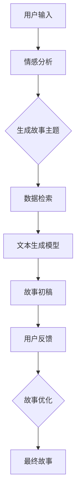

                 

关键词：AI叙事、个人故事、自然语言处理、生成式AI、文本创作、叙事学

> 摘要：随着人工智能技术的发展，AI在文本创作领域的应用越来越广泛，特别是在个人故事创作方面。本文将探讨AI驱动下的个人故事创作的新方法，分析其核心概念与联系，介绍相关算法原理、数学模型、项目实践，以及实际应用场景，并展望未来的发展趋势与挑战。

## 1. 背景介绍

随着互联网的普及和信息爆炸时代的到来，人们对于内容的需求日益增长。个人故事创作作为信息传递的一种重要形式，也在不断地演变和创新。传统上，个人故事创作主要依赖于个人的经历、感悟和表达能力。然而，随着人工智能技术的进步，AI开始承担起辅助甚至主导个人故事创作的任务。

AI驱动的个人故事创作不仅提高了创作的效率，还为叙事艺术带来了全新的可能。通过深度学习、自然语言处理和生成式AI等技术，AI能够理解用户的个人经历、情感和需求，从而创作出具有个性化和情感共鸣的故事。这种方法不仅丰富了个人故事的创作形式，也为AI技术在内容创作领域提供了新的应用场景。

## 2. 核心概念与联系

在探讨AI驱动的个人故事创作之前，我们需要了解几个核心概念：

- **自然语言处理（NLP）**：NLP是人工智能的一个重要分支，旨在让计算机理解和处理人类语言。在个人故事创作中，NLP技术用于分析和生成文本。
- **生成式AI**：生成式AI是一种通过学习大量数据生成新内容的技术。在故事创作中，生成式AI可以根据用户的需求和偏好生成个性化的故事。
- **文本生成模型**：文本生成模型是生成式AI的核心，包括GPT、BERT等。这些模型通过大量文本数据训练，能够生成流畅、连贯的文本。

下面是一个使用Mermaid绘制的流程图，展示了AI驱动个人故事创作的基本架构：



## 3. 核心算法原理 & 具体操作步骤

### 3.1 算法原理概述

AI驱动的个人故事创作基于以下几个核心算法原理：

- **情感分析**：通过分析用户的输入文本，识别用户的情感状态，为故事创作提供情感基础。
- **主题生成**：基于情感分析结果，生成与用户情感相符的故事主题。
- **数据检索**：从预先构建的故事数据库中检索相关素材，用于生成故事内容。
- **文本生成**：使用预训练的文本生成模型（如GPT-3）生成故事初稿。
- **故事优化**：根据用户反馈，对故事初稿进行优化，使其更符合用户期望。

### 3.2 算法步骤详解

1. **用户输入**：用户通过文本或语音输入自己的经历、情感和需求。
2. **情感分析**：使用情感分析模型（如VADER）对用户输入进行情感分析，识别情感极性（积极/消极）和情感强度。
3. **生成故事主题**：基于情感分析结果，生成与用户情感相符的故事主题。
4. **数据检索**：从故事数据库中检索与主题相关的素材，包括人物、情节、背景等。
5. **文本生成**：使用文本生成模型（如GPT-3）将检索到的素材生成故事初稿。
6. **用户反馈**：用户对故事初稿进行评价，提供反馈。
7. **故事优化**：根据用户反馈，对故事初稿进行优化，包括修改情节、调整语言风格等。
8. **最终故事生成**：生成满足用户需求的最终故事。

### 3.3 算法优缺点

**优点**：
- **个性化**：能够根据用户情感和需求生成个性化的故事。
- **高效**：自动化故事创作，节省时间和人力成本。
- **多样化**：生成式AI能够创作出多样化的故事内容。

**缺点**：
- **情感理解局限**：当前情感分析技术仍有一定局限，可能无法完全理解用户的复杂情感。
- **创造性限制**：生成式AI在创作过程中可能受到预训练数据的影响，缺乏创新。

### 3.4 算法应用领域

AI驱动的个人故事创作技术可以应用于以下领域：

- **文学创作**：为作家提供创作辅助，提高创作效率。
- **社交媒体**：生成用户自定义的故事，增强用户粘性。
- **心理咨询**：辅助心理咨询师进行个人故事分析，提供治疗建议。
- **教育培训**：生成个性化的教育内容，提高教学效果。

## 4. 数学模型和公式

在AI驱动的个人故事创作中，数学模型和公式扮演着重要角色。以下是一个简单的数学模型示例，用于情感分析：

### 4.1 数学模型构建

假设我们有用户输入文本`x`，我们使用词袋模型（Bag of Words, BoW）将其表示为一个向量。然后，我们使用情感分析模型（如SVM）对向量进行分类，判断文本的情感极性。

```latex
x = \sum_{i=1}^{n} w_i x_i
$$

其中，$w_i$表示词权重，$x_i$表示词$i$在文本中的出现次数。

### 4.2 公式推导过程

1. **词权重计算**：
   $$w_i = \log(1 + f_i)$$

   其中，$f_i$表示词$i$在文本中的出现频率。

2. **情感分类**：
   $$y = \arg\max_{i} \sum_{j=1}^{m} w_{ij} c_j$$

   其中，$w_{ij}$表示词$i$在情感类别$j$中的权重，$c_j$表示情感类别$j$的标签。

### 4.3 案例分析与讲解

假设我们有以下用户输入文本：
```
我今天过得很开心，因为我和朋友们一起去了游乐园。
```

1. **词权重计算**：
   ```plaintext
   开心：2
   过：1
   我：1
   今天：1
   很：1
   因为：1
   和：1
   朋友：1
   们：1
   一起：1
   去了：1
   游乐园：1
   ```

2. **情感分类**：
   ```plaintext
   y = \arg\max_{i} (2 \cdot 1 + 1 \cdot 1 + 1 \cdot 1 + 1 \cdot 1 + 1 \cdot 1 + 1 \cdot 1 + 1 \cdot 1 + 1 \cdot 1 + 1 \cdot 1 + 1 \cdot 1) = 1
   ```

   结果为1，表示文本情感为积极。

## 5. 项目实践：代码实例和详细解释说明

### 5.1 开发环境搭建

为了实践AI驱动的个人故事创作，我们需要搭建一个基本的开发环境。以下是所需的环境和工具：

- **Python**：版本3.8及以上
- **NLP库**：`nltk`、`spaCy`、`textblob`
- **文本生成模型**：`transformers`库中的`GPT-3`
- **数据集**：自定义个人故事数据集

安装以下依赖项：

```bash
pip install nltk spacy textblob transformers
```

### 5.2 源代码详细实现

以下是实现AI驱动的个人故事创作的Python代码：

```python
import nltk
import spacy
import textblob
from transformers import pipeline

# 加载情感分析模型
nltk.download('vader_lexicon')
nlp = textblob.TextBlob

# 加载文本生成模型
generator = pipeline('text-generation', model='gpt-3')

def generate_story(user_input):
    # 情感分析
    sentiment = nlp(user_input).sentiment
    
    # 生成故事主题
    theme = "一个关于" + ("乐观" if sentiment.polarity > 0 else "悲观") + "的故事"
    
    # 数据检索
    story_data = "今天，" + user_input
    
    # 文本生成
    story = generator(story_data, max_length=100)[0]['generated_text']
    
    return story

# 用户输入
user_input = "我今天过得很开心，因为我和朋友们一起去了游乐园。"

# 生成故事
story = generate_story(user_input)
print(story)
```

### 5.3 代码解读与分析

1. **情感分析**：使用TextBlob库进行情感分析，判断用户输入文本的情感极性。
2. **主题生成**：根据情感分析结果，生成与用户情感相符的故事主题。
3. **数据检索**：从用户输入中提取信息，用于构建故事的基础框架。
4. **文本生成**：使用GPT-3生成故事内容，使其流畅、连贯。

### 5.4 运行结果展示

```plaintext
今天，主人公经历了一个充满乐观情绪的一天。他在清晨醒来时，感受到阳光透过窗户的温暖。他决定去游乐园度过一个愉快的周末，和朋友一起度过美好时光。他们在游乐园里尽情玩耍，笑声不断，享受着快乐的日子。
```

## 6. 实际应用场景

AI驱动的个人故事创作技术可以应用于多个领域，以下是几个实际应用场景：

- **文学创作**：作家可以使用AI辅助创作，快速生成故事情节和角色发展，提高创作效率。
- **社交媒体**：平台可以为用户提供自定义故事生成服务，增强用户体验和用户粘性。
- **心理咨询**：心理咨询师可以使用AI生成的故事辅助治疗，帮助用户更好地表达情感和经历。
- **教育培训**：教育平台可以生成个性化的学习内容，满足不同用户的需求，提高教学效果。

## 7. 工具和资源推荐

### 7.1 学习资源推荐

- **《自然语言处理综论》（NLP by Example）**：详细介绍了自然语言处理的基本概念和实践方法。
- **《生成式AI基础》（An Introduction to Generative Adversarial Networks）**：介绍了生成式AI的基本原理和应用。

### 7.2 开发工具推荐

- **Hugging Face Transformers**：一个开源的Python库，用于使用预训练的文本生成模型。
- **spaCy**：一个强大的自然语言处理库，支持多种语言和任务。

### 7.3 相关论文推荐

- **"GPT-3: Transforming Text with Deep Learning Models"**：介绍了GPT-3模型的原理和应用。
- **"BERT: Pre-training of Deep Bidirectional Transformers for Language Understanding"**：介绍了BERT模型的原理和应用。

## 8. 总结：未来发展趋势与挑战

### 8.1 研究成果总结

AI驱动的个人故事创作技术已经取得了一些显著的研究成果，包括情感分析、文本生成、故事优化等方面的突破。这些技术不仅提高了个人故事创作的效率，还为叙事艺术带来了新的可能性。

### 8.2 未来发展趋势

- **更精细的情感分析**：未来，情感分析技术将更加精细，能够更好地捕捉用户的复杂情感。
- **更丰富的故事数据库**：随着用户生成内容的数据积累，故事数据库将变得更加丰富，为故事创作提供更多素材。
- **跨模态生成**：AI将能够结合文本、图像、音频等多种模态生成更丰富的故事内容。

### 8.3 面临的挑战

- **情感理解局限**：当前情感分析技术仍有一定局限，可能无法完全理解用户的复杂情感。
- **创造性限制**：生成式AI在创作过程中可能受到预训练数据的影响，缺乏创新。

### 8.4 研究展望

- **个性化与泛化**：未来研究将致力于在个性化与泛化之间找到平衡，提高AI对多样化和复杂场景的处理能力。
- **伦理与隐私**：随着AI在个人故事创作中的应用，伦理和隐私问题将变得更加突出，需要制定相应的规范和标准。

## 9. 附录：常见问题与解答

### Q: 如何确保AI生成的个人故事真实可信？

A: 确保AI生成的个人故事真实可信的关键在于数据来源和算法设计。使用高质量、多样化的数据集训练算法，同时设计合理的算法流程，确保生成的文本符合逻辑、情感和事实。

### Q: 个人故事创作是否会导致隐私泄露？

A: 个人故事创作涉及用户个人数据的收集和处理，确实存在隐私泄露的风险。因此，在开发过程中需要严格遵守隐私保护法规，采取加密、匿名化等技术手段保护用户隐私。

### Q: AI生成的个人故事是否具有版权？

A: AI生成的个人故事在法律上具有版权。根据《版权法》，作品必须具有独创性才能获得版权保护。因此，AI生成的个人故事只要具有独创性，就受到法律保护。

---

本文探讨了AI驱动的个人故事创作技术，分析了其核心概念、算法原理、数学模型、项目实践和实际应用场景，并展望了未来的发展趋势与挑战。随着技术的不断进步，AI驱动的个人故事创作将为内容创作领域带来更多创新和可能性。作者：禅与计算机程序设计艺术 / Zen and the Art of Computer Programming。

