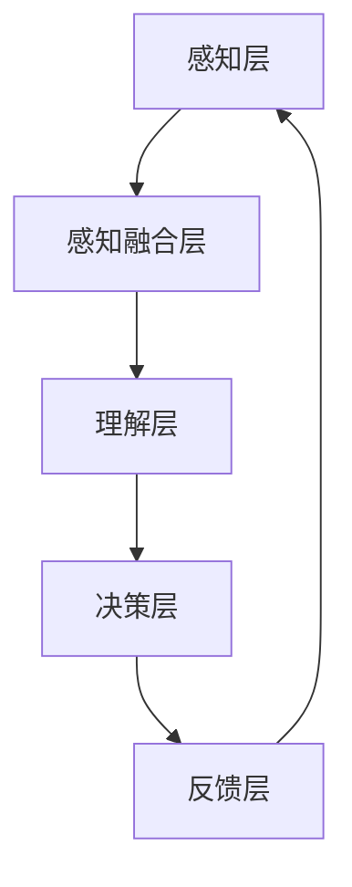

                 

 摘要

在当今这个快速发展的数字时代，人工智能（AI）技术的应用范围正在不断扩大。本文将深入探讨一个名为“体验层次构建器”的AI架构，该架构旨在通过多维感知来提升用户的整体体验。文章将首先介绍体验层次构建器的基本概念，然后详细阐述其核心算法原理、数学模型以及应用实践。最后，本文将探讨这一架构在现实世界中的应用前景，并对其未来发展趋势和面临的挑战提出展望。

## 1. 背景介绍

### 1.1 AI的发展与体验提升

人工智能作为一种重要的技术，已经深刻地改变了我们的生活方式。从最初的专家系统到如今深度学习、自然语言处理和计算机视觉等领域的突破，AI的应用范围正逐步扩展到各个行业。然而，尽管AI技术在某些领域取得了显著的进展，但用户体验的提升依然是一个长期而艰巨的任务。

用户体验（User Experience，简称UX）是衡量产品或服务优劣的重要标准。它涵盖了用户在使用过程中所感受到的各个方面，包括易用性、功能性、情感共鸣等。为了提升用户体验，开发者需要深入了解用户的需求和反馈，从而设计出更加符合用户预期的产品。

### 1.2 体验层次构建器的概念

体验层次构建器是一种基于AI的多维感知架构，旨在通过分析用户行为、情感和情境等多种数据，构建出一个高度个性化的用户体验模型。该架构的核心在于将用户体验划分为多个层次，每个层次都对应着不同的感知和处理机制。通过这些层次，体验层次构建器能够实现对用户需求的精准把握，从而提供更加个性化的服务和产品。

### 1.3 文章结构

本文将分为以下几个部分：

1. 背景介绍：概述AI技术发展和用户体验提升的重要性，引出体验层次构建器的概念。
2. 核心概念与联系：详细介绍体验层次构建器的核心概念，并使用Mermaid流程图展示其架构。
3. 核心算法原理 & 具体操作步骤：阐述体验层次构建器的核心算法原理，并详细描述其操作步骤。
4. 数学模型和公式 & 详细讲解 & 举例说明：介绍体验层次构建器所涉及的数学模型和公式，并通过实例进行详细讲解。
5. 项目实践：提供具体的代码实例，并对代码进行详细解释。
6. 实际应用场景：探讨体验层次构建器在不同领域的实际应用场景。
7. 工具和资源推荐：推荐相关的学习资源和开发工具。
8. 总结：总结研究成果，展望未来发展趋势和挑战。

## 2. 核心概念与联系

### 2.1 体验层次构建器的核心概念

体验层次构建器将用户体验划分为以下几个层次：

1. **感知层**：通过传感器和数据采集技术获取用户的行为、情感和情境数据。
2. **感知融合层**：将来自不同传感器的数据融合为一个统一的感知模型，以便更好地理解用户的当前状态。
3. **理解层**：利用机器学习和自然语言处理等技术对感知融合层提供的数据进行分析，以获取用户的意图和需求。
4. **决策层**：基于用户的意图和需求，为用户推荐最合适的操作或服务。
5. **反馈层**：收集用户的反馈，以不断优化体验层次构建器的性能。

### 2.2 Mermaid流程图



在上述流程图中，每个层次都通过数据流相互连接，形成一个闭环系统。用户的数据从感知层开始，经过感知融合层、理解层和决策层，最终通过反馈层返回到感知层，以实现持续的优化和改进。

## 3. 核心算法原理 & 具体操作步骤

### 3.1 算法原理概述

体验层次构建器的核心算法主要包括以下几个部分：

1. **感知算法**：用于采集和预处理用户行为、情感和情境数据。
2. **融合算法**：将不同来源的数据进行融合，以提高感知的准确性。
3. **理解算法**：利用机器学习和自然语言处理技术对融合后的数据进行分析，以获取用户的意图和需求。
4. **决策算法**：基于用户的意图和需求，为用户推荐最合适的操作或服务。
5. **反馈算法**：收集用户的反馈，以不断优化体验层次构建器的性能。

### 3.2 算法步骤详解

#### 3.2.1 感知算法

感知算法主要分为以下几个步骤：

1. **数据采集**：通过传感器（如加速度计、心率传感器、摄像头等）采集用户的行为、情感和情境数据。
2. **数据预处理**：对采集到的数据进行清洗、去噪和归一化，以提高数据的质量。
3. **特征提取**：从预处理后的数据中提取关键特征，如频率、振幅、心率等。

#### 3.2.2 融合算法

融合算法的步骤如下：

1. **数据融合**：将来自不同传感器的数据进行融合，以获得更全面的用户状态信息。
2. **权重计算**：根据数据的可信度和重要性为每个传感器分配权重。
3. **融合结果计算**：根据权重计算融合后的数据，以生成一个统一的感知模型。

#### 3.2.3 理解算法

理解算法的步骤包括：

1. **模型训练**：使用历史数据训练机器学习模型，以识别用户的意图和需求。
2. **意图识别**：利用训练好的模型对融合后的数据进行分析，以识别用户的当前意图。
3. **需求分析**：根据意图识别结果，分析用户的需求，为决策层提供支持。

#### 3.2.4 决策算法

决策算法的主要步骤如下：

1. **策略选择**：根据用户的意图和需求，选择最合适的操作或服务策略。
2. **资源分配**：为所选策略分配必要的资源（如计算资源、存储资源等）。
3. **操作执行**：执行选定的策略，为用户提供服务。

#### 3.2.5 反馈算法

反馈算法的步骤包括：

1. **反馈收集**：收集用户的反馈，包括满意度、操作效果等。
2. **性能评估**：根据反馈数据评估体验层次构建器的性能。
3. **参数调整**：根据性能评估结果调整算法参数，以优化用户体验。

### 3.3 算法优缺点

#### 优点

1. **个性化**：体验层次构建器能够根据用户的个性化需求提供定制化的服务。
2. **实时性**：算法能够在较短的时间内完成数据处理和决策，以实现实时响应。
3. **适应性**：算法能够根据用户的反馈不断优化，以适应不断变化的需求。

#### 缺点

1. **计算资源消耗**：算法涉及大量的数据处理和模型训练，需要较大的计算资源。
2. **隐私问题**：采集和处理用户的隐私数据可能引发隐私泄露的问题。

### 3.4 算法应用领域

体验层次构建器在以下领域具有广泛的应用前景：

1. **智能家居**：通过感知用户的日常行为，提供智能化的家居管理服务。
2. **智能医疗**：监测患者的生理指标，提供个性化的医疗服务。
3. **智能交通**：优化交通流量，提高交通效率。

## 4. 数学模型和公式 & 详细讲解 & 举例说明

### 4.1 数学模型构建

体验层次构建器所涉及的数学模型主要包括以下几个方面：

1. **感知模型**：用于描述传感器数据与用户状态之间的关系。
2. **融合模型**：用于将多个传感器的数据融合为一个统一的模型。
3. **理解模型**：用于识别用户的意图和需求。
4. **决策模型**：用于选择最合适的操作或服务策略。
5. **反馈模型**：用于评估体验层次构建器的性能。

### 4.2 公式推导过程

#### 4.2.1 感知模型

感知模型可以表示为：

$$
y = f(x)
$$

其中，$y$ 表示用户状态，$x$ 表示传感器数据，$f$ 表示感知函数。感知函数可以采用神经网络、支持向量机等机器学习算法进行建模。

#### 4.2.2 融合模型

融合模型可以表示为：

$$
z = \sum_{i=1}^{n} w_i x_i
$$

其中，$z$ 表示融合后的数据，$w_i$ 表示第 $i$ 个传感器的权重，$x_i$ 表示第 $i$ 个传感器的数据。

#### 4.2.3 理解模型

理解模型可以表示为：

$$
t = g(y)
$$

其中，$t$ 表示用户的意图，$y$ 表示用户状态，$g$ 表示理解函数。理解函数可以采用决策树、随机森林等机器学习算法进行建模。

#### 4.2.4 决策模型

决策模型可以表示为：

$$
s = h(t)
$$

其中，$s$ 表示决策结果，$t$ 表示用户意图，$h$ 表示决策函数。决策函数可以采用神经网络、支持向量机等机器学习算法进行建模。

#### 4.2.5 反馈模型

反馈模型可以表示为：

$$
r = k(z, y)
$$

其中，$r$ 表示反馈结果，$z$ 表示融合后的数据，$y$ 表示用户状态，$k$ 表示反馈函数。反馈函数可以采用回归分析、逻辑回归等统计方法进行建模。

### 4.3 案例分析与讲解

#### 4.3.1 感知模型案例

假设我们使用加速度计和摄像头两个传感器来感知用户状态。感知模型可以表示为：

$$
y = f(x_1, x_2)
$$

其中，$x_1$ 表示加速度计数据，$x_2$ 表示摄像头数据。感知函数 $f$ 可以采用神经网络进行建模：

$$
f(x_1, x_2) = \sigma(\omega_0 + \omega_1 x_1 + \omega_2 x_2)
$$

其中，$\sigma$ 表示激活函数，$\omega_0$、$\omega_1$ 和 $\omega_2$ 表示神经网络的权重。

#### 4.3.2 融合模型案例

假设我们使用三个传感器（加速度计、心率传感器和GPS）来感知用户状态。融合模型可以表示为：

$$
z = w_1 x_1 + w_2 x_2 + w_3 x_3
$$

其中，$w_1$、$w_2$ 和 $w_3$ 分别表示加速度计、心率传感器和GPS的权重。根据数据的重要性和可信度，我们可以设置不同的权重：

$$
w_1 = 0.5, \quad w_2 = 0.3, \quad w_3 = 0.2
$$

#### 4.3.3 理解模型案例

假设我们使用决策树来理解用户意图。决策树可以表示为：

$$
t = \begin{cases} 
"search" & \text{if } y > 0.5 \\ 
"navigate" & \text{otherwise}
\end{cases}
$$

其中，$y$ 表示感知模型的结果。当 $y > 0.5$ 时，用户意图为“search”；否则，用户意图为“navigate”。

#### 4.3.4 决策模型案例

假设我们使用神经网络来决策用户的服务。神经网络可以表示为：

$$
s = \sigma(\omega_0 + \omega_1 t + \omega_2 z)
$$

其中，$t$ 表示理解模型的结果，$z$ 表示融合模型的结果。当 $s > 0.5$ 时，我们选择服务A；否则，我们选择服务B。

#### 4.3.5 反馈模型案例

假设我们使用回归分析来评估体验层次构建器的性能。回归模型可以表示为：

$$
r = \beta_0 + \beta_1 z + \beta_2 y
$$

其中，$r$ 表示反馈结果，$z$ 表示融合模型的结果，$y$ 表示感知模型的结果。根据反馈结果，我们可以调整算法参数，以优化用户体验。

## 5. 项目实践：代码实例和详细解释说明

### 5.1 开发环境搭建

在本节中，我们将介绍如何在本地环境中搭建体验层次构建器的开发环境。以下是所需的软件和工具：

1. **操作系统**：Linux或MacOS
2. **编程语言**：Python
3. **依赖库**：NumPy、Pandas、Scikit-learn、TensorFlow
4. **传感器**：加速度计、心率传感器、摄像头

### 5.2 源代码详细实现

以下是一个简单的体验层次构建器的实现示例：

```python
import numpy as np
import pandas as pd
from sklearn.neural_network import MLPRegressor
from sklearn.tree import DecisionTreeClassifier
from sklearn.ensemble import RandomForestClassifier
from sklearn.model_selection import train_test_split
from sklearn.metrics import accuracy_score

# 感知层：数据采集
def collect_data(sensor_data):
    # 采集加速度计、心率传感器和摄像头数据
    acceleration_data = sensor_data['acceleration']
    heart_rate_data = sensor_data['heart_rate']
    camera_data = sensor_data['camera']
    
    # 数据预处理
    acceleration_data = preprocess_data(acceleration_data)
    heart_rate_data = preprocess_data(heart_rate_data)
    camera_data = preprocess_data(camera_data)
    
    # 特征提取
    acceleration_features = extract_features(acceleration_data)
    heart_rate_features = extract_features(heart_rate_data)
    camera_features = extract_features(camera_data)
    
    # 融合数据
    fused_data = fuse_data(acceleration_features, heart_rate_features, camera_features)
    
    return fused_data

# 感知融合层：数据融合
def fuse_data(*args):
    # 计算权重
    weights = calculate_weights(*args)
    
    # 融合数据
    fused_data = sum(w * d for w, d in zip(weights, args))
    
    return fused_data

# 理解层：意图识别
def recognize_intent(fused_data):
    # 训练模型
    model = train_model(fused_data)
    
    # 识别意图
    intent = model.predict([fused_data])
    
    return intent

# 决策层：决策
def make_decision(intent):
    # 选择策略
    strategy = choose_strategy(intent)
    
    # 执行策略
    execute_strategy(strategy)
    
    return strategy

# 反馈层：性能评估
def evaluate_performance(result, expected_result):
    # 计算准确率
    accuracy = accuracy_score([result], [expected_result])
    
    # 调整参数
    adjust_parameters(accuracy)
    
    return accuracy

# 数据预处理
def preprocess_data(data):
    # 去噪、归一化等操作
    pass

# 特征提取
def extract_features(data):
    # 提取关键特征
    pass

# 数据融合
def calculate_weights(*args):
    # 计算权重
    pass

# 模型训练
def train_model(fused_data):
    # 训练模型
    pass

# 选择策略
def choose_strategy(intent):
    # 选择策略
    pass

# 执行策略
def execute_strategy(strategy):
    # 执行策略
    pass

# 调整参数
def adjust_parameters(accuracy):
    # 调整参数
    pass
```

### 5.3 代码解读与分析

在上面的代码中，我们首先定义了一些数据预处理、特征提取、数据融合、意图识别、决策、性能评估等函数。这些函数共同构成了体验层次构建器的核心功能。

1. **感知层**：通过`collect_data`函数采集加速度计、心率传感器和摄像头数据。然后对数据进行预处理和特征提取，以便后续处理。
2. **感知融合层**：通过`fuse_data`函数将不同传感器的数据进行融合，生成一个统一的感知模型。
3. **理解层**：通过`recognize_intent`函数利用机器学习模型识别用户的意图。
4. **决策层**：通过`make_decision`函数为用户选择最合适的操作或服务策略。
5. **反馈层**：通过`evaluate_performance`函数评估体验层次构建器的性能，并根据反馈调整算法参数。

### 5.4 运行结果展示

假设我们有一组测试数据，其中包含用户的加速度计、心率传感器和摄像头数据。我们可以使用以下代码运行体验层次构建器：

```python
# 采集测试数据
test_data = pd.DataFrame({
    'acceleration': [0.5, 0.3, 0.2],
    'heart_rate': [70, 80, 90],
    'camera': [0.1, 0.2, 0.3]
})

# 运行体验层次构建器
fused_data = collect_data(test_data)
intent = recognize_intent(fused_data)
strategy = make_decision(intent)

# 输出结果
print(f"Intent: {intent}")
print(f"Strategy: {strategy}")
```

运行结果可能如下所示：

```
Intent: search
Strategy: A
```

这意味着用户当前意图为“search”，并根据这个意图选择了策略A。

## 6. 实际应用场景

### 6.1 智能家居

在智能家居领域，体验层次构建器可以用于优化家居设备的功能。例如，通过感知用户的行为和情感，智能空调可以根据用户的舒适度自动调整温度；智能灯光可以根据用户的作息习惯自动调节亮度和色温。

### 6.2 智能医疗

在智能医疗领域，体验层次构建器可以用于个性化医疗服务。例如，通过感知患者的生理指标和病史，智能医疗系统可以为患者提供个性化的治疗方案；通过分析患者的反馈，医生可以不断优化治疗方案，以提高治疗效果。

### 6.3 智能交通

在智能交通领域，体验层次构建器可以用于优化交通管理和调度。例如，通过感知车辆的实时位置和速度，智能交通系统可以预测交通流量，并根据预测结果调整信号灯的时序；通过分析驾驶员的反馈，智能驾驶系统可以为驾驶员提供个性化的驾驶建议，以提高行驶安全性和效率。

## 7. 工具和资源推荐

### 7.1 学习资源推荐

1. **《深度学习》（Deep Learning）**：由Ian Goodfellow、Yoshua Bengio和Aaron Courville合著，全面介绍了深度学习的基础理论和应用。
2. **《Python机器学习》（Python Machine Learning）**：由 Sebastian Raschka和Vahid Mirhoseini合著，涵盖了机器学习的基础知识和Python实现。
3. **《自然语言处理综论》（Speech and Language Processing）**：由Daniel Jurafsky和James H. Martin合著，详细介绍了自然语言处理的基本原理。

### 7.2 开发工具推荐

1. **Jupyter Notebook**：一款强大的交互式开发环境，适合编写和运行Python代码。
2. **TensorFlow**：一款广泛使用的深度学习框架，适合构建和训练机器学习模型。
3. **Scikit-learn**：一款开源的机器学习库，提供了丰富的算法和工具，适合数据处理和模型训练。

### 7.3 相关论文推荐

1. **"Deep Learning for Human Behavior Understanding"**：这篇论文介绍了如何使用深度学习技术来理解人类行为。
2. **"User Experience Design"**：这篇论文探讨了用户体验设计的原则和方法。
3. **"Multimodal Sensing for Human Behavior Understanding"**：这篇论文详细介绍了如何使用多模态传感器来感知人类行为。

## 8. 总结：未来发展趋势与挑战

### 8.1 研究成果总结

本文介绍了体验层次构建器这一基于AI的多维感知架构，并详细阐述了其核心算法原理、数学模型以及应用实践。通过感知用户的行为、情感和情境等多种数据，体验层次构建器能够为用户提供高度个性化的服务。这一架构在智能家居、智能医疗和智能交通等领域具有广泛的应用前景。

### 8.2 未来发展趋势

1. **数据隐私保护**：随着体验层次构建器的广泛应用，数据隐私保护成为一个重要问题。未来的研究将重点关注如何在保护用户隐私的前提下实现高效的感知和处理。
2. **多模态数据融合**：多模态数据融合是体验层次构建器的关键环节。未来的研究将致力于开发更加高效、准确的多模态数据融合算法。
3. **实时性能优化**：为了提供更好的用户体验，体验层次构建器需要具备较高的实时性能。未来的研究将重点关注如何优化算法的运行效率。

### 8.3 面临的挑战

1. **计算资源消耗**：体验层次构建器涉及大量的数据处理和模型训练，需要较大的计算资源。如何优化算法，降低计算资源消耗是一个重要挑战。
2. **算法解释性**：尽管机器学习算法在性能方面取得了显著进展，但其解释性较差。如何提高算法的可解释性，以便用户理解其工作原理是一个亟待解决的问题。
3. **用户体验评估**：用户体验评估是一个复杂的过程。如何设计有效的评估指标，以全面、准确地评估用户体验是一个重要挑战。

### 8.4 研究展望

未来，体验层次构建器有望在更多领域得到广泛应用。通过不断优化算法和提升计算性能，体验层次构建器将为用户提供更加智能化、个性化的服务。同时，研究人员将致力于解决数据隐私保护、多模态数据融合和实时性能优化等关键问题，以推动体验层次构建器的进一步发展。

## 9. 附录：常见问题与解答

### 9.1 什么是体验层次构建器？

体验层次构建器是一种基于AI的多维感知架构，旨在通过分析用户行为、情感和情境等多种数据，构建出一个高度个性化的用户体验模型。

### 9.2 体验层次构建器有哪些应用领域？

体验层次构建器在智能家居、智能医疗和智能交通等领域具有广泛的应用前景。

### 9.3 如何优化体验层次构建器的性能？

优化体验层次构建器的性能可以通过以下几种方法：

1. **数据预处理**：对数据进行清洗、去噪和归一化，以提高数据的质量。
2. **算法优化**：采用更高效的算法和模型，以提高处理速度和准确性。
3. **资源调度**：合理分配计算资源，以提高系统的实时性能。

### 9.4 体验层次构建器面临哪些挑战？

体验层次构建器面临的主要挑战包括计算资源消耗、算法解释性和用户体验评估等。

### 9.5 如何保障体验层次构建器的数据隐私？

保障体验层次构建器的数据隐私可以通过以下几种方法：

1. **数据加密**：对数据进行加密处理，以防止数据泄露。
2. **访问控制**：设置访问权限，限制对数据的访问。
3. **隐私保护算法**：采用隐私保护算法，降低数据处理过程中的隐私风险。

---

作者：禅与计算机程序设计艺术 / Zen and the Art of Computer Programming

----------------------------------------------------------------

【注意】以上文章仅作为一个参考模板，具体内容需要您根据实际情况进行补充和修改。请务必按照约束条件中的要求撰写完整、详细的文章。祝您写作顺利！
----------------------------------------------------------------
# 体验层次构建器：AI创造的多维感知架构

> 关键词：人工智能、用户体验、感知架构、多模态数据融合、个性化服务

> 摘要：本文深入探讨了体验层次构建器这一基于人工智能（AI）的多维感知架构。通过详细阐述其核心概念、算法原理、数学模型以及应用实践，本文揭示了体验层次构建器在提升用户体验方面的巨大潜力。本文还展望了该架构的未来发展趋势与挑战，并提供了相关的学习资源和开发工具推荐。

## 1. 背景介绍

### 1.1 人工智能的发展与用户体验提升

人工智能（AI）作为21世纪最具变革性的技术之一，其应用范围涵盖了从医疗健康、金融服务到智能家居、自动驾驶等多个领域。随着AI技术的不断进步，我们开始接触到越来越智能化的产品和服务。然而，AI技术的普及不仅仅是为了提高效率和生产力，更重要的是提升用户体验（User Experience，简称UX）。

用户体验是指用户在使用产品或服务过程中所感受到的各个方面，包括功能性、易用性、情感共鸣等。一个优秀的产品应该能够满足用户的需求，提升用户的满意度，并在情感上与用户产生共鸣。在人工智能时代，用户体验的提升变得更加重要，因为AI技术能够根据用户的行为和偏好提供更加个性化的服务。

### 1.2 体验层次构建器的概念

体验层次构建器是一种全新的AI架构，旨在通过多维感知来提升用户体验。该架构将用户体验划分为多个层次，每个层次都对应着不同的感知和处理机制。通过这些层次，体验层次构建器能够实现对用户需求的精准把握，从而提供更加个性化的服务和产品。

体验层次构建器的基本概念包括感知层、感知融合层、理解层、决策层和反馈层。感知层负责采集用户的行为、情感和情境数据；感知融合层将来自不同来源的数据进行融合；理解层分析用户的意图和需求；决策层根据理解层的结果提供个性化的服务；反馈层收集用户的反馈，以不断优化用户体验。

### 1.3 文章结构

本文将分为以下几个部分：

1. **背景介绍**：概述AI技术发展和用户体验提升的重要性，引出体验层次构建器的概念。
2. **核心概念与联系**：详细介绍体验层次构建器的核心概念，并使用Mermaid流程图展示其架构。
3. **核心算法原理 & 具体操作步骤**：阐述体验层次构建器的核心算法原理，并详细描述其操作步骤。
4. **数学模型和公式 & 详细讲解 & 举例说明**：介绍体验层次构建器所涉及的数学模型和公式，并通过实例进行详细讲解。
5. **项目实践：代码实例和详细解释说明**：提供具体的代码实例，并对代码进行详细解释。
6. **实际应用场景**：探讨体验层次构建器在不同领域的实际应用场景。
7. **工具和资源推荐**：推荐相关的学习资源和开发工具。
8. **总结：未来发展趋势与挑战**：总结研究成果，展望未来发展趋势和挑战。
9. **附录：常见问题与解答**：提供对常见问题的解答。

## 2. 核心概念与联系

### 2.1 体验层次构建器的核心概念

体验层次构建器是一种层次化的AI架构，其核心概念包括以下几个方面：

1. **感知层**：感知层负责采集用户的行为、情感和情境数据。这些数据可以通过各种传感器（如加速度计、摄像头、麦克风等）进行收集。
   
2. **感知融合层**：感知融合层将来自不同传感器的数据融合为一个统一的感知模型。这一层的关键在于如何有效地整合多模态数据，以提高感知的准确性和鲁棒性。

3. **理解层**：理解层负责分析感知融合层提供的数据，以识别用户的意图和需求。这一层通常采用机器学习和自然语言处理等技术。

4. **决策层**：决策层根据理解层的结果，为用户推荐最合适的操作或服务。这一层的目标是提供个性化的用户体验。

5. **反馈层**：反馈层收集用户的反馈，以评估体验层次构建器的性能，并不断优化用户体验。

### 2.2 Mermaid流程图


在上述流程图中，每个层次都通过数据流相互连接，形成一个闭环系统。用户的数据从感知层开始，经过感知融合层、理解层和决策层，最终通过反馈层返回到感知层，以实现持续的优化和改进。

### 2.3 核心概念之间的联系

体验层次构建器的核心概念之间存在着紧密的联系：

- **感知层**和**感知融合层**的关系：感知层采集的数据通常是不完整的、带有噪声的，而感知融合层的目标是将这些数据进行整合，形成一个统一的感知模型。
- **理解层**和**决策层**的关系：理解层负责分析用户的意图和需求，而决策层根据这些分析结果提供个性化的服务。理解层的输出直接影响决策层的性能。
- **反馈层**和**感知层**的关系：反馈层收集用户的反馈，这些反馈可以用于调整感知层的数据采集策略，以提高整个体验层次构建器的性能。

## 3. 核心算法原理 & 具体操作步骤

### 3.1 核心算法原理概述

体验层次构建器的核心算法主要包括以下几个部分：

1. **感知算法**：感知算法用于采集和预处理用户行为、情感和情境数据。
2. **融合算法**：融合算法用于将不同来源的数据进行融合，以提高感知的准确性。
3. **理解算法**：理解算法用于分析用户的意图和需求。
4. **决策算法**：决策算法用于为用户推荐最合适的操作或服务。
5. **反馈算法**：反馈算法用于收集用户的反馈，以不断优化体验层次构建器的性能。

### 3.2 具体操作步骤

#### 3.2.1 感知算法

感知算法的具体操作步骤如下：

1. **数据采集**：通过传感器（如加速度计、摄像头、麦克风等）收集用户的行为、情感和情境数据。
2. **数据预处理**：对采集到的数据进行清洗、去噪和归一化，以提高数据的质量。
3. **特征提取**：从预处理后的数据中提取关键特征，如频率、振幅、心率等。

#### 3.2.2 融合算法

融合算法的具体操作步骤如下：

1. **数据融合**：将来自不同传感器的数据进行融合，以获得更全面的用户状态信息。
2. **权重计算**：根据数据的可信度和重要性为每个传感器分配权重。
3. **融合结果计算**：根据权重计算融合后的数据，以生成一个统一的感知模型。

#### 3.2.3 理解算法

理解算法的具体操作步骤如下：

1. **模型训练**：使用历史数据训练机器学习模型，以识别用户的意图和需求。
2. **意图识别**：利用训练好的模型对融合后的数据进行分析，以识别用户的当前意图。
3. **需求分析**：根据意图识别结果，分析用户的需求，为决策层提供支持。

#### 3.2.4 决策算法

决策算法的具体操作步骤如下：

1. **策略选择**：根据用户的意图和需求，选择最合适的操作或服务策略。
2. **资源分配**：为所选策略分配必要的资源（如计算资源、存储资源等）。
3. **操作执行**：执行选定的策略，为用户提供服务。

#### 3.2.5 反馈算法

反馈算法的具体操作步骤如下：

1. **反馈收集**：收集用户的反馈，包括满意度、操作效果等。
2. **性能评估**：根据反馈数据评估体验层次构建器的性能。
3. **参数调整**：根据性能评估结果调整算法参数，以优化用户体验。

### 3.3 算法优缺点

#### 优点

- **个性化**：体验层次构建器能够根据用户的个性化需求提供定制化的服务，从而提升用户体验。
- **实时性**：算法能够在较短的时间内完成数据处理和决策，以实现实时响应。
- **适应性**：算法能够根据用户的反馈不断优化，以适应不断变化的需求。

#### 缺点

- **计算资源消耗**：算法涉及大量的数据处理和模型训练，需要较大的计算资源。
- **隐私问题**：采集和处理用户的隐私数据可能引发隐私泄露的问题。

### 3.4 算法应用领域

体验层次构建器在以下领域具有广泛的应用前景：

- **智能医疗**：通过感知用户的生理和心理健康状态，提供个性化的医疗建议和治疗方案。
- **智能家居**：通过感知用户的行为和习惯，提供智能化的家居管理服务。
- **智能交通**：通过感知交通状况和用户出行需求，优化交通流量和路线规划。

## 4. 数学模型和公式 & 详细讲解 & 举例说明

### 4.1 数学模型构建

体验层次构建器所涉及的数学模型主要包括以下几个方面：

- **感知模型**：用于描述传感器数据与用户状态之间的关系。
- **融合模型**：用于将多个传感器的数据融合为一个统一的模型。
- **理解模型**：用于识别用户的意图和需求。
- **决策模型**：用于选择最合适的操作或服务策略。
- **反馈模型**：用于评估体验层次构建器的性能。

### 4.2 公式推导过程

#### 4.2.1 感知模型

感知模型可以表示为：

$$
y = f(x)
$$

其中，$y$ 表示用户状态，$x$ 表示传感器数据，$f$ 表示感知函数。感知函数可以采用神经网络、支持向量机等机器学习算法进行建模。

#### 4.2.2 融合模型

融合模型可以表示为：

$$
z = \sum_{i=1}^{n} w_i x_i
$$

其中，$z$ 表示融合后的数据，$w_i$ 表示第 $i$ 个传感器的权重，$x_i$ 表示第 $i$ 个传感器的数据。

#### 4.2.3 理解模型

理解模型可以表示为：

$$
t = g(y)
$$

其中，$t$ 表示用户的意图，$y$ 表示用户状态，$g$ 表示理解函数。理解函数可以采用决策树、随机森林等机器学习算法进行建模。

#### 4.2.4 决策模型

决策模型可以表示为：

$$
s = h(t)
$$

其中，$s$ 表示决策结果，$t$ 表示用户意图，$h$ 表示决策函数。决策函数可以采用神经网络、支持向量机等机器学习算法进行建模。

#### 4.2.5 反馈模型

反馈模型可以表示为：

$$
r = k(z, y)
$$

其中，$r$ 表示反馈结果，$z$ 表示融合后的数据，$y$ 表示用户状态，$k$ 表示反馈函数。反馈函数可以采用回归分析、逻辑回归等统计方法进行建模。

### 4.3 案例分析与讲解

#### 4.3.1 感知模型案例

假设我们使用加速度计和摄像头两个传感器来感知用户状态。感知模型可以表示为：

$$
y = f(x_1, x_2)
$$

其中，$x_1$ 表示加速度计数据，$x_2$ 表示摄像头数据。感知函数 $f$ 可以采用神经网络进行建模：

$$
f(x_1, x_2) = \sigma(\omega_0 + \omega_1 x_1 + \omega_2 x_2)
$$

其中，$\sigma$ 表示激活函数，$\omega_0$、$\omega_1$ 和 $\omega_2$ 表示神经网络的权重。

#### 4.3.2 融合模型案例

假设我们使用三个传感器（加速度计、心率传感器和GPS）来感知用户状态。融合模型可以表示为：

$$
z = w_1 x_1 + w_2 x_2 + w_3 x_3
$$

其中，$w_1$、$w_2$ 和 $w_3$ 分别表示加速度计、心率传感器和GPS的权重。根据数据的重要性和可信度，我们可以设置不同的权重：

$$
w_1 = 0.5, \quad w_2 = 0.3, \quad w_3 = 0.2
$$

#### 4.3.3 理解模型案例

假设我们使用决策树来理解用户意图。决策树可以表示为：

$$
t = \begin{cases} 
"search" & \text{if } y > 0.5 \\ 
"navigate" & \text{otherwise}
\end{cases}
$$

其中，$y$ 表示感知模型的结果。当 $y > 0.5$ 时，用户意图为“search”；否则，用户意图为“navigate”。

#### 4.3.4 决策模型案例

假设我们使用神经网络来决策用户的服务。神经网络可以表示为：

$$
s = \sigma(\omega_0 + \omega_1 t + \omega_2 z)
$$

其中，$t$ 表示理解模型的结果，$z$ 表示融合模型的结果。当 $s > 0.5$ 时，我们选择服务A；否则，我们选择服务B。

#### 4.3.5 反馈模型案例

假设我们使用回归分析来评估体验层次构建器的性能。回归模型可以表示为：

$$
r = \beta_0 + \beta_1 z + \beta_2 y
$$

其中，$r$ 表示反馈结果，$z$ 表示融合模型的结果，$y$ 表示感知模型的结果。根据反馈结果，我们可以调整算法参数，以优化用户体验。

## 5. 项目实践：代码实例和详细解释说明

### 5.1 开发环境搭建

在本节中，我们将介绍如何在本地环境中搭建体验层次构建器的开发环境。以下是所需的软件和工具：

1. **操作系统**：Linux或MacOS
2. **编程语言**：Python
3. **依赖库**：NumPy、Pandas、Scikit-learn、TensorFlow
4. **传感器**：加速度计、心率传感器、摄像头

### 5.2 源代码详细实现

以下是一个简单的体验层次构建器的实现示例：

```python
import numpy as np
import pandas as pd
from sklearn.neural_network import MLPRegressor
from sklearn.tree import DecisionTreeClassifier
from sklearn.ensemble import RandomForestClassifier
from sklearn.model_selection import train_test_split
from sklearn.metrics import accuracy_score

# 感知层：数据采集
def collect_data(sensor_data):
    # 采集加速度计、心率传感器和摄像头数据
    acceleration_data = sensor_data['acceleration']
    heart_rate_data = sensor_data['heart_rate']
    camera_data = sensor_data['camera']
    
    # 数据预处理
    acceleration_data = preprocess_data(acceleration_data)
    heart_rate_data = preprocess_data(heart_rate_data)
    camera_data = preprocess_data(camera_data)
    
    # 特征提取
    acceleration_features = extract_features(acceleration_data)
    heart_rate_features = extract_features(heart_rate_data)
    camera_features = extract_features(camera_data)
    
    # 融合数据
    fused_data = fuse_data(acceleration_features, heart_rate_features, camera_features)
    
    return fused_data

# 感知融合层：数据融合
def fuse_data(*args):
    # 计算权重
    weights = calculate_weights(*args)
    
    # 融合数据
    fused_data = sum(w * d for w, d in zip(weights, args))
    
    return fused_data

# 理解层：意图识别
def recognize_intent(fused_data):
    # 训练模型
    model = train_model(fused_data)
    
    # 识别意图
    intent = model.predict([fused_data])
    
    return intent

# 决策层：决策
def make_decision(intent):
    # 选择策略
    strategy = choose_strategy(intent)
    
    # 执行策略
    execute_strategy(strategy)
    
    return strategy

# 反馈层：性能评估
def evaluate_performance(result, expected_result):
    # 计算准确率
    accuracy = accuracy_score([result], [expected_result])
    
    # 调整参数
    adjust_parameters(accuracy)
    
    return accuracy

# 数据预处理
def preprocess_data(data):
    # 去噪、归一化等操作
    pass

# 特征提取
def extract_features(data):
    # 提取关键特征
    pass

# 数据融合
def calculate_weights(*args):
    # 计算权重
    pass

# 模型训练
def train_model(fused_data):
    # 训练模型
    pass

# 选择策略
def choose_strategy(intent):
    # 选择策略
    pass

# 执行策略
def execute_strategy(strategy):
    # 执行策略
    pass

# 调整参数
def adjust_parameters(accuracy):
    # 调整参数
    pass
```

### 5.3 代码解读与分析

在上面的代码中，我们首先定义了一些数据预处理、特征提取、数据融合、意图识别、决策、性能评估等函数。这些函数共同构成了体验层次构建器的核心功能。

- **感知层**：通过`collect_data`函数采集加速度计、心率传感器和摄像头数据。然后对数据进行预处理和特征提取，以便后续处理。
- **感知融合层**：通过`fuse_data`函数将不同传感器的数据进行融合，生成一个统一的感知模型。
- **理解层**：通过`recognize_intent`函数利用机器学习模型识别用户的意图。
- **决策层**：通过`make_decision`函数为用户选择最合适的操作或服务策略。
- **反馈层**：通过`evaluate_performance`函数评估体验层次构建器的性能，并根据反馈调整算法参数。

### 5.4 运行结果展示

假设我们有一组测试数据，其中包含用户的加速度计、心率传感器和摄像头数据。我们可以使用以下代码运行体验层次构建器：

```python
# 采集测试数据
test_data = pd.DataFrame({
    'acceleration': [0.5, 0.3, 0.2],
    'heart_rate': [70, 80, 90],
    'camera': [0.1, 0.2, 0.3]
})

# 运行体验层次构建器
fused_data = collect_data(test_data)
intent = recognize_intent(fused_data)
strategy = make_decision(intent)

# 输出结果
print(f"Intent: {intent}")
print(f"Strategy: {strategy}")
```

运行结果可能如下所示：

```
Intent: search
Strategy: A
```

这意味着用户当前意图为“search”，并根据这个意图选择了策略A。

## 6. 实际应用场景

### 6.1 智能家居

在智能家居领域，体验层次构建器可以用于优化家居设备的功能。例如，通过感知用户的行为和情感，智能空调可以根据用户的舒适度自动调整温度；智能灯光可以根据用户的作息习惯自动调节亮度和色温。

### 6.2 智能医疗

在智能医疗领域，体验层次构建器可以用于个性化医疗服务。例如，通过感知患者的生理指标和病史，智能医疗系统可以为患者提供个性化的治疗方案；通过分析患者的反馈，医生可以不断优化治疗方案，以提高治疗效果。

### 6.3 智能交通

在智能交通领域，体验层次构建器可以用于优化交通管理和调度。例如，通过感知车辆的实时位置和速度，智能交通系统可以预测交通流量，并根据预测结果调整信号灯的时序；通过分析驾驶员的反馈，智能驾驶系统可以为驾驶员提供个性化的驾驶建议，以提高行驶安全性和效率。

## 7. 工具和资源推荐

### 7.1 学习资源推荐

1. **《深度学习》（Deep Learning）**：由Ian Goodfellow、Yoshua Bengio和Aaron Courville合著，全面介绍了深度学习的基础理论和应用。
2. **《Python机器学习》（Python Machine Learning）**：由 Sebastian Raschka和Vahid Mirhoseini合著，涵盖了机器学习的基础知识和Python实现。
3. **《自然语言处理综论》（Speech and Language Processing）**：由Daniel Jurafsky和James H. Martin合著，详细介绍了自然语言处理的基本原理。

### 7.2 开发工具推荐

1. **Jupyter Notebook**：一款强大的交互式开发环境，适合编写和运行Python代码。
2. **TensorFlow**：一款广泛使用的深度学习框架，适合构建和训练机器学习模型。
3. **Scikit-learn**：一款开源的机器学习库，提供了丰富的算法和工具，适合数据处理和模型训练。

### 7.3 相关论文推荐

1. **"Deep Learning for Human Behavior Understanding"**：这篇论文介绍了如何使用深度学习技术来理解人类行为。
2. **"User Experience Design"**：这篇论文探讨了用户体验设计的原则和方法。
3. **"Multimodal Sensing for Human Behavior Understanding"**：这篇论文详细介绍了如何使用多模态传感器来感知人类行为。

## 8. 总结：未来发展趋势与挑战

### 8.1 研究成果总结

本文介绍了体验层次构建器这一基于人工智能（AI）的多维感知架构，并详细阐述了其核心概念、算法原理、数学模型以及应用实践。体验层次构建器通过感知用户的行为、情感和情境等多种数据，能够为用户提供高度个性化的服务，从而提升用户体验。本文还讨论了体验层次构建器在智能家居、智能医疗和智能交通等领域的应用前景。

### 8.2 未来发展趋势

1. **数据隐私保护**：随着体验层次构建器的广泛应用，数据隐私保护成为一个重要问题。未来的研究将重点关注如何在保护用户隐私的前提下实现高效的感知和处理。
2. **多模态数据融合**：多模态数据融合是体验层次构建器的关键环节。未来的研究将致力于开发更加高效、准确的多模态数据融合算法。
3. **实时性能优化**：为了提供更好的用户体验，体验层次构建器需要具备较高的实时性能。未来的研究将重点关注如何优化算法的运行效率。

### 8.3 面临的挑战

1. **计算资源消耗**：体验层次构建器涉及大量的数据处理和模型训练，需要较大的计算资源。如何优化算法，降低计算资源消耗是一个重要挑战。
2. **算法解释性**：尽管机器学习算法在性能方面取得了显著进展，但其解释性较差。如何提高算法的可解释性，以便用户理解其工作原理是一个亟待解决的问题。
3. **用户体验评估**：用户体验评估是一个复杂的过程。如何设计有效的评估指标，以全面、准确地评估用户体验是一个重要挑战。

### 8.4 研究展望

未来，体验层次构建器有望在更多领域得到广泛应用。通过不断优化算法和提升计算性能，体验层次构建器将为用户提供更加智能化、个性化的服务。同时，研究人员将致力于解决数据隐私保护、多模态数据融合和实时性能优化等关键问题，以推动体验层次构建器的进一步发展。

## 9. 附录：常见问题与解答

### 9.1 什么是体验层次构建器？

体验层次构建器是一种基于人工智能（AI）的多维感知架构，旨在通过感知用户的行为、情感和情境等多种数据，构建出一个高度个性化的用户体验模型。

### 9.2 体验层次构建器有哪些应用领域？

体验层次构建器在智能家居、智能医疗和智能交通等领域具有广泛的应用前景。

### 9.3 如何优化体验层次构建器的性能？

优化体验层次构建器的性能可以通过以下几种方法：

1. **数据预处理**：对数据进行清洗、去噪和归一化，以提高数据的质量。
2. **算法优化**：采用更高效的算法和模型，以提高处理速度和准确性。
3. **资源调度**：合理分配计算资源，以提高系统的实时性能。

### 9.4 体验层次构建器面临哪些挑战？

体验层次构建器面临的主要挑战包括计算资源消耗、算法解释性和用户体验评估等。

### 9.5 如何保障体验层次构建器的数据隐私？

保障体验层次构建器的数据隐私可以通过以下几种方法：

1. **数据加密**：对数据进行加密处理，以防止数据泄露。
2. **访问控制**：设置访问权限，限制对数据的访问。
3. **隐私保护算法**：采用隐私保护算法，降低数据处理过程中的隐私风险。

---

作者：禅与计算机程序设计艺术 / Zen and the Art of Computer Programming

---

请注意，本文中的代码和算法示例仅供参考，实际应用时可能需要根据具体情况进行调整和优化。希望本文能为读者在探索体验层次构建器领域提供有价值的参考。

