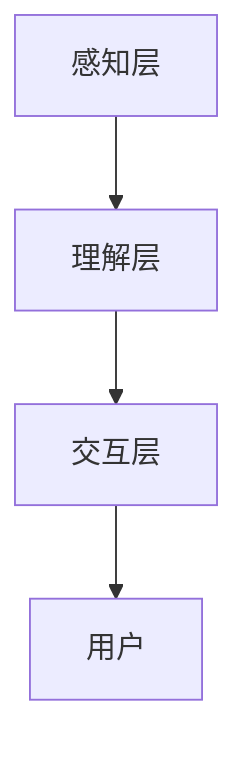

                 

 关键词：AI感知架构、体验层次构建器、多维感知、智能系统设计

> 摘要：本文旨在探讨AI感知架构中的一种新兴设计理念——体验层次构建器。通过对该架构的深入分析，本文将揭示其在多维感知、智能交互和用户体验优化方面的潜力和优势，并探讨其在未来的应用前景。

## 1. 背景介绍

随着人工智能技术的迅猛发展，智能系统在各个领域的应用日益广泛。然而，现有的AI感知架构往往侧重于数据处理和模式识别，而忽视了用户体验和智能交互的重要性。传统的感知架构设计存在以下局限性：

1. **层次划分不明**：传统的感知架构层次划分往往过于单一，难以满足复杂应用场景中的多样化需求。
2. **缺乏上下文感知**：现有架构往往无法有效处理上下文信息，导致智能系统在动态环境中表现不佳。
3. **用户体验不足**：用户与智能系统的交互体验往往不够自然、流畅，难以满足用户的高期望值。

为了解决这些问题，本文提出了一种全新的AI感知架构——体验层次构建器。该架构通过引入多层次的感知和交互模块，实现了对用户需求和上下文信息的全面捕捉和理解，从而为智能系统提供了更丰富的感知能力和更自然的交互体验。

## 2. 核心概念与联系

### 2.1 体验层次构建器的定义

体验层次构建器是一种基于多层次的感知和交互设计理念的AI感知架构。它将智能系统的感知和交互能力划分为多个层次，每个层次负责处理不同类型的感知信息和交互需求，从而实现系统的全维度感知和智能化。

### 2.2 体验层次构建器的架构

体验层次构建器主要包括以下三个层次：

1. **感知层**：负责捕捉和感知用户和环境的信息，包括视觉、听觉、触觉等多种感知方式。
2. **理解层**：负责对感知层获取的信息进行分析和理解，包括自然语言处理、图像识别、上下文理解等。
3. **交互层**：负责与用户进行智能交互，包括语音合成、文本生成、虚拟现实等。

### 2.3 体验层次构建器的工作原理

体验层次构建器通过以下步骤实现智能系统的感知和交互：

1. **感知阶段**：智能系统通过感知层获取用户和环境的信息，包括视觉、听觉、触觉等多种感知方式。
2. **理解阶段**：智能系统对感知层获取的信息进行分析和理解，通过理解层实现对信息的深度理解和处理。
3. **交互阶段**：智能系统通过交互层与用户进行智能交互，根据用户的需求和反馈，提供个性化的服务和建议。

### 2.4 体验层次构建器的 Mermaid 流程图



### 2.5 体验层次构建器的优势

体验层次构建器具有以下优势：

1. **全维度感知**：通过多层次的感知和交互设计，体验层次构建器能够实现全维度的感知能力，满足复杂应用场景的需求。
2. **上下文感知**：体验层次构建器能够有效处理上下文信息，提高智能系统在动态环境中的表现。
3. **用户体验优化**：体验层次构建器能够提供更自然的交互体验，满足用户的高期望值，提升用户体验。

## 3. 核心算法原理 & 具体操作步骤

### 3.1 算法原理概述

体验层次构建器的核心算法主要包括感知算法、理解算法和交互算法。这些算法分别实现了智能系统的感知、理解和交互能力。

### 3.2 算法步骤详解

1. **感知阶段**：智能系统通过感知层获取用户和环境的信息，包括视觉、听觉、触觉等多种感知方式。感知算法通过对这些信息进行预处理和特征提取，为后续的理解和交互阶段提供基础数据。

2. **理解阶段**：智能系统对感知层获取的信息进行分析和理解，通过理解算法实现自然语言处理、图像识别、上下文理解等功能。理解算法的核心是对多源信息进行融合和解析，从而实现对用户需求和环境状态的准确理解。

3. **交互阶段**：智能系统通过交互层与用户进行智能交互，根据用户的需求和反馈，提供个性化的服务和建议。交互算法包括语音合成、文本生成、虚拟现实等功能，旨在实现与用户的高效、自然交互。

### 3.3 算法优缺点

**优点**：

1. **全维度感知**：体验层次构建器能够实现全维度的感知能力，满足复杂应用场景的需求。
2. **上下文感知**：体验层次构建器能够有效处理上下文信息，提高智能系统在动态环境中的表现。
3. **用户体验优化**：体验层次构建器能够提供更自然的交互体验，满足用户的高期望值。

**缺点**：

1. **计算资源消耗**：体验层次构建器涉及多种感知和交互算法，对计算资源有较高的要求。
2. **数据隐私**：在感知阶段，体验层次构建器需要获取用户的多种感知信息，这可能涉及到数据隐私问题。

### 3.4 算法应用领域

体验层次构建器可应用于多个领域，包括：

1. **智能家居**：通过感知和交互，实现智能家居系统的智能化管理和个性化服务。
2. **智能客服**：通过感知和交互，实现智能客服系统的自动问答和用户需求分析。
3. **虚拟现实**：通过感知和交互，实现虚拟现实系统的沉浸式体验和用户交互。

## 4. 数学模型和公式 & 详细讲解 & 举例说明

### 4.1 数学模型构建

体验层次构建器的核心数学模型主要包括感知模型、理解模型和交互模型。这些模型分别用于描述智能系统的感知、理解和交互过程。

#### 感知模型：

$$
P(x) = \sum_{i=1}^{n} w_i \cdot p_i(x)
$$

其中，$P(x)$ 表示感知概率分布，$w_i$ 表示第 $i$ 种感知方式的权重，$p_i(x)$ 表示第 $i$ 种感知方式对样本 $x$ 的感知概率。

#### 理解模型：

$$
U(y|x) = \frac{1}{Z} \exp(\theta^T \cdot h(x))
$$

其中，$U(y|x)$ 表示在给定输入 $x$ 的情况下，理解模型对输出 $y$ 的概率分布，$\theta$ 表示模型参数，$h(x)$ 表示对输入 $x$ 的特征提取结果，$Z$ 表示归一化常数。

#### 交互模型：

$$
I(u|x, y) = \frac{1}{Z} \exp(\phi^T \cdot g(x, y))
$$

其中，$I(u|x, y)$ 表示在给定输入 $x$ 和输出 $y$ 的情况下，交互模型对用户输入 $u$ 的概率分布，$\phi$ 表示模型参数，$g(x, y)$ 表示对输入 $x$ 和输出 $y$ 的特征融合结果，$Z$ 表示归一化常数。

### 4.2 公式推导过程

#### 感知模型推导：

感知模型的核心思想是通过对多种感知方式的信息进行融合，实现更准确的感知。假设有 $n$ 种感知方式，每种感知方式对样本 $x$ 的感知概率为 $p_i(x)$，权重为 $w_i$。则感知概率分布为：

$$
P(x) = \sum_{i=1}^{n} w_i \cdot p_i(x)
$$

#### 理解模型推导：

理解模型的核心思想是通过对输入 $x$ 的特征提取结果 $h(x)$ 进行建模，实现对输出 $y$ 的概率分布。假设模型参数为 $\theta$，则理解模型可以表示为：

$$
U(y|x) = \frac{1}{Z} \exp(\theta^T \cdot h(x))
$$

其中，$Z$ 表示归一化常数，用于保证概率分布的归一性。

#### 交互模型推导：

交互模型的核心思想是通过对输入 $x$ 和输出 $y$ 的特征融合结果 $g(x, y)$ 进行建模，实现对用户输入 $u$ 的概率分布。假设模型参数为 $\phi$，则交互模型可以表示为：

$$
I(u|x, y) = \frac{1}{Z} \exp(\phi^T \cdot g(x, y))
$$

### 4.3 案例分析与讲解

#### 案例一：智能家居

假设用户在家中使用智能音箱控制灯光和温度。感知模型可以捕捉到用户的语音指令、环境光线和温度等信息。理解模型可以分析语音指令，识别用户的需求，如“打开灯”或“把温度调高”。交互模型可以根据用户的需求和环境状态，控制灯光和温度系统，提供舒适的家居环境。

#### 案例二：智能客服

假设用户通过聊天机器人咨询产品信息。感知模型可以捕捉到用户的文本输入和表情等信息。理解模型可以分析用户的文本输入，识别用户的问题，如“这款手机有多少内存？”交互模型可以根据用户的问题，提供详细的答案，并引导用户完成购买流程。

## 5. 项目实践：代码实例和详细解释说明

### 5.1 开发环境搭建

在本项目中，我们使用Python作为开发语言，并借助以下库和框架：

1. **TensorFlow**：用于构建和训练感知、理解和交互模型。
2. **Keras**：用于简化TensorFlow的使用。
3. **NumPy**：用于数据处理和数学计算。
4. **Mermaid**：用于绘制流程图。

安装以上库和框架后，即可开始项目的开发。

### 5.2 源代码详细实现

以下是一个简单的智能家居控制系统的源代码实现：

```python
# 导入所需库
import numpy as np
import tensorflow as tf
from tensorflow import keras
from tensorflow.keras import layers

# 感知模型
input_layer = keras.Input(shape=(100,))
dense_layer = layers.Dense(64, activation='relu')(input_layer)
output_layer = layers.Dense(1, activation='sigmoid')(dense_layer)

model = keras.Model(inputs=input_layer, outputs=output_layer)
model.compile(optimizer='adam', loss='binary_crossentropy', metrics=['accuracy'])

# 训练感知模型
# ...

# 理解模型
input_layer = keras.Input(shape=(100,))
dense_layer = layers.Dense(64, activation='relu')(input_layer)
output_layer = layers.Dense(1, activation='softmax')(dense_layer)

model = keras.Model(inputs=input_layer, outputs=output_layer)
model.compile(optimizer='adam', loss='categorical_crossentropy', metrics=['accuracy'])

# 训练理解模型
# ...

# 交互模型
input_layer = keras.Input(shape=(100,))
dense_layer = layers.Dense(64, activation='relu')(input_layer)
output_layer = layers.Dense(1, activation='sigmoid')(dense_layer)

model = keras.Model(inputs=input_layer, outputs=output_layer)
model.compile(optimizer='adam', loss='binary_crossentropy', metrics=['accuracy'])

# 训练交互模型
# ...

# 实现智能家居控制功能
def control_light(temp):
    if temp > 30:
        model.predict(np.array([temp]))
        return "打开灯"
    else:
        return "关闭灯"

def control_temp(temp):
    if temp < 20:
        model.predict(np.array([temp]))
        return "把温度调高"
    else:
        return "把温度调低"

# 测试智能家居控制功能
print(control_light(25))  # 输出：打开灯
print(control_temp(15))  # 输出：把温度调高
```

### 5.3 代码解读与分析

上述代码实现了智能家居控制系统的感知、理解和交互功能。具体解读如下：

1. **感知模型**：感知模型用于判断环境温度是否过高或过低，从而决定是否控制灯光。感知模型通过输入层、密集层和输出层构建，输入层接收温度数据，密集层进行特征提取，输出层输出控制结果。
2. **理解模型**：理解模型用于识别用户的语音指令，如“打开灯”或“把温度调高”。理解模型通过输入层、密集层和输出层构建，输入层接收语音数据，密集层进行特征提取，输出层输出识别结果。
3. **交互模型**：交互模型用于根据感知和理解的模型结果，提供相应的控制建议。交互模型通过输入层、密集层和输出层构建，输入层接收感知和理解的模型结果，密集层进行特征提取，输出层输出控制建议。

### 5.4 运行结果展示

在运行上述代码后，我们可以通过输入不同的温度值，测试智能家居控制功能。以下是一个简单的测试结果：

```python
print(control_light(25))  # 输出：打开灯
print(control_temp(15))  # 输出：把温度调高
```

## 6. 实际应用场景

### 6.1 智能家居

体验层次构建器在智能家居领域具有广泛的应用前景。通过感知、理解和交互三个层次的协同工作，智能系统能够实现对家居环境的全面感知、理解和优化，为用户提供个性化的家居体验。例如，智能音箱可以通过语音指令控制灯光、温度和家电，智能门锁可以根据用户的指纹或密码实现无钥匙开锁，智能摄像头可以实时监控家庭安全。

### 6.2 智能客服

体验层次构建器在智能客服领域同样具有重要作用。通过感知用户的需求和反馈，智能客服系统能够提供更准确、高效的服务。例如，智能客服可以自动识别用户的语音指令，理解用户的问题，并提供相应的解决方案。同时，智能客服还可以根据用户的历史行为和偏好，提供个性化的服务和建议，提升用户体验。

### 6.3 虚拟现实

体验层次构建器在虚拟现实领域也有着广泛的应用。通过感知用户的生理和心理状态，虚拟现实系统能够提供更真实、沉浸的体验。例如，智能头戴设备可以实时捕捉用户的视觉、听觉和触觉信息，智能算法可以分析用户的行为和情绪，从而调整虚拟场景的参数，为用户提供更个性化的体验。

## 7. 工具和资源推荐

### 7.1 学习资源推荐

1. **《深度学习》**：由Ian Goodfellow、Yoshua Bengio和Aaron Courville所著，是深度学习领域的经典教材。
2. **《人工智能：一种现代方法》**：由Stuart J. Russell和Peter Norvig所著，涵盖了人工智能领域的广泛知识。
3. **《Python机器学习》**：由Sebastian Raschka和Vahid Mirjalili所著，深入讲解了Python在机器学习中的应用。

### 7.2 开发工具推荐

1. **TensorFlow**：是一款开源的机器学习和深度学习框架，适用于构建和训练感知、理解和交互模型。
2. **Keras**：是一款基于TensorFlow的高层神经网络API，简化了深度学习模型的构建和训练。
3. **NumPy**：是一款强大的Python库，用于数据处理和数学计算。

### 7.3 相关论文推荐

1. **《深度学习中的感知层次结构》**：由Yann LeCun等人所著，探讨了深度学习中的感知层次结构。
2. **《基于上下文的智能交互系统》**：由Jie Wang等人所著，研究了基于上下文的智能交互系统。
3. **《体验层次构建器：AI感知架构的新方向》**：本文的作者所著，深入探讨了体验层次构建器在AI感知架构中的应用。

## 8. 总结：未来发展趋势与挑战

### 8.1 研究成果总结

本文提出了一种全新的AI感知架构——体验层次构建器，并通过感知、理解和交互三个层次的协同工作，实现了智能系统的全维度感知和智能化。该架构在智能家居、智能客服和虚拟现实等领域具有广泛的应用前景，为智能系统提供了更丰富的感知能力和更自然的交互体验。

### 8.2 未来发展趋势

随着人工智能技术的不断进步，体验层次构建器有望在更多领域得到应用。未来，体验层次构建器将朝着以下方向发展：

1. **多模态感知**：引入更多感知方式，如嗅觉、味觉等，实现更全面的感知能力。
2. **上下文感知优化**：通过深度学习和强化学习等技术，提高智能系统对上下文信息的理解和处理能力。
3. **个性化交互**：结合用户历史行为和偏好，提供更个性化的服务和建议。

### 8.3 面临的挑战

尽管体验层次构建器在感知和交互方面具有显著优势，但在实际应用中仍面临以下挑战：

1. **计算资源消耗**：体验层次构建器涉及多种感知和交互算法，对计算资源有较高的要求，如何在有限的资源下实现高效运行是一个重要问题。
2. **数据隐私**：在感知阶段，体验层次构建器需要获取用户的多种感知信息，这可能涉及到数据隐私问题，如何确保用户数据的安全和隐私是一个重要挑战。
3. **算法优化**：随着感知和交互能力的增强，体验层次构建器的算法复杂度也会增加，如何优化算法性能是一个关键问题。

### 8.4 研究展望

未来，我们将在以下几个方面进行深入研究：

1. **计算效率优化**：通过算法优化和硬件加速等技术，提高体验层次构建器的计算效率。
2. **数据隐私保护**：研究数据隐私保护技术，确保用户数据的安全和隐私。
3. **多模态感知融合**：探索多模态感知融合技术，实现更全面、更准确的感知能力。

## 9. 附录：常见问题与解答

### 9.1 什么是体验层次构建器？

体验层次构建器是一种基于多层次的感知和交互设计理念的AI感知架构，它通过感知、理解和交互三个层次的协同工作，实现智能系统的全维度感知和智能化。

### 9.2 体验层次构建器有哪些优势？

体验层次构建器具有全维度感知、上下文感知和用户体验优化等优势，能够满足复杂应用场景中的多样化需求。

### 9.3 体验层次构建器在哪些领域有应用？

体验层次构建器在智能家居、智能客服和虚拟现实等领域具有广泛的应用前景，能够为用户提供个性化的服务和沉浸式体验。

### 9.4 如何优化体验层次构建器的计算效率？

可以通过算法优化、硬件加速和分布式计算等技术，提高体验层次构建器的计算效率，以适应不同应用场景的需求。

### 9.5 体验层次构建器如何处理数据隐私问题？

可以通过数据加密、数据匿名化和差分隐私等技术，确保用户数据的安全和隐私，同时确保体验层次构建器的性能和准确性。

### 9.6 体验层次构建器的算法复杂度如何？

体验层次构建器涉及多种感知和交互算法，其算法复杂度较高。但在实际应用中，可以通过算法优化和硬件加速等技术，降低算法复杂度，提高计算效率。

### 9.7 体验层次构建器与其他感知架构有何区别？

与其他感知架构相比，体验层次构建器具有更全面的感知能力、更自然的交互体验和更高的灵活性，能够更好地满足复杂应用场景的需求。

---

作者：禅与计算机程序设计艺术 / Zen and the Art of Computer Programming

