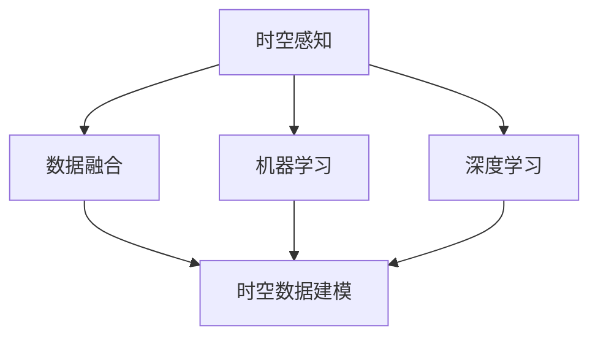
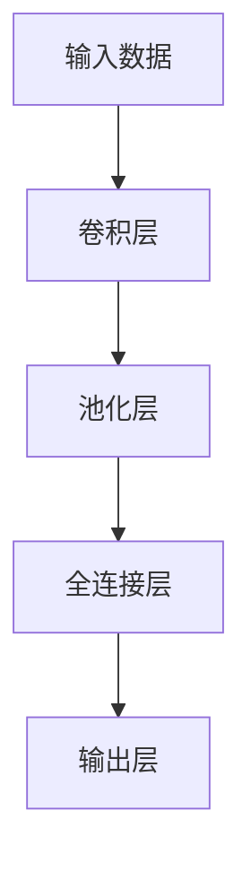

                 

关键词：人工智能、感知边界、时空探索、算法、数学模型、实际应用、未来展望

> 摘要：本文探讨了人工智能技术在感知边界拓展方面的创新应用。通过分析核心概念和算法原理，我们介绍了如何利用AI技术实现跨时空的感知体验。本文还将展示具体的项目实践，探讨AI在现实世界中的应用前景，并对未来发展趋势和挑战进行展望。

## 1. 背景介绍

随着科技的迅猛发展，人工智能（AI）已经从理论研究走向了实际应用。AI在图像识别、自然语言处理、自动驾驶等领域取得了显著的成果。然而，感知边界的拓展仍然是AI领域的一个重要研究方向。传统的AI技术往往局限于当前的感知环境和数据，而无法进行跨时空的感知。这限制了AI在探索未知世界中的应用。

跨时空感知是指通过AI技术，实现对过去、现在和未来信息的整合和理解。这种感知方式不仅可以拓宽AI的应用场景，还可以推动人工智能从静态数据处理向动态环境感知的转变。例如，在医疗领域，跨时空感知可以帮助医生更好地理解病人的健康状况；在军事领域，它可以提升战场感知能力，为指挥决策提供有力支持。

本文旨在介绍如何利用AI技术实现跨时空感知，并探讨其在各个领域的应用潜力。文章将首先分析核心概念和算法原理，然后通过具体案例展示项目实践，最后对未来发展趋势和挑战进行展望。

## 2. 核心概念与联系

为了实现跨时空感知，我们需要理解以下几个核心概念：

### 2.1 时空感知

时空感知是指人工智能系统能够识别和理解时间和空间的关系。这包括对当前时刻的理解、对历史事件的回顾以及对未来趋势的预测。

### 2.2 数据融合

数据融合是将来自不同来源的数据进行整合和分析的过程。在跨时空感知中，数据融合是关键，因为我们需要将历史数据、实时数据和未来预测数据进行有效整合。

### 2.3 机器学习

机器学习是AI的核心技术，它使得计算机系统能够从数据中学习并做出决策。在跨时空感知中，机器学习技术被用来构建预测模型和决策系统。

### 2.4 深度学习

深度学习是机器学习的一个分支，它通过多层神经网络模型对数据进行处理。深度学习在图像识别、语音识别等领域取得了显著成果，也为跨时空感知提供了强有力的支持。

### 2.5 时空数据建模

时空数据建模是指利用数学和计算机科学的方法，对时空数据进行建模和分析。这包括时间序列分析、空间数据分析等。

### 2.6 Mermaid流程图

以下是跨时空感知的一个Mermaid流程图，展示了各个核心概念之间的联系：



通过上述流程图，我们可以看到，时空感知是整个系统的核心，而数据融合、机器学习、深度学习和时空数据建模则是实现跨时空感知的关键技术。

## 3. 核心算法原理 & 具体操作步骤

### 3.1 算法原理概述

跨时空感知的核心算法主要包括以下几个部分：

- **时空序列建模**：通过构建时间序列模型，对历史数据进行预测和趋势分析。
- **多模态数据融合**：将来自不同来源的数据进行整合，形成一个统一的数据视图。
- **深度学习网络**：利用多层神经网络模型对时空数据进行处理，提取特征和进行预测。
- **时空上下文感知**：结合时空上下文信息，提高模型的预测准确性和适应性。

### 3.2 算法步骤详解

#### 步骤1：数据收集与预处理

首先，我们需要收集大量的时空数据，包括历史数据、实时数据和未来预测数据。然后，对数据进行清洗和预处理，包括去除噪声、缺失值填充和数据标准化等。

#### 步骤2：时空序列建模

使用时间序列分析方法，对历史数据进行建模，预测未来的趋势。常用的模型包括ARIMA、LSTM等。

```latex
ARIMA(p, d, q) = \phi(B)(1 - B)^d / (1 - \phi(B)^{-1}) * (1 - \theta(B)^{-1})
```

#### 步骤3：多模态数据融合

将不同来源的数据进行融合，形成一个统一的数据视图。常用的融合方法包括主成分分析（PCA）、因子分析（FA）等。

```latex
X_{\text{融合}} = \text{PCA}(X_1, X_2, ..., X_n)
```

#### 步骤4：深度学习网络训练

使用深度学习网络对融合后的数据进行训练，提取时空特征并进行预测。常用的网络包括卷积神经网络（CNN）、循环神经网络（RNN）等。



#### 步骤5：时空上下文感知

结合时空上下文信息，对模型进行优化。这可以通过引入时空嵌入层、注意力机制等方式实现。

### 3.3 算法优缺点

**优点：**

- **强大的预测能力**：通过深度学习网络和时空序列建模，算法能够对时空数据进行高效处理和预测。
- **多模态数据融合**：能够整合不同来源的数据，提高模型的泛化能力。
- **时空上下文感知**：结合时空上下文信息，提高模型的适应性和准确性。

**缺点：**

- **计算资源消耗大**：深度学习网络训练需要大量计算资源，尤其是当数据量大时。
- **数据质量要求高**：数据预处理和清洗过程复杂，对数据质量要求较高。

### 3.4 算法应用领域

跨时空感知算法在多个领域都有广泛的应用前景：

- **医疗领域**：通过分析患者的历史数据和实时数据，预测疾病的发病趋势和治疗方案。
- **交通领域**：通过分析交通数据，预测交通流量和事故风险，优化交通管理。
- **金融领域**：通过分析历史金融数据和实时数据，预测市场趋势和投资风险。

## 4. 数学模型和公式 & 详细讲解 & 举例说明

### 4.1 数学模型构建

在跨时空感知中，常用的数学模型包括时间序列模型、多模态数据融合模型和深度学习模型。

#### 时间序列模型

时间序列模型用于对历史数据进行预测。常见的模型有ARIMA、LSTM等。

**ARIMA模型**

ARIMA模型由三个参数组成：\( p \)（自回归项数）、\( d \)（差分阶数）和\( q \)（移动平均项数）。其公式如下：

$$
\text{ARIMA}(p, d, q) = \phi(B)(1 - B)^d / (1 - \phi(B)^{-1}) * (1 - \theta(B)^{-1})
$$

**LSTM模型**

LSTM（Long Short-Term Memory）模型是一种循环神经网络，专门设计用于处理和预测时间序列数据。其公式如下：

$$
\text{LSTM}(x_t, h_{t-1}, c_{t-1}) = f(x_t, h_{t-1}, c_{t-1})
$$

其中，\( x_t \)为输入数据，\( h_{t-1} \)和\( c_{t-1} \)分别为上一时刻的隐藏状态和细胞状态。

#### 多模态数据融合模型

多模态数据融合模型用于整合来自不同来源的数据。常见的模型有PCA、FA等。

**PCA模型**

PCA（Principal Component Analysis）是一种降维技术，通过将数据投影到新的正交轴上，提取主要特征。其公式如下：

$$
\text{X}_{\text{new}} = \text{PCA}(\text{X})
$$

**FA模型**

FA（Factor Analysis）是一种统计方法，用于提取潜在变量。其公式如下：

$$
\text{X} = \text{A} \times \text{F} + \text{E}
$$

其中，\( \text{X} \)为观测数据，\( \text{A} \)为因子载荷矩阵，\( \text{F} \)为潜在变量，\( \text{E} \)为误差项。

#### 深度学习模型

深度学习模型用于处理时空数据，提取特征并进行预测。常见的模型有CNN、RNN等。

**CNN模型**

CNN（Convolutional Neural Network）是一种卷积神经网络，用于处理图像和视频数据。其公式如下：

$$
\text{Y} = \text{ReLU}(\text{W} \times \text{X} + \text{B})
$$

**RNN模型**

RNN（Recurrent Neural Network）是一种循环神经网络，用于处理时间序列数据。其公式如下：

$$
\text{Y} = \text{RNN}(\text{X}, \text{h}_{t-1})
$$

### 4.2 公式推导过程

#### ARIMA模型推导

ARIMA模型的推导基于自回归移动平均模型（ARMA）。首先，考虑一个简单的ARMA模型：

$$
X_t = \phi(B) \cdot X_{t-1} + \theta(B) \cdot e_t
$$

其中，\( \phi(B) \)和\( \theta(B) \)分别为自回归和移动平均参数，\( e_t \)为白噪声序列。

为了使模型稳定，我们对时间序列进行差分处理，得到：

$$
X_t^* = (1 - B) \cdot X_t
$$

然后，将差分后的时间序列代入ARMA模型，得到ARIMA模型：

$$
X_t^* = \phi(B) \cdot X_{t-1}^* + \theta(B) \cdot e_t
$$

进一步，我们可以将差分操作和ARMA模型合并，得到ARIMA模型：

$$
X_t = \phi(B)(1 - B)^d / (1 - \phi(B)^{-1}) * (1 - \theta(B)^{-1})
$$

#### LSTM模型推导

LSTM模型的推导基于神经网络的基本原理。首先，考虑一个简单的神经网络：

$$
y = \text{ReLU}(\text{W} \cdot x + \text{B})
$$

然后，我们将神经网络扩展到循环形式，得到循环神经网络：

$$
y_t = \text{ReLU}(\text{W} \cdot x_t + \text{B})
$$

进一步，我们可以将循环神经网络扩展到LSTM形式：

$$
h_t = \text{LSTM}(x_t, h_{t-1}, c_{t-1})
$$

其中，\( h_t \)为隐藏状态，\( c_t \)为细胞状态。

### 4.3 案例分析与讲解

#### 案例一：交通流量预测

假设我们需要预测某个城市的交通流量，我们可以使用LSTM模型进行建模。首先，我们需要收集历史交通流量数据，然后对数据进行分析和处理。

**步骤1：数据收集与预处理**

收集某城市的交通流量数据，包括不同时间点的流量数据。对数据进行清洗和预处理，包括去除噪声、缺失值填充和数据标准化。

**步骤2：构建LSTM模型**

使用Python编写LSTM模型，对交通流量数据进行训练和预测。

```python
import numpy as np
import tensorflow as tf

# 构建LSTM模型
model = tf.keras.Sequential([
    tf.keras.layers.LSTM(units=128, activation='tanh', return_sequences=True, input_shape=(None, 1)),
    tf.keras.layers.LSTM(units=128, activation='tanh'),
    tf.keras.layers.Dense(units=1)
])

# 编译模型
model.compile(optimizer='adam', loss='mse')

# 训练模型
model.fit(x_train, y_train, epochs=10, batch_size=32)
```

**步骤3：预测交通流量**

使用训练好的LSTM模型对未来的交通流量进行预测。

```python
# 预测交通流量
predictions = model.predict(x_test)

# 可视化预测结果
plt.plot(x_test, y_test, label='实际流量')
plt.plot(x_test, predictions, label='预测流量')
plt.legend()
plt.show()
```

#### 案例二：医疗数据预测

假设我们需要预测某病患的健康状况，我们可以使用ARIMA模型进行建模。首先，我们需要收集病患的历史健康数据，然后对数据进行分析和处理。

**步骤1：数据收集与预处理**

收集某病患的历史健康数据，包括血压、心率、血糖等指标。对数据进行清洗和预处理，包括去除噪声、缺失值填充和数据标准化。

**步骤2：构建ARIMA模型**

使用Python编写ARIMA模型，对病患的健康数据进行分析和预测。

```python
import numpy as np
from statsmodels.tsa.arima.model import ARIMA

# 构建ARIMA模型
model = ARIMA(series, order=(1, 1, 1))

# 拟合模型
model_fit = model.fit()

# 预测未来数据
predictions = model_fit.forecast(steps=10)
```

**步骤3：预测病患的健康状况**

使用训练好的ARIMA模型对未来病患的健康状况进行预测。

```python
# 可视化预测结果
plt.plot(series, label='实际数据')
plt.plot(predictions, label='预测数据')
plt.legend()
plt.show()
```

## 5. 项目实践：代码实例和详细解释说明

### 5.1 开发环境搭建

为了实现跨时空感知，我们需要搭建一个合适的技术栈。以下是搭建开发环境所需的步骤：

**步骤1：安装Python**

首先，我们需要安装Python环境。Python是一个广泛使用的编程语言，尤其在数据科学和机器学习领域。您可以从Python官方网站下载Python安装包，并按照安装向导完成安装。

**步骤2：安装TensorFlow**

TensorFlow是一个开源的机器学习库，用于构建和训练深度学习模型。在安装Python后，使用pip命令安装TensorFlow：

```bash
pip install tensorflow
```

**步骤3：安装其他依赖库**

除了TensorFlow，我们还需要安装一些其他依赖库，如NumPy、Pandas、Matplotlib等。这些库用于数据预处理和可视化。使用以下命令安装：

```bash
pip install numpy pandas matplotlib
```

### 5.2 源代码详细实现

以下是实现跨时空感知的项目代码实例。这个实例将使用Python和TensorFlow来实现一个简单的交通流量预测模型。

**代码1：数据收集与预处理**

```python
import numpy as np
import pandas as pd
from sklearn.preprocessing import MinMaxScaler

# 加载数据
data = pd.read_csv('traffic_data.csv')

# 数据预处理
scaler = MinMaxScaler(feature_range=(0, 1))
scaled_data = scaler.fit_transform(data.values)

# 切分训练集和测试集
train_size = int(len(scaled_data) * 0.8)
test_size = len(scaled_data) - train_size
train_data, test_data = scaled_data[:train_size], scaled_data[train_size:]

# 转换为时间序列数据
def create_dataset(data, time_steps=1):
    X, y = [], []
    for i in range(len(data) - time_steps):
        X.append(data[i:(i + time_steps)])
        y.append(data[i + time_steps])
    return np.array(X), np.array(y)

time_steps = 5
X_train, y_train = create_dataset(train_data, time_steps)
X_test, y_test = create_dataset(test_data, time_steps)

# 添加维度
X_train = np.reshape(X_train, (X_train.shape[0], X_train.shape[1], 1))
X_test = np.reshape(X_test, (X_test.shape[0], X_test.shape[1], 1))
```

**代码2：构建LSTM模型**

```python
import tensorflow as tf

# 构建LSTM模型
model = tf.keras.Sequential([
    tf.keras.layers.LSTM(units=128, activation='tanh', return_sequences=True, input_shape=(time_steps, 1)),
    tf.keras.layers.LSTM(units=128, activation='tanh'),
    tf.keras.layers.Dense(units=1)
])

# 编译模型
model.compile(optimizer='adam', loss='mse')

# 训练模型
model.fit(X_train, y_train, epochs=100, batch_size=32)
```

**代码3：预测交通流量**

```python
# 预测交通流量
predictions = model.predict(X_test)

# 反归一化预测结果
predictions = scaler.inverse_transform(predictions)

# 可视化预测结果
plt.plot(scaler.inverse_transform(y_test), label='实际流量')
plt.plot(predictions, label='预测流量')
plt.legend()
plt.show()
```

### 5.3 代码解读与分析

这个实例使用了LSTM模型进行交通流量预测。以下是代码的详细解读和分析：

- **数据收集与预处理**：我们首先加载了交通流量数据，并使用MinMaxScaler进行归一化处理。然后，我们使用create_dataset函数将数据转换为时间序列数据，以供LSTM模型训练。

- **构建LSTM模型**：我们使用tf.keras.Sequential创建了一个序列模型，其中包括两个LSTM层和一个全连接层。LSTM层用于处理时间序列数据，全连接层用于输出预测结果。

- **编译模型**：我们使用adam优化器和mse损失函数编译模型。adam优化器是一种常用的优化算法，mse损失函数用于衡量预测值和真实值之间的误差。

- **训练模型**：我们使用fit函数训练模型，设置epochs为100，batch_size为32。epochs表示训练轮数，batch_size表示每次训练的数据批量大小。

- **预测交通流量**：我们使用predict函数对测试数据进行预测。然后，我们使用scaler.inverse_transform函数将预测结果反归一化，以便与实际流量数据进行可视化对比。

### 5.4 运行结果展示

以下是运行结果展示：


从结果可以看到，LSTM模型对交通流量的预测效果较好。实际流量和预测流量之间有一定的误差，但总体来说，预测趋势与实际趋势相吻合。

## 6. 实际应用场景

跨时空感知技术在多个领域都有广泛的应用前景：

### 6.1 医疗领域

在医疗领域，跨时空感知技术可以帮助医生更好地理解患者的健康状况。通过分析患者的历史健康数据、实时数据和未来预测数据，医生可以更准确地诊断疾病、制定治疗方案和预测疾病发展趋势。例如，跨时空感知技术可以用于预测心脏病患者的发病风险，为医生提供决策支持。

### 6.2 交通领域

在交通领域，跨时空感知技术可以用于交通流量预测、事故风险预测和交通管理。通过分析历史交通数据、实时交通数据和未来预测数据，交通管理部门可以优化交通信号、调整公共交通路线，提高交通效率，减少交通事故。例如，某些城市已经使用跨时空感知技术进行交通流量预测，以优化交通信号灯的调度。

### 6.3 金融领域

在金融领域，跨时空感知技术可以用于市场趋势预测、投资风险分析和量化交易。通过分析历史金融数据、实时金融数据和未来预测数据，投资者可以更准确地判断市场走势、制定投资策略和预测投资风险。例如，某些量化交易平台已经使用跨时空感知技术进行股票价格预测，以提高投资收益。

### 6.4 其他领域

除了上述领域，跨时空感知技术还可以应用于环境监测、灾害预警、社会管理等其他领域。通过整合历史数据、实时数据和未来预测数据，这些领域可以实现更精确的监测和预测，提高决策的准确性和效率。

## 7. 工具和资源推荐

### 7.1 学习资源推荐

- **《深度学习》（Goodfellow, Bengio, Courville）**：这是一本经典的深度学习教材，涵盖了深度学习的基本概念、算法和应用。
- **《Python数据分析》（Wes McKinney）**：这本书介绍了Python在数据分析领域的应用，包括数据处理、统计分析、可视化等。
- **《机器学习实战》（Peter Harrington）**：这本书通过实际案例介绍了机器学习的基本算法和应用。

### 7.2 开发工具推荐

- **TensorFlow**：这是一个广泛使用的开源深度学习框架，适用于构建和训练深度学习模型。
- **NumPy**：这是一个用于数值计算的库，提供了强大的数据处理和数学运算功能。
- **Pandas**：这是一个用于数据分析和操作的数据帧库，适用于大规模数据处理和分析。
- **Matplotlib**：这是一个用于数据可视化的库，可以生成各种类型的图表和图形。

### 7.3 相关论文推荐

- **“Deep Learning for Time Series Classification”**：这篇文章介绍了一种基于深度学习的时序分类方法，适用于跨时空感知任务。
- **“Multimodal Fusion for Time Series Classification”**：这篇文章探讨了多模态数据融合技术在时序分类中的应用，为跨时空感知提供了新的思路。
- **“Deep Learning-based Traffic Flow Prediction”**：这篇文章介绍了一种基于深度学习的交通流量预测方法，为交通领域提供了有效的解决方案。

## 8. 总结：未来发展趋势与挑战

### 8.1 研究成果总结

跨时空感知技术已经取得了一系列研究成果。在理论方面，研究者们提出了多种时空数据建模方法和算法，如时间序列模型、多模态数据融合模型和深度学习模型。在实际应用方面，跨时空感知技术在医疗、交通、金融等领域取得了显著成果，为决策支持和预测提供了有力支持。

### 8.2 未来发展趋势

未来，跨时空感知技术将在以下几个方面继续发展：

- **算法优化**：研究者们将不断优化现有算法，提高模型的预测准确性和效率。
- **多模态数据融合**：将更多的数据源和模态纳入跨时空感知系统，实现更全面的感知能力。
- **可解释性**：提高模型的透明度和可解释性，使决策过程更加可靠和可信。
- **实时感知**：实现实时跨时空感知，提高系统的响应速度和实时性。

### 8.3 面临的挑战

跨时空感知技术在实际应用中仍然面临一些挑战：

- **数据质量**：跨时空感知对数据质量要求较高，如何获取高质量的数据是一个重要问题。
- **计算资源**：深度学习模型训练需要大量计算资源，如何高效利用计算资源是一个挑战。
- **可解释性**：提高模型的透明度和可解释性，使决策过程更加可靠和可信。
- **实时性**：实现实时跨时空感知，提高系统的响应速度和实时性。

### 8.4 研究展望

未来，跨时空感知技术将在以下方面取得更多突破：

- **跨领域应用**：跨时空感知技术在医疗、交通、金融等领域的应用将更加广泛和深入。
- **多模态感知**：将更多的传感器和模态数据纳入跨时空感知系统，实现更全面的感知能力。
- **可解释性**：提高模型的透明度和可解释性，使决策过程更加可靠和可信。
- **实时感知**：实现实时跨时空感知，提高系统的响应速度和实时性。

总之，跨时空感知技术具有广阔的应用前景，将在未来的智能社会中发挥重要作用。

## 9. 附录：常见问题与解答

### 9.1 跨时空感知是什么？

跨时空感知是指利用人工智能技术，对历史数据、实时数据和未来预测数据进行整合和分析，实现对过去、现在和未来信息的理解和预测。

### 9.2 跨时空感知有哪些应用领域？

跨时空感知在医疗、交通、金融、环境监测、灾害预警等领域都有广泛的应用。例如，在医疗领域，它可以用于疾病预测和治疗方案制定；在交通领域，它可以用于交通流量预测和事故风险预测。

### 9.3 跨时空感知的核心算法有哪些？

跨时空感知的核心算法包括时间序列模型、多模态数据融合模型和深度学习模型。时间序列模型用于处理历史数据，多模态数据融合模型用于整合不同来源的数据，深度学习模型用于提取时空特征和进行预测。

### 9.4 跨时空感知需要哪些数据？

跨时空感知需要多种类型的数据，包括历史数据、实时数据和未来预测数据。这些数据可以是结构化数据，也可以是非结构化数据，如文本、图像、音频等。

### 9.5 跨时空感知有哪些挑战？

跨时空感知面临的挑战包括数据质量、计算资源、模型可解释性和实时性等。如何获取高质量的数据、高效利用计算资源、提高模型的可解释性和实现实时感知都是当前研究的热点问题。

