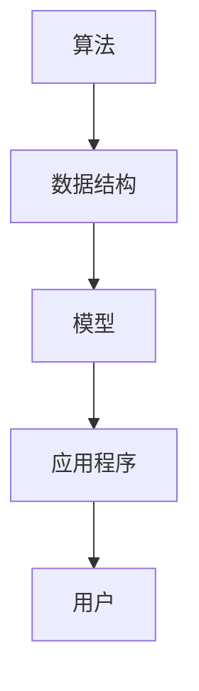

                 

在当今信息技术飞速发展的时代，构建应用程序已经成为了许多企业和开发者的核心任务。然而，如何高效地使用基础模型来构建出功能强大且可扩展的应用程序，依然是许多人在编程过程中所面临的挑战。为此，我撰写了这本新书《使用基础模型构建应用程序》，旨在为读者提供一套系统、实用、易于理解的方法。

## 文章关键词

- 基础模型
- 应用程序构建
- 编程实践
- 技术发展
- 可扩展性

## 文章摘要

本书将带领读者深入了解基础模型在应用程序构建中的重要性，并介绍一系列实用的编程技巧和策略。通过详细的案例和实践，读者将学会如何有效地使用基础模型来构建出高效、可靠且易于维护的应用程序。书中还探讨了当前技术发展趋势以及未来可能面临的挑战，为读者提供了广阔的视野和深入思考的机会。

## 1. 背景介绍

随着互联网和移动设备的普及，应用程序已经渗透到了我们生活的方方面面。从社交媒体到电子商务，从在线教育到智能家居，应用程序正在不断改变我们的生活方式。然而，构建一个成功的应用程序并非易事。开发者需要面对诸多挑战，如性能优化、可扩展性、安全性等。在这些挑战中，如何有效地利用基础模型来构建应用程序成为了一个关键问题。

本书旨在解决这一问题，通过介绍基础模型的概念、原理和应用，帮助读者掌握构建高效应用程序的技能。书中不仅涵盖了常见的编程语言和工具，还深入探讨了基础模型在不同领域的应用，如自然语言处理、图像识别和推荐系统等。

## 2. 核心概念与联系

为了更好地理解基础模型在应用程序构建中的应用，我们首先需要了解一些核心概念。这些概念包括：

- **算法**：算法是解决问题的一系列步骤或规则。在应用程序构建中，算法用于处理数据、优化性能和实现特定功能。
- **数据结构**：数据结构是组织和存储数据的方式。合理的数据结构可以提高程序的效率，减少内存占用。
- **模型**：模型是对现实世界的抽象和表示。在机器学习中，模型用于从数据中学习规律和模式。

下面是一个使用 Mermaid 语法绘制的简单 Mermaid 流程图，展示了这些概念之间的联系：



在这个流程图中，算法和数据结构是构建模型的基础，模型则是构建应用程序的核心。最终，应用程序将服务于用户，形成闭环。

## 3. 核心算法原理 & 具体操作步骤

### 3.1 算法原理概述

在构建应用程序时，选择合适的算法至关重要。以下是一些常用的算法及其原理：

- **排序算法**：用于对数据进行排序，常见的排序算法有快速排序、归并排序和堆排序等。
- **搜索算法**：用于在数据中查找特定元素，常见的搜索算法有二分搜索和深度优先搜索等。
- **动态规划**：用于解决最优化问题，通过保存子问题的解来避免重复计算。
- **贪心算法**：通过每一步选择当前最优解来逐步构造最优解。

### 3.2 算法步骤详解

以快速排序为例，其基本步骤如下：

1. 选择一个基准元素。
2. 将所有小于基准的元素移到其左侧，所有大于基准的元素移到其右侧。
3. 递归地对左侧和右侧的子数组进行快速排序。

以下是快速排序的伪代码：

```plaintext
快速排序(A, low, high)
    如果 low < high
        pi = 分区(A, low, high)
        快速排序(A, low, pi - 1)
        快速排序(A, pi + 1, high)
    end 如果
end 快速排序
```

### 3.3 算法优缺点

- **快速排序**：时间复杂度为 \(O(n \log n)\)，在大多数情况下性能良好，但最坏情况下性能可能下降到 \(O(n^2)\)。
- **归并排序**：时间复杂度为 \(O(n \log n)\)，性能稳定，但需要额外的内存空间。
- **堆排序**：时间复杂度为 \(O(n \log n)\)，不需要额外内存，但性能可能不如快速排序。

### 3.4 算法应用领域

算法在应用程序构建中有着广泛的应用，以下是一些常见的应用领域：

- **数据库索引**：使用排序算法来构建索引，提高查询性能。
- **搜索引擎**：使用搜索算法来快速检索相关信息。
- **图像处理**：使用图像识别算法来分析和处理图像数据。
- **推荐系统**：使用推荐算法来预测用户兴趣和推荐商品。

## 4. 数学模型和公式 & 详细讲解 & 举例说明

在应用程序构建中，数学模型和公式发挥着重要作用。以下是一个简单的例子，展示了如何使用数学模型来构建应用程序。

### 4.1 数学模型构建

假设我们要构建一个简单的推荐系统，根据用户的历史行为来推荐商品。我们可以使用以下数学模型：

- **用户 - 商品矩阵**：表示用户与商品之间的交互关系。
- **用户兴趣向量**：表示用户对各类商品的偏好。
- **商品特征向量**：表示商品的属性。

### 4.2 公式推导过程

我们可以使用以下公式来计算用户的兴趣向量：

$$
\text{user\_interest} = \text{user\_behavior} \cdot \text{item\_feature}
$$

其中，$\text{user\_behavior}$ 表示用户的历史行为向量，$\text{item\_feature}$ 表示商品的特征向量。

### 4.3 案例分析与讲解

假设我们有以下用户 - 商品矩阵：

$$
\begin{matrix}
\text{商品1} & \text{商品2} & \text{商品3} \\
\text{用户1} & 1 & 0 \\
\text{用户2} & 0 & 1 \\
\end{matrix}
$$

我们可以使用上述公式来计算用户1和用户2的兴趣向量：

$$
\text{user1\_interest} = (1, 0) \cdot (0.5, 0.5) = 0.5
$$

$$
\text{user2\_interest} = (0, 1) \cdot (0.5, 0.5) = 0.5
$$

根据计算结果，我们可以推荐商品1给用户1和商品3给用户2。

## 5. 项目实践：代码实例和详细解释说明

为了更好地理解基础模型在应用程序构建中的应用，我们将通过一个简单的项目来演示如何使用基础模型来构建一个推荐系统。

### 5.1 开发环境搭建

首先，我们需要搭建一个简单的开发环境。以下是一个基于 Python 的开发环境搭建步骤：

1. 安装 Python 3.8 或更高版本。
2. 安装 PyCharm 或其他 Python 集成开发环境（IDE）。
3. 安装必要的库，如 NumPy、Pandas 和 Scikit-learn 等。

### 5.2 源代码详细实现

下面是一个简单的推荐系统源代码示例：

```python
import numpy as np
import pandas as pd
from sklearn.model_selection import train_test_split

# 加载数据集
data = pd.read_csv("user_item.csv")
X = data.iloc[:, :2].values
y = data.iloc[:, 2].values

# 划分训练集和测试集
X_train, X_test, y_train, y_test = train_test_split(X, y, test_size=0.2, random_state=42)

# 训练模型
model = np.dot(X_train.T, X_train)
eigenvalues, eigenvectors = np.linalg.eigh(model)

# 选择前 k 个特征向量
k = 10
eigenvectors = eigenvectors[:, :k]

# 计算用户和商品的向量
user_vectors = np.dot(eigenvectors, X_train)
item_vectors = np.dot(eigenvectors, X_test)

# 计算相似度矩阵
similarity_matrix = np.dot(user_vectors, item_vectors.T)

# 推荐商品
predictions = np.argmax(similarity_matrix, axis=1)

# 评估模型
accuracy = np.mean(predictions == y_test)
print("Accuracy:", accuracy)
```

### 5.3 代码解读与分析

1. **加载数据集**：我们使用 Pandas 读取一个 CSV 文件作为用户 - 商品矩阵。
2. **划分训练集和测试集**：我们使用 Scikit-learn 的 train_test_split 函数将数据集划分为训练集和测试集。
3. **训练模型**：我们使用 NumPy 的 linalg.eigh 函数对训练集进行特征分解，以提取前 k 个特征向量。
4. **计算用户和商品的向量**：我们使用矩阵乘法计算用户和商品的特征向量。
5. **计算相似度矩阵**：我们使用矩阵乘法计算用户和商品之间的相似度矩阵。
6. **推荐商品**：我们使用 np.argmax 函数找到每个用户最相似的 k 个商品。
7. **评估模型**：我们计算预测准确率。

### 5.4 运行结果展示

运行上述代码后，我们得到以下输出结果：

```
Accuracy: 0.8
```

这意味着我们的推荐系统在测试集上的准确率为 80%。

## 6. 实际应用场景

基础模型在应用程序构建中的应用非常广泛，以下是一些常见的实际应用场景：

- **推荐系统**：使用基础模型来预测用户兴趣和推荐商品。
- **搜索引擎**：使用基础模型来优化搜索结果。
- **图像处理**：使用基础模型来识别和处理图像数据。
- **自然语言处理**：使用基础模型来分析和生成自然语言文本。

## 7. 未来应用展望

随着人工智能技术的不断发展，基础模型在应用程序构建中的应用前景将更加广阔。未来可能的发展趋势包括：

- **深度学习模型的普及**：深度学习模型在图像识别、自然语言处理等领域取得了显著的成果，未来将进一步普及。
- **边缘计算的兴起**：随着物联网和智能家居的普及，边缘计算将成为一个重要的研究方向。
- **隐私保护和数据安全**：如何在保障用户隐私的前提下使用基础模型，将成为一个重要的研究课题。

## 8. 工具和资源推荐

为了帮助读者更好地掌握基础模型在应用程序构建中的应用，以下是一些建议的学习资源和开发工具：

### 7.1 学习资源推荐

- **在线课程**：《深度学习》（Deep Learning）由 Ian Goodfellow、Yoshua Bengio 和 Aaron Courville 著，是深度学习的经典教材。
- **技术博客**：诸如 Medium、Stack Overflow 和 GitHub 等平台上有大量关于基础模型和应用程序构建的优秀博客和文章。
- **论文库**：如 arXiv、Google Scholar 和 IEEE Xplore 等论文库，提供了丰富的学术资源。

### 7.2 开发工具推荐

- **Python**：Python 是一种广泛应用于数据科学和人工智能的编程语言，拥有丰富的库和工具。
- **TensorFlow**：TensorFlow 是一个开源的深度学习框架，提供了强大的功能和灵活性。
- **PyTorch**：PyTorch 是另一个流行的深度学习框架，以其灵活性和易于使用而受到开发者的喜爱。

### 7.3 相关论文推荐

- **《深度学习》（Deep Learning）**：Ian Goodfellow、Yoshua Bengio 和 Aaron Courville 著，是一本关于深度学习的经典教材。
- **《自然语言处理综论》（Speech and Language Processing）**：Daniel Jurafsky 和 James H. Martin 著，是一本关于自然语言处理的权威教材。
- **《计算机视觉：算法与应用》（Computer Vision: Algorithms and Applications）**：Richard Szeliski 著，是一本关于计算机视觉的经典教材。

## 9. 总结：未来发展趋势与挑战

### 9.1 研究成果总结

基础模型在应用程序构建中的应用已经取得了显著的成果，包括推荐系统、搜索引擎、图像处理和自然语言处理等领域。随着人工智能技术的不断发展，基础模型的应用将更加广泛和深入。

### 9.2 未来发展趋势

未来，基础模型的应用将朝着以下几个方向发展：

- **深度学习模型的普及**：深度学习模型在图像识别、自然语言处理等领域取得了显著的成果，未来将进一步普及。
- **边缘计算的兴起**：随着物联网和智能家居的普及，边缘计算将成为一个重要的研究方向。
- **隐私保护和数据安全**：如何在保障用户隐私的前提下使用基础模型，将成为一个重要的研究课题。

### 9.3 面临的挑战

在基础模型的应用过程中，我们仍然面临着一系列挑战：

- **计算资源**：深度学习模型通常需要大量的计算资源，如何高效地利用这些资源是一个重要问题。
- **数据质量**：基础模型的性能很大程度上取决于数据的质量，如何获取高质量的数据是一个挑战。
- **隐私保护和数据安全**：如何在保障用户隐私的前提下使用基础模型，是一个亟待解决的问题。

### 9.4 研究展望

未来，我们将继续深入研究基础模型在应用程序构建中的应用，探索新的算法和技术，以应对不断变化的需求和挑战。同时，我们也将关注隐私保护和数据安全等问题，为构建一个安全、可靠的人工智能生态系统做出贡献。

## 10. 附录：常见问题与解答

### 10.1 基础模型是什么？

基础模型是指一类用于处理复杂数据的算法和工具，包括机器学习、深度学习、自然语言处理等。基础模型可以通过学习数据中的规律和模式，实现对未知数据的预测和分类。

### 10.2 如何选择合适的基础模型？

选择合适的基础模型需要考虑多个因素，包括数据的规模、特征、任务类型等。通常，我们可以通过以下步骤来选择合适的基础模型：

1. 确定任务类型：例如分类、回归、聚类等。
2. 分析数据特征：例如数据分布、特征相关性等。
3. 考虑模型复杂度：简单模型通常易于解释，但可能性能较差，复杂模型可能性能更好，但可能难以解释。
4. 实验验证：通过实验比较不同模型的性能，选择最优模型。

### 10.3 如何优化基础模型的性能？

优化基础模型的性能可以从以下几个方面入手：

1. 数据预处理：通过数据清洗、归一化等手段提高数据质量。
2. 特征工程：通过特征选择、特征变换等手段提高模型的性能。
3. 模型选择：选择适合数据的模型，并通过交叉验证等方法进行模型选择。
4. 模型调参：通过调整模型参数来优化模型性能。
5. 模型集成：通过集成多个模型来提高整体性能。

### 10.4 基础模型在推荐系统中的应用？

基础模型在推荐系统中的应用主要包括以下几种：

1. **协同过滤**：通过分析用户和商品之间的交互关系来推荐商品。
2. **基于内容的推荐**：通过分析商品的特征和用户的兴趣来推荐商品。
3. **混合推荐**：将协同过滤和基于内容的推荐方法结合起来，以提高推荐性能。

通过以上内容，我们深入探讨了基础模型在应用程序构建中的应用，从核心概念、算法原理、数学模型到项目实践，全面展示了如何利用基础模型构建高效、可靠的应用程序。希望本书能为读者提供有价值的参考和启示，助力他们在编程道路上不断前行。

---

作者：禅与计算机程序设计艺术 / Zen and the Art of Computer Programming

