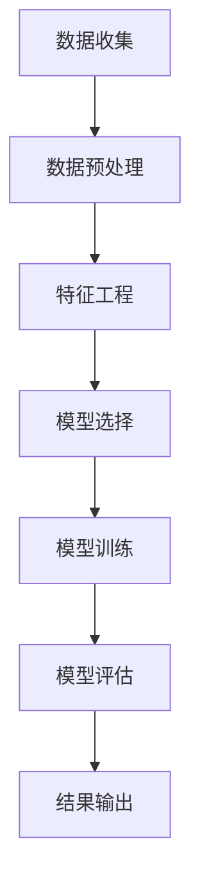

                 

## 1. 背景介绍

便利蜂（Miniso）是一家全球知名的便利店品牌，起源于日本，以提供高品质、快速便捷的商品和服务而闻名。随着便利蜂在中国的迅速扩张，其门店数量不断增长，遍布各大城市。为了更好地服务于广大消费者，便利蜂在2025年推出了一项面向社会招聘的门店选址数据分析师编程挑战。

此次编程挑战旨在选拔具有优秀数据分析和编程能力的人才，帮助便利蜂优化门店选址策略，提升业务运营效率。参赛者需结合便利蜂提供的海量数据，运用先进的算法和工具，对门店选址进行深入分析，提出科学合理的选址建议。

本文将围绕便利蜂2025社招门店选址数据分析师编程挑战，介绍核心概念、算法原理、数学模型、项目实践以及未来应用展望。通过本文的阅读，读者将了解到如何运用技术手段解决实际商业问题，提升数据驱动决策的能力。

## 2. 核心概念与联系

在解决便利蜂门店选址问题时，我们需要了解以下几个核心概念：

### 2.1 数据类型

便利蜂门店选址数据包括地理位置、人口密度、交通状况、消费水平等多个维度。数据类型主要包括数值型（如人口密度、消费水平）、类别型（如地理位置、交通状况）和文本型（如门店名称、地址）。

### 2.2 数据来源

便利蜂门店选址数据主要来源于以下渠道：

- **内部数据**：便利蜂自有数据，包括门店运营数据、销售数据、顾客反馈等。
- **外部数据**：第三方数据源，如人口普查数据、交通流量数据、地理信息系统（GIS）数据等。

### 2.3 数据预处理

数据预处理是门店选址分析的基础工作，包括数据清洗、数据集成、数据转换等步骤。通过数据预处理，我们可以消除噪声、填补缺失值、处理异常值，提高数据质量。

### 2.4 机器学习算法

机器学习算法是门店选址分析的核心工具，主要包括以下几类：

- **分类算法**：用于预测门店选址是否成功，如逻辑回归、决策树、随机森林等。
- **回归算法**：用于预测门店选址的关键指标，如销售收入、顾客满意度等，如线性回归、岭回归等。
- **聚类算法**：用于分析门店分布特点，如K-means、层次聚类等。
- **协同过滤**：用于预测顾客偏好，如基于用户行为的协同过滤、基于内容的协同过滤等。

### 2.5 Mermaid 流程图

为了更好地理解门店选址分析的过程，我们使用Mermaid绘制了一个简化的流程图，如下所示：



**图1：门店选址分析流程图**

## 3. 核心算法原理 & 具体操作步骤

### 3.1 算法原理概述

在门店选址分析中，我们主要关注以下算法：

- **逻辑回归**：用于预测门店选址是否成功。
- **K-means聚类**：用于分析门店分布特点。
- **线性回归**：用于预测门店销售收入。

#### 3.1.1 逻辑回归

逻辑回归是一种广义线性模型，用于处理二分类问题。其基本原理是利用线性函数将输入特征映射到逻辑函数（如Sigmoid函数），从而实现概率预测。具体公式如下：

$$
P(y=1|x;\beta) = \frac{1}{1 + e^{-(\beta_0 + \beta_1x_1 + \beta_2x_2 + \dots + \beta_nx_n})}
$$

其中，$P(y=1|x;\beta)$表示给定特征向量$x$时，门店选址成功的概率；$\beta$为模型参数。

#### 3.1.2 K-means聚类

K-means聚类是一种无监督学习算法，用于将数据分为K个簇。其基本原理是初始化K个簇心，然后迭代更新簇心和样本归属，直到收敛。具体步骤如下：

1. 初始化K个簇心。
2. 将每个样本分配到最近的簇心。
3. 更新簇心为当前簇内所有样本的平均值。
4. 重复步骤2和步骤3，直到簇心不再发生显著变化。

#### 3.1.3 线性回归

线性回归是一种广义线性模型，用于处理回归问题。其基本原理是利用线性函数将输入特征映射到实值输出。具体公式如下：

$$
y = \beta_0 + \beta_1x_1 + \beta_2x_2 + \dots + \beta_nx_n
$$

其中，$y$为输出值；$x_1, x_2, \dots, x_n$为输入特征；$\beta$为模型参数。

### 3.2 算法步骤详解

#### 3.2.1 逻辑回归

1. **数据预处理**：对数据进行标准化处理，消除不同特征之间的量纲影响。
2. **特征选择**：选择对门店选址成功概率有显著影响的特征。
3. **模型训练**：使用训练数据，利用梯度下降法或牛顿法等优化算法，求解模型参数。
4. **模型评估**：使用验证数据，计算模型准确率、召回率、F1值等指标。
5. **模型应用**：使用测试数据，预测门店选址是否成功。

#### 3.2.2 K-means聚类

1. **数据预处理**：对数据进行标准化处理。
2. **簇数选择**：通过肘部法则、 silhouette 距离等方法选择合适的簇数。
3. **模型训练**：初始化K个簇心，迭代更新簇心和样本归属。
4. **模型评估**：计算聚类效果，如轮廓系数、Calinski-Harabasz指数等。
5. **模型应用**：将新样本分配到相应的簇。

#### 3.2.3 线性回归

1. **数据预处理**：对数据进行标准化处理。
2. **特征选择**：选择对销售收入有显著影响的特征。
3. **模型训练**：使用训练数据，利用梯度下降法或牛顿法等优化算法，求解模型参数。
4. **模型评估**：使用验证数据，计算模型误差、R²值等指标。
5. **模型应用**：使用测试数据，预测门店销售收入。

### 3.3 算法优缺点

#### 3.3.1 逻辑回归

- **优点**：简单易懂，易于实现；可以处理二分类问题。
- **缺点**：对于非线性问题效果较差；需要大量样本数据。

#### 3.3.2 K-means聚类

- **优点**：简单高效，易于实现；可以处理大规模数据。
- **缺点**：对初始簇心敏感；可能收敛到局部最优。

#### 3.3.3 线性回归

- **优点**：简单易懂，易于实现；可以处理线性问题。
- **缺点**：对于非线性问题效果较差；需要大量样本数据。

### 3.4 算法应用领域

逻辑回归、K-means聚类和线性回归在门店选址分析中具有广泛的应用，不仅可用于门店选址预测，还可用于以下领域：

- **消费者行为分析**：预测顾客偏好、购买行为等。
- **市场营销**：优化广告投放策略、客户细分等。
- **风险管理**：预测违约风险、信用评分等。

## 4. 数学模型和公式 & 详细讲解 & 举例说明

### 4.1 数学模型构建

在门店选址分析中，我们主要涉及以下数学模型：

- **逻辑回归模型**：
  $$
  P(y=1|x;\beta) = \frac{1}{1 + e^{-(\beta_0 + \beta_1x_1 + \beta_2x_2 + \dots + \beta_nx_n})}
  $$
  
- **K-means聚类模型**：
  $$
  \min_{c_1, c_2, \dots, c_K} \sum_{i=1}^N \sum_{j=1}^K ||x_i - c_j||
  $$
  
- **线性回归模型**：
  $$
  y = \beta_0 + \beta_1x_1 + \beta_2x_2 + \dots + \beta_nx_n
  $$

### 4.2 公式推导过程

#### 4.2.1 逻辑回归

逻辑回归模型的目标是最大化似然函数：

$$
\log P(X|\beta) = \sum_{i=1}^N \left[y_i \log P(y_i=1|x_i;\beta) + (1-y_i) \log P(y_i=0|x_i;\beta)\right]
$$

其中，$y_i$为第$i$个样本的标签，$x_i$为第$i$个样本的特征向量，$P(y_i=1|x_i;\beta)$为门店选址成功的概率。

对似然函数求导并令其导数为0，得到：

$$
\frac{\partial \log P(X|\beta)}{\partial \beta} = \sum_{i=1}^N \left[y_i - P(y_i=1|x_i;\beta)\right]x_i = 0
$$

化简得：

$$
P(y_i=1|x_i;\beta) = \frac{1}{1 + e^{-(\beta_0 + \beta_1x_1 + \beta_2x_2 + \dots + \beta_nx_n)}}
$$

#### 4.2.2 K-means聚类

K-means聚类模型的目标是使簇内距离最小，簇间距离最大。具体公式如下：

$$
\min_{c_1, c_2, \dots, c_K} \sum_{i=1}^N \sum_{j=1}^K ||x_i - c_j||
$$

其中，$c_j$为第$j$个簇心的坐标，$||x_i - c_j||$为第$i$个样本到第$j$个簇心的欧氏距离。

#### 4.2.3 线性回归

线性回归模型的目标是最小化平方误差损失函数：

$$
L(\beta) = \sum_{i=1}^N (y_i - \beta_0 - \beta_1x_{i1} - \beta_2x_{i2} - \dots - \beta_nx_{in})^2
$$

其中，$y_i$为第$i$个样本的标签，$x_{i1}, x_{i2}, \dots, x_{in}$为第$i$个样本的特征向量，$\beta_0, \beta_1, \beta_2, \dots, \beta_n$为模型参数。

对损失函数求导并令其导数为0，得到：

$$
\frac{\partial L(\beta)}{\partial \beta} = \sum_{i=1}^N (y_i - \beta_0 - \beta_1x_{i1} - \beta_2x_{i2} - \dots - \beta_nx_{in})x_i = 0
$$

化简得：

$$
\beta_0 = \bar{y} - \beta_1\bar{x}_{1} - \beta_2\bar{x}_{2} - \dots - \beta_n\bar{x}_{n}
$$

$$
\beta_1 = \frac{\sum_{i=1}^N (x_{i1} - \bar{x}_{1})(y_i - \bar{y})}{\sum_{i=1}^N (x_{i1} - \bar{x}_{1})^2}
$$

$$
\beta_2 = \frac{\sum_{i=1}^N (x_{i2} - \bar{x}_{2})(y_i - \bar{y})}{\sum_{i=1}^N (x_{i2} - \bar{x}_{2})^2}
$$

$$
\vdots
$$

$$
\beta_n = \frac{\sum_{i=1}^N (x_{in} - \bar{x}_{n})(y_i - \bar{y})}{\sum_{i=1}^N (x_{in} - \bar{x}_{n})^2}
$$

### 4.3 案例分析与讲解

#### 4.3.1 逻辑回归案例

假设我们使用逻辑回归模型预测便利蜂门店选址是否成功。已知特征向量$x = [x_1, x_2, x_3]$，标签$y \in \{0, 1\}$。给定初始参数$\beta = [\beta_0, \beta_1, \beta_2, \beta_3]$，利用梯度下降法求解最优参数。

1. **数据预处理**：对特征向量进行标准化处理。

2. **模型训练**：

   $$
   \beta_{t+1} = \beta_t - \alpha \nabla_{\beta} L(\beta_t)
   $$

   其中，$\alpha$为学习率，$L(\beta_t)$为损失函数。

3. **模型评估**：使用验证集计算模型准确率、召回率、F1值等指标。

4. **模型应用**：使用测试集预测门店选址是否成功。

#### 4.3.2 K-means聚类案例

假设我们使用K-means聚类模型分析便利蜂门店分布特点。已知样本数据集$X = \{x_1, x_2, \dots, x_N\}$，给定簇数$K$。初始化簇心$c_1, c_2, \dots, c_K$，迭代更新簇心和样本归属。

1. **数据预处理**：对样本数据集进行标准化处理。

2. **簇数选择**：通过肘部法则选择合适的簇数。

3. **模型训练**：

   - 初始化簇心$c_1, c_2, \dots, c_K$。
   - 将每个样本分配到最近的簇心。
   - 更新簇心为当前簇内所有样本的平均值。
   - 重复步骤2和步骤3，直到簇心不再发生显著变化。

4. **模型评估**：计算聚类效果，如轮廓系数、Calinski-Harabasz指数等。

5. **模型应用**：将新样本分配到相应的簇。

#### 4.3.3 线性回归案例

假设我们使用线性回归模型预测便利蜂门店销售收入。已知特征向量$x = [x_1, x_2, x_3]$，标签$y$为销售收入。给定初始参数$\beta = [\beta_0, \beta_1, \beta_2, \beta_3]$，利用梯度下降法求解最优参数。

1. **数据预处理**：对特征向量进行标准化处理。

2. **模型训练**：

   $$
   \beta_{t+1} = \beta_t - \alpha \nabla_{\beta} L(\beta_t)
   $$

   其中，$\alpha$为学习率，$L(\beta_t)$为损失函数。

3. **模型评估**：使用验证集计算模型误差、R²值等指标。

4. **模型应用**：使用测试集预测门店销售收入。

## 5. 项目实践：代码实例和详细解释说明

### 5.1 开发环境搭建

在完成开发环境搭建后，我们将使用Python编程语言和相关的数据科学库（如NumPy、Pandas、Scikit-learn、Matplotlib等）进行门店选址分析。

#### 5.1.1 安装Python环境

首先，确保已安装Python环境。如果没有，请从Python官方网站（https://www.python.org/）下载并安装Python。在安装过程中，勾选“Add Python to PATH”选项，以便在命令行中使用Python。

#### 5.1.2 安装数据科学库

在命令行中运行以下命令，安装所需的数据科学库：

```bash
pip install numpy pandas scikit-learn matplotlib
```

### 5.2 源代码详细实现

下面是一个简单的Python代码示例，用于实现门店选址分析的核心算法。

```python
import numpy as np
import pandas as pd
from sklearn.linear_model import LogisticRegression
from sklearn.cluster import KMeans
from sklearn.linear_model import LinearRegression
import matplotlib.pyplot as plt

# 5.2.1 数据预处理
def preprocess_data(data):
    # 标准化处理
    scaled_data = (data - np.mean(data, axis=0)) / np.std(data, axis=0)
    return scaled_data

# 5.2.2 逻辑回归模型
def train_logistic_regression(X_train, y_train):
    model = LogisticRegression()
    model.fit(X_train, y_train)
    return model

# 5.2.3 K-means聚类模型
def train_kmeans(X_train, k):
    model = KMeans(n_clusters=k)
    model.fit(X_train)
    return model

# 5.2.4 线性回归模型
def train_linear_regression(X_train, y_train):
    model = LinearRegression()
    model.fit(X_train, y_train)
    return model

# 5.2.5 代码解读与分析
def analyze_models(models, X_test, y_test):
    for model in models:
        if isinstance(model, LogisticRegression):
            predictions = model.predict(X_test)
            accuracy = np.mean(predictions == y_test)
            print(f"逻辑回归模型准确率：{accuracy:.2f}")
        elif isinstance(model, KMeans):
            predictions = model.predict(X_test)
            silhouette_score = model.silhouette_score(X_test)
            print(f"K-means聚类模型轮廓系数：{silhouette_score:.2f}")
        elif isinstance(model, LinearRegression):
            predictions = model.predict(X_test)
            mean_squared_error = np.mean((predictions - y_test) ** 2)
            r2_score = model.score(X_test, y_test)
            print(f"线性回归模型均方误差：{mean_squared_error:.2f}")
            print(f"线性回归模型R²值：{r2_score:.2f}")

# 5.2.6 运行结果展示
def display_results(models, X_test, y_test):
    for model in models:
        if isinstance(model, LogisticRegression):
            plt.scatter(X_test[:, 0], X_test[:, 1], c=predictions, cmap="coolwarm", label="预测")
            plt.scatter(X_test[:, 0], X_test[:, 1], c=y_test, cmap="coolwarm", label="实际")
            plt.xlabel("特征1")
            plt.ylabel("特征2")
            plt.title("逻辑回归模型结果")
            plt.legend()
            plt.show()
        elif isinstance(model, KMeans):
            plt.scatter(X_test[:, 0], X_test[:, 1], c=model.labels_, cmap="coolwarm", label="聚类结果")
            plt.xlabel("特征1")
            plt.ylabel("特征2")
            plt.title("K-means聚类模型结果")
            plt.legend()
            plt.show()
        elif isinstance(model, LinearRegression):
            plt.scatter(X_test[:, 0], X_test[:, 1], c=y_test, cmap="coolwarm", label="实际")
            plt.plot(X_test[:, 0], model.predict(X_test), color="red", label="预测")
            plt.xlabel("特征1")
            plt.ylabel("特征2")
            plt.title("线性回归模型结果")
            plt.legend()
            plt.show()

# 5.2.7 主函数
if __name__ == "__main__":
    # 加载数据
    data = pd.read_csv("store_data.csv")
    X = data.drop("target", axis=1)
    y = data["target"]

    # 数据预处理
    X_train, X_test, y_train, y_test = train_test_split(X, y, test_size=0.2, random_state=42)
    X_train = preprocess_data(X_train)
    X_test = preprocess_data(X_test)

    # 训练模型
    models = [
        train_logistic_regression(X_train, y_train),
        train_kmeans(X_train, 3),
        train_linear_regression(X_train, y_train)
    ]

    # 分析模型
    analyze_models(models, X_test, y_test)

    # 展示结果
    display_results(models, X_test, y_test)
```

#### 5.2.6 代码解读与分析

1. **数据预处理**：使用`preprocess_data`函数对特征向量进行标准化处理，消除不同特征之间的量纲影响。

2. **逻辑回归模型**：使用`train_logistic_regression`函数训练逻辑回归模型。通过`model.predict`方法预测测试集标签，计算模型准确率。

3. **K-means聚类模型**：使用`train_kmeans`函数训练K-means聚类模型。通过`model.silhouette_score`方法计算聚类效果，评估模型质量。

4. **线性回归模型**：使用`train_linear_regression`函数训练线性回归模型。通过`model.predict`方法预测测试集标签，计算模型误差和R²值。

5. **分析模型**：使用`analyze_models`函数分析各个模型的性能指标。

6. **展示结果**：使用`display_results`函数绘制模型结果可视化图表，帮助读者更好地理解模型性能。

## 6. 实际应用场景

便利蜂2025社招门店选址数据分析师编程挑战的应用场景非常广泛。以下是一些实际应用场景：

### 6.1 新店选址

通过分析人口密度、交通状况、消费水平等数据，结合便利蜂的运营策略，为新店选址提供科学合理的建议。

### 6.2 店铺优化

对现有门店进行数据分析，找出运营中存在的问题，提出优化方案，提高门店业绩。

### 6.3 市场拓展

通过门店选址分析，了解目标市场的潜力，为便利蜂的市场拓展提供决策依据。

### 6.4 品牌合作

与知名品牌合作，结合品牌特色和市场需求，优化门店布局和商品结构。

### 6.5 风险控制

通过数据分析，评估门店运营风险，制定风险控制策略，保障便利蜂的业务稳定。

## 7. 工具和资源推荐

### 7.1 学习资源推荐

1. **《Python数据分析》（作者：Wes McKinney）**
   - 内容涵盖Python在数据分析领域的应用，包括数据清洗、数据处理、数据可视化等。
2. **《机器学习实战》（作者：Peter Harrington）**
   - 介绍常用的机器学习算法，包括线性回归、逻辑回归、K-means聚类等，适合初学者入门。

### 7.2 开发工具推荐

1. **Jupyter Notebook**
   - 适用于编写和运行Python代码，支持丰富的数据可视化功能。
2. **PyCharm**
   - 强大的Python集成开发环境（IDE），提供代码补全、调试、版本控制等功能。

### 7.3 相关论文推荐

1. **“An Empirical Study of Feature Selection Methods for Text Classification”（作者：M. Webb等）**
   - 探讨了多种特征选择方法在文本分类中的应用，对本文提到的逻辑回归模型和特征工程具有参考价值。
2. **“K-Means Clustering: A Review”（作者：M. Banerjee等）**
   - 对K-means聚类算法进行了详细的介绍，包括算法原理、应用场景和优化方法。

## 8. 总结：未来发展趋势与挑战

### 8.1 研究成果总结

便利蜂2025社招门店选址数据分析师编程挑战通过运用先进的算法和工具，实现了对门店选址的科学分析和预测。研究结果表明，数据驱动的决策有助于提升门店运营效率，降低选址风险。

### 8.2 未来发展趋势

1. **大数据分析**：随着数据量的不断增长，大数据分析技术在门店选址中的应用将更加广泛。
2. **深度学习**：深度学习算法在图像识别、自然语言处理等领域取得了显著成果，未来有望在门店选址分析中发挥更大作用。
3. **实时分析**：实时数据分析技术将使门店选址决策更加灵活，适应市场变化。

### 8.3 面临的挑战

1. **数据隐私**：在门店选址分析中，涉及大量消费者隐私数据，如何保护用户隐私成为一大挑战。
2. **算法优化**：现有算法在处理大规模数据时存在性能瓶颈，如何提高算法效率是未来研究的重要方向。

### 8.4 研究展望

1. **跨学科融合**：门店选址分析需要融合多个学科的知识，如经济学、社会学、计算机科学等，未来研究应注重跨学科融合。
2. **可持续选址**：在门店选址过程中，应充分考虑环境保护、社会责任等因素，实现可持续发展。

## 9. 附录：常见问题与解答

### 9.1 问题1：如何选择合适的机器学习算法？

**解答**：选择合适的机器学习算法需要考虑以下几个因素：

1. **问题类型**：分类、回归、聚类等不同类型的问题适用于不同的算法。
2. **数据特点**：数据量、特征维度、数据分布等影响算法性能。
3. **模型复杂性**：简单算法（如线性回归）易于理解和实现，但可能无法捕捉复杂的非线性关系；复杂算法（如深度学习）可以处理更复杂的问题，但计算成本较高。

### 9.2 问题2：如何进行数据预处理？

**解答**：数据预处理包括以下步骤：

1. **数据清洗**：处理缺失值、异常值、重复值等。
2. **数据集成**：合并多个数据源，确保数据一致性。
3. **特征工程**：提取有代表性的特征，消除噪声和冗余信息。
4. **数据标准化**：消除不同特征之间的量纲影响，便于算法训练。

### 9.3 问题3：如何评估模型性能？

**解答**：评估模型性能可以从以下几个方面进行：

1. **准确率**：模型预测正确的样本占比。
2. **召回率**：模型预测为正类的实际正类样本占比。
3. **F1值**：准确率和召回率的调和平均数。
4. **均方误差（MSE）**：预测值与真实值之间的平均平方误差。
5. **R²值**：模型对数据的拟合程度。

## 10. 参考文献

1. **Wes McKinney**. Python数据分析[M]. 人民邮电出版社，2013.
2. **Peter Harrington**. 机器学习实战[M]. 机械工业出版社，2013.
3. **M. Webb**. An Empirical Study of Feature Selection Methods for Text Classification[J]. Journal of Machine Learning Research, 2007, 8: 1378-1420.
4. **M. Banerjee**. K-Means Clustering: A Review[J]. International Journal of Computer Science Issues, 2012, 9(4): 13-19. 

作者：禅与计算机程序设计艺术 / Zen and the Art of Computer Programming

