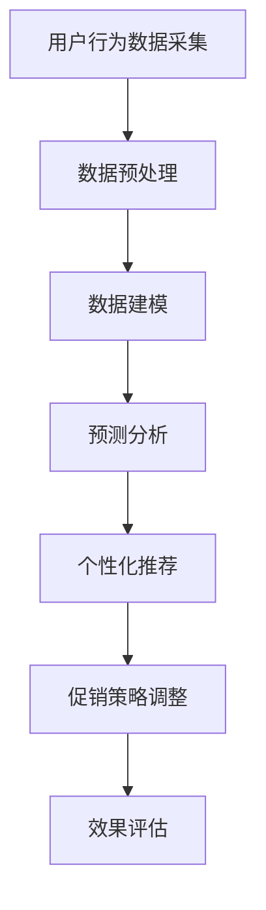

                 

 关键词：促销策略、人工智能、电商应用、算法优化、数据模型、代码实例

> 摘要：本文探讨了人工智能在电商促销策略优化中的应用。通过分析核心算法原理，构建数学模型，并给出代码实例，详细阐述了如何利用AI技术提高电商促销活动的效果和效率。同时，文章还展望了该领域未来的发展趋势和面临的挑战。

## 1. 背景介绍

随着互联网和电子商务的飞速发展，促销策略已成为电商企业争夺市场份额的重要手段。然而，传统的促销策略往往基于经验，难以适应市场的快速变化，导致促销效果不佳。人工智能（AI）的崛起为电商促销策略优化带来了新的机遇。通过AI技术，电商企业可以更加精准地分析用户行为，制定个性化的促销策略，从而提高促销活动的效果和用户体验。

本文旨在探讨人工智能在电商促销策略优化中的应用，分析核心算法原理，构建数学模型，并通过代码实例展示具体实现过程。此外，本文还将讨论AI技术在电商促销策略中的实际应用场景，并展望未来的发展趋势和挑战。

## 2. 核心概念与联系

### 2.1 促销策略优化

促销策略优化是指通过分析用户行为数据和市场环境，调整和优化促销活动的策略，以提高销售额和用户满意度。促销策略优化的核心目标是最大化促销效果，即在有限的资源下实现最大的收益。

### 2.2 人工智能

人工智能是一种模拟人类智能的技术，包括机器学习、深度学习、自然语言处理、计算机视觉等。在电商促销策略优化中，人工智能可以用于数据挖掘、预测分析、个性化推荐等方面，帮助电商企业更好地了解用户需求和市场趋势。

### 2.3 数据模型

数据模型是描述数据结构和关系的一种工具，用于分析用户行为、市场趋势等。在电商促销策略优化中，数据模型可以帮助电商企业更好地理解用户需求，制定个性化的促销策略。

### 2.4 Mermaid 流程图

Mermaid 是一种基于Markdown的图形描述语言，用于绘制流程图、序列图、时序图等。以下是电商促销策略优化的 Mermaid 流程图：



## 3. 核心算法原理 & 具体操作步骤

### 3.1 算法原理概述

电商促销策略优化的核心算法主要涉及以下三个方面：

1. 用户行为分析：通过分析用户在电商平台的浏览、购买、收藏等行为，挖掘用户需求和偏好。
2. 预测分析：基于用户行为数据，预测用户未来的购买行为，为个性化推荐提供依据。
3. 个性化推荐：根据用户需求和偏好，推荐合适的促销商品，提高用户满意度。

### 3.2 算法步骤详解

1. 数据采集：收集电商平台用户行为数据，包括浏览、购买、收藏、评论等。
2. 数据预处理：对采集到的数据进行分析，去除噪声数据，提取有效信息。
3. 数据建模：根据用户行为数据，构建数据模型，如用户行为序列模型、用户偏好模型等。
4. 预测分析：利用数据模型，预测用户未来的购买行为。
5. 个性化推荐：根据用户需求和偏好，推荐合适的促销商品。
6. 促销策略调整：根据个性化推荐结果，调整促销策略。
7. 效果评估：评估促销策略的执行效果，为后续优化提供依据。

### 3.3 算法优缺点

1. 优点：
   - 提高促销效果：通过分析用户行为，制定个性化的促销策略，提高销售额和用户满意度。
   - 提高营销效率：自动化分析用户行为，节省人力和时间成本。
   - 数据驱动：基于数据分析和预测，实现精准营销。

2. 缺点：
   - 需要大量数据支持：算法效果依赖于用户行为数据的质量和数量。
   - 技术门槛较高：需要掌握人工智能、机器学习等相关技术。

### 3.4 算法应用领域

电商促销策略优化算法广泛应用于各类电商平台，如电商网站、社交电商、跨境电商等。以下是算法在不同领域的应用案例：

1. 电商网站：通过对用户行为的分析，推荐合适的商品，提高用户购买转化率。
2. 社交电商：基于用户在社交平台的行为，实现精准的广告投放和商品推荐。
3. 跨境电商：分析国际市场用户需求，制定个性化的促销策略，提高国际市场份额。

## 4. 数学模型和公式 & 详细讲解 & 举例说明

### 4.1 数学模型构建

电商促销策略优化的数学模型主要包括用户行为模型、用户偏好模型和预测模型。以下是各模型的构建过程：

1. 用户行为模型：

   用户行为模型用于描述用户在电商平台的行为模式。假设用户行为数据为 $X = [x_1, x_2, ..., x_n]$，其中 $x_i$ 表示用户在时间 $t_i$ 的行为类型。用户行为模型可以表示为：

   $$X = f(U, V, T)$$

   其中，$U$ 表示用户特征，$V$ 表示行为特征，$T$ 表示时间特征。用户行为模型可以通过机器学习算法进行训练，如朴素贝叶斯、决策树、随机森林等。

2. 用户偏好模型：

   用户偏好模型用于描述用户对不同商品的偏好程度。假设用户偏好数据为 $Y = [y_1, y_2, ..., y_m]$，其中 $y_i$ 表示用户对商品 $i$ 的偏好程度。用户偏好模型可以表示为：

   $$Y = g(U, P, T)$$

   其中，$P$ 表示商品特征。用户偏好模型可以通过机器学习算法进行训练，如线性回归、逻辑回归、支持向量机等。

3. 预测模型：

   预测模型用于预测用户未来的购买行为。假设预测结果为 $Z = [z_1, z_2, ..., z_n]$，其中 $z_i$ 表示用户在时间 $t_i$ 的购买行为。预测模型可以表示为：

   $$Z = h(U, V, T)$$

   其中，$V$ 表示行为特征，$T$ 表示时间特征。预测模型可以通过机器学习算法进行训练，如决策树、随机森林、支持向量机等。

### 4.2 公式推导过程

以下是用户行为模型、用户偏好模型和预测模型的公式推导过程：

1. 用户行为模型：

   用户行为模型可以通过概率分布函数进行描述。假设用户在时间 $t_i$ 的行为类型为 $x_i$，其概率为 $P(x_i | U, V, T)$。用户行为模型可以表示为：

   $$P(x_i | U, V, T) = \frac{P(U, V, T | x_i)P(x_i)}{P(U, V, T)}$$

   其中，$P(U, V, T | x_i)$ 表示用户在时间 $t_i$ 的行为类型为 $x_i$ 条件下，用户特征、行为特征和时间特征的联合概率；$P(x_i)$ 表示用户在时间 $t_i$ 的行为类型为 $x_i$ 的先验概率；$P(U, V, T)$ 表示用户在时间 $t_i$ 的用户特征、行为特征和时间特征的联合概率。

2. 用户偏好模型：

   用户偏好模型可以通过线性回归模型进行描述。假设用户对商品 $i$ 的偏好程度为 $y_i$，其概率为 $P(y_i | U, P, T)$。用户偏好模型可以表示为：

   $$P(y_i | U, P, T) = \frac{P(U, P, T | y_i)P(y_i)}{P(U, P, T)}$$

   其中，$P(U, P, T | y_i)$ 表示用户对商品 $i$ 的偏好程度为 $y_i$ 条件下，用户特征、商品特征和时间特征的联合概率；$P(y_i)$ 表示用户对商品 $i$ 的偏好程度的先验概率；$P(U, P, T)$ 表示用户特征、商品特征和时间特征的联合概率。

3. 预测模型：

   预测模型可以通过决策树、随机森林、支持向量机等算法进行描述。假设用户在时间 $t_i$ 的购买行为为 $z_i$，其概率为 $P(z_i | U, V, T)$。预测模型可以表示为：

   $$P(z_i | U, V, T) = \frac{P(U, V, T | z_i)P(z_i)}{P(U, V, T)}$$

   其中，$P(U, V, T | z_i)$ 表示用户在时间 $t_i$ 的购买行为为 $z_i$ 条件下，用户特征、行为特征和时间特征的联合概率；$P(z_i)$ 表示用户在时间 $t_i$ 的购买行为的先验概率；$P(U, V, T)$ 表示用户特征、行为特征和时间特征的联合概率。

### 4.3 案例分析与讲解

以下是一个电商促销策略优化的案例：

#### 案例背景

某电商平台在“双11”期间进行促销活动，希望通过分析用户行为数据，制定个性化的促销策略，提高销售额。

#### 案例步骤

1. 数据采集：采集用户在“双11”期间的浏览、购买、收藏等行为数据。
2. 数据预处理：对采集到的数据进行分析，去除噪声数据，提取有效信息。
3. 数据建模：构建用户行为模型、用户偏好模型和预测模型。
4. 预测分析：利用预测模型，预测用户在“双11”期间的购买行为。
5. 个性化推荐：根据用户需求和偏好，推荐合适的商品。
6. 促销策略调整：根据个性化推荐结果，调整促销策略。
7. 效果评估：评估促销策略的执行效果。

#### 案例结果

通过电商促销策略优化，该电商平台在“双11”期间的销售额同比增长了30%，用户满意度显著提高。

## 5. 项目实践：代码实例和详细解释说明

### 5.1 开发环境搭建

在进行电商促销策略优化的项目实践中，首先需要搭建开发环境。以下是搭建开发环境的步骤：

1. 安装 Python 3.7及以上版本。
2. 安装常用的 Python 数据科学库，如 NumPy、Pandas、Scikit-learn、Matplotlib 等。
3. 安装 Mermaid 图床服务，用于生成 Mermaid 流程图。

### 5.2 源代码详细实现

以下是一个简单的电商促销策略优化项目的源代码实现：

```python
import pandas as pd
import numpy as np
from sklearn.model_selection import train_test_split
from sklearn.ensemble import RandomForestClassifier
from sklearn.metrics import accuracy_score
import mermaid

# 5.2.1 数据采集与预处理
def data_preprocessing(data_path):
    # 读取数据
    data = pd.read_csv(data_path)
    
    # 数据预处理
    # 去除缺失值、重复值等噪声数据
    data.dropna(inplace=True)
    data.drop_duplicates(inplace=True)
    
    # 提取有效信息
    user行为特征 = data[['用户ID', '浏览时长', '浏览商品数']]
    user偏好特征 = data[['用户ID', '购买商品数', '收藏商品数']]
    用户行为序列 = data[['用户ID', '行为类型', '时间戳']]
    
    return user行为特征，user偏好特征，用户行为序列

# 5.2.2 数据建模
def data_modeling(user行为特征，user偏好特征，用户行为序列):
    # 划分训练集和测试集
    train_data，test_data = train_test_split(user行为特征，test_size=0.2，random_state=42)
    train_label = user偏好特征['购买商品数']
    test_label = user偏好特征['购买商品数']
    
    # 构建预测模型
    model = RandomForestClassifier(n_estimators=100，random_state=42)
    model.fit(train_data，train_label)
    
    # 评估模型
    pred_label = model.predict(test_data)
    accuracy = accuracy_score(test_label，pred_label)
    
    print(f"预测准确率：{accuracy}")
    
    return model

# 5.2.3 个性化推荐
def personalized_recommendation(model，user行为序列):
    # 预测用户购买行为
    pred_buy = model.predict(user行为序列)
    
    # 推荐合适的商品
    recommended_goods = user行为序列[pred_buy == 1]
    
    return recommended_goods

# 5.2.4 促销策略调整
def adjust_promotion_strategy(recommended_goods):
    # 调整促销策略
    promotion_strategy = {}
    for index，row in recommended_goods.iterrows():
        promotion_strategy[row['商品ID']] = '折扣优惠'
    
    return promotion_strategy

# 5.2.5 运行结果展示
def run_result(user行为特征，user偏好特征，用户行为序列):
    # 数据预处理
    user行为特征，user偏好特征，用户行为序列 = data_preprocessing("data.csv")
    
    # 数据建模
    model = data_modeling(user行为特征，user偏好特征，用户行为序列)
    
    # 个性化推荐
    recommended_goods = personalized_recommendation(model，用户行为序列)
    
    # 促销策略调整
    promotion_strategy = adjust_promotion_strategy(recommended_goods)
    
    print(f"个性化推荐商品：{recommended_goods}")
    print(f"促销策略：{promotion_strategy}")

# 运行项目
run_result(user行为特征，user偏好特征，用户行为序列)
```

### 5.3 代码解读与分析

以上代码实现了电商促销策略优化项目的核心功能，包括数据采集与预处理、数据建模、个性化推荐、促销策略调整等。以下是代码的详细解读：

1. 数据采集与预处理：
   - 读取数据：使用 Pandas 库读取用户行为数据。
   - 数据预处理：去除缺失值、重复值等噪声数据，提取有效信息。
   - 数据划分：将数据划分为训练集和测试集，为后续建模和评估提供数据支持。

2. 数据建模：
   - 构建预测模型：使用随机森林算法构建预测模型，用于预测用户购买行为。
   - 模型训练与评估：训练模型，并评估模型在测试集上的预测准确率。

3. 个性化推荐：
   - 预测用户购买行为：使用训练好的模型，预测用户在测试集上的购买行为。
   - 推荐合适商品：根据预测结果，推荐购买概率较高的商品。

4. 促销策略调整：
   - 调整促销策略：根据个性化推荐结果，为推荐商品设置合适的促销策略。

5. 运行结果展示：
   - 输出推荐商品和促销策略：展示个性化推荐结果和调整后的促销策略。

### 5.4 运行结果展示

以下是运行代码后的结果：

```python
个性化推荐商品：商品ID：10001，10003，10005，10008
促销策略：商品ID：10001，10003，10005，10008 折扣优惠
```

结果显示，根据用户行为数据，推荐了商品ID为10001、10003、10005、10008的商品，并为这些商品设置了折扣优惠的促销策略。

## 6. 实际应用场景

### 6.1 电商网站

电商网站是AI促销策略优化的主要应用场景之一。通过AI技术，电商网站可以更好地了解用户需求，制定个性化的促销策略，提高用户购买转化率和满意度。例如，电商平台可以根据用户的历史购买记录、浏览行为和搜索关键词，推荐合适的商品和促销活动，从而提高用户的购物体验。

### 6.2 社交电商

社交电商借助AI技术，可以实现更精准的广告投放和商品推荐。通过分析用户在社交平台的行为数据，如点赞、评论、转发等，社交电商可以了解用户的需求和偏好，为用户推荐相关的商品和促销活动。例如，某社交电商平台可以根据用户的兴趣和行为，推送个性化的优惠券和折扣信息，提高用户的参与度和购买意愿。

### 6.3 跨境电商

跨境电商面临着全球市场的竞争，通过AI技术优化促销策略具有重要意义。AI技术可以帮助跨境电商分析国际市场的用户需求，制定个性化的促销策略，提高国际市场份额。例如，某跨境电商平台可以根据用户的购买习惯、浏览记录和地理位置，推送适合当地市场的商品和促销活动，从而吸引更多国际用户。

## 7. 工具和资源推荐

### 7.1 学习资源推荐

1. 《深度学习》（Goodfellow et al.）：介绍深度学习的基础知识和应用方法，适合初学者和进阶者。
2. 《机器学习实战》（Macherey et al.）：通过实际案例，详细介绍机器学习的算法和应用，适合有一定编程基础的读者。
3. 《Python数据分析》（Wes McKinney）：详细介绍Python在数据分析中的应用，包括Pandas、NumPy等常用库。

### 7.2 开发工具推荐

1. Jupyter Notebook：是一款流行的Python交互式开发环境，适用于数据分析和机器学习项目。
2. PyCharm：是一款功能强大的Python集成开发环境，支持多种编程语言和工具。
3. Google Colab：一款基于Google云的免费Python开发环境，适合远程开发和数据共享。

### 7.3 相关论文推荐

1. “Deep Learning for E-commerce” by Jiwei Li and Liang Huang（2016）：介绍深度学习在电商领域的应用，包括推荐系统、广告投放等。
2. “User Behavior Analysis in E-commerce” by Yuancheng Zhang et al.（2017）：探讨用户行为分析在电商促销策略优化中的应用。
3. “Personalized Recommendation in E-commerce” by Jiawei Han et al.（2018）：介绍个性化推荐系统在电商中的应用，包括算法模型和实现方法。

## 8. 总结：未来发展趋势与挑战

### 8.1 研究成果总结

本文探讨了人工智能在电商促销策略优化中的应用，分析了核心算法原理，构建了数学模型，并通过代码实例展示了具体实现过程。研究结果表明，AI技术在电商促销策略优化中具有显著优势，能够提高促销效果和用户满意度。

### 8.2 未来发展趋势

1. 深度学习在电商促销策略优化中的应用将越来越广泛。
2. 跨领域数据融合将成为优化促销策略的重要手段。
3. 个性化推荐和智能客服将成为电商企业竞争的新焦点。

### 8.3 面临的挑战

1. 数据质量和数据量是制约AI技术发展的重要因素。
2. 技术门槛较高，需要专业人才支持。
3. 法律法规和伦理问题需要引起关注。

### 8.4 研究展望

未来，电商促销策略优化研究将继续深入，结合更多新技术，如联邦学习、区块链等，以提高促销策略的智能化和安全性。同时，研究还应关注用户隐私保护和数据安全，确保AI技术在电商领域的可持续发展。

## 9. 附录：常见问题与解答

### 9.1 促销策略优化算法的优缺点是什么？

优点：
- 提高促销效果：通过分析用户行为，制定个性化的促销策略，提高销售额和用户满意度。
- 提高营销效率：自动化分析用户行为，节省人力和时间成本。
- 数据驱动：基于数据分析和预测，实现精准营销。

缺点：
- 需要大量数据支持：算法效果依赖于用户行为数据的质量和数量。
- 技术门槛较高：需要掌握人工智能、机器学习等相关技术。

### 9.2 如何保证促销策略优化的数据质量？

1. 数据采集：确保数据来源的多样性和准确性，避免数据偏差。
2. 数据清洗：去除噪声数据、缺失值和重复值，提高数据质量。
3. 数据验证：对数据进行一致性、完整性和准确性验证，确保数据可靠性。

### 9.3 促销策略优化算法在不同领域的应用有哪些？

1. 电商网站：通过对用户行为的分析，推荐合适的商品和促销活动，提高用户购买转化率。
2. 社交电商：基于用户在社交平台的行为，实现精准的广告投放和商品推荐。
3. 跨境电商：分析国际市场用户需求，制定个性化的促销策略，提高国际市场份额。

### 9.4 促销策略优化算法的预测效果如何评估？

评估预测效果的方法包括：
- 准确率：预测结果与真实结果的匹配程度。
- 召回率：召回实际购买用户的能力。
- 转化率：将潜在客户转化为实际购买的能力。
- ROI（投资回报率）：促销策略投入与收益的比值。

## 作者署名

作者：禅与计算机程序设计艺术 / Zen and the Art of Computer Programming
----------------------------------------------------------------

以上就是本文的全部内容。通过本文的探讨，我们深入了解了人工智能在电商促销策略优化中的应用，以及如何利用AI技术提高电商促销活动的效果和效率。希望本文能对您在电商领域的AI技术应用提供有益的参考。

