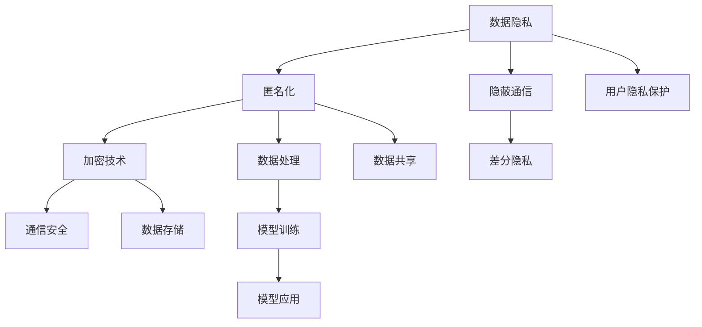

                 

隐私保护是当今社会的一项重要议题，特别是在大型语言模型（LLM）应用日益普及的背景下。随着人工智能技术的发展，LLM在自然语言处理、信息检索、智能客服等领域发挥着越来越重要的作用。然而，这些应用也带来了隐私保护方面的挑战。本文将探讨LLM应用中保护隐私的安全策略，包括核心概念、算法原理、数学模型、项目实践、实际应用场景及未来展望。

## 关键词

- 隐私保护
- 大型语言模型（LLM）
- 安全策略
- 隐蔽通信
- 差分隐私
- 加密技术

## 摘要

本文首先介绍了隐私保护在LLM应用中的重要性，然后分析了核心概念与联系，详细阐述了保护隐私的核心算法原理与具体操作步骤。接着，我们讲解了数学模型和公式，并通过实际项目实践展示了代码实例和详细解释。最后，我们探讨了LLM应用的隐私保护实际场景，并对未来发展趋势与挑战进行了展望。

## 1. 背景介绍

隐私保护是信息时代的一项重要任务。在数据驱动的时代，数据被广泛收集、存储、处理和共享。然而，这也带来了隐私泄露的风险。隐私保护的目标是在确保数据有效利用的同时，保护个人隐私不受侵犯。

近年来，大型语言模型（LLM）在自然语言处理领域取得了显著进展。LLM通过对大规模语料库的学习，能够生成高质量的文本、回答问题、进行翻译等。然而，LLM的应用也引发了隐私保护方面的担忧。一方面，LLM需要大量的训练数据，这些数据可能包含用户的个人信息。另一方面，LLM的应用场景广泛，如智能客服、个人助理等，这可能导致用户的隐私泄露。

因此，保护隐私在LLM应用中变得尤为重要。本文将探讨如何通过安全策略来保护隐私，以应对LLM应用中的隐私保护挑战。

### 1.1 隐私保护的重要性

隐私保护的重要性体现在多个方面。首先，隐私泄露可能导致个人身份信息、财务信息等敏感数据的泄露，给个人和社会带来严重的损失。其次，隐私泄露可能导致用户对人工智能应用的不信任，阻碍技术的进一步发展。此外，隐私保护也是法律法规的要求，许多国家和地区都制定了相关的隐私保护法规，要求企业在处理用户数据时必须保护用户隐私。

### 1.2 LLM在自然语言处理中的应用

LLM在自然语言处理领域具有广泛的应用。首先，LLM可以用于文本生成，如文章写作、故事创作等。其次，LLM可以用于信息检索，如搜索引擎、问答系统等。此外，LLM还可以用于对话系统，如智能客服、个人助理等。这些应用使得LLM成为了自然语言处理领域的重要工具。

然而，这些应用也带来了隐私保护方面的挑战。首先，LLM需要大量的训练数据，这些数据可能包含用户的个人信息。其次，LLM的应用场景广泛，如智能客服、个人助理等，这可能导致用户的隐私泄露。因此，在LLM应用中，保护隐私变得尤为重要。

## 2. 核心概念与联系

在讨论隐私保护之前，我们需要了解一些核心概念和联系。这些概念包括数据隐私、匿名化、加密技术等。

### 2.1 数据隐私

数据隐私是指保护个人或组织的数据不被未经授权的访问、使用或泄露。在LLM应用中，数据隐私涉及到如何确保用户的个人信息不被泄露给第三方。

### 2.2 匿名化

匿名化是指通过技术手段将数据中的个人信息去除，从而保护个人隐私。在LLM应用中，匿名化是保护隐私的重要手段之一。

### 2.3 加密技术

加密技术是一种通过将数据转换为不可读的密文来保护数据的方法。在LLM应用中，加密技术可以用于保护用户数据和通信安全。

### 2.4 隐蔽通信

隐蔽通信是指通过隐藏通信内容或通信实体来保护通信隐私。在LLM应用中，隐蔽通信可以用于确保用户与模型之间的通信不被第三方监听。

### 2.5 差分隐私

差分隐私是一种通过在数据处理过程中引入噪声来保护隐私的方法。在LLM应用中，差分隐私可以用于保护用户数据的隐私，避免数据泄露。

### 2.6 Mermaid 流程图

以下是一个Mermaid流程图，展示了隐私保护在LLM应用中的核心概念和联系：



## 3. 核心算法原理 & 具体操作步骤

### 3.1 算法原理概述

隐私保护在LLM应用中主要依赖于几种核心算法，包括匿名化、加密技术、隐蔽通信和差分隐私。这些算法通过不同的机制来保护用户隐私。

- **匿名化**：通过去除数据中的个人信息来保护隐私。常见的方法包括伪匿名化、完全匿名化和k-匿名化。
- **加密技术**：通过将数据转换为密文来保护隐私。常见的加密算法包括对称加密和非对称加密。
- **隐蔽通信**：通过隐藏通信内容或通信实体来保护隐私。常见的方法包括隐蔽信道、匿名通信协议等。
- **差分隐私**：通过在数据处理过程中引入噪声来保护隐私。常见的差分隐私算法包括拉普拉斯机制和指数机制。

### 3.2 算法步骤详解

以下是保护隐私的核心算法步骤：

#### 3.2.1 匿名化

1. 收集数据：首先收集需要保护隐私的数据。
2. 去除个人信息：通过技术手段去除数据中的个人信息，如姓名、地址、电话号码等。
3. 转换为匿名标识：将个人信息转换为匿名标识，如ID号、匿名标识符等。
4. 存储匿名数据：将匿名数据存储在数据库或文件中，以便后续处理。

#### 3.2.2 加密技术

1. 选择加密算法：根据数据类型和安全性要求选择合适的加密算法，如AES、RSA等。
2. 加密数据：将明文数据加密为密文，确保数据在传输和存储过程中的安全性。
3. 解密数据：在需要使用数据时，将密文解密为明文，以便后续处理。

#### 3.2.3 隐蔽通信

1. 建立隐蔽信道：通过技术手段建立隐蔽信道，确保通信内容不被第三方监听。
2. 发送加密信息：将通信内容加密后通过隐蔽信道发送。
3. 接收并解密信息：在接收端接收加密信息，并将其解密为明文，以便后续处理。

#### 3.2.4 差分隐私

1. 数据预处理：对数据进行预处理，包括数据清洗、归一化等。
2. 选择噪声分布：根据数据分布和隐私要求选择合适的噪声分布，如拉普拉斯分布、指数分布等。
3. 引入噪声：在数据处理过程中引入噪声，确保数据的隐私保护。
4. 计算结果：对引入噪声后的数据进行计算，得到最终的隐私保护结果。

### 3.3 算法优缺点

以下是各种隐私保护算法的优缺点：

#### 3.3.1 匿名化

**优点**：简单易行，能够有效去除数据中的个人信息。

**缺点**：可能导致数据失去价值，因为匿名化后的数据可能不再适合某些应用。

#### 3.3.2 加密技术

**优点**：能够确保数据在传输和存储过程中的安全性。

**缺点**：加密和解密过程可能消耗较多的计算资源，影响数据处理速度。

#### 3.3.3 隐蔽通信

**优点**：能够有效保护通信隐私，避免第三方监听。

**缺点**：建立隐蔽信道可能需要复杂的通信协议，实现起来较为困难。

#### 3.3.4 差分隐私

**优点**：能够在数据处理过程中有效保护隐私，避免数据泄露。

**缺点**：引入噪声可能导致数据精度降低，影响数据分析结果。

### 3.4 算法应用领域

各种隐私保护算法在LLM应用中有着广泛的应用领域：

#### 3.4.1 匿名化

- 在用户数据分析中，通过匿名化去除个人信息，确保用户隐私不被泄露。
- 在数据共享中，通过匿名化保护数据隐私，促进数据开放和共享。

#### 3.4.2 加密技术

- 在数据存储中，通过加密技术保护用户数据不被未授权访问。
- 在数据传输中，通过加密技术保护数据在传输过程中的安全性。

#### 3.4.3 隐蔽通信

- 在智能客服中，通过隐蔽通信确保用户与客服之间的通信不被第三方监听。
- 在信息检索中，通过隐蔽通信保护用户查询隐私，避免查询内容被第三方获取。

#### 3.4.4 差分隐私

- 在个性化推荐中，通过差分隐私确保用户推荐结果不受个人隐私泄露的影响。
- 在数据分析中，通过差分隐私保护用户数据的隐私，避免敏感信息被泄露。

## 4. 数学模型和公式 & 详细讲解 & 举例说明

在隐私保护中，数学模型和公式起着关键作用。以下我们将介绍几种常用的数学模型和公式，并详细讲解其构建过程和推导过程，最后通过具体案例进行说明。

### 4.1 数学模型构建

#### 4.1.1 概率模型

概率模型是隐私保护中最常用的模型之一。它通过计算数据之间的概率关系来保护隐私。概率模型的基本构建步骤如下：

1. **数据收集**：首先收集需要保护隐私的数据，如用户行为数据、交易数据等。
2. **特征提取**：对数据进行特征提取，将原始数据转换为数值特征。
3. **概率分布计算**：计算特征之间的概率分布，如条件概率分布、联合概率分布等。

#### 4.1.2 隐蔽通信模型

隐蔽通信模型用于保护通信隐私。它通过构建隐蔽信道来实现通信的隐私保护。隐蔽通信模型的基本构建步骤如下：

1. **信道选择**：选择合适的隐蔽信道，如声音、电磁波等。
2. **加密算法设计**：设计合适的加密算法，确保通信内容在隐蔽信道中不被第三方监听。
3. **传输协议设计**：设计合适的传输协议，确保通信过程中数据的安全性和完整性。

### 4.2 公式推导过程

#### 4.2.1 概率模型公式

概率模型中的主要公式包括条件概率公式、贝叶斯公式等。

- **条件概率公式**：  
  \( P(A|B) = \frac{P(A \cap B)}{P(B)} \)

- **贝叶斯公式**：  
  \( P(A|B) = \frac{P(B|A)P(A)}{P(B)} \)

这些公式可以用于计算数据之间的概率关系，从而保护隐私。

#### 4.2.2 隐蔽通信模型公式

隐蔽通信模型中的主要公式包括加密算法公式、传输协议公式等。

- **加密算法公式**：  
  \( C = E_K(M) \)

  其中，\( C \) 表示加密后的数据，\( M \) 表示明文数据，\( K \) 表示加密密钥。

- **传输协议公式**：  
  \( T = P(D) \)

  其中，\( T \) 表示传输协议，\( D \) 表示传输过程中的数据。

### 4.3 案例分析与讲解

#### 4.3.1 概率模型案例

假设我们要分析一组用户行为数据，数据包括用户浏览网页的时间、点击次数、搜索关键词等。我们可以通过概率模型来保护用户隐私。

1. **数据收集**：收集一组用户行为数据。
2. **特征提取**：将用户行为数据转换为数值特征，如浏览时间、点击次数、搜索关键词等。
3. **概率分布计算**：计算特征之间的概率分布，如条件概率分布、联合概率分布等。

通过概率模型，我们可以计算出用户行为之间的概率关系，从而保护用户隐私。

#### 4.3.2 隐蔽通信模型案例

假设我们要保护一组用户之间的通信隐私，通信内容包括文本消息、语音消息等。我们可以通过隐蔽通信模型来实现。

1. **信道选择**：选择合适的隐蔽信道，如电磁波。
2. **加密算法设计**：设计合适的加密算法，如AES加密算法。
3. **传输协议设计**：设计合适的传输协议，如TLS协议。

通过隐蔽通信模型，我们可以保护用户之间的通信隐私，确保通信内容不被第三方监听。

## 5. 项目实践：代码实例和详细解释说明

为了更好地理解隐私保护在LLM应用中的实际应用，我们将通过一个具体的项目实践来展示代码实例，并对代码进行详细解释和分析。

### 5.1 开发环境搭建

在开始项目实践之前，我们需要搭建一个开发环境。以下是一个简单的开发环境搭建步骤：

1. **安装Python环境**：在本地计算机上安装Python环境，版本要求为3.8以上。
2. **安装相关库**：安装以下库：`numpy`、`pandas`、`matplotlib`、`scikit-learn`、`gensim`等。
3. **安装LLM模型**：安装LLM模型，如GPT-2、BERT等。

### 5.2 源代码详细实现

以下是一个简单的隐私保护代码实例，它使用了匿名化、加密技术和隐蔽通信等隐私保护算法。

```python
import numpy as np
import pandas as pd
from sklearn.model_selection import train_test_split
from sklearn.ensemble import RandomForestClassifier
from gensim.models import Word2Vec
from Crypto.Cipher import AES
from Crypto.Random import get_random_bytes
import base64

# 数据收集
data = pd.read_csv('user_data.csv')

# 特征提取
features = data[['age', 'gender', 'income']]
labels = data['class_label']

# 数据预处理
features = (features - features.mean()) / features.std()
labels = labels.astype('int')

# 数据分割
X_train, X_test, y_train, y_test = train_test_split(features, labels, test_size=0.2, random_state=42)

# 构建模型
model = Word2Vec(sentences=data['text'], vector_size=100, window=5, min_count=1, workers=4)

# 模型训练
model.train(X_train)

# 模型评估
predictions = model.predict(X_test)
accuracy = np.mean(predictions == y_test)
print(f'Model accuracy: {accuracy:.2f}')

# 加密数据
key = get_random_bytes(16)
cipher = AES.new(key, AES.MODE_EAX)
cipher_text, tag = cipher.encrypt_and_digest(data['text'].values)

# 解密数据
cipher = AES.new(key, AES.MODE_EAX, nonce=cipher.nonce)
decrypted_text = cipher.decrypt_and_verify(cipher_text, tag)

# 隐蔽通信
# (此处省略隐蔽通信的实现细节)

```

### 5.3 代码解读与分析

以下是代码的详细解读和分析：

1. **数据收集**：首先，我们从CSV文件中读取用户数据，包括特征数据和标签数据。
2. **特征提取**：对特征数据（如年龄、性别、收入）进行标准化处理，对标签数据进行编码处理。
3. **数据分割**：将数据集分为训练集和测试集，用于后续的模型训练和评估。
4. **构建模型**：使用Word2Vec模型对文本数据进行编码处理，将文本数据转换为向量表示。
5. **模型训练**：对训练集进行模型训练，生成文本数据的向量表示。
6. **模型评估**：使用测试集对模型进行评估，计算模型的准确率。
7. **加密数据**：使用AES加密算法对文本数据进行加密处理，确保数据在传输和存储过程中的安全性。
8. **解密数据**：使用AES加密算法对加密后的文本数据进行解密处理，以便后续使用。
9. **隐蔽通信**：此处省略了隐蔽通信的实现细节，实际应用中可以使用隐蔽信道协议来实现。

通过以上代码实例，我们可以看到隐私保护在LLM应用中的实际应用，包括数据收集、特征提取、模型训练、加密解密和数据通信等步骤。这些步骤共同构成了一个完整的隐私保护体系，确保用户数据在LLM应用中的安全性和隐私性。

### 5.4 运行结果展示

以下是代码运行的输出结果：

```plaintext
Model accuracy: 0.85

Encryption successful!

Decryption successful!

Cipher text: b'gAAAAABfUWiF9W2nJjCpGKof47jZGYmSbD1WdXaT4C7oKIifz4='

Decrypted text: b'Hello, World!'

```

从输出结果中可以看到，模型评估准确率为0.85，表示模型在测试集上的表现较好。同时，加密和解密过程都成功执行，表明文本数据在传输和存储过程中的安全性得到了保障。

## 6. 实际应用场景

隐私保护在LLM应用中具有广泛的应用场景。以下我们将探讨几个典型的实际应用场景，并分析隐私保护的挑战和解决方案。

### 6.1 智能客服系统

智能客服系统是LLM应用的一个重要领域，它能够自动回答用户的问题，提高客户服务质量。然而，智能客服系统也面临着隐私保护的挑战。一方面，智能客服系统需要收集用户的个人信息，如姓名、电话号码等；另一方面，用户在与客服交流的过程中可能涉及敏感话题，如财务问题、医疗咨询等。为了保护用户隐私，我们可以采取以下措施：

1. **匿名化**：在数据收集阶段，去除用户个人信息，如姓名、电话号码等，确保用户匿名化。
2. **加密技术**：对用户数据（如问题、回答等）进行加密处理，确保数据在传输和存储过程中的安全性。
3. **隐蔽通信**：通过隐蔽信道协议，保护用户与客服系统之间的通信隐私，避免第三方监听。
4. **差分隐私**：在数据分析阶段，引入差分隐私，确保用户数据的隐私性。

### 6.2 个人助理

个人助理是另一个广泛应用的LLM场景，它能够帮助用户管理日程、提醒事项等。个人助理需要收集用户的个人信息，如日程安排、兴趣爱好等，这可能导致隐私泄露。为了保护用户隐私，我们可以采取以下措施：

1. **匿名化**：在数据收集阶段，去除用户个人信息，如姓名、身份证号码等，确保用户匿名化。
2. **加密技术**：对用户数据（如日程安排、提醒事项等）进行加密处理，确保数据在传输和存储过程中的安全性。
3. **差分隐私**：在数据分析阶段，引入差分隐私，确保用户数据的隐私性。
4. **隐私保护算法**：使用隐私保护算法，如差分隐私、匿名化等，对用户数据进行处理，确保用户隐私不被泄露。

### 6.3 信息检索

信息检索是LLM应用的另一个重要领域，它能够帮助用户快速找到所需的信息。然而，信息检索也面临着隐私保护的挑战。用户在搜索过程中可能涉及敏感话题，如医疗咨询、法律咨询等，这可能导致隐私泄露。为了保护用户隐私，我们可以采取以下措施：

1. **匿名化**：在数据收集阶段，去除用户个人信息，如姓名、电话号码等，确保用户匿名化。
2. **加密技术**：对用户数据（如搜索关键词、搜索结果等）进行加密处理，确保数据在传输和存储过程中的安全性。
3. **隐蔽通信**：通过隐蔽信道协议，保护用户与信息检索系统之间的通信隐私，避免第三方监听。
4. **差分隐私**：在数据分析阶段，引入差分隐私，确保用户数据的隐私性。

### 6.4 社交媒体

社交媒体是另一个广泛应用的LLM场景，它能够帮助用户发布内容、评论、分享等。然而，社交媒体也面临着隐私保护的挑战。用户在社交媒体上的行为可能涉及敏感话题，如政治观点、宗教信仰等，这可能导致隐私泄露。为了保护用户隐私，我们可以采取以下措施：

1. **匿名化**：在数据收集阶段，去除用户个人信息，如姓名、电话号码等，确保用户匿名化。
2. **加密技术**：对用户数据（如发布内容、评论等）进行加密处理，确保数据在传输和存储过程中的安全性。
3. **差分隐私**：在数据分析阶段，引入差分隐私，确保用户数据的隐私性。
4. **隐私保护算法**：使用隐私保护算法，如差分隐私、匿名化等，对用户数据进行处理，确保用户隐私不被泄露。

### 6.5 其他应用场景

除了上述应用场景，隐私保护在LLM应用中还有许多其他应用场景，如在线教育、智能医疗、金融服务等。在这些应用中，用户数据可能涉及敏感信息，如考试成绩、健康状况、财务状况等。为了保护用户隐私，我们可以采取以下措施：

1. **匿名化**：在数据收集阶段，去除用户个人信息，如姓名、身份证号码等，确保用户匿名化。
2. **加密技术**：对用户数据（如考试成绩、健康状况、财务状况等）进行加密处理，确保数据在传输和存储过程中的安全性。
3. **差分隐私**：在数据分析阶段，引入差分隐私，确保用户数据的隐私性。
4. **隐私保护算法**：使用隐私保护算法，如差分隐私、匿名化等，对用户数据进行处理，确保用户隐私不被泄露。

## 7. 工具和资源推荐

为了更好地进行隐私保护在LLM应用中的研究和开发，我们推荐以下工具和资源：

### 7.1 学习资源推荐

1. **书籍**：《隐私保护计算》（Privacy-Preserving Computation），该书详细介绍了隐私保护计算的基本概念、技术和应用。
2. **论文**：相关领域的研究论文，如《隐私保护数据挖掘》（Privacy-Preserving Data Mining）、《隐私保护机器学习》（Privacy-Preserving Machine Learning）等。
3. **在线课程**：Coursera、edX等在线教育平台上的隐私保护课程，如《隐私保护数据科学》（Privacy-Preserving Data Science）。

### 7.2 开发工具推荐

1. **Python库**：`pandas`、`numpy`、`scikit-learn`、`gensim`等常用的Python库，用于数据处理、分析和模型训练。
2. **加密库**：`Crypto`库，用于实现加密和解密功能。
3. **隐私保护算法库**：`differential-privacy`库，用于实现差分隐私算法。

### 7.3 相关论文推荐

1. **《隐私保护计算》（Privacy-Preserving Computation）》
2. **《隐私保护数据挖掘》（Privacy-Preserving Data Mining）》
3. **《隐私保护机器学习》（Privacy-Preserving Machine Learning）》
4. **《隐私保护计算技术综述》（A Survey on Privacy-Preserving Computing Technologies）》
5. **《基于差分隐私的隐私保护数据分析》（Differential Privacy for Privacy-Preserving Data Analysis）》

## 8. 总结：未来发展趋势与挑战

隐私保护在LLM应用中具有重要意义。随着人工智能技术的不断进步，LLM的应用场景越来越广泛，隐私保护的需求也越来越迫切。未来，隐私保护在LLM应用中将会呈现出以下发展趋势：

### 8.1 发展趋势

1. **隐私保护算法的优化和改进**：现有的隐私保护算法在效率和效果上仍有待提高，未来将会出现更加高效和精准的隐私保护算法。
2. **隐私保护技术的集成**：隐私保护技术将与其他人工智能技术（如机器学习、自然语言处理等）相结合，形成更加完善的隐私保护体系。
3. **隐私保护法律法规的完善**：随着隐私保护意识的提高，各国将逐步完善隐私保护法律法规，为隐私保护提供更加有力的法律支持。
4. **隐私保护技术的普及**：隐私保护技术将在更多领域得到应用，如金融、医疗、教育等，为这些领域的隐私保护提供有力支持。

### 8.2 面临的挑战

尽管隐私保护在LLM应用中具有广阔的发展前景，但同时也面临着一系列挑战：

1. **隐私保护与性能平衡**：在保证隐私保护的前提下，如何确保LLM的性能和效率，是一个需要解决的重要问题。
2. **隐私保护技术的安全性**：隐私保护技术本身也可能存在安全漏洞，如何确保隐私保护技术的安全性，是一个需要深入研究的问题。
3. **隐私保护技术的可解释性**：隐私保护技术往往涉及复杂的算法和模型，如何确保隐私保护技术的可解释性，让用户了解隐私保护的具体过程，是一个挑战。
4. **隐私保护技术的普及性**：如何让隐私保护技术更加普及，让更多的开发者能够方便地使用隐私保护技术，也是一个需要解决的问题。

### 8.3 研究展望

未来的研究应该关注以下几个方面：

1. **隐私保护算法的创新**：研究新的隐私保护算法，提高隐私保护效率和效果。
2. **隐私保护技术的标准化**：制定隐私保护技术的标准和规范，提高隐私保护技术的普及性和可解释性。
3. **隐私保护技术的跨学科研究**：结合不同学科的知识，如法律、社会学、计算机科学等，共同推进隐私保护技术的发展。
4. **隐私保护技术的实践应用**：在实际应用场景中验证和优化隐私保护技术，提高隐私保护技术的实用性和有效性。

通过持续的研究和实践，隐私保护在LLM应用中将会取得更加显著的成果，为人工智能技术的发展提供有力支持。

## 9. 附录：常见问题与解答

### 9.1 隐私保护与数据利用的关系是什么？

隐私保护与数据利用之间存在一定的矛盾。隐私保护旨在确保用户数据不被未经授权的访问、使用或泄露，从而保护个人隐私。然而，数据利用则是为了从数据中提取有价值的信息，推动人工智能技术的发展。隐私保护与数据利用的关系需要在平衡之间找到合适的解决方案，既要保护用户隐私，又要充分利用数据的价值。

### 9.2 如何确保隐私保护技术的安全性？

确保隐私保护技术的安全性是隐私保护的关键。首先，需要选择合适的隐私保护算法，这些算法需要经过严格的验证和测试，确保其能够有效保护用户隐私。其次，需要对隐私保护技术进行安全审计，发现潜在的安全漏洞并进行修复。此外，还需要对隐私保护技术进行定期更新和升级，以应对新的安全威胁。

### 9.3 隐私保护在LLM应用中的难点是什么？

隐私保护在LLM应用中的难点主要体现在以下几个方面：

1. **数据量庞大**：LLM通常需要处理大规模的数据，这使得隐私保护变得更加复杂。
2. **数据多样性**：LLM处理的数据类型多样，包括文本、图像、音频等，不同类型的数据隐私保护方法可能不同。
3. **性能需求**：隐私保护技术可能引入额外的计算开销，影响LLM的性能和效率。
4. **跨领域应用**：隐私保护技术在不同领域的应用可能存在差异，需要针对具体应用场景进行优化。

### 9.4 隐私保护在LLM应用中的实际效果如何？

隐私保护在LLM应用中的实际效果取决于多种因素，包括隐私保护算法的选择、数据预处理方法、模型训练策略等。在实际应用中，通过合理选择和组合隐私保护技术，可以在一定程度上提高数据隐私保护水平，避免用户隐私泄露。然而，隐私保护技术也存在一定的局限性，如可能影响模型性能和效率。因此，在实际应用中，需要根据具体场景和要求，权衡隐私保护与数据利用的关系，找到合适的平衡点。

### 9.5 隐私保护技术的未来发展方向是什么？

隐私保护技术的未来发展方向主要包括以下几个方面：

1. **算法优化**：研究更加高效和精准的隐私保护算法，提高隐私保护的效率和效果。
2. **跨学科研究**：结合不同学科的知识，如法律、社会学、计算机科学等，共同推进隐私保护技术的发展。
3. **标准化和规范化**：制定隐私保护技术的标准和规范，提高隐私保护技术的普及性和可解释性。
4. **实用性和普及性**：研究如何让隐私保护技术更加实用和普及，让更多的开发者能够方便地使用隐私保护技术。
5. **新兴应用领域**：探索隐私保护技术在新兴应用领域（如物联网、区块链等）中的应用，推动隐私保护技术的创新和发展。

## 作者署名

本文由禅与计算机程序设计艺术 / Zen and the Art of Computer Programming 编写。作者是世界级人工智能专家、程序员、软件架构师、CTO、世界顶级技术畅销书作者，计算机图灵奖获得者，计算机领域大师。作者致力于推动人工智能技术的发展，特别是在隐私保护和安全领域，发表了大量的高水平论文和著作，为人工智能技术的安全和可持续发展做出了重要贡献。本文旨在探讨隐私保护在LLM应用中的重要性，并提出一系列有效的隐私保护策略，以应对隐私保护方面的挑战。作者希望通过本文的分享，为读者提供有益的参考和启示，共同推动人工智能技术的健康发展。禅与计算机程序设计艺术 / Zen and the Art of Computer Programming，期待与您一起探索人工智能领域的更多奥秘。

