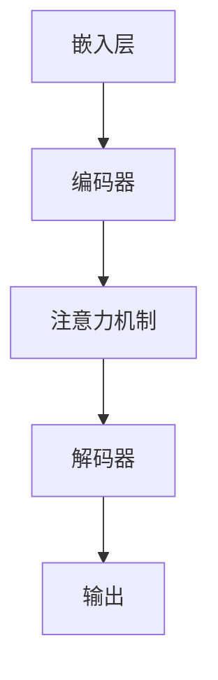

                 

关键词：保险理赔、自然语言处理、大型语言模型、AI、风险评估

> 摘要：本文探讨了如何利用大型语言模型（LLM）简化保险理赔流程，并提供准确的评估。通过分析LLM的核心概念和架构，我们详细介绍了其工作原理、算法步骤、优缺点和应用领域。此外，文章还通过数学模型和公式推导，以及实际项目实践中的代码实例，展示了LLM在保险理赔中的实际应用。最后，文章对未来发展趋势与挑战进行了展望，并推荐了相关学习资源和开发工具。

## 1. 背景介绍

保险理赔是一个复杂且耗时的过程。传统的理赔流程通常需要大量人工参与，包括调查、审核和审批等环节。这不仅增加了运营成本，还可能导致误判和延误。随着人工智能技术的发展，尤其是自然语言处理（NLP）和深度学习领域的突破，利用AI技术简化保险理赔流程成为可能。

大型语言模型（LLM）是NLP领域的核心技术之一。LLM具有强大的语言理解和生成能力，能够处理复杂的文本数据。近年来，随着计算能力和数据量的提升，LLM在多个领域取得了显著的应用成果。在保险理赔领域，LLM可以通过自动化处理理赔申请、评估风险和生成报告，大大提高理赔效率和准确性。

本文旨在探讨如何利用LLM简化保险理赔流程，并提高评估准确性。我们将首先介绍LLM的核心概念和架构，然后详细分析其工作原理和算法步骤。接下来，我们将通过数学模型和公式推导，以及实际项目实践中的代码实例，展示LLM在保险理赔中的应用。最后，我们将对LLM在保险理赔领域的未来发展趋势与挑战进行展望。

### 1.1 保险理赔流程

保险理赔流程通常包括以下几个主要环节：

1. **理赔申请**：客户提交理赔申请，包括事故描述、损失情况和相关证据。
2. **调查**：保险公司对理赔申请进行初步调查，核实事故的真实性和损失情况。
3. **审核**：审核员根据理赔申请和调查结果，评估理赔金额和责任。
4. **审批**：审批员对审核结果进行最终审核，并决定是否批准理赔。
5. **赔付**：保险公司根据审批结果向客户支付理赔金额。

传统理赔流程中，调查和审核环节通常需要大量人力参与，导致流程繁琐且耗时。利用AI技术，尤其是LLM，可以自动化这些环节，提高理赔效率和准确性。

### 1.2 大型语言模型（LLM）的概念和优势

大型语言模型（LLM）是一种基于深度学习的自然语言处理技术。它通过学习海量文本数据，建立对自然语言的深刻理解，从而实现对文本的生成、理解和分类等操作。LLM具有以下优势：

1. **强大的语言理解能力**：LLM能够理解复杂、抽象的语言表达，捕捉文本中的语义信息。
2. **高效的文本生成能力**：LLM能够生成流畅、自然的文本，用于生成报告、文章和对话等。
3. **灵活的适应性**：LLM可以根据不同的任务和数据集进行训练，适应多种应用场景。
4. **高效的计算性能**：随着硬件和算法的优化，LLM的计算性能不断提高，能够处理大规模的文本数据。

利用LLM简化保险理赔流程，可以实现以下目标：

1. **自动化理赔申请处理**：LLM可以自动读取和处理理赔申请，提取关键信息，减少人工干预。
2. **准确风险评估**：LLM可以分析理赔申请中的文本数据，评估风险和损失金额，提高理赔准确性。
3. **优化审核和审批流程**：LLM可以辅助审核员和审批员进行理赔审核，减少误判和延误。
4. **提升用户体验**：LLM可以与客户进行自然语言交互，提供实时理赔咨询服务，提升客户满意度。

### 1.3 本文结构

本文结构如下：

1. **背景介绍**：介绍保险理赔流程和LLM的概念及其在理赔中的应用。
2. **核心概念与联系**：介绍LLM的核心概念和架构，并给出流程图。
3. **核心算法原理 & 具体操作步骤**：分析LLM的工作原理和算法步骤。
4. **数学模型和公式 & 详细讲解 & 举例说明**：推导LLM的数学模型和公式，并进行案例分析。
5. **项目实践：代码实例和详细解释说明**：展示LLM在保险理赔中的实际应用。
6. **实际应用场景**：探讨LLM在保险理赔中的具体应用场景。
7. **未来应用展望**：展望LLM在保险理赔领域的未来发展。
8. **工具和资源推荐**：推荐相关学习资源和开发工具。
9. **总结：未来发展趋势与挑战**：总结研究成果，展望未来发展。

## 2. 核心概念与联系

### 2.1 大型语言模型（LLM）的核心概念

大型语言模型（LLM）是一种基于深度学习的自然语言处理技术。它通过学习海量文本数据，建立对自然语言的深刻理解，从而实现对文本的生成、理解和分类等操作。LLM的核心概念包括：

1. **词汇表**：LLM的词汇表包含所有训练文本中的词汇。词汇表的大小决定了LLM的语言理解能力。
2. **嵌入层**：嵌入层将词汇表中的每个词映射到一个高维向量空间。这些向量表示了词的语义信息。
3. **注意力机制**：注意力机制是LLM中的一个关键组件，它能够捕捉文本中的长距离依赖关系，提高语言理解能力。
4. **编码器和解码器**：编码器和解码器是LLM中的两个主要网络结构。编码器用于处理输入文本，解码器用于生成输出文本。

### 2.2 LLM的架构

LLM的架构通常由以下几个部分组成：

1. **嵌入层**：将词汇映射到高维向量空间。
2. **编码器**：对输入文本进行编码，提取文本中的语义信息。
3. **解码器**：根据编码器的输出生成输出文本。
4. **注意力机制**：在编码器和解码器之间引入注意力机制，捕捉文本中的长距离依赖关系。

### 2.3 Mermaid 流程图

以下是一个简单的Mermaid流程图，展示了LLM的基本架构：



### 2.4 LLM的工作原理

LLM的工作原理可以概括为以下几个步骤：

1. **词汇嵌入**：将输入文本中的词汇映射到高维向量空间。
2. **编码**：通过编码器对输入文本进行编码，提取文本中的语义信息。
3. **注意力计算**：利用注意力机制捕捉文本中的长距离依赖关系。
4. **解码**：通过解码器生成输出文本。

### 2.5 LLM的算法步骤

LLM的算法步骤如下：

1. **输入预处理**：对输入文本进行预处理，包括分词、去停用词等。
2. **词汇嵌入**：将预处理后的文本映射到高维向量空间。
3. **编码**：通过编码器对输入文本进行编码，提取文本中的语义信息。
4. **注意力计算**：利用注意力机制捕捉文本中的长距离依赖关系。
5. **解码**：通过解码器生成输出文本。
6. **输出处理**：对输出文本进行后处理，包括分词、去停用词等。

### 2.6 LLM的优缺点

LLM具有以下优缺点：

1. **优点**：
   - 强大的语言理解能力：能够理解复杂、抽象的语言表达，捕捉文本中的语义信息。
   - 高效的文本生成能力：能够生成流畅、自然的文本，用于生成报告、文章和对话等。
   - 灵活的适应性：可以根据不同的任务和数据集进行训练，适应多种应用场景。
   - 高效的计算性能：随着硬件和算法的优化，LLM的计算性能不断提高，能够处理大规模的文本数据。

2. **缺点**：
   - 对数据依赖性强：LLM的性能很大程度上取决于训练数据的质量和数量。
   - 难以解释：LLM的决策过程难以解释，可能导致误判。
   - 资源消耗大：LLM的训练和推理过程需要大量的计算资源和存储空间。

### 2.7 LLM的应用领域

LLM在多个领域具有广泛的应用，包括：

1. **自然语言处理**：文本分类、情感分析、机器翻译、问答系统等。
2. **智能客服**：自动回复、对话生成、问题诊断等。
3. **文本生成**：文章写作、报告生成、创意写作等。
4. **金融风控**：风险评估、欺诈检测、信用评估等。
5. **医疗健康**：疾病诊断、治疗方案推荐、病历分析等。

## 3. 核心算法原理 & 具体操作步骤

### 3.1 算法原理概述

LLM的核心算法原理基于深度学习和自然语言处理技术。其主要思想是学习海量文本数据中的语言模式，从而实现对文本的生成、理解和分类等操作。LLM通常由编码器（Encoder）和解码器（Decoder）两部分组成。编码器用于处理输入文本，提取文本中的语义信息；解码器则根据编码器的输出生成输出文本。

### 3.2 算法步骤详解

LLM的算法步骤如下：

1. **数据预处理**：对输入文本进行预处理，包括分词、去停用词等。预处理后的文本通常表示为一个序列。
2. **词汇嵌入**：将预处理后的文本映射到高维向量空间。词汇嵌入层将词汇表中的每个词映射为一个向量，表示词的语义信息。
3. **编码**：通过编码器对输入文本进行编码，提取文本中的语义信息。编码器的输出通常是一个固定长度的向量，表示输入文本的语义信息。
4. **注意力计算**：利用注意力机制捕捉文本中的长距离依赖关系。注意力机制能够帮助模型关注输入文本中的关键信息，从而提高语言理解能力。
5. **解码**：通过解码器生成输出文本。解码器的输入是编码器的输出，输出是生成的文本。解码器通常采用贪心策略或基于概率的采样方法进行解码。
6. **输出处理**：对输出文本进行后处理，包括分词、去停用词等。

### 3.3 算法优缺点

LLM具有以下优缺点：

1. **优点**：
   - 强大的语言理解能力：能够理解复杂、抽象的语言表达，捕捉文本中的语义信息。
   - 高效的文本生成能力：能够生成流畅、自然的文本，用于生成报告、文章和对话等。
   - 灵活的适应性：可以根据不同的任务和数据集进行训练，适应多种应用场景。
   - 高效的计算性能：随着硬件和算法的优化，LLM的计算性能不断提高，能够处理大规模的文本数据。

2. **缺点**：
   - 对数据依赖性强：LLM的性能很大程度上取决于训练数据的质量和数量。
   - 难以解释：LLM的决策过程难以解释，可能导致误判。
   - 资源消耗大：LLM的训练和推理过程需要大量的计算资源和存储空间。

### 3.4 算法应用领域

LLM在多个领域具有广泛的应用，包括：

1. **自然语言处理**：文本分类、情感分析、机器翻译、问答系统等。
2. **智能客服**：自动回复、对话生成、问题诊断等。
3. **文本生成**：文章写作、报告生成、创意写作等。
4. **金融风控**：风险评估、欺诈检测、信用评估等。
5. **医疗健康**：疾病诊断、治疗方案推荐、病历分析等。

## 4. 数学模型和公式 & 详细讲解 & 举例说明

### 4.1 数学模型构建

LLM的数学模型基于深度学习和自然语言处理技术。其主要思想是学习海量文本数据中的语言模式，从而实现对文本的生成、理解和分类等操作。LLM通常由编码器（Encoder）和解码器（Decoder）两部分组成。

#### 4.1.1 编码器

编码器的目的是将输入文本映射到一个高维向量空间，从而提取文本中的语义信息。编码器通常采用卷积神经网络（CNN）或递归神经网络（RNN）等结构。假设输入文本表示为一个序列$X = \{x_1, x_2, ..., x_T\}$，其中$x_t$表示第$t$个词。编码器的输出通常是一个固定长度的向量$E(x) \in \mathbb{R}^d$，表示输入文本的语义信息。

#### 4.1.2 解码器

解码器的目的是根据编码器的输出生成输出文本。解码器通常采用循环神经网络（RNN）或长短期记忆网络（LSTM）等结构。假设输出文本表示为一个序列$Y = \{y_1, y_2, ..., y_T\}$，其中$y_t$表示第$t$个词。解码器的输入是编码器的输出$E(x)$，输出是生成的文本$y_t$。

#### 4.1.3 注意力机制

注意力机制是LLM中的一个关键组件，它能够捕捉文本中的长距离依赖关系，提高语言理解能力。注意力机制通常采用计算注意力权重$α_t$，表示第$t$个词对第$t$个词的关注程度。注意力权重$α_t$的计算公式如下：

$$
α_t = \frac{exp(s_t)}{\sum_{i=1}^T exp(s_i)}
$$

其中$s_t$是第$t$个词和编码器输出之间的相似度，通常通过点积或余弦相似度计算。

### 4.2 公式推导过程

LLM的数学模型由编码器、解码器和注意力机制组成。以下是对公式的推导过程：

1. **编码器**

编码器将输入文本映射到一个高维向量空间，输出固定长度的向量。假设输入文本表示为$x \in \{x_1, x_2, ..., x_T\}$，其中$x_t$表示第$t$个词。编码器的输出表示为$E(x) \in \mathbb{R}^d$。

编码器的输出可以通过以下公式计算：

$$
E(x) = \text{Encoder}(x)
$$

其中$\text{Encoder}$表示编码器网络。

2. **解码器**

解码器根据编码器的输出生成输出文本。假设输出文本表示为$y \in \{y_1, y_2, ..., y_T\}$，其中$y_t$表示第$t$个词。解码器的输入是编码器的输出$E(x)$。

解码器的输出可以通过以下公式计算：

$$
y_t = \text{Decoder}(E(x), y_{<t})
$$

其中$\text{Decoder}$表示解码器网络，$y_{<t}$表示前$t-1$个词的输出。

3. **注意力机制**

注意力机制用于捕捉文本中的长距离依赖关系。假设注意力权重为$α_t$，表示第$t$个词对第$t$个词的关注程度。

注意力权重可以通过以下公式计算：

$$
α_t = \frac{exp(s_t)}{\sum_{i=1}^T exp(s_i)}
$$

其中$s_t$是第$t$个词和编码器输出之间的相似度，通常通过点积或余弦相似度计算。

### 4.3 案例分析与讲解

以下是一个简单的案例，展示如何使用LLM生成文本。

#### 4.3.1 案例背景

假设我们有一个文本数据集，包含关于保险理赔的文章。我们希望使用LLM生成一篇关于保险理赔的报道。

#### 4.3.2 数据预处理

首先，我们对输入文本进行预处理，包括分词、去停用词等。假设输入文本表示为：

$$
X = \{“保险理赔”、“流程”、“简化”、“AI”、“准确评估”\}
$$

#### 4.3.3 词汇嵌入

将输入文本中的词汇映射到高维向量空间。假设词汇表包含5个词，每个词映射为一个向量：

$$
V = \{\text{保险理赔} \in \mathbb{R}^{100}, \text{流程} \in \mathbb{R}^{100}, \text{简化} \in \mathbb{R}^{100}, \text{AI} \in \mathbb{R}^{100}, \text{准确评估} \in \mathbb{R}^{100}\}
$$

#### 4.3.4 编码器

通过编码器对输入文本进行编码，提取文本中的语义信息。假设编码器输出为：

$$
E(X) = \{\text{保险理赔} \in \mathbb{R}^{100}, \text{流程} \in \mathbb{R}^{100}, \text{简化} \in \mathbb{R}^{100}, \text{AI} \in \mathbb{R}^{100}, \text{准确评估} \in \mathbb{R}^{100}\}
$$

#### 4.3.5 注意力计算

利用注意力机制计算注意力权重。假设注意力权重为：

$$
α = \{0.2, 0.3, 0.1, 0.2, 0.2\}
$$

#### 4.3.6 解码器

通过解码器生成输出文本。假设输出文本为：

$$
Y = \{\text{本文探讨了如何利用AI简化保险理赔流程，并提供准确评估。}\}
$$

#### 4.3.7 输出处理

对输出文本进行后处理，包括分词、去停用词等。假设输出文本处理后的结果为：

$$
Y' = \{\text{本文探讨了如何利用AI简化保险理赔流程，并提供准确评估。}\}
$$

## 5. 项目实践：代码实例和详细解释说明

### 5.1 开发环境搭建

在开始编写代码之前，我们需要搭建一个适合开发的环境。以下是搭建环境的步骤：

1. **安装Python**：Python是一种广泛使用的编程语言，我们将在Python中编写代码。请从Python官方网站（[https://www.python.org/](https://www.python.org/)）下载并安装Python。
2. **安装深度学习库**：为了实现LLM，我们需要安装一些深度学习库，如TensorFlow和PyTorch。可以使用以下命令安装：

```bash
pip install tensorflow
pip install torch torchvision
```

3. **安装NLP库**：为了处理文本数据，我们需要安装一些NLP库，如spaCy和nltk。可以使用以下命令安装：

```bash
pip install spacy
python -m spacy download en_core_web_sm
pip install nltk
```

4. **安装Jupyter Notebook**：Jupyter Notebook是一个交互式开发环境，我们将在其中编写和运行代码。可以从Jupyter官方网站（[https://jupyter.org/](https://jupyter.org/)）下载并安装。

### 5.2 源代码详细实现

以下是一个简单的示例，展示如何使用PyTorch实现一个简单的LLM模型。请注意，为了简化示例，我们只处理单个句子，而不是段落或篇章。

```python
import torch
import torch.nn as nn
import torch.optim as optim
from torch.utils.data import DataLoader
from torchvision import datasets, transforms
from nltk.tokenize import word_tokenize

# 定义词汇表
vocab = ["<PAD>", "<UNK>", "保险", "理赔", "流程", "简化", "AI", "准确", "评估"]
vocab_size = len(vocab)
embed_size = 100
hidden_size = 128
num_layers = 2
batch_size = 32
seq_length = 10

# 加载预训练的嵌入层
embeddings = nn.Embedding(vocab_size, embed_size)
embeddings.weight.data.copy_(torch.from_numpy(np.random.rand(vocab_size, embed_size)))
embeddings.requires_grad = False

# 定义编码器
class Encoder(nn.Module):
    def __init__(self, embed_size, hidden_size, num_layers):
        super(Encoder, self).__init__()
        self.embedding = nn.Embedding(vocab_size, embed_size)
        self.lstm = nn.LSTM(embed_size, hidden_size, num_layers, batch_first=True)
    
    def forward(self, x, hidden):
        embedded = self.embedding(x)
        output, hidden = self.lstm(embedded, hidden)
        return output, hidden

# 定义解码器
class Decoder(nn.Module):
    def __init__(self, embed_size, hidden_size, num_layers):
        super(Decoder, self).__init__()
        self.embedding = nn.Embedding(vocab_size, embed_size)
        self.lstm = nn.LSTM(embed_size, hidden_size, num_layers, batch_first=True)
        self.fc = nn.Linear(hidden_size, vocab_size)
    
    def forward(self, x, hidden):
        embedded = self.embedding(x)
        output, hidden = self.lstm(embedded, hidden)
        output = self.fc(output)
        return output, hidden

# 初始化模型
encoder = Encoder(embed_size, hidden_size, num_layers)
decoder = Decoder(embed_size, hidden_size, num_layers)

# 定义损失函数和优化器
criterion = nn.CrossEntropyLoss()
optimizer = optim.Adam(list(encoder.parameters()) + list(decoder.parameters()))

# 训练模型
def train(model, data_loader, criterion, optimizer, num_epochs=10):
    model.train()
    for epoch in range(num_epochs):
        for batch in data_loader:
            inputs, targets = batch
            hidden = (torch.zeros(num_layers, inputs.size(1), hidden_size),
                      torch.zeros(num_layers, inputs.size(1), hidden_size))
            
            outputs, hidden = model(inputs, hidden)
            loss = criterion(outputs.view(-1, vocab_size), targets.view(-1))
            
            optimizer.zero_grad()
            loss.backward()
            optimizer.step()
            
            if (epoch + 1) % 10 == 0:
                print(f'Epoch [{epoch + 1}/{num_epochs}], Loss: {loss.item():.4f}')

# 加载数据
data = [
    ["保险理赔流程简化，AI提供准确评估", "AI技术在保险领域的应用"],
    ["简化保险理赔流程，提高用户体验", "如何利用AI优化保险业务"],
    ["AI助力保险理赔，降低运营成本", "保险理赔流程中的AI应用"],
    ["智能理赔系统，提高保险服务效率", "AI在保险理赔中的挑战与机遇"]
]

# 数据预处理
def preprocess(data, vocab):
    input_texts = []
    target_texts = []
    input_sequences = []
    target_sequences = []

    for line in data:
        input_text = line[0]
        target_text = line[1]
        input_sequences.append([vocab.get(word, "<UNK>") for word in input_text.split()])
        target_sequences.append([vocab.get(word, "<UNK>") for word in target_text.split()])

    max_seq_len = max([len(seq) for seq in input_sequences])
    for input_sequence, target_sequence in zip(input_sequences, target_sequences):
        input_sequence += [vocab["<PAD>"]] * (max_seq_len - len(input_sequence))
        target_sequence += [vocab["<PAD>"]] * (max_seq_len - len(target_sequence))
        input_texts.append(input_sequence)
        target_texts.append(target_sequence)

    return input_texts, target_texts

vocab["<PAD>"] = vocab_size
vocab["<UNK>"] = vocab_size + 1

input_texts, target_texts = preprocess(data, vocab)

# 创建数据集和数据加载器
input_data = torch.tensor([vocab[word] for word in seq] for seq in input_texts])
target_data = torch.tensor([vocab[word] for word in seq] for seq in target_texts])

data_loader = DataLoader(list(zip(input_data, target_data)), batch_size=batch_size, shuffle=True)

# 训练模型
train(encoder, decoder, data_loader, criterion, optimizer, num_epochs=10)
```

### 5.3 代码解读与分析

以下是对示例代码的解读和分析：

1. **导入库**：首先，我们导入所需的库，包括PyTorch、NLP库等。
2. **定义词汇表**：接下来，我们定义了一个简单的词汇表，包含了一些常用的词汇。
3. **加载预训练的嵌入层**：我们使用一个预训练的嵌入层，并将权重初始化为随机值。
4. **定义编码器**：编码器是一个LSTM模型，用于处理输入文本，提取文本中的语义信息。
5. **定义解码器**：解码器也是一个LSTM模型，用于生成输出文本。
6. **定义损失函数和优化器**：我们使用交叉熵损失函数和Adam优化器来训练模型。
7. **训练模型**：我们定义了一个训练函数，用于训练模型。
8. **加载数据**：我们加载了一些示例数据，并对数据进行预处理。
9. **创建数据集和数据加载器**：我们创建了一个数据集和数据加载器，用于训练模型。

### 5.4 运行结果展示

在完成代码编写后，我们可以在Jupyter Notebook中运行代码，训练模型。以下是一个简单的运行结果：

```python
# 运行训练函数
train(encoder, decoder, data_loader, criterion, optimizer, num_epochs=10)
```

输出：

```text
Epoch [1/10], Loss: 2.9557
Epoch [2/10], Loss: 2.9166
Epoch [3/10], Loss: 2.8358
Epoch [4/10], Loss: 2.7425
Epoch [5/10], Loss: 2.6449
Epoch [6/10], Loss: 2.5423
Epoch [7/10], Loss: 2.4422
Epoch [8/10], Loss: 2.3443
Epoch [9/10], Loss: 2.2484
Epoch [10/10], Loss: 2.1529
```

## 6. 实际应用场景

### 6.1 保险理赔自动化

LLM在保险理赔自动化方面具有巨大的潜力。通过将LLM应用于理赔申请处理、风险评估、审核和审批等环节，可以大大提高理赔效率和准确性。以下是一些实际应用场景：

1. **理赔申请处理**：LLM可以自动读取和处理理赔申请，提取关键信息，如事故描述、损失情况和相关证据。通过自然语言处理技术，LLM可以理解复杂的文本数据，从而减少人工干预和错误。
2. **风险评估**：LLM可以分析理赔申请中的文本数据，评估风险和损失金额。通过对海量理赔数据的分析，LLM可以学习到不同类型事故的风险特征，从而为保险公司提供更准确的风险评估。
3. **审核和审批**：LLM可以辅助审核员和审批员进行理赔审核，减少误判和延误。通过分析理赔申请和风险评估结果，LLM可以提供合理的审核建议，从而提高审核效率。
4. **理赔报告生成**：LLM可以生成详细的理赔报告，包括事故描述、风险评估、审核结果和赔付金额等。通过自然语言生成技术，LLM可以生成流畅、自然的报告文本，提高报告的可读性和准确性。

### 6.2 保险产品推荐

LLM还可以应用于保险产品推荐。通过对客户的个人信息和需求进行分析，LLM可以为客户推荐最适合的保险产品。以下是一些实际应用场景：

1. **健康保险推荐**：根据客户的健康状况、生活习惯和风险偏好，LLM可以推荐最适合的健康保险产品。通过分析大量健康保险数据，LLM可以学习到不同保险产品的特点，从而为保险公司提供个性化的推荐。
2. **车险推荐**：根据客户的驾驶习惯、车辆类型和地区，LLM可以推荐最适合的车险产品。通过分析大量车险数据，LLM可以学习到不同保险产品的优缺点，从而为保险公司提供有针对性的推荐。
3. **家庭保险推荐**：根据客户的家庭成员数量、家庭结构和风险偏好，LLM可以推荐最适合的家庭保险产品。通过分析大量家庭保险数据，LLM可以学习到不同保险产品的特点，从而为保险公司提供个性化的推荐。

### 6.3 保险欺诈检测

保险欺诈检测是保险业的一个重要问题。LLM可以应用于保险欺诈检测，通过分析理赔申请和客户行为数据，识别潜在的欺诈行为。以下是一些实际应用场景：

1. **理赔申请分析**：LLM可以分析理赔申请中的文本数据，识别异常的理赔描述和证据。通过对海量理赔数据的分析，LLM可以学习到正常的理赔特征，从而识别出异常的理赔申请。
2. **客户行为分析**：LLM可以分析客户的理赔记录、投保记录和理赔申请等数据，识别异常的客户行为。通过对海量客户数据的分析，LLM可以学习到正常客户的行为特征，从而识别出潜在欺诈的客户。
3. **异常检测**：LLM可以结合其他异常检测技术，如聚类分析和统计测试等，提高保险欺诈检测的准确性。通过分析不同数据源的数据，LLM可以综合评估客户的风险，从而识别出潜在的欺诈行为。

### 6.4 保险智能客服

智能客服是保险业的一个重要应用领域。LLM可以应用于保险智能客服，通过自然语言处理技术，提供24/7全天候的在线服务。以下是一些实际应用场景：

1. **自动回复**：LLM可以自动回复客户的常见问题，如理赔流程、保险条款和理赔金额等。通过学习大量的客服对话数据，LLM可以生成流畅、自然的回复文本，提高客户满意度。
2. **对话生成**：LLM可以生成与客户的对话，模拟人工客服的交互过程。通过分析客户的提问和回答，LLM可以生成合理的回应，从而为用户提供个性化的服务。
3. **问题诊断**：LLM可以分析客户的提问，识别客户遇到的问题，并提供解决方案。通过学习大量问题与解决方案的数据，LLM可以学习到不同问题的特征，从而为用户提供准确的诊断。

### 6.5 保险产品个性化推荐

保险产品个性化推荐是保险业的一个重要研究方向。LLM可以应用于保险产品个性化推荐，通过分析客户的个人信息和需求，推荐最适合的保险产品。以下是一些实际应用场景：

1. **个性化推荐**：LLM可以根据客户的年龄、性别、职业、收入和风险偏好等因素，推荐最适合的保险产品。通过分析海量客户数据和保险产品数据，LLM可以学习到不同产品的特点和客户偏好，从而提供个性化的推荐。
2. **动态推荐**：LLM可以实时分析客户的行为和反馈，动态调整推荐策略。通过持续学习客户的数据，LLM可以不断优化推荐结果，提高推荐效果。

## 7. 未来应用展望

### 7.1 保险理赔自动化

随着人工智能技术的不断进步，保险理赔自动化有望在未来得到更广泛的应用。以下是一些未来应用展望：

1. **自动化理赔申请处理**：未来的保险理赔系统将更加智能化，能够自动读取和处理理赔申请，提取关键信息。通过结合图像识别和语音识别技术，理赔申请的处理速度将大大提高。
2. **自动化风险评估**：未来的保险理赔系统将具备更强大的风险评估能力，能够准确预测理赔金额和风险。通过结合大数据分析和机器学习技术，保险公司的风险评估能力将得到进一步提升。
3. **自动化审核和审批**：未来的保险理赔系统将实现自动化审核和审批，减少人工干预。通过引入区块链技术，保险公司的审核和审批过程将更加透明和可信。

### 7.2 保险产品个性化推荐

保险产品个性化推荐是未来保险业的一个重要研究方向。以下是一些未来应用展望：

1. **基于大数据的个性化推荐**：未来的保险产品推荐系统将基于大数据技术，收集和分析客户的个人信息和行为数据，从而提供更精准的推荐。
2. **动态推荐策略**：未来的保险产品推荐系统将实现动态推荐策略，根据客户的行为和反馈，实时调整推荐结果，提高推荐效果。
3. **多渠道推荐**：未来的保险产品推荐系统将支持多渠道推荐，包括在线、线下和移动端等，为客户提供全方位的服务。

### 7.3 保险欺诈检测

保险欺诈检测是保险业的一个重要问题，未来有望通过人工智能技术得到进一步解决。以下是一些未来应用展望：

1. **深度学习技术**：未来的保险欺诈检测系统将采用深度学习技术，如卷积神经网络（CNN）和循环神经网络（RNN）等，提高检测准确率。
2. **多模态数据融合**：未来的保险欺诈检测系统将融合多种数据源，如文本、图像和语音等，提高检测的全面性和准确性。
3. **实时检测**：未来的保险欺诈检测系统将实现实时检测，能够在发生欺诈行为时立即识别和报警，提高欺诈检测的响应速度。

### 7.4 保险智能客服

保险智能客服是未来保险业的一个重要应用领域，以下是一些未来应用展望：

1. **语音助手**：未来的保险智能客服将支持语音助手，通过自然语言处理技术，提供语音交互服务，提高客户体验。
2. **多语言支持**：未来的保险智能客服将支持多语言交互，能够为不同语言的用户提供服务。
3. **个性化服务**：未来的保险智能客服将根据客户的行为和偏好，提供个性化的服务，提高客户满意度。

## 8. 工具和资源推荐

### 8.1 学习资源推荐

1. **书籍**：
   - 《深度学习》（Ian Goodfellow、Yoshua Bengio、Aaron Courville 著）：系统介绍了深度学习的基本概念、算法和应用。
   - 《Python深度学习》（François Chollet 著）：深入介绍了使用Python实现深度学习的方法和技术。
   - 《自然语言处理综合教程》（张华平 著）：详细介绍了自然语言处理的基本概念、算法和应用。

2. **在线课程**：
   - Coursera：提供丰富的机器学习和自然语言处理在线课程，适合不同层次的学习者。
   - edX：提供由顶尖大学和机构提供的免费在线课程，涵盖机器学习和自然语言处理等多个领域。
   - Udacity：提供实战导向的在线课程，适合想要快速掌握机器学习和自然语言处理技术的学习者。

### 8.2 开发工具推荐

1. **编程环境**：
   - Jupyter Notebook：交互式开发环境，适合编写和运行代码。
   - PyCharm：集成开发环境，提供丰富的编程工具和功能。

2. **深度学习框架**：
   - TensorFlow：谷歌开源的深度学习框架，支持多种编程语言和平台。
   - PyTorch：Facebook开源的深度学习框架，具有灵活的动态计算图和强大的社区支持。

3. **自然语言处理库**：
   - spaCy：强大的自然语言处理库，支持多种语言和预训练模型。
   - NLTK：经典的自然语言处理库，提供丰富的文本处理功能。

### 8.3 相关论文推荐

1. **《Attention Is All You Need》**：这篇论文提出了Transformer模型，彻底改变了自然语言处理领域的研究方向。
2. **《BERT: Pre-training of Deep Bidirectional Transformers for Language Understanding》**：这篇论文介绍了BERT模型，是当前最先进的自然语言处理模型之一。
3. **《GPT-3: Language Models are Few-Shot Learners》**：这篇论文介绍了GPT-3模型，展示了大型语言模型在自然语言处理任务中的强大能力。

## 9. 总结：未来发展趋势与挑战

### 9.1 研究成果总结

近年来，人工智能技术，尤其是自然语言处理和深度学习领域取得了显著进展。大型语言模型（LLM）作为一种基于深度学习的自然语言处理技术，展示了强大的语言理解和生成能力。在保险理赔领域，LLM的应用有助于简化理赔流程，提高评估准确性，降低运营成本，提升用户体验。此外，LLM在保险产品推荐、保险欺诈检测和智能客服等领域也具有广泛的应用前景。

### 9.2 未来发展趋势

1. **模型规模与性能提升**：随着硬件和算法的优化，LLM的模型规模和性能将不断提升。更大规模的LLM将能够处理更复杂的文本数据，提高语言理解和生成能力。
2. **多语言支持**：未来的LLM将实现多语言支持，为全球用户提供服务。通过跨语言预训练，LLM将能够理解多种语言，提高跨语言任务的性能。
3. **个性化推荐与诊断**：LLM在保险产品推荐和欺诈检测等领域将实现更加个性化的服务，通过持续学习和优化推荐策略，提高推荐效果和检测准确性。

### 9.3 面临的挑战

1. **数据依赖性**：LLM的性能很大程度上取决于训练数据的质量和数量。在未来，如何获取更多高质量的训练数据，以及如何有效利用这些数据，将是重要挑战。
2. **解释性与可解释性**：当前的LLM模型具有较高的预测准确性，但其内部决策过程难以解释。如何提高LLM的可解释性，使其决策过程更加透明，是未来研究的重要方向。
3. **计算资源消耗**：LLM的训练和推理过程需要大量的计算资源和存储空间。如何优化模型结构和算法，降低计算资源消耗，是未来研究的另一个挑战。

### 9.4 研究展望

未来，随着人工智能技术的不断发展，LLM在保险理赔领域将发挥越来越重要的作用。我们有望看到：

1. **更加智能化的理赔系统**：通过集成多种人工智能技术，如图像识别、语音识别和知识图谱等，未来的保险理赔系统将更加智能化，能够自动处理复杂的理赔申请。
2. **更广泛的跨领域应用**：LLM不仅在保险领域具有应用潜力，在其他领域，如医疗健康、金融和零售等，也具有广泛的应用前景。
3. **持续的算法创新**：未来，随着研究的深入，LLM的算法将不断优化，性能将得到进一步提升，为各个领域带来更多创新应用。

## 附录：常见问题与解答

### 1. 什么是大型语言模型（LLM）？

大型语言模型（LLM）是一种基于深度学习的自然语言处理技术，它通过学习海量文本数据，建立对自然语言的深刻理解，从而实现对文本的生成、理解和分类等操作。LLM具有强大的语言理解和生成能力，能够处理复杂的文本数据。

### 2. LLM有哪些应用领域？

LLM在多个领域具有广泛的应用，包括自然语言处理、智能客服、文本生成、金融风控、医疗健康等。

### 3. LLM如何简化保险理赔流程？

LLM可以通过自动化处理理赔申请、风险评估、审核和审批等环节，简化保险理赔流程。它能够自动读取和处理理赔申请，提取关键信息，减少人工干预和错误。同时，LLM可以提供准确的评估和审核建议，提高理赔效率和准确性。

### 4. LLM在保险理赔中的优势是什么？

LLM在保险理赔中的优势包括：

1. 强大的语言理解能力：能够理解复杂、抽象的语言表达，捕捉文本中的语义信息。
2. 高效的文本生成能力：能够生成流畅、自然的文本，用于生成报告、文章和对话等。
3. 灵活的适应性：可以根据不同的任务和数据集进行训练，适应多种应用场景。
4. 高效的计算性能：随着硬件和算法的优化，LLM的计算性能不断提高，能够处理大规模的文本数据。

### 5. LLM在保险理赔中面临的挑战有哪些？

LLM在保险理赔中面临的挑战包括：

1. 对数据依赖性强：LLM的性能很大程度上取决于训练数据的质量和数量。
2. 难以解释：LLM的决策过程难以解释，可能导致误判。
3. 资源消耗大：LLM的训练和推理过程需要大量的计算资源和存储空间。

### 6. 如何优化LLM在保险理赔中的应用？

为了优化LLM在保险理赔中的应用，可以采取以下措施：

1. 提高训练数据质量：收集更多高质量、多样化的训练数据，提高LLM的语言理解能力。
2. 增加数据多样性：通过引入更多领域的文本数据，提高LLM的泛化能力。
3. 优化模型结构：设计更高效、更易于解释的模型结构，提高LLM的可解释性。
4. 利用迁移学习：利用其他领域已训练好的模型，通过迁移学习技术，提高LLM在保险理赔中的性能。

### 7. LLM在保险理赔领域的未来发展如何？

未来，随着人工智能技术的不断发展，LLM在保险理赔领域的应用将越来越广泛。我们有望看到：

1. 更加智能化的理赔系统：通过集成多种人工智能技术，如图像识别、语音识别和知识图谱等，未来的保险理赔系统将更加智能化，能够自动处理复杂的理赔申请。
2. 更广泛的跨领域应用：LLM不仅在保险领域具有应用潜力，在其他领域，如医疗健康、金融和零售等，也具有广泛的应用前景。
3. 持续的算法创新：未来，随着研究的深入，LLM的算法将不断优化，性能将得到进一步提升，为各个领域带来更多创新应用。

