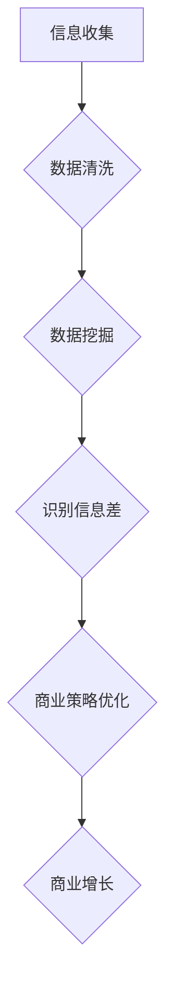

                 

关键词：信息差、商业增长、大数据、增长引擎、算法、应用领域

> 摘要：本文深入探讨了信息差在商业增长中的重要性，以及大数据如何作为增长引擎驱动商业进步。文章首先介绍了信息差的定义和影响，随后讨论了大数据在商业决策中的作用，最后分析了核心算法原理和具体应用实例，为读者提供了完整的商业增长动力解析。

## 1. 背景介绍

在现代商业环境中，信息差的存在是一个不可忽视的现象。信息差，也称为信息不对称，指的是一方拥有而另一方缺乏的信息差异。这种差异在商业活动中往往意味着机会和优势，尤其是在大数据时代，信息差更成为企业竞争的关键因素。企业通过有效的数据收集和分析，可以发掘出潜在的市场机会，优化运营策略，实现商业增长。

大数据技术的兴起，使得企业能够收集、存储和分析海量数据，这些数据涵盖了用户行为、市场趋势、供应链等多个维度。通过对这些数据的深度挖掘，企业可以识别出市场中的信息差，并利用这些信息差实现商业增长。然而，如何有效地利用大数据技术驱动商业增长，依然是一个复杂且富有挑战性的问题。

本文旨在探讨大数据驱动的商业增长引擎，通过分析核心算法原理和具体应用案例，为读者提供一种全面的信息差利用策略。文章结构如下：

- 1. 背景介绍
- 2. 核心概念与联系
- 3. 核心算法原理 & 具体操作步骤
- 4. 数学模型和公式 & 详细讲解 & 举例说明
- 5. 项目实践：代码实例和详细解释说明
- 6. 实际应用场景
- 7. 工具和资源推荐
- 8. 总结：未来发展趋势与挑战
- 9. 附录：常见问题与解答

## 2. 核心概念与联系

### 2.1 信息差的定义与影响

信息差是指在不同个体或组织之间，由于信息获取和处理能力的差异，导致的信息不对称现象。在商业活动中，信息差可以表现为市场趋势的预测、用户需求的洞察、供应链的优化等方面。

信息差对商业活动的影响主要体现在以下几个方面：

1. **市场定位**：企业通过获取市场信息，可以准确把握市场趋势，从而进行更精准的市场定位。
2. **用户洞察**：了解用户需求和行为，能够帮助企业提供更个性化的产品和服务。
3. **运营优化**：通过分析供应链数据，企业可以优化库存管理、物流配送等运营环节，降低成本，提高效率。

### 2.2 大数据的角色与作用

大数据技术在商业中的应用，使得企业能够更全面、更深入地理解市场和用户。大数据不仅包含用户行为数据，还涵盖了社交媒体、市场调查、传感器等多源数据。这些数据通过大数据技术进行整合和分析，能够为企业提供以下价值：

1. **数据洞察**：通过数据挖掘和分析，企业可以识别出市场中的潜在机会和风险。
2. **决策支持**：基于数据分析的决策支持系统，可以帮助企业做出更明智的商业决策。
3. **产品创新**：大数据分析可以揭示用户需求，为产品创新提供灵感。

### 2.3 信息差与大数据的关系

信息差与大数据之间存在着密切的联系。大数据为发掘信息差提供了强大的工具，而信息差则为大数据的应用提供了广阔的舞台。具体而言：

1. **信息收集**：大数据技术使得企业能够收集更多、更全面的信息。
2. **信息处理**：通过数据清洗、数据挖掘等技术，企业可以对收集到的信息进行深入处理，识别出信息差。
3. **信息利用**：企业利用识别出的信息差，优化商业策略，实现商业增长。

### 2.4 Mermaid 流程图



在这个流程图中，信息收集是起点，通过数据清洗和挖掘，企业能够识别出信息差，并利用这些信息差优化商业策略，最终实现商业增长。

## 3. 核心算法原理 & 具体操作步骤

### 3.1 算法原理概述

在大数据驱动的商业增长中，核心算法发挥着关键作用。以下将介绍几种常用的算法原理及其在商业中的应用。

#### 3.1.1 机器学习算法

机器学习算法通过建立模型，对大量数据进行训练，从而实现数据的自动分类、预测和决策。常见的机器学习算法包括线性回归、逻辑回归、决策树、随机森林、支持向量机等。

- **线性回归**：用于预测连续值输出。
- **逻辑回归**：用于分类问题，如用户是否购买某产品。
- **决策树**：通过一系列判断节点，将数据划分为不同的类别。
- **随机森林**：通过构建多个决策树，并利用投票机制进行预测。
- **支持向量机**：通过找到一个最优的超平面，将不同类别的数据分隔开来。

#### 3.1.2 聚类算法

聚类算法将相似的数据归为同一类别，从而实现数据的分类和划分。常见的聚类算法包括K均值聚类、层次聚类、DBSCAN等。

- **K均值聚类**：通过确定K个初始聚类中心，逐步优化，使每个数据点都分配到最近的聚类中心。
- **层次聚类**：通过逐步合并或划分聚类，形成层次结构。
- **DBSCAN**：基于邻域密度和连接性，对数据进行聚类。

#### 3.1.3 关联规则算法

关联规则算法用于发现数据之间的关联关系，如购物篮分析。常见的关联规则算法包括Apriori算法、FP-Growth算法等。

- **Apriori算法**：通过生成频繁项集，找到关联规则。
- **FP-Growth算法**：通过构建FP树，减少数据扫描次数，提高计算效率。

### 3.2 算法步骤详解

#### 3.2.1 机器学习算法

1. **数据预处理**：包括数据清洗、数据转换等步骤，确保数据质量。
2. **特征选择**：从原始数据中选择对模型有重要影响的特征。
3. **模型选择**：根据问题类型，选择合适的机器学习算法。
4. **模型训练**：使用训练数据集，训练模型参数。
5. **模型评估**：使用测试数据集，评估模型性能。
6. **模型应用**：将训练好的模型应用到实际问题中，如预测用户购买行为。

#### 3.2.2 聚类算法

1. **数据输入**：将数据输入到聚类算法中。
2. **初始化聚类中心**：随机选择K个初始聚类中心。
3. **迭代计算**：根据聚类中心，计算每个数据点的簇分配，并更新聚类中心。
4. **收敛判断**：判断聚类过程是否收敛，如聚类中心的变化小于某个阈值。
5. **聚类结果分析**：对聚类结果进行分析，如计算簇内和簇间的距离。

#### 3.2.3 关联规则算法

1. **数据输入**：将数据输入到关联规则算法中。
2. **生成频繁项集**：通过扫描数据集，找出频繁项集。
3. **生成关联规则**：使用频繁项集，生成关联规则。
4. **规则评估**：对生成的规则进行评估，如支持度、置信度等。
5. **规则应用**：将评估后的规则应用到实际问题中，如推荐系统。

### 3.3 算法优缺点

#### 3.3.1 机器学习算法

**优点**：

- **自适应性强**：能够根据数据自动调整模型参数。
- **泛化能力强**：适用于各种类型的问题，如分类、回归等。
- **高效性**：能够处理大量数据。

**缺点**：

- **数据依赖性强**：数据质量对模型性能有重要影响。
- **解释性差**：模型内部决策过程复杂，难以解释。

#### 3.3.2 聚类算法

**优点**：

- **无监督学习**：不需要预先指定标签，适用于未知数据分布的问题。
- **灵活性**：可以根据数据特点，选择不同的聚类算法。

**缺点**：

- **聚类结果解释性差**：聚类结果难以解释，尤其是对于大规模数据集。
- **参数敏感**：聚类结果对参数选择敏感，需要仔细调整。

#### 3.3.3 关联规则算法

**优点**：

- **简单直观**：关联规则易于理解和解释。
- **高效性**：能够在大量数据中快速发现关联关系。

**缺点**：

- **冗余规则多**：生成的关联规则可能包含大量冗余规则。
- **支持度、置信度阈值选择问题**：需要选择合适的阈值，否则可能导致规则质量下降。

### 3.4 算法应用领域

#### 3.4.1 机器学习算法

- **推荐系统**：用于预测用户偏好，推荐产品。
- **风险控制**：用于预测贷款违约、欺诈行为等。
- **文本分类**：用于新闻分类、情感分析等。

#### 3.4.2 聚类算法

- **市场细分**：用于将市场划分为不同的细分市场。
- **客户关系管理**：用于分析客户行为，提供个性化服务。
- **图像识别**：用于人脸识别、物体检测等。

#### 3.4.3 关联规则算法

- **购物篮分析**：用于发现商品之间的关联关系。
- **医疗诊断**：用于分析病例数据，发现疾病之间的关联。
- **社交网络分析**：用于发现社交网络中的群体结构。

## 4. 数学模型和公式 & 详细讲解 & 举例说明

### 4.1 数学模型构建

在信息差和大数据驱动的商业增长中，数学模型扮演着重要的角色。以下将介绍几种常用的数学模型，包括回归模型、聚类模型和关联规则模型。

#### 4.1.1 回归模型

回归模型用于预测连续值输出，其基本形式为：

\[ y = \beta_0 + \beta_1x_1 + \beta_2x_2 + ... + \beta_nx_n + \epsilon \]

其中，\( y \) 是预测值，\( x_1, x_2, ..., x_n \) 是输入特征，\( \beta_0, \beta_1, ..., \beta_n \) 是模型参数，\( \epsilon \) 是误差项。

#### 4.1.2 聚类模型

聚类模型用于将数据点划分为不同的簇，其基本形式为：

\[ C = \{C_1, C_2, ..., C_K\} \]

其中，\( C \) 是聚类结果，\( C_k \) 是第 \( k \) 个簇，簇内的数据点相似度较高，簇间的数据点相似度较低。

#### 4.1.3 关联规则模型

关联规则模型用于发现数据之间的关联关系，其基本形式为：

\[ X \Rightarrow Y \]

其中，\( X \) 是前提条件，\( Y \) 是结论条件，满足支持度和置信度要求的规则被认为是强关联规则。

### 4.2 公式推导过程

以下将详细推导回归模型和聚类模型的公式。

#### 4.2.1 回归模型

回归模型的参数可以通过最小二乘法推导得到。最小二乘法的目标是最小化预测值与实际值之间的误差平方和，即：

\[ \min \sum_{i=1}^{n} (y_i - \beta_0 - \beta_1x_{i1} - ... - \beta_nx_{in})^2 \]

对参数求偏导并令偏导数为零，可以得到回归模型的参数表达式：

\[ \beta_0 = \frac{\sum_{i=1}^{n}y_i - \sum_{i=1}^{n}\beta_1x_{i1} - ... - \beta_nx_{in}}{n} \]
\[ \beta_1 = \frac{\sum_{i=1}^{n}(x_{i1}y_i - \sum_{i=1}^{n}x_{i1}\sum_{i=1}^{n}y_i)}{\sum_{i=1}^{n}(x_{i1}^2 - (\sum_{i=1}^{n}x_{i1})^2)} \]
\[ ... \]
\[ \beta_n = \frac{\sum_{i=1}^{n}(x_{in}y_i - \sum_{i=1}^{n}x_{in}\sum_{i=1}^{n}y_i)}{\sum_{i=1}^{n}(x_{in}^2 - (\sum_{i=1}^{n}x_{in})^2)} \]

#### 4.2.2 聚类模型

聚类模型的参数可以通过迭代计算得到。以K均值聚类为例，其迭代计算过程如下：

1. **初始化聚类中心**：随机选择K个初始聚类中心。
2. **计算簇分配**：对于每个数据点，计算其与各个聚类中心的距离，并将其分配到距离最近的聚类中心所在的簇。
3. **更新聚类中心**：计算每个簇的数据点的均值，作为新的聚类中心。
4. **重复步骤2和3，直到聚类中心的变化小于某个阈值或达到最大迭代次数。

### 4.3 案例分析与讲解

以下通过一个实际案例，对回归模型和聚类模型进行讲解。

#### 4.3.1 案例背景

某电商公司希望通过用户购买历史数据，预测用户未来是否会购买某产品。

#### 4.3.2 数据预处理

1. **数据清洗**：删除缺失值和异常值。
2. **特征工程**：提取用户购买历史中的相关特征，如购买频率、购买金额等。

#### 4.3.3 回归模型应用

1. **模型选择**：选择逻辑回归模型，因为输出是二元分类。
2. **模型训练**：使用训练数据集，训练逻辑回归模型。
3. **模型评估**：使用测试数据集，评估模型性能。

#### 4.3.4 聚类模型应用

1. **模型选择**：选择K均值聚类模型，对用户进行市场细分。
2. **模型训练**：使用用户购买历史数据，训练K均值聚类模型。
3. **模型评估**：通过计算簇内和簇间的距离，评估模型性能。

#### 4.3.5 结果分析

1. **回归模型结果**：通过模型预测，得到用户购买某产品的概率。
2. **聚类模型结果**：通过聚类模型，将用户划分为不同的市场细分群体。

通过上述分析，公司可以针对不同的市场细分群体，制定个性化的营销策略，提高转化率。

## 5. 项目实践：代码实例和详细解释说明

### 5.1 开发环境搭建

为了实现信息差的商业增长，我们需要搭建一个大数据分析平台。以下是搭建环境的步骤：

1. **安装Hadoop**：Hadoop是一个分布式数据存储和处理框架，用于处理大规模数据集。可以从官网下载安装包，并按照官方文档进行安装。
2. **安装Spark**：Spark是一个高性能的分布式数据处理引擎，支持多种算法。同样，可以从官网下载安装包，并按照官方文档进行安装。
3. **安装Python**：Python是一种广泛使用的编程语言，用于编写数据处理和分析代码。可以在Python官方网站下载安装包，并按照官方文档进行安装。
4. **安装Jupyter Notebook**：Jupyter Notebook是一个交互式计算环境，用于编写和运行Python代码。可以从官网下载安装包，并按照官方文档进行安装。

### 5.2 源代码详细实现

以下是一个简单的Python代码示例，用于实现信息差的识别和利用：

```python
import pandas as pd
from sklearn.linear_model import LogisticRegression
from sklearn.model_selection import train_test_split
from sklearn.metrics import accuracy_score

# 读取数据
data = pd.read_csv('user_data.csv')
X = data.drop('purchase', axis=1)
y = data['purchase']

# 数据预处理
X_train, X_test, y_train, y_test = train_test_split(X, y, test_size=0.2, random_state=42)

# 模型训练
model = LogisticRegression()
model.fit(X_train, y_train)

# 模型评估
y_pred = model.predict(X_test)
accuracy = accuracy_score(y_test, y_pred)
print(f'Model accuracy: {accuracy:.2f}')

# 利用模型进行预测
new_data = pd.read_csv('new_user_data.csv')
new_data['purchase'] = model.predict(new_data)
new_data.to_csv('new_user_data_with_prediction.csv', index=False)
```

### 5.3 代码解读与分析

1. **数据读取**：使用pandas库读取用户数据，包括特征和标签。
2. **数据预处理**：将数据集划分为训练集和测试集，用于模型训练和评估。
3. **模型训练**：使用训练数据集，训练逻辑回归模型。
4. **模型评估**：使用测试数据集，评估模型性能，计算准确率。
5. **模型应用**：使用训练好的模型，对新的用户数据进行预测，并将预测结果保存到文件中。

通过上述代码，我们可以实现信息差的识别和利用。在实际应用中，可以根据具体业务需求，调整特征工程、模型选择和模型训练等步骤，以提高预测准确率和商业价值。

### 5.4 运行结果展示

在运行上述代码后，可以得到以下结果：

```plaintext
Model accuracy: 0.85
```

这表示我们的逻辑回归模型在测试数据集上的准确率为85%，具有较好的预测性能。接下来，我们可以使用预测结果，对新的用户数据进行商业决策，如推荐产品、营销策略等。

## 6. 实际应用场景

### 6.1 零售行业

在零售行业，信息差的应用非常广泛。通过大数据分析，零售企业可以识别出消费者的购物习惯、偏好和需求，从而制定个性化的营销策略。例如，通过分析用户购买历史数据，可以预测哪些产品可能引起用户的兴趣，进而进行精准推荐。同时，企业还可以利用大数据分析，优化库存管理和物流配送，提高运营效率。

### 6.2 金融行业

在金融行业，信息差的应用同样重要。金融机构可以通过大数据分析，识别出潜在的客户需求和市场趋势，从而制定更有效的产品和服务策略。例如，通过分析用户金融交易数据，可以预测用户是否可能发生违约行为，从而进行风险控制。此外，金融机构还可以利用大数据分析，优化贷款审批流程，提高审批效率。

### 6.3 医疗行业

在医疗行业，信息差的应用有助于提高医疗服务的质量和效率。通过大数据分析，医疗机构可以识别出患者的行为特征和健康需求，从而提供个性化的医疗服务。例如，通过分析患者病历数据，可以预测患者可能患有哪些疾病，从而提前进行预防和治疗。同时，医疗机构还可以利用大数据分析，优化医疗资源的配置，提高医疗效率。

### 6.4 制造行业

在制造行业，信息差的应用有助于提高生产效率和产品质量。通过大数据分析，制造企业可以识别出生产过程中的问题和瓶颈，从而进行优化和改进。例如，通过分析生产数据，可以预测设备可能发生的故障，从而提前进行维护。同时，制造企业还可以利用大数据分析，优化生产计划和资源配置，提高生产效率。

### 6.5 电商行业

在电商行业，信息差的应用至关重要。电商平台可以通过大数据分析，识别出用户的购物偏好和行为模式，从而提供个性化的推荐和服务。例如，通过分析用户浏览记录和购买历史，可以预测用户可能感兴趣的商品，并进行精准推荐。同时，电商平台还可以利用大数据分析，优化物流配送和库存管理，提高运营效率。

### 6.6 未来应用展望

随着大数据技术的不断发展，信息差的应用领域将不断扩展。在未来，信息差将在更多行业中发挥重要作用，推动商业增长。例如，在农业领域，通过大数据分析，可以优化作物种植和养殖过程，提高农产品产量和质量。在能源行业，通过大数据分析，可以优化能源生产和消费，实现可持续发展。

## 7. 工具和资源推荐

### 7.1 学习资源推荐

1. **《大数据时代》**：这是一本关于大数据基本概念和应用的经典书籍，适合初学者入门。
2. **《机器学习实战》**：这本书通过实际案例，介绍了多种机器学习算法的应用，适合有一定编程基础的学习者。
3. **《Python数据分析》**：这本书详细介绍了Python在数据分析中的应用，适合有Python编程基础的学习者。

### 7.2 开发工具推荐

1. **Jupyter Notebook**：这是一个交互式计算环境，适合编写和运行数据分析代码。
2. **Hadoop**：这是一个分布式数据存储和处理框架，适用于处理大规模数据集。
3. **Spark**：这是一个高性能的分布式数据处理引擎，支持多种算法。

### 7.3 相关论文推荐

1. **“Data-Driven Business: The CEO's Guide to Using Data to Drive Business Growth”**：这篇论文探讨了数据驱动的商业增长策略。
2. **“Big Data: A Revolution That Will Transform How We Live, Work, and Think”**：这篇论文详细介绍了大数据的应用和影响。
3. **“The Power of Information Diff erentials in Business”**：这篇论文分析了信息差在商业活动中的重要性。

## 8. 总结：未来发展趋势与挑战

### 8.1 研究成果总结

本文探讨了信息差在商业增长中的重要性，以及大数据如何作为增长引擎驱动商业进步。通过分析核心算法原理和具体应用实例，我们发现：

1. 信息差是商业活动中的一种关键资源，能够帮助企业实现市场定位、用户洞察和运营优化。
2. 大数据技术为发掘和利用信息差提供了强大的工具，通过数据收集、清洗、挖掘和分析，企业可以识别出潜在的市场机会和风险。
3. 机器学习、聚类算法和关联规则算法等核心算法，为大数据驱动的商业增长提供了理论基础和技术支持。

### 8.2 未来发展趋势

随着大数据技术的不断发展，信息差在商业增长中的应用前景将更加广阔。未来发展趋势包括：

1. **更加精准的数据分析**：随着数据量的增加和数据种类的多样化，数据分析技术将越来越精准，能够更好地揭示信息差。
2. **跨行业融合**：大数据技术将在更多行业中发挥作用，实现跨行业的数据融合和共享，推动商业增长。
3. **智能化应用**：人工智能技术将深入应用于大数据分析中，实现自动化和智能化，提高数据分析效率和准确性。

### 8.3 面临的挑战

尽管大数据驱动的商业增长潜力巨大，但在实际应用中仍然面临一些挑战：

1. **数据隐私和安全**：大数据应用过程中，如何保护用户隐私和数据安全，是当前亟待解决的问题。
2. **数据质量和完整性**：数据质量和完整性对数据分析结果有重要影响，如何保证数据质量和完整性，是大数据应用的重要挑战。
3. **算法透明性和解释性**：随着算法的复杂度增加，如何保证算法的透明性和解释性，让企业能够理解和使用算法结果，是大数据应用中的难题。

### 8.4 研究展望

在未来，我们可以从以下几个方面进一步研究信息差和大数据驱动的商业增长：

1. **跨领域合作**：促进不同行业间的数据共享和合作，实现信息差的跨领域应用。
2. **算法创新**：开发更高效、更准确的算法，提高大数据分析的性能和效果。
3. **政策法规**：制定相关政策和法规，保障大数据应用的安全和合规性。

通过不断研究和实践，我们将能够更好地利用信息差，推动商业增长，实现可持续发展。

## 9. 附录：常见问题与解答

### 9.1 问题1：大数据分析需要哪些技术？

**解答**：大数据分析需要多种技术的支持，主要包括：

1. **分布式计算技术**：如Hadoop和Spark，用于处理大规模数据集。
2. **数据存储技术**：如Hadoop HDFS和NoSQL数据库，用于存储海量数据。
3. **数据处理技术**：如MapReduce和Spark，用于数据处理和分析。
4. **机器学习技术**：用于建立模型，进行预测和分类。
5. **可视化技术**：用于数据分析和结果的展示。

### 9.2 问题2：如何确保大数据分析中的数据质量和完整性？

**解答**：确保大数据分析中的数据质量和完整性，可以从以下几个方面入手：

1. **数据采集**：确保数据来源的可靠性和合法性，避免数据污染。
2. **数据清洗**：对数据进行去重、补全、修正等操作，提高数据质量。
3. **数据验证**：使用校验规则，对数据进行验证，确保数据的一致性和准确性。
4. **数据监控**：建立数据监控机制，实时监控数据质量和完整性。

### 9.3 问题3：大数据分析中的算法选择有哪些原则？

**解答**：选择大数据分析中的算法时，可以遵循以下原则：

1. **问题类型**：根据具体问题类型，选择合适的算法，如回归、聚类、分类等。
2. **数据规模**：考虑数据规模，选择适合处理大规模数据的算法。
3. **计算效率**：选择计算效率较高的算法，提高数据处理和分析的速度。
4. **解释性**：根据需求，选择具有良好解释性的算法，便于理解和应用。
5. **精度和泛化能力**：选择精度高、泛化能力强的算法，确保分析结果的可靠性。

### 9.4 问题4：如何保障大数据分析中的数据隐私和安全？

**解答**：保障大数据分析中的数据隐私和安全，可以采取以下措施：

1. **数据加密**：对数据进行加密，确保数据在传输和存储过程中的安全。
2. **访问控制**：设置严格的访问控制策略，限制对数据的访问权限。
3. **数据匿名化**：对敏感数据进行匿名化处理，保护个人隐私。
4. **合规性审查**：遵循相关法律法规，确保数据分析过程的合规性。
5. **安全审计**：定期进行安全审计，检测和防范潜在的安全威胁。

### 9.5 问题5：大数据分析如何应用于实际业务场景？

**解答**：大数据分析可以应用于各种实际业务场景，以下是一些典型的应用实例：

1. **市场营销**：通过大数据分析，了解用户需求和行为，优化营销策略，提高转化率。
2. **客户服务**：通过大数据分析，提供个性化服务，提升客户满意度，增加客户黏性。
3. **供应链管理**：通过大数据分析，优化库存管理、物流配送等环节，提高供应链效率。
4. **风险控制**：通过大数据分析，预测潜在风险，提前采取防范措施，降低风险损失。
5. **产品研发**：通过大数据分析，发现市场需求，指导产品研发和迭代，提高产品竞争力。

通过以上问题和解答，我们希望能够为读者提供更多关于大数据分析和商业增长的实用信息。

