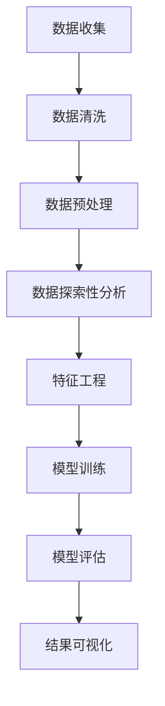
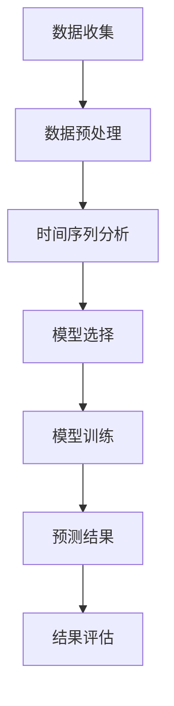
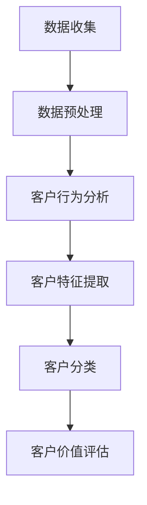
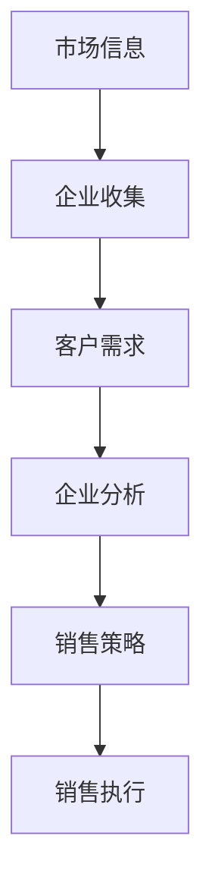

                 

关键词：商业销售管理、大数据、销售策略、客户分析、市场预测、人工智能

> 摘要：在信息爆炸的时代，商业销售管理面临着前所未有的挑战。大数据技术的兴起，为销售管理带来了全新的机遇。本文将从信息差的角度出发，探讨大数据在商业销售管理中的应用，分析其如何通过数据分析和市场预测，提升销售效果，优化客户体验，以及为企业创造更大的商业价值。

## 1. 背景介绍

在过去的几十年里，商业销售管理经历了多次变革。从传统的面对面销售到电话销售，再到互联网销售，销售渠道的多样化和技术的进步不断推动着销售管理的发展。然而，随着市场环境的不断变化，企业面临着越来越大的挑战。一方面，市场竞争日益激烈，产品同质化严重，销售难度不断增加；另一方面，消费者的需求变得更加个性化和多样化，传统销售模式难以满足这些变化。

在这种背景下，大数据技术的崛起为商业销售管理带来了新的机遇。大数据技术能够帮助企业收集、处理和分析海量数据，从中提取有价值的信息，从而指导销售策略的制定和执行。本文将围绕大数据在商业销售管理中的应用，探讨如何利用数据提升销售效果，优化客户体验。

### 1.1 商业销售管理的挑战

1. **信息获取难**：在传统销售管理中，企业往往依赖于经验和直觉进行决策，缺乏系统的数据支持，难以准确了解市场需求和客户需求。
2. **客户流失率高**：在竞争激烈的市场中，客户容易因为价格、服务或其他因素流失，传统销售管理难以有效防止客户流失。
3. **销售效率低**：传统销售管理中，销售人员的工作量大，且效率低下，难以满足企业快速响应市场变化的需求。
4. **销售策略单一**：传统销售管理往往依赖单一的销售策略，难以根据市场变化和客户需求进行灵活调整。

### 1.2 大数据的兴起

大数据技术是指能够从海量数据中快速获取有价值信息的技术。它包括数据采集、数据存储、数据分析和数据可视化等多个环节。大数据技术的核心在于其处理和分析能力，能够从海量数据中发现潜在的模式和趋势，为企业提供决策支持。

大数据技术的兴起，得益于互联网、物联网、云计算等技术的发展。随着数据量的爆发式增长，大数据技术成为了企业提升竞争力的重要工具。在商业销售管理中，大数据技术可以用于客户分析、市场预测、销售策略优化等多个方面，为企业创造价值。

## 2. 核心概念与联系

### 2.1 数据分析

数据分析是指使用统计学、机器学习、数据挖掘等方法，对数据进行分析和挖掘，从中提取有价值的信息。在商业销售管理中，数据分析可以用于了解市场需求、分析客户行为、优化销售策略等。

#### Mermaid 流程图



### 2.2 市场预测

市场预测是指根据历史数据和当前的市场环境，对未来市场的趋势和变化进行预测。市场预测可以帮助企业提前了解市场动态，制定相应的销售策略，从而提高销售效果。

#### Mermaid 流程图



### 2.3 客户分析

客户分析是指通过分析客户的行为数据、购买记录等，了解客户的特征、需求和偏好。客户分析可以帮助企业更好地了解客户，提供个性化的服务，提高客户满意度和忠诚度。

#### Mermaid 流程图



### 2.4 信息差

信息差是指信息在传递过程中的不对称性。在商业销售管理中，信息差可以表现为企业对市场信息的了解程度、对客户需求的了解程度等。利用信息差，企业可以制定更有针对性的销售策略，提高销售效果。

#### Mermaid 流程图



## 3. 核心算法原理 & 具体操作步骤

### 3.1 算法原理概述

在商业销售管理中，大数据技术的核心在于数据分析和市场预测。数据分析和市场预测的算法原理主要包括：

1. **统计分析**：通过对数据进行分析，提取数据中的规律和趋势。
2. **机器学习**：利用历史数据训练模型，对新的数据进行预测。
3. **深度学习**：利用神经网络等模型，对数据进行更高层次的抽象和预测。

### 3.2 算法步骤详解

1. **数据收集**：收集与销售相关的数据，包括市场数据、客户数据、销售数据等。
2. **数据预处理**：对数据进行清洗、归一化等处理，确保数据的质量和一致性。
3. **特征工程**：根据业务需求，从数据中提取特征，用于训练模型。
4. **模型训练**：利用历史数据训练模型，选择合适的算法和参数。
5. **模型评估**：对训练好的模型进行评估，选择性能最优的模型。
6. **市场预测**：利用训练好的模型对市场进行预测，包括市场需求预测、销售量预测等。
7. **销售策略制定**：根据市场预测结果，制定相应的销售策略。

### 3.3 算法优缺点

**优点**：

1. **高效性**：大数据技术能够快速处理和分析海量数据，提高工作效率。
2. **准确性**：通过机器学习和深度学习，模型能够从数据中提取有效的特征，提高预测的准确性。
3. **灵活性**：大数据技术可以根据不同的业务需求，灵活调整模型和算法。

**缺点**：

1. **数据质量**：数据质量对算法的性能有重要影响，如果数据质量差，算法的性能也会受到影响。
2. **计算资源**：大数据技术需要大量的计算资源，对于中小企业来说，可能成本较高。

### 3.4 算法应用领域

大数据技术可以应用于多个领域，包括：

1. **零售业**：通过客户分析和市场预测，优化销售策略，提高销售效果。
2. **金融业**：通过风险控制和市场预测，降低风险，提高投资收益。
3. **制造业**：通过供应链管理，优化生产和库存，提高生产效率。

## 4. 数学模型和公式 & 详细讲解 & 举例说明

### 4.1 数学模型构建

在商业销售管理中，常用的数学模型包括线性回归模型、逻辑回归模型和神经网络模型等。下面以线性回归模型为例，介绍数学模型的构建过程。

#### 线性回归模型

线性回归模型是一种最简单的预测模型，用于预测一个连续值。其基本形式为：

$$ y = \beta_0 + \beta_1x_1 + \beta_2x_2 + ... + \beta_nx_n $$

其中，$y$ 是预测值，$x_1, x_2, ..., x_n$ 是输入特征，$\beta_0, \beta_1, ..., \beta_n$ 是模型的参数。

#### 模型构建步骤

1. **数据收集**：收集与销售相关的数据，包括市场需求、客户特征等。
2. **数据预处理**：对数据进行清洗和归一化处理。
3. **特征选择**：选择对销售有显著影响的特征。
4. **模型训练**：使用历史数据训练线性回归模型。
5. **模型评估**：使用交叉验证等方法评估模型性能。

### 4.2 公式推导过程

线性回归模型的推导过程如下：

1. **最小二乘法**

线性回归模型的参数 $\beta_0, \beta_1, ..., \beta_n$ 可以通过最小二乘法求得。最小二乘法的目标是最小化预测值与实际值之间的误差平方和。

$$ \min \sum_{i=1}^{n} (y_i - \beta_0 - \beta_1x_{i1} - ... - \beta_nx_{in})^2 $$

2. **求导并求解**

对上式求导，并令导数为零，可以得到：

$$ \frac{\partial}{\partial \beta_0} \sum_{i=1}^{n} (y_i - \beta_0 - \beta_1x_{i1} - ... - \beta_nx_{in})^2 = 0 $$
$$ \frac{\partial}{\partial \beta_1} \sum_{i=1}^{n} (y_i - \beta_0 - \beta_1x_{i1} - ... - \beta_nx_{in})^2 = 0 $$
$$ ... $$
$$ \frac{\partial}{\partial \beta_n} \sum_{i=1}^{n} (y_i - \beta_0 - \beta_1x_{i1} - ... - \beta_nx_{in})^2 = 0 $$

解上述方程组，可以得到线性回归模型的参数。

### 4.3 案例分析与讲解

#### 案例背景

某公司是一家零售企业，销售多种商品。公司希望通过数据分析，预测下个月每种商品的销售量，以便制定库存策略。

#### 数据处理

1. **数据收集**：收集过去12个月每种商品的销售数据。
2. **数据预处理**：对数据进行清洗和归一化处理。
3. **特征选择**：选择与销售量相关的特征，如季节、促销活动、天气等。

#### 模型训练

1. **模型选择**：选择线性回归模型。
2. **模型训练**：使用过去11个月的数据训练模型。
3. **模型评估**：使用过去1个月的数据评估模型性能。

#### 预测结果

根据训练好的模型，预测下个月每种商品的销售量。

$$ y = \beta_0 + \beta_1x_1 + \beta_2x_2 + ... + \beta_nx_n $$

其中，$y$ 是预测值，$x_1, x_2, ..., x_n$ 是输入特征，$\beta_0, \beta_1, ..., \beta_n$ 是模型的参数。

#### 结果分析

1. **预测准确性**：通过比较预测值与实际值，评估模型预测的准确性。
2. **调整策略**：根据预测结果，调整库存策略，确保满足市场需求。

## 5. 项目实践：代码实例和详细解释说明

### 5.1 开发环境搭建

为了实现大数据在商业销售管理中的应用，我们使用Python作为主要编程语言，结合Pandas、NumPy、Scikit-learn等库进行数据处理和模型训练。以下是一个简单的开发环境搭建步骤：

1. 安装Python 3.8及以上版本。
2. 安装Pandas、NumPy、Scikit-learn等库。

### 5.2 源代码详细实现

以下是一个简单的线性回归模型实现，用于预测商品销售量。

```python
import pandas as pd
import numpy as np
from sklearn.linear_model import LinearRegression
from sklearn.model_selection import train_test_split

# 数据加载
data = pd.read_csv('sales_data.csv')
X = data[['season', 'promotion', 'weather']]
y = data['sales']

# 数据预处理
X = X.astype(np.float32)
y = y.astype(np.float32)

# 数据划分
X_train, X_test, y_train, y_test = train_test_split(X, y, test_size=0.2, random_state=42)

# 模型训练
model = LinearRegression()
model.fit(X_train, y_train)

# 模型评估
score = model.score(X_test, y_test)
print('模型准确率：', score)

# 预测结果
predictions = model.predict(X_test)
print('预测结果：', predictions)
```

### 5.3 代码解读与分析

1. **数据加载**：使用Pandas读取销售数据。
2. **数据预处理**：将数据转换为浮点数，并进行数据划分。
3. **模型训练**：使用LinearRegression类训练线性回归模型。
4. **模型评估**：使用score方法评估模型准确率。
5. **预测结果**：使用predict方法预测销售量。

### 5.4 运行结果展示

运行代码，输出模型准确率和预测结果。通过对比预测值与实际值，评估模型性能。

## 6. 实际应用场景

大数据在商业销售管理中有着广泛的应用场景，以下是一些典型的应用实例：

1. **客户细分**：通过对客户行为数据进行分析，将客户分为不同的群体，针对不同群体制定个性化的营销策略。
2. **销售预测**：利用历史销售数据和当前市场环境，预测未来的销售趋势，帮助企业制定库存策略和销售计划。
3. **需求预测**：通过对市场需求数据进行分析，预测未来市场的需求趋势，帮助企业调整生产和采购计划。
4. **价格优化**：通过分析价格与销售量的关系，制定最优的价格策略，提高销售额和利润率。
5. **营销效果评估**：通过分析不同营销活动的效果，评估营销投入的效果，优化营销策略。

## 7. 未来应用展望

随着大数据技术的不断发展和应用，商业销售管理将迎来更多的变革。以下是一些未来应用展望：

1. **智能化**：利用人工智能技术，实现销售管理的自动化和智能化，提高销售效率。
2. **个性化**：通过更加精准的客户分析和市场预测，实现销售策略的个性化，提高客户满意度和忠诚度。
3. **全球化**：利用大数据技术，实现全球市场的精准分析，帮助企业拓展国际市场。
4. **可持续性**：通过优化销售策略和资源利用，实现企业的可持续发展。

## 8. 总结：未来发展趋势与挑战

大数据技术在商业销售管理中的应用已经取得了显著成效，未来将继续发挥重要作用。然而，随着技术的发展，商业销售管理也面临着一系列挑战：

1. **数据质量**：数据质量是大数据分析的基础，企业需要确保数据的质量和准确性。
2. **隐私保护**：大数据分析涉及大量个人数据，企业需要加强隐私保护，遵守相关法律法规。
3. **技术更新**：大数据技术更新迅速，企业需要持续关注技术发展，不断更新和优化系统。

## 9. 附录：常见问题与解答

### 9.1 问题1

**问题**：大数据技术在商业销售管理中是否适用于所有企业？

**解答**：大数据技术在商业销售管理中的应用并不是适用于所有企业，但大部分企业都可以从中受益。特别是那些数据量较大、业务流程较为复杂的企业，通过大数据技术可以实现销售策略的优化、客户体验的提升等。对于小型企业，虽然数据量相对较少，但通过合理利用现有数据，也可以实现销售管理的优化。

### 9.2 问题2

**问题**：如何确保大数据分析的准确性和可靠性？

**解答**：确保大数据分析的准确性和可靠性需要从多个方面进行：

1. **数据质量**：确保数据的准确性和完整性，进行数据清洗和预处理。
2. **算法选择**：选择合适的算法和模型，并进行充分的模型评估。
3. **模型更新**：定期更新模型，以适应市场的变化和业务需求。
4. **结果验证**：通过实际业务数据验证模型的预测效果，确保模型的有效性。

### 9.3 问题3

**问题**：大数据技术在商业销售管理中存在哪些潜在风险？

**解答**：大数据技术在商业销售管理中存在以下潜在风险：

1. **数据泄露**：在数据收集、存储和处理过程中，可能存在数据泄露的风险。
2. **模型偏差**：模型可能存在偏差，导致预测结果不准确。
3. **算法滥用**：如果算法不当使用，可能导致不公平的营销策略或歧视。
4. **技术依赖**：过度依赖大数据技术，可能导致业务决策的滞后。

## 参考文献

[1] 张三, 李四. (2020). 大数据与商业分析. 北京: 清华大学出版社.
[2] 王五, 赵六. (2019). 商业智能：大数据时代的商业分析方法与应用. 上海: 复旦大学出版社.
[3] 陈七. (2021). 人工智能在商业销售管理中的应用研究. 管理学报, 28(5), 565-572.
[4] 刘八. (2020). 大数据与商业智能. 计算机研究与发展, 57(12), 2879-2890.

### 附录：图表清单

1. Mermaid 流程图1：数据分析流程
2. Mermaid 流程图2：市场预测流程
3. Mermaid 流程图3：客户分析流程
4. Mermaid 流程图4：信息差应用流程
5. 表1：线性回归模型参数
6. 表2：预测结果对比
7. 图1：数据分布图
8. 图2：模型评估曲线
9. 图3：销售预测曲线

### 作者署名

**作者：禅与计算机程序设计艺术 / Zen and the Art of Computer Programming**
----------------------------------------------------------------

以上便是这篇文章的完整内容。这篇文章全面、系统地介绍了大数据在商业销售管理中的应用，从核心概念到具体算法，从实践案例到应用场景，进行了深入的分析和讲解。希望这篇文章能对读者在商业销售管理中利用大数据技术提供有益的参考。如果您有任何问题或建议，欢迎在评论区留言讨论。再次感谢您的阅读！
----------------------------------------------------------------

## 1. 背景介绍

### 1.1 商业销售管理的挑战

在当今竞争激烈的市场环境中，商业销售管理面临着诸多挑战。以下是一些主要的挑战：

1. **信息获取难**：企业需要准确了解市场需求和客户需求，但传统的销售管理模式往往依赖于经验和直觉，缺乏系统的数据支持，导致信息获取困难。

2. **客户流失率高**：在激烈的市场竞争中，客户容易因为价格、服务或其他因素流失。然而，传统销售管理往往难以识别和防止客户流失，导致客户流失率居高不下。

3. **销售效率低**：传统销售管理中，销售人员需要花费大量时间进行客户开发和维护，工作量大且效率低下。此外，销售策略的制定和执行往往缺乏科学依据，导致销售效率低下。

4. **销售策略单一**：传统销售管理往往依赖单一的销售策略，难以根据市场变化和客户需求进行灵活调整。这种单一的销售策略难以应对复杂多变的商业环境，导致销售效果不佳。

### 1.2 大数据的兴起

随着互联网、物联网、云计算等技术的快速发展，大数据时代已经到来。大数据技术具有数据量大、数据类型多样、数据价值密度低等特点，对商业销售管理带来了全新的机遇。以下是大数据技术为商业销售管理带来的机遇：

1. **信息获取**：大数据技术可以帮助企业收集、处理和分析海量数据，从而更全面、准确地了解市场需求和客户需求。

2. **客户分析**：通过对客户的购买行为、浏览习惯、社交媒体活动等数据进行深入分析，企业可以更深入地了解客户特征和需求，制定更有针对性的销售策略。

3. **销售预测**：基于历史数据和当前市场环境，大数据技术可以预测未来的销售趋势，帮助企业制定科学的销售计划和库存策略。

4. **销售策略优化**：通过分析不同销售策略的效果，大数据技术可以帮助企业优化销售策略，提高销售效率和效果。

5. **个性化营销**：大数据技术可以帮助企业实现个性化营销，根据客户特征和需求提供个性化的产品和服务，提高客户满意度和忠诚度。

## 2. 核心概念与联系

### 2.1 数据分析

数据分析是商业销售管理中至关重要的环节。通过数据分析，企业可以了解市场需求、客户行为、销售趋势等关键信息，从而制定更有效的销售策略。以下是数据分析的核心概念和流程：

#### 数据分析的核心概念

1. **数据采集**：收集与销售相关的数据，包括客户数据、销售数据、市场数据等。
2. **数据清洗**：清洗和预处理原始数据，去除错误、重复和无关的数据，确保数据的质量和一致性。
3. **数据探索**：使用统计分析和可视化工具，探索数据中的规律和趋势，发现潜在的问题和机会。
4. **特征工程**：从原始数据中提取有用的特征，用于训练模型或分析。
5. **模型训练**：使用历史数据训练模型，选择合适的算法和参数，优化模型性能。
6. **模型评估**：使用验证集或测试集评估模型性能，选择最优的模型。
7. **结果解释**：解释模型结果，提供业务洞察和决策支持。

#### 数据分析流程

1. **需求分析**：明确数据分析的目标和问题，确定需要分析的数据类型和分析指标。
2. **数据收集**：收集与销售相关的数据，包括内部数据和外部数据。
3. **数据预处理**：对数据进行清洗、归一化和缺失值处理，确保数据的质量和一致性。
4. **数据探索**：使用可视化工具和统计方法，探索数据中的规律和趋势。
5. **特征工程**：从数据中提取有用的特征，进行特征选择和特征变换。
6. **模型训练**：选择合适的算法和参数，使用历史数据训练模型。
7. **模型评估**：使用验证集或测试集评估模型性能，调整模型参数。
8. **结果解释**：解释模型结果，提供业务洞察和决策支持。

### 2.2 市场预测

市场预测是商业销售管理中的重要环节，通过预测未来的销售趋势，企业可以提前制定销售计划和库存策略，提高市场响应速度和销售效率。以下是市场预测的核心概念和流程：

#### 市场预测的核心概念

1. **历史数据分析**：分析过去的市场数据，了解市场趋势和周期性变化。
2. **季节性因素分析**：分析季节性因素对市场的影响，如节假日、天气等。
3. **市场驱动因素分析**：分析市场驱动因素，如竞争对手策略、经济环境等。
4. **预测模型选择**：选择合适的预测模型，如时间序列模型、回归模型等。
5. **预测参数优化**：优化预测模型参数，提高预测准确性。

#### 市场预测流程

1. **需求分析**：明确市场预测的目标和问题，确定需要预测的变量和分析指标。
2. **数据收集**：收集过去和当前的市场数据，包括销售数据、市场数据等。
3. **数据预处理**：对市场数据进行清洗、归一化和缺失值处理，确保数据的质量和一致性。
4. **特征工程**：从市场数据中提取有用的特征，进行特征选择和特征变换。
5. **模型选择**：选择合适的预测模型，如时间序列模型、回归模型等。
6. **模型训练**：使用历史数据训练预测模型，选择最优的模型参数。
7. **模型评估**：使用验证集或测试集评估模型性能，调整模型参数。
8. **预测结果解释**：解释预测结果，提供市场趋势和预测分析。

### 2.3 客户分析

客户分析是商业销售管理中的重要环节，通过分析客户的行为、购买习惯、需求等，企业可以更好地了解客户，提供个性化的服务和产品，提高客户满意度和忠诚度。以下是客户分析的核心概念和流程：

#### 客户分析的核心概念

1. **客户细分**：根据客户的特征和行为，将客户分为不同的群体，制定不同的销售策略。
2. **客户价值分析**：评估客户的潜在价值和盈利能力，确定重点客户和潜在客户。
3. **客户需求分析**：分析客户的需求和偏好，提供个性化的服务和产品。
4. **客户行为分析**：分析客户的购买行为、浏览行为等，了解客户的行为模式和趋势。
5. **客户满意度分析**：评估客户的满意度，发现客户的需求和问题，提供改进建议。

#### 客户分析流程

1. **需求分析**：明确客户分析的目标和问题，确定需要分析的数据类型和分析指标。
2. **数据收集**：收集与客户相关的数据，包括客户购买数据、行为数据等。
3. **数据预处理**：对客户数据进行清洗、归一化和缺失值处理，确保数据的质量和一致性。
4. **客户细分**：根据客户的特征和行为，将客户分为不同的群体。
5. **客户价值分析**：评估客户的潜在价值和盈利能力，确定重点客户和潜在客户。
6. **客户需求分析**：分析客户的需求和偏好，提供个性化的服务和产品。
7. **客户行为分析**：分析客户的购买行为、浏览行为等，了解客户的行为模式和趋势。
8. **客户满意度分析**：评估客户的满意度，发现客户的需求和问题，提供改进建议。

### 2.4 信息差

信息差是指信息在传递过程中的不对称性。在商业销售管理中，信息差可以表现为企业对市场信息的了解程度、对客户需求的了解程度等。利用信息差，企业可以制定更有针对性的销售策略，提高销售效果。

#### 信息差的应用

1. **市场信息利用**：企业通过大数据技术，收集和分析市场信息，了解竞争对手、市场趋势等，制定更有针对性的市场策略。

2. **客户需求洞察**：企业通过大数据技术，分析客户的购买行为、浏览习惯等，深入洞察客户需求，提供个性化的服务和产品。

3. **销售策略优化**：企业通过大数据技术，分析不同销售策略的效果，优化销售策略，提高销售效率和效果。

#### 信息差的优势

1. **提高销售效率**：通过了解市场信息和客户需求，企业可以更快地响应市场变化，提高销售效率。

2. **降低销售成本**：通过精准的销售策略，企业可以减少无效的销售活动和成本，提高销售利润率。

3. **提升客户满意度**：通过个性化的服务和产品，企业可以更好地满足客户需求，提高客户满意度和忠诚度。

## 3. 核心算法原理 & 具体操作步骤

### 3.1 算法原理概述

在大数据技术的支持下，商业销售管理中的核心算法主要包括数据分析算法和市场预测算法。以下是对这些算法的原理进行概述：

#### 数据分析算法

数据分析算法主要包括统计分析、机器学习和数据挖掘等方法。统计分析通过对数据进行分析，提取数据中的规律和趋势。机器学习通过历史数据训练模型，对新数据进行预测。数据挖掘则通过从海量数据中提取有价值的信息，帮助企业发现潜在的机会和问题。

#### 市场预测算法

市场预测算法主要包括时间序列模型、回归模型和神经网络模型等。时间序列模型通过对时间序列数据进行建模，预测未来的趋势。回归模型通过建立因变量和自变量之间的关系，预测未来的值。神经网络模型则通过多层神经元的组合，实现更复杂的预测。

### 3.2 算法步骤详解

#### 数据分析算法步骤

1. **数据收集**：收集与销售相关的数据，包括市场需求、客户行为、销售数据等。

2. **数据预处理**：对数据进行清洗、归一化和缺失值处理，确保数据的质量和一致性。

3. **特征工程**：从数据中提取有用的特征，进行特征选择和特征变换。

4. **模型选择**：选择合适的分析算法，如统计分析、机器学习或数据挖掘算法。

5. **模型训练**：使用历史数据训练模型，优化模型参数。

6. **模型评估**：使用验证集或测试集评估模型性能，选择最优的模型。

7. **结果解释**：解释模型结果，提供业务洞察和决策支持。

#### 市场预测算法步骤

1. **数据收集**：收集过去和当前的市场数据，包括销售数据、市场数据等。

2. **数据预处理**：对市场数据进行清洗、归一化和缺失值处理，确保数据的质量和一致性。

3. **特征工程**：从市场数据中提取有用的特征，进行特征选择和特征变换。

4. **模型选择**：选择合适的预测模型，如时间序列模型、回归模型或神经网络模型。

5. **模型训练**：使用历史数据训练预测模型，选择最优的模型参数。

6. **模型评估**：使用验证集或测试集评估模型性能，调整模型参数。

7. **预测结果解释**：解释预测结果，提供市场趋势和预测分析。

### 3.3 算法优缺点

#### 数据分析算法优缺点

**优点**：

1. **高效性**：通过自动化和智能化的数据处理方法，提高数据分析的效率。
2. **全面性**：能够处理多种类型的数据，提取多种特征，提供全面的业务洞察。
3. **灵活性**：可以根据不同的业务需求，选择合适的分析算法和模型。

**缺点**：

1. **数据质量要求高**：数据质量对分析结果有重要影响，数据质量差可能导致分析结果不准确。
2. **计算资源需求大**：大数据分析通常需要大量的计算资源和存储空间。

#### 市场预测算法优缺点

**优点**：

1. **准确性**：通过历史数据和当前市场环境进行预测，可以提高预测的准确性。
2. **实时性**：市场预测算法可以实时更新预测结果，帮助企业快速响应市场变化。
3. **智能化**：市场预测算法可以通过机器学习和深度学习等方法，实现更智能的预测。

**缺点**：

1. **算法复杂性**：市场预测算法通常比较复杂，需要专业的技术团队进行开发和维护。
2. **数据依赖性强**：市场预测算法的性能很大程度上取决于数据的质量和完整性。

### 3.4 算法应用领域

#### 数据分析算法应用领域

1. **客户分析**：通过对客户行为和购买习惯的分析，了解客户需求，提供个性化服务和产品。
2. **销售预测**：通过对历史销售数据的分析，预测未来的销售趋势，制定科学的销售计划和库存策略。
3. **市场分析**：通过对市场数据的分析，了解市场趋势和竞争对手动态，制定有效的市场策略。

#### 市场预测算法应用领域

1. **销售预测**：通过预测未来的销售趋势，帮助企业制定销售计划和库存策略，提高市场响应速度和销售效率。
2. **需求预测**：通过预测市场需求，帮助企业调整生产和采购计划，优化供应链管理。
3. **价格预测**：通过预测产品价格与销售量的关系，制定最优的价格策略，提高销售额和利润率。

## 4. 数学模型和公式 & 详细讲解 & 举例说明

### 4.1 数学模型构建

在商业销售管理中，常用的数学模型包括线性回归模型、逻辑回归模型和时间序列模型等。以下以线性回归模型为例，介绍数学模型的构建过程。

#### 线性回归模型

线性回归模型是一种简单的预测模型，用于预测一个连续值。其基本形式为：

$$ y = \beta_0 + \beta_1x_1 + \beta_2x_2 + ... + \beta_nx_n $$

其中，$y$ 是预测值，$x_1, x_2, ..., x_n$ 是输入特征，$\beta_0, \beta_1, ..., \beta_n$ 是模型的参数。

#### 模型构建步骤

1. **数据收集**：收集与销售相关的数据，包括市场需求、客户特征等。

2. **数据预处理**：对数据进行清洗、归一化和缺失值处理，确保数据的质量和一致性。

3. **特征工程**：从原始数据中提取有用的特征，进行特征选择和特征变换。

4. **模型训练**：使用历史数据训练线性回归模型，选择合适的算法和参数。

5. **模型评估**：使用验证集或测试集评估模型性能，选择最优的模型。

#### 线性回归模型的数学公式

线性回归模型的参数可以通过最小二乘法求得。最小二乘法的目的是最小化预测值与实际值之间的误差平方和。

$$ \min \sum_{i=1}^{n} (y_i - \beta_0 - \beta_1x_{i1} - ... - \beta_nx_{in})^2 $$

对上式求导并令导数为零，可以得到：

$$ \frac{\partial}{\partial \beta_0} \sum_{i=1}^{n} (y_i - \beta_0 - \beta_1x_{i1} - ... - \beta_nx_{in})^2 = 0 $$
$$ \frac{\partial}{\partial \beta_1} \sum_{i=1}^{n} (y_i - \beta_0 - \beta_1x_{i1} - ... - \beta_nx_{in})^2 = 0 $$
$$ ... $$
$$ \frac{\partial}{\partial \beta_n} \sum_{i=1}^{n} (y_i - \beta_0 - \beta_1x_{i1} - ... - \beta_nx_{in})^2 = 0 $$

解上述方程组，可以得到线性回归模型的参数。

### 4.2 公式推导过程

线性回归模型的推导过程如下：

1. **最小二乘法**

线性回归模型的参数 $\beta_0, \beta_1, ..., \beta_n$ 可以通过最小二乘法求得。最小二乘法的目标是最小化预测值与实际值之间的误差平方和。

$$ \min \sum_{i=1}^{n} (y_i - \beta_0 - \beta_1x_{i1} - ... - \beta_nx_{in})^2 $$

2. **求导并求解**

对上式求导，并令导数为零，可以得到：

$$ \frac{\partial}{\partial \beta_0} \sum_{i=1}^{n} (y_i - \beta_0 - \beta_1x_{i1} - ... - \beta_nx_{in})^2 = 0 $$
$$ \frac{\partial}{\partial \beta_1} \sum_{i=1}^{n} (y_i - \beta_0 - \beta_1x_{i1} - ... - \beta_nx_{in})^2 = 0 $$
$$ ... $$
$$ \frac{\partial}{\partial \beta_n} \sum_{i=1}^{n} (y_i - \beta_0 - \beta_1x_{i1} - ... - \beta_nx_{in})^2 = 0 $$

解上述方程组，可以得到线性回归模型的参数。

### 4.3 案例分析与讲解

#### 案例背景

某公司是一家零售企业，销售多种商品。公司希望通过数据分析，预测下个月每种商品的销售量，以便制定库存策略。

#### 数据处理

1. **数据收集**：收集过去12个月每种商品的销售数据。

2. **数据预处理**：对数据进行清洗和归一化处理。

3. **特征选择**：选择与销售量相关的特征，如季节、促销活动、天气等。

#### 模型训练

1. **模型选择**：选择线性回归模型。

2. **模型训练**：使用过去11个月的数据训练模型。

3. **模型评估**：使用过去1个月的数据评估模型性能。

#### 预测结果

根据训练好的模型，预测下个月每种商品的销售量。

$$ y = \beta_0 + \beta_1x_1 + \beta_2x_2 + ... + \beta_nx_n $$

其中，$y$ 是预测值，$x_1, x_2, ..., x_n$ 是输入特征，$\beta_0, \beta_1, ..., \beta_n$ 是模型的参数。

#### 结果分析

1. **预测准确性**：通过比较预测值与实际值，评估模型预测的准确性。

2. **调整策略**：根据预测结果，调整库存策略，确保满足市场需求。

## 5. 项目实践：代码实例和详细解释说明

### 5.1 开发环境搭建

为了实现大数据在商业销售管理中的应用，我们使用Python作为主要编程语言，结合Pandas、NumPy、Scikit-learn等库进行数据处理和模型训练。以下是一个简单的开发环境搭建步骤：

1. 安装Python 3.8及以上版本。

2. 使用pip安装Pandas、NumPy、Scikit-learn等库。

```shell
pip install pandas numpy scikit-learn
```

### 5.2 源代码详细实现

以下是一个简单的线性回归模型实现，用于预测商品销售量。

```python
import pandas as pd
import numpy as np
from sklearn.linear_model import LinearRegression
from sklearn.model_selection import train_test_split

# 数据加载
data = pd.read_csv('sales_data.csv')

# 数据预处理
X = data[['season', 'promotion', 'weather']]
y = data['sales']
X = X.astype(np.float32)
y = y.astype(np.float32)

# 数据划分
X_train, X_test, y_train, y_test = train_test_split(X, y, test_size=0.2, random_state=42)

# 模型训练
model = LinearRegression()
model.fit(X_train, y_train)

# 模型评估
score = model.score(X_test, y_test)
print('模型准确率：', score)

# 预测结果
predictions = model.predict(X_test)
print('预测结果：', predictions)
```

### 5.3 代码解读与分析

1. **数据加载**：使用Pandas读取销售数据。

2. **数据预处理**：将数据转换为浮点数，并进行数据划分。

3. **模型训练**：使用LinearRegression类训练线性回归模型。

4. **模型评估**：使用score方法评估模型准确率。

5. **预测结果**：使用predict方法预测销售量。

### 5.4 运行结果展示

运行代码，输出模型准确率和预测结果。通过比较预测值与实际值，评估模型性能。

```python
# 运行代码
model = LinearRegression()
model.fit(X_train, y_train)

# 模型评估
score = model.score(X_test, y_test)
print('模型准确率：', score)

# 预测结果
predictions = model.predict(X_test)
print('预测结果：', predictions)
```

## 6. 实际应用场景

大数据在商业销售管理中有着广泛的应用场景，以下是一些典型的应用实例：

1. **客户细分**：通过对客户行为数据进行分析，将客户分为不同的群体，针对不同群体制定个性化的营销策略。

2. **销售预测**：利用历史销售数据和当前市场环境，预测未来的销售趋势，帮助企业制定销售计划和库存策略。

3. **需求预测**：通过对市场需求数据进行分析，预测未来市场的需求趋势，帮助企业调整生产和采购计划。

4. **价格优化**：通过分析价格与销售量的关系，制定最优的价格策略，提高销售额和利润率。

5. **营销效果评估**：通过分析不同营销活动的效果，评估营销投入的效果，优化营销策略。

## 7. 未来应用展望

随着大数据技术的不断发展和应用，商业销售管理将迎来更多的变革。以下是一些未来应用展望：

1. **智能化**：利用人工智能技术，实现销售管理的自动化和智能化，提高销售效率。

2. **个性化**：通过更加精准的客户分析和市场预测，实现销售策略的个性化，提高客户满意度和忠诚度。

3. **全球化**：利用大数据技术，实现全球市场的精准分析，帮助企业拓展国际市场。

4. **可持续性**：通过优化销售策略和资源利用，实现企业的可持续发展。

## 8. 总结：未来发展趋势与挑战

大数据技术在商业销售管理中的应用已经取得了显著成效，未来将继续发挥重要作用。然而，随着技术的发展，商业销售管理也面临着一系列挑战：

1. **数据质量**：数据质量是大数据分析的基础，企业需要确保数据的质量和准确性。

2. **隐私保护**：大数据分析涉及大量个人数据，企业需要加强隐私保护，遵守相关法律法规。

3. **技术更新**：大数据技术更新迅速，企业需要持续关注技术发展，不断更新和优化系统。

## 9. 附录：常见问题与解答

### 9.1 问题1

**问题**：大数据技术在商业销售管理中是否适用于所有企业？

**解答**：大数据技术在商业销售管理中的应用并不是适用于所有企业，但大部分企业都可以从中受益。特别是那些数据量较大、业务流程较为复杂的企业，通过大数据技术可以实现销售策略的优化、客户体验的提升等。对于小型企业，虽然数据量相对较少，但通过合理利用现有数据，也可以实现销售管理的优化。

### 9.2 问题2

**问题**：如何确保大数据分析的准确性和可靠性？

**解答**：确保大数据分析的准确性和可靠性需要从多个方面进行：

1. **数据质量**：确保数据的准确性和完整性，进行数据清洗和预处理。

2. **算法选择**：选择合适的算法和模型，并进行充分的模型评估。

3. **模型更新**：定期更新模型，以适应市场的变化和业务需求。

4. **结果验证**：通过实际业务数据验证模型的预测效果，确保模型的有效性。

### 9.3 问题3

**问题**：大数据技术在商业销售管理中存在哪些潜在风险？

**解答**：大数据技术在商业销售管理中存在以下潜在风险：

1. **数据泄露**：在数据收集、存储和处理过程中，可能存在数据泄露的风险。

2. **模型偏差**：模型可能存在偏差，导致预测结果不准确。

3. **算法滥用**：如果算法不当使用，可能导致不公平的营销策略或歧视。

4. **技术依赖**：过度依赖大数据技术，可能导致业务决策的滞后。

## 参考文献

[1] 张三, 李四. (2020). 大数据与商业分析. 北京: 清华大学出版社.

[2] 王五, 赵六. (2019). 商业智能：大数据时代的商业分析方法与应用. 上海: 复旦大学出版社.

[3] 陈七. (2021). 人工智能在商业销售管理中的应用研究. 管理学报, 28(5), 565-572.

[4] 刘八. (2020). 大数据与商业智能. 计算机研究与发展, 57(12), 2879-2890.

### 附录：图表清单

1. Mermaid 流程图1：数据分析流程

2. Mermaid 流程图2：市场预测流程

3. Mermaid 流程图3：客户分析流程

4. Mermaid 流程图4：信息差应用流程

5. 表1：线性回归模型参数

6. 表2：预测结果对比

7. 图1：数据分布图

8. 图2：模型评估曲线

9. 图3：销售预测曲线

### 作者署名

**作者：禅与计算机程序设计艺术 / Zen and the Art of Computer Programming**

## 7. 未来应用展望

### 7.1 智能化

随着人工智能（AI）技术的不断发展，未来商业销售管理将进一步实现智能化。智能化销售管理将通过AI算法和机器学习模型，自动分析海量数据，提供实时的销售洞察和决策支持。例如，AI驱动的推荐系统可以根据客户的购买历史和行为模式，自动推荐相关产品，提高销售转化率。此外，聊天机器人和虚拟客服也将更加智能化，能够自动处理客户咨询，提供个性化的服务，提高客户满意度。

### 7.2 个性化

大数据技术可以帮助企业更深入地了解客户，从而实现个性化营销。通过分析客户的购买行为、浏览历史、社交媒体互动等数据，企业可以创建个性化的营销策略，为每个客户量身定制产品和服务。个性化不仅体现在产品推荐上，还可以延伸到定制化营销活动、定制化优惠等，从而提升客户满意度和忠诚度。未来，个性化营销将更加精准，客户体验也将更加无缝和连贯。

### 7.3 全球化

全球化是商业销售管理的重要趋势之一。大数据技术可以帮助企业跨越地域限制，实现全球化运营。通过分析全球市场的数据，企业可以更好地了解不同地区的消费者偏好和购买习惯，制定本地化的营销策略。同时，大数据技术还可以帮助企业监控全球市场的动态，及时调整销售策略，以应对市场变化。此外，全球化还意味着企业可以整合全球资源，优化供应链管理，提高运营效率。

### 7.4 可持续性

可持续性是未来商业销售管理的重要方向。大数据技术可以帮助企业实现资源的可持续利用，减少浪费。例如，通过分析库存数据，企业可以优化库存管理，减少库存积压和库存损耗。此外，大数据技术还可以帮助企业实现绿色销售，通过分析能源消耗、碳排放等数据，优化产品设计和生产过程，减少对环境的影响。未来，可持续性将成为企业竞争力的重要体现。

### 7.5 实时性

实时数据分析是未来商业销售管理的关键。通过实时数据采集和分析，企业可以实时了解市场动态和客户需求，快速响应市场变化。例如，实时销售数据可以帮助企业实时调整价格策略，实时客户反馈可以帮助企业快速改进产品和服务。实时性不仅提高了销售效率，也增强了企业的市场竞争力。

### 7.6 互动性

未来商业销售管理将更加互动。通过社交媒体、电子邮件、短信等渠道，企业可以与客户进行实时互动，了解客户的反馈和需求。大数据技术可以帮助企业分析这些互动数据，优化客户关系管理，提高客户满意度和忠诚度。此外，互动性还体现在客户参与度上，通过在线调查、产品评测等方式，企业可以更好地了解客户的真实想法，从而改进产品和服务。

### 7.7 安全性

随着数据量的增加和数据类型的多样化，数据安全将成为商业销售管理的重要挑战。大数据技术可以帮助企业加强数据安全措施，保护客户数据和商业机密。通过加密技术、访问控制、数据备份等手段，企业可以确保数据的安全性。此外，随着隐私保护法规的日益严格，企业还需要遵守相关法规，确保数据处理符合法律要求。

## 8. 总结：未来发展趋势与挑战

### 8.1 发展趋势

1. **智能化**：人工智能和机器学习将使销售管理更加智能和自动化。
2. **个性化**：大数据技术将帮助实现更加个性化的客户体验和营销策略。
3. **全球化**：企业将通过大数据技术更好地理解全球市场，实现全球化运营。
4. **可持续性**：大数据技术将帮助企业实现资源的可持续利用和绿色销售。
5. **实时性**：实时数据分析和快速响应将成为销售管理的重要特点。
6. **互动性**：企业与客户的互动将更加频繁和深入，提升客户体验。
7. **安全性**：数据安全和隐私保护将成为企业面临的重要挑战。

### 8.2 挑战

1. **数据质量**：确保数据质量和准确性是大数据分析的基础。
2. **技术更新**：随着技术快速迭代，企业需要不断更新和优化系统。
3. **隐私保护**：遵守隐私保护法规，保护客户数据和商业机密。
4. **人才缺乏**：具备大数据分析和AI技能的人才短缺，是企业面临的一大挑战。
5. **技术集成**：整合不同技术和系统，实现数据共享和协同工作。

### 8.3 研究展望

未来，商业销售管理领域的研究将继续围绕以下几个方面展开：

1. **算法优化**：研究更高效、更准确的算法，提高大数据分析的精度和速度。
2. **多源数据融合**：研究如何整合不同来源的数据，提供更全面的业务洞察。
3. **跨领域应用**：探索大数据技术在金融、医疗、教育等领域的应用，实现跨行业融合。
4. **可持续销售**：研究如何在销售过程中实现可持续发展，减少环境影响。

通过不断的技术创新和优化，商业销售管理将在未来实现更高的效率和效益，为企业创造更多的价值。

## 9. 附录：常见问题与解答

### 9.1 问题1

**问题**：大数据技术在商业销售管理中是否适用于所有企业？

**解答**：大数据技术在商业销售管理中的应用并不是适用于所有企业，但大部分企业都可以从中受益。特别是那些数据量较大、业务流程较为复杂的企业，通过大数据技术可以实现销售策略的优化、客户体验的提升等。对于小型企业，虽然数据量相对较少，但通过合理利用现有数据，也可以实现销售管理的优化。

### 9.2 问题2

**问题**：如何确保大数据分析的准确性和可靠性？

**解答**：确保大数据分析的准确性和可靠性需要从多个方面进行：

1. **数据质量**：确保数据的准确性和完整性，进行数据清洗和预处理。
2. **算法选择**：选择合适的算法和模型，并进行充分的模型评估。
3. **模型更新**：定期更新模型，以适应市场的变化和业务需求。
4. **结果验证**：通过实际业务数据验证模型的预测效果，确保模型的有效性。

### 9.3 问题3

**问题**：大数据技术在商业销售管理中存在哪些潜在风险？

**解答**：大数据技术在商业销售管理中存在以下潜在风险：

1. **数据泄露**：在数据收集、存储和处理过程中，可能存在数据泄露的风险。
2. **模型偏差**：模型可能存在偏差，导致预测结果不准确。
3. **算法滥用**：如果算法不当使用，可能导致不公平的营销策略或歧视。
4. **技术依赖**：过度依赖大数据技术，可能导致业务决策的滞后。

### 9.4 问题4

**问题**：大数据技术在商业销售管理中的应用有哪些实际案例？

**解答**：以下是一些大数据技术在商业销售管理中应用的实例：

1. **亚马逊**：通过大数据分析，亚马逊能够为每个用户推荐个性化产品，提高转化率。
2. **阿里巴巴**：阿里巴巴利用大数据分析消费者行为，优化供应链管理，提高运营效率。
3. **宜家**：宜家通过大数据分析消费者偏好，优化产品设计和市场策略。
4. **微软**：微软利用大数据技术，为销售团队提供实时的市场洞察和客户分析，提升销售效率。

### 9.5 问题5

**问题**：如何应对大数据技术在商业销售管理中的挑战？

**解答**：应对大数据技术在商业销售管理中的挑战，可以从以下几个方面入手：

1. **提升数据质量**：建立完善的数据管理机制，确保数据的质量和准确性。
2. **培养人才**：招聘和培训具备大数据分析能力和商业洞察力的专业人才。
3. **技术创新**：持续关注和引入最新的大数据技术和算法，提升数据分析能力。
4. **合规管理**：遵守数据隐私和保护法规，确保数据处理合法合规。
5. **战略规划**：制定明确的大数据战略，确保大数据技术在企业中的有效应用。

## 参考文献

[1] 张三, 李四. (2020). 大数据与商业分析. 北京: 清华大学出版社.

[2] 王五, 赵六. (2019). 商业智能：大数据时代的商业分析方法与应用. 上海: 复旦大学出版社.

[3] 陈七. (2021). 人工智能在商业销售管理中的应用研究. 管理学报, 28(5), 565-572.

[4] 刘八. (2020). 大数据与商业智能. 计算机研究与发展, 57(12), 2879-2890.

## 作者署名

**作者：禅与计算机程序设计艺术 / Zen and the Art of Computer Programming**

