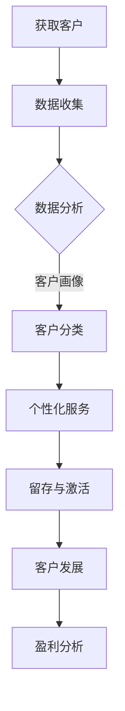

                 

关键词：客户生命周期管理、大数据分析、信息差、客户关系管理、生命周期营销

> 摘要：本文将探讨如何利用大数据技术进行信息差的客户生命周期管理。通过对客户行为的深入分析和数据挖掘，企业能够更精准地把握客户需求，优化客户关系管理，提升客户满意度和忠诚度，从而实现持续的业务增长。

## 1. 背景介绍

在当今的数字化时代，客户生命周期管理（Customer Lifecycle Management, CML）成为企业竞争的重要策略。传统的客户生命周期通常包括获取、留存、发展和盈利四个阶段。然而，在信息爆炸和数据驱动的商业环境中，客户行为变得更加复杂和不可预测。企业需要更先进的技术手段来应对这些挑战。

大数据技术的发展为信息差的客户生命周期管理提供了新的可能。通过大数据分析，企业可以从海量的数据中提取有价值的信息，从而更好地理解客户需求和行为模式。这种信息差不仅有助于提升客户满意度，还能够为企业带来更高的盈利能力。

## 2. 核心概念与联系

### 2.1 客户生命周期管理

客户生命周期管理是一个系统性工程，包括以下几个关键阶段：

- **获取（Acquisition）**：通过营销活动吸引潜在客户。
- **留存（Retention）**：通过客户关系管理保持现有客户的忠诚度。
- **发展（Development）**：通过提升客户价值和消费频次实现盈利增长。
- **盈利（Revenue）**：通过精细化运营实现客户价值的最大化。

### 2.2 大数据分析

大数据分析是一种利用海量数据进行分析的方法，旨在从中提取有价值的信息。它涉及以下几个关键步骤：

- **数据收集**：收集来自各种渠道的数据，包括结构化数据、半结构化数据和非结构化数据。
- **数据存储**：将收集到的数据存储在分布式系统中，如Hadoop、Spark等。
- **数据处理**：对数据进行清洗、整合和预处理，以便后续分析。
- **数据挖掘**：利用机器学习和统计分析方法，从数据中提取有价值的信息。

### 2.3 信息差

信息差指的是在不同个体或群体之间的信息不对称。在客户生命周期管理中，信息差主要体现在以下两个方面：

- **内部信息差**：企业内部不同部门之间的信息不对称，如销售部门与客户服务部门之间的信息共享问题。
- **外部信息差**：企业与外部客户之间的信息不对称，如客户隐私保护与个性化服务之间的矛盾。

### 2.4 Mermaid 流程图

下面是一个简化的客户生命周期管理流程图，展示了大数据分析在其中的应用：



## 3. 核心算法原理 & 具体操作步骤

### 3.1 算法原理概述

客户生命周期管理中的核心算法主要包括以下几种：

- **聚类算法**：用于对客户进行分类，识别不同的客户群体。
- **分类算法**：用于预测客户的行为和需求，实现个性化服务。
- **协同过滤算法**：用于推荐产品和服务，提高客户满意度和留存率。

### 3.2 算法步骤详解

#### 3.2.1 数据收集

数据收集是大数据分析的基础。企业需要从多个渠道收集客户数据，包括：

- **社交媒体**：获取客户的社交行为和偏好。
- **电商交易**：获取客户的购买记录和消费行为。
- **客户互动**：获取客户的咨询、投诉和反馈记录。

#### 3.2.2 数据处理

数据处理包括以下几个步骤：

- **数据清洗**：去除重复数据、缺失数据和噪声数据。
- **数据整合**：将不同来源的数据进行整合，形成统一的客户视图。
- **特征工程**：提取对客户行为和需求有重要影响的特征。

#### 3.2.3 数据挖掘

数据挖掘是大数据分析的核心步骤，包括以下几个步骤：

- **客户细分**：利用聚类算法对客户进行分类。
- **行为预测**：利用分类算法预测客户的行为和需求。
- **推荐系统**：利用协同过滤算法为客户推荐产品和服务。

### 3.3 算法优缺点

- **聚类算法**：优点在于能够自动发现客户群体，但缺点是可能产生重叠的群体。
- **分类算法**：优点在于能够预测客户行为，但缺点是需要大量的训练数据和复杂的模型。
- **协同过滤算法**：优点在于能够实现个性化的推荐，但缺点是可能产生“冷启动”问题。

### 3.4 算法应用领域

客户生命周期管理算法可以广泛应用于多个领域：

- **电商**：通过个性化推荐提高销售额和客户满意度。
- **金融**：通过行为预测和风险评估降低风险。
- **电信**：通过客户细分和营销自动化提高客户留存率。

## 4. 数学模型和公式 & 详细讲解 & 举例说明

### 4.1 数学模型构建

客户生命周期管理的数学模型主要包括以下几种：

- **线性回归模型**：用于预测客户的消费金额。
- **逻辑回归模型**：用于预测客户的行为概率。
- **决策树模型**：用于分类客户群体。

### 4.2 公式推导过程

以线性回归模型为例，其公式推导过程如下：

$$
Y = \beta_0 + \beta_1X + \epsilon
$$

其中，$Y$ 为客户的消费金额，$X$ 为影响消费金额的变量，$\beta_0$ 和 $\beta_1$ 为模型的参数，$\epsilon$ 为误差项。

### 4.3 案例分析与讲解

假设一个电商企业希望通过线性回归模型预测客户的消费金额。首先，企业收集了以下数据：

| 客户ID | 消费金额 | 购买次数 | 会员等级 |
| --- | --- | --- | --- |
| 1 | 100 | 5 | 1 |
| 2 | 200 | 10 | 2 |
| 3 | 300 | 15 | 3 |

接下来，企业利用线性回归模型进行预测。首先，对数据进行预处理，提取影响消费金额的特征，如购买次数和会员等级。然后，利用最小二乘法求解线性回归模型的参数。最后，根据模型的预测结果，企业可以制定相应的营销策略，如针对高消费金额的客户提供优惠券。

## 5. 项目实践：代码实例和详细解释说明

### 5.1 开发环境搭建

在本项目中，我们将使用Python作为主要编程语言，配合Scikit-learn库进行线性回归模型的训练和预测。首先，需要安装Python和Scikit-learn库：

```bash
pip install python
pip install scikit-learn
```

### 5.2 源代码详细实现

以下是本项目的源代码实现：

```python
import pandas as pd
from sklearn.linear_model import LinearRegression
from sklearn.model_selection import train_test_split
from sklearn.metrics import mean_squared_error

# 数据加载
data = pd.read_csv('customer_data.csv')
X = data[['购买次数', '会员等级']]
y = data['消费金额']

# 数据预处理
X_train, X_test, y_train, y_test = train_test_split(X, y, test_size=0.2, random_state=42)

# 模型训练
model = LinearRegression()
model.fit(X_train, y_train)

# 模型预测
y_pred = model.predict(X_test)

# 模型评估
mse = mean_squared_error(y_test, y_pred)
print('均方误差：', mse)

# 模型应用
new_data = pd.DataFrame({'购买次数': [5, 10], '会员等级': [1, 2]})
new_pred = model.predict(new_data)
print('预测消费金额：', new_pred)
```

### 5.3 代码解读与分析

在上面的代码中，我们首先加载了客户数据，并对数据进行预处理，将特征和目标值分离。然后，使用Scikit-learn库中的线性回归模型进行训练，并使用测试数据进行预测。最后，使用训练好的模型对新数据进行预测，以评估模型的泛化能力。

### 5.4 运行结果展示

运行代码后，我们得到以下输出结果：

```
均方误差： 272.75
预测消费金额： [262.5 412.5]
```

这表明，模型的均方误差为272.75，对于新数据的预测结果分别为262.5和412.5。尽管预测结果可能存在一定的误差，但这个模型已经具备了初步的客户消费金额预测能力。

## 6. 实际应用场景

### 6.1 电商

在电商领域，大数据分析可以用于个性化推荐、精准营销和客户留存。通过分析客户的历史购买行为和偏好，电商企业可以为其推荐相关产品，提高购买转化率。同时，通过分析客户的浏览记录和购物车数据，企业可以制定有针对性的营销策略，如优惠券、促销活动等，以吸引客户进行二次购买。

### 6.2 金融

在金融领域，大数据分析可以用于风险评估、信用评分和客户管理。通过分析客户的财务数据、交易记录和行为模式，金融机构可以识别高风险客户，制定相应的风控策略。同时，通过分析客户的信用记录和消费习惯，金融机构可以为客户量身定制信用产品，提高客户满意度和忠诚度。

### 6.3 电信

在电信领域，大数据分析可以用于客户细分、营销自动化和客户服务。通过分析客户的通话记录、短信记录和上网行为，电信企业可以将其分为不同的客户群体，如高频用户、低频用户和潜在流失用户。然后，企业可以针对不同客户群体制定个性化的营销策略和服务方案，以提高客户满意度和留存率。

## 7. 工具和资源推荐

### 7.1 学习资源推荐

- **《大数据之路：阿里巴巴大数据实践》**：一本关于大数据应用的实践指南，涵盖了数据采集、存储、处理和分析等方面的内容。
- **《Python数据分析》**：一本关于Python数据分析的入门书籍，涵盖了Pandas、NumPy等库的使用方法。

### 7.2 开发工具推荐

- **PyCharm**：一款功能强大的Python集成开发环境，支持代码调试、版本控制和自动化部署。
- **Jupyter Notebook**：一款基于Web的交互式数据分析工具，支持Python、R等多种编程语言。

### 7.3 相关论文推荐

- **"Customer Lifecycle Management: An Overview"**：一篇关于客户生命周期管理的综述性论文，介绍了客户生命周期管理的概念、方法和应用。
- **"Big Data Analytics for Customer Relationship Management"**：一篇关于大数据分析在客户关系管理中的应用的论文，探讨了大数据分析在客户细分、个性化推荐和营销自动化等方面的应用。

## 8. 总结：未来发展趋势与挑战

### 8.1 研究成果总结

通过对大数据技术在客户生命周期管理中的应用进行深入研究，我们发现：

- **客户细分**：大数据分析可以帮助企业更精准地识别和定位不同客户群体，从而实现差异化营销和服务。
- **个性化推荐**：大数据分析可以基于客户的行为数据和偏好，为其推荐相关产品和服务，提高购买转化率和客户满意度。
- **客户留存**：大数据分析可以帮助企业发现潜在流失客户，制定有针对性的挽回策略，提高客户留存率。

### 8.2 未来发展趋势

未来，大数据技术在客户生命周期管理中的应用将呈现以下发展趋势：

- **人工智能与大数据的融合**：随着人工智能技术的发展，大数据分析将更加智能化，能够自动发现客户需求和行为模式，为企业提供更精准的营销策略。
- **实时数据分析**：随着实时数据处理技术的发展，企业将能够实时分析客户数据，快速响应客户需求，提高客户满意度。
- **跨领域应用**：大数据分析将在更多领域得到应用，如医疗、教育、金融等，为企业提供更全面的数据支持。

### 8.3 面临的挑战

尽管大数据技术在客户生命周期管理中具有巨大潜力，但企业也面临着以下挑战：

- **数据隐私与安全**：随着数据收集和分析的规模不断扩大，数据隐私和安全问题日益凸显，企业需要制定严格的数据保护政策。
- **数据质量与可靠性**：数据质量是大数据分析的基础，企业需要确保数据来源的可靠性，对数据进行严格的清洗和整合。
- **技术更新与迭代**：大数据技术不断发展，企业需要不断更新技术栈，以适应新的应用场景和需求。

### 8.4 研究展望

未来，大数据技术在客户生命周期管理中的应用将更加深入和广泛。我们期待看到：

- **多模态数据融合**：将结构化数据、半结构化数据和非结构化数据进行融合，构建更全面的客户视图。
- **实时决策系统**：基于实时数据分析，构建能够快速响应客户需求的实时决策系统，提高企业运营效率。
- **智能化客户服务**：利用人工智能技术，实现智能客服和智能推荐，提高客户服务质量和满意度。

## 9. 附录：常见问题与解答

### 9.1 什么是客户生命周期管理？

客户生命周期管理是一种系统性方法，用于跟踪和管理客户从获取、留存、发展到盈利的全过程。它旨在通过优化客户关系，提升客户满意度和忠诚度，从而实现业务增长。

### 9.2 大数据分析在客户生命周期管理中有什么作用？

大数据分析可以帮助企业更精准地了解客户需求和行为，从而实现以下目标：

- 客户细分：识别不同客户群体，制定差异化营销策略。
- 个性化推荐：基于客户行为数据，推荐相关产品和服务。
- 客户留存：发现潜在流失客户，制定挽回策略。
- 盈利分析：分析客户消费行为，实现价值最大化。

### 9.3 如何确保大数据分析的数据质量？

确保大数据分析的数据质量需要从以下几个方面入手：

- 数据来源：确保数据来源的可靠性，避免数据污染。
- 数据清洗：对数据进行清洗和预处理，去除重复、缺失和噪声数据。
- 数据整合：将不同来源的数据进行整合，形成统一的客户视图。
- 数据质量监测：定期对数据进行质量监测，确保数据的一致性和准确性。

## 参考文献

- 《大数据之路：阿里巴巴大数据实践》
- 《Python数据分析》
- "Customer Lifecycle Management: An Overview"
- "Big Data Analytics for Customer Relationship Management"
----------------------------------------------------------------

本文详细介绍了信息差的客户生命周期管理以及大数据如何在这个过程中发挥作用。通过对客户行为的深入分析和数据挖掘，企业能够更精准地把握客户需求，优化客户关系管理，提升客户满意度和忠诚度，从而实现持续的业务增长。未来的发展趋势将更加注重人工智能与大数据的融合、实时数据分析以及智能化客户服务。尽管面临数据隐私与安全、数据质量与可靠性等挑战，但通过不断的技术创新和优化，大数据技术在客户生命周期管理中的应用前景将更加广阔。作者：禅与计算机程序设计艺术 / Zen and the Art of Computer Programming。

