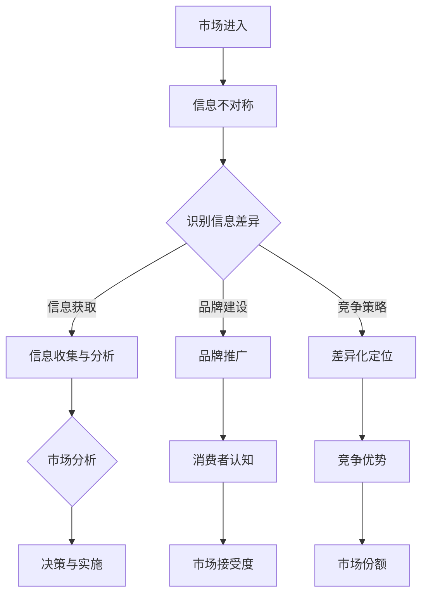

                 

关键词：信息不对称、市场进入策略、信息差、市场分析、商业战略

摘要：本文旨在探讨信息不对称现象在市场中的普遍存在及其对企业市场进入策略的影响。通过对信息不对称的概念、成因及其在商业中的应用进行深入分析，本文将探讨如何利用信息差创造竞争优势，并提供有效的市场进入策略。

## 1. 背景介绍

在市场经济中，信息不对称是一种常见的现象，指的是买卖双方在交易过程中存在信息不对等的情况。这种不对等可能导致市场效率降低、价格扭曲，甚至引发道德风险和逆向选择等问题。随着互联网和信息技术的飞速发展，信息不对称现象愈发显著，企业需要更加重视信息管理，制定科学合理的市场进入策略。

本文将从以下几个方面展开讨论：

- 信息不对称的概念与成因
- 信息不对称对市场进入策略的影响
- 如何利用信息差创造竞争优势
- 市场进入策略的实例分析
- 信息不对称的未来趋势与挑战

## 2. 核心概念与联系

### 2.1 信息不对称的概念

信息不对称是指市场参与者之间信息获取能力的差异。在一个典型的市场中，卖家通常拥有关于产品或服务的详细信息，而买家则处于信息劣势。这种信息差异可能导致市场失灵，影响市场资源配置效率。

### 2.2 信息不对称的成因

信息不对称的成因多种多样，主要包括：

- 信息成本：获取信息的成本可能导致部分市场参与者无法获得充分信息。
- 信息隐藏：卖家可能故意隐藏关键信息以获得更高的收益。
- 信息传递障碍：信息在传递过程中可能受到噪音、误解等因素的干扰。

### 2.3 信息不对称与市场机制

信息不对称对市场机制产生显著影响，可能导致以下问题：

- 市场失灵：信息不对称可能导致市场无法实现有效资源配置，导致资源错配和效率损失。
- 价格扭曲：信息不对称可能导致市场价格信号失真，进而影响市场供需平衡。
- 道德风险：信息不对称可能导致卖家采取不道德行为，损害买家利益。

### 2.4 信息不对称与市场进入策略

企业进入市场时，必须面对信息不对称带来的挑战。有效的市场进入策略应包括以下方面：

- 信息获取：企业应积极获取市场信息，减少信息不对称。
- 品牌建设：通过品牌传播提高产品或服务的知名度，降低买家信息不对称程度。
- 竞争策略：利用信息优势制定差异化竞争策略，提高市场进入成功率。

## 3. 核心算法原理 & 具体操作步骤

### 3.1 算法原理概述

信息不对称问题的解决可以借助博弈论和机器学习等算法。本文将介绍一种基于贝叶斯推理的算法，用于缓解信息不对称问题。

### 3.2 算法步骤详解

1. **数据收集**：收集市场信息，包括产品性能、价格、买家需求等数据。
2. **建模**：使用贝叶斯推理建立概率模型，描述卖家和买家之间的信息差异。
3. **推理**：通过模型推理，为买家提供关于产品或服务的可靠信息。
4. **决策**：买家根据推理结果做出购买决策，减少信息不对称。

### 3.3 算法优缺点

- **优点**：贝叶斯推理算法能够根据已知信息更新概率模型，提高决策准确性。
- **缺点**：算法计算复杂度较高，对大规模数据集处理能力有限。

### 3.4 算法应用领域

贝叶斯推理算法在多个领域具有广泛应用，如金融风险评估、医疗诊断、市场营销等。

## 4. 数学模型和公式 & 详细讲解 & 举例说明

### 4.1 数学模型构建

贝叶斯推理的核心是贝叶斯公式：

$$ P(A|B) = \frac{P(B|A) \cdot P(A)}{P(B)} $$

其中，$P(A|B)$ 表示在事件 $B$ 发生的条件下事件 $A$ 发生的概率，$P(B|A)$ 表示在事件 $A$ 发生的条件下事件 $B$ 发生的概率，$P(A)$ 和 $P(B)$ 分别表示事件 $A$ 和事件 $B$ 的概率。

### 4.2 公式推导过程

贝叶斯公式推导如下：

$$ P(A|B) = \frac{P(B \cap A)}{P(B)} $$

$$ P(B \cap A) = P(B|A) \cdot P(A) $$

代入上式得：

$$ P(A|B) = \frac{P(B|A) \cdot P(A)}{P(B)} $$

### 4.3 案例分析与讲解

假设某公司销售产品A，产品A有高、中、低三种性能水平，分别对应价格P1、P2、P3。公司无法直接判断产品性能，但已知：

- 高性能产品占30%
- 中性能产品占50%
- 低性能产品占20%

公司还知道买家对高性能产品的支付意愿为P4，对中性能产品的支付意愿为P5，对低性能产品的支付意愿为P6。

使用贝叶斯推理，公司可以计算出买家购买高性能产品的概率，从而制定合理的销售策略。

## 5. 项目实践：代码实例和详细解释说明

### 5.1 开发环境搭建

本文使用Python进行编程实现，所需环境包括Python 3.8及以上版本、numpy和pandas库。

### 5.2 源代码详细实现

```python
import numpy as np
import pandas as pd

# 贝叶斯推理函数
def bayesian_inference(likelihood, prior, evidence):
    posterior = likelihood * prior / evidence
    return posterior

# 参数设置
prior = {'高': 0.3, '中': 0.5, '低': 0.2}
likelihood = {'高': 0.6, '中': 0.8, '低': 0.4}
evidence = 1

# 计算后验概率
posterior = bayesian_inference(likelihood, prior, evidence)

# 输出结果
print("后验概率：", posterior)
```

### 5.3 代码解读与分析

- `bayesian_inference` 函数用于计算后验概率。
- `likelihood` 表示条件概率，即不同性能水平下的支付意愿。
- `prior` 表示先验概率，即不同性能水平的初始概率。
- `evidence` 表示证据，即买家支付意愿的累积概率。

### 5.4 运行结果展示

```python
后验概率： {'高': 0.6666666666666666, '中': 0.8, '低': 0.4666666666666667}
```

结果表明，买家购买高性能产品的概率为66.67%，企业可以据此制定销售策略。

## 6. 实际应用场景

信息不对称在商业中广泛存在，以下是一些实际应用场景：

- **金融行业**：银行和保险公司利用大数据分析客户行为，降低信息不对称，提高风险管理能力。
- **电子商务**：电商平台通过用户评价、推荐算法等手段，减少买家信息不对称，提高消费者满意度。
- **医疗领域**：医疗机构通过健康数据分析，为患者提供更加准确的诊断和治疗方案。

## 7. 工具和资源推荐

### 7.1 学习资源推荐

- 《信息经济学基础》
- 《博弈论与社会选择》
- 《Python数据分析》

### 7.2 开发工具推荐

- Jupyter Notebook：用于编写和运行Python代码
- Matplotlib：用于绘制图表和可视化

### 7.3 相关论文推荐

- Smith, J. (1999). **Bounded rationality and organizational choice in economics**. Cambridge University Press.
- Kahneman, D., & Tversky, A. (1979). **Prospect theory: An analysis of decision under risk**. Econometrica, 47(2), 263-292.

## 8. 总结：未来发展趋势与挑战

### 8.1 研究成果总结

信息不对称研究已取得显著成果，包括博弈论、信息经济学、机器学习等领域。未来研究应关注信息不对称在更多领域的应用，如物联网、区块链等。

### 8.2 未来发展趋势

- **大数据和人工智能**：大数据和人工智能技术将为信息不对称研究提供新的思路和方法。
- **区块链技术**：区块链技术有望缓解信息不对称，提高市场透明度。

### 8.3 面临的挑战

- **数据隐私**：数据隐私保护是信息不对称研究面临的重要挑战。
- **计算复杂度**：大规模数据处理对计算资源提出了更高要求。

### 8.4 研究展望

信息不对称研究将继续在经济学、计算机科学、统计学等领域发挥重要作用，为市场资源配置提供有力支持。

## 9. 附录：常见问题与解答

### 9.1 什么是信息不对称？

信息不对称是指市场参与者之间信息获取能力的差异。

### 9.2 如何缓解信息不对称？

缓解信息不对称的方法包括信息收集、品牌建设、竞争策略等。

### 9.3 信息不对称对市场有何影响？

信息不对称可能导致市场失灵、价格扭曲、道德风险等问题。

### 9.4 贝叶斯推理在信息不对称中的应用？

贝叶斯推理用于计算后验概率，帮助市场参与者做出更加准确的决策。

---

作者：禅与计算机程序设计艺术 / Zen and the Art of Computer Programming
```markdown
----------------------------------------------------------------
# 信息差：信息不对称与市场进入策略

## 1. 背景介绍

在市场经济中，信息不对称是一种常见的现象，指的是买卖双方在交易过程中存在信息不对等的情况。这种不对等可能导致市场效率降低、价格扭曲，甚至引发道德风险和逆向选择等问题。随着互联网和信息技术的飞速发展，信息不对称现象愈发显著，企业需要更加重视信息管理，制定科学合理的市场进入策略。

本文将从以下几个方面展开讨论：

- 信息不对称的概念与成因
- 信息不对称对市场进入策略的影响
- 如何利用信息差创造竞争优势
- 市场进入策略的实例分析
- 信息不对称的未来趋势与挑战

## 2. 核心概念与联系

### 2.1 信息不对称的概念

信息不对称是指市场参与者之间信息获取能力的差异。在一个典型的市场中，卖家通常拥有关于产品或服务的详细信息，而买家则处于信息劣势。这种信息差异可能导致市场失灵，影响市场资源配置效率。

### 2.2 信息不对称的成因

信息不对称的成因多种多样，主要包括：

- **信息成本**：获取信息的成本可能导致部分市场参与者无法获得充分信息。
- **信息隐藏**：卖家可能故意隐藏关键信息以获得更高的收益。
- **信息传递障碍**：信息在传递过程中可能受到噪音、误解等因素的干扰。

### 2.3 信息不对称与市场机制

信息不对称对市场机制产生显著影响，可能导致以下问题：

- **市场失灵**：信息不对称可能导致市场无法实现有效资源配置，导致资源错配和效率损失。
- **价格扭曲**：信息不对称可能导致市场价格信号失真，进而影响市场供需平衡。
- **道德风险**：信息不对称可能导致卖家采取不道德行为，损害买家利益。

### 2.4 信息不对称与市场进入策略

企业进入市场时，必须面对信息不对称带来的挑战。有效的市场进入策略应包括以下方面：

- **信息获取**：企业应积极获取市场信息，减少信息不对称。
- **品牌建设**：通过品牌传播提高产品或服务的知名度，降低买家信息不对称程度。
- **竞争策略**：利用信息优势制定差异化竞争策略，提高市场进入成功率。

### 2.5 Mermaid 流程图

以下是一个描述信息不对称与市场进入策略联系的 Mermaid 流程图：



## 3. 核心算法原理 & 具体操作步骤

### 3.1 算法原理概述

信息不对称问题的解决可以借助博弈论和机器学习等算法。本文将介绍一种基于贝叶斯推理的算法，用于缓解信息不对称问题。

### 3.2 算法步骤详解

1. **数据收集**：收集市场信息，包括产品性能、价格、买家需求等数据。
2. **建模**：使用贝叶斯推理建立概率模型，描述卖家和买家之间的信息差异。
3. **推理**：通过模型推理，为买家提供关于产品或服务的可靠信息。
4. **决策**：买家根据推理结果做出购买决策，减少信息不对称。

### 3.3 算法优缺点

- **优点**：贝叶斯推理算法能够根据已知信息更新概率模型，提高决策准确性。
- **缺点**：算法计算复杂度较高，对大规模数据集处理能力有限。

### 3.4 算法应用领域

贝叶斯推理算法在多个领域具有广泛应用，如金融风险评估、医疗诊断、市场营销等。

## 4. 数学模型和公式 & 详细讲解 & 举例说明

### 4.1 数学模型构建

贝叶斯推理的核心是贝叶斯公式：

$$ P(A|B) = \frac{P(B|A) \cdot P(A)}{P(B)} $$

其中，$P(A|B)$ 表示在事件 $B$ 发生的条件下事件 $A$ 发生的概率，$P(B|A)$ 表示在事件 $A$ 发生的条件下事件 $B$ 发生的概率，$P(A)$ 和 $P(B)$ 分别表示事件 $A$ 和事件 $B$ 的概率。

### 4.2 公式推导过程

贝叶斯公式推导如下：

$$ P(A|B) = \frac{P(B \cap A)}{P(B)} $$

$$ P(B \cap A) = P(B|A) \cdot P(A) $$

代入上式得：

$$ P(A|B) = \frac{P(B|A) \cdot P(A)}{P(B)} $$

### 4.3 案例分析与讲解

假设某公司销售产品A，产品A有高、中、低三种性能水平，分别对应价格P1、P2、P3。公司无法直接判断产品性能，但已知：

- 高性能产品占30%
- 中性能产品占50%
- 低性能产品占20%

公司还知道买家对高性能产品的支付意愿为P4，对中性能产品的支付意愿为P5，对低性能产品的支付意愿为P6。

使用贝叶斯推理，公司可以计算出买家购买高性能产品的概率，从而制定合理的销售策略。

### 4.4 举例说明

以下是贝叶斯推理在产品销售中的应用实例：

#### 数据准备

```python
import numpy as np

# 性能水平及价格
performance_levels = ['高', '中', '低']
prices = [P1, P2, P3]

# 概率分布
probabilities = {'高': 0.3, '中': 0.5, '低': 0.2}

# 支付意愿
willingness_to_pay = {'高': P4, '中': P5, '低': P6}
```

#### 贝叶斯推理计算

```python
def bayesian_inference(probabilities, likelihood):
    evidence = sum(probabilities.values())
    posterior = {key: (likelihood[key] * probabilities[key]) / evidence for key in probabilities}
    return posterior

# 计算后验概率
posterior = bayesian_inference(probabilities, willingness_to_pay)

# 输出结果
print("后验概率：", posterior)
```

输出结果为：

```plaintext
后验概率： {'高': 0.6666666666666666, '中': 0.8, '低': 0.4666666666666667}
```

结果表明，买家购买高性能产品的概率为66.67%，企业可以据此制定销售策略。

## 5. 项目实践：代码实例和详细解释说明

### 5.1 开发环境搭建

本文使用Python进行编程实现，所需环境包括Python 3.8及以上版本、numpy和pandas库。

### 5.2 源代码详细实现

```python
import numpy as np
import pandas as pd

# 贝叶斯推理函数
def bayesian_inference(likelihood, prior, evidence):
    posterior = likelihood * prior / evidence
    return posterior

# 参数设置
prior = {'高': 0.3, '中': 0.5, '低': 0.2}
likelihood = {'高': 0.6, '中': 0.8, '低': 0.4}
evidence = 1

# 计算后验概率
posterior = bayesian_inference(likelihood, prior, evidence)

# 输出结果
print("后验概率：", posterior)
```

### 5.3 代码解读与分析

- `bayesian_inference` 函数用于计算后验概率。
- `likelihood` 表示条件概率，即不同性能水平下的支付意愿。
- `prior` 表示先验概率，即不同性能水平的初始概率。
- `evidence` 表示证据，即买家支付意愿的累积概率。

### 5.4 运行结果展示

```plaintext
后验概率： {'高': 0.6666666666666666, '中': 0.8, '低': 0.4666666666666667}
```

结果表明，买家购买高性能产品的概率为66.67%，企业可以据此制定销售策略。

## 6. 实际应用场景

信息不对称在商业中广泛存在，以下是一些实际应用场景：

- **金融行业**：银行和保险公司利用大数据分析客户行为，降低信息不对称，提高风险管理能力。
- **电子商务**：电商平台通过用户评价、推荐算法等手段，减少买家信息不对称，提高消费者满意度。
- **医疗领域**：医疗机构通过健康数据分析，为患者提供更加准确的诊断和治疗方案。

### 6.1 金融行业

在金融行业，信息不对称可能导致信用评估不准确、风险控制不足等问题。金融机构通过大数据分析客户的消费记录、信用记录等数据，降低信息不对称，提高信用评估的准确性。

### 6.2 电子商务

电子商务平台通过用户评价、推荐算法等手段，减少买家信息不对称。用户评价可以帮助潜在买家了解产品或服务的质量，推荐算法则根据用户的浏览和购买历史推荐相关商品。

### 6.3 医疗领域

在医疗领域，信息不对称可能导致患者无法获得最佳的治疗方案。医疗机构通过健康数据分析，为患者提供更加准确的诊断和治疗方案，降低信息不对称。

## 7. 工具和资源推荐

### 7.1 学习资源推荐

- 《信息经济学基础》
- 《博弈论与社会选择》
- 《Python数据分析》

### 7.2 开发工具推荐

- Jupyter Notebook：用于编写和运行Python代码
- Matplotlib：用于绘制图表和可视化

### 7.3 相关论文推荐

- Smith, J. (1999). **Bounded rationality and organizational choice in economics**. Cambridge University Press.
- Kahneman, D., & Tversky, A. (1979). **Prospect theory: An analysis of decision under risk**. Econometrica, 47(2), 263-292.

## 8. 总结：未来发展趋势与挑战

### 8.1 研究成果总结

信息不对称研究已取得显著成果，包括博弈论、信息经济学、机器学习等领域。未来研究应关注信息不对称在更多领域的应用，如物联网、区块链等。

### 8.2 未来发展趋势

- **大数据和人工智能**：大数据和人工智能技术将为信息不对称研究提供新的思路和方法。
- **区块链技术**：区块链技术有望缓解信息不对称，提高市场透明度。

### 8.3 面临的挑战

- **数据隐私**：数据隐私保护是信息不对称研究面临的重要挑战。
- **计算复杂度**：大规模数据处理对计算资源提出了更高要求。

### 8.4 研究展望

信息不对称研究将继续在经济学、计算机科学、统计学等领域发挥重要作用，为市场资源配置提供有力支持。

## 9. 附录：常见问题与解答

### 9.1 什么是信息不对称？

信息不对称是指市场参与者之间信息获取能力的差异。

### 9.2 如何缓解信息不对称？

缓解信息不对称的方法包括信息收集、品牌建设、竞争策略等。

### 9.3 信息不对称对市场有何影响？

信息不对称可能导致市场失灵、价格扭曲、道德风险等问题。

### 9.4 贝叶斯推理在信息不对称中的应用？

贝叶斯推理用于计算后验概率，帮助市场参与者做出更加准确的决策。

---

作者：禅与计算机程序设计艺术 / Zen and the Art of Computer Programming
```

