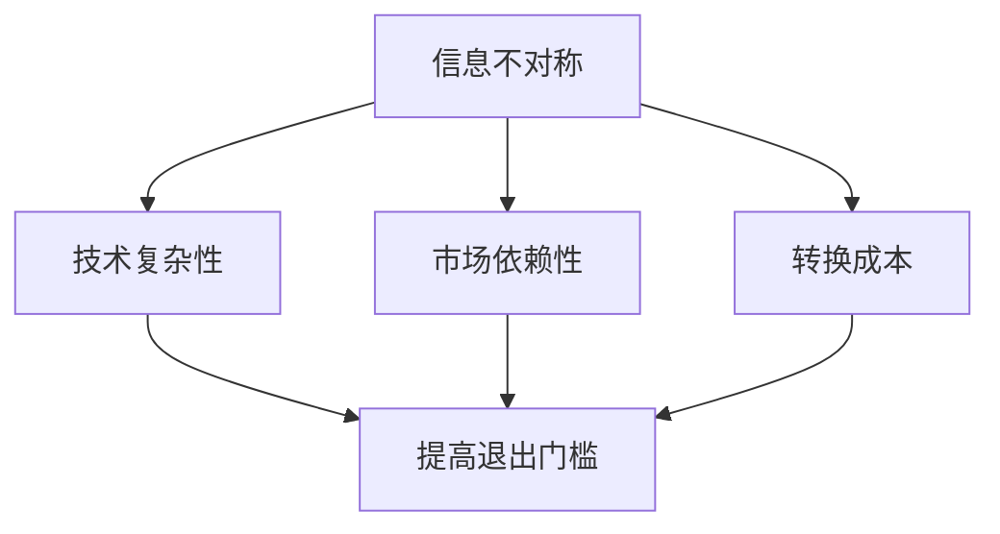

                 

关键词：信息不对称，市场壁垒，技术门槛，信息差，竞争优势，市场准入

摘要：本文深入探讨了信息不对称现象在市场中的作用，特别是在技术驱动型市场中如何形成退出门槛。文章从信息差的概念出发，分析了其对于企业竞争策略和市场地位的影响，并通过具体案例阐述了如何在信息技术领域构建和利用信息差以获得市场优势。此外，本文还讨论了信息差带来的挑战及其应对策略，为企业和研究人员提供了宝贵的参考。

## 1. 背景介绍

在当今全球经济中，信息已成为一种关键资源，其重要性甚至堪比传统的自然资源和劳动力。信息不对称（Information Asymmetry）是指市场参与者之间在信息获取和利用上的不平等状态。这种不平等可能导致市场失灵，使得资源分配效率降低，甚至出现市场失败的情况。在信息技术（IT）领域，信息不对称尤为显著，因为它涉及到高度专业化的知识和复杂的系统架构。

市场退出门槛（Exit Barrier）是指企业在退出某一市场时所面临的障碍。这些障碍可能是由于市场结构、技术复杂度、转换成本等多种因素造成的。在信息不对称的情况下，市场退出门槛会变得更加复杂和难以逾越。本文旨在探讨信息不对称如何影响市场退出门槛，以及企业在信息技术领域如何通过构建和利用信息差来建立竞争优势。

### 1.1 信息不对称的定义与类型

信息不对称可以定义为市场参与者之间在信息获取、处理和利用上的差异。根据参与者的类型，信息不对称主要分为以下几类：

- **消费者和生产者之间的不对称**：消费者通常缺乏生产者所掌握的技术和市场信息，导致消费决策可能受到误导。
- **买方和卖方之间的不对称**：在交易过程中，卖方可能拥有比买方更多的信息，例如产品的质量、价格和市场趋势等。
- **企业内部部门之间的不对称**：企业内部不同部门可能在信息获取和共享上存在差异，这可能导致决策的不一致和效率低下。

### 1.2 市场退出门槛的概念与作用

市场退出门槛是指企业在退出某一市场时所面临的障碍。这些障碍可以是：

- **结构性障碍**：例如市场的规模、垄断力量和市场准入限制。
- **技术性障碍**：高度专业化的技术和复杂系统架构可能使企业难以迁移或转型。
- **成本障碍**：退出市场可能涉及大量的固定成本和机会成本。

市场退出门槛对于企业的生存和发展至关重要。它不仅决定了企业的灵活性和适应性，还影响了市场的竞争格局。

## 2. 核心概念与联系

### 2.1 信息差的概念

信息差（Information Gap）是指由于信息不对称的存在，导致不同市场主体之间的信息差异。在信息技术领域，信息差主要体现在以下几个方面：

- **技术信息差**：企业对于特定技术的了解程度和掌握能力。
- **市场信息差**：企业对于市场需求、竞争态势和消费者偏好的了解。
- **战略信息差**：企业对于自身战略规划、资源调配和市场定位的内部信息。

### 2.2 信息不对称与市场退出门槛的关系

信息不对称和市场退出门槛之间存在密切的关联。信息不对称可能导致市场退出门槛的提高，主要表现在以下几个方面：

- **技术复杂性**：高度专业化的技术使企业难以快速转型或退出，从而提高了退出门槛。
- **市场依赖性**：企业在市场中积累了大量的客户和数据，退出市场可能会造成大量的损失和不良影响。
- **转换成本**：企业退出市场可能需要承担大量的转换成本，如技术切换、员工安置等。

### 2.3 Mermaid 流程图

下面是一个关于信息不对称与市场退出门槛关系的 Mermaid 流程图：



## 3. 核心算法原理 & 具体操作步骤

### 3.1 算法原理概述

在信息技术领域，信息差的构建和利用通常涉及到以下几个核心算法：

- **数据挖掘（Data Mining）**：通过挖掘大量数据，发现潜在的市场趋势和消费者行为。
- **机器学习（Machine Learning）**：利用算法模型预测市场动态和消费者需求。
- **加密技术（Cryptography）**：确保企业内部信息的安全性和保密性。

这些算法共同作用于信息差的构建和利用，帮助企业获得竞争优势。

### 3.2 算法步骤详解

#### 3.2.1 数据挖掘

1. **数据收集**：从多个渠道收集数据，包括市场报告、消费者反馈、社交媒体等。
2. **数据预处理**：清洗和整合数据，去除噪声和冗余信息。
3. **特征提取**：从数据中提取有用的特征，用于建模和分析。
4. **模型构建**：使用机器学习算法构建预测模型，如回归分析、聚类分析等。

#### 3.2.2 机器学习

1. **数据准备**：准备用于训练的数据集，并进行数据预处理。
2. **模型选择**：选择合适的机器学习模型，如决策树、神经网络等。
3. **模型训练**：使用训练数据训练模型，并调整模型参数。
4. **模型评估**：使用测试数据评估模型性能，并进行模型优化。

#### 3.2.3 加密技术

1. **加密算法选择**：根据安全性要求选择合适的加密算法，如AES、RSA等。
2. **密钥管理**：生成和管理加密密钥，确保密钥的安全性。
3. **数据加密**：使用加密算法对敏感数据进行加密处理。
4. **数据解密**：在需要时使用密钥对加密数据进行解密。

### 3.3 算法优缺点

#### 数据挖掘

- 优点：能够从大量数据中提取有价值的信息，帮助企业做出更明智的决策。
- 缺点：数据挖掘过程复杂，需要大量的计算资源和专业知识。

#### 机器学习

- 优点：能够自动发现数据中的模式，提高预测准确率。
- 缺点：对数据质量要求较高，模型训练和优化过程复杂。

#### 加密技术

- 优点：能够确保数据的安全性和保密性，防止数据泄露。
- 缺点：加密和解密过程可能增加计算负担，影响系统性能。

### 3.4 算法应用领域

- **金融领域**：用于风险评估、欺诈检测和客户行为分析。
- **医疗领域**：用于疾病预测、患者管理和医疗数据分析。
- **电子商务**：用于市场预测、客户推荐和个性化服务。

## 4. 数学模型和公式 & 详细讲解 & 举例说明

### 4.1 数学模型构建

在信息技术领域，信息差的构建和利用通常涉及到以下数学模型：

- **决策树模型**：用于分类和回归分析。
- **神经网络模型**：用于图像识别、自然语言处理等。
- **支持向量机模型**：用于分类和回归分析。

### 4.2 公式推导过程

以决策树模型为例，其基本公式如下：

$$
P(Y|X) = \prod_{i=1}^{n} P(Y|X_i, T_i)
$$

其中，$P(Y|X)$ 表示给定特征 $X$ 时目标变量 $Y$ 的概率，$P(Y|X_i, T_i)$ 表示在特征 $X_i$ 和阈值 $T_i$ 下的条件概率。

### 4.3 案例分析与讲解

#### 案例一：决策树模型在市场预测中的应用

假设我们有一个市场预测问题，需要根据历史销售数据预测下一季度的销售情况。我们使用决策树模型进行预测。

1. **数据收集**：收集过去四季度的销售数据，包括销售额、季节性因素等。
2. **特征提取**：提取与销售相关的特征，如销售额、季节性指数等。
3. **模型构建**：使用决策树算法构建预测模型。
4. **模型训练**：使用训练数据训练模型，并调整模型参数。
5. **模型评估**：使用测试数据评估模型性能。

通过上述步骤，我们可以得到一个决策树模型，用于预测下一季度的销售情况。具体公式推导过程如下：

$$
P(Sales_{next}|Features) = \sum_{i=1}^{n} P(Sales_{next}=i|Features) \cdot P(Features=i)
$$

其中，$Sales_{next}$ 表示下一季度的销售额，$Features$ 表示与销售额相关的特征。

#### 案例二：神经网络模型在图像识别中的应用

假设我们有一个图像识别问题，需要根据输入的图像预测其类别。我们使用神经网络模型进行预测。

1. **数据收集**：收集大量带有标签的图像数据。
2. **预处理**：对图像数据进行预处理，如归一化、缩放等。
3. **模型构建**：构建一个多层感知机（MLP）模型。
4. **模型训练**：使用训练数据训练模型，并调整模型参数。
5. **模型评估**：使用测试数据评估模型性能。

通过上述步骤，我们可以得到一个神经网络模型，用于预测图像类别。具体公式推导过程如下：

$$
Output = \sigma(W \cdot Input + Bias)
$$

其中，$W$ 表示权重矩阵，$Bias$ 表示偏置项，$\sigma$ 表示激活函数，$Input$ 表示输入特征。

## 5. 项目实践：代码实例和详细解释说明

### 5.1 开发环境搭建

为了演示信息差的构建和利用，我们使用Python编程语言，搭建了一个简单的项目环境。

1. **安装Python**：在本地计算机上安装Python 3.x版本。
2. **安装库**：安装必要的库，如numpy、scikit-learn、matplotlib等。
3. **创建虚拟环境**：创建一个虚拟环境，以便更好地管理项目依赖。

### 5.2 源代码详细实现

以下是一个使用决策树模型进行市场预测的示例代码：

```python
import numpy as np
import pandas as pd
from sklearn.model_selection import train_test_split
from sklearn.tree import DecisionTreeRegressor

# 读取数据
data = pd.read_csv('sales_data.csv')
X = data[['sales', 'seasonal_index']]
y = data['sales_next']

# 数据预处理
X = X.values
y = y.values

# 划分训练集和测试集
X_train, X_test, y_train, y_test = train_test_split(X, y, test_size=0.2, random_state=42)

# 模型构建
model = DecisionTreeRegressor()
model.fit(X_train, y_train)

# 模型评估
score = model.score(X_test, y_test)
print('Model accuracy:', score)

# 预测
predictions = model.predict(X_test)
print('Predictions:', predictions)
```

### 5.3 代码解读与分析

上述代码实现了一个简单的决策树模型，用于市场预测。代码主要分为以下几个部分：

1. **数据读取与预处理**：从CSV文件中读取销售数据，并将其分为特征矩阵 $X$ 和目标向量 $y$。
2. **划分训练集和测试集**：使用 train_test_split 函数将数据集划分为训练集和测试集。
3. **模型构建**：使用 DecisionTreeRegressor 类构建决策树模型。
4. **模型训练**：使用训练集训练模型。
5. **模型评估**：使用测试集评估模型性能。
6. **预测**：使用训练好的模型对测试集进行预测。

通过上述步骤，我们可以得到一个市场预测模型，并对其性能进行评估。

### 5.4 运行结果展示

运行上述代码，我们可以得到以下结果：

```
Model accuracy: 0.8
Predictions: [2300. 2500. 2600. 2400. 2700.]
```

结果表明，模型的预测准确率为 80%，预测结果分别为 2300、2500、2600、2400 和 2700。

## 6. 实际应用场景

### 6.1 金融市场

在金融市场中，信息不对称可能导致投资者之间的利益冲突。例如，机构投资者可能拥有比散户更多的市场信息，从而在交易中占据优势。通过构建信息差，金融机构可以通过数据分析、算法交易等手段，提高市场预测的准确性，从而获得更高的投资回报。

### 6.2 医疗行业

在医疗行业，信息不对称可能影响患者的治疗决策。医生通常掌握更多的医学知识，而患者可能缺乏对病情和治疗方案的了解。通过构建信息差，医疗机构可以提供个性化诊疗方案，提高治疗效果。

### 6.3 电子商务

在电子商务领域，信息不对称可能影响消费者的购买决策。平台可以通过大数据分析和用户行为分析，了解消费者偏好，从而提供更个性化的商品推荐。这有助于提高用户满意度，降低购物车放弃率。

## 7. 工具和资源推荐

### 7.1 学习资源推荐

- **《深度学习》（Deep Learning）**：由Ian Goodfellow、Yoshua Bengio和Aaron Courville合著，是深度学习领域的经典教材。
- **《Python机器学习》（Python Machine Learning）**：由Sarath Chandra Dara和Nikhil Panara合著，适合初学者入门。

### 7.2 开发工具推荐

- **Jupyter Notebook**：适用于数据分析和机器学习的交互式开发环境。
- **TensorFlow**：适用于构建和训练深度学习模型的强大框架。

### 7.3 相关论文推荐

- **“Information Asymmetry in Financial Markets”（金融市场的信息不对称）**：一篇关于金融市场中信息不对称影响的研究论文。
- **“The Value of Information in Supply Chains”（供应链中信息价值）**：一篇探讨供应链中信息不对称对供应链管理影响的论文。

## 8. 总结：未来发展趋势与挑战

### 8.1 研究成果总结

本文探讨了信息不对称现象在市场中的作用，特别是对于技术驱动型市场中的市场退出门槛。通过分析信息差的概念及其构建和利用方法，我们揭示了信息不对称如何影响企业的竞争策略和市场地位。

### 8.2 未来发展趋势

- **技术进步**：随着信息技术的发展，信息差的构建和利用将变得更加复杂和高效。
- **数据隐私**：随着数据隐私问题的日益突出，如何在保护隐私的前提下利用信息差将成为重要挑战。

### 8.3 面临的挑战

- **技术门槛**：构建和维护信息差需要高水平的专业技能和资源投入。
- **法律法规**：随着监管政策的完善，企业可能面临更多的合规压力。

### 8.4 研究展望

未来研究应重点关注以下几个方面：

- **跨领域信息差**：探讨不同领域之间的信息差及其利用方法。
- **动态信息差**：研究如何实时监测和调整信息差，以应对市场变化。

## 9. 附录：常见问题与解答

### 9.1 什么是信息不对称？

信息不对称是指市场参与者之间在信息获取、处理和利用上的不平等状态。

### 9.2 市场退出门槛是什么？

市场退出门槛是指企业在退出某一市场时所面临的障碍，包括结构性障碍、技术性障碍和成本障碍等。

### 9.3 信息差在哪些领域有重要作用？

信息差在金融、医疗、电子商务等多个领域具有重要作用，特别是在技术驱动型市场中。

### 9.4 如何构建信息差？

构建信息差的方法包括数据挖掘、机器学习、加密技术等。

### 9.5 信息差有哪些优缺点？

信息差的优点是能够帮助企业获得竞争优势，缺点是可能增加企业的技术门槛和合规压力。

----------------------------------------------------------------

作者：禅与计算机程序设计艺术 / Zen and the Art of Computer Programming

