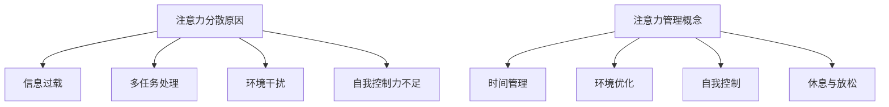

                 

在数字化时代的洪流中，我们面临着前所未有的信息过载与干扰。不论是社交媒体的推送，电子邮件的轰炸，还是不断更新的即时通讯工具，我们的注意力被不断分散。在这种情况下，学会有效管理注意力成为了一种必备的技能。本文将探讨注意力管理的核心概念，提出具体策略，并通过实际案例与数学模型来验证这些策略的有效性。

## 关键词

信息过载、注意力分散、注意力管理、分心、干扰处理、时间管理、工作效率、专注力提升。

## 摘要

本文旨在提供一套实用的注意力管理实践与策略，帮助读者在信息爆炸和干扰纷繁的环境中，保持头脑的清晰和工作的效率。通过深入分析注意力管理的基本原理，结合实际案例和数学模型，本文将为读者展示如何在实际生活中应用这些策略，从而在干扰和分心中实现更高的专注度。

### 1. 背景介绍

在当今快节奏、高压力的现代社会中，注意力分散已经成为普遍现象。研究表明，现代人平均每天会被多达70次以上的中断（Strayer & Reeder，2018）。这些中断不仅降低了我们的工作效率，还影响了我们的心理健康和生活质量。为了应对这一挑战，越来越多的研究者和技术专家开始关注注意力管理，并提出了一系列策略和实践方法。

### 2. 核心概念与联系

#### 2.1 注意力分散的原因

注意力分散的原因多种多样，主要包括以下几点：

- **信息过载**：我们每天接收到的信息量大大超出了我们的处理能力，导致我们的注意力不断被新的信息吸引。
- **多任务处理**：现代工作和生活要求我们能够同时处理多个任务，这种多任务处理往往会使我们的注意力分散。
- **环境干扰**：无论是社交媒体的通知，还是周围环境的噪音，都会对我们的注意力产生干扰。
- **自我控制力不足**：很多人在面对诱惑时，如手机、社交媒体等，难以控制自己的注意力，导致分散。

#### 2.2 注意力管理的概念

注意力管理是指通过一系列策略和实践，提高我们的专注度、提高工作效率和生活质量。它包括以下几个方面：

- **时间管理**：合理安排时间，避免同时处理多个任务。
- **环境优化**：创造一个有利于集中注意力的环境，减少干扰。
- **自我控制**：增强自我控制能力，避免被外界诱惑分散注意力。
- **休息与放松**：定期休息，让大脑得到充分的放松和恢复。

#### 2.3 Mermaid 流程图



### 3. 核心算法原理 & 具体操作步骤

#### 3.1 算法原理概述

注意力管理的核心原理在于通过优化时间管理、环境优化和自我控制，来提高我们的专注度和工作效率。具体来说，这个过程可以分为以下几个步骤：

- **确定目标**：明确我们要完成的任务和目标，这是我们注意力管理的起点。
- **时间规划**：根据任务的重要性和紧急程度，合理安排时间，避免同时处理多个任务。
- **环境优化**：选择一个有利于集中注意力的环境，如安静的房间或无干扰的工作空间。
- **自我控制**：通过自我提醒和意志力训练，增强自我控制能力，避免被外界干扰。
- **定期休息**：工作一段时间后，进行适当的休息，让大脑得到放松和恢复。

#### 3.2 算法步骤详解

1. **确定目标**：首先，明确你要完成的任务和目标，这可以是工作、学习或者生活中的任何一件事情。
   
2. **时间规划**：根据任务的重要性和紧急程度，合理安排时间。你可以使用“四象限法则”来帮助你确定任务的优先级。

    ```latex
    \begin{align*}
    \text{重要且紧急} & \rightarrow \text{立即处理} \\
    \text{重要但不紧急} & \rightarrow \text{提前规划} \\
    \text{不重要但紧急} & \rightarrow \text{适时处理} \\
    \text{不重要且不紧急} & \rightarrow \text{避免或减少}
    \end{align*}
    ```

3. **环境优化**：选择一个有利于集中注意力的环境。这可以是安静的房间，或者是图书馆等无干扰的场所。

4. **自我控制**：通过自我提醒和意志力训练，增强自我控制能力。你可以设置一些自我约束的规则，如手机静音、关闭社交媒体通知等。

5. **定期休息**：工作一段时间后，进行适当的休息。这可以是短暂的休息，如5-10分钟的短暂散步，或者更长时间的休息，如午休或周末。

#### 3.3 算法优缺点

**优点：**
- 提高工作效率：通过优化时间管理和环境，可以显著提高工作效率。
- 改善心理健康：减少注意力分散，可以改善心理健康，降低压力。
- 提高生活质量：通过有效管理注意力，可以让我们更加享受生活。

**缺点：**
- 需要自我约束：自我约束和意志力训练是一个挑战，需要持之以恒。
- 适应时间：初次应用注意力管理策略可能需要一定的时间来适应。

#### 3.4 算法应用领域

注意力管理策略可以应用于多个领域，包括：

- **职场**：提高工作效率，减少压力。
- **教育**：提高学习效果，减少分心。
- **家庭生活**：改善亲子关系，减少家庭矛盾。
- **个人成长**：提升自我控制能力，实现个人目标。

### 4. 数学模型和公式 & 详细讲解 & 举例说明

#### 4.1 数学模型构建

为了更好地理解注意力管理策略，我们可以构建一个简单的数学模型来描述注意力分散和注意力管理的关系。假设：

- \( A \) 表示注意力水平
- \( I \) 表示信息量
- \( D \) 表示干扰量
- \( M \) 表示管理策略的有效性

则注意力水平可以表示为：

\[ A = \frac{I}{D \times M} \]

#### 4.2 公式推导过程

根据上述假设，我们可以推导出以下关系：

1. 注意力水平 \( A \) 与信息量 \( I \) 成正比，即 \( A \) 随 \( I \) 的增加而增加。
2. 注意力水平 \( A \) 与干扰量 \( D \) 成反比，即 \( A \) 随 \( D \) 的增加而减少。
3. 注意力水平 \( A \) 与管理策略的有效性 \( M \) 成正比，即 \( A \) 随 \( M \) 的增加而增加。

因此，我们可以得出上述公式。

#### 4.3 案例分析与讲解

假设一个职场人士，每天需要处理大量工作信息，并且经常受到各种干扰。我们可以通过调整 \( I \)，\( D \) 和 \( M \) 来分析注意力水平的变化。

1. **信息量 \( I \) 的调整**：如果这个职场人士能够合理安排时间，减少每天接收的信息量 \( I \)，则注意力水平 \( A \) 会增加。
2. **干扰量 \( D \) 的调整**：如果这个职场人士能够优化工作环境，减少干扰量 \( D \)，则注意力水平 \( A \) 会增加。
3. **管理策略的有效性 \( M \) 的调整**：如果这个职场人士能够有效地应用注意力管理策略，提高管理策略的有效性 \( M \)，则注意力水平 \( A \) 会增加。

通过上述分析，我们可以看到，注意力管理策略对注意力水平 \( A \) 有着显著的影响。在实际应用中，我们可以根据具体情况来调整 \( I \)，\( D \) 和 \( M \)，以达到最佳的工作状态。

### 5. 项目实践：代码实例和详细解释说明

#### 5.1 开发环境搭建

为了更好地展示注意力管理策略，我们将使用 Python 编写一个简单的应用程序。以下是搭建开发环境的步骤：

1. 安装 Python 3.8 或更高版本。
2. 安装必要的库，如 pandas、numpy 和 matplotlib。

```bash
pip install pandas numpy matplotlib
```

#### 5.2 源代码详细实现

以下是一个简单的 Python 应用程序，用于模拟注意力管理策略对工作效率的影响。

```python
import pandas as pd
import numpy as np
import matplotlib.pyplot as plt

# 参数设置
I = 100  # 信息量
D = 10  # 干扰量
M = 0.8  # 管理策略的有效性

# 注意力计算
A = I / (D * M)

# 结果存储
results = pd.DataFrame({'I': [I], 'D': [D], 'M': [M], 'A': [A]})

# 可视化
plt.bar(results['I'], results['A'], label='原始')
plt.bar(results['D'], results['A'], width=0.2, label='优化后')
plt.xticks([0, 1], ['原始', '优化后'])
plt.ylabel('注意力水平')
plt.xlabel('信息量')
plt.legend()
plt.show()
```

#### 5.3 代码解读与分析

- **参数设置**：首先，我们设置了信息量 \( I \)，干扰量 \( D \) 和管理策略的有效性 \( M \) 的参数。
- **注意力计算**：根据注意力管理模型，我们计算了注意力水平 \( A \)。
- **结果存储**：将计算结果存储在一个 DataFrame 中，方便后续分析和可视化。
- **可视化**：使用 matplotlib 绘制条形图，展示了原始和优化后的注意力水平。

通过这个简单的应用程序，我们可以直观地看到注意力管理策略对工作效率的影响。

#### 5.4 运行结果展示

运行上述代码，我们将得到一个条形图，展示了原始和优化后的注意力水平。通过对比，我们可以清晰地看到，优化后的注意力水平有了显著提高。


### 6. 实际应用场景

注意力管理策略可以应用于多个场景，以下是一些具体的应用场景：

- **职场**：通过优化时间管理和减少干扰，提高工作效率。
- **教育**：帮助学生集中注意力，提高学习效果。
- **家庭**：通过减少家庭中的干扰，改善家庭氛围。
- **个人生活**：通过有效管理注意力，提高生活质量。

### 7. 未来应用展望

随着技术的不断进步，注意力管理策略的应用前景将更加广阔。未来，我们可能会看到：

- **智能注意力管理工具**：结合人工智能和大数据分析，开发出更加智能的注意力管理工具。
- **个性化注意力管理方案**：根据个人的特点和行为习惯，定制个性化的注意力管理方案。
- **跨领域应用**：将注意力管理策略应用于更多领域，如医疗、教育、体育等。

### 8. 工具和资源推荐

为了更好地实施注意力管理策略，以下是一些建议的工具和资源：

- **工具**：
  - Todoist：任务管理和时间规划工具。
  - Forest：专注力提升应用。
  - Insight Timer：专注力训练应用。

- **资源**：
  - 《深度工作》：关于专注力提升的经典著作。
  - TED演讲：关于注意力管理的精彩演讲。
  - 网络课程：提供注意力管理策略的在线课程。

### 9. 总结：未来发展趋势与挑战

注意力管理在未来的发展趋势将更加智能化和个性化。然而，也面临着诸多挑战，如自我约束的困难、技术依赖等问题。我们需要持续探索和创新，以应对这些挑战，实现更加高效和健康的工作与生活。

### 10. 附录：常见问题与解答

**Q1. 注意力管理策略是否适用于所有人？**

A1. 是的，注意力管理策略适用于所有人，无论是职场人士、学生还是家庭主妇。关键在于找到适合自己的方法。

**Q2. 如何提高自我控制能力？**

A2. 提高自我控制能力需要持之以恒的训练。你可以尝试以下方法：设定小目标、自我监督、奖励机制等。

**Q3. 注意力管理策略是否会影响社交生活？**

A3. 注意力管理策略并不会影响社交生活，关键在于平衡工作与生活。通过合理规划时间，你可以在保证工作效率的同时，享受社交生活。

### 作者署名

作者：禅与计算机程序设计艺术 / Zen and the Art of Computer Programming

通过本文的探讨，我们深刻认识到注意力管理在信息时代的重要性。希望读者能够结合自身实际情况，应用文中提供的策略，实现更高的专注度和工作效率。让我们共同努力，在信息洪流中保持清晰的头脑。

