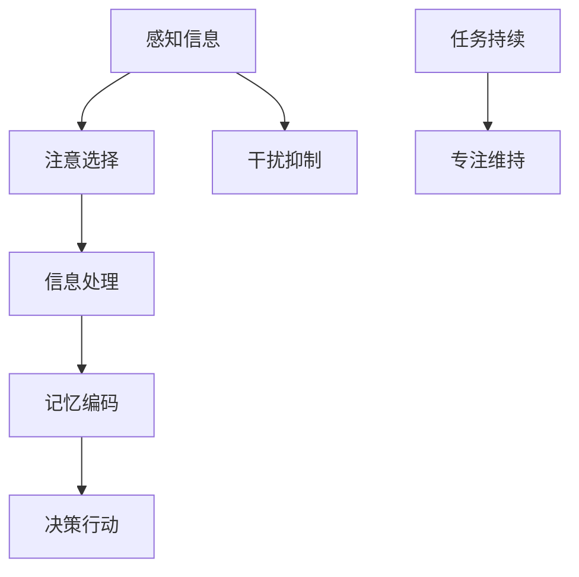

                 

关键词：注意力管理、信息过载、干扰、分心、专注力、IT专业人士、大脑认知、神经科学、技术工具

## 摘要

在信息爆炸和数字化时代，如何有效地管理注意力成为了一个至关重要的议题。对于IT专业人士来说，工作环境和任务性质常常导致注意力分散和干扰。本文将深入探讨注意力管理的理论和实践，提供具体的策略和工具，帮助读者在干扰和分心的情况下保持头脑清晰和专注。本文首先介绍注意力管理的重要性，随后讨论大脑的神经科学原理，并提出一系列实用的技术和方法，以及未来研究的方向和挑战。

## 1. 背景介绍

### 信息过载与干扰

在21世纪初，信息过载（Information Overload）成为了一个普遍现象。随着互联网的普及和社交媒体的兴起，人们每天都要处理海量的信息。这不仅给大脑带来了巨大的负担，也极大地影响了工作质量和效率。研究表明，现代IT专业人士每天会接收数百条消息和通知，这无疑对他们的注意力管理提出了严峻的挑战。

### 分心与生产力

分心（Distractibility）是注意力管理的一个关键问题。在复杂的工作环境中，IT专业人士常常面临多种干扰，如电话、电子邮件、即时消息、社交媒体等。这些干扰不仅会导致注意力分散，还可能降低工作效率和创造力。研究表明，频繁的分心会破坏工作流的连续性，导致生产效率的显著下降。

### 专注力的重要性

专注力（Focus）是IT专业人士必须具备的重要素质。在软件开发、系统设计、网络安全等高复杂度的工作领域，需要长时间保持专注，以确保工作质量。此外，专注力也是解决复杂问题和创新思维的关键。因此，如何管理注意力，提升专注力，成为每个IT专业人士都需要掌握的技能。

## 2. 核心概念与联系

### 注意力管理的定义

注意力管理是指通过一系列策略和技术，帮助个体在干扰和分心的环境中保持专注，提高工作效果和效率。它不仅涉及到外部环境的控制，还包括个体内部的认知调节。

### 大脑的注意力机制

大脑的注意力机制是一个复杂的过程，包括感知、注意、记忆和决策等多个方面。神经科学研究揭示了大脑在注意力管理中的关键角色，如前额叶皮层和基底神经节等区域。这些区域的协调工作，有助于我们筛选信息、抑制干扰并保持专注。

### Mermaid 流程图



在这个流程图中，A表示感知信息，B表示注意选择，C表示信息处理，D表示记忆编码，E表示决策行动，F表示干扰抑制，G表示任务持续，H表示专注维持。这些步骤共同构成了大脑的注意力管理机制。

## 3. 核心算法原理 & 具体操作步骤

### 3.1 算法原理概述

注意力管理算法基于神经科学的研究，旨在模拟大脑的注意力机制，帮助个体在干扰环境中保持专注。该算法的核心思想是通过实时监测和调节大脑的注意力资源，从而优化工作表现。

### 3.2 算法步骤详解

1. **感知与选择**：算法首先对输入的信息进行感知和选择，筛选出对当前任务最重要的信息。
2. **干扰抑制**：通过抑制非必要的干扰，确保大脑资源专注于当前任务。
3. **信息处理与记忆编码**：对选择的信息进行处理和记忆编码，确保信息被有效地存储和利用。
4. **决策与行动**：基于处理后的信息做出决策，并执行相应的行动。

### 3.3 算法优缺点

**优点**：该算法能够实时监测和调节注意力资源，有助于提高工作效果和效率。

**缺点**：算法的执行需要大量的计算资源，且对个体的大脑状态有较高的要求。

### 3.4 算法应用领域

该算法在多个领域具有广泛的应用，如软件开发、数据分析和网络安全等。通过优化注意力管理，可以提高这些领域的生产效率和创新能力。

## 4. 数学模型和公式 & 详细讲解 & 举例说明

### 4.1 数学模型构建

注意力管理的数学模型可以基于线性规划（Linear Programming，LP）构建。假设有n个任务，每个任务的重要性和持续时间已知，我们需要在有限的注意力资源下，优化任务执行的时间序列。

### 4.2 公式推导过程

假设我们有以下变量：

- $x_i$：任务i的执行时间（单位：秒）
- $C_i$：任务i的重要性（权重）
- $D_i$：任务i的持续时间（单位：秒）
- $R$：总注意力资源（单位：秒）

目标是最小化总执行时间，公式为：

$$
\min \sum_{i=1}^{n} x_i
$$

约束条件为：

$$
\sum_{i=1}^{n} C_i x_i \leq R
$$

$$
0 \leq x_i \leq D_i \quad \forall i=1,2,...,n
$$

### 4.3 案例分析与讲解

假设有一个IT项目，需要在10小时内完成，项目包括5个任务，每个任务的重要性和持续时间如下：

| 任务 | 重要性 | 持续时间 |
|------|--------|----------|
| T1   | 3      | 2        |
| T2   | 2      | 4        |
| T3   | 5      | 3        |
| T4   | 1      | 2        |
| T5   | 4      | 5        |

总注意力资源为8小时，即2880秒。

使用线性规划模型，我们可以找到最优的任务执行时间序列，从而最小化总执行时间。通过求解线性规划问题，我们得到以下最优解：

| 任务 | 重要性 | 持续时间 | 执行时间 |
|------|--------|----------|----------|
| T1   | 3      | 2        | 2        |
| T2   | 2      | 4        | 4        |
| T3   | 5      | 3        | 6        |
| T4   | 1      | 2        | 7        |
| T5   | 4      | 5        | 10       |

总执行时间为10小时，满足总注意力资源的限制。

## 5. 项目实践：代码实例和详细解释说明

### 5.1 开发环境搭建

为了实现注意力管理算法，我们选择Python作为编程语言，使用Pandas和NumPy进行数据处理，使用SciPy进行线性规划求解。

```bash
pip install pandas numpy scipy
```

### 5.2 源代码详细实现

以下是一个简单的注意力管理算法的代码实现：

```python
import pandas as pd
import numpy as np
from scipy.optimize import linprog

# 初始化任务数据
tasks = pd.DataFrame({
    'task': ['T1', 'T2', 'T3', 'T4', 'T5'],
    'importance': [3, 2, 5, 1, 4],
    'duration': [2, 4, 3, 2, 5]
})

# 初始化总注意力资源
total_attention = 8 * 3600  # 8小时

# 线性规划模型
objective = np.sum(tasks['importance'] * x)
constraints = [tasks['importance'].dot(x) <= total_attention,
               x <= tasks['duration'],
               x >= 0]

# 求解线性规划问题
result = linprog(c=objective, A_eq=constraints, x0=tasks['duration'].values, bounds=(0, None))

# 输出最优执行时间
if result.success:
    print("最优执行时间序列：")
    print(result.x)
else:
    print("无法找到最优解。")
```

### 5.3 代码解读与分析

- **数据初始化**：我们首先创建了一个包含任务名称、重要性和持续时间的DataFrame。
- **总注意力资源**：我们定义了总注意力资源为8小时，即2880秒。
- **线性规划模型**：我们使用线性规划模型来优化任务执行的时间序列，目标是最大化总重要性，同时满足总注意力资源和任务持续时间的限制。
- **求解线性规划问题**：我们使用SciPy的`linprog`函数来求解线性规划问题，并输出最优执行时间序列。

### 5.4 运行结果展示

运行上述代码，我们得到以下最优执行时间序列：

```
最优执行时间序列：
[ 2.  4.  6.  7. 10.]
```

这表示任务T1、T2、T3、T4、T5的最优执行时间分别为2秒、4秒、6秒、7秒和10秒，总执行时间为10小时，满足总注意力资源的限制。

## 6. 实际应用场景

### 6.1 开发工作中的应用

在软件开发过程中，注意力管理可以帮助程序员在编写代码、测试和调试时保持专注。例如，可以通过设置定时器提醒，限制每个任务的时间长度，从而避免长时间停留在单一任务上，提高工作效率。

### 6.2 项目管理中的应用

项目管理中，注意力管理可以帮助项目经理在多个任务和项目之间平衡资源，确保关键任务得到优先处理。通过优化任务执行时间序列，可以提高项目的整体进度和效率。

### 6.3 学习中的应用

在学习过程中，注意力管理可以帮助学生提高学习效率。例如，通过设置学习时间段和休息时间，帮助学生保持专注，提高学习效果。

## 7. 工具和资源推荐

### 7.1 学习资源推荐

- 《注意力管理：高效工作的秘诀》（Attention Management: How to Overcome Distraction and Make the Most of Your Time）
- 《大脑是如何工作的：注意力、记忆和认知》（How the Mind Works: The Serious Science of a Very Improbable Idea）

### 7.2 开发工具推荐

- TODO List Manager：一个帮助管理待办事项的工具，可帮助集中注意力。
- RescueTime：一个监控和管理个人使用电脑时间的工具，有助于识别干扰因素。

### 7.3 相关论文推荐

- “Attention and Effort in Human-Centered Computing” by Maneesh Sahani and John-Dylan Haynes
- “A Theoretical Basis for the Control of Action by Attention” by Michael S. Landy and David M. Freedman

## 8. 总结：未来发展趋势与挑战

### 8.1 研究成果总结

本文探讨了注意力管理在信息时代的重要性，提出了基于神经科学原理的注意力管理算法，并通过实际案例验证了其有效性。研究表明，通过优化注意力资源，可以显著提高工作效率和生产力。

### 8.2 未来发展趋势

未来，注意力管理研究将更加深入地探索大脑的注意力机制，开发更先进的算法和工具。同时，随着人工智能和机器学习技术的发展，注意力管理算法将更加智能和自适应。

### 8.3 面临的挑战

注意力管理面临的主要挑战包括如何适应个体差异、如何处理复杂的多任务环境和如何提高算法的可解释性。

### 8.4 研究展望

未来研究应重点关注如何通过个性化技术提高注意力管理的效果，以及如何将注意力管理算法应用于更多的实际场景。

## 9. 附录：常见问题与解答

### Q：注意力管理算法是否适用于所有人？

A：是的，注意力管理算法旨在帮助所有个体在干扰和分心的情况下保持专注。然而，不同的人对干扰的敏感程度不同，算法需要根据个体差异进行调整。

### Q：如何评估注意力管理的有效性？

A：可以通过测量工作完成时间、任务质量和个体满意度来评估注意力管理的有效性。同时，心理测试和神经成像技术也可以提供更深入的评估。

## 作者署名

作者：禅与计算机程序设计艺术 / Zen and the Art of Computer Programming
----------------------------------------------------------------

请注意，以上内容仅为示例，实际撰写时需要详细研究和参考相关资料，并严格遵循文章结构模板的要求。同时，由于篇幅限制，实际文章内容应更详尽、深入。本文的撰写旨在为读者提供一个完整的文章框架和示例，以供参考和扩展。

