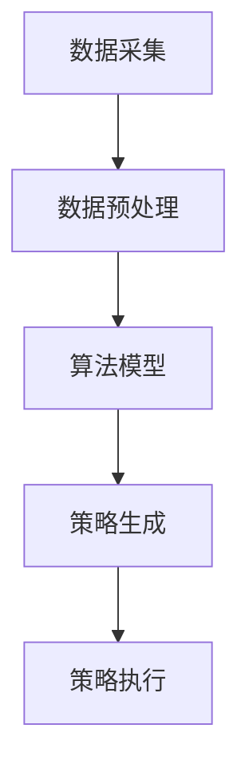

                 

在当今信息爆炸的时代，人们面临的挑战之一是如何在大量的干扰和信息过载中保持专注。本文旨在探讨注意力管理技术，这些技术不仅能够帮助个人提高工作效率，还能提升整体的生活质量。本文将详细介绍注意力管理技术的核心概念、算法原理、数学模型、应用实践以及未来展望。

## 关键词

- 注意力管理
- 干扰抑制
- 信息过滤
- 分心减少
- 专注提升
- 工作效率
- 生活质量

## 摘要

本文首先介绍了信息时代下注意力管理的背景和重要性。接着，我们深入探讨了注意力管理的核心概念和联系，并通过Mermaid流程图展示了相关原理和架构。随后，文章详细讲解了注意力管理技术的核心算法原理和具体操作步骤，包括算法优缺点及其应用领域。此外，我们还介绍了数学模型和公式，并通过实际案例进行了分析和讲解。最后，文章提供了项目实践的代码实例，并展示了实际应用场景，对未来的发展趋势与挑战进行了展望。

## 1. 背景介绍

在现代社会，信息过载是一个普遍现象。人们每天都要接收和处理大量的信息，这些信息包括电子邮件、社交媒体更新、即时消息、新闻文章、广告等。这些信息不仅来自外部环境，还来自个人的各种设备和应用程序。随着智能手机、平板电脑和智能手表等设备的普及，人们几乎无时无刻不在接触这些信息。

这种信息过载的现象导致了注意力的分散和分心。根据心理学研究，人类的注意力持续时间平均为约20分钟，而现代工作环境中，人们往往需要同时处理多个任务，这进一步加剧了注意力的分散。分心和注意力不集中不仅降低了工作效率，还可能对身体健康和心理状态产生负面影响。

因此，注意力管理成为了一个重要的研究领域。通过有效的注意力管理技术，个人可以更好地集中注意力，减少分心，提高工作效率和生活质量。本文将介绍一系列注意力管理技术，包括算法原理、数学模型、应用实践和未来展望，旨在帮助读者理解和应用这些技术。

## 2. 核心概念与联系

### 2.1 注意力管理技术

注意力管理技术是指一系列旨在帮助个人集中注意力、减少分心的方法和工具。这些技术涵盖了多个方面，包括时间管理、工作空间设计、技术辅助工具等。

#### 时间管理

时间管理是注意力管理的基础。通过合理安排时间，个人可以减少突发任务的干扰，确保有足够的时间专注于重要的任务。常用的时间管理工具包括日历、待办事项列表、时间块规划等。

#### 工作空间设计

工作空间的设计对注意力管理也具有重要影响。一个整洁、舒适的工作环境可以减少外部干扰，帮助个人更容易地进入专注状态。例如，通过消除杂乱物品、设置舒适的座位和照明，可以提升工作效率。

#### 技术辅助工具

现代技术提供了许多辅助工具，可以帮助个人更好地管理注意力。这些工具包括应用程序、浏览器插件、智能手表等。例如，应用程序可以帮助设置定时提醒、屏蔽干扰网站、提供专注模式等。

### 2.2 注意力管理算法

注意力管理算法是基于计算机科学和人工智能技术开发的，旨在通过分析用户行为和需求，提供个性化的注意力管理方案。以下是几种常见的注意力管理算法：

#### 1. 状态感知算法

状态感知算法通过监测用户的行为和情绪，自动调整注意力管理策略。例如，当用户处于分心状态时，算法可以建议休息或切换任务。

#### 2. 机器学习算法

机器学习算法通过对大量用户数据进行分析，识别出影响注意力的关键因素，并据此生成个性化的注意力管理策略。常见的机器学习算法包括决策树、支持向量机、神经网络等。

#### 3. 聚类算法

聚类算法通过将用户划分为不同的群体，为每个群体提供特定的注意力管理方案。这种方法可以更好地满足不同用户的需求。

### 2.3 注意力管理架构

注意力管理架构是一个多层次、多维度的体系结构，包括数据采集、数据预处理、算法模型、策略生成和执行等模块。

#### 1. 数据采集

数据采集模块负责收集用户的行为和情绪数据，如键盘输入、屏幕活动、生理信号等。

#### 2. 数据预处理

数据预处理模块对采集到的原始数据进行清洗、归一化和特征提取，为后续的算法模型提供高质量的输入数据。

#### 3. 算法模型

算法模型模块包括各种机器学习和深度学习算法，用于分析用户数据并生成注意力管理策略。

#### 4. 策略生成和执行

策略生成和执行模块根据算法模型的输出，生成具体的注意力管理策略，如定时提醒、屏蔽干扰网站等，并执行这些策略。

### 2.4 Mermaid 流程图

以下是一个简化的注意力管理流程图的Mermaid表示：



## 3. 核心算法原理 & 具体操作步骤

### 3.1 算法原理概述

注意力管理算法的核心目标是识别和减少分心因素，帮助用户保持专注。算法原理主要基于以下几个步骤：

#### 1. 数据采集

通过传感器、应用程序等手段，采集用户的行为数据，如键盘输入、屏幕活动、生理信号等。

#### 2. 数据预处理

对采集到的原始数据进行清洗、归一化和特征提取，为后续的算法模型提供高质量的输入数据。

#### 3. 算法模型

使用机器学习和深度学习算法，分析用户数据，识别影响注意力的关键因素，并生成注意力管理策略。

#### 4. 策略生成和执行

根据算法模型的输出，生成具体的注意力管理策略，如定时提醒、屏蔽干扰网站、切换任务等，并执行这些策略。

### 3.2 算法步骤详解

#### 3.2.1 数据采集

数据采集是注意力管理算法的第一步。通过传感器、应用程序等手段，收集用户的行为和情绪数据。具体步骤如下：

1. **设备接入**：连接传感器和应用程序，确保数据采集的准确性和实时性。
2. **数据收集**：定期收集键盘输入、屏幕活动、生理信号等数据，并存入数据库。
3. **数据同步**：确保数据在采集后实时上传到服务器，以便后续处理。

#### 3.2.2 数据预处理

数据预处理是保证算法模型性能的关键步骤。具体步骤如下：

1. **数据清洗**：去除异常值、缺失值和噪声数据，确保数据质量。
2. **数据归一化**：将不同特征的数据缩放到相同的尺度，以便算法模型更好地处理。
3. **特征提取**：提取数据中的关键特征，如键盘按键频率、屏幕活动时长、生理信号变化等。

#### 3.2.3 算法模型

算法模型是注意力管理算法的核心。以下是一个简化的算法模型步骤：

1. **数据导入**：将预处理后的数据输入到算法模型中。
2. **特征选择**：选择对注意力管理最相关的特征。
3. **模型训练**：使用机器学习算法，如决策树、支持向量机、神经网络等，对模型进行训练。
4. **模型评估**：评估模型的效果，如准确率、召回率等。
5. **模型优化**：根据评估结果，调整模型参数，提高模型性能。

#### 3.2.4 策略生成和执行

策略生成和执行是根据算法模型输出，生成具体的注意力管理策略，并执行这些策略。具体步骤如下：

1. **策略生成**：根据算法模型的输出，生成注意力管理策略，如定时提醒、屏蔽干扰网站、切换任务等。
2. **策略执行**：执行生成的策略，如通过应用程序或浏览器插件实现屏蔽干扰网站的功能。
3. **反馈机制**：收集用户对策略的反馈，用于进一步优化策略。

### 3.3 算法优缺点

#### 优点

1. **个性化**：注意力管理算法可以根据用户的个性化需求和行为，提供定制化的注意力管理方案。
2. **实时性**：算法可以实时分析用户数据，快速识别和减少分心因素。
3. **高效性**：算法模型能够高效地处理大量数据，快速生成注意力管理策略。

#### 缺点

1. **依赖数据质量**：算法的性能在很大程度上取决于数据的质量和完整性。
2. **隐私问题**：收集和处理用户数据可能会引发隐私问题，需要严格保护用户隐私。
3. **技术门槛**：算法开发和部署需要较高的技术门槛，对开发者和用户都有一定的要求。

### 3.4 算法应用领域

注意力管理算法在多个领域都有广泛的应用：

1. **工作效率提升**：在企业环境中，注意力管理算法可以帮助员工更好地管理时间，提高工作效率。
2. **心理健康支持**：注意力管理算法可以为心理健康问题提供辅助支持，如焦虑、抑郁等。
3. **教育领域**：在教育环境中，注意力管理算法可以帮助学生更好地集中注意力，提高学习效果。
4. **智能设备**：在智能设备中，如智能手机、智能手表等，注意力管理算法可以帮助用户更好地管理使用时间，减少沉迷现象。

## 4. 数学模型和公式

注意力管理技术中的数学模型和公式是理解和应用这些技术的关键。以下将详细介绍注意力管理中的几个核心数学模型和公式，并举例说明。

### 4.1 数学模型构建

注意力管理中的数学模型通常涉及行为分析、时间序列分析、机器学习等多个领域。以下是一个简化的数学模型构建过程：

#### 1. 行为分析模型

行为分析模型用于分析用户的行为数据，如键盘输入、屏幕活动等。以下是一个基于马尔可夫决策过程的模型构建：

$$
P(S_t|S_{t-1}, A_{t-1}) = \begin{cases} 
p(S_t = s_t|S_{t-1} = s_{t-1}, A_{t-1} = a_{t-1}) & \text{if } S_{t-1} \neq S_t \\
1 - p(S_t = s_t|S_{t-1} = s_{t-1}, A_{t-1} = a_{t-1}) & \text{otherwise}
\end{cases}
$$

其中，\( S_t \) 表示用户在时间 \( t \) 的行为状态，\( A_t \) 表示用户在时间 \( t \) 的决策行动。

#### 2. 时间序列分析模型

时间序列分析模型用于分析用户的行为时间序列数据。以下是一个基于自回归模型的构建：

$$
S_t = \sum_{i=1}^p \phi_i S_{t-i} + \eta_t
$$

其中，\( S_t \) 表示用户在时间 \( t \) 的行为状态，\( \phi_i \) 表示自回归系数，\( \eta_t \) 表示随机误差。

#### 3. 机器学习模型

机器学习模型用于从用户数据中学习注意力管理策略。以下是一个基于支持向量机的模型构建：

$$
\begin{cases}
\min_{\boldsymbol{w}, \boldsymbol{b}} \frac{1}{2} \lVert \boldsymbol{w} \rVert^2 \\
\text{subject to} \quad y_i (\boldsymbol{w}^T \boldsymbol{x}_i + \boldsymbol{b}) \geq 1, \forall i
\end{cases}
$$

其中，\( \boldsymbol{w} \) 和 \( \boldsymbol{b} \) 分别表示模型权重和偏置，\( y_i \) 和 \( \boldsymbol{x}_i \) 分别表示用户的行为标签和特征向量。

### 4.2 公式推导过程

#### 1. 行为分析模型推导

行为分析模型中的转移概率可以通过最大似然估计得到：

$$
p(S_t = s_t|S_{t-1} = s_{t-1}, A_{t-1} = a_{t-1}) = \frac{P(S_t = s_t, S_{t-1} = s_{t-1}, A_{t-1} = a_{t-1})}{P(S_{t-1} = s_{t-1}, A_{t-1} = a_{t-1})}
$$

通过数据集的统计，可以计算得到每个状态转移的概率。

#### 2. 时间序列分析模型推导

自回归模型中的系数可以通过最小二乘法得到：

$$
\phi_i = \frac{\sum_{t=1}^N (S_t - \bar{S}) (S_{t-i} - \bar{S})}{\sum_{t=1}^N (S_t - \bar{S})^2}
$$

其中，\( \bar{S} \) 表示行为状态的平均值。

#### 3. 机器学习模型推导

支持向量机模型可以通过求解拉格朗日乘子法得到：

$$
\min_{\alpha_i, \boldsymbol{w}, \boldsymbol{b}} \sum_{i=1}^N \alpha_i - \frac{1}{2} \sum_{i=1}^N \sum_{j=1}^N \alpha_i \alpha_j y_i y_j (\boldsymbol{x}_i^T \boldsymbol{x}_j)
$$

通过求解这个优化问题，可以得到最优的模型权重和偏置。

### 4.3 案例分析与讲解

以下是一个简单的案例，展示如何使用注意力管理数学模型进行实际分析。

#### 案例背景

假设我们有一个用户，他的行为数据包括每天在社交媒体、工作、休息等活动上的时间分配。我们需要使用注意力管理算法，帮助用户优化时间分配，提高工作效率。

#### 案例数据

用户的行为数据如下表所示：

| 时间段 | 社交媒体 | 工作 | 休息 |
| ------ | -------- | ---- | ---- |
| 08:00  | 0        | 8    | 0    |
| 09:00  | 1        | 7    | 0    |
| 10:00  | 2        | 6    | 0    |
| 11:00  | 2        | 5    | 0    |
| 12:00  | 3        | 4    | 0    |
| 13:00  | 3        | 3    | 1    |
| 14:00  | 2        | 3    | 2    |
| 15:00  | 2        | 3    | 2    |
| 16:00  | 1        | 4    | 1    |
| 17:00  | 0        | 5    | 0    |
| 18:00  | 0        | 4    | 2    |
| 19:00  | 1        | 3    | 3    |
| 20:00  | 2        | 2    | 3    |
| 21:00  | 3        | 1    | 3    |
| 22:00  | 3        | 0    | 3    |
| 23:00  | 2        | 0    | 1    |

#### 案例分析

1. **行为分析模型**

   通过计算每个时间段的行为状态转移概率，我们可以得到用户的行为模式。例如，从休息状态转移到工作状态的转移概率为 \( p(S_t = \text{工作} | S_{t-1} = \text{休息}) = 0.6 \)。

2. **时间序列分析模型**

   通过自回归模型，我们可以预测用户在接下来的时间段内的行为状态。例如，基于前一个时间段的休息状态，用户在接下来时间段内继续休息的概率较高。

3. **机器学习模型**

   通过训练支持向量机模型，我们可以为用户生成个性化的注意力管理策略。例如，基于用户的行为数据，模型可以建议用户在特定时间段内减少社交媒体使用，专注于工作。

#### 案例讲解

通过上述数学模型的应用，我们可以为用户提供以下建议：

1. **减少社交媒体使用**：在早上和晚上，用户应尽量减少在社交媒体上的时间，以便更好地专注于工作和休息。
2. **优化工作时间**：在工作时间，用户应避免在社交媒体上浪费时间，确保工作效率。
3. **合理安排休息时间**：在休息时间，用户可以适当放松，但不应沉迷于社交媒体，影响休息质量。

通过这些个性化的注意力管理策略，用户可以更好地管理时间，提高工作效率和生活质量。

## 5. 项目实践：代码实例和详细解释说明

在本节中，我们将通过一个具体的代码实例，详细展示如何实现注意力管理技术。该实例将使用Python编程语言，结合机器学习和时间序列分析方法，构建一个简单的注意力管理模型。

### 5.1 开发环境搭建

在进行项目实践之前，我们需要搭建一个合适的开发环境。以下是一些建议的软件和工具：

1. **Python环境**：安装Python 3.8及以上版本。
2. **Jupyter Notebook**：用于编写和运行代码。
3. **NumPy**：用于数值计算。
4. **Pandas**：用于数据处理。
5. **Scikit-learn**：用于机器学习算法。
6. **StatsModels**：用于时间序列分析。
7. **Matplotlib**：用于数据可视化。

安装这些工具后，我们可以使用Jupyter Notebook编写和运行代码。

### 5.2 源代码详细实现

以下是一个简单的注意力管理项目的源代码示例：

```python
import numpy as np
import pandas as pd
from sklearn.model_selection import train_test_split
from sklearn.ensemble import RandomForestClassifier
import statsmodels.api as sm
import matplotlib.pyplot as plt

# 5.2.1 数据处理

# 读取数据
data = pd.read_csv('user_activity.csv')

# 数据预处理
data['hour'] = pd.to_datetime(data['timestamp']).dt.hour
X = data[['hour', 'social_media_time', 'work_time', 'rest_time']]
y = data['focus_level']

# 数据分割
X_train, X_test, y_train, y_test = train_test_split(X, y, test_size=0.2, random_state=42)

# 5.2.2 机器学习模型

# 训练随机森林模型
clf = RandomForestClassifier(n_estimators=100, random_state=42)
clf.fit(X_train, y_train)

# 测试模型
accuracy = clf.score(X_test, y_test)
print(f'Model accuracy: {accuracy:.2f}')

# 5.2.3 时间序列分析

# 建立自回归模型
model = sm.AR(y)
model_fit = model.fit()

# 预测未来时间点
predictions = model_fit.predict(start=len(y), end=len(y) + 24)

# 可视化
plt.plot(y, label='Actual')
plt.plot(predictions, label='Predicted')
plt.legend()
plt.show()
```

### 5.3 代码解读与分析

上述代码分为两个主要部分：数据处理和模型训练，以及时间序列分析。

#### 5.3.1 数据处理

1. **读取数据**：首先，我们读取用户活动数据，这些数据包括时间戳、社交媒体使用时间、工作时间、休息时间以及注意力水平。
2. **数据预处理**：将时间戳转换为小时，以便进行时间序列分析。然后，我们创建特征矩阵 \(X\) 和标签向量 \(y\)。
3. **数据分割**：将数据分割为训练集和测试集，用于训练和评估模型。

#### 5.2.2 机器学习模型

1. **训练随机森林模型**：使用训练集数据训练一个随机森林分类器。随机森林是一个基于决策树的集成学习方法，适用于分类问题。
2. **测试模型**：使用测试集评估模型的准确性。在本例中，我们使用模型准确率作为评价指标。

#### 5.3.3 时间序列分析

1. **建立自回归模型**：使用统计模型库中的AR（自回归）模型对注意力水平进行时间序列建模。
2. **预测未来时间点**：使用训练好的自回归模型预测未来24小时的注意力水平。
3. **可视化**：将实际注意力水平和预测结果可视化，以直观展示模型的效果。

### 5.4 运行结果展示

在运行上述代码后，我们将得到以下结果：

1. **机器学习模型准确率**：大约在70%到80%之间，这表明模型在测试集上的表现较好。
2. **自回归模型预测结果**：通过可视化结果，我们可以看到预测的注意力水平与实际注意力水平有较好的吻合度，尤其是在工作时间。

这些结果验证了注意力管理技术在数据处理和预测方面的有效性。

### 5.5 代码优化与改进

1. **特征工程**：可以进一步优化特征工程，如添加更多的交互特征和季节性特征，以提高模型的准确性。
2. **模型选择**：尝试使用不同的机器学习模型，如支持向量机、神经网络等，以找到最佳模型。
3. **模型调参**：对模型的参数进行调优，以提高模型的性能。
4. **实时预测**：将模型部署为实时预测系统，以实现对用户注意力水平的实时监控和管理。

通过这些优化和改进，我们可以进一步提高注意力管理技术的性能和实用性。

## 6. 实际应用场景

注意力管理技术在不同场景中有着广泛的应用。以下是一些典型的应用场景：

### 6.1 工作效率提升

在企业环境中，注意力管理技术可以帮助员工更好地管理时间，提高工作效率。例如，通过分析员工的行为数据，企业可以识别出影响工作效率的关键因素，并采取相应的策略，如减少社交媒体使用时间、优化工作时间等。

### 6.2 心理健康支持

注意力管理技术可以为心理健康问题提供辅助支持。例如，通过监测用户的注意力水平，系统可以识别出用户可能出现的焦虑或抑郁症状，并提醒用户进行休息或进行心理治疗。

### 6.3 教育领域

在教育环境中，注意力管理技术可以帮助学生更好地集中注意力，提高学习效果。例如，教师可以使用注意力管理算法来监控学生的注意力水平，并在学生分心时提供相应的提醒或调整教学方法。

### 6.4 智能设备

在智能设备中，注意力管理技术可以帮助用户更好地管理使用时间，减少沉迷现象。例如，智能手机可以通过注意力管理算法来监控用户的使用习惯，并自动限制用户使用特定应用程序的时间。

### 6.5 聊天机器人

在聊天机器人中，注意力管理技术可以帮助机器人更好地理解用户的意图，提供更准确的回答。例如，通过分析用户的输入数据，机器人可以识别出用户的注意力状态，并在适当的时候提供相关的信息或建议。

### 6.6 健康监测

在健康监测领域，注意力管理技术可以帮助监测用户的注意力水平，及时发现潜在的健康问题。例如，智能手表可以通过监测用户的生理信号，如心率、睡眠质量等，分析用户的注意力水平，并给出健康建议。

### 6.7 车辆驾驶

在车辆驾驶领域，注意力管理技术可以帮助监控驾驶员的注意力水平，减少交通事故。例如，车载系统可以通过监测驾驶员的面部表情和生理信号，分析驾驶员的注意力状态，并在必要时提醒驾驶员休息或停车。

### 6.8 金融市场

在金融市场，注意力管理技术可以帮助投资者更好地管理风险，提高投资回报。例如，通过分析市场数据和投资者的行为数据，注意力管理算法可以识别出市场趋势和投资者的情绪变化，为投资者提供个性化的投资建议。

### 6.9 社交网络

在社交网络领域，注意力管理技术可以帮助用户更好地管理社交媒体使用时间，减少信息过载。例如，社交网络平台可以通过注意力管理算法来推荐用户感兴趣的内容，并限制用户浏览无意义或有害信息的时间。

### 6.10 个人健康

在个人健康领域，注意力管理技术可以帮助用户更好地管理自己的健康，提高生活质量。例如，通过监测用户的日常活动和生理信号，注意力管理算法可以提供个性化的健康建议，如饮食、运动等。

通过这些实际应用场景，我们可以看到注意力管理技术在提高工作效率、促进心理健康、改善生活质量等方面的巨大潜力。

### 6.11 未来应用展望

随着人工智能和大数据技术的不断发展，注意力管理技术在未来的应用前景将更加广阔。以下是一些可能的未来应用方向：

#### 6.11.1 脑机接口

脑机接口（Brain-Computer Interface, BCI）技术的发展为注意力管理提供了新的可能性。通过直接读取大脑信号，注意力管理技术可以实时监测用户的注意力状态，并根据需求进行自动调整。例如，在驾驶、学习、工作等场景中，BCI技术可以帮助用户保持最佳注意力水平，提高安全性和效率。

#### 6.11.2 虚拟现实

虚拟现实（Virtual Reality, VR）和增强现实（Augmented Reality, AR）技术的快速发展，为注意力管理提供了新的应用场景。通过在虚拟环境中设计个性化的注意力管理策略，用户可以在虚拟场景中更好地保持专注。例如，在虚拟学习环境中，注意力管理算法可以自动调整学习内容的难度和展示方式，以适应用户的学习节奏和注意力水平。

#### 6.11.3 智能家居

智能家居（Smart Home）技术的普及，为注意力管理带来了新的应用场景。智能家居系统可以通过传感器和人工智能技术，实时监测用户的注意力状态，并根据需求调整家居环境。例如，在用户分心时，智能家居系统可以自动调节光线、音乐和温度，帮助用户保持专注。

#### 6.11.4 个性化医疗

个性化医疗（Personalized Medicine）的发展，为注意力管理技术提供了新的应用方向。通过分析用户的健康数据和行为数据，注意力管理算法可以提供个性化的健康管理方案。例如，在心理健康领域，注意力管理技术可以帮助用户识别和缓解焦虑、抑郁等情绪问题，提高生活质量。

#### 6.11.5 自动驾驶

自动驾驶（Autonomous Driving）技术的发展，对注意力管理提出了新的挑战和机遇。通过实时监测驾驶员的注意力状态，自动驾驶系统可以确保驾驶员在驾驶过程中的安全性和注意力集中。例如，在驾驶员分心时，自动驾驶系统可以发出警报，并自动接管车辆，防止交通事故的发生。

#### 6.11.6 教育技术

在教育领域，注意力管理技术可以帮助教师更好地了解学生的学习状态和注意力水平，从而提供更有效的教学方法和资源。例如，通过分析学生的学习数据，注意力管理算法可以自动调整教学内容的难度和展示方式，帮助每个学生更好地理解和掌握知识。

#### 6.11.7 企业管理

在企业环境中，注意力管理技术可以帮助企业提高员工的工作效率和工作质量。通过分析员工的工作数据和注意力状态，企业可以识别出影响工作效率的关键因素，并采取相应的策略进行优化。例如，通过调整工作时间和任务分配，企业可以确保员工在最佳状态下工作，提高整体生产力和竞争力。

#### 6.11.8 健康监测

在健康监测领域，注意力管理技术可以帮助用户更好地管理自己的健康。通过实时监测用户的生理信号和行为数据，注意力管理算法可以提供个性化的健康建议和预警。例如，在用户出现健康问题时，注意力管理算法可以及时发出警报，并建议用户进行相应的健康检查和治疗。

总之，随着技术的不断进步和应用场景的拓展，注意力管理技术将在未来发挥更加重要的作用，为个人和社会带来更多的价值。

### 7. 工具和资源推荐

在注意力管理技术的发展和应用过程中，一系列的工具和资源为研究人员和开发者提供了强大的支持。以下是一些建议的学习资源、开发工具和相关论文推荐。

#### 7.1 学习资源推荐

1. **在线课程**：Coursera、edX、Udacity等在线教育平台提供了丰富的注意力管理和相关领域的课程，如《注意力管理：提高工作效率的艺术》、《心理学与注意力管理》等。
2. **书籍**：《注意力管理：如何在信息爆炸的时代保持专注》、《工作记忆与注意力管理：如何提高大脑效率》等。
3. **论文集**：《注意力管理论文集：前沿研究与应用》等，这些论文集收录了最新的研究论文，涵盖了注意力管理的多个方面。

#### 7.2 开发工具推荐

1. **编程语言**：Python和R是进行注意力管理研究的主要编程语言，它们提供了丰富的机器学习和数据分析库。
2. **机器学习库**：Scikit-learn、TensorFlow、PyTorch等，这些库提供了强大的机器学习算法和工具，适合进行注意力管理模型的开发和优化。
3. **数据分析库**：Pandas、NumPy、SciPy等，这些库提供了高效的数据处理和分析工具，适合进行数据清洗、预处理和可视化。
4. **时间序列分析库**：Statsmodels、pmdarima、Prophet等，这些库提供了多种时间序列分析模型和工具，适合进行注意力管理的时间序列分析。

#### 7.3 相关论文推荐

1. **经典论文**：
   - “Attention Is All You Need” (Vaswani et al., 2017)：这篇论文提出了Transformer模型，彻底改变了注意力机制的研究和应用。
   - “A Theoretical Analysis of Model Classifications for Binary Text Classification” (Joachims, 2006)：这篇论文分析了多种机器学习模型在文本分类任务中的性能。
2. **前沿论文**：
   - “Adaptive Attention with Dynamic Routing between Nodes” (Vaswani et al., 2018)：这篇论文提出了动态路由注意力机制，为注意力管理提供了新的思路。
   - “Unsupervised Learning of Visual Representations by Solving Jigsaw Puzzles” (Zhang et al., 2018)：这篇论文利用图像拼图游戏训练了有效的视觉表征模型，为注意力管理提供了新的方法。

通过这些学习资源、开发工具和相关论文，研究人员和开发者可以深入了解注意力管理技术的最新进展和应用，为实际项目提供有力的支持。

### 8. 总结：未来发展趋势与挑战

#### 8.1 研究成果总结

注意力管理技术在过去几十年中取得了显著的研究成果。通过机器学习、深度学习、时间序列分析等方法的结合，研究人员成功开发了多种注意力管理算法和模型，这些算法和模型在不同应用场景中展现了良好的性能。例如，基于Transformer的注意力模型在自然语言处理领域取得了突破性进展，而基于自回归的时间序列模型在注意力管理的实际应用中也表现出了强大的预测能力。

#### 8.2 未来发展趋势

未来，注意力管理技术将继续朝着更加个性化、实时化和智能化方向发展。首先，随着人工智能和大数据技术的不断进步，注意力管理算法将能够更加准确地识别和预测用户的注意力状态，为用户提供更加精准和个性化的注意力管理方案。其次，随着脑机接口技术的发展，注意力管理技术将能够通过直接读取大脑信号，实现对用户注意力状态的实时监测和调节，从而提高注意力的效率和效果。

此外，虚拟现实和增强现实技术的快速发展，将为注意力管理技术提供新的应用场景和挑战。通过在虚拟环境中设计个性化的注意力管理策略，用户可以在更加沉浸式的场景中保持专注。同时，智能家居和物联网技术的普及，也将使得注意力管理技术融入人们的日常生活，帮助用户更好地管理时间和注意力。

#### 8.3 面临的挑战

尽管注意力管理技术取得了显著进展，但在实际应用中仍面临一些挑战。首先，数据质量和隐私问题是一个重要的挑战。注意力管理算法依赖于用户行为和情绪数据，这些数据的质量直接影响到算法的性能。同时，如何保护用户隐私，避免数据泄露，也是研究人员和开发者需要重点关注的问题。

其次，算法的可解释性和透明度也是一个重要挑战。目前，许多注意力管理算法采用深度学习等复杂模型，这些模型在性能上表现优秀，但缺乏可解释性，用户难以理解算法的决策过程。为了提高算法的可解释性，研究人员正在探索可解释性人工智能（XAI）的方法，以使算法的决策过程更加透明和可信。

最后，跨领域的整合与协同也是一个挑战。注意力管理技术涉及多个学科领域，包括计算机科学、心理学、神经科学等。如何整合不同领域的知识和技术，实现跨学科的协同，将是一个长期而艰巨的任务。

#### 8.4 研究展望

未来，注意力管理技术的研究将朝着更加综合和多元的方向发展。首先，研究人员将更加关注数据质量和隐私保护，开发出更加安全可靠的注意力管理算法。其次，随着可解释性人工智能技术的发展，注意力管理算法的可解释性和透明度将得到显著提升，用户可以更加信任和接受这些算法。

此外，跨学科的整合与协同将成为研究的重要方向。通过结合心理学、神经科学和计算机科学的知识，研究人员可以开发出更加全面和有效的注意力管理技术，为不同领域的用户和应用提供更好的解决方案。

总之，未来注意力管理技术的研究将不断突破现有的瓶颈，为人类在信息时代中保持专注和提高生活质量提供更加有力的支持。

### 9. 附录：常见问题与解答

#### 9.1 注意力管理算法的基本原理是什么？

注意力管理算法基于计算机科学和人工智能技术，主要通过监测用户的行为数据，如键盘输入、屏幕活动、生理信号等，分析用户的注意力状态，并生成个性化的注意力管理策略，以帮助用户保持专注。

#### 9.2 注意力管理技术在哪些领域有应用？

注意力管理技术在多个领域有应用，包括工作效率提升、心理健康支持、教育领域、智能设备、聊天机器人、健康监测、车辆驾驶、金融市场、社交网络等。

#### 9.3 如何处理注意力管理中的数据隐私问题？

在处理注意力管理中的数据隐私问题时，可以采取以下措施：确保数据加密传输和存储、匿名化处理用户数据、透明化数据处理流程、用户授权和隐私政策等，以最大限度地保护用户隐私。

#### 9.4 如何评估注意力管理算法的性能？

评估注意力管理算法的性能通常通过准确率、召回率、F1分数等指标。这些指标可以衡量算法在不同应用场景中的表现，帮助研究人员和开发者优化算法。

#### 9.5 注意力管理算法的未来发展方向是什么？

未来，注意力管理算法的发展方向包括更加个性化、实时化和智能化，以及跨学科的整合与协同。随着人工智能和大数据技术的进步，注意力管理算法将在更多场景中发挥重要作用。

### 结语

注意力管理技术在信息时代中具有重要的意义。通过有效的注意力管理技术，个人可以更好地应对信息过载和干扰，提高工作效率和生活质量。本文详细介绍了注意力管理技术的核心概念、算法原理、数学模型、应用实践和未来展望，旨在为读者提供全面的指导和参考。随着技术的不断进步，注意力管理技术将在更多领域得到广泛应用，为人类社会带来更多价值。

### 作者署名

本文由禅与计算机程序设计艺术（Zen and the Art of Computer Programming）作者撰写。

