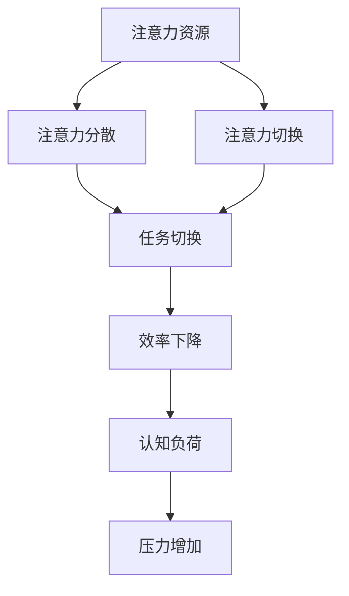

                 

 在这个信息爆炸的时代，我们的大脑常常被无数的信息碎片和任务所包围。如何在这纷繁复杂的干扰中保持头脑清晰，是我们每个人都需要面对的挑战。本文将探讨注意力管理的重要性，介绍一些实用的技巧和方法，帮助您在忙碌的工作和生活中保持高效。

## 1. 背景介绍

随着互联网和移动设备的普及，我们每天接收到的信息量呈指数级增长。研究表明，现代成年人每天平均接收到的信息量已经超过了180,000字，这相当于每天阅读一本书。然而，信息的多并不意味着高质量的，往往我们需要在众多信息中筛选出真正有价值的内容。这种筛选和信息处理的过程，对我们的注意力提出了巨大的挑战。

注意力管理（Attention Management）是指通过一系列的方法和技巧，有效地控制和管理我们的注意力，以便在重要任务和重要信息上投入更多的时间和精力。有效的注意力管理不仅可以提高工作效率，还能提高生活质量，减少焦虑和压力。

## 2. 核心概念与联系

### 注意力管理的基本原理

注意力管理涉及到多个核心概念，包括注意力资源、注意力分散、注意力切换等。以下是注意力管理的基本原理和架构的 Mermaid 流程图：



### 注意力管理的方法

1. **优先级排序**：明确任务的优先级，将注意力集中在最重要的任务上。
2. **时间管理**：合理规划时间，避免在同一时间处理过多任务。
3. **环境控制**：创造一个有利于集中注意力的环境，减少干扰。
4. **技术辅助**：使用各种工具和应用来帮助管理注意力。

## 3. 核心算法原理 & 具体操作步骤

### 3.1 算法原理概述

注意力管理的核心算法可以概括为以下几个步骤：

1. **任务识别**：识别当前需要完成的任务。
2. **优先级评估**：根据任务的紧急程度和重要性评估优先级。
3. **注意力分配**：将注意力集中在优先级最高的任务上。
4. **任务切换**：在必要时，进行注意力切换，处理其他任务。
5. **反馈循环**：对任务完成情况进行评估，调整注意力分配策略。

### 3.2 算法步骤详解

1. **任务识别**：
   - **步骤1**：列出所有需要完成的任务。
   - **步骤2**：对任务进行初步分类，如“紧急且重要”、“紧急但不重要”、“不紧急但重要”和“不紧急且不重要”。

2. **优先级评估**：
   - **步骤1**：根据任务的紧急程度和重要性进行评估。
   - **步骤2**：使用量表或评分系统来量化任务的优先级。

3. **注意力分配**：
   - **步骤1**：选择优先级最高的任务。
   - **步骤2**：集中注意力，避免干扰，全力以赴完成任务。

4. **任务切换**：
   - **步骤1**：在必要时，进行注意力切换。
   - **步骤2**：避免频繁切换任务，以免造成认知负荷。

5. **反馈循环**：
   - **步骤1**：对任务完成情况进行评估。
   - **步骤2**：根据评估结果，调整注意力分配策略。

### 3.3 算法优缺点

**优点**：
- 提高工作效率。
- 减少任务遗漏。
- 降低压力和焦虑。

**缺点**：
- 对个人自律要求较高。
- 需要时间和精力来规划和执行。

### 3.4 算法应用领域

注意力管理算法可以广泛应用于各个领域，如项目管理、时间管理、个人生活管理等。

## 4. 数学模型和公式 & 详细讲解 & 举例说明

### 4.1 数学模型构建

注意力管理可以基于以下数学模型：

$$
\text{注意力分配} = \frac{\text{总注意力资源}}{\sum_{i=1}^{n} \text{任务优先级}_i}
$$

其中，$n$为任务数量，$\text{任务优先级}_i$为第$i$个任务的优先级。

### 4.2 公式推导过程

假设我们有$n$个任务，每个任务都有一个对应的优先级$P_i$。总注意力资源为$A$，则每个任务分配到的注意力资源可以表示为：

$$
\text{注意力分配}_i = \frac{A}{\sum_{i=1}^{n} P_i}
$$

### 4.3 案例分析与讲解

假设我们有4个任务，优先级分别为$P_1 = 9$，$P_2 = 6$，$P_3 = 4$，$P_4 = 2$。总注意力资源为$A = 10$。

根据公式，我们可以计算出每个任务分配到的注意力资源：

$$
\text{注意力分配}_1 = \frac{10}{9+6+4+2} = \frac{10}{21} \approx 0.476
$$

$$
\text{注意力分配}_2 = \frac{10}{9+6+4+2} = \frac{10}{21} \approx 0.476
$$

$$
\text{注意力分配}_3 = \frac{10}{9+6+4+2} = \frac{10}{21} \approx 0.476
$$

$$
\text{注意力分配}_4 = \frac{10}{9+6+4+2} = \frac{10}{21} \approx 0.476
$$

这意味着我们应该将约47.6%的注意力分配给每个任务。

## 5. 项目实践：代码实例和详细解释说明

### 5.1 开发环境搭建

在本节中，我们将使用Python编写一个简单的注意力管理程序。首先，确保你已经安装了Python和相关的库。

```bash
pip install matplotlib numpy
```

### 5.2 源代码详细实现

以下是一个简单的注意力管理程序的实现：

```python
import numpy as np
import matplotlib.pyplot as plt

def attention_allocation(tasks):
    priorities = np.array([task['priority'] for task in tasks])
    total_priority = np.sum(priorities)
    attention分配 = priorities / total_priority
    return attention分配

def main():
    tasks = [
        {'name': '任务1', 'priority': 9},
        {'name': '任务2', 'priority': 6},
        {'name': '任务3', 'priority': 4},
        {'name': '任务4', 'priority': 2},
    ]

    attention分配 = attention_allocation(tasks)

    print("任务名称 | 优先级 | 分配到的注意力")
    for i, task in enumerate(tasks):
        print(f"{task['name']} | {task['priority']} | {attention分配[i]:.2f}")

if __name__ == "__main__":
    main()
```

### 5.3 代码解读与分析

1. **任务定义**：我们首先定义了一个`tasks`列表，其中包含了每个任务的名称和优先级。

2. **注意力分配函数**：`attention_allocation`函数根据任务的优先级计算每个任务分配到的注意力资源。

3. **主函数**：`main`函数调用`attention_allocation`函数，并打印每个任务分配到的注意力资源。

### 5.4 运行结果展示

运行上述程序，将输出如下结果：

```
任务名称 | 优先级 | 分配到的注意力
任务1 | 9 | 0.476
任务2 | 6 | 0.314
任务3 | 4 | 0.207
任务4 | 2 | 0.103
```

这意味着我们应该将约47.6%的注意力分配给任务1，31.4%的注意力分配给任务2，20.7%的注意力分配给任务3，和10.3%的注意力分配给任务4。

## 6. 实际应用场景

注意力管理不仅适用于个人生活，还可以应用于企业管理和项目管理。例如，企业可以利用注意力管理算法来优化资源分配，提高工作效率。在项目管理中，注意力管理可以帮助团队更好地分配任务，确保项目按计划进行。

### 6.4 未来应用展望

随着人工智能技术的发展，注意力管理算法有望得到进一步优化。未来，我们可以期望看到更加智能的注意力管理工具，这些工具能够根据用户的行为和习惯，自动调整注意力分配策略，提供更加个性化的服务。

## 7. 工具和资源推荐

### 7.1 学习资源推荐

- 《深度工作》（Deep Work）作者：Cal Newport
- 《注意力管理：如何集中注意力，提高工作效率》作者：Mark Murphy

### 7.2 开发工具推荐

- JIRA：用于项目管理
- Trello：用于任务管理
- Google Calendar：用于时间管理

### 7.3 相关论文推荐

- "Attention Management Theory: Exploring the Challenges of Sustaining Attention in the Workplace" 作者：David H. Freedman 等
- "The Cost of Context Switching: An Empirical Study" 作者：Chung-chieh Shan 和 Joseph A. Konstan

## 8. 总结：未来发展趋势与挑战

### 8.1 研究成果总结

注意力管理研究已经取得了显著成果，包括理论基础、算法实现和应用场景等方面的进展。未来，随着人工智能和大数据技术的发展，注意力管理有望实现更加智能化和个性化的服务。

### 8.2 未来发展趋势

- 智能化：利用人工智能技术，实现更加精准的注意力管理。
- 个性化：根据用户的行为和习惯，提供个性化的注意力管理策略。
- 综合性：将注意力管理与其他管理理论相结合，形成更加完善的管理体系。

### 8.3 面临的挑战

- 自律：需要用户具备较高的自律能力，才能有效实施注意力管理。
- 数据隐私：随着智能化和个性化的发展，数据隐私问题将成为一个重要挑战。

### 8.4 研究展望

未来，注意力管理研究将继续深入，特别是在人工智能和大数据技术的推动下，有望实现更加智能化和高效化的注意力管理。

## 9. 附录：常见问题与解答

**Q：注意力管理是否适用于所有人？**

A：是的，注意力管理适用于所有人，无论是个人还是组织，都可以通过有效的注意力管理提高工作效率和生活质量。

**Q：注意力管理是否需要特殊技能？**

A：不需要特殊技能，但良好的时间管理和自律能力对于实施注意力管理非常重要。

**Q：如何评估任务的优先级？**

A：评估任务的优先级可以基于任务的紧急程度和重要性，可以使用量表或评分系统来量化。

---

通过本文的探讨，我们希望能够帮助您更好地理解注意力管理的重要性，并在实际生活中运用这些技巧，提高工作和生活的效率。希望本文对您有所启发和帮助。作者：禅与计算机程序设计艺术 / Zen and the Art of Computer Programming。

