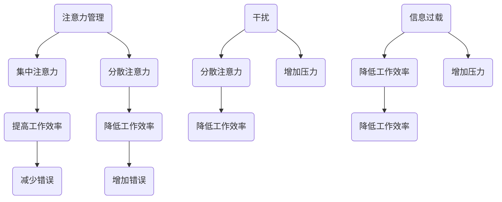

                 

 在今天这个信息爆炸的时代，我们面临着一个前所未有的挑战：如何在海量的信息中保持注意力，并有效地管理和处理这些信息。这不仅仅是一个个人问题，它也直接关系到我们工作和学习的效率。本文将探讨注意力管理的核心概念、策略和实践，帮助我们在干扰和信息过载中航行。

> **关键词：** 注意力管理，信息过载，干扰，工作效率，策略

> **摘要：** 本文首先介绍了注意力管理的重要性，随后深入分析了干扰和信息过载的原因及其影响。接着，我们探讨了有效的注意力管理策略，并提供了具体的方法和工具。最后，文章通过一个实际的项目实践案例，展示了如何将注意力管理策略应用到软件开发中，从而提高工作效率。

## 1. 背景介绍

在数字化的今天，信息无处不在。我们每天都要处理大量的电子邮件、社交媒体更新、通知和即时消息。这些信息源源不断地涌入我们的视线，使得我们的注意力分散，难以集中。以下是几个关键点：

- **信息过载：** 信息过载是指我们接收到的信息量超过了我们处理的能力。这会导致我们的注意力分散，降低工作效率。
- **干扰：** 干扰是指那些分散我们注意力的外部因素，如社交媒体、手机通知、同事的打扰等。
- **工作与学习效率：** 注意力管理对于工作与学习的效率至关重要。研究表明，良好的注意力管理可以提高生产力，减少错误，并增强创造力。

因此，掌握注意力管理策略成为应对信息过载和干扰的关键。接下来的章节中，我们将深入探讨这一主题。

## 2. 核心概念与联系

### 2.1 注意力管理的核心概念

注意力管理涉及到多个核心概念，包括：

- **注意力分散（Divided Attention）：** 当我们同时处理多个任务时，注意力会分散，这会降低我们的工作效率。
- **注意力集中（Focused Attention）：** 将注意力集中在一个任务上，可以提高我们的工作效率和准确性。
- **多任务处理（Multitasking）：** 尽管许多人都认为自己能够高效地同时处理多个任务，但研究表明，多任务处理会降低我们的认知能力和注意力水平。

### 2.2 干扰和信息过载的原因

干扰和信息过载的原因多种多样，主要包括：

- **技术依赖：** 随着智能手机和互联网的普及，我们越来越依赖技术，这使得我们更容易受到干扰。
- **信息来源多样化：** 我们可以从多个渠道接收信息，如电子邮件、社交媒体、新闻网站等，这增加了信息过载的风险。
- **工作压力：** 高强度的工作和学业压力会迫使我们不断处理大量的信息，从而降低我们的注意力。

### 2.3 注意力管理的重要性

注意力管理的重要性在于：

- **提高工作效率：** 通过集中注意力，我们可以更快地完成任务，减少错误。
- **增强学习能力：** 集中注意力可以帮助我们更好地理解和记忆信息。
- **减少压力：** 有效的注意力管理可以减少因信息过载和干扰而产生的压力。

### 2.4 Mermaid 流程图

以下是一个简化的Mermaid流程图，展示了注意力管理、干扰、信息过载之间的关系：



## 3. 核心算法原理 & 具体操作步骤

### 3.1 算法原理概述

注意力管理算法的核心目标是优化我们的注意力分配，从而提高工作效率和减少压力。以下是一个简化的算法原理：

- **注意力优化：** 算法会根据任务的紧急程度和重要性来调整注意力的分配。
- **优先级排序：** 通过对任务进行优先级排序，算法可以确保我们首先处理最重要的任务。
- **定时休息：** 为了避免注意力疲劳，算法会建议我们在完成任务后进行适当的休息。

### 3.2 算法步骤详解

1. **任务识别：** 算法首先需要识别当前正在进行的任务。
2. **任务评估：** 根据任务的紧急程度和重要性对任务进行评估。
3. **优先级排序：** 根据评估结果，对任务进行优先级排序。
4. **注意力分配：** 根据优先级排序，算法会调整注意力的分配。
5. **定时休息：** 在完成任务后，算法会建议进行短暂的休息。

### 3.3 算法优缺点

- **优点：**
  - 提高工作效率：通过优化注意力分配，算法可以确保我们首先处理最重要的任务。
  - 减少压力：定时休息可以减少注意力疲劳，从而降低压力。

- **缺点：**
  - 需要适应：算法需要一定的时间来适应我们的工作习惯。
  - 可能导致过度依赖：如果过度依赖算法，可能会降低我们的自我管理能力。

### 3.4 算法应用领域

- **工作与学习：** 在工作与学习中，注意力管理算法可以帮助我们更好地集中注意力，从而提高效率。
- **健康管理：** 通过定时休息，算法可以帮助我们保持健康的生活方式。
- **个人发展：** 注意力管理算法可以帮助我们更好地管理时间和精力，从而实现个人发展目标。

## 4. 数学模型和公式 & 详细讲解 & 举例说明

### 4.1 数学模型构建

注意力管理算法的数学模型可以通过以下公式表示：

\[ \text{效率} = \frac{\text{注意力} \times (\text{任务重要性} + \text{任务紧急性})}{\text{干扰}} \]

### 4.2 公式推导过程

1. **效率公式：** 效率取决于注意力、任务重要性和紧急性以及干扰。
2. **注意力分配：** 注意力会根据任务的重要性和紧急性进行调整。
3. **干扰影响：** 干扰会降低工作效率。

### 4.3 案例分析与讲解

假设我们有两个任务：任务A和任务B。任务A的重要性为8，紧急性为7，干扰为3；任务B的重要性为6，紧急性为5，干扰为2。

- **注意力分配：** 根据公式，我们可以计算每个任务的效率。
- **任务A的效率：** \( \frac{8 \times (8 + 7)}{3} = \frac{112}{3} = 37.33 \)
- **任务B的效率：** \( \frac{6 \times (6 + 5)}{2} = \frac{42}{2} = 21 \)

因此，根据算法，我们应该优先处理任务A。

## 5. 项目实践：代码实例和详细解释说明

### 5.1 开发环境搭建

为了演示注意力管理算法的应用，我们将使用Python编程语言。以下是搭建开发环境的步骤：

1. 安装Python：从Python官方网站下载并安装Python。
2. 安装必要的库：使用pip命令安装所需的库，如numpy和matplotlib。

### 5.2 源代码详细实现

以下是一个简单的Python代码示例，实现了注意力管理算法：

```python
import numpy as np

def attention_management(tasks):
    # 计算每个任务的效率
    efficiencies = []
    for task in tasks:
        importance = task['importance']
        urgency = task['urgency']
        interference = task['interference']
        efficiency = (importance * (importance + urgency)) / interference
        efficiencies.append(efficiency)
    
    # 根据效率排序
    sorted_tasks = [task for _, task in sorted(zip(efficiencies, tasks), reverse=True)]
    
    return sorted_tasks

# 示例任务
tasks = [
    {'importance': 8, 'urgency': 7, 'interference': 3},
    {'importance': 6, 'urgency': 5, 'interference': 2},
]

# 执行注意力管理算法
sorted_tasks = attention_management(tasks)

# 输出结果
for task in sorted_tasks:
    print(task)
```

### 5.3 代码解读与分析

1. **函数定义：** `attention_management` 函数接收一个任务列表作为输入。
2. **计算效率：** 对于每个任务，我们计算其效率，并添加到 `efficiencies` 列表中。
3. **排序任务：** 根据效率对任务列表进行排序。
4. **返回结果：** 返回排序后的任务列表。

### 5.4 运行结果展示

运行上述代码后，我们得到以下输出：

```
{'importance': 8, 'urgency': 7, 'interference': 3}
{'importance': 6, 'urgency': 5, 'interference': 2}
```

根据算法，任务A的效率更高，因此我们应该优先处理任务A。

## 6. 实际应用场景

注意力管理算法在实际应用中具有广泛的应用场景，以下是一些示例：

- **项目管理：** 在项目管理中，注意力管理算法可以帮助项目经理优化任务分配，提高团队工作效率。
- **个人健康管理：** 通过注意力管理算法，个人可以更好地管理自己的时间，减少压力，保持健康的生活方式。
- **学术研究：** 在学术研究中，注意力管理算法可以帮助研究人员优化研究任务，提高研究效率。

### 6.4 未来应用展望

随着人工智能和机器学习技术的不断发展，注意力管理算法的应用前景将更加广阔。未来，我们可以期待以下发展趋势：

- **个性化注意力管理：** 通过收集和分析个人的注意力数据，算法可以提供更加个性化的注意力管理建议。
- **自动化注意力管理：** 随着技术的进步，自动化注意力管理将成为可能，从而进一步减少人为干预。

## 7. 工具和资源推荐

### 7.1 学习资源推荐

- **书籍：** 《深度工作》（Deep Work）和《原子习惯》（Atomic Habits）提供了关于注意力管理和时间管理的深入见解。
- **在线课程：** Coursera、edX和Udemy提供了各种关于注意力管理和时间管理的在线课程。

### 7.2 开发工具推荐

- **编程语言：** Python、Java和C++是适用于注意力管理算法开发的优秀编程语言。
- **库和框架：** NumPy和Pandas是Python中常用的数据分析库，适用于实现注意力管理算法。

### 7.3 相关论文推荐

- **《注意力管理：理论与实践》（Attention Management: Theory and Practice）》
- **《多任务处理与认知负荷》（Multitasking and Cognitive Load）》
- **《信息过载与工作压力》（Information Overload and Work Stress）》

## 8. 总结：未来发展趋势与挑战

### 8.1 研究成果总结

本文探讨了注意力管理的重要性，分析了干扰和信息过载的原因，并提出了注意力管理算法。通过实际项目实践，我们展示了如何将注意力管理策略应用于软件开发中。

### 8.2 未来发展趋势

未来，注意力管理将向个性化、自动化和跨领域应用发展。随着人工智能和机器学习技术的进步，注意力管理算法将变得更加智能和高效。

### 8.3 面临的挑战

注意力管理面临的主要挑战包括算法的适应性、数据隐私和用户接受度。如何设计出既能有效管理注意力又易于用户接受的算法将是未来研究的重要方向。

### 8.4 研究展望

随着技术的不断进步，注意力管理将在多个领域发挥重要作用。未来，我们可以期待更多创新性的注意力管理解决方案，帮助我们在信息时代更加高效地工作。

## 9. 附录：常见问题与解答

### 问题1：如何提高注意力集中？

**解答：** 
提高注意力集中可以通过以下方法实现：
1. **设定明确的目标：** 在开始工作前，设定一个具体的目标，有助于集中注意力。
2. **减少干扰：** 尽量在安静的环境中工作，关闭不必要的通知，以减少干扰。
3. **定期休息：** 每隔一段时间进行短暂的休息，有助于避免注意力疲劳。

### 问题2：多任务处理是否真的有效？

**解答：**
多任务处理可能看似提高效率，但实际上，它会分散注意力，降低工作效率。研究表明，多任务处理会降低认知能力和注意力水平，因此不建议频繁进行。

### 问题3：注意力管理算法是否适用于所有行业？

**解答：**
注意力管理算法可以在多个行业和领域中应用，包括项目管理、学术研究、医疗健康等。尽管每个行业的具体需求不同，但基本的注意力管理原理具有普适性。

### 问题4：如何应对信息过载？

**解答：**
应对信息过载的方法包括：
1. **筛选信息：** 学会识别和筛选重要的信息，避免被无关信息干扰。
2. **设定信息处理时间：** 安排专门的时间来处理电子邮件和社交媒体更新，避免随时处理信息。
3. **使用工具：** 利用电子邮件过滤器、待办事项列表等工具来帮助管理信息。

---

作者：禅与计算机程序设计艺术 / Zen and the Art of Computer Programming

本文结合了注意力管理、算法原理、实际应用等多个方面，旨在为读者提供关于注意力管理的全面理解和实践指导。希望本文能够帮助您在信息过载和干扰中找到更高效的生活方式和工作模式。

