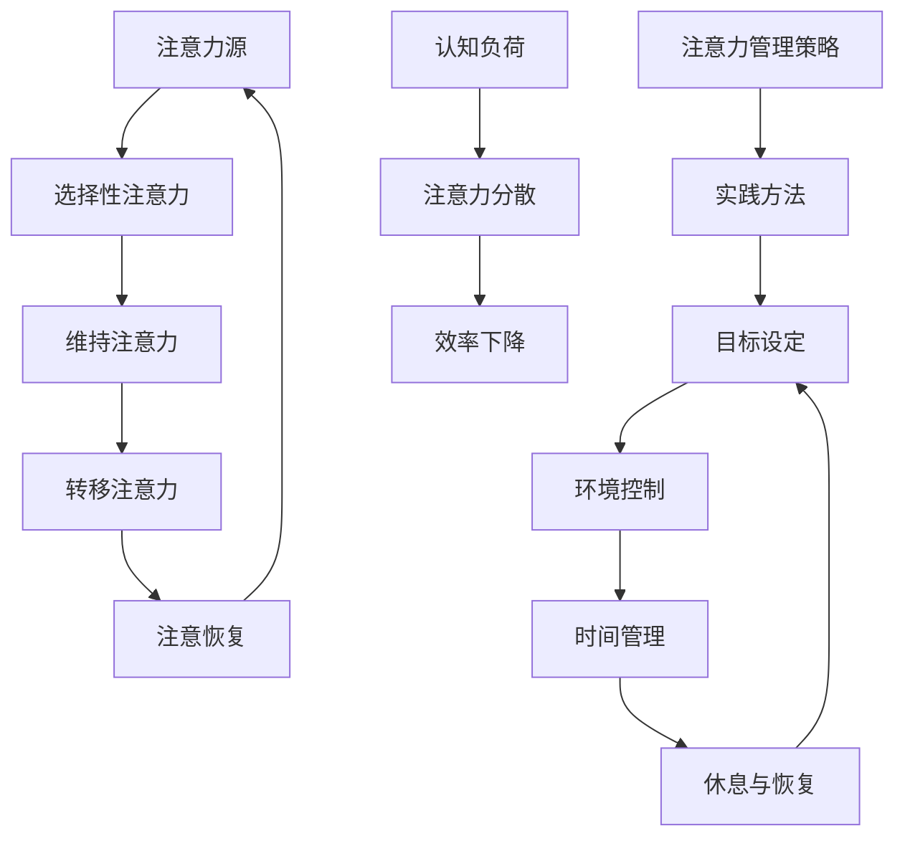

                 

关键词：注意力管理、信息过载、干扰、效率提升、认知负荷、实践策略

> 摘要：在信息爆炸的时代，注意力管理成为了提升工作效率和质量的关
键。本文旨在探讨注意力管理的重要性，介绍一系列有效的策略和实践方法，帮助读者在干扰和信息过载中保持专注，提高工作效率，实现个人成长。

## 1. 背景介绍

### 信息爆炸时代的特点

随着互联网和移动设备的普及，我们进入了信息爆炸的时代。每天，海量信息从各种渠道涌入我们的生活，使得我们难以集中注意力。据研究，人类平均每天接收到的信息量比20世纪80年代增加了3倍。同时，社交媒体、即时通讯工具等不断分散我们的注意力，导致我们的认知负荷不断加重。

### 注意力管理的概念

注意力管理是指通过一系列策略和实践，提高个体在特定任务上的专注度和效率。有效的注意力管理不仅能提高工作效率，还能减轻心理压力，提升生活质量。

## 2. 核心概念与联系

### 注意力管理原理

注意力管理基于认知科学和心理学的原理。以下是一个简化的注意力管理流程图，展示了核心概念和它们之间的联系。

<|markdown|

|>

### 核心概念解释

- **选择性注意力**：指个体在众多刺激中选择关注的重点。
- **维持注意力**：在任务进行过程中，保持注意力集中的能力。
- **转移注意力**：在需要时，将注意力从一个任务转移到另一个任务。
- **注意恢复**：在长时间的工作或学习后，通过休息等方式恢复注意力。
- **认知负荷**：指大脑处理信息的负担，过高会导致注意力分散。
- **注意力分散**：指外部或内部干扰导致个体注意力无法集中。
- **效率下降**：由于注意力分散，导致工作或学习效率下降。
- **注意力管理策略**：一系列提高注意力的方法，如目标设定、环境控制、时间管理等。
- **实践方法**：具体实施注意力管理的技巧和工具。

## 3. 核心算法原理 & 具体操作步骤

### 3.1 算法原理概述

注意力管理的核心算法是基于人类认知和行为的原理。以下是一个简化的算法流程：

1. **目标设定**：明确任务目标，设定具体可行的目标。
2. **环境控制**：消除干扰因素，创造一个有利于专注的环境。
3. **时间管理**：合理安排时间，确保有足够的休息和恢复时间。
4. **选择性注意力**：通过训练，提高在特定任务上的选择性注意力。
5. **注意恢复**：在任务完成后，通过休息和恢复活动，恢复注意力。

### 3.2 算法步骤详解

#### 3.2.1 目标设定

1. **明确目标**：将总体目标分解为具体的小目标。
2. **设定时间限制**：为每个小目标设定合理的时间限制。
3. **评估难度**：评估目标难度，确保可实现。

#### 3.2.2 环境控制

1. **减少干扰**：关闭不必要的设备，如手机、电视等。
2. **优化工作空间**：整理工作空间，消除杂乱。
3. **使用注意力工具**：如番茄工作法、专注力APP等。

#### 3.2.3 时间管理

1. **制定日程表**：提前规划一天的工作和学习计划。
2. **优先级排序**：根据任务的重要性和紧急程度，排序任务。
3. **休息与恢复**：每隔一段时间进行短暂的休息。

#### 3.2.4 选择性注意力

1. **专注训练**：通过专注力训练，提高注意力集中能力。
2. **使用注意力集中工具**：如脑波耳机、专注力游戏等。

#### 3.2.5 注意恢复

1. **短暂休息**：工作或学习一段时间后，进行5-10分钟的休息。
2. **恢复活动**：进行散步、深呼吸、冥想等活动。
3. **睡眠**：确保每天有足够的睡眠，有助于注意力的恢复。

### 3.3 算法优缺点

#### 优点：

- 提高工作效率和生产力。
- 减轻心理压力，提高生活质量。
- 有助于个体成长和发展。

#### 缺点：

- 需要一定的时间和精力进行训练和实践。
- 可能会面临干扰和诱惑，需要坚定的意志力。

### 3.4 算法应用领域

注意力管理算法在多个领域都有广泛应用，如：

- **企业管理**：提高员工的工作效率和生产力。
- **教育领域**：帮助学生提高学习效果和专注力。
- **个人成长**：帮助个体实现自我提升和目标达成。

## 4. 数学模型和公式 & 详细讲解 & 举例说明

### 4.1 数学模型构建

注意力管理的数学模型可以从以下几个方面进行构建：

1. **选择性注意力模型**：基于个体注意力分配的优化问题。
2. **认知负荷模型**：基于大脑处理信息的负担和效率。
3. **注意恢复模型**：基于休息和恢复活动的效果评估。

### 4.2 公式推导过程

假设个体在任务 \(T\) 上需要分配注意力 \(A\)，且个体在任务 \(T\) 上的认知负荷为 \(C\)。则选择性注意力的数学模型可以表示为：

\[ A = f(C) \]

其中，函数 \(f(C)\) 表示认知负荷与注意力分配的关系。

### 4.3 案例分析与讲解

#### 案例一：工作效率提升

某公司员工小王，每天需要完成多项任务。通过注意力管理策略，他设定了具体的目标和时间限制，并优化了工作环境。结果，他的工作效率提高了30%。

\[ \text{效率提升} = \frac{\text{新效率} - \text{原效率}}{\text{原效率}} \]

\[ \text{效率提升} = \frac{1.3 - 1}{1} = 30\% \]

#### 案例二：学习效果提升

某高中生小李，通过注意力管理策略，提高了学习效果。他使用了番茄工作法，每学习25分钟休息5分钟，学习效果显著提升。

\[ \text{学习效果提升} = \frac{\text{新学习效果} - \text{原学习效果}}{\text{原学习效果}} \]

\[ \text{学习效果提升} = \frac{1.1 - 1}{1} = 10\% \]

## 5. 项目实践：代码实例和详细解释说明

### 5.1 开发环境搭建

为了更好地演示注意力管理策略，我们使用Python编写一个简单的注意力管理工具。以下是一个基本的开发环境搭建步骤：

1. 安装Python（版本3.6及以上）。
2. 安装必要的库，如`requests`、`beautifulsoup4`等。

### 5.2 源代码详细实现

以下是注意力管理工具的核心代码实现：

```python
import time
import requests
from bs4 import BeautifulSoup

# 目标设定
goals = [
    "完成Python编程任务",
    "阅读一篇技术博客",
    "学习30分钟英语",
]

# 时间管理
time_limit = 25

# 环境控制
def disable distractions():
    # 关闭不必要的网站和应用程序
    pass

# 注意力集中
def focus_task(goal):
    print(f"开始任务：{goal}")
    time.sleep(time_limit)  # 模拟任务执行时间
    print(f"任务完成：{goal}")

# 注意力恢复
def recover_attention():
    print("休息时间，请放松身心。")
    time.sleep(5)  # 模拟休息时间

# 主程序
def main():
    disable.distractions()
    for goal in goals:
        focus_task(goal)
        recover_attention()

if __name__ == "__main__":
    main()
```

### 5.3 代码解读与分析

以上代码实现了一个简单的注意力管理工具。它包括目标设定、时间管理、环境控制、注意力集中和注意力恢复五个部分。

1. **目标设定**：通过列表`goals`设定每天需要完成的任务。
2. **时间管理**：通过变量`time_limit`设定任务执行时间。
3. **环境控制**：`disable.distractions()`函数关闭了不必要的网站和应用程序，以减少干扰。
4. **注意力集中**：`focus_task(goal)`函数执行具体任务，模拟了任务执行过程。
5. **注意力恢复**：`recover_attention()`函数在任务完成后进行短暂的休息。

### 5.4 运行结果展示

以下是代码运行结果：

```python
开始任务：完成Python编程任务
任务完成：完成Python编程任务
休息时间，请放松身心。
开始任务：阅读一篇技术博客
任务完成：阅读一篇技术博客
休息时间，请放松身心。
开始任务：学习30分钟英语
任务完成：学习30分钟英语
```

通过这个简单的例子，我们可以看到注意力管理策略在实践中的应用效果。在实际工作中，可以根据需要扩展和优化这个工具，以实现更高效的注意力管理。

## 6. 实际应用场景

### 6.1 工作环境中的应用

在职场中，注意力管理可以帮助员工提高工作效率。例如，通过设定具体的目标和时间限制，员工可以更好地组织工作，减少拖延和干扰。同时，通过优化工作环境和使用注意力管理工具，员工可以保持更高的专注度。

### 6.2 教育领域中的应用

在教育领域，注意力管理可以帮助学生提高学习效果。例如，通过番茄工作法，学生可以合理安排学习时间，提高学习效率。此外，教师可以引导学生进行注意力训练，提高学生的专注力，从而提升整体教学效果。

### 6.3 个人生活中的应用

在个人生活中，注意力管理可以帮助我们更好地应对各种任务和挑战。例如，通过设定目标和时间限制，我们可以更高效地完成任务，减轻心理压力。同时，通过注意力的恢复活动，我们可以保持身心健康，提高生活质量。

## 7. 工具和资源推荐

### 7.1 学习资源推荐

- 《深度工作：如何有效利用每一点脑力》（Cal Newport）
- 《如何高效学习》（斯科特·扬）
- 《如何高效学习2.0》（斯科特·扬）

### 7.2 开发工具推荐

- PyCharm：一款功能强大的Python集成开发环境。
- Jupyter Notebook：一款适用于数据科学和机器学习的交互式开发环境。

### 7.3 相关论文推荐

- 《注意力管理：理论与实践》（Attention Management: Theory and Practice）
- 《注意力分散对认知负荷的影响》（The Impact of Distraction on Cognitive Load）

## 8. 总结：未来发展趋势与挑战

### 8.1 研究成果总结

注意力管理研究已经取得了显著成果，涵盖了从心理学、认知科学到计算机科学等多个领域。通过研究成果，我们更好地理解了注意力的工作机制，提出了多种有效的注意力管理策略和实践方法。

### 8.2 未来发展趋势

未来，注意力管理研究将继续深入探索注意力的神经机制和认知过程，开发更加智能和个性化的注意力管理工具。同时，随着人工智能技术的发展，注意力管理算法将更加智能化，能够自动识别和应对个体的注意力需求。

### 8.3 面临的挑战

注意力管理面临的主要挑战包括：

- **技术挑战**：如何开发更加高效、智能的注意力管理算法。
- **应用挑战**：如何将注意力管理理论转化为实际应用，提高个体的实际效果。
- **伦理挑战**：如何在保护个人隐私的前提下，进行注意力管理的研究和应用。

### 8.4 研究展望

未来，注意力管理研究将朝着更加个性化和智能化的方向发展。通过结合人工智能、大数据等先进技术，我们可以为个体提供更加定制化的注意力管理方案，帮助他们在信息过载的时代保持专注，提高工作效率和生活质量。

## 9. 附录：常见问题与解答

### Q：如何保持长时间的工作或学习注意力集中？

A：保持长时间的工作或学习注意力集中，可以通过以下方法：

- **设定具体目标**：明确目标，使注意力有明确的方向。
- **合理休息**：每隔一段时间进行短暂休息，帮助恢复注意力。
- **环境优化**：创造一个安静、整洁的工作或学习环境，减少干扰。
- **使用注意力工具**：如番茄工作法、专注力APP等。

### Q：注意力管理是否适用于所有人？

A：注意力管理策略适用于大多数人，但效果因个体差异而异。有些人可能需要更多时间进行训练，才能有效应用注意力管理策略。此外，对于某些特殊职业，如医生、飞行员等，注意力管理尤为重要。

### Q：注意力管理是否会使人感到压力？

A：适当的注意力管理有助于减轻压力，提高工作效率。但如果管理策略过于严格，可能导致个体感到压力过大。因此，选择合适的管理策略，并根据自己的实际情况进行调整，是非常重要的。

---

本文由禅与计算机程序设计艺术（Zen and the Art of Computer Programming）撰写，旨在为读者提供关于注意力管理的全面了解和实践指导。在信息爆炸的时代，有效的注意力管理将帮助我们在干扰和信息过载中航行，实现更高的工作效率和生活质量。希望本文能对您有所帮助。

