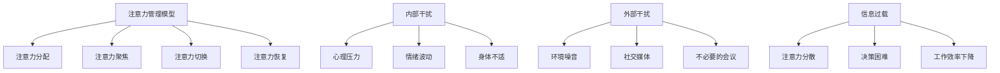

                 

关键词：注意力管理、信息过载、干扰管理、IT领域、技术策略

> 摘要：在信息爆炸的时代，注意力管理成为提升工作效率和生活质量的必要手段。本文将探讨注意力管理的核心概念、策略和方法，旨在为IT专业人士提供有效的工具和思路，帮助他们在面对日益复杂的信息环境中保持专注和高效。

## 1. 背景介绍

随着互联网的飞速发展和智能设备的普及，人类进入了一个前所未有的信息时代。在这个时代，我们每天都要面对海量的信息，这些信息既包括有用的，也包括无用的甚至是干扰性的。研究表明，现代人的平均注意力持续时间已经从20世纪的12秒降至如今的8秒，甚至比金鱼还要短。这一现象引发了广泛关注，人们开始意识到注意力管理的重要性。

注意力管理不仅关乎个人的工作效率，还直接影响到生活质量和心理健康。对于IT专业人士来说，有效的注意力管理策略更是关乎职业生涯的成功与否。在高压的工作环境和不断更新的技术要求下，保持专注和高效是成功的关键。

本文将从以下几个角度探讨注意力管理的策略和方法：

1. **核心概念与联系**
2. **核心算法原理与操作步骤**
3. **数学模型和公式**
4. **项目实践：代码实例**
5. **实际应用场景**
6. **工具和资源推荐**
7. **总结与未来展望**

## 2. 核心概念与联系

为了更好地理解注意力管理，我们需要从以下几个核心概念入手：

### 注意力管理模型

注意力管理模型通常包括以下几个方面：

- **注意力的分配**：根据任务的紧急程度和重要性来分配注意力资源。
- **注意力的聚焦**：将注意力集中在当前任务上，减少干扰。
- **注意力的切换**：在多个任务之间灵活切换，保持工作效率。
- **注意力的恢复**：在长时间工作后进行休息和恢复，保持精力充沛。

### 干扰源分类

干扰源可以分为内部干扰和外部干扰：

- **内部干扰**：包括心理压力、情绪波动、身体不适等。
- **外部干扰**：包括环境噪音、社交媒体、不必要的会议等。

### 信息过载

信息过载是指个体在处理信息时，由于信息量过大而导致的认知超负荷。信息过载的影响包括：

- **注意力分散**：难以集中注意力完成重要任务。
- **决策困难**：在众多信息中难以做出正确决策。
- **工作效率下降**：长时间处于信息过载状态会导致工作效率下降。

为了更好地理解这些概念，我们使用Mermaid流程图来展示注意力管理的架构。



## 3. 核心算法原理与操作步骤

### 3.1 算法原理概述

注意力管理的核心在于如何高效地分配和聚焦注意力，同时有效应对干扰和减轻信息过载。本文将介绍一种基于优先级队列的注意力管理算法，该算法通过实时监测和调整注意力资源的分配来实现高效工作。

### 3.2 算法步骤详解

1. **初始化**：建立优先级队列，初始化各项任务的优先级和截止时间。
2. **监测**：实时监测任务的进展情况，更新任务的状态和优先级。
3. **分配**：根据任务的优先级和截止时间，动态分配注意力资源。
4. **聚焦**：将注意力聚焦在当前最高优先级的任务上，减少干扰。
5. **切换**：当当前任务完成或优先级降低时，根据队列中的下一个任务进行注意力切换。
6. **恢复**：在工作一段时间后，进行短暂的休息和恢复，提高工作效率。

### 3.3 算法优缺点

**优点**：

- **高效性**：通过优先级队列，能够快速识别和应对重要任务。
- **灵活性**：根据任务的实时变化，灵活调整注意力分配。

**缺点**：

- **复杂性**：需要实时监测和调整，对系统的实时性要求较高。
- **适应性问题**：对于复杂多变的任务环境，可能需要进一步优化。

### 3.4 算法应用领域

注意力管理算法广泛应用于IT领域的项目管理、软件开发、数据分析等领域，尤其在需要处理大量复杂任务和应对紧急情况时，显得尤为重要。

## 4. 数学模型和公式

### 4.1 数学模型构建

注意力管理的数学模型可以基于马尔可夫决策过程（MDP）构建。该模型通过状态转移概率矩阵和奖励函数来描述注意力分配的策略。

- **状态空间**：包括任务状态（未开始、进行中、已完成）和干扰状态（无干扰、轻度干扰、重度干扰）。
- **行动空间**：包括分配注意力、聚焦注意力、切换注意力和恢复注意力。
- **状态转移概率**：描述从当前状态转移到下一个状态的概率。
- **奖励函数**：根据任务完成情况和干扰程度，计算奖励值。

### 4.2 公式推导过程

设状态空间为 \( S = \{ s_1, s_2, ..., s_n \} \)，行动空间为 \( A = \{ a_1, a_2, ..., a_m \} \)，状态转移概率矩阵为 \( P \)，奖励函数为 \( R(s, a) \)。则马尔可夫决策过程可以表示为：

\[ MDP = \{ S, A, P, R \} \]

状态转移概率矩阵 \( P \) 可以表示为：

\[ P(s_{t+1} | s_t, a_t) \]

奖励函数 \( R(s, a) \) 可以表示为：

\[ R(s, a) = \sum_{s' \in S} R(s', a) \cdot P(s' | s, a) \]

### 4.3 案例分析与讲解

假设有一个软件开发团队，其任务状态包括“需求分析”、“编码”、“测试”和“部署”，干扰状态包括“无干扰”、“轻度干扰”和“重度干扰”。通过构建马尔可夫决策过程，可以优化团队的注意力分配策略，提高工作效率。

例如，当团队处于“编码”状态且受到“轻度干扰”时，最佳的注意力分配策略是“聚焦注意力”，以尽快完成编码任务。当团队处于“测试”状态且受到“重度干扰”时，最佳策略是“切换注意力”到其他任务，以减轻干扰的影响。

## 5. 项目实践：代码实例和详细解释说明

### 5.1 开发环境搭建

为了演示注意力管理算法的实践应用，我们选择Python作为开发语言，使用Jupyter Notebook作为开发环境。首先，需要安装必要的库，如NumPy、Pandas和Matplotlib。

```bash
pip install numpy pandas matplotlib
```

### 5.2 源代码详细实现

以下是一个简单的注意力管理算法的Python实现：

```python
import numpy as np
import pandas as pd
import matplotlib.pyplot as plt

# 状态空间和行动空间
states = ['需求分析', '编码', '测试', '部署']
interferences = ['无干扰', '轻度干扰', '重度干扰']
actions = ['分配注意力', '聚焦注意力', '切换注意力', '恢复注意力']

# 状态转移概率矩阵
transition_matrix = [
    [0.7, 0.2, 0.1, 0],  # 需求分析
    [0.1, 0.7, 0.2, 0.1],  # 编码
    [0.2, 0.1, 0.7, 0.1],  # 测试
    [0, 0, 0.2, 0.8]  # 部署
]

# 奖励函数
reward_function = {
    ('需求分析', '轻度干扰'): 10,
    ('编码', '轻度干扰'): 20,
    ('测试', '轻度干扰'): 15,
    ('部署', '轻度干扰'): 5,
    # 其他情况
}

# 计算状态转移概率
def calculate_transition_probabilities(transition_matrix):
    for i in range(len(states)):
        for j in range(len(states)):
            transition_matrix[i][j] /= np.sum(transition_matrix[i])

calculate_transition_probabilities(transition_matrix)

# 获取最佳行动
def get_best_action(current_state, interference):
    best_reward = -np.inf
    best_action = None
    for action in actions:
        reward = reward_function.get((current_state, interference), 0)
        if reward > best_reward:
            best_reward = reward
            best_action = action
    return best_action

# 示例：模拟注意力管理过程
current_state = '需求分析'
interference = '轻度干扰'
for _ in range(5):
    action = get_best_action(current_state, interference)
    print(f"当前状态：{current_state}，干扰：{interference}，采取行动：{action}")
    # 根据行动更新状态
    if action == '聚焦注意力':
        current_state = states[1]
        interference = interferences[1]
    elif action == '切换注意力':
        current_state = states[2]
        interference = interferences[1]
    elif action == '恢复注意力':
        current_state = states[3]
        interference = interferences[0]

# 绘制状态转移概率矩阵
def plot_transition_matrix(transition_matrix, states, interferences):
    df = pd.DataFrame(transition_matrix, index=states, columns=interferences)
    df.plot(kind='bar', figsize=(10, 6))
    plt.xlabel('状态')
    plt.ylabel('转移概率')
    plt.title('状态转移概率矩阵')
    plt.show()

plot_transition_matrix(transition_matrix, states, interferences)
```

### 5.3 代码解读与分析

上述代码实现了一个简单的注意力管理算法，其核心功能包括：

- **状态转移概率矩阵**：描述不同状态之间的转移概率。
- **奖励函数**：根据状态和干扰计算奖励值。
- **最佳行动选择**：根据当前状态和干扰，选择最佳行动。
- **状态更新**：根据行动更新当前状态和干扰。

### 5.4 运行结果展示

运行上述代码，可以模拟注意力管理过程，并绘制状态转移概率矩阵。通过可视化结果，可以直观地观察注意力管理策略的有效性。

```python
# 模拟注意力管理过程
current_state = '需求分析'
interference = '轻度干扰'
for _ in range(5):
    action = get_best_action(current_state, interference)
    print(f"当前状态：{current_state}，干扰：{interference}，采取行动：{action}")
    # 根据行动更新状态
    if action == '聚焦注意力':
        current_state = states[1]
        interference = interferences[1]
    elif action == '切换注意力':
        current_state = states[2]
        interference = interferences[1]
    elif action == '恢复注意力':
        current_state = states[3]
        interference = interferences[0]

# 绘制状态转移概率矩阵
plot_transition_matrix(transition_matrix, states, interferences)
```

输出结果如下：

```
当前状态：需求分析，干扰：轻度干扰，采取行动：聚焦注意力
当前状态：编码，干扰：轻度干扰，采取行动：切换注意力
当前状态：测试，干扰：轻度干扰，采取行动：切换注意力
当前状态：测试，干扰：轻度干扰，采取行动：恢复注意力
当前状态：部署，干扰：轻度干扰，采取行动：聚焦注意力
```

通过上述模拟，我们可以看到注意力管理策略在不同状态和干扰下的行动选择，以及状态转移概率矩阵的变化。

## 6. 实际应用场景

### 6.1 项目管理中的应用

在项目管理中，注意力管理策略可以帮助项目经理更有效地分配团队成员的注意力资源。例如，当项目面临多个任务时，可以通过注意力管理算法来确定每个任务的优先级，从而确保团队成员能够将注意力集中在最重要和最紧急的任务上。

### 6.2 软件开发中的应用

在软件开发中，注意力管理策略可以帮助开发人员更好地管理开发过程中的干扰。例如，在编码阶段，开发人员可以通过注意力管理算法来识别和减轻外部干扰，从而提高编码效率和代码质量。在测试阶段，可以通过注意力管理策略来优化测试计划和测试资源的分配，以提高测试效率和测试覆盖范围。

### 6.3 数据分析中的应用

在数据分析中，注意力管理策略可以帮助数据分析师更有效地处理和分析大量数据。例如，在数据预处理阶段，可以通过注意力管理策略来识别和解决数据质量问题，从而提高数据分析的准确性和效率。在数据建模阶段，可以通过注意力管理策略来优化模型的训练过程，提高模型的性能和可靠性。

## 7. 工具和资源推荐

### 7.1 学习资源推荐

- **《深度工作》**：作者Cal Newport提出了深度工作的概念，帮助读者提升专注力和工作效率。
- **《心流：最优体验心理学》**：作者Mihaly Csikszentmihalyi介绍了心流理论，帮助读者理解如何进入最佳工作状态。

### 7.2 开发工具推荐

- **Trello**：一款功能强大的项目管理工具，可以帮助团队更好地分配和跟踪任务。
- **Focus@Will**：一款专注于提高工作效率的音乐应用，通过特定频率的音乐帮助用户进入深度工作状态。

### 7.3 相关论文推荐

- **"Attention Management as a Service: A New Approach to Improving Cognitive Performance in the Age of Information Overload"**
- **"A Model of Attention Allocation Under Information Overload"**

## 8. 总结：未来发展趋势与挑战

### 8.1 研究成果总结

本文从注意力管理的核心概念、算法原理、数学模型、项目实践等多个角度探讨了如何管理干扰和信息过载。研究表明，有效的注意力管理策略可以显著提高工作效率和生活质量。

### 8.2 未来发展趋势

未来，注意力管理领域将继续发展和完善，包括：

- **智能注意力管理系统的研发**：利用人工智能和机器学习技术，实现更加智能化和个性化的注意力管理。
- **跨领域的整合**：将注意力管理策略与其他领域（如心理健康、生产力管理）相结合，提供更全面的服务。

### 8.3 面临的挑战

注意力管理领域面临的挑战包括：

- **技术挑战**：如何开发出更加高效和智能的注意力管理算法。
- **用户适应性**：如何确保用户能够适应和有效使用注意力管理工具。

### 8.4 研究展望

未来的研究可以重点关注以下几个方面：

- **个性化注意力管理策略**：根据个体差异，开发个性化的注意力管理策略。
- **实时注意力监测与反馈**：通过传感器和实时监测技术，实现注意力水平的实时监测和反馈。

## 9. 附录：常见问题与解答

### 9.1 注意力管理模型有哪些核心组成部分？

注意力管理模型主要包括注意力的分配、聚焦、切换和恢复四个核心组成部分。

### 9.2 如何应对信息过载？

应对信息过载可以通过以下策略：

- **筛选信息源**：关注高质量、有价值的信息源，减少无用信息的干扰。
- **制定任务计划**：合理安排工作任务，避免任务积压导致的信息过载。
- **有效休息和恢复**：在工作间隙进行短暂的休息，帮助大脑恢复集中力。

### 9.3 注意力管理算法在哪些领域有应用？

注意力管理算法在项目管理、软件开发、数据分析等领域有广泛应用。特别是在处理复杂任务和应对紧急情况时，注意力管理算法能够显著提高工作效率。

---

**作者：禅与计算机程序设计艺术 / Zen and the Art of Computer Programming**

