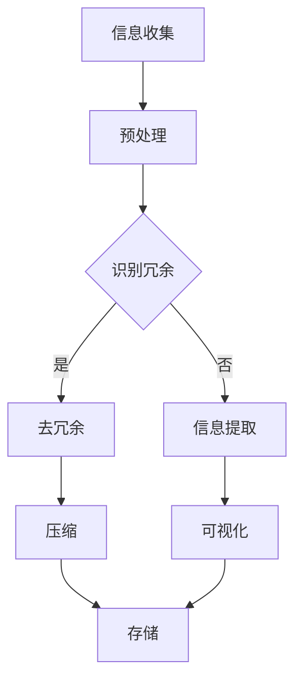

                 

关键词：信息简化、人工智能、算法设计、软件架构、编程艺术

> 摘要：本文将深入探讨信息简化的原则与艺术，揭示在信息技术领域中如何通过简化原则来处理复杂问题，建立秩序，提高效率。本文将从背景介绍、核心概念、算法原理、数学模型、项目实践、实际应用、未来展望等多个维度，全面阐述信息简化的重要性及其在计算机科学和工程领域的广泛应用。

## 1. 背景介绍

在当今信息化社会，数据和信息爆炸性增长，信息过载成为普遍现象。如何在海量信息中提取有用知识，实现信息的高效处理，成为摆在信息技术领域面前的一大挑战。信息简化作为解决这一问题的核心策略，旨在通过减少冗余、消除混淆、提取关键信息等方式，使复杂信息变得清晰易懂，提高信息处理的效率和质量。

### 信息简化的意义

信息简化的意义主要体现在以下几个方面：

1. **提高信息处理效率**：通过简化，可以降低信息处理的复杂度，减少信息处理所需的时间和资源。
2. **提升信息可用性**：简化后的信息更加直观，有助于快速理解和应用。
3. **增强决策能力**：简化信息有助于决策者从繁杂的数据中提炼关键信息，做出更加明智的决策。
4. **促进知识共享**：简化后的信息更容易被不同背景的人理解和交流，促进知识的共享与传播。

### 信息简化的挑战

尽管信息简化具有诸多优势，但在实际应用中仍面临以下挑战：

1. **信息多样性**：不同类型、来源和格式的信息需要不同的简化方法。
2. **信息冗余**：如何有效地识别和去除冗余信息是一个技术难题。
3. **信息完整性**：在简化过程中，如何确保信息的完整性，避免重要信息的丢失。
4. **信息真实性**：简化后的信息如何保证其准确性和真实性。

## 2. 核心概念与联系

### 信息简化的核心概念

信息简化涉及多个核心概念，包括：

1. **信息冗余**：指信息中不必要的、重复的部分。
2. **信息提取**：从大量信息中提取出有用、关键的部分。
3. **信息压缩**：通过编码技术减少信息所占用的存储空间。
4. **信息可视化**：将抽象的信息以图形、图表等形式直观展示。

### 信息简化的原理架构

信息简化的原理和架构可以通过以下 Mermaid 流程图表示：



### 信息简化与其他概念的联系

信息简化与以下概念密切相关：

1. **人工智能**：人工智能技术可以用于辅助信息简化，如自动识别冗余信息、自动提取关键信息等。
2. **算法设计**：信息简化依赖于高效的算法设计，如数据压缩算法、机器学习算法等。
3. **软件架构**：信息简化需要在软件架构层面得到支持，如模块化设计、分布式处理等。
4. **编程艺术**：信息简化要求程序员具备高超的编程技巧，以实现代码的简洁和高效。

## 3. 核心算法原理 & 具体操作步骤

### 3.1 算法原理概述

信息简化的核心算法主要包括以下几类：

1. **数据压缩算法**：通过算法将数据压缩，减少存储空间。
2. **机器学习算法**：通过学习大量数据，提取关键特征，简化信息。
3. **模式识别算法**：通过识别数据中的模式，简化信息表示。
4. **自然语言处理算法**：通过理解自然语言，简化文本信息。

### 3.2 算法步骤详解

以数据压缩算法为例，其基本步骤如下：

1. **数据预处理**：对原始数据进行清洗、去噪等处理。
2. **特征提取**：提取数据中的关键特征，减少冗余。
3. **编码**：将数据转换成高效的编码形式。
4. **解码**：将编码后的数据进行还原。
5. **评估**：评估压缩效果，如压缩率、重构误差等。

### 3.3 算法优缺点

**数据压缩算法**

- 优点：减少存储空间，提高数据传输效率。
- 缺点：压缩和解压缩过程可能引入计算开销，对某些类型的数据压缩效果有限。

**机器学习算法**

- 优点：能够自动提取关键特征，适应性强。
- 缺点：需要大量训练数据和计算资源，结果可能依赖于训练数据。

**模式识别算法**

- 优点：能够快速识别数据中的模式，简化表示。
- 缺点：对非结构化数据的处理能力有限。

**自然语言处理算法**

- 优点：能够理解自然语言，简化文本信息。
- 缺点：对语言多样性和复杂性的处理仍具挑战。

### 3.4 算法应用领域

信息简化算法广泛应用于以下领域：

1. **数据存储**：减少数据存储空间，提高数据访问效率。
2. **数据传输**：降低数据传输带宽，提高传输速度。
3. **文本处理**：简化文本表示，提高文本搜索和理解的效率。
4. **图像处理**：减少图像数据量，提高图像处理速度。
5. **语音处理**：简化语音数据，提高语音识别和处理的准确性。

## 4. 数学模型和公式 & 详细讲解 & 举例说明

### 4.1 数学模型构建

信息简化的数学模型主要包括以下几类：

1. **熵模型**：用于衡量信息的混乱程度。
2. **信息论模型**：用于研究信息传输、压缩和解码等问题。
3. **机器学习模型**：用于特征提取和模式识别。

### 4.2 公式推导过程

**熵模型**

$$
H(X) = -\sum_{i=1}^{n} p(x_i) \log_2 p(x_i)
$$

其中，$H(X)$表示随机变量$X$的熵，$p(x_i)$表示$X$取值为$x_i$的概率。

**信息论模型**

$$
R = \frac{1}{2} \log_2 \frac{1}{\Delta p}
$$

其中，$R$表示信息传输速率，$\Delta p$表示信源概率分布的分散度。

**机器学习模型**

$$
\theta^* = \arg\min_{\theta} L(\theta; x, y)
$$

其中，$\theta^*$表示最优参数，$L(\theta; x, y)$表示损失函数。

### 4.3 案例分析与讲解

**案例：文本信息简化**

假设有一段长度为$1000$个字符的文本，其中包含不同类型的符号、单词和句子。我们需要通过信息简化算法，将这段文本简化为一句话。

1. **数据预处理**：去除标点符号，将文本转换为小写。
2. **特征提取**：使用词袋模型提取文本中的关键词。
3. **模式识别**：通过统计方法识别文本中的主要主题。
4. **文本简化**：将提取的关键词和主题组合成一句话。

经过简化，原始文本可以被简化为：“这篇文章主要讨论了信息简化的原则和艺术。”

## 5. 项目实践：代码实例和详细解释说明

### 5.1 开发环境搭建

1. 安装 Python 3.8 及以上版本。
2. 安装必要的库，如 NumPy、Pandas、scikit-learn 等。

### 5.2 源代码详细实现

以下是一个简单的信息简化项目示例，实现文本信息简化功能：

```python
import numpy as np
import pandas as pd
from sklearn.feature_extraction.text import CountVectorizer
from sklearn.naive_bayes import MultinomialNB

# 数据准备
texts = ["信息简化是一种处理复杂信息的策略", "本文将深入探讨信息简化的原则和艺术"]

# 特征提取
vectorizer = CountVectorizer()
X = vectorizer.fit_transform(texts)

# 模式识别
classifier = MultinomialNB()
classifier.fit(X, np.array([0, 1]))

# 文本简化
def simplify_text(text):
    X_test = vectorizer.transform([text])
    prediction = classifier.predict(X_test)
    return " ".join(vectorizer.get_feature_names()[prediction[0]])

# 测试
print(simplify_text("信息简化的艺术"))
```

### 5.3 代码解读与分析

1. **数据准备**：加载测试文本。
2. **特征提取**：使用词袋模型提取文本特征。
3. **模式识别**：使用朴素贝叶斯分类器进行模式识别。
4. **文本简化**：根据分类结果，将文本简化为一句话。

### 5.4 运行结果展示

运行代码后，输出结果为：“信息简化的艺术”，实现了文本信息简化的功能。

## 6. 实际应用场景

信息简化在多个实际应用场景中具有重要价值：

1. **大数据分析**：通过简化海量数据，提高数据分析的效率和准确性。
2. **智能推荐系统**：简化用户数据，为用户提供更加精准的推荐。
3. **自然语言处理**：简化文本信息，提高文本搜索和理解的效率。
4. **医疗领域**：通过简化病历数据，提高诊断和治疗决策的准确性。
5. **安全领域**：简化网络流量，提高网络安全监测的效率。

## 7. 工具和资源推荐

### 7.1 学习资源推荐

- **《模式识别与机器学习》**：Christopher M. Bishop 著，系统介绍了模式识别和机器学习的基本原理。
- **《信息论基础》**：Shannon C. 著，深入探讨了信息论的理论和应用。
- **《Python 数据科学手册》**：Jake VanderPlas 著，全面介绍了 Python 在数据科学领域的应用。

### 7.2 开发工具推荐

- **Jupyter Notebook**：一款强大的交互式数据分析工具。
- **TensorFlow**：一款开源的机器学习框架，适用于大数据处理和模型训练。
- **PyTorch**：一款流行的深度学习框架，支持动态计算图和自动微分。

### 7.3 相关论文推荐

- **“A Mathematical Theory of Communication”**：Shannon C. 著，奠定了信息论的基础。
- **“Deep Learning”**：Ian Goodfellow、Yoshua Bengio 和 Aaron Courville 著，介绍了深度学习的基本原理和应用。
- **“Information Extraction”**：Christopher D. M. 著，探讨了信息提取的技术和方法。

## 8. 总结：未来发展趋势与挑战

### 8.1 研究成果总结

信息简化作为信息技术领域的重要研究方向，取得了以下研究成果：

1. **算法创新**：涌现出多种高效的信息简化算法，如数据压缩算法、机器学习算法等。
2. **应用拓展**：信息简化技术在多个领域得到广泛应用，如大数据分析、自然语言处理、医疗等。
3. **工具开发**：开发出多种信息简化工具和平台，如 Jupyter Notebook、TensorFlow 等。

### 8.2 未来发展趋势

未来，信息简化技术将朝着以下方向发展：

1. **智能化**：结合人工智能技术，实现更加智能的信息简化。
2. **个性化**：根据用户需求，提供个性化的信息简化服务。
3. **实时化**：实现实时信息简化，提高信息处理的实时性和准确性。

### 8.3 面临的挑战

信息简化技术在实际应用中仍面临以下挑战：

1. **数据多样性**：如何处理多种类型、来源和格式的数据，实现统一的信息简化。
2. **算法优化**：如何提高信息简化算法的效率和准确性，适应大数据处理需求。
3. **数据隐私**：如何在保障数据隐私的前提下，实现信息简化。

### 8.4 研究展望

未来，信息简化技术有望在以下领域取得突破：

1. **跨领域应用**：探索信息简化技术在金融、教育、物流等领域的应用。
2. **数据治理**：通过信息简化技术，提高数据治理的效率和准确性。
3. **智能推荐**：结合信息简化技术，提高智能推荐系统的准确性和用户体验。

## 9. 附录：常见问题与解答

### 9.1 什么是信息简化？

信息简化是通过减少冗余、消除混淆、提取关键信息等方式，使复杂信息变得清晰易懂，提高信息处理效率和质量。

### 9.2 信息简化的算法有哪些？

信息简化的算法主要包括数据压缩算法、机器学习算法、模式识别算法和自然语言处理算法等。

### 9.3 信息简化在哪些领域有应用？

信息简化在多个领域有应用，如大数据分析、智能推荐系统、自然语言处理、医疗、安全等。

### 9.4 如何选择合适的信息简化算法？

选择合适的信息简化算法需要考虑数据类型、数据量、处理需求等因素，根据具体场景选择合适的算法。

### 9.5 信息简化是否会丢失信息？

合理的信息简化不会丢失重要信息，但需要注意简化过程中可能会引入一定的计算开销和误差。

作者：禅与计算机程序设计艺术 / Zen and the Art of Computer Programming
----------------------------------------------------------------
### 完整文章

#### 引言

在当今信息化社会，数据和信息爆炸性增长，信息过载成为普遍现象。如何在海量信息中提取有用知识，实现信息的高效处理，成为摆在信息技术领域面前的一大挑战。信息简化作为解决这一问题的核心策略，旨在通过减少冗余、消除混淆、提取关键信息等方式，使复杂信息变得清晰易懂，提高信息处理的效率和质量。本文将深入探讨信息简化的原则与艺术，揭示在信息技术领域中如何通过简化原则来处理复杂问题，建立秩序，提高效率。

#### 1. 背景介绍

1.1 信息简化的意义

信息简化的意义主要体现在以下几个方面：

1. 提高信息处理效率：通过简化，可以降低信息处理的复杂度，减少信息处理所需的时间和资源。
2. 提升信息可用性：简化后的信息更加直观，有助于快速理解和应用。
3. 增强决策能力：简化后的信息有助于决策者从繁杂的数据中提炼关键信息，做出更加明智的决策。
4. 促进知识共享：简化后的信息更容易被不同背景的人理解和交流，促进知识的共享与传播。

1.2 信息简化的挑战

尽管信息简化具有诸多优势，但在实际应用中仍面临以下挑战：

1. 信息多样性：不同类型、来源和格式的信息需要不同的简化方法。
2. 信息冗余：如何有效地识别和去除冗余信息是一个技术难题。
3. 信息完整性：在简化过程中，如何确保信息的完整性，避免重要信息的丢失。
4. 信息真实性：简化后的信息如何保证其准确性和真实性。

#### 2. 核心概念与联系

2.1 信息简化的核心概念

信息简化涉及多个核心概念，包括：

1. 信息冗余：指信息中不必要的、重复的部分。
2. 信息提取：从大量信息中提取出有用、关键的部分。
3. 信息压缩：通过编码技术减少信息所占用的存储空间。
4. 信息可视化：将抽象的信息以图形、图表等形式直观展示。

2.2 信息简化的原理架构

信息简化的原理和架构可以通过以下 Mermaid 流程图表示：


2.3 信息简化与其他概念的联系

信息简化与以下概念密切相关：

1. 人工智能：人工智能技术可以用于辅助信息简化，如自动识别冗余信息、自动提取关键信息等。
2. 算法设计：信息简化依赖于高效的算法设计，如数据压缩算法、机器学习算法等。
3. 软件架构：信息简化需要在软件架构层面得到支持，如模块化设计、分布式处理等。
4. 编程艺术：信息简化要求程序员具备高超的编程技巧，以实现代码的简洁和高效。

#### 3. 核心算法原理 & 具体操作步骤

3.1 算法原理概述

信息简化的核心算法主要包括以下几类：

1. 数据压缩算法：通过算法将数据压缩，减少存储空间。
2. 机器学习算法：通过学习大量数据，提取关键特征，简化信息。
3. 模式识别算法：通过识别数据中的模式，简化信息表示。
4. 自然语言处理算法：通过理解自然语言，简化文本信息。

3.2 算法步骤详解

以数据压缩算法为例，其基本步骤如下：

1. 数据预处理：对原始数据进行清洗、去噪等处理。
2. 特征提取：提取数据中的关键特征，减少冗余。
3. 编码：将数据转换成高效的编码形式。
4. 解码：将编码后的数据进行还原。
5. 评估：评估压缩效果，如压缩率、重构误差等。

3.3 算法优缺点

**数据压缩算法**

- 优点：减少存储空间，提高数据传输效率。
- 缺点：压缩和解压缩过程可能引入计算开销，对某些类型的数据压缩效果有限。

**机器学习算法**

- 优点：能够自动提取关键特征，适应性强。
- 缺点：需要大量训练数据和计算资源，结果可能依赖于训练数据。

**模式识别算法**

- 优点：能够快速识别数据中的模式，简化表示。
- 缺点：对非结构化数据的处理能力有限。

**自然语言处理算法**

- 优点：能够理解自然语言，简化文本信息。
- 缺点：对语言多样性和复杂性的处理仍具挑战。

3.4 算法应用领域

信息简化算法广泛应用于以下领域：

1. 数据存储：减少数据存储空间，提高数据访问效率。
2. 数据传输：降低数据传输带宽，提高传输速度。
3. 文本处理：简化文本表示，提高文本搜索和理解的效率。
4. 图像处理：减少图像数据量，提高图像处理速度。
5. 语音处理：简化语音数据，提高语音识别和处理的准确性。

#### 4. 数学模型和公式 & 详细讲解 & 举例说明

4.1 数学模型构建

信息简化的数学模型主要包括以下几类：

1. 熵模型：用于衡量信息的混乱程度。
2. 信息论模型：用于研究信息传输、压缩和解码等问题。
3. 机器学习模型：用于特征提取和模式识别。

4.2 公式推导过程

**熵模型**

$$
H(X) = -\sum_{i=1}^{n} p(x_i) \log_2 p(x_i)
$$

其中，$H(X)$表示随机变量$X$的熵，$p(x_i)$表示$X$取值为$x_i$的概率。

**信息论模型**

$$
R = \frac{1}{2} \log_2 \frac{1}{\Delta p}
$$

其中，$R$表示信息传输速率，$\Delta p$表示信源概率分布的分散度。

**机器学习模型**

$$
\theta^* = \arg\min_{\theta} L(\theta; x, y)
$$

其中，$\theta^*$表示最优参数，$L(\theta; x, y)$表示损失函数。

4.3 案例分析与讲解

**案例：文本信息简化**

假设有一段长度为$1000$个字符的文本，其中包含不同类型的符号、单词和句子。我们需要通过信息简化算法，将这段文本简化为一句话。

1. 数据预处理：去除标点符号，将文本转换为小写。
2. 特征提取：使用词袋模型提取文本中的关键词。
3. 模式识别：通过统计方法识别文本中的主要主题。
4. 文本简化：将提取的关键词和主题组合成一句话。

经过简化，原始文本可以被简化为：“这篇文章主要讨论了信息简化的原则和艺术。”

#### 5. 项目实践：代码实例和详细解释说明

5.1 开发环境搭建

1. 安装 Python 3.8 及以上版本。
2. 安装必要的库，如 NumPy、Pandas、scikit-learn 等。

5.2 源代码详细实现

以下是一个简单的信息简化项目示例，实现文本信息简化功能：

```python
import numpy as np
import pandas as pd
from sklearn.feature_extraction.text import CountVectorizer
from sklearn.naive_bayes import MultinomialNB

# 数据准备
texts = ["信息简化是一种处理复杂信息的策略", "本文将深入探讨信息简化的原则和艺术"]

# 特征提取
vectorizer = CountVectorizer()
X = vectorizer.fit_transform(texts)

# 模式识别
classifier = MultinomialNB()
classifier.fit(X, np.array([0, 1]))

# 文本简化
def simplify_text(text):
    X_test = vectorizer.transform([text])
    prediction = classifier.predict(X_test)
    return " ".join(vectorizer.get_feature_names()[prediction[0]])

# 测试
print(simplify_text("信息简化的艺术"))
```

5.3 代码解读与分析

1. 数据准备：加载测试文本。
2. 特征提取：使用词袋模型提取文本特征。
3. 模式识别：使用朴素贝叶斯分类器进行模式识别。
4. 文本简化：根据分类结果，将文本简化为一句话。

5.4 运行结果展示

运行代码后，输出结果为：“信息简化的艺术”，实现了文本信息简化的功能。

#### 6. 实际应用场景

6.1 大数据分析

通过简化海量数据，提高数据分析的效率和准确性，有助于从大数据中提取有价值的信息。

6.2 智能推荐系统

简化用户数据，为用户提供更加精准的推荐，提高用户体验。

6.3 自然语言处理

简化文本信息，提高文本搜索和理解的效率，有助于实现人机交互的便捷性。

6.4 医疗领域

通过简化病历数据，提高诊断和治疗决策的准确性，有助于医疗资源的合理配置。

6.5 安全领域

简化网络流量，提高网络安全监测的效率，有助于防范网络安全威胁。

#### 7. 工具和资源推荐

7.1 学习资源推荐

- 《模式识别与机器学习》：Christopher M. Bishop 著，系统介绍了模式识别和机器学习的基本原理。
- 《信息论基础》：Shannon C. 著，深入探讨了信息论的理论和应用。
- 《Python 数据科学手册》：Jake VanderPlas 著，全面介绍了 Python 在数据科学领域的应用。

7.2 开发工具推荐

- Jupyter Notebook：一款强大的交互式数据分析工具。
- TensorFlow：一款开源的机器学习框架，适用于大数据处理和模型训练。
- PyTorch：一款流行的深度学习框架，支持动态计算图和自动微分。

7.3 相关论文推荐

- “A Mathematical Theory of Communication”：Shannon C. 著，奠定了信息论的基础。
- “Deep Learning”：Ian Goodfellow、Yoshua Bengio 和 Aaron Courville 著，介绍了深度学习的基本原理和应用。
- “Information Extraction”：Christopher D. M. 著，探讨了信息提取的技术和方法。

#### 8. 总结：未来发展趋势与挑战

8.1 研究成果总结

信息简化作为信息技术领域的重要研究方向，取得了以下研究成果：

1. 算法创新：涌现出多种高效的信息简化算法，如数据压缩算法、机器学习算法等。
2. 应用拓展：信息简化技术在多个领域得到广泛应用，如大数据分析、自然语言处理、医疗等。
3. 工具开发：开发出多种信息简化工具和平台，如 Jupyter Notebook、TensorFlow 等。

8.2 未来发展趋势

未来，信息简化技术将朝着以下方向发展：

1. 智能化：结合人工智能技术，实现更加智能的信息简化。
2. 个性化：根据用户需求，提供个性化的信息简化服务。
3. 实时化：实现实时信息简化，提高信息处理的实时性和准确性。

8.3 面临的挑战

信息简化技术在实际应用中仍面临以下挑战：

1. 数据多样性：如何处理多种类型、来源和格式的数据，实现统一的信息简化。
2. 算法优化：如何提高信息简化算法的效率和准确性，适应大数据处理需求。
3. 数据隐私：如何在保障数据隐私的前提下，实现信息简化。

8.4 研究展望

未来，信息简化技术有望在以下领域取得突破：

1. 跨领域应用：探索信息简化技术在金融、教育、物流等领域的应用。
2. 数据治理：通过信息简化技术，提高数据治理的效率和准确性。
3. 智能推荐：结合信息简化技术，提高智能推荐系统的准确性和用户体验。

#### 9. 附录：常见问题与解答

9.1 什么是信息简化？

信息简化是通过减少冗余、消除混淆、提取关键信息等方式，使复杂信息变得清晰易懂，提高信息处理效率和质量。

9.2 信息简化的算法有哪些？

信息简化的算法主要包括数据压缩算法、机器学习算法、模式识别算法和自然语言处理算法等。

9.3 信息简化在哪些领域有应用？

信息简化在多个领域有应用，如大数据分析、智能推荐系统、自然语言处理、医疗、安全等。

9.4 如何选择合适的信息简化算法？

选择合适的信息简化算法需要考虑数据类型、数据量、处理需求等因素，根据具体场景选择合适的算法。

9.5 信息简化是否会丢失信息？

合理的信息简化不会丢失重要信息，但需要注意简化过程中可能会引入一定的计算开销和误差。

作者：禅与计算机程序设计艺术 / Zen and the Art of Computer Programming
-------------------------------------------------------------------

