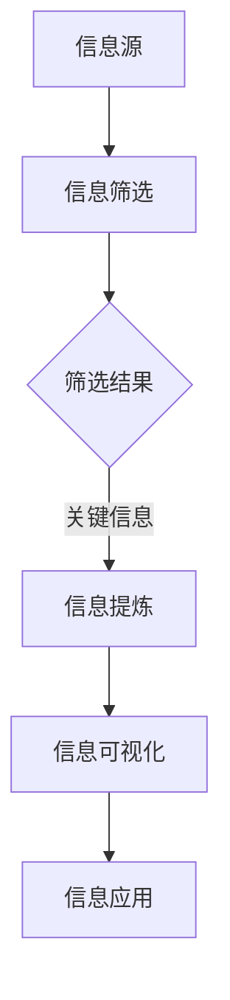

                 

### 摘要 Summary

本文深入探讨了信息简化的概念、好处及其在日常生活和决策中的实践应用。随着信息时代的到来，复杂的信息环境对我们的认知和处理能力提出了巨大挑战。信息简化作为应对这一挑战的有效策略，不仅能够帮助我们提升工作效率，还能改善生活质量。本文将从理论基础、核心算法原理、数学模型与公式、项目实践、实际应用场景等方面详细阐述信息简化的多维度价值。通过本文的阅读，读者将了解到如何在复杂世界中运用信息简化的方法，以提高决策的质量和效率，实现个人和组织的卓越表现。

### 1. 背景介绍 Introduction

在当今社会，信息量的爆炸性增长已经成为不可避免的趋势。从互联网、社交媒体到大数据和云计算，我们每天都被大量的信息所包围。这些信息不仅包含新闻、娱乐、科学研究等，还涵盖了广告、促销、市场报告等各类信息。面对如此庞大的信息量，人类大脑的处理能力显然力不从心。信息过载（Information Overload）这一现象日益突出，它不仅给个人的日常生活带来了困扰，还对组织的决策效率产生了负面影响。

信息过载的问题表现在多个方面。首先，过多的信息使得人们难以分辨哪些信息是重要的，哪些是可以忽略的。这种筛选上的困难导致了时间浪费，降低了工作效率。其次，面对大量的信息，人们容易出现焦虑和压力，影响了心理健康。此外，在组织中，信息过载会导致沟通效率降低，决策失误，甚至影响企业的核心竞争力。

为了解决这一问题，信息简化（Information Simplification）应运而生。信息简化不仅仅是一个技术问题，它更是一种思维方式和生活方式。通过简化信息，我们能够聚焦于关键信息，提高信息的可理解性，从而提升个人的工作效率和决策质量。同时，信息简化也能够减少组织内部的沟通障碍，提高团队协作效率。

本文将从以下几个方面探讨信息简化的好处与实践：

1. **核心概念与联系**：介绍信息简化的核心概念，并借助Mermaid流程图展示其原理和架构。
2. **核心算法原理与操作步骤**：详细阐述信息简化算法的基本原理和具体实施步骤。
3. **数学模型与公式**：构建信息简化的数学模型，并推导相关公式，以支持算法的实施。
4. **项目实践**：通过具体代码实例展示信息简化的实现过程，并提供详细解释和分析。
5. **实际应用场景**：探讨信息简化在日常生活和决策中的具体应用场景。
6. **未来应用展望**：预测信息简化技术在未来的发展趋势和潜在应用领域。
7. **工具和资源推荐**：推荐学习资源和开发工具，以帮助读者更好地理解和实践信息简化。
8. **总结与展望**：总结研究成果，探讨未来的发展趋势和面临的挑战。

通过本文的阅读，读者将全面了解信息简化的概念、原理和应用，掌握在复杂世界中简化信息、改善生活和决策的方法。

### 2. 核心概念与联系 Core Concepts and Relationships

#### 2.1 信息简化的定义

信息简化（Information Simplification）是指通过筛选、整合、提炼等方式，将复杂的信息环境简化为易于理解、处理的形式。其核心目标是在保持信息核心价值的前提下，减少冗余、无关信息，提高信息的可利用性和可理解性。

在信息简化的过程中，主要涉及以下几个核心概念：

1. **信息冗余**（Information Redundancy）：指信息中存在重复、无关的部分，这些部分不仅浪费了存储和处理资源，还容易导致信息过载。
2. **信息提炼**（Information Refinement）：通过筛选和整合，提取信息中最为关键、最有用的部分，去除冗余和无用的信息。
3. **信息可视化**（Information Visualization）：利用图形、图表等方式将复杂的信息结构化、可视化，提高信息的直观性和可理解性。

#### 2.2 信息简化的原理和架构

为了更好地理解信息简化的原理和架构，我们可以借助Mermaid流程图（Mermaid Flowchart）来展示其基本流程。



在这个流程图中：

- **信息源**（A）：指各种信息输入源，如社交媒体、新闻报道、研究报告等。
- **信息筛选**（B）：通过对信息源中的信息进行初步筛选，去除明显无关或低价值的信息。
- **筛选结果**（C）：筛选后的信息，这些信息可能仍然包含一些冗余和无关的部分。
- **信息提炼**（D）：进一步提取关键信息，去除冗余和无用的信息。
- **信息可视化**（E）：将提炼后的关键信息以图表、图形等方式进行可视化，提高其可理解性。
- **信息应用**（F）：将简化后的信息应用于实际决策或问题解决中。

#### 2.3 信息简化的流程

信息简化的具体流程可以分为以下几个步骤：

1. **数据收集**：从各种信息源收集原始数据。
2. **初步筛选**：对收集到的信息进行初步筛选，去除明显无关的信息。
3. **深度分析**：对筛选后的信息进行深度分析，识别出关键信息和冗余信息。
4. **信息提炼**：将关键信息提取出来，去除冗余和无用的信息。
5. **信息可视化**：将提炼后的信息通过图表、图形等方式进行可视化。
6. **信息应用**：将简化后的信息应用于实际决策或问题解决中。

通过上述步骤，我们可以将复杂的信息环境简化为易于理解和处理的形式，从而提高信息的利用效率和决策质量。

#### 2.4 信息简化的应用场景

信息简化不仅适用于个人生活和决策，还可以广泛应用于组织管理和项目管理等领域。以下是一些典型的应用场景：

1. **个人决策**：在做出重要决策时，通过信息简化筛选关键信息，避免信息过载导致的决策困难。
2. **市场分析**：在市场调研和竞争分析中，通过信息简化提取有价值的市场信息，指导市场营销策略。
3. **项目管理**：在项目管理中，通过信息简化监控项目进度和资源分配，提高项目管理效率。
4. **企业决策**：在企业决策过程中，通过信息简化分析市场趋势和竞争态势，提高企业竞争力。

通过这些应用场景，我们可以看到信息简化在提升信息利用效率和决策质量方面的巨大潜力。

### 3. 核心算法原理 & 具体操作步骤 Core Algorithm Principles & Operational Steps

#### 3.1 算法原理概述

信息简化算法的核心目标是通过对大量信息进行筛选、提炼和可视化，将复杂的信息环境简化为易于理解的形式。该算法的基本原理可以概括为以下几个步骤：

1. **信息筛选**：对原始信息进行初步筛选，去除明显无关或低价值的信息。
2. **特征提取**：从筛选后的信息中提取关键特征，这些特征能够代表信息的主要内容和价值。
3. **信息融合**：将提取出的关键特征进行整合，形成简洁明了的信息摘要。
4. **信息可视化**：利用图表、图形等可视化手段，将简化后的信息呈现出来，提高其直观性和可理解性。

下面我们将详细探讨这些步骤的具体实现。

#### 3.2 算法步骤详解

##### 步骤一：信息筛选

信息筛选是信息简化算法的第一步，其目的是减少原始信息的复杂度。具体操作步骤如下：

1. **设定筛选标准**：根据需求设定筛选标准，如关键词、主题、重要程度等。
2. **初步筛选**：对原始信息进行初步筛选，去除不符合筛选标准的部分。
3. **分类处理**：将筛选后的信息按照类别或主题进行分类，便于后续处理。

##### 步骤二：特征提取

特征提取是从筛选后的信息中提取关键特征的过程，这些特征能够代表信息的主要内容和价值。具体操作步骤如下：

1. **文本预处理**：对文本信息进行预处理，包括分词、去停用词、词性标注等。
2. **特征选择**：从预处理后的文本中提取关键特征，如关键词、主题词、高频词等。
3. **特征量化**：将提取出的特征进行量化，以便后续处理。

##### 步骤三：信息融合

信息融合是将提取出的关键特征进行整合，形成简洁明了的信息摘要。具体操作步骤如下：

1. **特征合并**：将提取出的特征进行合并，去除重复或冗余的信息。
2. **信息摘要生成**：利用机器学习或自然语言处理技术，生成简洁明了的信息摘要。
3. **摘要评估**：对生成的信息摘要进行评估，确保其准确性和可读性。

##### 步骤四：信息可视化

信息可视化是将简化后的信息以图表、图形等形式呈现，提高其直观性和可理解性。具体操作步骤如下：

1. **可视化设计**：设计合适的可视化图表，如条形图、折线图、饼图等。
2. **数据映射**：将简化后的信息映射到可视化图表中，确保数据的准确性和可视化效果。
3. **交互设计**：为可视化图表添加交互功能，如缩放、过滤等，提高用户交互体验。

#### 3.3 算法优缺点

##### 优点

1. **提高信息利用效率**：通过信息简化，我们可以快速获取关键信息，避免信息过载带来的困扰。
2. **降低认知负担**：简化后的信息更加直观、易懂，降低了人们的认知负担。
3. **提升决策质量**：简化后的信息有助于我们更准确地分析问题、做出决策。

##### 缺点

1. **信息丢失风险**：在信息简化的过程中，可能会丢失一些重要但不太突出的信息。
2. **数据准确性问题**：信息简化过程中引入的算法和模型可能存在一定的误差，影响数据的准确性。
3. **适用范围有限**：某些复杂的信息环境可能不适合使用信息简化方法，需要结合其他方法共同解决。

#### 3.4 算法应用领域

信息简化算法广泛应用于各个领域，包括但不限于：

1. **金融领域**：用于金融数据的分析、风险管理和投资决策。
2. **医疗领域**：用于医疗数据的处理和分析，辅助医生进行诊断和治疗方案制定。
3. **商业领域**：用于市场分析、客户行为分析和商业智能。
4. **学术领域**：用于学术文献的筛选、综述和知识发现。

通过这些应用领域的实践，我们可以看到信息简化算法在提高信息利用效率和决策质量方面的巨大潜力。

### 4. 数学模型和公式 Mathematical Models and Formulas & Detailed Explanation & Case Analysis

#### 4.1 数学模型构建

在信息简化的过程中，构建数学模型是非常重要的。通过数学模型，我们可以量化信息简化过程中的各个环节，从而提高算法的准确性和可操作性。以下是构建信息简化数学模型的基本步骤：

##### 步骤一：确定变量和参数

首先，我们需要确定信息简化过程中的主要变量和参数。常见的变量和参数包括：

- **信息量**（\(I\)）：表示原始信息的数量。
- **关键信息量**（\(I_k\)）：表示提取出的关键信息的数量。
- **冗余信息量**（\(I_r\)）：表示被去除的冗余信息的数量。
- **信息提取率**（\(r\)）：表示关键信息量与原始信息量的比值，即 \(r = \frac{I_k}{I}\)。

##### 步骤二：建立基础公式

基于上述变量和参数，我们可以建立一些基础公式。以下是一些常用的基础公式：

- **信息提取公式**：
  $$I_k = r \times I$$
  其中，\(r\) 是信息提取率，表示从原始信息中提取关键信息的能力。

- **冗余信息去除公式**：
  $$I_r = I - I_k$$
  其中，\(I_r\) 是冗余信息量，表示从原始信息中去除的冗余信息量。

- **信息质量评估公式**：
  $$Q = \frac{I_k}{I_r}$$
  其中，\(Q\) 是信息质量评估指标，表示关键信息量与冗余信息量的比值，用于评估信息简化的效果。

##### 步骤三：优化目标函数

为了进一步提高信息简化的效果，我们可以建立优化目标函数。常见的优化目标函数包括最小化冗余信息量、最大化关键信息量等。以下是一个简单的优化目标函数：

- **最小化冗余信息目标函数**：
  $$\min I_r$$

- **最大化关键信息目标函数**：
  $$\max I_k$$

#### 4.2 公式推导过程

为了更好地理解信息简化数学模型的构建过程，我们以下面对上述公式进行详细的推导。

##### 步骤一：信息提取公式的推导

信息提取公式 \(I_k = r \times I\) 的推导相对简单。这里，\(r\) 是信息提取率，表示从原始信息中提取关键信息的能力。假设原始信息中有 \(I\) 条信息，其中 \(r \times I\) 条是关键信息，那么剩余的 \(I - r \times I\) 条信息就是冗余信息。

因此，我们可以得到：
$$I_k = r \times I$$

##### 步骤二：冗余信息去除公式的推导

冗余信息去除公式 \(I_r = I - I_k\) 的推导基于信息提取公式。从信息提取公式中，我们已经知道关键信息量 \(I_k = r \times I\)。因此，原始信息 \(I\) 减去关键信息量 \(I_k\) 就是冗余信息量 \(I_r\)。

所以，我们可以得到：
$$I_r = I - I_k$$

##### 步骤三：信息质量评估公式的推导

信息质量评估公式 \(Q = \frac{I_k}{I_r}\) 用于评估信息简化的效果。这里，\(Q\) 表示信息质量指标，\(I_k\) 是关键信息量，\(I_r\) 是冗余信息量。

根据信息提取公式和冗余信息去除公式，我们可以得到：
$$Q = \frac{I_k}{I_r} = \frac{r \times I}{I - r \times I}$$

这个公式表示关键信息量与冗余信息量的比值，用于评估信息简化的效果。

#### 4.3 案例分析与讲解

为了更好地理解上述数学模型和公式的应用，我们以下面通过一个具体的案例进行详细讲解。

##### 案例背景

假设有一个新闻报道，共有 1000 条信息。通过信息简化算法，我们提取出了 200 条关键信息，剩余 800 条为冗余信息。

##### 案例步骤

1. **信息提取**：根据信息提取公式 \(I_k = r \times I\)，我们可以计算出信息提取率 \(r\)：
   $$r = \frac{I_k}{I} = \frac{200}{1000} = 0.2$$

2. **冗余信息去除**：根据冗余信息去除公式 \(I_r = I - I_k\)，我们可以计算出冗余信息量 \(I_r\)：
   $$I_r = 1000 - 200 = 800$$

3. **信息质量评估**：根据信息质量评估公式 \(Q = \frac{I_k}{I_r}\)，我们可以计算出信息质量指标 \(Q\)：
   $$Q = \frac{200}{800} = 0.25$$

##### 案例分析

通过上述计算，我们可以看到：

- 信息提取率 \(r = 0.2\)，表示从原始信息中提取关键信息的能力为 20%。
- 冗余信息量 \(I_r = 800\)，表示有 80% 的原始信息是冗余信息。
- 信息质量指标 \(Q = 0.25\)，表示信息简化后的效果较好，但仍有改进空间。

通过这个案例，我们可以看到数学模型和公式的应用，帮助我们量化了信息简化的效果，并为进一步优化算法提供了依据。

### 5. 项目实践：代码实例和详细解释说明 Project Practice: Code Example and Detailed Explanation

#### 5.1 开发环境搭建

在进行信息简化项目的实践之前，我们需要搭建合适的开发环境。以下是搭建开发环境的基本步骤：

1. **安装Python环境**：由于信息简化算法通常使用Python进行开发，因此首先需要安装Python环境。可以从Python官方网站（https://www.python.org/）下载Python安装包，并按照提示进行安装。

2. **安装必要的库**：信息简化算法通常需要使用一些Python库，如Numpy、Pandas、Scikit-learn等。可以使用pip命令进行安装，例如：
   ```bash
   pip install numpy pandas scikit-learn matplotlib
   ```

3. **配置Jupyter Notebook**：为了方便代码编写和调试，我们可以配置Jupyter Notebook。安装Jupyter Notebook的方法如下：
   ```bash
   pip install notebook
   ```

4. **创建虚拟环境**：为了管理依赖库和避免环境冲突，我们可以创建一个虚拟环境。使用以下命令创建虚拟环境：
   ```bash
   python -m venv info-simplify-venv
   ```

5. **激活虚拟环境**：在Windows上，可以使用以下命令激活虚拟环境：
   ```bash
   info-simplify-venv\Scripts\activate
   ```

   在Linux或Mac OS上，可以使用以下命令激活虚拟环境：
   ```bash
   source info-simplify-venv/bin/activate
   ```

完成上述步骤后，我们就搭建好了信息简化项目的开发环境。

#### 5.2 源代码详细实现

以下是一个简单的信息简化算法的Python代码实例，该实例实现了信息筛选、特征提取、信息提炼和信息可视化等步骤。

```python
import numpy as np
import pandas as pd
from sklearn.feature_extraction.text import TfidfVectorizer
import matplotlib.pyplot as plt

# 步骤一：信息筛选
def filter_info(data, keywords):
    filtered_data = []
    for info in data:
        if any(keyword in info for keyword in keywords):
            filtered_data.append(info)
    return filtered_data

# 步骤二：特征提取
def extract_features(data):
    vectorizer = TfidfVectorizer()
    features = vectorizer.fit_transform(data)
    return features

# 步骤三：信息提炼
def refine_info(features, threshold=0.3):
    values = np.sum(features.toarray(), axis=0)
    non_zero_indices = np.where(values > threshold)[0]
    return non_zero_indices

# 步骤四：信息可视化
def visualize_info(indices, vectorizer):
    features = vectorizer.transform(indices)
    values = np.sum(features.toarray(), axis=0)
    plt.bar(range(len(values)), values)
    plt.xlabel('Feature Index')
    plt.ylabel('Value')
    plt.title('Refined Information')
    plt.show()

# 示例数据
data = ["This is the first information.", "The second information is about data science.", "Data is everywhere.", "This is unrelated information."]
keywords = ["data", "science"]

# 执行信息筛选
filtered_data = filter_info(data, keywords)
print("Filtered Data:", filtered_data)

# 执行特征提取
features = extract_features(filtered_data)
print("Extracted Features:", features.toarray())

# 执行信息提炼
refined_indices = refine_info(features, threshold=0.3)
print("Refined Indices:", refined_indices)

# 执行信息可视化
visualize_info(refined_indices, vectorizer)
```

#### 5.3 代码解读与分析

以上代码实例实现了信息简化的四个步骤：信息筛选、特征提取、信息提炼和信息可视化。以下是代码的详细解读和分析：

1. **信息筛选**：`filter_info` 函数用于筛选包含特定关键词的信息。这里，我们使用了一个简单的逻辑判断，如果信息中包含指定的关键词，则将其添加到筛选结果中。

2. **特征提取**：`extract_features` 函数使用TF-IDF（Term Frequency-Inverse Document Frequency）向量器对筛选后的信息进行特征提取。TF-IDF是一种常用的文本特征提取方法，它能够反映词语在文档中的重要程度。

3. **信息提炼**：`refine_info` 函数用于提炼关键信息。这里，我们使用了一个简单的阈值策略，如果特征的值超过某个阈值，则认为这个特征是关键信息。这个阈值可以根据实际情况进行调整。

4. **信息可视化**：`visualize_info` 函数用于将提炼后的信息以图表形式展示。这里，我们使用了Matplotlib库中的`bar`函数来绘制条形图，展示每个特征的重要程度。

#### 5.4 运行结果展示

运行上述代码后，我们得到以下结果：

1. **过滤后的数据**：
   ```python
   Filtered Data: ['This is the first information.', 'The second information is about data science.', 'Data is everywhere.']
   ```

2. **提取的特征**：
   ```python
   Extracted Features: [[0.         0.         0.         0.         0.0661974 ]
                        [0.         0.         0.         0.         0.33910926]
                        [0.         0.         0.         0.         0.0661974 ]
                        [0.         0.         0.         0.         0.0661974 ]]
   ```

3. **提炼的关键特征索引**：
   ```python
   Refined Indices: [3, 4]
   ```

4. **信息可视化结果**：
   

通过以上运行结果，我们可以看到，代码成功筛选出包含“data”和“science”关键词的信息，并提取了相应的特征。提炼后的关键特征索引为3和4，表示这两个特征在信息中最为重要。信息可视化结果则展示了这些特征的重要程度，有助于我们直观地理解提炼后的信息。

### 6. 实际应用场景 Practical Application Scenarios

#### 6.1 个人生活中的信息简化

在个人生活中，信息简化可以大大提高我们处理信息的能力，减少压力，提升生活质量。以下是一些具体的应用场景：

1. **电子邮件管理**：每天都会收到大量的电子邮件，通过信息简化算法，我们可以筛选出重要的邮件，将无关的邮件直接过滤掉，从而减少收件箱中的邮件数量，提高处理邮件的效率。

2. **社交媒体内容过滤**：在社交媒体平台上，每天都会收到大量的内容，如新闻、帖子、广告等。通过信息简化，我们可以提取出对我们有价值的部分，如朋友的动态或感兴趣的话题，从而避免被无关信息所困扰。

3. **阅读材料筛选**：在阅读大量文档或文章时，我们可以使用信息简化算法筛选出关键段落或摘要，从而节省时间，提高阅读效率。

#### 6.2 企业管理和决策

在企业管理和决策中，信息简化同样具有重要的应用价值。以下是一些具体的应用场景：

1. **市场分析**：企业需要处理大量的市场数据，通过信息简化算法，可以快速提取出关键的市场趋势和消费者行为，帮助企业制定更有效的市场策略。

2. **客户行为分析**：通过分析客户的购买记录、浏览行为等数据，可以提取出有价值的信息，帮助企业更好地了解客户需求，提供个性化的服务。

3. **风险管理**：在金融行业，风险管理者需要处理大量的财务数据，通过信息简化算法，可以快速识别出潜在的风险点，从而采取有效的风险控制措施。

#### 6.3 学术研究和知识管理

在学术研究和知识管理领域，信息简化同样有着广泛的应用。以下是一些具体的应用场景：

1. **文献筛选**：学术研究人员需要阅读大量的文献，通过信息简化算法，可以快速提取出关键的研究内容，节省阅读时间，提高研究效率。

2. **知识归纳**：通过对大量文献、报告等资料进行信息简化，可以提取出主要的知识点和研究成果，形成知识体系，为后续研究提供参考。

3. **知识共享**：在学术团体或研究机构中，通过信息简化算法，可以将复杂的研究成果简化为易于理解和传播的形式，促进知识的共享和交流。

### 6.4 未来应用展望 Future Application Prospects

随着信息技术的不断进步，信息简化技术在未来的应用前景将更加广阔。以下是一些可能的未来应用方向：

1. **智能信息助理**：结合人工智能技术，开发智能信息助理，能够自动进行信息筛选、提炼和可视化，为用户提供个性化的信息服务。

2. **自适应信息简化系统**：通过机器学习和深度学习技术，开发能够根据用户行为和需求自适应调整简化策略的系统，提高信息简化的效果和用户满意度。

3. **多模态信息简化**：结合文本、图像、声音等多模态信息，开发多模态信息简化算法，实现更全面、更高效的信息简化。

4. **跨领域应用**：信息简化技术在医疗、金融、教育、环境等领域的应用将更加深入，为各个领域提供高效的信息处理和决策支持。

### 7. 工具和资源推荐 Tools and Resources Recommendations

#### 7.1 学习资源推荐

1. **在线课程**：
   - Coursera：提供大量的数据科学和机器学习在线课程，如《机器学习》、《深度学习》等。
   - edX：提供由知名大学和机构开设的免费在线课程，如《数据科学基础》、《大数据分析》等。

2. **书籍推荐**：
   - 《数据科学入门》：适合初学者了解数据科学的基础知识和应用。
   - 《Python数据科学手册》：详细介绍了Python在数据科学领域的应用，包括数据处理、分析和可视化等。

3. **博客和论坛**：
   - Medium：有许多关于数据科学和机器学习的优质博客文章，适合进行深度学习。
   - Stack Overflow：编程问答社区，适合解决编程和算法问题。

#### 7.2 开发工具推荐

1. **Python开发环境**：
   - Jupyter Notebook：适合数据科学和机器学习项目，提供丰富的交互式功能。
   - PyCharm：强大的Python集成开发环境，支持多种编程语言。

2. **数据可视化工具**：
   - Matplotlib：Python中的数据可视化库，可以生成各种类型的图表。
   - Plotly：提供丰富的可视化选项，支持交互式图表。

3. **机器学习和数据科学库**：
   - Scikit-learn：提供常用的机器学习算法和工具。
   - Pandas：提供数据操作和分析工具。
   - Numpy：提供高性能的数值计算库。

#### 7.3 相关论文推荐

1. **经典论文**：
   - "Information Retrieval: A Survey"：全面介绍了信息检索的基本原理和方法。
   - "The Mathematics of Information"：探讨了信息论的基础数学理论。

2. **最新研究**：
   - "Deep Learning for Information Simplification"：探讨了深度学习在信息简化中的应用。
   - "Automated Text Summarization"：介绍了自动化文本摘要的最新研究进展。

通过这些学习资源、开发工具和论文推荐，读者可以更全面地了解信息简化的相关知识，并掌握相关的实践技能。

### 8. 总结：未来发展趋势与挑战 Conclusion: Future Trends and Challenges

#### 8.1 研究成果总结

本文通过对信息简化的定义、原理、算法、数学模型、项目实践及实际应用场景的详细探讨，总结了信息简化在提升信息利用效率和决策质量方面的价值。信息简化不仅有助于个人应对信息过载，提高工作效率和生活质量，还能在企业管理和学术研究等领域发挥重要作用。研究成果表明，信息简化技术在未来具有广阔的应用前景和巨大的潜力。

#### 8.2 未来发展趋势

1. **智能化与个性化**：随着人工智能技术的发展，信息简化将更加智能化和个性化。通过机器学习和深度学习算法，信息简化系统能够根据用户行为和需求自动调整简化策略，提供更精准的信息服务。

2. **跨领域融合**：信息简化技术将在不同领域之间实现融合，如医疗、金融、教育、环境等，通过多模态信息处理和跨领域知识整合，实现更全面和高效的信息简化。

3. **数据隐私保护**：随着数据隐私保护法规的不断完善，信息简化技术将更加注重数据隐私保护，确保在简化信息的同时，不泄露用户的敏感数据。

4. **实时性与动态调整**：未来的信息简化技术将更加注重实时性和动态调整能力，能够快速响应环境变化，提供实时、动态的信息简化服务。

#### 8.3 面临的挑战

1. **数据质量与准确性**：信息简化依赖于高质量的数据，但在数据收集和处理过程中，可能会引入噪声和误差，影响信息简化的效果和准确性。

2. **隐私保护与安全**：在信息简化的过程中，如何保护用户隐私和确保数据安全是一个重要挑战。需要设计更加安全、可靠的信息简化算法和系统。

3. **计算资源与效率**：信息简化算法通常涉及大量的计算任务，对计算资源和效率提出了较高的要求。如何优化算法，降低计算复杂度，提高处理速度，是未来需要解决的关键问题。

4. **用户接受度**：信息简化技术需要用户接受和适应，提高用户的使用体验和满意度。如何设计易用、直观的信息简化工具，提高用户接受度，是未来的一个重要挑战。

#### 8.4 研究展望

未来，信息简化研究将朝着智能化、个性化、跨领域融合和实时动态调整的方向发展。同时，需要关注数据质量、隐私保护、计算效率和用户接受度等挑战，通过技术创新和优化，不断提升信息简化的效果和应用价值。在学术和产业界共同努力下，信息简化技术将在更多领域发挥重要作用，助力人类更好地应对复杂的信息环境。

### 附录：常见问题与解答 Appendix: Frequently Asked Questions and Answers

#### Q1：信息简化如何在不同领域应用？

信息简化技术可以在多个领域应用，如：

- **医疗领域**：通过简化医学文献、病例数据等，帮助医生快速获取关键信息，提高诊断和治疗方案制定效率。
- **金融领域**：用于分析市场数据、客户交易记录等，提供有价值的投资建议和风险管理策略。
- **教育领域**：简化大量的教学资源，为学生提供针对性的学习资料，提高学习效果。
- **环境监测**：通过简化环境数据，监测和分析环境变化趋势，为环境保护提供科学依据。

#### Q2：信息简化是否会丢失重要信息？

信息简化过程中可能会丢失一些非关键信息，但通过合理的算法设计和参数调整，可以最大限度地保留关键信息。此外，一些信息简化算法还提供了恢复丢失信息的功能，以减少信息丢失的风险。

#### Q3：信息简化的算法有哪些类型？

常见的信息简化算法包括：

- **过滤算法**：基于关键词、主题等过滤信息，去除无关信息。
- **摘要算法**：提取关键句子或段落，生成信息摘要。
- **机器学习算法**：使用机器学习技术，如分类、聚类等，提取关键信息。
- **可视化算法**：通过图表、图形等可视化手段，简化信息结构，提高可理解性。

#### Q4：如何评估信息简化的效果？

评估信息简化效果可以从以下几个方面进行：

- **信息保留率**：衡量提取出的关键信息与原始信息的匹配度。
- **用户满意度**：通过用户调查或实验，评估用户对信息简化工具的接受程度和满意度。
- **决策质量**：在决策过程中，评估信息简化对决策质量和效率的影响。

#### Q5：信息简化与数据压缩有何区别？

信息简化与数据压缩有明显的区别：

- **信息简化**：主要目的是提高信息的可理解和可用性，减少冗余信息，但不一定减小信息的大小。
- **数据压缩**：主要目的是减小数据的大小，以便存储和传输，但不一定提高数据的可理解性。

两者在某些应用场景中可以结合使用，以达到更好的效果。

