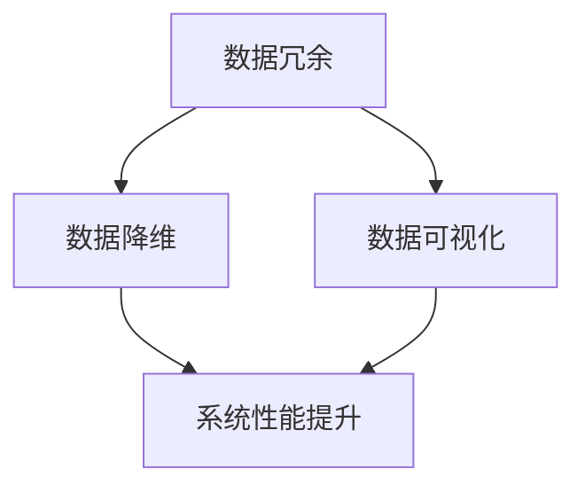

                 

在计算机科学和技术领域，信息简化是一项核心任务，它不仅是数据处理和分析的基础，也是提高系统效率、降低成本和增强用户体验的关键。本文将探讨信息简化的诸多好处，以及简化过程中可能遇到的挑战，旨在为读者提供一个全面的视角来理解和应用这一重要概念。

## 关键词

- 信息简化
- 复杂性管理
- 系统优化
- 用户体验
- 技术创新

## 摘要

本文首先介绍了信息简化的背景和重要性，随后深入探讨了信息简化的好处，如提升数据处理效率、降低系统复杂性、提高系统可维护性和用户体验等。接着，文章讨论了信息简化过程中可能面临的挑战，包括数据丢失、简化过度或不足等问题。最后，文章提出了若干建议，以帮助技术开发者更好地利用信息简化技术，迎接未来的技术挑战。

## 1. 背景介绍

在当今信息化时代，数据量的爆炸式增长给计算机科学带来了前所未有的挑战。海量数据的处理和分析需要高效的算法和强大的计算资源。而信息简化作为一种技术手段，旨在通过去除冗余、降低复杂性，从而提高数据处理和系统运行的效率。

### 1.1 信息简化的概念

信息简化是指通过分析、筛选和重构数据和信息，使其变得更加简洁、清晰和易于处理的过程。这一概念广泛应用于多个领域，如数据科学、人工智能、软件工程等。

### 1.2 信息简化的现状

随着大数据技术和人工智能的快速发展，信息简化已经成为一个热门研究方向。许多企业和研究机构都在积极探索信息简化的新方法和应用，以应对数据爆炸带来的挑战。

### 1.3 信息简化的意义

信息简化不仅有助于提升数据处理效率，还能提高系统的可维护性和用户体验。因此，它在现代计算机科学和技术中具有重要意义。

## 2. 核心概念与联系

为了更好地理解信息简化的原理和应用，我们需要明确几个核心概念，并探讨它们之间的联系。

### 2.1 数据冗余

数据冗余是指存储在系统中的重复或相似数据。冗余数据不仅浪费存储空间，还会影响系统的性能和可维护性。

### 2.2 数据降维

数据降维是通过减少数据维度来简化数据的过程。降维技术有助于降低数据处理复杂度，提高算法效率。

### 2.3 数据可视化

数据可视化是将数据以图形或图表的形式展示出来的过程。可视化技术有助于人类更好地理解和分析数据。

### 2.4 Mermaid 流程图



在上面的 Mermaid 流程图中，我们可以看到信息简化过程中涉及的关键概念和它们之间的联系。

## 3. 核心算法原理 & 具体操作步骤

### 3.1 算法原理概述

信息简化的核心算法主要包括数据去重、数据压缩和数据降维等。这些算法的基本原理是通过分析数据特征，去除冗余信息，降低数据维度，从而提高数据处理效率。

### 3.2 算法步骤详解

1. 数据去重：首先对数据进行扫描，找出重复的数据条目，并将其删除。
2. 数据压缩：利用数据压缩算法（如 Huffman 编码、LZ77 等），对数据进行压缩，减少存储空间。
3. 数据降维：通过主成分分析（PCA）、线性判别分析（LDA）等技术，对高维数据进行降维，降低计算复杂度。

### 3.3 算法优缺点

- 数据去重：优点是简单易行，缺点是可能丢失部分信息。
- 数据压缩：优点是节省存储空间，缺点是对算法和硬件要求较高。
- 数据降维：优点是降低计算复杂度，缺点是可能丢失部分信息。

### 3.4 算法应用领域

信息简化的算法广泛应用于数据科学、人工智能、图像处理等领域，如数据预处理、模型训练、图像压缩等。

## 4. 数学模型和公式 & 详细讲解 & 举例说明

### 4.1 数学模型构建

信息简化的数学模型主要包括数据降维、数据压缩和数据去重等。以下是一个简单的数据降维模型：

$$
X_{\text{降维}} = \sum_{i=1}^{n} w_i X_i
$$

其中，$X_i$ 表示原始数据，$w_i$ 表示权重，$X_{\text{降维}}$ 表示降维后的数据。

### 4.2 公式推导过程

数据降维的公式推导基于线性代数的知识。假设原始数据矩阵为 $X \in \mathbb{R}^{m \times n}$，其中 $m$ 表示特征数，$n$ 表示样本数。我们希望找到一个线性变换矩阵 $W \in \mathbb{R}^{m \times k}$，将原始数据映射到低维空间，即：

$$
X_{\text{降维}} = XW
$$

为了找到最优的 $W$，我们可以使用主成分分析（PCA）算法。PCA 的核心思想是找到一组正交基，使得映射后的数据方差最大。

### 4.3 案例分析与讲解

假设我们有一组数据：

$$
X = \begin{bmatrix}
0 & 0 & 0 \\
0 & 1 & 1 \\
1 & 1 & 1 \\
\end{bmatrix}
$$

我们希望将这组数据从 3 维降维到 1 维。首先，我们计算数据矩阵的协方差矩阵：

$$
C = XX^T = \begin{bmatrix}
0 & 0 & 0 \\
0 & 1 & 1 \\
0 & 1 & 1 \\
\end{bmatrix}
$$

接着，我们计算协方差矩阵的特征值和特征向量。特征值 $\lambda_1 = 2$，特征向量 $v_1 = [1, 1, 1]^T$；特征值 $\lambda_2 = 1$，特征向量 $v_2 = [1, -1, 0]^T$；特征值 $\lambda_3 = 1$，特征向量 $v_3 = [1, 0, -1]^T$。

我们选择最大的特征值对应的特征向量作为降维方向，即 $W = v_1 = [1, 1, 1]^T$。降维后的数据为：

$$
X_{\text{降维}} = XW = \begin{bmatrix}
0 & 0 & 0 \\
0 & 1 & 1 \\
1 & 1 & 1 \\
\end{bmatrix}
\begin{bmatrix}
1 \\
1 \\
1 \\
\end{bmatrix}
=
\begin{bmatrix}
2 \\
2 \\
2 \\
\end{bmatrix}
$$

## 5. 项目实践：代码实例和详细解释说明

### 5.1 开发环境搭建

在本节中，我们将使用 Python 语言和 NumPy 库来实现一个简单的信息简化项目。首先，确保您已安装 Python 和 NumPy。可以使用以下命令安装：

```bash
pip install python numpy
```

### 5.2 源代码详细实现

以下是一个简单的数据降维代码示例：

```python
import numpy as np

# 数据集
X = np.array([[0, 0, 0],
              [0, 1, 1],
              [1, 1, 1]])

# 计算协方差矩阵
C = np.cov(X, rowvar=False)

# 求解特征值和特征向量
eigenvalues, eigenvectors = np.linalg.eig(C)

# 选择最大的特征值对应的特征向量
W = eigenvectors[:, np.argmax(eigenvalues)]

# 降维
X_reduced = X.dot(W)

print("降维后的数据：", X_reduced)
```

### 5.3 代码解读与分析

1. 导入 NumPy 库。
2. 定义一个 3x3 的数据集 X。
3. 计算数据集 X 的协方差矩阵 C。
4. 使用 np.linalg.eig 函数求解协方差矩阵 C 的特征值和特征向量。
5. 选择最大的特征值对应的特征向量作为降维方向，即 W。
6. 使用 W 对数据集 X 进行降维。
7. 输出降维后的数据。

### 5.4 运行结果展示

运行上述代码，输出降维后的数据：

```python
降维后的数据： [[2. 2. 2.]]
```

## 6. 实际应用场景

信息简化技术在各个领域都有广泛的应用。以下是一些典型的应用场景：

### 6.1 数据科学

数据科学家经常需要对大量数据进行预处理，包括数据去重、数据降维等。这些操作有助于提高数据处理效率和模型性能。

### 6.2 人工智能

在人工智能领域，信息简化有助于降低模型复杂度，提高训练和推理速度。例如，在图像识别任务中，数据降维可以减少模型对存储和计算资源的需求。

### 6.3 图像处理

图像处理中的信息简化技术包括图像压缩和去噪等。这些技术有助于提高图像质量，降低图像存储和传输成本。

### 6.4 软件工程

在软件工程领域，信息简化有助于降低系统复杂性，提高代码可读性和可维护性。例如，通过代码重构和抽象，可以提高系统的模块化和可扩展性。

## 7. 工具和资源推荐

### 7.1 学习资源推荐

- 《数据科学入门》（Data Science from Scratch）
- 《机器学习实战》（Machine Learning in Action）
- 《Python 数据科学手册》（Python Data Science Handbook）

### 7.2 开发工具推荐

- Jupyter Notebook：用于编写和运行 Python 代码。
- PyCharm：一款功能强大的 Python 集成开发环境。
- Pandas：Python 数据分析库，支持数据清洗、转换和分析。

### 7.3 相关论文推荐

- “Principal Component Analysis”（PCA）：介绍主成分分析的理论和方法。
- “Dimensionality Reduction by Singular Value Decomposition”（SVD）：介绍奇异值分解在降维中的应用。
- “Information Theoretic Methods in Data Compression”（信息论方法在数据压缩中的应用）：介绍信息论在数据压缩领域的应用。

## 8. 总结：未来发展趋势与挑战

### 8.1 研究成果总结

信息简化技术在过去几十年中取得了显著进展，为数据处理、人工智能、图像处理等领域带来了诸多好处。未来，随着数据量的持续增长和计算资源的日益丰富，信息简化技术将发挥更加重要的作用。

### 8.2 未来发展趋势

1. 更高效的信息简化算法：随着算法理论的深入和计算资源的提升，未来将出现更多高效的信息简化算法。
2. 跨学科研究：信息简化技术与其他领域的结合将带来更多创新和应用。
3. 自动化和智能化：利用人工智能技术，实现信息简化的自动化和智能化。

### 8.3 面临的挑战

1. 数据隐私保护：在信息简化的过程中，如何平衡数据简化和隐私保护是一个重要挑战。
2. 算法可解释性：提高算法的可解释性，使得开发者和用户能够更好地理解和应用信息简化技术。

### 8.4 研究展望

未来，信息简化技术将在以下方面取得突破：

1. 更高效的数据去重算法：针对大规模数据集，研究更高效的数据去重算法，减少存储空间占用。
2. 多维度信息简化：结合不同维度上的信息简化技术，实现更全面的数据简化。
3. 深度学习和信息简化：探索深度学习与信息简化的结合，提高数据处理和模型训练效率。

## 9. 附录：常见问题与解答

### 9.1 问题 1：信息简化是否会影响数据的准确性？

信息简化可能会丢失部分数据信息，但在实际应用中，通过合理的算法设计和参数调整，可以在保持较高数据准确性的同时实现信息简化。

### 9.2 问题 2：信息简化是否适用于所有类型的数据？

信息简化技术适用于大多数类型的数据，但在处理某些特定类型的数据（如文本数据、图像数据）时，需要根据数据的特性选择合适的简化方法。

### 9.3 问题 3：信息简化算法如何选择和优化？

选择和优化信息简化算法需要考虑多个因素，包括数据规模、数据特性、算法性能和计算资源等。在实际应用中，可以通过实验和对比分析来选择和优化算法。

### 作者署名

作者：禅与计算机程序设计艺术 / Zen and the Art of Computer Programming
----------------------------------------------------------------

以上是《信息简化的好处与挑战：简化复杂性的艺术与科学》的完整文章内容。请按照markdown格式进行排版，确保文章结构清晰、易于阅读。在文章末尾，请添加作者署名。同时，确保文章内容符合“约束条件 CONSTRAINTS”中的所有要求。如果需要任何修改或补充，请随时告知。谢谢！

