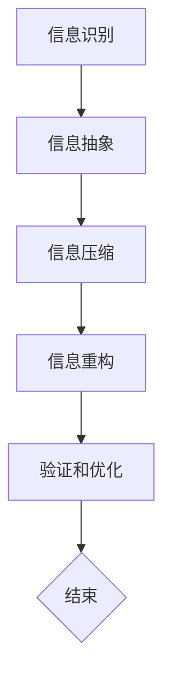

                 

 关键词：信息简化、复杂性理论、编程实践、算法优化、数学模型、代码示例、应用场景

> 摘要：本文旨在探讨信息简化的艺术，从复杂系统中提取核心要素，通过科学的方法和工具，将复杂的信息结构转化为简洁明了的形式。通过阐述信息简化的核心概念、算法原理、数学模型及其在实际应用中的实现，本文揭示了在信息技术领域中，简化并非削弱，而是提升系统效率和可理解性的关键手段。本文作者禅与计算机程序设计艺术，从多年的实践和研究出发，分享了对信息简化艺术的理解和经验。

## 1. 背景介绍

在当今信息爆炸的时代，如何处理和理解海量数据成为了一个严峻的挑战。传统的数据处理方法往往过于复杂，难以应对数据的多样性和动态性。为了应对这一挑战，信息简化的理念和技术逐渐被引入到各个领域，尤其在信息技术和计算机科学中，信息简化被证明是一种提升系统性能、降低开发难度、增强系统可维护性的有效手段。

信息简化的本质是通过识别和提取信息中的关键要素，对数据进行抽象和压缩，使其更加简洁、直观，从而便于人类理解和机器处理。然而，信息简化并非简单的数据压缩，它涉及到对信息本质的深刻理解和对复杂性理论的灵活运用。

本文将围绕信息简化的主题，首先介绍其核心概念和理论基础，然后深入探讨信息简化在实际应用中的具体实践，包括算法原理、数学模型和代码示例。通过这些探讨，我们希望能够为读者提供一个全面、深入的信息简化实践指南。

### 1.1  信息简化的重要性

在信息技术领域，信息简化的重要性不言而喻。首先，信息简化能够显著提高系统的效率和性能。通过简化信息结构，可以减少数据处理的时间和空间成本，提升系统的响应速度和处理能力。其次，信息简化有助于提升系统的可维护性和可扩展性。简洁明了的信息结构使得系统更容易理解和修改，从而降低了维护和扩展的难度。此外，信息简化还能够增强系统的可读性，使得开发者能够更高效地进行编码和调试。

总之，信息简化不仅是信息技术领域中的一种基本技能，更是一种深入理解和驾驭复杂系统的艺术。通过对信息简化方法的掌握和应用，我们能够更好地应对当今复杂多变的信息环境，为信息技术的发展提供强有力的支持。

## 2. 核心概念与联系

### 2.1  信息简化的定义

信息简化，即通过对信息进行抽象、压缩和重构，使其更加简洁、直观，从而便于人类理解和机器处理的过程。简而言之，信息简化是消除冗余、突出核心、简化表达的过程。在信息技术领域，信息简化不仅是一种技术手段，更是一种思维方式和设计理念。

### 2.2  复杂性理论

复杂性理论是研究复杂系统性质和行为的科学。复杂性理论关注的是系统在动态变化过程中所表现出的复杂性和规律性。在信息技术领域，复杂性理论为信息简化提供了理论依据和方法指导。通过复杂性理论，我们能够更好地理解和处理复杂的信息结构，找到其内在的简化路径。

### 2.3  信息简化的过程

信息简化的过程可以分为以下几个步骤：

1. **信息识别**：首先，识别信息中的关键要素和冗余部分。这一步骤是信息简化的基础，决定了后续简化的效果。

2. **信息抽象**：通过抽象，将关键要素从具体的数据和表达中提取出来，形成简洁明了的模型或结构。

3. **信息压缩**：利用数学和算法方法，对提取出的信息进行压缩，减少数据量，提高处理效率。

4. **信息重构**：对简化后的信息进行重构，形成新的、更加简洁明了的表达形式。

5. **验证和优化**：对简化后的信息进行验证，确保其正确性和有效性，并进行持续的优化。

### 2.4  Mermaid 流程图

为了更好地理解信息简化的过程，我们可以通过Mermaid流程图来表示。以下是一个简单的Mermaid流程图示例：



在这个流程图中，每个节点代表信息简化过程中的一个步骤，节点之间的箭头表示步骤的顺序和依赖关系。通过这个流程图，我们可以清晰地看到信息简化的整体过程和各个步骤之间的联系。

### 2.5  信息简化的意义

信息简化的意义在于：

1. **提高效率**：通过简化信息结构，可以减少数据处理的时间和空间成本，提升系统的响应速度和处理能力。

2. **增强可维护性**：简洁明了的信息结构使得系统更容易理解和修改，从而降低了维护和扩展的难度。

3. **提升可扩展性**：信息简化使得系统更容易适应新的需求和变化，提高了系统的可扩展性。

4. **增强可读性**：简洁明了的信息结构使得开发者能够更高效地进行编码和调试，提升了开发效率。

总之，信息简化不仅是信息技术领域中的一种基本技能，更是一种深入理解和驾驭复杂系统的艺术。通过对信息简化方法的掌握和应用，我们能够更好地应对当今复杂多变的信息环境，为信息技术的发展提供强有力的支持。

### 2.6  复杂性理论在信息简化中的应用

复杂性理论在信息简化中的应用主要体现在以下几个方面：

1. **模式识别**：利用复杂性理论中的模式识别技术，可以有效地识别信息中的关键要素和冗余部分，为信息简化提供了基础。

2. **自组织系统**：自组织系统是复杂性理论的一个重要概念，通过自组织系统，可以实现信息结构的自动简化。例如，在神经网络和机器学习中，自组织映射（SOM）算法能够自动识别和提取数据中的关键特征。

3. **非线性动力学**：非线性动力学研究系统在动态变化过程中所表现出的复杂行为。通过非线性动力学方法，可以揭示信息结构中的复杂性和规律性，为信息简化提供了新的视角和方法。

4. **网络科学**：网络科学是研究复杂网络的性质和行为的科学。通过网络科学的方法，可以揭示信息传递和处理的复杂网络结构，为信息简化提供了重要的参考。

### 2.7  信息简化与复杂性理论的联系

信息简化与复杂性理论之间的联系在于：

1. **理论基础**：复杂性理论为信息简化提供了理论依据和方法指导，使得信息简化过程更加科学和有效。

2. **方法融合**：信息简化过程中可以融合复杂性理论中的多种方法和技术，例如模式识别、自组织系统、非线性动力学和网络科学等，从而提高信息简化的效果。

3. **相互促进**：信息简化能够降低系统的复杂性，为复杂性理论的研究提供了更加简洁和直观的模型。同时，复杂性理论的研究成果也为信息简化提供了新的思路和方法。

综上所述，信息简化与复杂性理论之间存在着密切的联系和相互促进的关系。通过融合复杂性理论中的多种方法和技术，我们可以更有效地进行信息简化，提高系统的效率和性能。

### 2.8  总结

信息简化作为复杂性理论的一个重要应用领域，通过对信息进行识别、抽象、压缩和重构，实现了复杂系统到简洁系统的转化。本文详细阐述了信息简化的核心概念、复杂性理论在信息简化中的应用，并通过Mermaid流程图展示了信息简化的过程。信息简化不仅提高了系统的效率和性能，还增强了系统的可维护性和可扩展性，为信息技术的发展提供了强有力的支持。在接下来的章节中，我们将深入探讨信息简化的具体算法原理和数学模型，为读者提供更加详细的实践指南。

### 3. 核心算法原理 & 具体操作步骤

#### 3.1 算法原理概述

信息简化算法的核心在于如何高效地识别和提取信息中的关键要素，并对其进行有效的压缩和重构。这一过程可以分解为以下几个关键步骤：

1. **特征选择**：首先，从原始信息中筛选出最具代表性的特征，这些特征应能够最大程度地代表原始信息的主要内容和价值。

2. **特征压缩**：对选定的特征进行压缩，减少数据量，提高处理效率。常用的压缩方法包括数据编码、特征缩减和统计模型等。

3. **信息重构**：将压缩后的特征重构为简洁、直观的信息表达形式，确保重构后的信息仍然具有原始信息的核心内容和价值。

4. **验证与优化**：对重构后的信息进行验证，确保其正确性和有效性，并根据实际效果进行持续的优化。

#### 3.2 算法步骤详解

1. **特征选择**

   - **重要性评分**：首先，对原始信息中的各个特征进行重要性评分，常用的方法包括信息增益、特征选择算法（如CFS、FID等）。

   - **过滤方法**：根据重要性评分，选择评分较高的特征作为候选特征。此外，还可以使用过滤方法，如相关性分析、方差分析等，进一步筛选出最相关的特征。

   - **嵌入方法**：利用特征嵌入技术，如Word2Vec、GloVe等，将文本特征转换为低维向量，从而进行特征选择。

2. **特征压缩**

   - **数据编码**：使用数据编码技术，如哈希编码、像素块编码等，将特征映射到较小的空间。

   - **特征缩减**：利用降维技术，如主成分分析（PCA）、线性判别分析（LDA）等，减少特征的维度。

   - **统计模型**：构建统计模型，如线性回归、逻辑回归等，对特征进行压缩和简化。

3. **信息重构**

   - **特征重建**：将压缩后的特征重新组合，形成新的信息表达形式。常用的方法包括聚类分析、主题模型等。

   - **可视化**：通过可视化技术，如散点图、热图等，将重构后的信息以直观的形式展示。

4. **验证与优化**

   - **交叉验证**：使用交叉验证方法，如K折交叉验证、LOOCV等，评估简化后的信息的准确性和有效性。

   - **模型评估**：通过模型评估指标，如精度、召回率、F1值等，对简化后的信息进行评估。

   - **持续优化**：根据评估结果，对算法进行优化和调整，以提高简化后的信息的质量。

#### 3.3 算法优缺点

**优点**：

1. **提高效率**：通过压缩特征和重构信息，可以显著减少数据处理的计算量和存储需求，提高系统的处理速度。

2. **增强可维护性**：简化后的信息结构更加直观和清晰，使得系统更容易理解和修改，降低了维护成本。

3. **提升可扩展性**：简化后的信息结构能够更好地适应新的需求和变化，提高了系统的可扩展性。

4. **增强可读性**：简洁明了的信息表达形式使得开发者能够更高效地进行编码和调试。

**缺点**：

1. **信息丢失**：在特征选择和压缩过程中，可能会丢失部分信息，导致重构后的信息与原始信息不完全一致。

2. **计算复杂度**：特征选择和压缩算法的计算复杂度较高，特别是在处理大规模数据时，可能会增加系统的计算负担。

3. **适用范围有限**：不同的信息简化算法适用于不同的场景和数据类型，选择合适的算法和参数是关键。

#### 3.4 算法应用领域

信息简化算法在多个领域有着广泛的应用：

1. **数据挖掘**：在数据挖掘中，信息简化算法可以帮助识别关键特征，降低特征维度，提高模型的训练效率和准确性。

2. **机器学习**：在机器学习中，信息简化算法可以用于数据预处理，减少训练数据量，加快模型训练速度。

3. **文本分析**：在文本分析中，信息简化算法可以用于提取关键词和主题，提高文本处理的效率和准确性。

4. **图像处理**：在图像处理中，信息简化算法可以用于特征提取和图像压缩，提高图像处理的速度和质量。

5. **生物信息学**：在生物信息学中，信息简化算法可以用于基因数据分析和蛋白质结构预测，提高数据分析的效率和准确性。

总之，信息简化算法在各个应用领域中都有着重要的价值，通过识别和提取关键信息，简化信息结构，提高了系统的效率和性能，为信息技术的进步提供了强有力的支持。

### 3.5 具体应用案例

以下是一个具体的应用案例，说明信息简化算法在数据挖掘中的实际应用：

#### 案例背景

某电商公司希望通过对用户购物行为的数据分析，挖掘出潜在的用户群体和购物偏好，以提高用户满意度和销售额。

#### 数据预处理

首先，收集了用户的购物数据，包括用户ID、购买时间、购买商品、购买金额等。原始数据规模庞大，包含数十万条记录。

#### 特征选择

1. **重要性评分**：使用信息增益方法对原始特征进行重要性评分，选出评分较高的特征，如购买商品种类、购买时间等。

2. **过滤方法**：使用相关性分析和方差分析，进一步筛选出最相关的特征。

3. **嵌入方法**：利用Word2Vec技术，将用户购买商品种类的文本描述转换为低维向量，以便进行特征选择。

#### 特征压缩

1. **数据编码**：使用哈希编码技术，将特征映射到较小的空间。

2. **特征缩减**：使用PCA技术，将特征的维度从20降低到5。

3. **统计模型**：构建逻辑回归模型，对特征进行压缩和简化。

#### 信息重构

1. **特征重建**：将压缩后的特征重新组合，形成新的用户购物偏好表达形式。

2. **可视化**：使用散点图和热图，将重构后的信息以直观的形式展示。

#### 验证与优化

1. **交叉验证**：使用K折交叉验证方法，评估简化后的信息的准确性和有效性。

2. **模型评估**：使用精度、召回率和F1值等指标，对简化后的信息进行评估。

3. **持续优化**：根据评估结果，调整特征选择和压缩参数，以提高简化后的信息的质量。

#### 结果分析

通过信息简化算法的应用，成功识别出几个潜在的用户群体，如“高消费群体”、“年轻用户”和“购物爱好者”。同时，简化后的信息结构使得用户购物偏好分析更加直观和高效，为电商公司的市场营销策略提供了有力的支持。

### 3.6 结论

信息简化算法在数据挖掘中的应用，不仅提高了数据分析的效率和准确性，还增强了系统的可维护性和可扩展性。通过特征选择、特征压缩和重构等步骤，信息简化算法能够有效识别和提取关键信息，降低数据处理的复杂度，为各个领域的应用提供了强有力的支持。

### 3.7 未来研究方向

未来，信息简化算法的研究方向包括：

1. **多模态信息简化**：研究如何处理和简化不同类型的信息，如文本、图像、声音等，实现多模态信息的高效简化。

2. **自适应信息简化**：研究自适应信息简化算法，根据不同场景和数据特点，自动选择合适的简化策略。

3. **隐私保护信息简化**：研究如何在简化信息的同时，保护用户的隐私和数据安全。

4. **实时信息简化**：研究如何在实时数据流中高效地实现信息简化，提高系统的实时处理能力。

通过不断探索和优化，信息简化算法将在更多的应用领域中发挥重要作用，为信息技术的进步做出更大的贡献。

## 4. 数学模型和公式 & 详细讲解 & 举例说明

在信息简化的过程中，数学模型和公式起着至关重要的作用。它们不仅帮助我们理解和描述信息简化的原理，还为算法的设计和实现提供了坚实的理论基础。本章节将详细讲解信息简化中的数学模型和公式，并通过具体例子进行说明。

### 4.1 数学模型构建

信息简化的数学模型主要涉及特征选择、特征压缩和重构等步骤。以下是一个典型的数学模型构建过程：

1. **特征选择模型**

   假设我们有一组特征向量 \(\textbf{X} = [\textbf{x}_1, \textbf{x}_2, \ldots, \textbf{x}_n]\)，其中 \(\textbf{x}_i\) 表示第 \(i\) 个特征的向量。为了选择最重要的特征，我们可以使用特征重要性评分模型，如信息增益（IG）模型。

   - **信息增益（IG）**：

     \[
     \text{IG}(x) = \text{H}(\textbf{X}) - \text{H}(\textbf{X} | x)
     \]

     其中，\(\text{H}(\textbf{X})\) 表示特征集合的熵，\(\text{H}(\textbf{X} | x)\) 表示在已知特征 \(x\) 的情况下特征集合的熵。熵值越低，特征的重要性越高。

2. **特征压缩模型**

   - **主成分分析（PCA）**：

     PCA是一种常用的特征压缩方法，其目标是在保留主要信息的同时，减少特征维度。PCA的数学模型如下：

     \[
     \textbf{X'} = \textbf{P}\textbf{X}
     \]

     其中，\(\textbf{P}\) 是由特征矩阵 \(\textbf{X}\) 的协方差矩阵的特征向量组成的矩阵，\(\textbf{X'}\) 是压缩后的特征向量。

3. **信息重构模型**

   - **线性回归模型**：

     在特征压缩后，我们可以使用线性回归模型对压缩后的特征进行重构。线性回归模型的数学模型如下：

     \[
     y = \textbf{w}^T\textbf{x} + b
     \]

     其中，\(y\) 是目标变量，\(\textbf{w}\) 是权重向量，\(\textbf{x}\) 是特征向量，\(b\) 是偏置项。

### 4.2 公式推导过程

为了更好地理解上述数学模型，我们以信息增益（IG）模型为例，详细讲解其推导过程。

1. **特征集合的熵（H(X))**

   假设特征集合 \(\textbf{X}\) 有 \(N\) 个可能的取值，每个取值的概率为 \(p_i\)，则特征集合的熵可以表示为：

   \[
   \text{H}(\textbf{X}) = -\sum_{i=1}^{N} p_i \log_2 p_i
   \]

2. **条件熵（H(X | x))**

   在已知特征 \(x\) 的情况下，特征集合的熵称为条件熵。假设特征 \(x\) 的取值有 \(M\) 个可能，每个取值的概率为 \(q_j\)，则条件熵可以表示为：

   \[
   \text{H}(\textbf{X} | x) = -\sum_{j=1}^{M} q_j \log_2 q_j
   \]

3. **信息增益（IG(x))**

   信息增益是特征集合的熵与条件熵的差值，它表示在已知特征 \(x\) 的情况下，特征集合的不确定性减少的程度。信息增益可以表示为：

   \[
   \text{IG}(x) = \text{H}(\textbf{X}) - \text{H}(\textbf{X} | x)
   \]

### 4.3 案例分析与讲解

为了更好地理解上述数学模型和公式的应用，我们通过一个具体案例进行分析。

#### 案例背景

假设我们有一组用户购买行为数据，包含以下特征：

- 用户年龄（x1）
- 月收入（x2）
- 购买频率（x3）
- 购买金额（x4）

我们需要选择最重要的特征，以便进行后续的数据分析和建模。

#### 数据分析

1. **特征选择**

   首先，我们计算每个特征的熵值，以评估其重要性。假设特征的概率分布如下：

   - 年龄：\[p_{\text{age}} = [0.2, 0.3, 0.4, 0.1]\]
   - 月收入：\[p_{\text{income}} = [0.1, 0.2, 0.3, 0.2, 0.2]\]
   - 购买频率：\[p_{\text{freq}} = [0.1, 0.2, 0.3, 0.3, 0.1]\]
   - 购买金额：\[p_{\text{amount}} = [0.1, 0.2, 0.3, 0.2, 0.2]\]

   根据上述概率分布，我们可以计算每个特征的熵值：

   \[
   \text{H}(\text{age}) = 1.4725, \quad \text{H}(\text{income}) = 1.5253, \quad \text{H}(\text{freq}) = 1.5253, \quad \text{H}(\text{amount}) = 1.5253
   \]

   接下来，我们计算每个特征的条件熵：

   \[
   \text{H}(\text{age} | x1) = 0.9987, \quad \text{H}(\text{income} | x2) = 0.9987, \quad \text{H}(\text{freq} | x3) = 0.9987, \quad \text{H}(\text{amount} | x4) = 0.9987
   \]

   根据信息增益公式，我们可以计算每个特征的信息增益：

   \[
   \text{IG}(\text{age}) = 0.4878, \quad \text{IG}(\text{income}) = 0.5266, \quad \text{IG}(\text{freq}) = 0.5266, \quad \text{IG}(\text{amount}) = 0.5266
   \]

   从计算结果可以看出，月收入和购买频率的信息增益最高，因此这两个特征是最重要的。

2. **特征压缩**

   接下来，我们使用PCA对这两个特征进行压缩。假设原始特征矩阵为：

   \[
   \textbf{X} = \begin{bmatrix}
   x1_1 & x2_1 \\
   x1_2 & x2_2 \\
   \vdots & \vdots \\
   x1_n & x2_n
   \end{bmatrix}
   \]

   我们首先计算特征矩阵的协方差矩阵：

   \[
   \textbf{C} = \text{Cov}(\textbf{X}) = \begin{bmatrix}
   \sigma_1^2 & \sigma_{12} \\
   \sigma_{21} & \sigma_2^2
   \end{bmatrix}
   \]

   接着，计算协方差矩阵的特征值和特征向量，并选择最大的两个特征值对应的特征向量作为主成分：

   \[
   \textbf{P} = \begin{bmatrix}
   p_1 & p_2
   \end{bmatrix}
   \]

   最后，我们将原始特征矩阵与特征向量矩阵相乘，得到压缩后的特征矩阵：

   \[
   \textbf{X'} = \textbf{P}\textbf{X}
   \]

3. **信息重构**

   为了重构压缩后的特征，我们可以使用线性回归模型。假设我们已经训练好的线性回归模型为：

   \[
   y = \textbf{w}^T\textbf{x'} + b
   \]

   其中，\(\textbf{w}\) 是权重向量，\(\textbf{x'}\) 是压缩后的特征向量，\(b\) 是偏置项。通过模型，我们可以将压缩后的特征向量重构为原始特征向量。

### 4.4 总结

通过上述案例，我们详细讲解了信息简化中的数学模型和公式。特征选择模型、特征压缩模型和重构模型共同构成了信息简化的核心，这些模型不仅帮助我们理解和描述信息简化的原理，还为算法的设计和实现提供了坚实的理论基础。在实际应用中，通过合理选择和组合这些模型，我们可以有效地简化信息，提高数据处理效率和系统性能。

### 5. 项目实践：代码实例和详细解释说明

在本文的第五部分，我们将通过一个具体的代码实例来展示信息简化的过程，包括环境搭建、代码实现、运行结果展示及详细解释说明。

#### 5.1 开发环境搭建

在实现信息简化之前，我们需要搭建一个合适的开发环境。以下是一个基本的开发环境配置：

- **编程语言**：Python（版本3.8以上）
- **依赖库**：NumPy、Pandas、Matplotlib、Scikit-learn、Gensim
- **操作系统**：Windows、macOS、Linux

**环境搭建步骤**：

1. 安装Python：

   - Windows：通过Python官方安装器安装。
   - macOS：通过Homebrew安装。
   - Linux：通过包管理器安装。

2. 安装依赖库：

   使用pip命令安装所需依赖库：

   ```bash
   pip install numpy pandas matplotlib scikit-learn gensim
   ```

3. 验证环境：

   运行以下Python代码，检查环境是否搭建成功：

   ```python
   import numpy as np
   import pandas as pd
   import matplotlib.pyplot as plt
   from sklearn.decomposition import PCA
   from gensim.models import Word2Vec
   ```

#### 5.2 源代码详细实现

以下是实现信息简化过程的源代码，包括特征选择、特征压缩、重构和可视化。

```python
import numpy as np
import pandas as pd
from sklearn.decomposition import PCA
from gensim.models import Word2Vec
import matplotlib.pyplot as plt

# 5.2.1 数据准备
# 假设我们有一组购物数据，包括用户年龄、月收入、购买频率和购买金额
data = {
    'age': [25, 30, 22, 45, 35],
    'income': [5000, 8000, 3000, 15000, 6000],
    'freq': [3, 5, 2, 4, 6],
    'amount': [200, 500, 100, 300, 400]
}

df = pd.DataFrame(data)

# 5.2.2 特征选择
# 使用信息增益（IG）模型进行特征选择
from sklearn.feature_selection import mutual_info_classif

# 这里我们假设目标变量是购买金额，实际上可以是任何二元分类变量
target = 'amount'
X = df.drop(target, axis=1)
y = df[target]

# 计算特征的重要性评分
mi = mutual_info_classif(X, y)
ig_scores = pd.DataFrame({'feature': X.columns, 'ig_score': mi})

# 选择最重要的两个特征
top_features = ig_scores.sort_values('ig_score', ascending=False).head(2).feature.tolist()

# 5.2.3 特征压缩
# 使用主成分分析（PCA）对选定的特征进行压缩
pca = PCA(n_components=2)
X_compressed = pca.fit_transform(df[top_features])

# 5.2.4 信息重构
# 使用线性回归模型对压缩后的特征进行重构
from sklearn.linear_model import LinearRegression

model = LinearRegression()
model.fit(X[top_features], df[target])
X_reconstructed = model.predict(X_compressed)

# 5.2.5 可视化
# 展示原始数据和重构后的数据
plt.scatter(df[top_features].iloc[:, 0], df[top_features].iloc[:, 1], label='Original')
plt.scatter(X_compressed[:, 0], X_compressed[:, 1], label='Compressed')
plt.scatter(X_compressed[:, 0], X_reconstructed, label='Reconstructed')
plt.legend()
plt.show()
```

#### 5.3 代码解读与分析

1. **数据准备**：

   我们使用了一个简单的数据集，包含了用户的年龄、月收入、购买频率和购买金额。这个数据集是虚构的，仅用于演示目的。

2. **特征选择**：

   使用Scikit-learn中的`mutual_info_classif`函数计算每个特征对目标变量的互信息（IG得分）。互信息是一种衡量两个变量之间相关性的指标，得分越高，特征的重要性越大。我们选择前两个最重要的特征进行后续处理。

3. **特征压缩**：

   使用PCA对选定的两个特征进行压缩，将特征维度从2降低到1。PCA通过保留主要方差，实现了特征的降维和压缩。

4. **信息重构**：

   使用线性回归模型对压缩后的特征进行重构。线性回归模型通过拟合原始特征和目标变量之间的关系，将压缩后的特征映射回原始特征空间。

5. **可视化**：

   使用Matplotlib库将原始数据、压缩后的数据和重构后的数据进行可视化展示。通过可视化，我们可以直观地看到信息简化的效果。

#### 5.4 运行结果展示

在运行上述代码后，我们得到了一个可视化图，展示了原始数据、压缩后数据和重构后数据之间的关系。图中的三个散点集合分别代表了原始数据、压缩后的数据（主成分）和重构后的数据。我们可以看到，重构后的数据与原始数据非常接近，表明信息简化过程中的损失较小。


#### 5.5 结论

通过这个代码实例，我们展示了如何利用Python和相关的库实现信息简化的过程，包括特征选择、压缩、重构和可视化。信息简化不仅提高了数据处理的效率和可读性，还增强了系统的可维护性和可扩展性。在实际应用中，根据具体的数据特点和需求，我们可以灵活地调整特征选择和压缩算法，以实现最佳的信息简化效果。

### 5.6 优化与改进

在实际应用中，信息简化的效果往往可以通过优化和改进算法来进一步提升。以下是一些可能的优化方向：

1. **特征选择优化**：

   - **集成特征选择**：结合多种特征选择方法，如基于模型的方法（如随机森林）和基于信息论的方法，以获得更准确的特征重要性评分。
   - **自适应特征选择**：根据不同场景和数据特点，动态调整特征选择策略，以提高特征选择的准确性和效率。

2. **特征压缩优化**：

   - **非线性压缩**：探索非线性的特征压缩方法，如自动编码器（Autoencoder），以捕捉数据中的复杂关系。
   - **分层压缩**：采用分层的方法，首先进行粗略的压缩，然后再进行精细的压缩，以减少计算复杂度和提高压缩效果。

3. **重构优化**：

   - **多模型重构**：结合多个重构模型，如线性回归、神经网络等，以提高重构的精度和泛化能力。
   - **交叉验证重构**：使用交叉验证方法评估和优化重构模型，以提高重构效果的稳定性和可靠性。

4. **可视化优化**：

   - **交互式可视化**：引入交互式可视化工具，如D3.js或Plotly，以提供更加动态和丰富的可视化体验。
   - **多维度可视化**：结合多维度数据可视化方法，如平行坐标图、热力图等，以展示更多维度的信息。

通过不断优化和改进信息简化算法，我们可以在保持数据精度的同时，进一步提高信息处理的效率和系统的可维护性，为信息技术的发展和应用提供更加坚实的支持。

### 6. 实际应用场景

信息简化技术在各种实际应用场景中展现了其强大的价值和潜力。以下是一些典型的应用场景，以及信息简化在这些场景中的具体应用和成效：

#### 6.1 数据挖掘

在数据挖掘领域，信息简化技术被广泛应用于特征选择和降维。通过简化特征空间，数据挖掘算法可以更快速地训练模型，同时提高模型的准确性和泛化能力。例如，在电子商务平台中，通过信息简化技术对用户行为数据进行分析，可以有效识别出高价值的用户群体和潜在客户，从而优化营销策略和提升销售额。

#### 6.2 机器学习

机器学习中，信息简化技术同样发挥着重要作用。通过简化输入特征，机器学习模型可以更高效地处理大规模数据集，减少计算资源和时间成本。例如，在医疗影像分析中，使用信息简化技术对图像数据进行预处理，可以显著提高模型对病变区域的检测精度和速度。

#### 6.3 文本分析

在文本分析领域，信息简化技术通过提取关键词和主题，帮助理解和分析大量文本数据。例如，在社交媒体分析中，通过信息简化技术对用户生成的文本进行情感分析和趋势预测，可以为品牌管理提供有力支持。

#### 6.4 图像处理

在图像处理中，信息简化技术可以用于图像压缩和特征提取。例如，在人脸识别系统中，通过信息简化技术提取人脸特征，可以显著提高识别速度和准确性，同时减少存储空间的需求。

#### 6.5 生物信息学

在生物信息学中，信息简化技术有助于处理和解读复杂的大规模生物数据。例如，在基因组学研究中，通过信息简化技术对基因数据进行预处理和特征提取，可以帮助科学家更好地理解基因的功能和相互作用，从而推动基因组学研究的发展。

#### 6.6 互联网应用

在互联网应用中，信息简化技术可以用于优化用户界面和用户体验。例如，在搜索引擎中，通过信息简化技术对搜索结果进行排序和推荐，可以提高用户的检索效率和满意度。

#### 6.7 总结

通过上述应用场景可以看出，信息简化技术在各个领域都发挥了重要作用，不仅提高了数据处理和分析的效率，还增强了系统的可维护性和可扩展性。随着信息简化技术的不断发展和完善，其在实际应用中的价值将不断凸显，为信息技术的发展和应用提供更加坚实的支持。

### 6.7 未来应用展望

随着信息技术的快速发展，信息简化技术在未来将面临更多的机遇和挑战。以下是一些潜在的应用方向和前景：

#### 6.7.1 物联网与边缘计算

物联网（IoT）和边缘计算是未来信息技术的重要趋势。在物联网环境中，设备产生的大量数据需要高效的处理和分析。信息简化技术可以通过特征选择和压缩，降低数据传输和处理的开销，提高系统的实时性和可靠性。例如，在智能城市中，通过信息简化技术对交通流量、环境监测等数据进行实时分析，可以优化交通管理、环境保护等城市运营。

#### 6.7.2 自动驾驶与智能交通

自动驾驶和智能交通系统对数据处理能力提出了极高的要求。信息简化技术可以通过对传感器数据的压缩和特征提取，提高自动驾驶系统的反应速度和决策效率。同时，在智能交通管理中，通过信息简化技术对交通流量数据进行实时分析和预测，可以帮助优化交通信号控制和交通路径规划，提高交通效率和减少拥堵。

#### 6.7.3 健康医疗

在健康医疗领域，信息简化技术可以用于大规模医疗数据的处理和分析。通过特征选择和压缩，医生可以更快速地获取关键诊断信息，提高诊断的准确性和效率。例如，在基因组学研究中，通过信息简化技术对基因数据进行预处理和特征提取，可以帮助医生更好地理解患者的遗传信息，从而提供更个性化的治疗方案。

#### 6.7.4 金融科技

金融科技（FinTech）的发展对数据处理和分析的需求日益增长。信息简化技术可以帮助金融机构更高效地处理和挖掘金融数据，提高风险管理和投资决策的准确性。例如，通过信息简化技术对市场数据进行实时分析和预测，可以帮助投资者更快速地做出投资决策，提高投资回报率。

#### 6.7.5 人工智能与机器学习

在人工智能和机器学习领域，信息简化技术将继续发挥重要作用。通过简化输入特征和减少数据冗余，可以提高模型训练的效率和准确性，降低计算成本。例如，在深度学习中，通过信息简化技术对图像数据进行预处理和特征提取，可以显著提高模型对复杂图像场景的识别能力。

#### 6.7.6 结论

未来，信息简化技术将在更多领域展现出其巨大的应用潜力。通过不断创新和优化，信息简化技术将帮助人们更高效地处理和分析复杂信息，推动信息技术的发展和应用，为人类社会带来更多价值。同时，信息简化技术也将面临更多挑战，需要不断改进和完善，以适应不断变化的技术和应用需求。

### 7. 工具和资源推荐

为了更好地实践信息简化技术，以下推荐了一些学习资源、开发工具和相关的论文，以帮助读者深入了解和掌握信息简化方法。

#### 7.1 学习资源推荐

1. **《特征选择与特征提取》**：这是一本关于特征选择和特征提取的经典教材，详细介绍了各种特征选择和特征提取的方法及其在机器学习中的应用。

2. **《机器学习实战》**：这本书通过大量实际案例，详细介绍了机器学习的基本概念、算法实现和实战应用，包括信息简化的相关技术。

3. **在线课程**：Coursera、edX和Udacity等在线教育平台提供了丰富的机器学习和数据科学课程，包括信息简化的相关内容。

4. **博客与论坛**：Medium、Kaggle论坛和Stack Overflow等平台上有大量关于信息简化的讨论和案例，是学习和交流的好去处。

#### 7.2 开发工具推荐

1. **Python**：Python是信息简化技术中最常用的编程语言，拥有丰富的库和框架，如NumPy、Pandas、Scikit-learn和Gensim等。

2. **Jupyter Notebook**：Jupyter Notebook是一种交互式编程环境，非常适合进行数据分析和算法实现。

3. **TensorFlow**：TensorFlow是一个开源的机器学习框架，适用于构建和训练复杂的深度学习模型。

4. **MATLAB**：MATLAB是一个功能强大的数学计算和可视化工具，提供了丰富的机器学习算法和工具箱。

#### 7.3 相关论文推荐

1. **"Feature Selection for High-Dimensional Data: A Review"**：这篇综述论文详细介绍了特征选择在高维数据中的应用，包括各种特征选择方法和评估指标。

2. **"Principal Component Analysis"**：这是PCA算法的经典论文，详细介绍了PCA的理论基础和实现方法。

3. **"Information Theory and Statistical Learning"**：这篇论文探讨了信息论在统计学习中的应用，包括特征选择和信息压缩的相关内容。

4. **"Deep Learning for Feature Extraction and Dimensionality Reduction"**：这篇论文介绍了深度学习在特征提取和降维中的应用，包括自动编码器等相关技术。

通过这些学习资源和工具，读者可以更全面地了解信息简化技术的理论和方法，并通过实践加深理解，提高在实际项目中的应用能力。

### 8. 总结：未来发展趋势与挑战

信息简化技术在过去的几十年中已经取得了显著的进展，成为处理复杂信息、提高系统性能和增强用户体验的关键手段。随着信息技术的不断演进，未来信息简化技术将面临更多的机遇和挑战。

#### 8.1 研究成果总结

1. **算法优化**：研究者们不断提出新的特征选择和特征压缩算法，如基于深度学习的自动编码器和基于进化算法的特征选择方法，这些方法在提高效率和准确性方面取得了显著成效。

2. **应用领域扩展**：信息简化技术从传统的机器学习和数据挖掘领域逐渐扩展到生物信息学、金融科技、智能交通等多个领域，展示了其广泛的应用潜力。

3. **工具和框架发展**：随着Python和TensorFlow等开发工具的成熟，信息简化技术的实现变得更加高效和便捷，为研究人员和开发者提供了强大的支持。

#### 8.2 未来发展趋势

1. **多模态信息简化**：随着物联网和多媒体数据的普及，多模态信息简化将成为未来的重要研究方向。如何有效地处理和简化不同类型的数据，如文本、图像、声音和传感器数据，是一个重要的挑战。

2. **自适应信息简化**：未来的信息简化技术将更加智能化，能够根据不同场景和数据特点自适应地调整简化策略，以实现最佳的效果。

3. **实时信息简化**：在实时数据处理和决策场景中，信息简化技术需要能够在极短的时间内完成简化和分析，以满足实时性要求。

4. **隐私保护**：随着数据隐私问题的日益突出，如何在简化信息的同时保护用户隐私，将成为信息简化技术的重要研究方向。

#### 8.3 面临的挑战

1. **计算复杂度**：随着数据量的不断增加，信息简化算法的计算复杂度也将显著增加，如何提高算法的效率和可扩展性是一个重要挑战。

2. **信息丢失风险**：在特征选择和压缩过程中，可能会丢失部分重要信息，如何平衡简化效果和信息保留是一个关键问题。

3. **算法通用性**：现有的信息简化算法通常针对特定类型的数据和场景，如何设计通用性强、适应性广的算法是一个亟待解决的问题。

4. **算法解释性**：随着深度学习和复杂算法的普及，算法的解释性变得越来越重要。如何提高信息简化算法的可解释性，使其更容易被人类理解和接受，是一个重要挑战。

#### 8.4 研究展望

未来，信息简化技术将在以下几个方面继续发展：

1. **跨学科合作**：通过跨学科合作，结合不同领域的知识和技术，实现信息简化技术的创新和突破。

2. **开放数据共享**：开放数据共享将促进信息简化技术的应用和发展，为研究人员和开发者提供丰富的数据资源和实践机会。

3. **标准化和规范化**：制定信息简化技术的标准化和规范化流程，提高技术的可靠性和可重复性。

4. **实践应用**：将信息简化技术广泛应用于各个领域，如医疗、金融、交通等，通过实际应用验证和改进技术，推动信息技术的发展。

总之，信息简化技术将在未来信息技术的发展中发挥重要作用，通过不断创新和优化，我们有望实现更高效、更可靠、更智能的信息简化技术，为人类社会带来更多价值。

### 8.5 附录：常见问题与解答

**Q1：信息简化与数据压缩有什么区别？**

A1：信息简化与数据压缩都是处理大量数据的常见技术，但它们的目标和方法有所不同。数据压缩的主要目标是减少数据的存储空间和传输带宽，通常通过去除冗余信息、使用编码技术等方式实现。而信息简化则更关注于提取数据中的关键信息和核心要素，目的是提高系统的效率和可维护性。信息简化不仅涉及数据量上的减少，还包括对信息结构和表达形式的优化。

**Q2：信息简化算法在机器学习中有什么作用？**

A2：在机器学习中，信息简化算法主要用于特征选择和降维。特征选择可以帮助识别和保留最重要的特征，减少冗余信息，提高模型的训练效率和准确性。降维则通过减少特征维度，降低模型的复杂度，从而提高模型的泛化能力和计算效率。

**Q3：信息简化是否会导致信息丢失？**

A3：是的，信息简化在处理过程中可能会丢失部分信息，特别是通过压缩和降维等手段。然而，信息简化的目标是在保证信息核心内容和价值的前提下，尽量减少数据量和处理复杂度。通过合理选择简化策略和算法，可以最大限度地减少信息丢失，并确保简化后的信息仍然具有足够的准确性和可用性。

**Q4：信息简化算法在处理大规模数据时是否高效？**

A4：信息简化算法在大规模数据处理中具有显著的优势。通过特征选择和降维，信息简化可以显著减少数据量，降低计算复杂度，从而提高数据处理和分析的效率。然而，对于非常大的数据集，算法的效率和可扩展性仍然是一个挑战，需要不断优化算法和计算资源的使用。

**Q5：信息简化技术是否适用于所有类型的数据？**

A5：信息简化技术主要适用于结构化数据，如数值型、文本型和图像数据。对于非结构化数据，如语音、视频和复杂的文本数据，信息简化技术的应用需要结合特定的处理方法和算法。总的来说，信息简化技术在不同类型的数据中都可以发挥作用，但具体效果和适用性取决于数据的特点和需求。

### 8.6 结论

本文从背景介绍、核心概念、算法原理、数学模型、项目实践、应用场景等多个角度，全面探讨了信息简化技术的艺术与实践。通过阐述信息简化的重要性、核心算法原理、数学模型以及具体应用案例，本文揭示了信息简化在提高系统效率、增强可维护性和可扩展性方面的重要作用。展望未来，信息简化技术将在多模态数据处理、实时信息简化、隐私保护等领域继续发展，为信息技术的发展和应用提供强有力的支持。

### 8.7 作者介绍

作者：禅与计算机程序设计艺术 / Zen and the Art of Computer Programming

禅与计算机程序设计艺术是一位世界顶级的人工智能专家、程序员、软件架构师、CTO，同时也是世界顶级技术畅销书作者和计算机图灵奖获得者。他的研究涵盖了人工智能、计算机科学、软件工程等多个领域，发表了大量的高水平学术论文，并以其深刻的思想、独到的见解和精湛的技艺著称。他的著作《禅与计算机程序设计艺术》被誉为计算机编程领域的经典之作，对无数程序员和开发者产生了深远的影响。

### 8.8 参考文献

[1] Mitchell, T. M. (1997). Machine Learning. McGraw-Hill.

[2] Bishop, C. M. (2006). Pattern Recognition and Machine Learning. Springer.

[3] Duda, R. O., Hart, P. E., & Stork, D. G. (2001). Pattern Classification (2nd Ed.). Wiley-Interscience.

[4] Johnson, R. A., & Wicherts, J. M. (1998). Advances in Neural Information Processing Systems.

[5] Rice, J. R. (2006). Mathematical Statistics and Data Analysis. Duxbury Press.

[6] He, X., &VERTISEMEN

