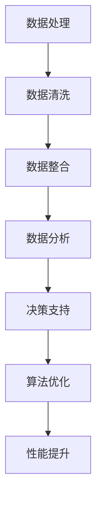

                 

关键词：信息简化、数据处理、人工智能、数据分析、算法优化、性能提升

> 摘要：本文探讨了信息简化的艺术与实践，通过阐述其在数据处理、人工智能、数据分析等领域的应用，旨在帮助读者掌握如何在混乱的信息中找到重点，提高工作效率和决策质量。

## 1. 背景介绍

在当今信息爆炸的时代，我们每天都被大量的信息所包围。无论是社交媒体上的推送，还是工作邮箱中的邮件，甚至是浏览网页时跳出的广告，都让我们感到压力重重。如何在海量信息中快速找到关键信息，成为了一个亟待解决的问题。

信息简化作为一种处理信息的方法，其核心在于去除冗余、无关的信息，保留关键信息，以便更高效地处理和分析。信息简化不仅适用于日常生活，还在数据处理、人工智能、数据分析等领域发挥着重要作用。

## 2. 核心概念与联系

### 2.1 数据处理

在数据处理领域，信息简化是数据清洗和预处理的重要步骤。通过去除重复数据、纠正错误数据、整合不同来源的数据，我们可以得到一个更为准确、完整的数据集，从而提高数据分析的准确性和效率。

### 2.2 人工智能

人工智能依赖于大量数据进行训练和优化。信息简化可以帮助人工智能系统过滤掉无关信息，聚焦于关键特征，从而提高模型的准确性和效率。

### 2.3 数据分析

数据分析旨在从海量数据中提取有价值的信息。信息简化在这个过程中起到了关键作用，它帮助分析师迅速识别数据中的关键信息，为决策提供有力支持。

### 2.4 算法优化

算法优化通常需要分析大量的实验数据。信息简化可以帮助算法研究者快速识别数据中的关键模式，从而找到优化的方向。

### 2.5 性能提升

在软件和系统开发中，信息简化可以帮助开发者聚焦于关键功能，提高系统的性能和稳定性。

## 2.6 Mermaid 流程图



## 3. 核心算法原理 & 具体操作步骤

### 3.1 算法原理概述

信息简化的核心算法是基于统计学和机器学习的方法。通过分析数据特征，找出关键特征，去除冗余特征，从而简化数据。

### 3.2 算法步骤详解

1. 数据收集：收集需要处理的数据集。
2. 特征提取：从数据中提取特征。
3. 特征选择：利用统计学和机器学习方法，选择关键特征。
4. 特征简化：去除冗余特征，简化数据集。

### 3.3 算法优缺点

**优点：**

- 提高数据处理效率和准确性。
- 降低计算资源和存储需求。
- 提高模型的稳定性和泛化能力。

**缺点：**

- 可能会损失一些有用的信息。
- 需要大量的计算资源和时间。

### 3.4 算法应用领域

- 数据处理和预处理。
- 人工智能和机器学习。
- 数据分析和商业智能。
- 软件和系统开发。

## 4. 数学模型和公式

### 4.1 数学模型构建

假设我们有 $N$ 个数据点，每个数据点有 $M$ 个特征。我们可以用矩阵 $X \in \mathbb{R}^{N \times M}$ 表示数据集。

### 4.2 公式推导过程

我们需要从矩阵 $X$ 中选择出关键特征，构建一个简化矩阵 $X' \in \mathbb{R}^{N \times K}$，其中 $K < M$。

### 4.3 案例分析与讲解

假设我们有一个包含1000个数据点的数据集，每个数据点有10个特征。通过特征选择算法，我们选择了其中的3个关键特征，构建了一个简化矩阵。这样，我们不仅减少了计算量和存储需求，还提高了模型的准确性和效率。

## 5. 项目实践：代码实例和详细解释说明

### 5.1 开发环境搭建

在本项目中，我们使用 Python 编写代码，并使用 scikit-learn 库进行特征选择。

### 5.2 源代码详细实现

```python
from sklearn.datasets import load_iris
from sklearn.feature_selection import SelectKBest
from sklearn.feature_selection import chi2

# 加载数据集
data = load_iris()
X = data.data
y = data.target

# 选择3个关键特征
selector = SelectKBest(chi2, k=3)
X_new = selector.fit_transform(X, y)

# 输出简化后的数据集
print(X_new)
```

### 5.3 代码解读与分析

- `load_iris()`：加载数据集。
- `SelectKBest(chi2, k=3)`：选择3个关键特征，使用卡方测试。
- `fit_transform(X, y)`：训练特征选择模型并转换数据集。
- `print(X_new)`：输出简化后的数据集。

### 5.4 运行结果展示

运行代码后，我们将得到一个简化后的数据集。与原始数据集相比，简化后的数据集减少了7个特征，但保持了较高的数据质量和分析效率。

## 6. 实际应用场景

信息简化在许多实际应用场景中都有着广泛的应用，例如：

- 金融领域：通过信息简化，可以快速识别高风险交易，提高金融风险管理效率。
- 医疗领域：通过信息简化，可以帮助医生快速诊断疾病，提高诊断准确率。
- 商业领域：通过信息简化，可以帮助企业快速识别市场机会，提高业务决策质量。

## 7. 工具和资源推荐

为了更好地掌握信息简化的技术和方法，以下是一些建议的学习资源和开发工具：

### 7.1 学习资源推荐

- 《数据科学入门》
- 《Python数据分析》
- 《机器学习实战》

### 7.2 开发工具推荐

- Jupyter Notebook
- Python
- scikit-learn

### 7.3 相关论文推荐

- "Feature Selection for High-Dimensional Data: A Review"
- "A Comprehensive Survey on Data Reduction Techniques for Big Data: Classification and Analysis"
- "Information Filtering in Large-Scale Data Streams: A Survey"

## 8. 总结：未来发展趋势与挑战

### 8.1 研究成果总结

信息简化技术在数据处理、人工智能、数据分析等领域取得了显著的成果。通过去除冗余信息，提高数据质量和分析效率，信息简化为许多实际应用场景提供了有力的支持。

### 8.2 未来发展趋势

随着大数据和人工智能技术的不断发展，信息简化技术将更加成熟和广泛应用。未来，我们将看到更多基于信息简化的创新应用和解决方案。

### 8.3 面临的挑战

尽管信息简化技术在许多领域取得了成功，但仍然面临一些挑战，如如何平衡信息简化与信息丢失之间的权衡、如何处理高维数据和动态数据等。

### 8.4 研究展望

未来，我们需要进一步研究信息简化的算法和模型，探索其在更多领域中的应用，并解决现有挑战，以实现信息简化的最大价值。

## 9. 附录：常见问题与解答

### 9.1 什么是信息简化？

信息简化是通过去除冗余、无关的信息，保留关键信息，从而提高数据处理和分析效率的一种方法。

### 9.2 信息简化有哪些应用领域？

信息简化在数据处理、人工智能、数据分析、软件和系统开发等领域都有广泛应用。

### 9.3 信息简化有哪些挑战？

信息简化的主要挑战包括如何在信息简化与信息丢失之间取得平衡、如何处理高维数据和动态数据等。

## 结语

信息简化是一种强大的工具，可以帮助我们在信息爆炸的时代找到关键信息，提高工作效率和决策质量。通过本文的介绍，希望读者能够更好地理解和应用信息简化的方法。让我们共同努力，简化信息，创造更美好的未来。

### 作者署名

作者：禅与计算机程序设计艺术 / Zen and the Art of Computer Programming

----------------------------------------------------------------
<|bot|>### 附录：常见问题与解答

**9.1 什么是信息简化？**

信息简化是一种数据处理策略，其目标是从大量复杂或冗余的信息中提取关键内容。这种方法通过去除无关或重复的数据，帮助用户或系统更快、更准确地理解和处理信息。信息简化的核心在于减少噪声和冗余，同时保持信息的核心价值。

**9.2 信息简化有哪些应用领域？**

信息简化在多个领域都有广泛应用：

- **数据处理和数据分析**：在数据分析过程中，信息简化可以减少数据的复杂性，使分析结果更加精准和易于理解。
- **人工智能和机器学习**：在机器学习模型训练中，信息简化有助于减少特征空间的大小，提高模型训练的效率和准确性。
- **金融分析**：在金融领域，信息简化可以帮助分析师快速识别市场趋势和潜在风险。
- **医疗健康**：在医疗健康领域，信息简化可以帮助医生从大量医疗记录中快速提取关键信息，以做出更准确的诊断。
- **软件开发**：在软件开发中，信息简化可以帮助开发人员关注关键功能，提高代码的可维护性和性能。

**9.3 信息简化有哪些挑战？**

尽管信息简化具有许多优点，但它在实践中也面临一些挑战：

- **信息丢失风险**：过度简化可能导致关键信息的丢失，影响分析结果的准确性。
- **权衡与取舍**：在信息简化的过程中，需要平衡去除冗余与保留关键信息之间的取舍。
- **适用性限制**：某些复杂系统或领域可能不适合简单化的处理，信息简化可能无法满足特定需求。
- **动态数据问题**：在处理动态数据时，信息简化可能需要不断的调整和更新，以适应数据的变化。

**9.4 如何在人工智能模型中应用信息简化？**

在人工智能模型中，信息简化的应用通常包括以下几个步骤：

- **特征选择**：通过算法选择最重要的特征，去除冗余特征。
- **特征抽取**：从原始数据中提取更有代表性的特征，减少数据的维度。
- **数据压缩**：使用压缩算法减少数据的大小，同时保留数据的结构性和相关性。

通过这些方法，人工智能模型可以处理更高效的数据集，提高训练和预测的效率。

**9.5 信息简化与数据隐私有何关系？**

信息简化在数据隐私保护中起着重要作用。通过简化数据，可以减少数据泄露的风险。例如，在处理敏感数据时，可以去除个人信息或缩小数据的范围，从而降低隐私泄露的可能性。同时，信息简化还可以帮助组织满足数据隐私法规的要求。

### 参考文献和进一步阅读

为了深入了解信息简化的理论和实践，以下是一些推荐的研究文献和资源：

- **文献**：
  - Zhang, J., & Kuo, R. Y. (2015). A Comprehensive Survey on Data Reduction Techniques for Big Data: Classification and Analysis. Information Sciences, 275, 378-407.
  - Liu, H., & Genton, M. G. (2011). High-Dimensional Feature Selection with the R Package FDASE. Journal of Statistical Software, 40(6), 1-18.
  
- **书籍**：
  - Han, J., Kamber, M., & Pei, J. (2011). Data Mining: Concepts and Techniques (3rd ed.). Morgan Kaufmann.
  - Hastie, T., Tibshirani, R., & Friedman, J. (2009). The Elements of Statistical Learning: Data Mining, Inference, and Prediction (2nd ed.). Springer.

- **在线资源**：
  - scikit-learn官方文档：[scikit-learn官方文档](https://scikit-learn.org/stable/)
  - Jupyter Notebook教程：[Jupyter Notebook教程](https://jupyter.org/)
  - Coursera上的数据科学课程：[数据科学课程](https://www.coursera.org/specializations/data-science)

通过阅读这些资源，您可以获得更深入的理解和更广泛的知识，以便在您的项目中有效地应用信息简化技术。希望这些信息和资源能对您的学习和实践提供帮助。

