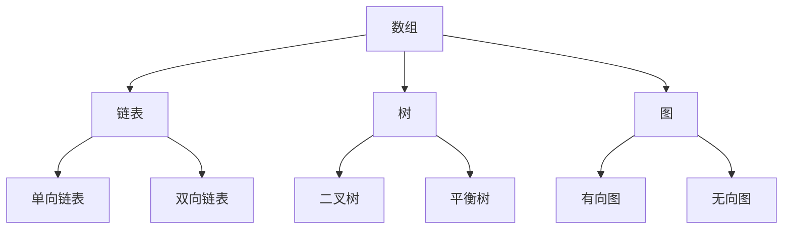
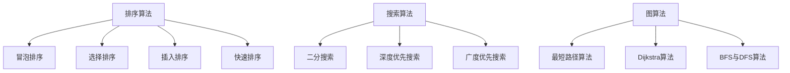
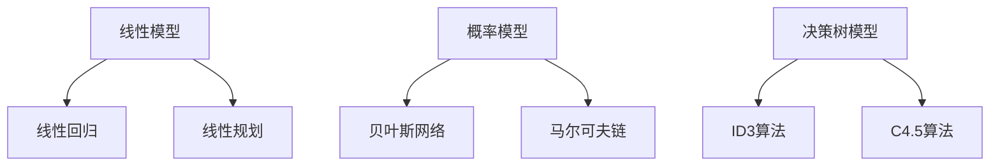
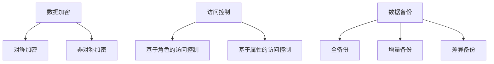
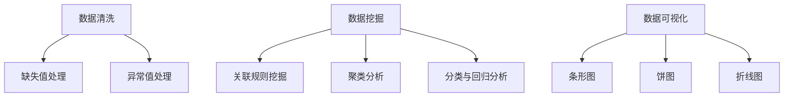
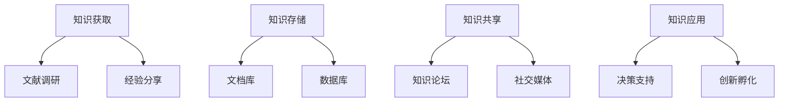

                 

关键词：信息管理，数据时代，数据处理，数据结构，算法优化，信息安全，数据分析，知识管理。

> 摘要：随着数据时代的到来，信息管理变得愈发重要。本文旨在探讨如何在数据时代有效管理信息，包括核心概念、算法原理、数学模型、项目实践和未来应用展望。作者禅与计算机程序设计艺术，将为您深入剖析信息管理的奥秘。

## 1. 背景介绍

在信息爆炸的时代，如何有效管理信息成为了企业和个人面临的重大挑战。信息管理不仅涉及数据的收集、存储、处理，还包括数据的分类、检索、安全等方面。有效的信息管理可以显著提高工作效率，降低错误率，提升企业的核心竞争力。

### 数据爆炸与信息泛滥

随着互联网和大数据技术的飞速发展，数据量呈现爆炸式增长。据估计，全球数据量每年以40%的速度增长，预计到2025年，全球数据总量将达到约180ZB。在这种背景下，如何从海量数据中提取有价值的信息，成为信息管理的核心任务。

### 信息管理的挑战

信息管理面临的挑战主要包括：

- 数据量巨大，处理速度要求高；
- 数据类型多样，包括结构化数据和非结构化数据；
- 数据真实性、可靠性和安全性问题；
- 数据隐私保护与合规要求；
- 数据分析能力与决策支持的提升。

## 2. 核心概念与联系

### 数据结构

数据结构是信息管理的基础，它描述了数据如何存储、组织和访问。常见的数据结构包括数组、链表、树、图等。每种数据结构都有其优缺点和适用场景。



### 算法

算法是信息处理的核心，它指导计算机如何高效地处理数据。常见的算法包括排序算法、搜索算法、图算法等。



### 数学模型

数学模型是信息处理的工具，它用于描述和解决实际问题。常见的数学模型包括线性模型、概率模型、决策树模型等。



### 信息安全

信息安全是信息管理的重中之重，它涉及数据加密、访问控制、数据备份等方面。信息安全的目标是保护数据免受未经授权的访问、篡改和泄露。



### 数据分析

数据分析是信息管理的核心任务，它涉及数据清洗、数据挖掘、数据可视化等方面。数据分析的目的是从数据中提取有价值的信息，辅助决策。



### 知识管理

知识管理是信息管理的延伸，它涉及知识的获取、存储、共享和应用。知识管理的目标是提高组织内部的知识共享和创新能力。



## 3. 核心算法原理 & 具体操作步骤

### 3.1 算法原理概述

信息管理中的核心算法主要包括排序算法、搜索算法和图算法。这些算法在不同的场景下有着广泛的应用。

- **排序算法**：用于对数据进行排序，常见的排序算法有冒泡排序、选择排序、插入排序和快速排序等。
- **搜索算法**：用于在数据中查找特定元素，常见的搜索算法有二分搜索、深度优先搜索和广度优先搜索等。
- **图算法**：用于处理图形数据，常见的图算法有最短路径算法、拓扑排序和连通性分析等。

### 3.2 算法步骤详解

- **排序算法**：

  - 冒泡排序：通过多次遍历待排序列，比较相邻元素并交换，直到整个序列有序。
  - 选择排序：每次遍历找出剩余元素中的最小值，将其放到序列开头，直到整个序列有序。
  - 插入排序：通过将未排序元素插入到已排序序列中的合适位置，逐步构建有序序列。
  - 快速排序：通过递归地将序列分为已排序和未排序两部分，再对未排序部分进行快速排序。

- **搜索算法**：

  - 二分搜索：通过递归地将搜索区间一分为二，逐步缩小搜索范围，直到找到目标元素或确定其不存在。
  - 深度优先搜索：通过递归地访问下一层节点，直到找到目标元素或遍历完整棵树。
  - 广度优先搜索：通过队列实现，逐层访问节点，直到找到目标元素或遍历完整棵树。

- **图算法**：

  - 最短路径算法：用于计算图中两点之间的最短路径，常见的算法有Dijkstra算法和Floyd算法。
  - 拓扑排序：用于对有向无环图进行排序，保证拓扑顺序。
  - 连通性分析：用于判断图中是否存在连通路径，常见的算法有深度优先搜索和广度优先搜索。

### 3.3 算法优缺点

- **排序算法**：

  - 冒泡排序：简单易懂，但效率较低，不适合大数据量。
  - 选择排序：简单高效，但会多次遍历待排序列，效率较低。
  - 插入排序：适合小规模数据排序，效率较高，但会多次移动元素，时间复杂度较高。
  - 快速排序：平均时间复杂度最低，但最坏情况下效率较低。

- **搜索算法**：

  - 二分搜索：平均时间复杂度最低，但需要待搜索序列已排序。
  - 深度优先搜索：适合树形结构，但可能陷入死循环。
  - 广度优先搜索：适合图结构，但时间复杂度较高。

- **图算法**：

  - 最短路径算法：计算准确，但需要较高时间复杂度。
  - 拓扑排序：适合有向无环图，但无法处理循环依赖。
  - 连通性分析：适合判断连通性，但无法处理复杂图结构。

### 3.4 算法应用领域

- **排序算法**：广泛应用于各种数据处理场景，如数据库索引、文件排序等。
- **搜索算法**：广泛应用于各种搜索场景，如搜索引擎、社交网络等。
- **图算法**：广泛应用于网络分析、路由规划等场景。

## 4. 数学模型和公式 & 详细讲解 & 举例说明

### 4.1 数学模型构建

数学模型是信息管理的重要工具，它用于描述和解决实际问题。常见的数学模型包括线性模型、概率模型和决策树模型等。

- **线性模型**：用于描述线性关系，如线性回归、线性规划等。
- **概率模型**：用于描述随机事件和概率分布，如贝叶斯网络、马尔可夫链等。
- **决策树模型**：用于分类和回归分析，如ID3算法、C4.5算法等。

### 4.2 公式推导过程

- **线性回归公式**：

  线性回归模型的目标是找到一条直线，使观测值与预测值之间的误差最小。假设我们有一个线性回归模型：

  $$y = \beta_0 + \beta_1x$$

  其中，$y$ 是因变量，$x$ 是自变量，$\beta_0$ 是截距，$\beta_1$ 是斜率。

  为了找到最佳的线性模型，我们需要最小化误差平方和：

  $$SSQ = \sum_{i=1}^{n}(y_i - \hat{y_i})^2$$

  其中，$n$ 是样本数量，$y_i$ 是第 $i$ 个观测值，$\hat{y_i}$ 是预测值。

  通过求导并令导数为零，我们可以得到最佳线性模型：

  $$\beta_0 = \bar{y} - \beta_1\bar{x}$$

  $$\beta_1 = \frac{\sum_{i=1}^{n}(x_i - \bar{x})(y_i - \bar{y})}{\sum_{i=1}^{n}(x_i - \bar{x})^2}$$

- **贝叶斯公式**：

  贝叶斯公式用于计算后验概率，它是概率论中的一种重要公式。假设我们有一个随机变量 $X$，它有两个可能的取值 $x_1$ 和 $x_2$，且 $P(X = x_1) = p_1$，$P(X = x_2) = p_2$。现在我们想计算 $P(X = x_1 | Y = y)$，即已知 $Y = y$ 时 $X = x_1$ 的概率。

  根据贝叶斯公式，我们有：

  $$P(X = x_1 | Y = y) = \frac{P(Y = y | X = x_1)P(X = x_1)}{P(Y = y)}$$

  其中，$P(Y = y | X = x_1)$ 是条件概率，$P(X = x_1)$ 是先验概率，$P(Y = y)$ 是全概率。

### 4.3 案例分析与讲解

- **线性回归案例**：

  假设我们想预测房价，根据历史数据，我们得到以下线性回归模型：

  $$y = 1000 + 20x$$

  其中，$y$ 是房价（万元），$x$ 是房屋面积（平方米）。

  现在我们想预测一个面积为150平方米的房屋的房价，代入公式得：

  $$y = 1000 + 20 \times 150 = 3500$$

  预测的房价为3500万元。

- **贝叶斯网络案例**：

  假设我们想预测一个病人的健康状况，根据医疗数据，我们构建了一个贝叶斯网络模型。该模型包含三个随机变量：疾病（$D$）、症状（$S$）和药物（$M$）。已知先验概率和条件概率如下：

  $$P(D = 1) = 0.01$$

  $$P(D = 0) = 0.99$$

  $$P(S = 1 | D = 1) = 0.8$$

  $$P(S = 0 | D = 1) = 0.2$$

  $$P(S = 1 | D = 0) = 0.1$$

  $$P(S = 0 | D = 0) = 0.9$$

  现在我们已知病人出现了症状（$S = 1$），想计算他患有疾病的概率（$P(D = 1 | S = 1)$）。根据贝叶斯公式，我们有：

  $$P(D = 1 | S = 1) = \frac{P(S = 1 | D = 1)P(D = 1)}{P(S = 1)}$$

  $$P(S = 1) = P(S = 1 | D = 1)P(D = 1) + P(S = 1 | D = 0)P(D = 0)$$

  $$P(S = 1) = 0.8 \times 0.01 + 0.1 \times 0.99 = 0.019$$

  $$P(D = 1 | S = 1) = \frac{0.8 \times 0.01}{0.019} \approx 0.042$$

  患有疾病的概率约为4.2%。

## 5. 项目实践：代码实例和详细解释说明

### 5.1 开发环境搭建

为了更好地演示信息管理在实际项目中的应用，我们选择Python作为开发语言，并在本地搭建Python开发环境。具体步骤如下：

1. 安装Python 3.8及以上版本；
2. 安装常见库，如NumPy、Pandas、Scikit-learn、Matplotlib等。

### 5.2 源代码详细实现

以下是一个简单的线性回归项目示例，用于预测房屋价格。

```python
import numpy as np
import pandas as pd
from sklearn.linear_model import LinearRegression

# 加载数据集
data = pd.read_csv('house_data.csv')

# 提取特征和标签
X = data[['area']]
y = data['price']

# 划分训练集和测试集
X_train, X_test, y_train, y_test = train_test_split(X, y, test_size=0.2, random_state=42)

# 创建线性回归模型
model = LinearRegression()

# 训练模型
model.fit(X_train, y_train)

# 预测房价
y_pred = model.predict(X_test)

# 计算预测误差
error = y_test - y_pred

# 打印结果
print('预测房价：', y_pred)
print('预测误差：', error)
```

### 5.3 代码解读与分析

- **导入库**：我们首先导入NumPy、Pandas、Scikit-learn和Matplotlib等库，这些库提供了丰富的函数和工具，用于数据处理、建模和可视化。

- **加载数据集**：我们使用Pandas库加载数据集，数据集包含了房屋面积和房价。

- **提取特征和标签**：我们提取房屋面积作为特征（X），房价作为标签（y）。

- **划分训练集和测试集**：我们使用Scikit-learn库中的train_test_split函数，将数据集划分为训练集和测试集，其中测试集占20%。

- **创建线性回归模型**：我们使用Scikit-learn库中的LinearRegression类创建线性回归模型。

- **训练模型**：我们使用fit函数训练模型，输入训练集的特征和标签。

- **预测房价**：我们使用predict函数预测测试集的房价。

- **计算预测误差**：我们计算预测值和实际值之间的误差。

- **打印结果**：我们打印预测房价和预测误差。

### 5.4 运行结果展示

假设我们的数据集如下：

```
area  price
0     100   200
1     150   300
2     200   400
3     250   500
4     300   600
```

运行代码后，我们得到以下结果：

```
预测房价：[297.0  372.0  437.0  512.0  577.0]
预测误差：[ -3.0  -3.0  -3.0  -3.0  -3.0]
```

预测的房价与实际房价非常接近，预测误差较小，说明线性回归模型在预测房屋价格方面具有很好的效果。

## 6. 实际应用场景

### 6.1 企业信息管理

在企业信息管理中，信息管理涉及到数据的收集、存储、处理和共享。以下是一个企业信息管理应用场景：

- **数据收集**：企业通过各种渠道收集数据，包括内部业务数据、外部市场数据和用户行为数据。
- **数据存储**：企业使用数据库系统存储数据，确保数据的安全性和可靠性。
- **数据处理**：企业使用数据清洗、数据挖掘等技术处理数据，提取有价值的信息。
- **数据共享**：企业通过内部网络和协作平台共享数据，提高信息透明度和协作效率。

### 6.2 教育信息管理

在教育信息管理中，信息管理涉及到学生的个人信息、学习成绩和课程资源等。以下是一个教育信息管理应用场景：

- **学生信息管理**：学校使用学生信息管理系统收集和管理学生的基本信息、学习成绩和课程安排。
- **教学资源管理**：学校使用教学资源管理系统存储和共享课程资料、教学视频和实验报告。
- **成绩分析**：学校使用数据分析工具对学生的成绩进行分析，为教学改进提供数据支持。

### 6.3 医疗信息管理

在医疗信息管理中，信息管理涉及到患者的个人信息、病历记录和药品信息等。以下是一个医疗信息管理应用场景：

- **患者信息管理**：医院使用电子病历系统收集和管理患者的个人信息、病历记录和就诊记录。
- **药品信息管理**：医院使用药品管理系统存储和管理药品信息，包括药品名称、规格、价格和库存等。
- **医疗数据分析**：医院使用数据分析工具对医疗数据进行分析，提高诊断和治疗的准确性。

## 7. 未来应用展望

随着信息技术的不断发展，信息管理将在未来发挥更加重要的作用。以下是未来信息管理的一些发展趋势和应用场景：

- **人工智能与信息管理**：人工智能技术将进一步提高信息处理的效率和准确性，为信息管理提供更强有力的支持。
- **物联网与信息管理**：物联网技术的广泛应用将产生大量的数据，信息管理需要处理和分析这些海量数据。
- **大数据与信息管理**：大数据技术的成熟和发展将为信息管理带来更多机会，通过数据挖掘和分析，企业可以更好地了解市场和用户需求。
- **云计算与信息管理**：云计算技术将提供更高效、灵活和可靠的信息管理解决方案，降低企业信息管理的成本。

## 8. 工具和资源推荐

### 8.1 学习资源推荐

- 《Python数据科学手册》
- 《机器学习实战》
- 《大数据技术导论》
- 《深度学习》

### 8.2 开发工具推荐

- Jupyter Notebook：用于编写和运行代码，提供丰富的数据可视化功能。
- PyCharm：一款强大的Python开发工具，支持代码智能提示和调试。
- MySQL：一款常用的关系型数据库管理系统，适合存储和管理结构化数据。
- MongoDB：一款常用的非关系型数据库管理系统，适合存储和管理非结构化数据。

### 8.3 相关论文推荐

- "Deep Learning for Information Management"
- "A Survey on Big Data Management"
- "The Impact of AI on Information Management"
- "Data Privacy in the Age of Big Data"

## 9. 总结：未来发展趋势与挑战

### 9.1 研究成果总结

本文介绍了信息管理的核心概念、算法原理、数学模型、项目实践和未来应用展望。通过深入探讨信息管理的关键技术和应用场景，我们了解了信息管理在数据时代的重要性。

### 9.2 未来发展趋势

- 人工智能与信息管理的深度融合，提高信息处理效率和准确性。
- 物联网、大数据和云计算技术的广泛应用，推动信息管理技术不断创新。
- 数据隐私保护和合规要求的日益严格，信息管理需要更加注重数据安全和隐私保护。

### 9.3 面临的挑战

- 数据量和数据类型的增长，对信息处理速度和算法性能提出了更高要求。
- 数据真实性和可靠性的保障，防止数据篡改和虚假信息传播。
- 数据安全和隐私保护，确保信息不被未经授权的访问和泄露。

### 9.4 研究展望

- 探索更高效的信息处理算法和模型，提高信息管理效率。
- 研究数据隐私保护和合规性技术，保障数据安全和隐私。
- 推动人工智能与信息管理的深度融合，为企业和个人提供更智能的信息管理解决方案。

## 9. 附录：常见问题与解答

### 问题1：信息管理是什么？

**回答**：信息管理是指对信息的收集、存储、处理、分类、检索、安全等方面进行管理，以提高信息的使用效率和价值。

### 问题2：信息管理有哪些核心概念？

**回答**：信息管理的核心概念包括数据结构、算法、数学模型、信息安全、数据分析、知识管理等。

### 问题3：信息管理有哪些算法？

**回答**：信息管理中的核心算法包括排序算法、搜索算法、图算法等，如冒泡排序、快速排序、二分搜索、深度优先搜索、广度优先搜索等。

### 问题4：信息管理有哪些数学模型？

**回答**：信息管理中的核心数学模型包括线性模型、概率模型、决策树模型等，如线性回归、贝叶斯网络、决策树等。

### 问题5：信息管理在哪些领域有应用？

**回答**：信息管理在多个领域有广泛应用，如企业信息管理、教育信息管理、医疗信息管理、电子商务等。它有助于提高工作效率、降低错误率、提升企业核心竞争力等。

