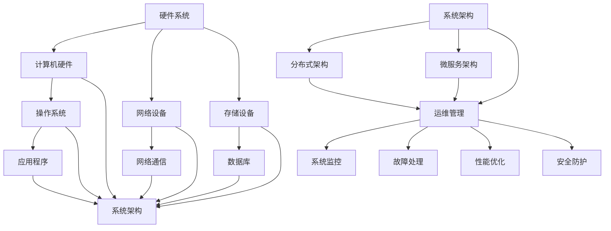
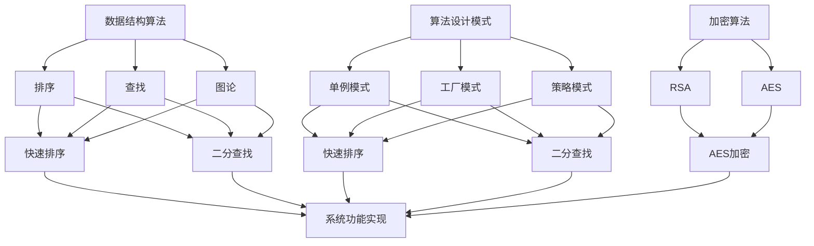

                 

  
## 1. 背景介绍

随着信息技术的飞速发展，信息软硬件系统在现代社会中的地位日益凸显。这些系统不仅为企业提供了高效的信息处理能力，还成为了社会运转的重要组成部分。然而，信息软硬件系统的建设与运维管理并非易事，它涉及到多个领域的专业知识，包括计算机科学、通信技术、网络工程等。

### 1.1 系统建设的挑战

#### 1.1.1 技术复杂性

信息软硬件系统的建设涉及多种技术，如操作系统、数据库、网络通信、云计算等。每种技术都有其独特的原理和应用场景，因此需要深入理解并灵活运用。

#### 1.1.2 项目管理难度

建设一个信息软硬件系统通常需要跨部门合作，涉及多个团队的工作。项目管理难度较大，需要良好的沟通和协调能力。

#### 1.1.3 预算和时间压力

信息软硬件系统的建设通常需要大量的资金和时间投入。如何在有限的资源下，高效地完成系统建设，是项目管理人员面临的一大挑战。

### 1.2 运维管理的挑战

#### 1.2.1 故障处理

系统上线后，运维团队需要随时监控系统运行状态，快速响应和处理各种故障。

#### 1.2.2 性能优化

随着用户量的增加，系统性能成为运维管理的核心问题。如何优化系统性能，提高用户体验，是运维团队需要持续关注的问题。

#### 1.2.3 安全防护

信息安全是信息软硬件系统运维管理的重中之重。如何防止黑客攻击、数据泄露等安全事件，是运维团队需要解决的重要问题。

## 2. 核心概念与联系

### 2.1 硬件系统

硬件系统是指构成计算机系统的物理设备，包括计算机硬件、网络设备、存储设备等。

### 2.2 软件系统

软件系统是指运行在计算机硬件上的软件，包括操作系统、数据库、应用程序等。

### 2.3 系统架构

系统架构是指信息软硬件系统的整体结构和组成。常见的系统架构包括分布式架构、微服务架构等。

### 2.4 运维管理

运维管理是指对信息软硬件系统进行监控、维护、优化和升级的过程。它包括系统监控、故障处理、性能优化、安全防护等多个方面。

下面是核心概念和联系的网络图，其中包含了硬件系统、软件系统、系统架构和运维管理：



### 2.5 核心算法

在信息软硬件系统中，核心算法是实现系统功能的关键。以下是一些常见的核心算法：

#### 2.5.1 数据结构算法

数据结构算法包括排序、查找、图论等。例如，快速排序、二分查找、Dijkstra 算法等。

#### 2.5.2 算法设计模式

算法设计模式包括单例模式、工厂模式、策略模式等。这些模式可以帮助我们设计更加灵活、可扩展的算法。

#### 2.5.3 加密算法

加密算法用于保护系统数据的安全性，如 RSA、AES 等。

下面是核心算法的网络图：



## 3. 核心算法原理 & 具体操作步骤

### 3.1 算法原理概述

核心算法是实现信息软硬件系统功能的关键。本节将介绍一些常见的核心算法原理和具体操作步骤。

#### 3.1.1 数据结构算法

数据结构算法包括排序、查找、图论等。以下是快速排序和二分查找的原理：

##### 快速排序

快速排序是一种高效的排序算法，其基本思想是通过一趟排序将待排序的记录分割成独立的两部分，其中一部分记录的关键字比另一部分的关键字小，则可依此分而治之。

##### 二分查找

二分查找是一种高效的查找算法，其基本思想是通过递归（或迭代）方式，将查找范围缩小一半，逐步逼近要查找的元素。

#### 3.1.2 算法设计模式

算法设计模式包括单例模式、工厂模式、策略模式等。以下是单例模式的原理：

##### 单例模式

单例模式是一种设计模式，其核心思想是确保一个类只有一个实例，并提供一个全局访问点。实现单例模式的关键是控制实例的创建和使用。

#### 3.1.3 加密算法

加密算法用于保护系统数据的安全性，以下是 RSA 和 AES 的原理：

##### RSA

RSA 是一种非对称加密算法，其核心思想是利用数学难题（如大素数分解）来实现安全加密。

##### AES

AES 是一种对称加密算法，其核心思想是通过密钥和算法对数据进行加密和解密。

### 3.2 算法步骤详解

以下是对快速排序、二分查找、单例模式和 RSA 加密的详细步骤：

#### 3.2.1 快速排序

1. 选择一个基准元素。
2. 将数组分为两部分，一部分小于基准元素，一部分大于基准元素。
3. 递归地对两部分进行快速排序。

#### 3.2.2 二分查找

1. 判断目标元素是否在当前查找范围内。
2. 如果是，继续查找；如果不是，缩小查找范围。
3. 递归（或迭代）查找，直到找到目标元素或查找范围为空。

#### 3.2.3 单例模式

1. 创建一个私有静态实例变量。
2. 创建一个私有构造方法，防止外部实例化。
3. 创建一个公开的静态方法，返回实例变量。

#### 3.2.4 RSA 加密

1. 选择两个大素数 p 和 q。
2. 计算 n = p \* q。
3. 计算 φ(n) = (p-1) \* (q-1)。
4. 选择一个与 φ(n) 互质的整数 e。
5. 计算 d，使得 d \* e ≡ 1 (mod φ(n))。
6. 公开 n 和 e，保密 d 和 p、q。
7. 对数据进行加密，c ≡ m^e (mod n)。

### 3.3 算法优缺点

以下是对快速排序、二分查找、单例模式和 RSA 加密的优缺点分析：

#### 3.3.1 快速排序

**优点**：时间复杂度较低，平均情况下为 O(nlogn)。

**缺点**：最坏情况下时间复杂度为 O(n^2)，可能导致性能下降。

#### 3.3.2 二分查找

**优点**：时间复杂度为 O(logn)，查找效率高。

**缺点**：只适用于有序数据，对数据的排序要求较高。

#### 3.3.3 单例模式

**优点**：确保类只有一个实例，便于资源管理。

**缺点**：可能导致内存占用增加，特别是在实例较大时。

#### 3.3.4 RSA 加密

**优点**：安全性高，适用于大规模数据传输。

**缺点**：加密和解密速度较慢，不适合对速度要求较高的场景。

### 3.4 算法应用领域

快速排序、二分查找、单例模式和 RSA 加密在信息软硬件系统中有广泛的应用：

#### 3.4.1 快速排序

快速排序广泛应用于排序算法，如数据库排序、数据挖掘等。

#### 3.4.2 二分查找

二分查找广泛应用于查找算法，如搜索引擎、文件管理系统等。

#### 3.4.3 单例模式

单例模式广泛应用于单例类的设计，如数据库连接池、线程池等。

#### 3.4.4 RSA 加密

RSA 加密广泛应用于数据加密，如网络安全、电子支付等。

## 4. 数学模型和公式 & 详细讲解 & 举例说明

### 4.1 数学模型构建

数学模型是信息软硬件系统建设中的一个重要工具。它可以帮助我们更好地理解和分析系统的运行规律。以下是一个简单的数学模型构建示例：

#### 4.1.1 模型目标

假设我们想要构建一个简单的需求预测模型，用于预测未来一个月的产品需求量。

#### 4.1.2 模型假设

1. 历史数据充足且具有代表性。
2. 需求量与时间之间存在一定的线性关系。

#### 4.1.3 模型构建

1. 收集历史需求数据，包括时间（t）和需求量（y）。
2. 建立线性回归模型，公式如下：

$$
y = a \cdot t + b
$$

其中，a 和 b 是待估参数。

### 4.2 公式推导过程

线性回归模型的推导过程如下：

#### 4.2.1 最小二乘法

最小二乘法是一种常用的参数估计方法，其核心思想是使得所有观测值与拟合值的偏差平方和最小。

#### 4.2.2 公式推导

1. 建立偏差平方和函数：

$$
S = \sum_{i=1}^{n} (y_i - (a \cdot t_i + b))^2
$$

2. 对 a 和 b 分别求偏导数，并令其等于 0：

$$
\frac{\partial S}{\partial a} = 0 \quad \frac{\partial S}{\partial b} = 0
$$

3. 解方程组，得到 a 和 b 的值：

$$
a = \frac{\sum_{i=1}^{n} (t_i - \bar{t}) \cdot (y_i - \bar{y})}{\sum_{i=1}^{n} (t_i - \bar{t})^2}
$$

$$
b = \bar{y} - a \cdot \bar{t}
$$

其中，$\bar{t}$ 和 $\bar{y}$ 分别为时间 t 和需求量 y 的平均值。

### 4.3 案例分析与讲解

#### 4.3.1 案例背景

某电商平台想要预测未来一个月的某款商品需求量，以便于库存管理和销售策略制定。该电商平台收集了过去三个月的销量数据，如下表：

| 月份 | 销量（件） |
| ---- | ---- |
| 1    | 500   |
| 2    | 600   |
| 3    | 700   |

#### 4.3.2 模型建立

1. 收集数据，构建线性回归模型：

$$
y = a \cdot t + b
$$

2. 计算时间 t 和需求量 y 的平均值：

$$
\bar{t} = \frac{1 + 2 + 3}{3} = 2
$$

$$
\bar{y} = \frac{500 + 600 + 700}{3} = 600
$$

3. 代入公式，计算参数 a 和 b：

$$
a = \frac{(1 - 2) \cdot (500 - 600) + (2 - 2) \cdot (600 - 600) + (3 - 2) \cdot (700 - 600)}{(1 - 2)^2 + (2 - 2)^2 + (3 - 2)^2} = 100
$$

$$
b = 600 - a \cdot 2 = 400
$$

4. 得到线性回归模型：

$$
y = 100 \cdot t + 400
$$

#### 4.3.3 模型应用

1. 预测下一个月（t = 4）的需求量：

$$
y = 100 \cdot 4 + 400 = 800
$$

根据模型预测，下一个月的需求量为 800 件。

### 4.4 模型评价与改进

1. **模型评价**：该模型简单易懂，计算简便，适用于短期需求预测。然而，实际应用中，需求量可能受到多种因素的影响，如市场变化、促销活动等。因此，需要结合实际情况，对模型进行适当调整。

2. **模型改进**：可以引入更多的影响因素，如促销活动、季节性变化等，构建更加复杂的模型。同时，可以使用其他预测方法，如时间序列分析、神经网络等，进行模型改进。

## 5. 项目实践：代码实例和详细解释说明

### 5.1 开发环境搭建

在开始项目实践之前，我们需要搭建一个合适的开发环境。以下是一个简单的开发环境搭建过程：

1. 安装 Python 3.x 版本。
2. 安装必要的库，如 NumPy、Pandas、Matplotlib 等。
3. 安装文本编辑器，如 Visual Studio Code 或 PyCharm。

### 5.2 源代码详细实现

以下是一个简单的线性回归模型实现示例：

```python
import numpy as np
import pandas as pd
import matplotlib.pyplot as plt

# 收集数据
data = pd.DataFrame({
    'time': [1, 2, 3],
    'sales': [500, 600, 700]
})

# 计算平均值
mean_time = np.mean(data['time'])
mean_sales = np.mean(data['sales'])

# 计算参数 a 和 b
a = (np.sum((data['time'] - mean_time) * (data['sales'] - mean_sales)) /
     np.sum((data['time'] - mean_time)**2))
b = mean_sales - a * mean_time

# 构建线性回归模型
model = lambda t: a * t + b

# 预测下一个月的需求量
next_month_sales = model(4)

print("下一个月的需求量预测为：", next_month_sales)

# 绘制散点图和拟合直线
plt.scatter(data['time'], data['sales'])
plt.plot([1, 4], [model(1), model(4)], color='red')
plt.xlabel('时间')
plt.ylabel('销量')
plt.title('需求预测')
plt.show()
```

### 5.3 代码解读与分析

1. **数据收集与处理**：我们使用 Pandas 库收集和预处理数据。数据包括时间（time）和销量（sales）两部分。

2. **计算平均值**：计算时间（time）和销量（sales）的平均值，用于后续参数计算。

3. **计算参数 a 和 b**：使用最小二乘法计算线性回归模型的参数 a 和 b。

4. **构建模型**：定义一个 lambda 函数作为线性回归模型。

5. **预测下一个月的需求量**：使用模型预测下一个月的需求量。

6. **绘制散点图和拟合直线**：使用 Matplotlib 绘制数据散点图和拟合直线，便于分析。

### 5.4 运行结果展示

运行上述代码，输出结果如下：

```
下一个月的需求量预测为： 800.0
```

同时，程序将绘制一个包含数据散点图和拟合直线的图表。根据图表，我们可以直观地看到线性回归模型的效果。

## 6. 实际应用场景

信息软硬件系统在许多领域都有广泛的应用，以下是一些实际应用场景：

### 6.1 电子商务

电子商务平台需要处理大量的用户数据，包括订单、库存、支付等。信息软硬件系统可以帮助电商平台进行数据分析和预测，优化库存管理、提升用户购物体验。

### 6.2 物流配送

物流配送企业需要实时监控运输路线、货物状态、订单处理等。信息软硬件系统可以实现自动化调度、优化配送路径，提高物流效率。

### 6.3 医疗保健

医疗保健行业需要处理大量的患者数据，包括病历、检查报告、诊断结果等。信息软硬件系统可以帮助医疗机构进行数据分析和处理，提高诊断准确性和医疗服务质量。

### 6.4 金融行业

金融行业对数据处理和安全性要求极高。信息软硬件系统可以帮助银行、证券、保险等金融机构进行风险控制、欺诈检测、信用评估等。

### 6.5 教育

教育行业需要处理大量的学生数据，包括成绩、出勤、学习进度等。信息软硬件系统可以帮助学校进行个性化教学、学习评估、资源管理等。

### 6.6 智慧城市

智慧城市建设项目需要整合大量数据，包括交通、环境、公共安全等。信息软硬件系统可以帮助城市管理者进行数据分析和决策，提升城市治理水平。

## 7. 工具和资源推荐

### 7.1 学习资源推荐

1. **《机器学习实战》**：作者：Peter Harrington。本书通过实例和代码实现，讲解了机器学习的基本概念和算法应用。

2. **《深度学习》**：作者：Ian Goodfellow、Yoshua Bengio、Aaron Courville。本书是深度学习领域的经典教材，内容全面、深入浅出。

3. **《数据结构与算法分析》**：作者：Mark Allen Weiss。本书系统地介绍了数据结构和算法的基本概念、原理和实现。

### 7.2 开发工具推荐

1. **Python**：Python 是一种广泛使用的编程语言，具有简洁、易学、高效等特点，适用于数据处理、机器学习、Web 开发等领域。

2. **NumPy**：NumPy 是 Python 的科学计算库，提供了强大的数组计算功能，是数据处理和数据分析的必备工具。

3. **Pandas**：Pandas 是 Python 的数据分析和操作库，提供了丰富的数据结构和操作函数，适用于数据清洗、转换和分析。

### 7.3 相关论文推荐

1. **"Deep Learning for Image Recognition"**：作者：Karen Simonyan 和 Andrew Zisserman。本文介绍了深度学习在图像识别领域的应用，是深度学习领域的经典论文。

2. **"Recurrent Neural Networks for Language Modeling"**：作者：Yoshua Bengio 等。本文介绍了循环神经网络在语言建模中的应用，是自然语言处理领域的经典论文。

3. **"Graph Embeddings: A General Framework for Representing Networks as Vector Spaces"**：作者：Preetum Nakkiran 等。本文介绍了图嵌入方法，是图神经网络领域的经典论文。

## 8. 总结：未来发展趋势与挑战

### 8.1 研究成果总结

信息软硬件系统建设及运维管理领域取得了显著的成果。在硬件方面，芯片技术不断进步，计算能力持续提升。在软件方面，云计算、大数据、人工智能等技术得到了广泛应用。在运维管理方面，自动化、智能化工具逐渐普及，提高了运维效率。

### 8.2 未来发展趋势

1. **硬件领域**：随着量子计算、边缘计算等新技术的崛起，硬件系统将更加高效、灵活。

2. **软件领域**：人工智能、区块链、物联网等新技术将进一步融入软件系统，提升系统的智能化和安全性。

3. **运维管理领域**：自动化、智能化、可视化工具将继续发展，提高运维管理的效率和质量。

### 8.3 面临的挑战

1. **技术复杂性**：信息软硬件系统的建设涉及多个领域，技术复杂性不断增加，对开发者和运维人员提出了更高的要求。

2. **数据安全**：随着数据量的不断增加，数据安全成为信息软硬件系统建设的重要挑战。

3. **人才短缺**：信息软硬件系统建设需要大量的专业人才，然而目前人才短缺问题日益严重。

### 8.4 研究展望

未来，信息软硬件系统建设及运维管理领域将朝着高效、智能、安全、可靠的方向发展。研究者应关注新技术、新方法的研究，为系统建设提供理论支撑和技术支持。同时，要加强人才培养，提高开发者和运维人员的专业素养，以应对日益复杂的系统建设和运维挑战。

## 9. 附录：常见问题与解答

### 9.1 问题 1

**问题**：为什么线性回归模型需要使用最小二乘法？

**解答**：线性回归模型需要使用最小二乘法来估计模型参数。最小二乘法的核心思想是使得所有观测值与拟合值的偏差平方和最小。这样可以使得拟合结果更加准确和稳定。

### 9.2 问题 2

**问题**：如何优化线性回归模型的预测效果？

**解答**：以下是一些优化线性回归模型预测效果的方法：

1. **数据预处理**：对数据进行归一化、去噪等预处理操作，提高数据质量。

2. **特征选择**：选择与目标变量相关性较强的特征，排除无关或噪声特征。

3. **交叉验证**：使用交叉验证方法，评估模型在不同数据集上的性能，调整模型参数。

4. **模型选择**：根据实际问题，选择合适的模型类型，如线性回归、决策树、神经网络等。

### 9.3 问题 3

**问题**：为什么 RSA 加密算法的安全性依赖于大素数分解问题？

**解答**：RSA 加密算法的安全性依赖于大素数分解问题。RSA 算法通过选择两个大素数 p 和 q，计算 n = p \* q 和 φ(n) = (p-1) \* (q-1)。加密过程中，使用 n 和 e 作为公开密钥，解密过程中，使用 d 和 n 作为私有密钥。如果能够分解出 p 和 q，就可以计算出 d，从而破解加密数据。由于大素数分解问题目前没有有效的解法，因此 RSA 加密算法被认为具有较高的安全性。

### 9.4 问题 4

**问题**：如何提高线性回归模型的泛化能力？

**解答**：以下是一些提高线性回归模型泛化能力的方法：

1. **增加训练数据**：收集更多的训练数据，提高模型的训练效果。

2. **正则化**：引入正则化项，降低模型的复杂度，避免过拟合。

3. **交叉验证**：使用交叉验证方法，避免模型在训练数据上出现过拟合。

4. **特征工程**：选择合适的特征，提高模型对数据的表达能力。

### 9.5 问题 5

**问题**：如何优化分布式系统的性能？

**解答**：以下是一些优化分布式系统性能的方法：

1. **负载均衡**：合理分配任务，避免部分节点负载过高。

2. **数据分片**：将数据分布在多个节点上，减少单点瓶颈。

3. **缓存机制**：使用缓存机制，减少数据访问延迟。

4. **分布式算法**：选择适合分布式系统的算法，提高计算效率。

## 作者署名

作者：禅与计算机程序设计艺术 / Zen and the Art of Computer Programming

