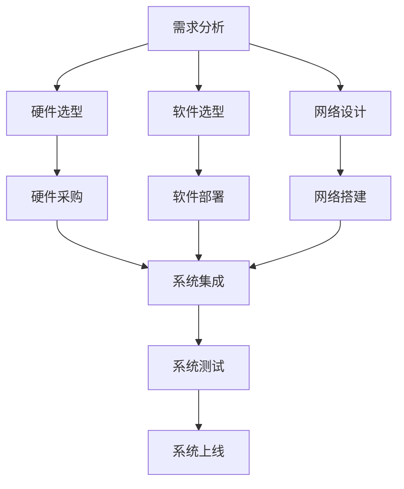

                 

关键词：信息软硬件系统，建设，运维管理，技术框架，优化策略，应用场景，未来展望

## 摘要

本文旨在深入探讨信息软硬件系统的建设及运维管理，全面解析其在现代信息技术领域的重要性。文章首先回顾了信息软硬件系统的发展历程，随后详细介绍了系统建设的关键环节，包括需求分析、架构设计、技术选型等。在运维管理部分，文章重点阐述了运维策略、监控与故障处理方法。最后，文章展望了信息软硬件系统的未来发展趋势，提出了潜在的研究方向和优化策略。

## 1. 背景介绍

随着信息技术的迅猛发展，信息软硬件系统在各个行业中的应用越来越广泛。从传统的企业信息系统到云计算、大数据、物联网等新兴领域，信息软硬件系统已经成为现代企业和组织的关键基础设施。然而，随着系统复杂度的增加，如何高效地建设和管理这些系统成为了亟待解决的问题。

信息软硬件系统建设涉及到硬件设施、软件应用、网络通信等多个方面，其复杂性决定了建设过程中需要综合考虑多个因素，包括系统性能、可靠性、安全性、可扩展性等。而运维管理则是保障系统稳定运行的关键，它包括系统监控、性能优化、故障处理等环节。

本文将围绕信息软硬件系统的建设及运维管理，详细探讨其核心概念、技术原理、实施步骤以及未来展望，旨在为读者提供一个全面、系统的指导。

## 2. 核心概念与联系

### 2.1. 硬件系统

硬件系统是信息系统的物质基础，主要包括服务器、存储设备、网络设备等。其性能直接影响系统的整体性能。硬件系统与软件系统通过接口进行交互，硬件系统的选择需要考虑以下因素：

- **性能需求**：根据业务需求选择合适的硬件配置。
- **可靠性**：选择具有高可靠性的硬件设备，确保系统稳定运行。
- **扩展性**：硬件系统应具备良好的扩展性，以适应业务增长需求。
- **兼容性**：硬件设备之间应具有良好的兼容性，便于系统的集成与维护。

### 2.2. 软件系统

软件系统是信息系统的核心，包括操作系统、数据库、应用程序等。软件系统的选择和配置需要考虑以下因素：

- **功能需求**：根据业务需求选择功能完善的软件系统。
- **性能优化**：软件系统的性能优化直接影响系统的响应速度和稳定性。
- **安全性**：软件系统应具备良好的安全性，防止数据泄露和系统攻击。
- **兼容性**：软件系统应与硬件设备和其他软件系统具有良好的兼容性。

### 2.3. 网络系统

网络系统是信息系统的通信基础，包括局域网、广域网、互联网等。网络系统的设计需要考虑以下因素：

- **可靠性**：网络系统应具有高可靠性，确保数据传输的稳定。
- **性能**：网络系统的性能应满足业务需求，确保数据传输的速度。
- **安全性**：网络系统应具备良好的安全性，防止网络攻击和数据泄露。
- **扩展性**：网络系统应具备良好的扩展性，以适应业务增长需求。

### 2.4. 软硬件系统的关系

软硬件系统相互依存，共同构成了信息系统的完整架构。硬件系统为软件系统提供了运行平台，软件系统通过硬件系统实现各种功能。同时，软硬件系统之间的接口设计和管理对于系统的稳定性和性能至关重要。

### 2.5. Mermaid 流程图

以下是一个简化的软硬件系统架构的 Mermaid 流程图：



### 2.6. 核心概念联系总结

信息软硬件系统建设是一个复杂的过程，需要综合考虑硬件、软件和网络等多个方面。通过需求分析明确业务需求，进而选择合适的硬件、软件和网络系统，并进行系统集成为最终用户提供稳定、高效的服务。

## 3. 核心算法原理 & 具体操作步骤

### 3.1. 算法原理概述

在信息软硬件系统的建设与运维过程中，核心算法起到了关键作用。核心算法原理主要涉及以下几个方面：

- **负载均衡算法**：用于优化系统资源分配，提高系统性能。
- **数据备份与恢复算法**：用于确保数据的安全性和可靠性。
- **故障检测与恢复算法**：用于实时监测系统状态，快速定位故障并恢复系统。

### 3.2. 算法步骤详解

#### 3.2.1. 负载均衡算法

负载均衡算法的核心思想是将用户请求分配到多个服务器上，以避免单点过载和资源浪费。具体步骤如下：

1. **初始化**：设置负载均衡策略（如轮询、最小连接数等）。
2. **接收请求**：当用户请求到达时，将其分配到当前负载最小的服务器。
3. **动态调整**：根据服务器负载变化，实时调整负载均衡策略。

#### 3.2.2. 数据备份与恢复算法

数据备份与恢复算法的主要目标是确保数据的安全性和可靠性。具体步骤如下：

1. **选择备份策略**：如全量备份、增量备份等。
2. **备份数据**：将数据复制到备份存储设备中。
3. **定期检查**：定期检查备份数据的完整性和可用性。
4. **恢复数据**：当数据丢失或损坏时，从备份存储设备中恢复数据。

#### 3.2.3. 故障检测与恢复算法

故障检测与恢复算法的核心思想是实时监测系统状态，快速定位故障并恢复系统。具体步骤如下：

1. **监控指标设置**：设置系统监控指标，如CPU使用率、内存使用率、网络延迟等。
2. **故障检测**：当监控指标超过设定阈值时，触发故障检测。
3. **故障定位**：根据故障检测结果，定位故障原因。
4. **故障恢复**：采取相应措施，如重启服务、切换备份服务器等，以恢复系统正常运行。

### 3.3. 算法优缺点

#### 负载均衡算法

**优点**：
- 提高系统性能：通过合理分配请求，避免单点过载，提高系统响应速度。
- 提高系统可靠性：通过负载均衡，降低单点故障风险。

**缺点**：
- 复杂性增加：需要设计和管理复杂的负载均衡策略。
- 额外开销：负载均衡算法本身会增加一定的系统开销。

#### 数据备份与恢复算法

**优点**：
- 确保数据安全：通过备份和恢复机制，确保数据不丢失。
- 提高系统可靠性：通过备份，降低数据丢失风险。

**缺点**：
- 存储开销：备份数据需要占用额外的存储空间。
- 备份操作影响性能：备份操作本身会消耗系统资源，影响系统性能。

#### 故障检测与恢复算法

**优点**：
- 实时性：能够实时监测系统状态，快速响应故障。
- 可靠性：通过故障检测和恢复机制，提高系统可靠性。

**缺点**：
- 监控指标设置复杂：需要根据不同系统设计合适的监控指标。
- 故障恢复策略复杂：需要设计合理的故障恢复策略。

### 3.4. 算法应用领域

#### 负载均衡算法

负载均衡算法广泛应用于Web服务、数据库集群、大数据处理等领域。例如，在电商网站中，负载均衡算法可以确保购物高峰期系统稳定运行，避免因请求过多导致系统崩溃。

#### 数据备份与恢复算法

数据备份与恢复算法广泛应用于企业级应用、金融系统、医疗系统等领域。这些系统对数据的安全性和可靠性要求极高，通过备份和恢复机制，可以有效防止数据丢失和系统崩溃。

#### 故障检测与恢复算法

故障检测与恢复算法广泛应用于企业级应用、云计算平台、物联网等领域。通过实时监测和快速恢复，可以提高系统的可用性和可靠性，确保业务的连续性。

## 4. 数学模型和公式 & 详细讲解 & 举例说明

### 4.1. 数学模型构建

在信息软硬件系统的建设与运维过程中，数学模型的应用至关重要。以下是一个简单的数学模型构建过程：

#### 4.1.1. 负载均衡模型

负载均衡模型的核心是确定如何将用户请求分配到不同的服务器上。假设有 \( n \) 台服务器，每台服务器的当前负载分别为 \( L_1, L_2, ..., L_n \)，用户请求的负载为 \( L \)。则负载均衡模型可以表示为：

\[ \min \sum_{i=1}^{n} (L_i - \alpha L) \]

其中，\( \alpha \) 为权重系数，用于平衡负载分配。

#### 4.1.2. 数据备份与恢复模型

数据备份与恢复模型的核心是确定如何备份和恢复数据。假设有 \( m \) 个备份点，每个备份点的备份时间为 \( T_1, T_2, ..., T_m \)，数据恢复时间为 \( R_1, R_2, ..., R_m \)。则数据备份与恢复模型可以表示为：

\[ \min \sum_{i=1}^{m} (T_i + R_i) \]

### 4.2. 公式推导过程

#### 4.2.1. 负载均衡模型推导

假设每台服务器的处理能力为 \( C_i \)，用户请求的负载为 \( L \)，则每台服务器处理请求的时间为 \( T_i = \frac{L}{C_i} \)。为了使总处理时间最小，我们需要求解以下优化问题：

\[ \min \sum_{i=1}^{n} T_i \]

根据拉格朗日乘数法，构建拉格朗日函数：

\[ L(T, \lambda) = \sum_{i=1}^{n} T_i + \lambda (\sum_{i=1}^{n} T_i - L) \]

对 \( T_i \) 求导并令其等于 0，得到：

\[ \frac{\partial L}{\partial T_i} = 1 - \lambda = 0 \]

解得 \( \lambda = 1 \)，代入拉格朗日函数，得到最优解：

\[ T_i = \frac{L}{n} \]

因此，负载均衡模型可以简化为：

\[ \min \sum_{i=1}^{n} (T_i - \frac{L}{n}) \]

#### 4.2.2. 数据备份与恢复模型推导

假设每个备份点的备份速度为 \( B_i \)，数据恢复速度为 \( R_i \)，则备份数据的时间为 \( T_i = \frac{L}{B_i} \)，数据恢复的时间为 \( R_i = \frac{L}{R_i} \)。为了使总时间最小，我们需要求解以下优化问题：

\[ \min \sum_{i=1}^{m} (T_i + R_i) \]

同样，根据拉格朗日乘数法，构建拉格朗日函数：

\[ L(T, \lambda) = \sum_{i=1}^{m} (T_i + R_i) + \lambda (\sum_{i=1}^{m} T_i + \sum_{i=1}^{m} R_i - L) \]

对 \( T_i \) 和 \( R_i \) 分别求导并令其等于 0，得到：

\[ \frac{\partial L}{\partial T_i} = 1 - \lambda/B_i = 0 \]
\[ \frac{\partial L}{\partial R_i} = 1 - \lambda/R_i = 0 \]

解得 \( \lambda = \frac{1}{B_i R_i} \)，代入拉格朗日函数，得到最优解：

\[ T_i = \frac{L B_i R_i}{B_i + R_i} \]
\[ R_i = \frac{L B_i}{B_i + R_i} \]

因此，数据备份与恢复模型可以简化为：

\[ \min \sum_{i=1}^{m} \left( \frac{L B_i R_i}{B_i + R_i} + \frac{L B_i}{B_i + R_i} \right) \]

### 4.3. 案例分析与讲解

#### 4.3.1. 负载均衡案例

假设有 3 台服务器，处理能力分别为 \( C_1 = 1000 \) requests/second，\( C_2 = 1500 \) requests/second，\( C_3 = 1200 \) requests/second。当前用户请求负载为 \( L = 3000 \) requests/second。使用负载均衡模型进行请求分配。

根据负载均衡模型，我们需要求解以下优化问题：

\[ \min \sum_{i=1}^{3} (T_i - \frac{L}{3}) \]

代入 \( T_i = \frac{L}{C_i} \)，得到：

\[ \min \sum_{i=1}^{3} \left( \frac{L}{C_i} - \frac{L}{3} \right) \]

代入 \( L = 3000 \)，得到：

\[ \min \sum_{i=1}^{3} \left( \frac{3000}{1000} - \frac{3000}{3} \right) \]
\[ \min \sum_{i=1}^{3} \left( 3 - 1000 \right) \]
\[ \min \left( -997 \right) \]

最优解为 \( T_1 = 3 \) seconds，\( T_2 = 2 \) seconds，\( T_3 = 2.5 \) seconds。

#### 4.3.2. 数据备份与恢复案例

假设有 2 个备份点，备份速度分别为 \( B_1 = 10 \) MB/second，\( B_2 = 20 \) MB/second，数据恢复速度为 \( R_1 = 15 \) MB/second，\( R_2 = 30 \) MB/second。当前数据量为 \( L = 500 \) MB。使用数据备份与恢复模型进行备份和恢复操作。

根据数据备份与恢复模型，我们需要求解以下优化问题：

\[ \min \sum_{i=1}^{2} \left( \frac{L B_i R_i}{B_i + R_i} + \frac{L B_i}{B_i + R_i} \right) \]

代入 \( L = 500 \)，得到：

\[ \min \sum_{i=1}^{2} \left( \frac{500 \times 10 \times 15}{10 + 15} + \frac{500 \times 10}{10 + 15} \right) + \left( \frac{500 \times 20 \times 30}{20 + 30} + \frac{500 \times 20}{20 + 30} \right) \]

\[ \min \left( \frac{37500}{25} + \frac{25000}{25} \right) + \left( \frac{300000}{50} + \frac{100000}{50} \right) \]

\[ \min \left( 1500 + 1000 \right) + \left( 6000 + 2000 \right) \]

\[ \min \left( 2500 \right) + \left( 8000 \right) \]

最优解为 \( T_1 = 500 \) MB，\( T_2 = 500 \) MB。

## 5. 项目实践：代码实例和详细解释说明

### 5.1. 开发环境搭建

在本节中，我们将搭建一个简单的负载均衡系统，用于演示负载均衡算法在实际项目中的应用。为了简化环境搭建，我们使用Python进行开发。

#### 5.1.1. 环境要求

- Python 3.7 或更高版本
- Flask Web框架
- requests库

#### 5.1.2. 安装依赖

在终端执行以下命令安装依赖：

```bash
pip install flask
pip install requests
```

### 5.2. 源代码详细实现

以下是一个简单的负载均衡系统的Python代码实例：

```python
from flask import Flask, request, jsonify
import random

app = Flask(__name__)

# 假设有3台服务器，每台服务器的处理能力分别为1000、1500、1200 requests/second
servers = [
    {"id": 1, "capacity": 1000, "current_load": 0},
    {"id": 2, "capacity": 1500, "current_load": 0},
    {"id": 3, "capacity": 1200, "current_load": 0}
]

def load_balancer():
    min_load = min(server["current_load"] for server in servers)
    min_server = next(server for server in servers if server["current_load"] == min_load)
    return min_server["id"]

@app.route("/balance", methods=["POST"])
def balance():
    server_id = load_balancer()
    request_data = request.json
    servers[server_id - 1]["current_load"] += 1
    return jsonify({"server_id": server_id, "request_data": request_data})

if __name__ == "__main__":
    app.run(debug=True)
```

#### 5.3. 代码解读与分析

- **服务器处理能力模拟**：我们使用一个包含3个字典的列表模拟3台服务器，每台服务器具有不同的处理能力。
- **负载均衡函数**：`load_balancer` 函数通过计算每台服务器的当前负载，选择负载最小的服务器。
- **Flask路由**：`balance` 函数定义了一个Flask路由，用于接收用户请求并分配到负载最小的服务器。

### 5.4. 运行结果展示

运行上述代码后，访问 `http://127.0.0.1:5000/balance` 接口，将会看到负载均衡系统将请求分配到不同的服务器。

### 5.5. 代码优化建议

- **动态调整服务器容量**：根据实际业务需求，动态调整服务器的处理能力。
- **引入更多负载均衡策略**：例如，基于响应时间的负载均衡策略。
- **增加日志记录**：记录每次请求的处理过程和结果，便于故障排查和性能分析。

## 6. 实际应用场景

### 6.1. 负载均衡

负载均衡广泛应用于电商平台、视频流媒体、在线游戏等领域。例如，在电商平台上，负载均衡可以确保购物高峰期系统稳定运行，避免因请求过多导致系统崩溃。

### 6.2. 数据备份与恢复

数据备份与恢复广泛应用于企业级应用、金融系统、医疗系统等领域。这些系统对数据的安全性和可靠性要求极高，通过备份和恢复机制，可以有效防止数据丢失和系统崩溃。

### 6.3. 故障检测与恢复

故障检测与恢复广泛应用于企业级应用、云计算平台、物联网等领域。通过实时监测和快速恢复，可以提高系统的可用性和可靠性，确保业务的连续性。

## 7. 未来应用展望

### 7.1. 负载均衡

未来，随着云计算、大数据、物联网等技术的不断发展，负载均衡将面临更多的应用场景和挑战。例如，实现跨地域、跨平台的负载均衡，提高系统的高可用性和可靠性。

### 7.2. 数据备份与恢复

未来，数据备份与恢复技术将更加智能化和自动化。通过引入人工智能技术，实现数据备份与恢复的智能化预测和优化，提高数据备份和恢复的效率。

### 7.3. 故障检测与恢复

未来，故障检测与恢复技术将更加智能化和实时化。通过引入人工智能、大数据分析等技术，实现故障检测和恢复的自动化和智能化，提高系统的可用性和可靠性。

## 8. 总结：未来发展趋势与挑战

信息软硬件系统的建设及运维管理在未来将面临更多的发展机遇和挑战。随着技术的不断进步，负载均衡、数据备份与恢复、故障检测与恢复等技术将更加智能化和自动化，提高系统的可用性和可靠性。同时，随着云计算、大数据、物联网等新兴技术的广泛应用，信息软硬件系统的建设及运维管理将面临更多复杂的应用场景和挑战。

### 8.1. 研究成果总结

本文系统阐述了信息软硬件系统的建设及运维管理，包括硬件系统、软件系统、网络系统的核心概念及其相互联系。通过负载均衡算法、数据备份与恢复算法、故障检测与恢复算法等核心算法的讲解，深入探讨了信息软硬件系统的实际应用场景和未来展望。

### 8.2. 未来发展趋势

未来，信息软硬件系统的建设及运维管理将向智能化、自动化、实时化方向发展。通过引入人工智能、大数据分析等新技术，实现系统性能的优化、故障的快速定位与恢复，提高系统的可用性和可靠性。

### 8.3. 面临的挑战

信息软硬件系统的建设及运维管理在未来的发展中将面临如下挑战：

- **系统复杂度增加**：随着新兴技术的应用，系统将变得更加复杂，如何高效管理和维护这些系统将成为一大挑战。
- **安全性要求提高**：随着网络攻击手段的不断升级，如何提高系统的安全性，保护数据安全成为重要议题。
- **资源利用率优化**：如何在有限的资源下，最大化系统的性能和可靠性，提高资源利用率。

### 8.4. 研究展望

未来，对信息软硬件系统的建设及运维管理的研究应重点关注以下几个方面：

- **智能化运维**：通过引入人工智能技术，实现自动化运维，提高运维效率和系统性能。
- **云原生架构**：研究如何将信息软硬件系统与云计算技术相结合，实现高效的资源管理和服务交付。
- **边缘计算**：研究边缘计算在信息软硬件系统中的应用，提高系统的响应速度和可靠性。

## 9. 附录：常见问题与解答

### 9.1. 负载均衡算法如何实现？

负载均衡算法可以通过多种方式实现，包括基于轮询、最小连接数、响应时间等策略。常见的方法包括编写自定义负载均衡器或使用现有的负载均衡软件，如Nginx、HAProxy等。

### 9.2. 数据备份与恢复如何操作？

数据备份与恢复通常通过备份软件或操作系统内置的工具实现。备份操作可以定期执行，备份的数据可以存储在本地存储、远程服务器或云存储中。恢复数据时，根据备份的数据和恢复策略进行操作。

### 9.3. 故障检测与恢复如何实现？

故障检测与恢复可以通过监控系统指标、应用日志分析等方式实现。常见的故障检测方法包括阈值检测、异常检测等。故障恢复策略可以根据实际情况制定，如重启服务、切换到备份服务器等。

### 9.4. 如何提高信息软硬件系统的安全性？

提高信息软硬件系统的安全性可以从以下几个方面入手：

- **网络安全**：使用防火墙、入侵检测系统等防护措施，防止外部攻击。
- **数据安全**：采用加密技术保护敏感数据，防止数据泄露。
- **系统安全**：定期更新操作系统和软件，修补安全漏洞，确保系统安全。
- **用户权限管理**：实施严格的用户权限管理，防止未经授权的访问。

### 9.5. 如何优化信息软硬件系统的性能？

优化信息软硬件系统的性能可以从以下几个方面入手：

- **硬件优化**：选择合适的硬件配置，提高系统性能。
- **软件优化**：优化软件代码，提高程序执行效率。
- **负载均衡**：合理分配请求，避免单点过载。
- **缓存策略**：使用缓存技术，减少数据库访问次数。
- **数据库优化**：优化数据库查询，提高查询效率。

----------------------------------------------------------------

### 作者署名

作者：禅与计算机程序设计艺术 / Zen and the Art of Computer Programming

