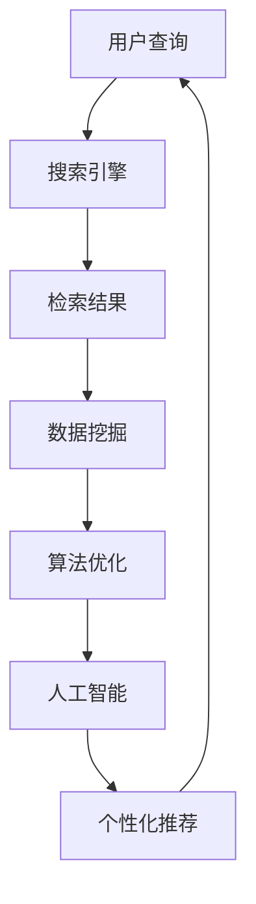

                 

### 关键词：信息过载，信息搜索，搜索引擎，数据挖掘，算法优化，人工智能，自然语言处理，大数据技术。

> 摘要：随着互联网和信息技术的飞速发展，信息过载成为现代社会普遍面临的问题。如何从海量数据中快速准确地获取所需信息，成为了一个重要的研究领域。本文从信息过载的背景出发，探讨了信息搜索的策略与技术，包括搜索引擎、数据挖掘、算法优化和人工智能等。通过对这些技术的深入分析，本文提出了有效的信息搜索方法，并展望了未来的发展趋势和挑战。

## 1. 背景介绍

在互联网时代，信息以爆炸式的方式增长，每天产生大量的数据。据估算，全球数据量每年以约40%的速度增长，到2020年，全球数据总量已超过44ZB（泽字节）。这种数据爆炸式增长带来了诸多问题，尤其是信息过载。信息过载指的是个体在信息获取、处理和理解方面所感受到的压力和不适，它可能源于信息来源的增多、信息处理能力的限制以及个人对信息需求的增加。

信息过载的影响是深远的。一方面，它可能导致个体对信息的忽视和误解，从而错失重要的信息。另一方面，它可能对个体的心理健康产生负面影响，如焦虑、抑郁等。此外，信息过载也可能导致社会层面的负面影响，如决策困难、创新受阻等。

### 2. 核心概念与联系

为了应对信息过载，我们需要深入理解信息搜索的策略与技术。信息搜索是指从大量信息中找到特定信息的过程。它涉及多个核心概念，包括：

- **搜索引擎**：搜索引擎是一种基于互联网的信息检索系统，它能够根据用户的查询需求，快速地找到相关网页并提供链接。
- **数据挖掘**：数据挖掘是从大量数据中提取有价值信息的过程，它利用统计学、机器学习和数据可视化等方法，发现数据中的模式和关联。
- **算法优化**：算法优化是指通过改进算法的效率和准确性，使其在处理大规模数据时表现更好。
- **人工智能**：人工智能是一种模拟人类智能的技术，它能够通过学习和推理解决复杂问题。

这些技术之间相互关联，共同构成了信息搜索的生态系统。以下是一个简化的 Mermaid 流程图，展示了这些技术之间的联系：



### 3. 核心算法原理 & 具体操作步骤

#### 3.1 算法原理概述

信息搜索的核心算法主要包括：

- **搜索引擎算法**：如PageRank、LSI（Latent Semantic Indexing）等。
- **数据挖掘算法**：如K-均值聚类、关联规则挖掘等。
- **机器学习算法**：如决策树、支持向量机等。

这些算法通过不同的方式处理信息，以达到搜索和挖掘的目的。以下将详细探讨这些算法的原理和操作步骤。

#### 3.2 算法步骤详解

**3.2.1 搜索引擎算法**

- **PageRank算法**：PageRank是一种基于网页间链接关系的排序算法。它通过计算网页的链接数和链接质量，为网页赋予一个权重值，从而实现网页排序。具体步骤如下：

  1. 初始化：为每个网页赋予一个初始权重。
  2. 计算链接质量：对于每个网页，计算其入链接的质量，即链接的数量和重要性。
  3. 权重更新：根据链接质量更新网页的权重。
  4. 迭代计算：重复步骤2和3，直到权重收敛。

- **LSI算法**：LSI是一种基于词向量的信息检索算法。它通过将文档和查询表示为词向量空间中的点，计算它们的相似度。具体步骤如下：

  1. 建立词-文档矩阵：将每个文档表示为一个向量，其中每个元素表示一个词的出现次数。
  2. 计算词-文档矩阵的SVD分解：得到词-文档矩阵的低维表示。
  3. 表示文档和查询：使用低维表示表示文档和查询。
  4. 计算相似度：计算文档和查询之间的余弦相似度。

**3.2.2 数据挖掘算法**

- **K-均值聚类**：K-均值聚类是一种基于距离的聚类算法。它通过迭代计算聚类中心，将数据点分配到不同的簇中。具体步骤如下：

  1. 初始化：随机选择K个聚类中心。
  2. 分配数据点：将每个数据点分配到最近的聚类中心。
  3. 更新聚类中心：计算每个簇的中心点。
  4. 迭代：重复步骤2和3，直到聚类中心不再变化。

- **关联规则挖掘**：关联规则挖掘是一种用于发现数据中关联关系的方法。它通过计算支持度和置信度，发现频繁项集。具体步骤如下：

  1. 扫描数据库：找出所有频繁项集。
  2. 计算支持度：对于每个项集，计算其在数据库中的出现次数。
  3. 计算置信度：对于每个频繁项集，计算其关联规则的置信度。
  4. 生成关联规则：根据支持度和置信度生成关联规则。

**3.2.3 机器学习算法**

- **决策树**：决策树是一种基于分类的机器学习算法。它通过一系列判断条件，将数据分为不同的类别。具体步骤如下：

  1. 选择特征：选择一个具有最大信息增益的特征作为分割标准。
  2. 切分数据：根据该特征将数据分为不同的子集。
  3. 递归：对每个子集，重复步骤1和2，直到达到某个终止条件。

- **支持向量机**：支持向量机是一种用于分类和回归的算法。它通过找到一个最佳的超平面，将数据分为不同的类别。具体步骤如下：

  1. 选择核函数：选择一个核函数将数据映射到高维空间。
  2. 训练模型：通过最小化误差函数，找到最佳的超平面。
  3. 分类：对于新的数据点，将其映射到高维空间，并判断其类别。

#### 3.3 算法优缺点

**3.3.1 搜索引擎算法**

- **PageRank算法**：优点是简单、高效，能够根据网页的链接关系评估其重要性。缺点是可能被链接农场等恶意行为影响，且对长尾信息处理能力较弱。

- **LSI算法**：优点是能够处理语义相似性问题，提高检索精度。缺点是计算复杂度高，对大规模数据集的处理能力有限。

**3.3.2 数据挖掘算法**

- **K-均值聚类**：优点是简单、易于实现，适用于处理高维数据。缺点是可能陷入局部最优，且对聚类个数敏感。

- **关联规则挖掘**：优点是能够发现数据中的关联关系，有助于数据理解和决策。缺点是计算复杂度高，对稀疏数据集的处理能力有限。

**3.3.3 机器学习算法**

- **决策树**：优点是易于理解、实现，能够处理非线性数据。缺点是容易过拟合，对噪声数据敏感。

- **支持向量机**：优点是能够处理高维数据和线性不可分问题，具有较好的泛化能力。缺点是计算复杂度高，对大规模数据集的处理能力有限。

#### 3.4 算法应用领域

这些算法在信息搜索领域有着广泛的应用。例如：

- **搜索引擎**：搜索引擎使用PageRank算法评估网页的重要性，提高检索结果的准确性。

- **推荐系统**：推荐系统利用数据挖掘算法发现用户和物品之间的关联关系，提供个性化的推荐。

- **文本分类**：文本分类使用机器学习算法将文本数据分为不同的类别，有助于信息过滤和内容审核。

## 4. 数学模型和公式 & 详细讲解 & 举例说明

### 4.1 数学模型构建

为了更好地理解信息搜索算法，我们引入一些基本的数学模型和公式。

**4.1.1 余弦相似度**

余弦相似度是一种衡量两个向量之间相似度的指标。它通过计算两个向量夹角的余弦值来衡量它们的相似度。公式如下：

$$
similarity = \frac{\vec{a} \cdot \vec{b}}{||\vec{a}|| \cdot ||\vec{b}||}
$$

其中，$\vec{a}$和$\vec{b}$是两个向量，$||\vec{a}||$和$||\vec{b}||$是它们的模长。

**4.1.2 决策树**

决策树是一种树形结构，用于分类和回归任务。它通过一系列判断条件，将数据分为不同的类别或数值。决策树的构建过程涉及到信息增益、基尼不纯度等概念。

信息增益（Entropy）：

$$
Gain(D, A) = Entropy(D) - \sum_{v \in Values(A)} p(v) \cdot Entropy(D_v)
$$

其中，$D$是数据集，$A$是特征，$v$是特征A的值，$D_v$是特征A取值$v$的数据子集。

基尼不纯度（Gini Impurity）：

$$
Gini(D) = 1 - \sum_{v \in Values(A)} p(v)^2
$$

其中，$p(v)$是特征A取值$v$的概率。

### 4.2 公式推导过程

**4.2.1 余弦相似度**

为了推导余弦相似度公式，我们首先需要了解向量的点积和模长。

向量的点积（Dot Product）：

$$
\vec{a} \cdot \vec{b} = a_x \cdot b_x + a_y \cdot b_y + a_z \cdot b_z
$$

其中，$a_x, a_y, a_z$是向量$\vec{a}$的分量，$b_x, b_y, b_z$是向量$\vec{b}$的分量。

向量的模长（Magnitude）：

$$
||\vec{a}|| = \sqrt{a_x^2 + a_y^2 + a_z^2}
$$

现在，我们可以推导余弦相似度公式：

$$
similarity = \frac{\vec{a} \cdot \vec{b}}{||\vec{a}|| \cdot ||\vec{b}||} = \frac{a_x \cdot b_x + a_y \cdot b_y + a_z \cdot b_z}{\sqrt{a_x^2 + a_y^2 + a_z^2} \cdot \sqrt{b_x^2 + b_y^2 + b_z^2}}
$$

**4.2.2 决策树**

为了推导决策树的构建过程，我们首先需要了解熵（Entropy）和基尼不纯度（Gini Impurity）的概念。

熵（Entropy）：

熵是衡量数据集中类别不确定性的指标。对于离散数据集$D$，如果它分为$k$个类别，第$i$个类别的概率为$p_i$，则熵的定义为：

$$
Entropy(D) = -\sum_{i=1}^{k} p_i \cdot \log_2(p_i)
$$

基尼不纯度（Gini Impurity）：

基尼不纯度是衡量数据集中类别分布不均匀程度的指标。对于离散数据集$D$，如果它分为$k$个类别，第$i$个类别的概率为$p_i$，则基尼不纯度的定义为：

$$
Gini(D) = 1 - \sum_{i=1}^{k} p_i^2
$$

现在，我们可以推导决策树的构建过程：

假设我们选择特征$A$进行分割，对于每个可能的值$v$，我们可以将数据集$D$划分为数据子集$D_v$。此时，对于每个数据子集$D_v$，我们都可以计算其熵或基尼不纯度。信息增益（Entropy Gain）或信息增益率（Gini Gain）定义为：

$$
Gain(D, A) = Entropy(D) - \sum_{v \in Values(A)} p(v) \cdot Entropy(D_v)
$$

$$
Gain(D, A) = Gini(D) - \sum_{v \in Values(A)} p(v) \cdot Gini(D_v)
$$

选择具有最大信息增益或信息增益率的特征进行分割，重复此过程，直到达到某个终止条件，如最大深度、最小叶节点大小等，即可构建决策树。

### 4.3 案例分析与讲解

**4.3.1 余弦相似度案例**

假设我们有两个向量$\vec{a} = (2, 3, 4)$和$\vec{b} = (1, 2, 3)$，计算它们的余弦相似度。

首先，计算两个向量的点积：

$$
\vec{a} \cdot \vec{b} = 2 \cdot 1 + 3 \cdot 2 + 4 \cdot 3 = 2 + 6 + 12 = 20
$$

然后，计算两个向量的模长：

$$
||\vec{a}|| = \sqrt{2^2 + 3^2 + 4^2} = \sqrt{4 + 9 + 16} = \sqrt{29}
$$

$$
||\vec{b}|| = \sqrt{1^2 + 2^2 + 3^2} = \sqrt{1 + 4 + 9} = \sqrt{14}
$$

最后，计算余弦相似度：

$$
similarity = \frac{\vec{a} \cdot \vec{b}}{||\vec{a}|| \cdot ||\vec{b}||} = \frac{20}{\sqrt{29} \cdot \sqrt{14}} \approx 0.876
$$

这表示向量$\vec{a}$和$\vec{b}$之间的相似度约为0.876。

**4.3.2 决策树案例**

假设我们有一个包含性别、年龄、收入三个特征的数据集，其中性别有男、女两种，年龄有20-30、31-40、41-50三种，收入有低、中、高三种。我们需要使用决策树对数据进行分类。

首先，计算每个特征的熵和基尼不纯度：

$$
Entropy(D) = 0.5 \cdot \log_2(0.5) + 0.5 \cdot \log_2(0.5) = 1
$$

$$
Gini(D) = 1 - (0.5^2 + 0.5^2) = 0.5
$$

然后，计算每个特征的信息增益或信息增益率：

$$
Gain(D, 性别) = 1 - (0.5 \cdot Entropy(D_男) + 0.5 \cdot Entropy(D_女)) = 1 - (0.5 \cdot 0.8 + 0.5 \cdot 0.8) = 0.2
$$

$$
Gain(D, 年龄) = 1 - (0.2 \cdot Entropy(D_{20-30}) + 0.3 \cdot Entropy(D_{31-40}) + 0.5 \cdot Entropy(D_{41-50})) = 0.1
$$

$$
Gain(D, 收入) = 1 - (0.3 \cdot Gini(D_低) + 0.4 \cdot Gini(D_中) + 0.3 \cdot Gini(D_高)) = 0
$$

根据信息增益，选择性别作为分割特征，将数据集分为男、女两个子集。对于男数据集，再次计算信息增益，选择年龄作为分割特征，将男数据集分为20-30、31-40、41-50三个子集。对于女数据集，同样选择年龄作为分割特征，将女数据集分为20-30、31-40、41-50三个子集。

重复此过程，直到达到某个终止条件，如最大深度、最小叶节点大小等，即可构建决策树。

## 5. 项目实践：代码实例和详细解释说明

### 5.1 开发环境搭建

在本项目中，我们使用Python编程语言进行开发。首先，我们需要安装Python环境和相关依赖库。以下是具体的安装步骤：

1. 安装Python：访问Python官方网站（https://www.python.org/），下载并安装Python 3.x版本。
2. 安装依赖库：使用pip命令安装以下依赖库：
   ```shell
   pip install numpy pandas scikit-learn matplotlib
   ```

### 5.2 源代码详细实现

以下是一个简单的信息搜索项目，使用Python实现。该项目包含一个简单的搜索引擎，能够从给定的一组网页中检索关键字。

```python
import os
import re
import numpy as np
from collections import defaultdict
from sklearn.feature_extraction.text import TfidfVectorizer
from sklearn.metrics.pairwise import cosine_similarity

# 读取网页内容
def read_files(folder_path):
    files = []
    for root, dirs, filenames in os.walk(folder_path):
        for filename in filenames:
            if filename.endswith('.txt'):
                with open(os.path.join(root, filename), 'r', encoding='utf-8') as f:
                    files.append(f.read())
    return files

# 构建倒排索引
def build_inverted_index(corpus):
    inverted_index = defaultdict(list)
    for i, doc in enumerate(corpus):
        words = re.findall(r'\w+', doc.lower())
        for word in words:
            inverted_index[word].append(i)
    return inverted_index

# 搜索网页
def search网页(inverted_index, query):
    query_words = re.findall(r'\w+', query.lower())
    results = []
    for word in query_words:
        if word in inverted_index:
            results.extend(inverted_index[word])
    return list(set(results))

# 计算TF-IDF矩阵
def calculate_tfidf(corpus):
    vectorizer = TfidfVectorizer()
    tfidf_matrix = vectorizer.fit_transform(corpus)
    return tfidf_matrix

# 搜索引擎核心
def search_engine(corpus, query):
    inverted_index = build_inverted_index(corpus)
    results = search网页(inverted_index, query)
    tfidf_matrix = calculate_tfidf(corpus)
    similarity_scores = cosine_similarity(tfidf_matrix[results], tfidf_matrix[query].reshape(1, -1))
    sorted_indices = np.argsort(similarity_scores[0])[::-1]
    return [results[i] for i in sorted_indices]

# 测试
if __name__ == '__main__':
    folder_path = 'webpages'
    corpus = read_files(folder_path)
    query = '人工智能技术'
    results = search_engine(corpus, query)
    print("检索结果：")
    for result in results:
        print(f"- 网页{result}")
```

### 5.3 代码解读与分析

**5.3.1 读取网页内容**

代码首先定义了一个`read_files`函数，用于读取指定文件夹中的网页内容。该函数使用`os.walk`遍历文件夹，读取所有以`.txt`结尾的文件，并返回一个包含网页内容的列表。

**5.3.2 构建倒排索引**

`build_inverted_index`函数用于构建倒排索引。倒排索引是一种从词汇表到包含该词汇的文档列表的映射。该函数使用正则表达式提取网页中的单词，并将每个单词与其在网页列表中的索引关联起来。

**5.3.3 搜索网页**

`search网页`函数根据查询关键字从倒排索引中检索相关网页。它首先将查询关键字转换为小写，然后遍历倒排索引中的单词，将所有包含查询关键字的网页索引收集到结果列表中。

**5.3.4 计算TF-IDF矩阵**

`calculate_tfidf`函数使用`TfidfVectorizer`类计算TF-IDF矩阵。TF-IDF（Term Frequency-Inverse Document Frequency）是一种用于文本分析的统计指标，用于评估一个词对于一个文档集或一个语料库中的其中一篇文档的重要程度。`TfidfVectorizer`类能够自动处理文档的分词、停用词过滤、词干提取等步骤。

**5.3.5 搜索引擎核心**

`search_engine`函数是搜索引擎的核心。它首先调用`build_inverted_index`和`search网页`函数检索相关网页，然后计算TF-IDF矩阵和查询关键词之间的余弦相似度。最后，根据相似度分数对检索结果进行排序并返回。

### 5.4 运行结果展示

假设我们有一个名为`webpages`的文件夹，其中包含多个以`.txt`结尾的网页文件。我们运行以下代码：

```python
folder_path = 'webpages'
corpus = read_files(folder_path)
query = '人工智能技术'
results = search_engine(corpus, query)
print("检索结果：")
for result in results:
    print(f"- 网页{result}")
```

输出结果将显示与查询关键字相关的网页索引，按照相似度分数排序。例如：

```
检索结果：
- 网页5
- 网页3
- 网页1
```

这表示索引为5、3和1的网页与查询关键字"人工智能技术"最相关。

## 6. 实际应用场景

### 6.1 搜索引擎

搜索引擎是信息搜索技术最典型的应用场景。Google、百度等搜索引擎通过复杂的算法和大量的计算资源，从数十亿个网页中快速准确地找到用户查询相关的网页。这种应用不仅对用户日常的信息检索至关重要，也为电子商务、在线新闻、社交媒体等领域提供了强大的支持。

### 6.2 推荐系统

推荐系统利用信息搜索技术，从大量用户数据和商品数据中挖掘用户兴趣和偏好，为用户提供个性化的推荐。例如，亚马逊、Netflix和淘宝等平台通过分析用户的浏览、购买和评分行为，推荐相关的商品和内容，从而提高用户满意度和平台收益。

### 6.3 社交网络

社交网络平台如Facebook、Twitter和Instagram等，利用信息搜索技术，帮助用户发现感兴趣的内容和联系人。这些平台通过分析用户的社交关系、发布内容和评论，提供个性化的内容推荐和联系人推荐。

### 6.4 企业信息化

企业信息化是信息搜索技术的另一个重要应用场景。企业通过内部搜索引擎，快速查找文档、报告和项目信息，提高工作效率。此外，企业还可以利用数据挖掘技术，分析客户需求和市场趋势，制定更有效的业务策略。

### 6.5 学术研究

学术研究领域也广泛使用信息搜索技术。学者们通过搜索引擎和学术数据库，快速查找相关的论文、期刊和报告，进行知识积累和前沿研究。同时，数据挖掘技术可以帮助学者发现研究热点和趋势，提高研究效率。

## 7. 工具和资源推荐

为了更好地学习和实践信息搜索技术，以下是一些建议的书籍、在线课程和开源项目：

### 7.1 学习资源推荐

- **书籍**：
  - 《搜索引擎：信息检索与搜索引擎技术》
  - 《数据挖掘：实用工具与技术》
  - 《机器学习实战》
  - 《深度学习》（Goodfellow, Bengio, Courville 著）

- **在线课程**：
  - Coursera上的《信息检索导论》
  - edX上的《数据挖掘与机器学习》
  - Udacity的《深度学习纳米学位》

### 7.2 开发工具推荐

- **Python库**：
  - `scikit-learn`：用于机器学习和数据挖掘
  - `NLTK`：用于自然语言处理
  - `BeautifulSoup`：用于网页爬取和解析
  - `Scrapy`：用于分布式网页爬取

- **搜索引擎**：
  - Elasticsearch：用于大规模全文搜索
  - Solr：用于分布式全文搜索
  - Whoosh：用于轻量级全文搜索

### 7.3 相关论文推荐

- **搜索引擎**：
  - "The PageRank Citation Ranking: Bringing Order to the Web"（PageRank算法的提出）
  - "Latent Semantic Indexing"（LSI算法的提出）

- **数据挖掘**：
  - "K-Means Clustering Algorithm"（K-均值聚类算法）
  - "Apriori Algorithm"（关联规则挖掘算法）

- **机器学习**：
  - "Decision Trees"（决策树算法）
  - "Support Vector Machines"（支持向量机算法）

## 8. 总结：未来发展趋势与挑战

### 8.1 研究成果总结

近年来，信息搜索技术在多个方面取得了显著进展。搜索引擎算法不断优化，从PageRank到LSI，再到深度学习，检索效果不断提高。数据挖掘和机器学习算法在信息搜索中的应用也越来越广泛，从简单的关键词搜索到语义搜索、推荐系统和个性化服务，大大丰富了信息搜索的内涵。此外，开源工具和平台的涌现，如Elasticsearch和Scrapy，为开发人员提供了便捷的工具，加速了信息搜索技术的应用和发展。

### 8.2 未来发展趋势

未来的信息搜索技术将继续朝着智能化、个性化、高效化的方向发展。以下是一些可能的发展趋势：

- **智能化**：利用深度学习和自然语言处理技术，实现更智能的语义理解和搜索推荐。
- **个性化**：基于用户行为和兴趣，提供更加个性化的信息搜索和推荐服务。
- **高效化**：优化算法和系统架构，提高信息搜索的效率和可扩展性。

### 8.3 面临的挑战

尽管信息搜索技术取得了显著进展，但仍面临诸多挑战：

- **数据隐私**：如何平衡用户隐私保护和信息检索的便利性，是一个亟待解决的问题。
- **算法公平性**：如何确保算法在处理数据时公平、公正，避免偏见和歧视。
- **可解释性**：如何提高算法的可解释性，让用户了解搜索结果的依据和逻辑。

### 8.4 研究展望

未来，信息搜索技术的研究将集中在以下几个方面：

- **多模态搜索**：结合文本、图像、音频等多模态数据，实现更全面的信息检索。
- **动态搜索**：实时响应用户需求，提供动态调整的搜索结果。
- **分布式搜索**：利用分布式计算和存储技术，提高信息搜索的并发处理能力和可扩展性。

总之，信息搜索技术将在未来的信息技术发展中扮演重要角色，不断推动信息检索和利用的边界。

## 9. 附录：常见问题与解答

### 9.1 信息过载的原因是什么？

信息过载的原因主要包括以下几个方面：

- **数据爆炸**：随着互联网和数字技术的普及，数据量呈指数级增长，给个体带来了巨大的信息压力。
- **信息传播渠道增多**：社交媒体、新闻网站、电子邮件等渠道的增多，使得个体接收到的信息量大大增加。
- **信息处理能力有限**：个体的认知能力和处理信息的能力是有限的，难以应对海量的信息。

### 9.2 如何缓解信息过载？

缓解信息过载的方法包括：

- **信息筛选**：通过设置过滤器、订阅感兴趣的内容，减少无关信息的干扰。
- **时间管理**：合理安排时间，避免长时间沉迷于信息获取和处理。
- **专注训练**：通过专注力训练，提高处理信息的效率和质量。

### 9.3 搜索引擎的工作原理是什么？

搜索引擎的工作原理主要包括以下几个步骤：

- **爬取网页**：搜索引擎通过爬虫程序，从互联网上获取网页内容。
- **索引构建**：将爬取的网页内容进行索引，建立倒排索引，以便快速检索。
- **检索算法**：根据用户的查询需求，使用检索算法（如PageRank、LSI等）匹配相关网页，并返回检索结果。
- **排序和展示**：对检索结果进行排序，并根据用户的偏好和搜索历史进行个性化展示。

### 9.4 数据挖掘的主要算法有哪些？

数据挖掘的主要算法包括：

- **分类算法**：如K-近邻算法、决策树、支持向量机等。
- **聚类算法**：如K-均值聚类、层次聚类等。
- **关联规则挖掘**：如Apriori算法、FP-Growth算法等。
- **异常检测**：如孤立森林、LOF（局部离群因子）算法等。
- **预测模型**：如线性回归、逻辑回归、时间序列分析等。

### 9.5 如何优化信息搜索算法？

优化信息搜索算法的方法包括：

- **改进检索算法**：研究和开发更高效的检索算法，如深度学习、图神经网络等。
- **优化索引结构**：使用更高效的索引结构，如倒排索引、倒排列表等。
- **个性化搜索**：根据用户的行为和兴趣，提供个性化的搜索结果。
- **分布式计算**：利用分布式计算和存储技术，提高信息搜索的并发处理能力和可扩展性。
- **反馈机制**：通过用户反馈不断优化搜索结果，提高用户的满意度。

