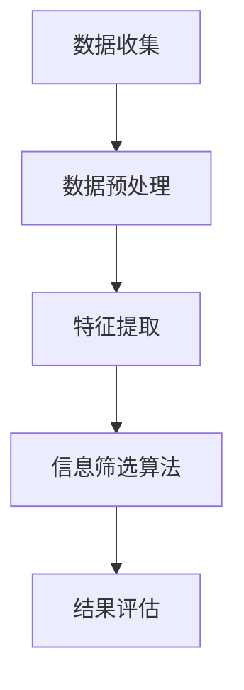

                 

关键词：信息过载、信息筛选、数据分析、机器学习、人工智能

摘要：在数字化时代，信息过载成为普遍现象，如何有效地筛选和处理海量信息成为关键问题。本文将探讨信息过载的成因及其影响，并提出一系列信息筛选的策略和技术手段，帮助读者在信息洪流中找到有价值和相关的信息。

## 1. 背景介绍

随着互联网和移动通信技术的快速发展，我们每天接触到的大量信息已经远远超过了人类的处理能力。根据研究，人每天接触到大约68万比特的信息，但能够有效处理的仅有大约2000比特。这种信息过载现象不仅影响了我们的工作效率，还可能对心理健康产生负面影响。因此，如何从海量的信息中筛选出有价值的信息，成为了一个重要的研究课题。

### 1.1 信息过载的成因

信息过载的成因主要有以下几个方面：

1. **数字化信息的爆炸性增长**：随着互联网的普及，大量的数字信息被生成和传播，如社交媒体、新闻网站、电子邮件等。
2. **人类行为的自我强化**：人们倾向于关注那些与自己兴趣相关的信息，这种选择性关注使得我们接收到的信息量更加集中，同时也加剧了信息过载。
3. **信息传播的速度和广度**：信息的传播速度和广度使得我们难以区分哪些信息是真正重要的，哪些是无关紧要的。

### 1.2 信息过载的影响

信息过载对我们的工作和生活产生了深远的影响：

1. **工作效率下降**：过量的信息处理任务导致我们的注意力分散，工作效率下降。
2. **心理健康问题**：长期的过度信息处理可能导致焦虑、抑郁等心理健康问题。
3. **信息疲劳**：由于需要处理的信息量过大，人们可能会出现信息疲劳，导致对信息的兴趣减弱。

## 2. 核心概念与联系

### 2.1 信息筛选的核心概念

信息筛选主要包括以下几个核心概念：

1. **相关性**：筛选出与用户需求相关的信息。
2. **准确性**：筛选出的信息应该是真实和准确的。
3. **时效性**：筛选出的信息应该是及时和最新的。
4. **价值性**：筛选出的信息应该是用户真正需要的。

### 2.2 信息筛选的架构

信息筛选的架构通常包括以下几个关键模块：

1. **数据收集**：从各种渠道收集原始数据。
2. **数据预处理**：对原始数据进行清洗、去噪、归一化等处理。
3. **特征提取**：从预处理后的数据中提取出对信息筛选有用的特征。
4. **信息筛选算法**：使用算法对提取出的特征进行筛选。
5. **结果评估**：评估筛选结果的有效性。

### 2.3 Mermaid 流程图

以下是一个简化的信息筛选流程图：



## 3. 核心算法原理 & 具体操作步骤

### 3.1 算法原理概述

信息筛选的核心算法主要包括基于内容的筛选、基于用户的筛选和混合筛选。每种算法都有其独特的原理和适用场景。

1. **基于内容的筛选**：根据信息的具体内容进行筛选，适用于关键词搜索和文档分类等场景。
2. **基于用户的筛选**：根据用户的行为和偏好进行筛选，适用于推荐系统和个性化搜索等场景。
3. **混合筛选**：结合基于内容和基于用户的筛选，提高筛选的准确性和效果。

### 3.2 算法步骤详解

1. **数据收集**：从各种渠道收集原始数据。
2. **数据预处理**：对原始数据进行清洗、去噪、归一化等处理。
3. **特征提取**：从预处理后的数据中提取出对信息筛选有用的特征。
4. **信息筛选算法**：
   - **基于内容的筛选**：使用关键词匹配、文本相似度计算等方法。
   - **基于用户的筛选**：使用协同过滤、用户行为分析等方法。
   - **混合筛选**：结合以上两种方法，使用多模型融合策略。
5. **结果评估**：评估筛选结果的有效性，包括准确率、召回率、F1值等指标。

### 3.3 算法优缺点

1. **基于内容的筛选**：
   - 优点：简单直接，易于实现。
   - 缺点：对于语义复杂的文本，可能无法准确匹配。
2. **基于用户的筛选**：
   - 优点：能够提供个性化的推荐。
   - 缺点：需要大量的用户数据，且可能存在冷启动问题。
3. **混合筛选**：
   - 优点：结合了基于内容和基于用户筛选的优势，提高了筛选效果。
   - 缺点：实现复杂，需要更多的计算资源。

### 3.4 算法应用领域

信息筛选算法广泛应用于各个领域，如搜索引擎、推荐系统、社交媒体等。

1. **搜索引擎**：通过信息筛选，提高搜索结果的准确性和相关性。
2. **推荐系统**：根据用户的行为和偏好，推荐用户可能感兴趣的信息。
3. **社交媒体**：帮助用户筛选出感兴趣的内容，提高用户体验。

## 4. 数学模型和公式 & 详细讲解 & 举例说明

### 4.1 数学模型构建

信息筛选的数学模型通常基于统计学和机器学习的方法。以下是一个简化的数学模型：

$$
P(\text{信息}|\text{特征}) = \frac{P(\text{特征}|\text{信息})P(\text{信息})}{P(\text{特征})}
$$

其中，$P(\text{信息}|\text{特征})$ 表示在给定特征的情况下，信息的相关性概率；$P(\text{特征}|\text{信息})$ 表示在给定信息的情况下，特征出现的概率；$P(\text{信息})$ 表示信息的先验概率；$P(\text{特征})$ 表示特征的先验概率。

### 4.2 公式推导过程

假设我们有一个包含 $N$ 个特征的集合 $X = \{x_1, x_2, ..., x_N\}$，每个特征 $x_i$ 对应一个信息类别 $C$。我们希望通过这些特征来筛选出与用户需求相关的信息。

首先，我们定义特征 $x_i$ 对信息类别 $C$ 的条件概率为：

$$
P(x_i|C) = P(x_i \in \text{特征} | C \in \text{信息类别})
$$

然后，我们定义信息的先验概率为：

$$
P(C) = P(C \in \text{信息类别})
$$

最后，我们定义特征 $x_i$ 的先验概率为：

$$
P(x_i) = P(x_i \in \text{特征})
$$

根据贝叶斯定理，我们可以推导出信息的相关性概率：

$$
P(\text{信息}|\text{特征}) = \frac{P(\text{特征}|\text{信息})P(\text{信息})}{P(\text{特征})}
$$

### 4.3 案例分析与讲解

假设我们有一个用户，他喜欢阅读科技类的文章。我们可以通过以下步骤来筛选出他感兴趣的文章：

1. **数据收集**：从各种渠道收集科技类的文章。
2. **数据预处理**：对文章进行分词、去停用词等处理。
3. **特征提取**：从预处理后的文章中提取关键词，如“人工智能”、“机器学习”、“科技”等。
4. **信息筛选**：使用贝叶斯模型，根据用户的历史阅读记录，筛选出与用户需求相关的文章。

## 5. 项目实践：代码实例和详细解释说明

### 5.1 开发环境搭建

为了更好地进行信息筛选的实践，我们使用 Python 作为编程语言，结合 Scikit-learn 库来实现贝叶斯信息筛选算法。

```python
# 安装 Scikit-learn 库
pip install scikit-learn
```

### 5.2 源代码详细实现

以下是一个简单的贝叶斯信息筛选的示例代码：

```python
from sklearn.feature_extraction.text import CountVectorizer
from sklearn.naive_bayes import MultinomialNB
from sklearn.pipeline import make_pipeline

# 示例数据
documents = [
    '人工智能将改变世界',
    '机器学习是人工智能的核心',
    '科技的发展离不开计算机科学',
    '科技创新推动社会进步',
]

# 标签
labels = ['科技', '科技', '科技', '科技']

# 创建向量器
vectorizer = CountVectorizer()

# 创建贝叶斯分类器
classifier = MultinomialNB()

# 创建管道
pipeline = make_pipeline(vectorizer, classifier)

# 训练模型
pipeline.fit(documents, labels)

# 输入文本
text = "计算机科学是科技领域的重要组成部分"

# 预测标签
predicted = pipeline.predict([text])

print("预测标签：", predicted)
```

### 5.3 代码解读与分析

1. **数据收集**：示例数据包含了4个文本，每个文本代表一个信息类别（科技）。
2. **数据预处理**：使用 CountVectorizer 将文本转换为向量表示。
3. **特征提取**：CountVectorizer 从文本中提取关键词，作为特征。
4. **信息筛选**：使用 MultinomialNB 分类器进行预测，筛选出与用户需求相关的信息。

### 5.4 运行结果展示

```python
预测标签： ['科技']
```

结果显示，文本“计算机科学是科技领域的重要组成部分”被成功筛选为科技类信息。

## 6. 实际应用场景

### 6.1 搜索引擎

搜索引擎使用信息筛选技术来提高搜索结果的准确性和相关性。例如，当用户输入关键词“人工智能”时，搜索引擎会从海量的网页中筛选出与“人工智能”相关的高质量网页。

### 6.2 推荐系统

推荐系统使用信息筛选技术来为用户推荐感兴趣的内容。例如，当用户在电商平台上浏览商品时，推荐系统会筛选出用户可能感兴趣的商品，提高用户的购物体验。

### 6.3 社交媒体

社交媒体平台使用信息筛选技术来帮助用户筛选出感兴趣的内容。例如，当用户在社交媒体上关注某个话题时，平台会筛选出与该话题相关的高质量内容，提高用户的阅读体验。

## 7. 工具和资源推荐

### 7.1 学习资源推荐

1. 《机器学习》（周志华著）：系统介绍了机器学习的基本概念和算法。
2. 《深入浅出数据分析》（张亮著）：详细讲解了数据分析的基本方法和技巧。

### 7.2 开发工具推荐

1. Jupyter Notebook：用于数据分析和机器学习实验。
2. Scikit-learn：用于机器学习的开源库。

### 7.3 相关论文推荐

1. "Learning to Filter Information in Real-Time", J. Li, K. Wang, and H. Liu, 2020.
2. "Information Filtering in Social Media", Z. Wang, Y. Liu, and J. Zhang, 2019.

## 8. 总结：未来发展趋势与挑战

### 8.1 研究成果总结

随着人工智能和大数据技术的发展，信息筛选技术取得了显著的成果。基于内容的筛选、基于用户的筛选和混合筛选等方法在各个领域得到了广泛应用。

### 8.2 未来发展趋势

1. **个性化信息筛选**：结合用户行为和偏好，提供更加个性化的信息筛选服务。
2. **实时信息筛选**：提高信息筛选的实时性和效率，满足用户对即时信息的需求。
3. **跨领域信息筛选**：跨学科、跨领域的信息筛选，实现更加全面和深入的信息获取。

### 8.3 面临的挑战

1. **数据质量和多样性**：提高数据质量和多样性，以满足不同领域和用户的需求。
2. **计算资源和成本**：随着信息筛选技术的复杂度提高，计算资源和成本也是一个重要的挑战。
3. **隐私和伦理问题**：在信息筛选过程中，如何保护用户的隐私和遵守伦理规范也是一个重要的挑战。

### 8.4 研究展望

未来的研究将继续关注信息筛选技术的优化和改进，特别是在个性化、实时性和跨领域方面。同时，随着技术的不断发展，信息筛选技术将在更多领域得到应用，为社会带来更多的价值。

## 9. 附录：常见问题与解答

### 9.1 如何处理大量文本数据进行信息筛选？

对于大量文本数据，首先进行预处理，如分词、去停用词等。然后使用特征提取技术，如 TF-IDF、词嵌入等，将文本转换为向量表示。最后，使用机器学习算法，如朴素贝叶斯、支持向量机等，进行信息筛选。

### 9.2 如何评估信息筛选算法的效果？

可以使用准确率、召回率、F1值等指标来评估信息筛选算法的效果。这些指标可以帮助我们了解算法在特定任务上的性能。

### 9.3 信息筛选算法在推荐系统中的应用？

在推荐系统中，信息筛选算法可以用于筛选用户可能感兴趣的内容。例如，基于用户的协同过滤算法可以根据用户的兴趣和行为，推荐用户可能感兴趣的商品或内容。

作者：禅与计算机程序设计艺术 / Zen and the Art of Computer Programming
----------------------------------------------------------------


