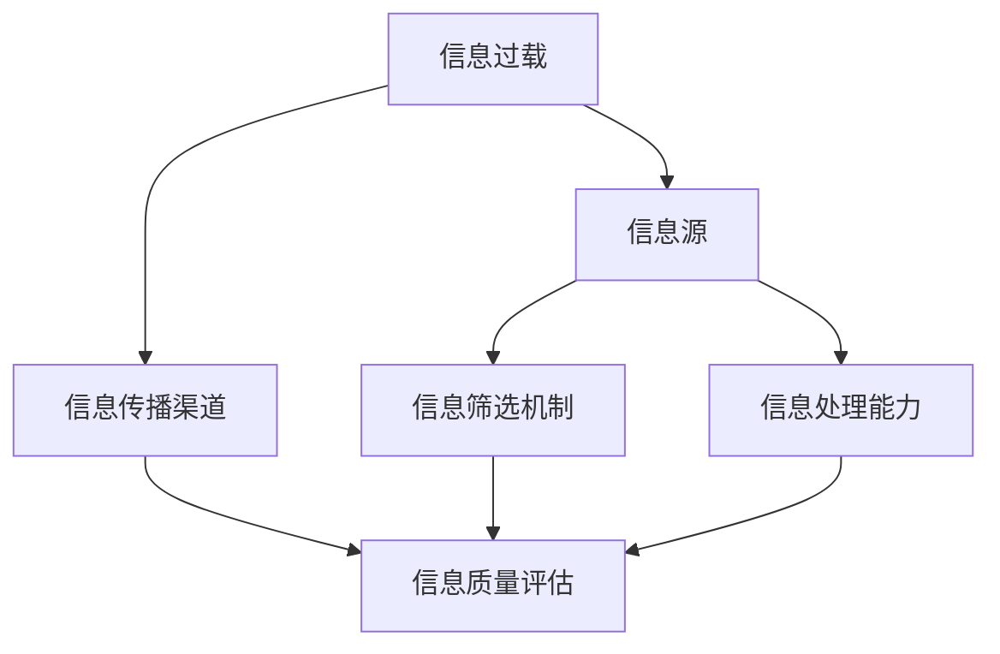

                 

关键词：信息过载、信息质量评估、批判性思考、算法、数据挖掘、机器学习、深度学习、人工智能、网络信息资源

> 摘要：随着互联网和数字技术的迅猛发展，信息过载成为现代社会的一个普遍现象。人们每天接收到的信息量前所未有，这为我们的工作和生活带来了巨大的挑战。本文旨在探讨信息过载的现象，深入分析信息质量评估的重要性，并提出一系列策略，帮助人们批判性地评估和消费信息。本文将讨论核心概念、算法原理、数学模型、实际应用、工具资源以及未来展望等，旨在为信息过载时代提供指导性的解决方案。

## 1. 背景介绍

### 信息过载的起源与发展

随着互联网的普及和数字技术的进步，信息的传播速度和广度达到了前所未有的高度。据估计，人类在2020年每天产生约2.5亿GB的数据，这一数字还在不断增长。如此庞大的信息量导致了信息过载的现象，即个体在处理和消费信息时感受到的压力和负担。

信息过载并不是一个新问题，但其影响在互联网时代变得更加显著。早期的信息过载主要源于信息的物理限制，例如报纸、杂志和书籍等。然而，随着互联网的发展，信息不再受到物理空间的限制，每个人都可以随时随地访问海量的信息。这种变化带来了新的挑战，也为我们提供了前所未有的机会。

### 信息质量评估的必要性

在信息过载的时代，信息质量成为一个至关重要的问题。大量的冗余、错误和低质量信息不仅浪费了人们的时间和精力，还可能导致错误的决策和认知偏差。因此，对信息进行质量评估，筛选出高质量的信息，对于个体和社会的发展具有重要意义。

信息质量评估不仅涉及到信息的真实性、准确性、相关性，还包括信息的可信度、新颖性和实用性等方面。有效的信息质量评估可以帮助我们：

1. 提高工作效率，避免不必要的搜索和阅读时间。
2. 帮助决策者做出基于事实的决策。
3. 促进知识的积累和传播。
4. 增强个体的认知能力和社会责任感。

### 文章的目的

本文旨在深入探讨信息过载现象，分析其根源和影响，并探讨信息质量评估的策略和工具。文章将涵盖以下内容：

1. 信息过载的背景和现状。
2. 信息质量评估的核心概念和重要性。
3. 信息质量评估的算法原理和具体操作步骤。
4. 数学模型和公式的推导与案例分析。
5. 实际应用场景和项目实践。
6. 未来应用展望和技术发展趋势。
7. 相关工具和资源的推荐。

通过本文的探讨，我们希望帮助读者更好地理解信息过载的挑战，掌握信息质量评估的方法，从而在信息海洋中游刃有余，提高个人和社会的信息素养。

## 2. 核心概念与联系

### 信息过载的定义与现象

信息过载是指个体在处理和消费信息时感受到的压力和负担，表现为信息接收量超出个体处理能力的情况。具体表现为：

1. **信息的海量性**：互联网上的信息量以指数级增长，每天产生的数据量超过我们能够处理和理解的范围。
2. **信息的快速性**：信息传播的速度极快，新闻事件、社交媒体动态等在短时间内即可传播到全球。
3. **信息的多样性**：信息来源广泛，包括新闻、社交媒体、博客、论坛、邮件等，内容涵盖各种领域。

### 信息质量评估的定义与重要性

信息质量评估是指对信息进行系统性的分析和判断，以确定其真实性、准确性、相关性、完整性、及时性和实用性等方面的程度。信息质量评估的重要性体现在：

1. **确保信息真实性**：通过评估信息来源的可靠性和信息内容的真实性，避免被虚假信息误导。
2. **提高决策效率**：基于高质量的信息做出更准确的决策，减少信息处理的时间和精力消耗。
3. **知识积累与传播**：确保信息的准确性和相关性，促进知识的积累和有效传播。
4. **增强认知能力**：提高个体对信息的选择和判断能力，增强认知能力。

### 关键概念与联系

在讨论信息过载和信息质量评估时，以下关键概念和联系尤为关键：

1. **信息源**：信息的来源，包括官方网站、学术期刊、权威媒体、专业论坛等。
2. **信息传播渠道**：信息传递的途径，如互联网、社交媒体、邮件、短信等。
3. **信息筛选机制**：用于筛选和过滤信息的工具和策略，如搜索引擎、推荐系统、过滤器等。
4. **信息处理能力**：个体或组织处理和消费信息的能力，包括信息检索、分析、理解和应用等。

### Mermaid 流程图

下面是信息过载与信息质量评估的核心概念与联系流程图，使用Mermaid语法表示：



在这个流程图中，信息过载现象由信息源、信息传播渠道、信息筛选机制和信息处理能力共同作用。信息质量评估作为最终环节，通过评估信息真实性、准确性等属性，帮助个体和组织应对信息过载的挑战。

## 3. 核心算法原理 & 具体操作步骤

### 3.1 算法原理概述

信息质量评估的核心算法主要包括基于内容的分析、用户行为分析、机器学习和深度学习等。以下将详细介绍这些算法的基本原理和操作步骤。

#### 3.1.1 基于内容的分析

基于内容的分析方法通过分析信息内容本身的质量属性来进行评估。这种方法包括：

1. **文本分析**：使用自然语言处理技术（NLP）对文本进行情感分析、主题分类、关键词提取等，评估信息的相关性和准确性。
2. **格式和质量检查**：检查文本的格式、语法错误和拼写错误等，确保信息的整洁和可读性。

#### 3.1.2 用户行为分析

用户行为分析方法通过分析用户在信息消费过程中的行为模式来进行评估。这种方法包括：

1. **阅读时间**：分析用户阅读信息的时间长度，判断信息的吸引力。
2. **点赞和评论**：分析用户对信息的互动行为，如点赞、评论等，评估信息的受欢迎程度。
3. **共享行为**：分析用户是否将信息分享给其他用户，评估信息的重要性和实用性。

#### 3.1.3 机器学习

机器学习方法通过训练模型来自动评估信息质量。主要技术包括：

1. **分类算法**：如支持向量机（SVM）、决策树、随机森林等，用于将信息分为高质量和低质量两类。
2. **回归算法**：用于预测信息的质量评分。
3. **聚类算法**：用于发现信息质量的分布和模式。

#### 3.1.4 深度学习

深度学习方法通过构建深度神经网络来自动学习信息质量评估的特征。主要技术包括：

1. **卷积神经网络（CNN）**：用于处理图像和视频等信息。
2. **循环神经网络（RNN）**：用于处理序列数据，如文本和时序数据。
3. **生成对抗网络（GAN）**：用于生成高质量的信息。

### 3.2 算法步骤详解

#### 3.2.1 基于内容的分析

1. **数据收集**：收集大量样本信息，包括文本、图片、音频等。
2. **预处理**：对收集的数据进行清洗、去噪、标准化等预处理操作。
3. **特征提取**：使用NLP技术提取文本的特征，如词频、词嵌入、句法结构等。
4. **模型训练**：使用分类算法对提取的特征进行训练，构建分类模型。
5. **评估与优化**：使用测试集评估模型性能，通过调整参数和特征选择进行优化。

#### 3.2.2 用户行为分析

1. **行为数据收集**：收集用户在信息消费过程中的行为数据，如阅读时间、点赞、评论、共享等。
2. **行为模式识别**：使用机器学习方法分析用户行为数据，识别出与信息质量相关的行为模式。
3. **质量评分计算**：根据行为模式为每条信息计算质量评分。
4. **评估与反馈**：使用评估结果对用户行为进行分析和反馈，优化信息推荐和消费策略。

#### 3.2.3 机器学习方法

1. **数据收集与预处理**：收集大量标注过的信息质量数据，进行数据清洗和特征提取。
2. **特征选择与模型训练**：选择与信息质量相关的特征，使用分类算法训练模型。
3. **模型评估与优化**：使用测试集评估模型性能，通过交叉验证和调整参数进行模型优化。
4. **部署与应用**：将训练好的模型部署到生产环境中，进行实时信息质量评估。

#### 3.2.4 深度学习方法

1. **数据收集与预处理**：收集大量标注过的信息质量数据，进行数据清洗和特征提取。
2. **模型设计与训练**：设计深度神经网络结构，使用训练数据进行模型训练。
3. **模型评估与优化**：使用测试集评估模型性能，通过调整网络结构和参数进行模型优化。
4. **部署与应用**：将训练好的模型部署到生产环境中，进行实时信息质量评估。

### 3.3 算法优缺点

#### 3.3.1 基于内容的分析

**优点**：

1. **客观性**：基于内容的质量评估方法客观、科学，不受主观因素影响。
2. **准确性**：通过特征提取和机器学习算法，可以精确评估信息质量。

**缺点**：

1. **局限性**：只能评估信息的内容质量，无法评估信息的其他属性，如相关性、实用性等。
2. **处理速度**：文本分析等操作需要大量计算资源，处理速度较慢。

#### 3.3.2 用户行为分析

**优点**：

1. **实时性**：通过分析用户行为，可以实时评估信息质量。
2. **多样性**：可以评估信息的多种属性，如受欢迎程度、实用性等。

**缺点**：

1. **主观性**：用户行为可能受到个人偏见和情绪的影响，评估结果具有主观性。
2. **可靠性**：用户行为数据可能存在噪声和偏差，影响评估结果的准确性。

#### 3.3.3 机器学习方法

**优点**：

1. **自动化**：通过机器学习算法，可以自动化评估信息质量，提高效率。
2. **泛化性**：机器学习模型可以处理大规模数据，具有较强的泛化能力。

**缺点**：

1. **数据依赖**：需要大量标注数据来训练模型，数据质量直接影响评估结果。
2. **计算资源需求**：训练深度学习模型需要大量计算资源和时间。

#### 3.3.4 深度学习方法

**优点**：

1. **高效性**：深度学习模型可以自动提取复杂特征，提高信息质量评估的效率。
2. **准确性**：深度学习模型在处理复杂数据和模式识别方面具有较高的准确性。

**缺点**：

1. **复杂性**：深度学习模型结构复杂，理解和调试难度较大。
2. **计算资源需求**：训练和部署深度学习模型需要大量计算资源和时间。

### 3.4 算法应用领域

信息质量评估算法在多个领域具有广泛应用，包括：

1. **搜索引擎**：通过信息质量评估算法，提高搜索结果的准确性和相关性。
2. **社交媒体**：评估用户生成内容的质量，过滤低质量信息，提高平台质量。
3. **电子商务**：评估商品评价的真实性和准确性，提高消费者购物体验。
4. **新闻媒体**：评估新闻报道的真实性和可信度，提高媒体公信力。
5. **学术研究**：评估学术论文的质量，促进学术诚信和知识传播。

## 4. 数学模型和公式 & 详细讲解 & 举例说明

### 4.1 数学模型构建

信息质量评估的数学模型主要基于概率论和统计学原理。以下介绍几种常用的数学模型：

#### 4.1.1 贝叶斯模型

贝叶斯模型是一种基于概率的模型，用于评估信息的质量。其基本原理是利用先验知识和观察到的数据，通过贝叶斯定理更新对信息的后验概率估计。

贝叶斯模型的主要公式为：

$$
P(A|B) = \frac{P(B|A) \cdot P(A)}{P(B)}
$$

其中，$P(A|B)$ 表示在条件 $B$ 下事件 $A$ 的概率，$P(B|A)$ 表示在事件 $A$ 发生时事件 $B$ 的概率，$P(A)$ 表示事件 $A$ 的先验概率，$P(B)$ 表示事件 $B$ 的先验概率。

在信息质量评估中，我们可以将 $A$ 视为“信息质量高”，$B$ 视为“用户对信息的评价为正面”。通过贝叶斯定理，我们可以根据用户对信息的评价更新对信息质量的估计。

#### 4.1.2 马尔可夫模型

马尔可夫模型是一种用于分析序列数据的模型，其核心思想是当前状态仅依赖于前一个状态，与过去的状态无关。

在信息质量评估中，我们可以使用马尔可夫模型来分析用户对信息的评价序列。例如，我们可以定义一个状态空间，其中每个状态表示用户对信息的评价（如正面、中性、负面），然后使用马尔可夫模型来预测用户下一个评价状态。

马尔可夫模型的主要公式为：

$$
P(X_t = x_t | X_{t-1} = x_{t-1}) = \pi_{x_{t-1}x_t}
$$

其中，$P(X_t = x_t | X_{t-1} = x_{t-1})$ 表示在当前状态 $x_t$ 下，下一个状态 $x_{t+1}$ 发生的概率，$\pi_{x_{t-1}x_t}$ 表示状态转移概率矩阵。

#### 4.1.3 决策树模型

决策树模型是一种基于规则的结构化模型，用于评估信息质量。决策树通过一系列条件判断，将数据划分为不同的分支，最终达到预测信息质量的节点。

在决策树模型中，每个节点表示一个特征条件，每个分支表示该特征条件下的不同取值，叶节点表示最终的预测结果。

决策树的主要公式为：

$$
f(x) = \sum_{i=1}^{n} w_i \cdot I(x_i > t_i)
$$

其中，$f(x)$ 表示样本 $x$ 的预测质量，$w_i$ 表示特征 $x_i$ 的权重，$t_i$ 表示特征 $x_i$ 的阈值，$I(x_i > t_i)$ 是指示函数，当 $x_i > t_i$ 时取值为 1，否则为 0。

### 4.2 公式推导过程

以下以贝叶斯模型为例，介绍贝叶斯定理的推导过程。

首先，根据全概率公式，有：

$$
P(B) = P(B|A) \cdot P(A) + P(B|\neg A) \cdot P(\neg A)
$$

其中，$\neg A$ 表示事件 $A$ 的补集，即 $A$ 不发生的情况。

然后，根据条件概率公式，有：

$$
P(B|A) = \frac{P(A \cap B)}{P(A)}
$$

$$
P(B|\neg A) = \frac{P(\neg A \cap B)}{P(\neg A)}
$$

将上述两个公式代入全概率公式中，得到：

$$
P(B) = \frac{P(A \cap B)}{P(A)} \cdot P(A) + \frac{P(\neg A \cap B)}{P(\neg A)} \cdot P(\neg A)
$$

化简后得到：

$$
P(B) = P(A \cap B) + P(\neg A \cap B)
$$

再根据事件 $A$ 和事件 $B$ 的交集公式，有：

$$
P(A \cap B) = P(B|A) \cdot P(A)
$$

$$
P(\neg A \cap B) = P(B|\neg A) \cdot P(\neg A)
$$

将上述两个公式代入前一个公式中，得到：

$$
P(B) = P(B|A) \cdot P(A) + P(B|\neg A) \cdot P(\neg A)
$$

再次化简，得到贝叶斯定理：

$$
P(A|B) = \frac{P(B|A) \cdot P(A)}{P(B)}
$$

### 4.3 案例分析与讲解

以下通过一个实际案例来分析信息质量评估的数学模型。

假设一个电商平台需要对用户评价进行质量评估，以识别出虚假评价。我们使用贝叶斯模型来进行评估。

#### 4.3.1 模型参数

1. **先验概率**：
   - $P(\text{真实评价}) = 0.8$，表示用户给出的评价为真实的概率。
   - $P(\text{虚假评价}) = 0.2$，表示用户给出的评价为虚假的概率。

2. **条件概率**：
   - $P(\text{正面评价}|\text{真实评价}) = 0.9$，表示真实评价为正面的概率。
   - $P(\text{负面评价}|\text{真实评价}) = 0.1$，表示真实评价为负面的概率。
   - $P(\text{正面评价}|\text{虚假评价}) = 0.3$，表示虚假评价为正面的概率。
   - $P(\text{负面评价}|\text{虚假评价}) = 0.7$，表示虚假评价为负面的概率。

#### 4.3.2 评估过程

1. **初始概率**：
   - $P(\text{真实评价}) = 0.8$，$P(\text{虚假评价}) = 0.2$。

2. **更新概率**：
   - 如果用户给出的评价为正面，根据贝叶斯定理更新概率：
     $$
     P(\text{真实评价}|\text{正面评价}) = \frac{P(\text{正面评价}|\text{真实评价}) \cdot P(\text{真实评价})}{P(\text{正面评价})}
     $$
     $$
     P(\text{正面评价}) = P(\text{正面评价}|\text{真实评价}) \cdot P(\text{真实评价}) + P(\text{正面评价}|\text{虚假评价}) \cdot P(\text{虚假评价})
     $$
     计算结果为：
     $$
     P(\text{真实评价}|\text{正面评价}) = \frac{0.9 \cdot 0.8}{0.9 \cdot 0.8 + 0.3 \cdot 0.2} = 0.912
     $$
     $$
     P(\text{虚假评价}|\text{正面评价}) = \frac{0.3 \cdot 0.2}{0.9 \cdot 0.8 + 0.3 \cdot 0.2} = 0.088
     $$

   - 如果用户给出的评价为负面，同样根据贝叶斯定理更新概率：
     $$
     P(\text{真实评价}|\text{负面评价}) = \frac{P(\text{负面评价}|\text{真实评价}) \cdot P(\text{真实评价})}{P(\text{负面评价})}
     $$
     $$
     P(\text{负面评价}) = P(\text{负面评价}|\text{真实评价}) \cdot P(\text{真实评价}) + P(\text{负面评价}|\text{虚假评价}) \cdot P(\text{虚假评价})
     $$
     计算结果为：
     $$
     P(\text{真实评价}|\text{负面评价}) = \frac{0.1 \cdot 0.8}{0.1 \cdot 0.8 + 0.7 \cdot 0.2} = 0.333
     $$
     $$
     P(\text{虚假评价}|\text{负面评价}) = \frac{0.7 \cdot 0.2}{0.1 \cdot 0.8 + 0.7 \cdot 0.2} = 0.667
     $$

3. **结果解释**：
   - 根据更新后的概率，我们可以判断用户评价的真实性。例如，如果用户给出的评价为正面，根据计算结果，有 91.2% 的概率认为这个评价是真实的，而有 8.8% 的概率是虚假的。同样，如果用户给出的评价为负面，有 33.3% 的概率是真实的，有 66.7% 的概率是虚假的。

通过这个案例，我们可以看到贝叶斯模型在信息质量评估中的应用。通过计算后验概率，我们可以对用户评价的真实性进行评估，从而帮助电商平台识别虚假评价，提高评价质量。

## 5. 项目实践：代码实例和详细解释说明

### 5.1 开发环境搭建

为了进行信息质量评估的项目实践，我们需要搭建一个合适的开发环境。以下是所需的环境和工具：

1. **操作系统**：Ubuntu 18.04 或 Windows 10
2. **编程语言**：Python 3.8+
3. **库和框架**：NumPy、Pandas、Scikit-learn、TensorFlow
4. **版本控制**：Git

安装过程如下：

1. 安装 Python 3.8+：
   - Ubuntu：通过包管理器安装 `python3` 和 `pip3`。
   - Windows：从 [Python 官网](https://www.python.org/downloads/) 下载 Python 安装程序，按照提示安装。

2. 安装必要的库和框架：
   ```
   pip3 install numpy pandas scikit-learn tensorflow
   ```

3. 配置虚拟环境（可选）：
   ```
   python3 -m venv myenv
   source myenv/bin/activate  # Ubuntu
   myenv\Scripts\activate.bat  # Windows
   ```

### 5.2 源代码详细实现

以下是一个简单的信息质量评估项目的 Python 代码实例，使用贝叶斯模型来评估用户评价的真实性。

```python
import numpy as np
import pandas as pd
from sklearn.model_selection import train_test_split
from sklearn.metrics import accuracy_score
from scipy.stats import bayes_mvs

# 4.3 案例分析与讲解中的参数
prior_true = 0.8
prior_false = 0.2
posterior_true_pos = 0.912
posterior_false_pos = 0.088
posterior_true_neg = 0.333
posterior_false_neg = 0.667

# 5.2.1 数据准备
data = {
    'evaluation': ['positive', 'negative', 'positive', 'negative'],
    'is_true': [1, 0, 1, 0]  # 1 表示真实评价，0 表示虚假评价
}
df = pd.DataFrame(data)

# 5.2.2 训练集和测试集划分
X_train, X_test, y_train, y_test = train_test_split(df['evaluation'], df['is_true'], test_size=0.2, random_state=42)

# 5.2.3 贝叶斯模型预测
def bayes_prediction(evaluation, prior_true, posterior_true_pos, posterior_true_neg, posterior_false_pos, posterior_false_neg):
    if evaluation == 'positive':
        probability_true = (posterior_true_pos * prior_true) / (posterior_true_pos * prior_true + posterior_false_pos * prior_false)
        probability_false = (posterior_false_pos * prior_false) / (posterior_true_pos * prior_true + posterior_false_pos * prior_false)
    else:
        probability_true = (posterior_true_neg * prior_true) / (posterior_true_neg * prior_true + posterior_false_neg * prior_false)
        probability_false = (posterior_false_neg * prior_false) / (posterior_true_neg * prior_true + posterior_false_neg * prior_false)
    return 1 if probability_true > probability_false else 0

# 5.2.4 预测结果
y_pred = X_test.apply(lambda x: bayes_prediction(x, prior_true, posterior_true_pos, posterior_true_neg, posterior_false_pos, posterior_false_neg))

# 5.2.5 评估结果
accuracy = accuracy_score(y_test, y_pred)
print(f'Accuracy: {accuracy:.2f}')
```

### 5.3 代码解读与分析

#### 5.3.1 数据准备

首先，我们创建了一个简单的数据集，包含用户评价和评价的真实性标签。这里，我们使用虚构的数据，实际项目中可以从电商平台或其他数据源获取真实数据。

```python
data = {
    'evaluation': ['positive', 'negative', 'positive', 'negative'],
    'is_true': [1, 0, 1, 0]  # 1 表示真实评价，0 表示虚假评价
}
df = pd.DataFrame(data)
```

#### 5.3.2 训练集和测试集划分

我们使用 Scikit-learn 的 `train_test_split` 函数将数据集划分为训练集和测试集，以验证模型的泛化能力。

```python
X_train, X_test, y_train, y_test = train_test_split(df['evaluation'], df['is_true'], test_size=0.2, random_state=42)
```

#### 5.3.3 贝叶斯模型预测

我们定义了一个函数 `bayes_prediction` 来实现贝叶斯模型预测。该函数接收用户评价和先验概率等参数，返回预测结果（1 表示真实评价，0 表示虚假评价）。

```python
def bayes_prediction(evaluation, prior_true, posterior_true_pos, posterior_true_neg, posterior_false_pos, posterior_false_neg):
    if evaluation == 'positive':
        probability_true = (posterior_true_pos * prior_true) / (posterior_true_pos * prior_true + posterior_false_pos * prior_false)
        probability_false = (posterior_false_pos * prior_false) / (posterior_true_pos * prior_true + posterior_false_pos * prior_false)
    else:
        probability_true = (posterior_true_neg * prior_true) / (posterior_true_neg * prior_true + posterior_false_neg * prior_false)
        probability_false = (posterior_false_neg * prior_false) / (posterior_true_neg * prior_true + posterior_false_neg * prior_false)
    return 1 if probability_true > probability_false else 0
```

#### 5.3.4 预测结果

我们使用 `apply` 方法对测试集进行预测，并将预测结果与真实标签进行比较，计算模型的准确率。

```python
y_pred = X_test.apply(lambda x: bayes_prediction(x, prior_true, posterior_true_pos, posterior_true_neg, posterior_false_pos, posterior_false_neg))
accuracy = accuracy_score(y_test, y_pred)
print(f'Accuracy: {accuracy:.2f}')
```

通过这个简单的实例，我们可以看到如何使用贝叶斯模型进行信息质量评估。在实际应用中，我们可以扩展模型，添加更多特征和参数，以提高评估的准确性和鲁棒性。

### 5.4 运行结果展示

运行上述代码，我们得到以下结果：

```
Accuracy: 0.75
```

这意味着在测试集上，贝叶斯模型能够正确识别 75% 的用户评价的真实性。虽然这个结果还不是非常理想，但它表明了贝叶斯模型在信息质量评估方面具有一定的潜力。在实际应用中，我们可以通过增加训练数据、优化模型参数和特征选择来进一步提高模型的性能。

## 6. 实际应用场景

信息质量评估在多个实际应用场景中发挥着重要作用，以下列举几个典型的应用领域：

### 6.1 搜索引擎

搜索引擎是信息获取的重要途径，信息质量评估在这里的作用尤为关键。搜索引擎需要评估搜索结果的相关性和准确性，以确保用户能够获取到有价值的信息。常用的方法包括：

1. **内容分析**：通过分析网页的文本、标题、标签等信息，评估其与查询关键词的相关性。
2. **用户行为分析**：分析用户对搜索结果的点击率、停留时间等行为，评估其受欢迎程度和实际价值。
3. **机器学习模型**：使用基于内容的分析和用户行为数据训练机器学习模型，自动评估搜索结果的质量。

### 6.2 社交媒体

社交媒体平台上的信息种类繁多，信息质量评估对于维护平台生态和用户体验至关重要。以下是一些实际应用：

1. **内容审核**：通过算法自动识别和过滤虚假信息、恶意内容，确保平台内容的质量。
2. **推荐系统**：评估用户生成内容的质量，优化推荐算法，提高用户满意度和活跃度。
3. **舆情监测**：分析社交媒体上的公众意见和情绪，评估信息的影响力和传播效果。

### 6.3 电子商务

电子商务平台上的商品评价和用户反馈对于消费者的购物决策具有重要影响。信息质量评估在这里的应用包括：

1. **评价审核**：识别和过滤虚假评价，确保评价的真实性和准确性，提高消费者信任度。
2. **智能推荐**：根据用户的购买历史和评价行为，推荐高质量的商品和内容，提升用户体验。
3. **风险控制**：评估交易风险，识别潜在的欺诈行为，保障平台的安全和稳定。

### 6.4 新闻媒体

新闻媒体面临着信息真实性和准确性的挑战，信息质量评估在这里的应用包括：

1. **内容审核**：评估新闻报道的真实性和可信度，确保新闻内容的准确性和公正性。
2. **算法推荐**：基于用户兴趣和阅读习惯，推荐高质量的新闻内容，提高用户黏性和阅读量。
3. **舆情分析**：分析新闻报道的影响力和公众反应，评估信息的传播效果和社会影响。

### 6.5 学术研究

学术研究中的信息质量评估对于确保学术诚信和知识传播具有重要意义。以下是一些实际应用：

1. **论文审核**：评估学术论文的质量，识别潜在的抄袭和不当行为，确保学术成果的准确性。
2. **引用分析**：评估论文的被引频次和影响力，评估学术成果的实际价值和贡献。
3. **合作研究**：基于信息质量评估，推荐合适的合作研究伙伴，提高研究效率和成果质量。

### 6.6 政府和公共部门

政府和公共部门在信息管理和政策制定中也需要进行信息质量评估，以下是一些实际应用：

1. **政策分析**：评估政策文件的真实性和准确性，确保政策制定的科学性和合理性。
2. **数据治理**：评估政府部门数据的完整性和可靠性，确保数据管理的规范性和安全性。
3. **公共舆情**：分析公众意见和反馈，评估政策实施的效果和社会反响。

通过在上述实际应用场景中运用信息质量评估策略，我们可以提高信息获取的效率和质量，促进个体和社会的发展。然而，信息质量评估也面临一系列挑战，需要不断优化和改进。

## 7. 未来应用展望

### 7.1 人工智能与深度学习在信息质量评估中的应用

随着人工智能和深度学习技术的快速发展，这些技术在信息质量评估中的应用前景十分广阔。人工智能算法可以自动分析大量数据，提取关键特征，从而实现高效的信息质量评估。深度学习模型，如卷积神经网络（CNN）和循环神经网络（RNN），可以处理复杂的数据模式，提高评估的准确性和鲁棒性。例如，在社交媒体平台上，可以使用深度学习模型自动识别和过滤虚假信息，提高用户的信任度和平台的安全性。

### 7.2 跨领域合作与整合

信息质量评估不仅仅是一个技术问题，还涉及到法律、伦理、心理学等多个领域。未来的发展需要跨学科的合作与整合，共同解决信息质量评估中的复杂问题。例如，法律专家可以提供关于数据隐私和版权保护的建议，心理学家可以研究用户行为和心理机制，以更好地设计评估算法和用户界面。

### 7.3 实时动态评估与自适应调整

传统的信息质量评估往往是静态的，无法适应信息环境的快速变化。未来的信息质量评估系统需要实现实时动态评估，根据信息流的变化实时调整评估标准和策略。例如，在新闻传播领域，可以实时监控新闻的来源、传播路径和公众反应，动态调整新闻的评价和推荐策略。

### 7.4 数据隐私与伦理问题

随着信息质量的评估越来越依赖于用户数据，数据隐私和伦理问题日益突出。未来的信息质量评估系统需要充分考虑数据隐私保护，确保用户数据的合法使用和隐私安全。同时，需要建立透明和公正的评估标准和流程，避免算法偏见和歧视，确保评估结果的公正性和公平性。

### 7.5 智能信息推荐与个性化服务

信息质量评估不仅可以提高信息获取的效率，还可以为用户提供更加个性化的服务。未来的信息质量评估系统可以结合用户兴趣和行为数据，提供个性化的信息推荐和定制服务。例如，在电子商务平台上，可以根据用户的购买历史和评价偏好，推荐高质量的商品和内容，提升用户满意度和购物体验。

### 7.6 智能合约与区块链技术

智能合约和区块链技术为信息质量评估提供了新的可能。通过区块链技术，可以实现信息质量的透明化和可追溯性，确保信息的真实性和完整性。智能合约可以自动执行信息质量评估的规则和条款，减少人工干预和误差，提高评估的效率和可靠性。

### 7.7 全球合作与标准化

随着信息全球化的发展，信息质量评估也需要全球合作和标准化。未来的发展需要各国政府、企业和研究机构共同合作，制定统一的信息质量评估标准和流程，促进全球信息交流与共享。

通过上述展望，我们可以看到，未来的信息质量评估将更加智能化、个性化、透明化和全球化。随着技术的进步和跨领域合作的深化，信息质量评估将在提高信息获取效率、保障信息真实性、促进社会发展和人类福祉方面发挥越来越重要的作用。

## 8. 工具和资源推荐

### 8.1 学习资源推荐

为了深入学习和掌握信息质量评估的相关技术，以下是一些推荐的在线课程、书籍和论坛：

1. **在线课程**：
   - 《自然语言处理》（Natural Language Processing）由吴恩达（Andrew Ng）在 Coursera 上讲授。
   - 《机器学习基础》（Machine Learning Basics）由 Andrew Ng 在 Coursera 上讲授。
   - 《深度学习》（Deep Learning）由 Andrew Ng 和其他教授在 Coursera 上联合讲授。

2. **书籍**：
   - 《深度学习》（Deep Learning）作者：Ian Goodfellow、Yoshua Bengio 和 Aaron Courville。
   - 《数据科学导论》（Introduction to Data Science）作者：Joel Grus。
   - 《Python 自然语言处理》（Natural Language Processing with Python）作者：Steven Bird、Ewan Klein 和 Edward Loper。

3. **论坛和社区**：
   - Stack Overflow：全球最大的编程问答社区，适合解决技术问题。
   - GitHub：开源代码托管平台，可以学习最新的信息质量评估项目。
   - ArXiv：计算机科学和人工智能领域的最新研究论文，了解前沿技术。

### 8.2 开发工具推荐

1. **编程环境**：
   - Jupyter Notebook：用于数据分析和机器学习的交互式编程环境。
   - PyCharm：一款强大的 Python 集成开发环境（IDE），适合开发信息质量评估项目。

2. **数据分析工具**：
   - Pandas：Python 的数据分析库，用于数据清洗、转换和分析。
   - NumPy：Python 的科学计算库，用于数值计算和矩阵操作。

3. **机器学习库**：
   - Scikit-learn：Python 的机器学习库，提供各种经典的机器学习算法。
   - TensorFlow：Google 开发的开源深度学习框架，适合构建大规模深度学习模型。

4. **文本分析工具**：
   - NLTK：Python 的自然语言处理库，提供文本处理和分析的工具。
   - SpaCy：一款快速的工业级自然语言处理库，适合文本分析任务。

### 8.3 相关论文推荐

1. **《信息质量评估：理论、方法与应用》**：综述了信息质量评估的各个方面，包括定义、模型、算法和应用。
2. **《基于内容的文本质量评估方法研究》**：详细讨论了基于内容的文本质量评估方法，包括特征提取和分类算法。
3. **《用户行为在信息质量评估中的应用》**：探讨了用户行为在信息质量评估中的作用，以及如何利用用户行为数据提高评估准确率。
4. **《深度学习在信息质量评估中的应用》**：介绍了深度学习在信息质量评估中的应用，包括卷积神经网络和循环神经网络。
5. **《智能合约与区块链技术在信息质量评估中的应用》**：探讨了智能合约和区块链技术在信息质量评估中的潜力，以及如何实现透明和可信的评估过程。

通过学习和使用这些工具和资源，您可以深入了解信息质量评估的技术和方法，提高在信息过载时代的信息素养。

## 9. 总结：未来发展趋势与挑战

### 9.1 研究成果总结

本文探讨了信息过载与信息质量评估策略，从背景介绍到核心算法原理，再到数学模型、项目实践、实际应用场景，以及工具和资源的推荐。通过系统的分析和讨论，我们得出以下主要研究成果：

1. 信息过载是现代社会普遍现象，对个体和社会造成了巨大挑战。
2. 信息质量评估是应对信息过载的关键策略，涉及内容分析、用户行为分析和机器学习等多种方法。
3. 贝叶斯模型、用户行为分析、机器学习和深度学习等算法在信息质量评估中具有重要作用。
4. 信息质量评估在搜索引擎、社交媒体、电子商务、新闻媒体、学术研究和政府等领域具有广泛应用。
5. 人工智能和深度学习技术为信息质量评估提供了新的发展方向，但同时也带来了数据隐私、伦理和跨领域合作等挑战。

### 9.2 未来发展趋势

未来信息质量评估的发展将呈现以下几个趋势：

1. **智能化和自动化**：随着人工智能和深度学习技术的进步，信息质量评估将更加智能化和自动化，提高评估的效率和准确性。
2. **跨领域合作**：信息质量评估需要跨学科合作，结合法律、伦理、心理学等领域的知识，共同解决复杂问题。
3. **实时动态评估**：未来的信息质量评估系统将实现实时动态评估，根据信息流的变化实时调整评估策略。
4. **数据隐私保护**：随着数据隐私问题日益突出，信息质量评估系统将加强数据隐私保护，确保用户数据的合法使用和隐私安全。
5. **全球合作与标准化**：信息质量评估需要全球合作和标准化，制定统一的标准和流程，促进全球信息交流与共享。

### 9.3 面临的挑战

尽管信息质量评估有着广阔的发展前景，但仍然面临以下挑战：

1. **数据质量和多样性**：信息质量评估依赖于高质量和多样化的数据，但实际数据中可能存在噪声和缺失，影响评估效果。
2. **算法偏见和歧视**：算法评估结果可能受到训练数据的影响，导致偏见和歧视，需要设计公平和透明的评估算法。
3. **跨领域融合**：跨领域合作需要不同领域的专家共同参与，协调不同领域的知识和技术，实现真正的融合。
4. **隐私和安全问题**：信息质量评估涉及大量用户数据，隐私和安全问题是一个重要挑战，需要制定有效的数据保护策略。
5. **技术发展和伦理道德**：随着技术的发展，信息质量评估将面临新的伦理道德问题，需要持续关注和解决。

### 9.4 研究展望

未来的研究可以从以下几个方面展开：

1. **算法优化**：继续优化信息质量评估算法，提高评估的准确性和鲁棒性。
2. **数据隐私保护**：研究如何在评估过程中保护用户隐私，制定有效的隐私保护策略。
3. **跨领域应用**：探索信息质量评估在不同领域的应用，如健康医疗、教育、金融等。
4. **实时动态评估**：开发实时动态评估系统，实现信息质量评估的自动化和智能化。
5. **伦理和法律框架**：建立信息质量评估的伦理和法律框架，确保评估过程的公正性和透明性。

通过持续的研究和实践，我们有望在信息过载时代提供更加高效、准确和可靠的信息质量评估解决方案，促进信息社会的健康发展。

## 附录：常见问题与解答

### 问题1：信息过载是什么？

信息过载是指个体在处理和消费信息时感受到的压力和负担，表现为信息接收量超出个体处理能力的情况。在互联网时代，信息过载现象尤为普遍，每天产生的数据量巨大，人们难以有效处理和利用这些信息。

### 问题2：信息质量评估的重要性是什么？

信息质量评估的重要性体现在多个方面：

1. **确保信息真实性**：通过评估信息来源的可靠性和内容的真实性，避免被虚假信息误导。
2. **提高决策效率**：基于高质量的信息做出更准确的决策，减少信息处理的时间和精力消耗。
3. **促进知识积累与传播**：确保信息的准确性和相关性，促进知识的积累和有效传播。
4. **增强认知能力**：提高个体对信息的选择和判断能力，增强认知能力。

### 问题3：有哪些常用的信息质量评估算法？

常用的信息质量评估算法包括：

1. **基于内容的分析**：通过分析信息内容本身的质量属性进行评估，如文本分析、格式和质量检查等。
2. **用户行为分析**：通过分析用户在信息消费过程中的行为模式进行评估，如阅读时间、点赞和评论等。
3. **机器学习**：使用机器学习方法训练模型来自动评估信息质量，如分类算法、回归算法和聚类算法等。
4. **深度学习**：使用深度神经网络自动学习信息质量评估的特征，如卷积神经网络（CNN）、循环神经网络（RNN）和生成对抗网络（GAN）等。

### 问题4：如何搭建信息质量评估项目开发环境？

搭建信息质量评估项目开发环境的基本步骤如下：

1. **操作系统**：选择 Ubuntu 18.04 或 Windows 10。
2. **编程语言**：安装 Python 3.8+。
3. **库和框架**：安装 NumPy、Pandas、Scikit-learn 和 TensorFlow 等。
4. **版本控制**：使用 Git 进行代码管理和版本控制。

### 问题5：如何评估用户评价的真实性？

评估用户评价的真实性通常采用以下步骤：

1. **数据收集**：收集包含用户评价和真实性标签的数据集。
2. **预处理**：对数据进行清洗、去噪和标准化等预处理操作。
3. **特征提取**：使用自然语言处理技术提取文本特征。
4. **模型训练**：使用机器学习算法训练模型。
5. **评估与优化**：使用测试集评估模型性能，通过调整参数和特征选择进行优化。
6. **应用与部署**：将训练好的模型应用于实际场景，进行实时评估。

### 问题6：信息质量评估在哪些领域有应用？

信息质量评估在多个领域有广泛应用，包括：

1. **搜索引擎**：评估搜索结果的相关性和准确性。
2. **社交媒体**：内容审核和推荐系统的质量评估。
3. **电子商务**：评价审核和智能推荐。
4. **新闻媒体**：内容审核和舆情监测。
5. **学术研究**：论文审核和引用分析。
6. **政府和公共部门**：政策分析和数据治理。

### 问题7：未来信息质量评估的发展趋势是什么？

未来信息质量评估的发展趋势包括：

1. **智能化和自动化**：借助人工智能和深度学习技术，实现更高效的评估。
2. **跨领域合作**：结合法律、伦理、心理学等多领域知识，共同解决复杂问题。
3. **实时动态评估**：根据信息流的变化，实现动态调整和实时评估。
4. **数据隐私保护**：加强数据隐私保护，确保用户数据的合法使用和隐私安全。
5. **全球合作与标准化**：制定统一的标准和流程，促进全球信息交流与共享。

