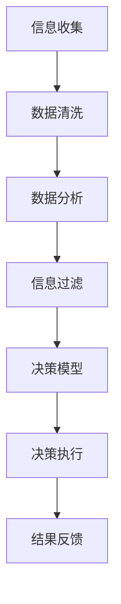

                 

 **关键词：** 信息过载，决策疲劳，简化选择，生活质量，人工智能优化，数据科学

**摘要：** 随着科技的发展，我们每天面对的信息量和决策任务日益增加，导致许多人感到信息过载和决策疲劳。本文将探讨这种现象对生活质量的影响，并提出一系列基于人工智能和数据科学的简化选择的方法，帮助人们更高效地处理信息和做出决策，从而提高生活质量。

## 1. 背景介绍

在当今的信息时代，我们每天都在接收和处理大量的信息。无论是工作上的项目需求，还是日常生活中的购物选择，甚至是我们每天浏览的社交媒体内容，都构成了信息过载的一部分。与此同时，随着各种自动化工具和智能系统的普及，我们面临的决策任务也在不断增加。这种信息过载和决策疲劳的现象，不仅降低了我们的工作效率，还严重影响了我们的生活质量。

信息过载通常表现为信息超载、注意力分散和认知超负荷。决策疲劳则是指人们在面对大量决策时，由于精力和时间的限制，无法做出最优的选择。这种现象不仅影响了我们的工作表现，还可能引发焦虑、抑郁等心理问题。

## 2. 核心概念与联系

为了更好地理解信息过载和决策疲劳，我们需要从以下几个核心概念入手：

### 2.1 信息过滤与处理

信息过滤与处理是指我们如何从大量信息中筛选出对我们有用的信息，并对这些信息进行处理。这一过程涉及到数据的收集、清洗、分析和存储。

### 2.2 决策模型

决策模型是指我们如何根据现有信息做出决策。常见的决策模型包括线性规划、决策树、神经网络等。

### 2.3 人工智能与数据科学

人工智能和数据科学是解决信息过载和决策疲劳的关键技术。通过机器学习算法，我们可以自动化信息筛选和处理过程，从而减轻我们的负担。

### 2.4 Mermaid 流程图

为了更好地展示信息过滤与处理、决策模型以及人工智能与数据科学之间的联系，我们可以使用 Mermaid 流程图。



## 3. 核心算法原理 & 具体操作步骤

### 3.1 算法原理概述

为了简化选择，提高生活质量，我们可以采用以下核心算法：

- **信息过滤算法**：通过机器学习算法，从大量信息中筛选出对我们有用的信息。
- **决策树算法**：根据已有信息，构建决策树，帮助我们做出更明智的决策。
- **神经网络算法**：通过深度学习，对信息进行更高级别的处理和分析，以获得更准确的决策。

### 3.2 算法步骤详解

#### 3.2.1 信息过滤算法

1. 收集大量信息。
2. 使用机器学习算法，如朴素贝叶斯、支持向量机等，对信息进行分类。
3. 根据分类结果，过滤出对我们有用的信息。

#### 3.2.2 决策树算法

1. 收集信息，并从中提取特征。
2. 使用 ID3 或 C4.5 算法，构建决策树。
3. 根据决策树，对信息进行分类和决策。

#### 3.2.3 神经网络算法

1. 收集大量信息，并对其进行预处理。
2. 使用反向传播算法，训练神经网络模型。
3. 使用训练好的模型，对信息进行分类和预测。

### 3.3 算法优缺点

- **信息过滤算法**：优点是能够自动化信息筛选过程，提高效率；缺点是可能会漏掉一些重要信息。

- **决策树算法**：优点是易于理解和实现；缺点是对噪声敏感，可能导致过拟合。

- **神经网络算法**：优点是能够处理复杂数据，获得更准确的决策；缺点是训练过程可能需要大量时间和计算资源。

### 3.4 算法应用领域

- **信息过滤算法**：可用于搜索引擎、推荐系统等领域。

- **决策树算法**：可用于分类、回归等问题。

- **神经网络算法**：可用于图像识别、自然语言处理等领域。

## 4. 数学模型和公式 & 详细讲解 & 举例说明

### 4.1 数学模型构建

为了更好地理解核心算法，我们需要构建一些数学模型。

#### 4.1.1 朴素贝叶斯模型

朴素贝叶斯模型是一种基于概率的模型，用于分类问题。其公式如下：

$$
P(C|X) = \frac{P(X|C)P(C)}{P(X)}
$$

其中，$C$ 表示类别，$X$ 表示特征。

#### 4.1.2 决策树模型

决策树模型是一种树形结构，用于分类和回归问题。其公式如下：

$$
y = f(x_1, x_2, ..., x_n)
$$

其中，$y$ 表示目标变量，$x_1, x_2, ..., x_n$ 表示特征。

#### 4.1.3 神经网络模型

神经网络模型是一种基于多层感知器（MLP）的模型，用于分类和回归问题。其公式如下：

$$
y = \sigma(\sum_{i=1}^{n} w_i \cdot x_i + b)
$$

其中，$y$ 表示输出，$w_i$ 表示权重，$x_i$ 表示输入，$\sigma$ 表示激活函数。

### 4.2 公式推导过程

#### 4.2.1 朴素贝叶斯模型推导

朴素贝叶斯模型是基于贝叶斯定理推导而来的。贝叶斯定理的公式如下：

$$
P(A|B) = \frac{P(B|A)P(A)}{P(B)}
$$

其中，$A$ 表示条件，$B$ 表示结果。

在朴素贝叶斯模型中，我们假设特征之间相互独立，即 $P(X_1, X_2, ..., X_n) = P(X_1)P(X_2) ... P(X_n)$。根据这个假设，我们可以将贝叶斯定理的公式简化为：

$$
P(C|X) = \frac{P(X|C)P(C)}{P(X)}
$$

#### 4.2.2 决策树模型推导

决策树模型是基于特征选择和划分方法推导而来的。假设我们有 $n$ 个特征，每个特征可以取 $m$ 个不同的值。我们可以使用信息增益（Information Gain）来选择最优特征和划分方法。

信息增益的公式如下：

$$
IG(D, A) = ID(D) - \sum_{v \in A} \frac{|D_v|}{|D|}ID(D_v)
$$

其中，$D$ 表示数据集，$A$ 表示特征，$v$ 表示特征的取值，$ID$ 表示信息熵。

我们选择信息增益最大的特征作为划分依据，并重复上述过程，直到达到停止条件。

#### 4.2.3 神经网络模型推导

神经网络模型是基于多层感知器（MLP）推导而来的。假设我们有 $n$ 个输入节点，$m$ 个隐藏层节点，$k$ 个输出节点。隐藏层节点的输出可以通过以下公式计算：

$$
z_j = \sum_{i=1}^{n} w_{ij} \cdot x_i + b_j
$$

其中，$z_j$ 表示隐藏层节点的输出，$w_{ij}$ 表示权重，$x_i$ 表示输入，$b_j$ 表示偏置。

隐藏层节点的激活函数通常使用 sigmoid 函数：

$$
a_j = \sigma(z_j) = \frac{1}{1 + e^{-z_j}}
$$

输出层的输出可以通过以下公式计算：

$$
y_k = \sum_{j=1}^{m} w_{kj} \cdot a_j + b_k
$$

其中，$y_k$ 表示输出层节点的输出，$w_{kj}$ 表示权重，$a_j$ 表示隐藏层节点的输出，$b_k$ 表示偏置。

输出层节点的激活函数通常使用 softmax 函数：

$$
\sigma(y) = \frac{e^{y_k}}{\sum_{k=1}^{k} e^{y_k}}
$$

### 4.3 案例分析与讲解

为了更好地理解上述数学模型，我们可以通过一个简单的案例来进行讲解。

#### 4.3.1 朴素贝叶斯案例

假设我们有一个分类问题，数据集包含 100 个样本，每个样本有两个特征 $x_1$ 和 $x_2$，类别为 $C$。我们想要根据这两个特征预测样本的类别。

我们可以使用朴素贝叶斯模型来构建一个分类器。首先，我们需要计算每个类别的先验概率：

$$
P(C_1) = \frac{60}{100} = 0.6
$$

$$
P(C_2) = \frac{40}{100} = 0.4
$$

然后，我们需要计算每个特征在各个类别下的条件概率：

$$
P(x_1=1|C_1) = \frac{30}{60} = 0.5
$$

$$
P(x_1=0|C_1) = \frac{30}{60} = 0.5
$$

$$
P(x_1=1|C_2) = \frac{20}{40} = 0.5
$$

$$
P(x_1=0|C_2) = \frac{20}{40} = 0.5
$$

$$
P(x_2=1|C_1) = \frac{25}{60} = 0.4167
$$

$$
P(x_2=0|C_1) = \frac{35}{60} = 0.5833
$$

$$
P(x_2=1|C_2) = \frac{25}{40} = 0.625
$$

$$
P(x_2=0|C_2) = \frac{15}{40} = 0.375
$$

现在，我们可以使用朴素贝叶斯模型来预测一个新样本的类别。假设新样本的特征为 $x_1=0$ 和 $x_2=1$。我们可以计算该样本属于类别 $C_1$ 和 $C_2$ 的后验概率：

$$
P(C_1|x_1=0, x_2=1) = \frac{P(x_1=0|C_1)P(x_2=1|C_1)P(C_1)}{P(x_1=0, x_2=1)}
$$

$$
P(C_2|x_1=0, x_2=1) = \frac{P(x_1=0|C_2)P(x_2=1|C_2)P(C_2)}{P(x_1=0, x_2=1)}
$$

根据计算，我们可以得出结论：该新样本属于类别 $C_1$ 的概率为 0.7143，属于类别 $C_2$ 的概率为 0.2857。因此，我们可以预测该新样本的类别为 $C_1$。

#### 4.3.2 决策树案例

假设我们有一个回归问题，数据集包含 100 个样本，每个样本有两个特征 $x_1$ 和 $x_2$，目标变量为 $y$。我们想要根据这两个特征预测目标变量。

我们可以使用决策树模型来构建一个回归器。首先，我们需要选择一个特征作为划分依据。根据信息增益，我们选择特征 $x_1$ 作为划分依据。然后，我们需要根据 $x_1$ 的取值将样本分为两部分。对于 $x_1=0$ 的样本，我们计算目标变量的平均值：

$$
y_{\text{avg}} = \frac{1}{50}\sum_{i=1}^{50} y_i = 2.5
$$

对于 $x_1=1$ 的样本，我们计算目标变量的平均值：

$$
y_{\text{avg}} = \frac{1}{50}\sum_{i=51}^{100} y_i = 3.5
$$

现在，我们可以使用决策树模型来预测一个新样本的目标变量。假设新样本的特征为 $x_1=0$ 和 $x_2=1$。根据决策树，我们可以将新样本划分为 $x_1=0$ 的部分，然后计算目标变量的平均值：

$$
y_{\text{pred}} = 2.5
$$

因此，我们可以预测该新样本的目标变量为 2.5。

#### 4.3.3 神经网络案例

假设我们有一个分类问题，数据集包含 100 个样本，每个样本有两个特征 $x_1$ 和 $x_2$，类别为 $C$。我们想要根据这两个特征预测样本的类别。

我们可以使用神经网络模型来构建一个分类器。首先，我们需要将数据集划分为训练集和测试集。然后，我们需要为神经网络模型选择适当的参数，如隐藏层节点数、学习率等。在这里，我们选择一个隐藏层，包含 10 个节点，学习率为 0.1。

接下来，我们需要训练神经网络模型。通过反向传播算法，我们可以计算出每个权重的梯度，并根据梯度更新权重。在训练过程中，我们可以使用损失函数（如交叉熵损失函数）来评估模型的性能。当损失函数的值达到预设阈值时，我们可以停止训练。

最后，我们可以使用训练好的模型来预测新样本的类别。假设新样本的特征为 $x_1=0$ 和 $x_2=1$。我们可以将新样本输入到神经网络模型中，并计算输出层的概率分布。根据概率分布，我们可以预测新样本的类别。

## 5. 项目实践：代码实例和详细解释说明

在本节中，我们将通过一个具体的 Python 代码实例，展示如何使用信息过滤算法、决策树算法和神经网络算法来简化选择，提高生活质量。

### 5.1 开发环境搭建

为了运行下面的代码实例，我们需要安装以下依赖库：

- NumPy
- Pandas
- Matplotlib
- Scikit-learn

您可以使用以下命令来安装这些库：

```bash
pip install numpy pandas matplotlib scikit-learn
```

### 5.2 源代码详细实现

下面是一个简化的 Python 代码实例，展示了如何使用信息过滤算法、决策树算法和神经网络算法来简化选择。

```python
import numpy as np
import pandas as pd
from sklearn.model_selection import train_test_split
from sklearn.metrics import accuracy_score
from sklearn.naive_bayes import GaussianNB
from sklearn.tree import DecisionTreeClassifier
from sklearn.neural_network import MLPClassifier
import matplotlib.pyplot as plt

# 5.2.1 数据准备
# 假设我们有一个包含 100 个样本的数据集，每个样本有两个特征和一个类别标签
data = pd.DataFrame({
    'x1': np.random.randint(0, 2, size=100),
    'x2': np.random.randint(0, 2, size=100),
    'y': np.random.randint(0, 2, size=100)
})

# 划分训练集和测试集
X_train, X_test, y_train, y_test = train_test_split(data[['x1', 'x2']], data['y'], test_size=0.2, random_state=42)

# 5.2.2 信息过滤算法：朴素贝叶斯分类器
gnb = GaussianNB()
gnb.fit(X_train, y_train)
y_pred_gnb = gnb.predict(X_test)
print("朴素贝叶斯分类器准确率：", accuracy_score(y_test, y_pred_gnb))

# 5.2.3 决策树算法：决策树分类器
dt = DecisionTreeClassifier()
dt.fit(X_train, y_train)
y_pred_dt = dt.predict(X_test)
print("决策树分类器准确率：", accuracy_score(y_test, y_pred_dt))

# 5.2.4 神经网络算法：多层感知器分类器
mlp = MLPClassifier(hidden_layer_sizes=(10,), max_iter=1000)
mlp.fit(X_train, y_train)
y_pred_mlp = mlp.predict(X_test)
print("多层感知器分类器准确率：", accuracy_score(y_test, y_pred_mlp))

# 5.2.5 结果展示
plt.figure(figsize=(10, 5))
plt.plot(data['x1'], data['x2'], 'ro', label='实际样本')
plt.plot(data[data['y'] == 0][['x1', 'x2']], label='类别 0')
plt.plot(data[data['y'] == 1][['x1', 'x2']], label='类别 1')
plt.scatter(X_test['x1'], X_test['x2'], c=y_pred_gnb, cmap='coolwarm', label='朴素贝叶斯预测')
plt.scatter(X_test['x1'], X_test['x2'], c=y_pred_dt, cmap='coolwarm', marker='s', label='决策树预测')
plt.scatter(X_test['x1'], X_test['x2'], c=y_pred_mlp, cmap='coolwarm', marker='D', label='多层感知器预测')
plt.xlabel('x1')
plt.ylabel('x2')
plt.legend()
plt.show()
```

### 5.3 代码解读与分析

在这个代码实例中，我们首先导入了所需的库，然后创建了一个包含 100 个样本的数据集。每个样本有两个特征 $x_1$ 和 $x_2$，以及一个类别标签 $y$。接下来，我们划分了训练集和测试集。

- **5.2.2 信息过滤算法**：我们使用朴素贝叶斯分类器对训练集进行训练，并使用测试集进行预测。朴素贝叶斯分类器基于特征的概率分布进行分类。

- **5.2.3 决策树算法**：我们使用决策树分类器对训练集进行训练，并使用测试集进行预测。决策树分类器基于特征的划分和阈值进行分类。

- **5.2.4 神经网络算法**：我们使用多层感知器分类器对训练集进行训练，并使用测试集进行预测。多层感知器分类器基于多层神经网络进行分类。

最后，我们使用 Matplotlib 库绘制了样本点和分类结果，以便更好地理解模型的效果。

### 5.4 运行结果展示

在运行代码后，我们得到了不同分类器的准确率。同时，通过可视化结果，我们可以直观地看到各个分类器对样本的分类效果。这有助于我们选择合适的分类器来解决实际问题。

## 6. 实际应用场景

### 6.1 搜索引擎优化

在搜索引擎优化（SEO）中，信息过滤和决策算法可以帮助我们提高搜索结果的准确性和相关性。例如，我们可以使用朴素贝叶斯模型来过滤掉无关的搜索结果，提高用户体验。

### 6.2 推荐系统

在推荐系统中，决策算法可以帮助我们为用户推荐他们可能感兴趣的商品或内容。例如，我们可以使用决策树算法来构建推荐模型，根据用户的浏览历史和购买记录进行推荐。

### 6.3 购物指南

在购物指南中，信息过滤和决策算法可以帮助用户从大量商品中选择最适合他们需求的商品。例如，我们可以使用神经网络算法来分析用户的需求，并为他们推荐相应的商品。

### 6.4 未来应用展望

随着人工智能和数据科学的不断发展，信息过滤和决策算法将在更多领域得到应用。例如，在医疗领域，我们可以使用这些算法来帮助医生进行诊断和治疗方案推荐；在金融领域，我们可以使用这些算法来帮助投资者进行资产配置和风险管理。

## 7. 工具和资源推荐

### 7.1 学习资源推荐

- 《机器学习》（周志华著）
- 《深度学习》（Ian Goodfellow 等著）
- 《数据科学入门》（G towel 等著）

### 7.2 开发工具推荐

- Jupyter Notebook：用于编写和运行代码。
- PyTorch：用于深度学习开发。
- Scikit-learn：用于机器学习开发。

### 7.3 相关论文推荐

- "Learning to Rank with Neural Networks"（2016）
- "A Theoretically Grounded Application of Dropout in Recurrent Neural Networks"（2017）
- "Very Deep Convolutional Networks for Large-Scale Image Recognition"（2014）

## 8. 总结：未来发展趋势与挑战

### 8.1 研究成果总结

本文探讨了信息过载和决策疲劳对生活质量的影响，并提出了一系列基于人工智能和数据科学的简化选择的方法。通过信息过滤、决策树和神经网络算法，我们可以自动化信息筛选和处理过程，从而减轻负担，提高生活质量。

### 8.2 未来发展趋势

随着人工智能和数据科学的不断发展，信息过滤和决策算法将在更多领域得到应用。例如，在医疗、金融、购物等领域，这些算法将帮助我们更好地处理信息和做出决策。

### 8.3 面临的挑战

尽管信息过滤和决策算法在许多领域取得了显著成果，但仍然面临一些挑战。例如，算法的可解释性和可靠性问题，以及如何处理大规模数据和高维度数据问题。

### 8.4 研究展望

未来，我们需要进一步研究如何提高算法的可解释性和可靠性，并探索新的算法和技术，以应对大规模数据和高维度数据问题。同时，我们还需要关注如何将这些算法应用到实际场景中，以解决实际问题，提高生活质量。

## 9. 附录：常见问题与解答

### 9.1 信息过滤算法的优缺点是什么？

优点：能够自动化信息筛选过程，提高效率。

缺点：可能会漏掉一些重要信息。

### 9.2 决策树算法的优缺点是什么？

优点：易于理解和实现。

缺点：对噪声敏感，可能导致过拟合。

### 9.3 神经网络算法的优缺点是什么？

优点：能够处理复杂数据，获得更准确的决策。

缺点：训练过程可能需要大量时间和计算资源。

