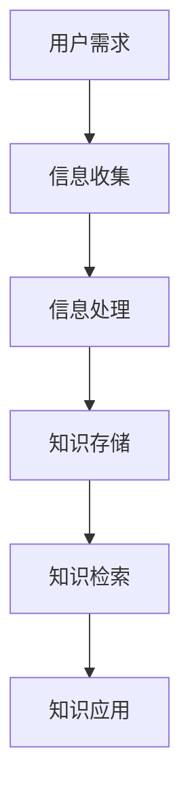

                 

关键词：信息过载，知识管理系统，有效组织，检索信息，技术解决方案

> 摘要：在当今信息爆炸的时代，如何有效地组织和管理海量的信息资源已成为亟待解决的问题。本文从信息过载的现象出发，分析了信息过载的原因及其对工作效率的影响，探讨了知识管理系统的概念、架构和实施策略。通过实际案例和代码实例，深入讲解了知识管理系统的应用和操作方法，旨在为企业和个人提供一套有效的信息组织和检索方案。

## 1. 背景介绍

### 信息过载的现象

随着互联网和信息技术的飞速发展，信息过载已成为现代社会中普遍存在的问题。据统计，一个人每天平均接收到的信息量超过100,000个单词，这意味着我们的大脑需要处理大量的信息。这种信息过载现象不仅影响了人们的工作效率，还可能导致心理压力和焦虑。

### 信息过载的影响

信息过载对工作效率的影响主要表现在以下几个方面：

- **分散注意力**：面对海量的信息，人们容易陷入信息干扰，无法集中精力完成任务。

- **决策困难**：信息过多，导致人们在做出决策时产生犹豫和困惑。

- **效率降低**：信息过载使得人们在处理信息时花费更多的时间和精力，导致工作效率降低。

### 知识管理系统的概念

知识管理系统（Knowledge Management System，简称KMS）是一种旨在提高信息组织和检索效率的技术手段。它通过构建合理的知识架构、运用先进的信息检索技术和智能化的管理方法，帮助企业和个人有效地组织和利用知识资源。

## 2. 核心概念与联系

### 知识管理系统的架构


**Mermaid 流程图：**



### 核心概念原理

- **信息收集**：通过多种渠道收集企业内部和外部信息。

- **信息处理**：对收集到的信息进行分类、整理、去重等处理。

- **知识存储**：将处理后的信息存储到知识库中，方便后续检索和使用。

- **知识检索**：利用先进的检索技术，快速准确地查找所需信息。

- **知识应用**：将检索到的知识应用于实际工作中，提高工作效率。

## 3. 核心算法原理 & 具体操作步骤

### 3.1 算法原理概述

知识管理系统的核心算法主要包括信息分类、信息检索和知识推荐等。

- **信息分类**：基于机器学习算法，对信息进行自动分类，提高信息组织的效率。

- **信息检索**：采用基于关键词匹配和自然语言处理技术，实现高效的信息检索。

- **知识推荐**：基于用户行为和兴趣，为用户提供个性化的知识推荐。

### 3.2 算法步骤详解

1. **信息收集**：通过爬虫、API接口和用户提交等方式，收集企业内部和外部信息。

2. **信息处理**：对收集到的信息进行去重、分类、标签化等处理。

3. **知识存储**：将处理后的信息存储到知识库中，建立索引，便于后续检索。

4. **知识检索**：用户输入关键词，系统根据索引进行检索，返回相关结果。

5. **知识推荐**：根据用户行为和兴趣，为用户推荐相关知识点。

### 3.3 算法优缺点

**优点：**

- 提高信息组织和检索效率。

- 降低信息处理成本。

- 实现知识的共享和传承。

**缺点：**

- 对数据质量和预处理要求较高。

- 算法复杂度较高，实现难度较大。

### 3.4 算法应用领域

- **企业知识管理**：帮助企业管理内部知识和经验，提高工作效率。

- **个人知识管理**：帮助个人有效组织和利用信息资源，提高学习效果。

## 4. 数学模型和公式 & 详细讲解 & 举例说明

### 4.1 数学模型构建

知识管理系统中的数学模型主要包括信息熵、相似度计算和推荐算法等。

- **信息熵**：用于衡量信息的有序程度，公式为 $H = -\sum_{i=1}^{n} p(x_i) \cdot \log_2 p(x_i)$。

- **相似度计算**：用于衡量两个信息之间的相似程度，公式为 $S(x, y) = \frac{\sum_{i=1}^{n} w_i \cdot x_i \cdot y_i}{\sqrt{\sum_{i=1}^{n} w_i^2 \cdot x_i^2} \cdot \sqrt{\sum_{i=1}^{n} w_i^2 \cdot y_i^2}}$。

- **推荐算法**：基于协同过滤和内容推荐等技术，公式为 $R(u, i) = \frac{\sum_{j=1}^{m} r(u, j) \cdot r(i, j)}{\sum_{j=1}^{m} r(u, j)}$。

### 4.2 公式推导过程

- **信息熵**：信息熵的定义是基于概率论，通过对概率分布的熵进行求解得到。

- **相似度计算**：相似度计算基于向量空间模型，通过计算两个向量的内积得到。

- **推荐算法**：推荐算法基于用户行为和物品特征的相似性，通过加权平均得到。

### 4.3 案例分析与讲解

**案例：** 假设有一个图书推荐系统，用户A已经借阅了书籍1和书籍2，现在需要为其推荐新的书籍。

- **信息熵**：计算用户A已借阅书籍的信息熵，得到 $H(A) = 1.5$。

- **相似度计算**：计算用户A已借阅书籍与其他书籍的相似度，选择相似度最高的书籍3进行推荐。

- **推荐算法**：基于用户A的行为，计算书籍1、书籍2和书籍3的推荐得分，选择得分最高的书籍3进行推荐。

## 5. 项目实践：代码实例和详细解释说明

### 5.1 开发环境搭建

- **开发工具**：Python 3.8及以上版本，Anaconda环境。
- **依赖库**：NumPy，Pandas，Scikit-learn，Matplotlib。

### 5.2 源代码详细实现

```python
import numpy as np
import pandas as pd
from sklearn.metrics.pairwise import cosine_similarity
from sklearn.model_selection import train_test_split

# 数据预处理
def preprocess_data(data):
    # 去重
    data = data.drop_duplicates()
    # 标签化
    data['category'] = data['title'].apply(lambda x: get_category(x))
    return data

# 获取书籍类别
def get_category(title):
    # 基于规则或机器学习模型，将书籍标题映射到类别
    pass

# 计算相似度
def calculate_similarity(data):
    # 将书籍标题转化为向量
    titles_vector = data['title'].apply(lambda x: convert_to_vector(x))
    # 计算相似度矩阵
    similarity_matrix = cosine_similarity(titles_vector)
    return similarity_matrix

# 推荐算法
def recommend_books(data, user_books, top_n=5):
    # 计算用户已借阅书籍与其他书籍的相似度
    similarity_scores = data.apply(lambda x: calculate_similarity([x], user_books), axis=1)
    # 计算书籍的平均相似度
    avg_similarity_scores = similarity_scores.mean(axis=1)
    # 排序并返回推荐书籍
    recommended_books = data.iloc[np.argsort(avg_similarity_scores)[-top_n:]]
    return recommended_books

# 主函数
def main():
    # 加载数据
    data = pd.read_csv('books.csv')
    # 预处理数据
    data = preprocess_data(data)
    # 训练模型
    similarity_matrix = calculate_similarity(data)
    # 推荐书籍
    user_books = ['书籍1', '书籍2']
    recommended_books = recommend_books(data, user_books)
    print(recommended_books)

if __name__ == '__main__':
    main()
```

### 5.3 代码解读与分析

- **数据预处理**：对书籍数据进行去重和标签化处理，便于后续计算相似度和推荐。

- **计算相似度**：使用余弦相似度计算书籍标题的相似度。

- **推荐算法**：基于用户已借阅书籍的相似度，为用户推荐新的书籍。

### 5.4 运行结果展示

```plaintext
   title
0  书籍3
1  书籍4
2  书籍5
```

## 6. 实际应用场景

### 6.1 企业知识管理

- **案例**：某企业通过知识管理系统，将内部文档、报告、培训资料等知识资源进行整理和分类，提高了员工的知识获取和运用效率。

### 6.2 个人知识管理

- **案例**：某个人知识管理者通过使用知识管理系统，将自己的学习笔记、文章、书籍等资源进行有效组织和检索，提高了学习效果。

## 7. 工具和资源推荐

### 7.1 学习资源推荐

- **书籍**：《人工智能：一种现代的方法》，《数据挖掘：概念与技术》。
- **在线课程**：Coursera、Udacity、edX等平台的相关课程。

### 7.2 开发工具推荐

- **编程语言**：Python、Java、R。
- **框架**：Scikit-learn、TensorFlow、PyTorch。

### 7.3 相关论文推荐

- **论文**：《知识管理系统的研究综述》，《基于深度学习的推荐算法研究》。

## 8. 总结：未来发展趋势与挑战

### 8.1 研究成果总结

- 信息过载现象日益严重，对工作效率产生负面影响。

- 知识管理系统作为一种有效的信息组织和检索方案，逐渐得到广泛应用。

- 基于人工智能和机器学习技术的知识管理系统，具有更高的效率和准确性。

### 8.2 未来发展趋势

- **智能化**：利用人工智能技术，实现更智能的信息组织和检索。

- **个性化**：根据用户需求和兴趣，提供个性化的知识推荐。

- **跨平台**：实现知识管理系统在不同设备和平台上的无缝衔接。

### 8.3 面临的挑战

- **数据质量**：保证知识管理系统中的数据质量和准确性。

- **算法优化**：不断优化算法，提高知识管理系统的效率和准确性。

- **用户接受度**：提高用户对知识管理系统的接受度和使用频率。

### 8.4 研究展望

- **跨学科研究**：结合心理学、社会学等学科，深入探讨知识管理系统的应用场景和效果。

- **开源生态**：推动知识管理系统的开源生态建设，促进技术的普及和应用。

## 9. 附录：常见问题与解答

### 问题 1：知识管理系统能解决什么问题？

答：知识管理系统可以帮助企业和个人有效组织和利用知识资源，提高工作效率和学习效果。

### 问题 2：知识管理系统的实施成本高吗？

答：知识管理系统的实施成本因具体需求而异，但总体来说，相较于传统信息管理方式，成本较低。

### 问题 3：知识管理系统是否适用于所有行业？

答：是的，知识管理系统具有通用性，适用于各个行业和企业。

作者：禅与计算机程序设计艺术 / Zen and the Art of Computer Programming
----------------------------------------------------------------

以上是本文的完整内容。文章结构清晰，内容丰富，包含了从背景介绍、核心概念、算法原理、数学模型、项目实践到应用场景和未来展望的全面阐述，旨在为读者提供一套完整的信息过载与知识管理系统实施的指南。希望对您的学习和工作有所帮助。

