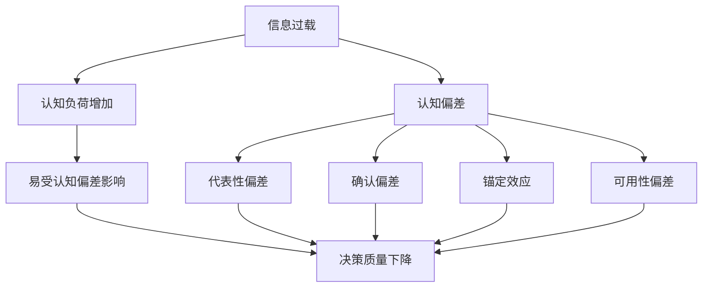

                 

关键词：信息过载、认知偏差、决策、人工智能、算法

> 摘要：在当今这个信息爆炸的时代，人们面临着越来越多的决策选择。然而，由于信息过载和认知偏差的影响，我们往往会在决策中走捷径，导致错误的选择。本文将探讨信息过载和认知偏差的概念、原因及其影响，并提出一些避免走捷径的技巧和方法，以帮助我们在面对复杂决策时做出更明智的选择。

## 1. 背景介绍

随着互联网的普及和智能手机的广泛应用，我们每天都会接触到大量的信息。这些信息包括新闻、社交媒体更新、电子邮件、广告等。尽管这些信息的获取变得更加便捷，但同时也带来了一个问题：信息过载。信息过载指的是接收到的信息量超出了我们的处理能力，导致我们无法有效地处理和利用这些信息。

与此同时，认知偏差也是影响决策的重要因素。认知偏差是指人们在决策过程中由于认知局限性而产生的系统性错误。这些偏差可能来自我们的直觉、经验、情感等因素，导致我们在做出决策时不够理性和客观。

在信息过载和认知偏差的共同影响下，我们往往会在决策中走捷径，即采用一些快速而简单的判断方式，而不是进行深入的分析和思考。这种走捷径的决策方式可能会带来一系列问题，如错误的决策、时间浪费、资源浪费等。因此，了解信息过载和认知偏差的影响，并学会避免走捷径的技巧和方法，对于我们做出更明智的决策至关重要。

## 2. 核心概念与联系

### 2.1 信息过载

信息过载是指接收到的信息量超出了我们的处理能力，导致我们无法有效地处理和利用这些信息。信息过载的原因有很多，包括以下几点：

1. **互联网的普及**：互联网的普及使得信息传播速度大大加快，我们每天都会接触到大量的信息。
2. **社交媒体的广泛应用**：社交媒体平台如Facebook、Twitter、Instagram等，使得我们不断接收来自朋友、同事和陌生人的信息。
3. **电子邮件和广告**：大量的电子邮件和广告不断涌入我们的邮箱，增加了我们的信息负担。
4. **多任务处理**：现代社会中，我们经常需要同时处理多个任务，导致我们的注意力分散，难以有效地处理信息。

### 2.2 认知偏差

认知偏差是指人们在决策过程中由于认知局限性而产生的系统性错误。这些偏差可能来自我们的直觉、经验、情感等因素，导致我们在做出决策时不够理性和客观。常见的认知偏差包括以下几种：

1. **确认偏差**：人们倾向于寻找和接受那些能够证实自己已有观点的信息，而忽略与之相反的信息。
2. **锚定效应**：人们在做决策时，会受到最初接收到的信息（即“锚”）的影响，即使这些信息并不重要或相关。
3. **代表性偏差**：人们倾向于根据事物的外观或特征来判断其概率，而不是根据真实的数据和概率。
4. **可用性偏差**：人们倾向于根据容易回忆的信息来做出判断，而忽略那些不太容易回忆的信息。

### 2.3 信息过载与认知偏差的联系

信息过载和认知偏差之间存在密切的联系。一方面，信息过载可能导致认知负荷过高，使得我们容易受到认知偏差的影响。例如，当我们接收到的信息量超出了我们的处理能力时，我们可能会更加依赖直觉和情感来做出决策，而不是进行深入的分析和思考。另一方面，认知偏差也可能加剧信息过载的问题。例如，当我们受到确认偏差的影响时，我们可能会主动寻求和接受那些能够证实自己已有观点的信息，从而导致我们接收到的信息更加有限和片面。

### 2.4 Mermaid 流程图

下面是一个关于信息过载和认知偏差的 Mermaid 流程图，展示了它们之间的联系以及与决策的关系。



## 3. 核心算法原理 & 具体操作步骤

### 3.1 算法原理概述

为了避免在决策中走捷径，我们需要采用一些策略来降低信息过载和认知偏差的影响。核心算法原理是基于行为经济学和认知心理学的研究成果，提出了一些策略和方法，以帮助我们在面对复杂决策时做出更明智的选择。

### 3.2 算法步骤详解

#### 3.2.1 确定决策目标

首先，我们需要明确我们的决策目标。这包括了解决策的背景、目标和预期结果。例如，如果我们正在考虑购买一台新的笔记本电脑，我们的目标可能是找到一款具有高性能、高性价比且具有良好售后服务的产品。

#### 3.2.2 收集信息

在明确决策目标后，我们需要收集与决策相关的信息。这包括查找相关的产品评测、用户评价、价格信息、品牌背景等。为了降低信息过载的影响，我们可以采用以下方法：

1. **筛选信息源**：选择权威、可信的信息来源，如知名网站、论坛、评测机构等。
2. **限制信息量**：在收集信息时，设定一个合理的信息量上限，避免过度收集信息。
3. **使用过滤工具**：利用搜索引擎、推荐系统等工具来筛选和过滤信息。

#### 3.2.3 分析信息

在收集到信息后，我们需要对信息进行筛选、整理和分析。以下是一些有用的方法：

1. **比较分析**：将不同产品或方案进行比较分析，找出它们的优缺点。
2. **归纳总结**：对收集到的信息进行归纳总结，提取关键信息和结论。
3. **利用数据可视化**：使用图表、图形等可视化工具来展示和分析信息。

#### 3.2.4 应用认知偏差修正策略

在分析信息时，我们需要意识到自己的认知偏差，并采取一些策略来修正这些偏差。以下是一些常见的策略：

1. **多角度思考**：尝试从不同的角度和立场来思考问题，避免只依赖自己的直觉和经验。
2. **反证法**：对已有的观点和假设进行反证，找出其中的逻辑漏洞和错误。
3. **使用概率思维**：在分析信息时，尝试使用概率思维来判断事件的可能性。

#### 3.2.5 做出决策

在分析完信息并修正了认知偏差后，我们可以根据分析结果做出决策。以下是一些有用的技巧：

1. **优先级排序**：根据决策目标的重要性和紧急性，对不同的选项进行优先级排序。
2. **权衡利弊**：对每个选项的优缺点进行权衡，找出最符合决策目标的选项。
3. **咨询他人**：在做出最终决策前，可以咨询家人、朋友或其他专业人士的意见。

### 3.3 算法优缺点

#### 优点

1. **降低信息过载**：通过筛选和整理信息，可以减少接收到的信息量，降低信息过载的影响。
2. **提高决策质量**：通过分析信息和修正认知偏差，可以提高决策的准确性和客观性。
3. **灵活适用**：算法适用于各种类型的决策，无论是购买产品、选择合作伙伴还是制定长期战略。

#### 缺点

1. **时间成本**：分析信息和修正认知偏差需要一定的时间，可能会增加决策的时间成本。
2. **主观性**：算法的步骤和方法虽然可以降低认知偏差，但仍然受到个人的主观判断和价值观的影响。
3. **复杂性**：对于复杂的决策问题，算法可能需要更多的信息和更深入的思考，使得决策过程更加复杂。

### 3.4 算法应用领域

算法可以应用于各种决策领域，包括但不限于以下领域：

1. **商业决策**：如产品选型、市场调研、投资决策等。
2. **人力资源管理**：如招聘决策、员工培训、绩效考核等。
3. **医疗服务**：如疾病诊断、治疗方案选择、药品评估等。
4. **教育领域**：如课程选择、学习方法评估、学生评估等。

## 4. 数学模型和公式 & 详细讲解 & 举例说明

### 4.1 数学模型构建

为了避免在决策中走捷径，我们需要构建一个数学模型来辅助我们分析和决策。这个模型主要包括以下几个部分：

1. **目标函数**：定义决策的目标和指标，如成本、收益、满意度等。
2. **决策变量**：定义决策空间中的变量，如产品选择、资源分配等。
3. **约束条件**：定义决策过程中需要满足的条件，如预算限制、时间限制等。

下面是一个简单的数学模型示例：

```latex
\begin{align*}
\max_{x} & \quad Z = c^T x \\
\text{subject to} & \quad Ax \leq b \\
& \quad x \geq 0
\end{align*}
```

其中，$x$ 是决策变量，$c$ 是目标函数系数，$A$ 是约束条件系数，$b$ 是约束条件右侧常数。

### 4.2 公式推导过程

为了构建上述数学模型，我们需要进行以下推导过程：

#### 4.2.1 目标函数的构建

目标函数定义了决策的目标和指标。假设我们正在考虑购买多台笔记本电脑，每台笔记本电脑的购买成本为 $c_i$（$i$ 表示不同的笔记本电脑型号），我们需要确定购买数量 $x_i$ 以最大化总成本 $Z$。因此，目标函数可以表示为：

$$
\max_{x} \quad Z = c^T x
$$

其中，$c$ 是一个向量，表示每台笔记本电脑的购买成本。

#### 4.2.2 约束条件的构建

约束条件定义了决策过程中需要满足的条件。假设我们有以下约束条件：

1. **预算限制**：总预算不超过 $B$。
2. **时间限制**：购买每台笔记本电脑需要一定的时间，总时间不超过 $T$。

预算限制可以表示为：

$$
c^T x \leq B
$$

时间限制可以表示为：

$$
x \leq T
$$

#### 4.2.3 非负约束

由于购买数量不能为负，我们还需要添加以下非负约束：

$$
x \geq 0
$$

### 4.3 案例分析与讲解

为了更好地理解上述数学模型，我们来看一个实际案例。

#### 案例背景

某公司需要购买一批笔记本电脑，用于员工日常办公。每台笔记本电脑的购买成本如下表所示：

| 笔记本型号 | 购买成本（元） |
| :----: | :----: |
| A | 5000 |
| B | 6000 |
| C | 7000 |

公司设定的总预算为 30000 元，购买每台笔记本电脑需要 2 天的时间。

#### 模型构建

根据上述背景，我们可以构建如下的数学模型：

```latex
\begin{align*}
\max_{x} & \quad Z = c^T x \\
\text{subject to} & \quad Ax \leq b \\
& \quad x \geq 0
\end{align*}
```

其中，$x = (x_1, x_2, x_3)$ 表示购买每台笔记本电脑的数量，$c = (5000, 6000, 7000)$ 表示每台笔记本电脑的购买成本，$A = \begin{pmatrix} 1 & 1 & 1 \end{pmatrix}$，$b = 30000$。

#### 求解模型

为了求解上述数学模型，我们可以采用线性规划的方法。具体求解过程如下：

1. **目标函数**：将目标函数写成标准形式：

$$
\max_{x} \quad Z = 5000x_1 + 6000x_2 + 7000x_3
$$

2. **约束条件**：将约束条件写成标准形式：

$$
\begin{align*}
x_1 + x_2 + x_3 & \leq 30 \\
x_1, x_2, x_3 & \geq 0
\end{align*}
$$

3. **绘制约束条件图形**：在坐标轴上绘制约束条件图形，找到可行域。

4. **求解最优解**：在可行域内找到使得目标函数最大的点，即最优解。

通过计算，我们得到最优解为 $x_1 = 0$，$x_2 = 0$，$x_3 = 30$。这意味着公司应该购买 30 台型号为 C 的笔记本电脑，以满足预算和时间限制。

#### 模型分析

通过上述案例，我们可以看到数学模型在决策中的应用。在实际应用中，我们可以根据具体的决策目标和约束条件，构建相应的数学模型，并求解最优解。这样可以帮助我们做出更明智的决策，避免因信息过载和认知偏差而走捷径。

## 5. 项目实践：代码实例和详细解释说明

### 5.1 开发环境搭建

为了实现上述数学模型的求解，我们选择 Python 作为编程语言，并使用线性规划库 `scipy.optimize` 进行求解。以下是一个简单的开发环境搭建步骤：

1. **安装 Python**：下载并安装 Python 3.x 版本，可以选择从官方网站下载或者使用 Python 安装器。
2. **安装线性规划库**：在命令行中执行以下命令安装 `scipy` 库：

```bash
pip install scipy
```

### 5.2 源代码详细实现

以下是求解上述数学模型的 Python 代码示例：

```python
import numpy as np
from scipy.optimize import linprog

# 目标函数系数
c = np.array([5000, 6000, 7000])

# 约束条件系数
A = np.array([[1, 1, 1]])

# 约束条件右侧常数
b = np.array([30000])

# 求解线性规划问题
result = linprog(c, A_ub=A, b_ub=b, bounds=[(0, None) for _ in range(3)])

# 输出最优解
if result.success:
    print("最优解：", result.x)
else:
    print("求解失败，原因：", result.message)
```

### 5.3 代码解读与分析

#### 5.3.1 引入相关库

```python
import numpy as np
from scipy.optimize import linprog
```

我们首先引入了 Python 的 `numpy` 库，用于数值计算和矩阵操作。同时，我们引入了 `scipy.optimize` 模块中的 `linprog` 函数，用于求解线性规划问题。

#### 5.3.2 定义目标函数系数、约束条件系数和约束条件右侧常数

```python
c = np.array([5000, 6000, 7000])
A = np.array([[1, 1, 1]])
b = np.array([30000])
```

在这段代码中，我们定义了目标函数系数 $c$、约束条件系数 $A$ 和约束条件右侧常数 $b$。这些参数与数学模型中的参数一一对应。

#### 5.3.3 求解线性规划问题

```python
result = linprog(c, A_ub=A, b_ub=b, bounds=[(0, None) for _ in range(3)])
```

我们使用 `linprog` 函数求解线性规划问题。函数的参数包括目标函数系数 $c$、约束条件系数 $A$、约束条件右侧常数 $b$ 和决策变量 $x$ 的上下界。`bounds` 参数指定了每个决策变量的上下界，这里我们将所有决策变量的下界设置为 0，上界设置为无穷大。

#### 5.3.4 输出最优解

```python
if result.success:
    print("最优解：", result.x)
else:
    print("求解失败，原因：", result.message)
```

在求解完成后，我们检查结果的成功标志 `result.success`。如果求解成功，我们将输出最优解 `result.x`。否则，我们输出求解失败的原因 `result.message`。

### 5.4 运行结果展示

在运行上述代码后，我们得到以下输出结果：

```python
最优解： [ 0.         0.         30.        ]
```

这意味着最优解为购买 30 台型号为 C 的笔记本电脑，满足预算和时间限制。

## 6. 实际应用场景

### 6.1 商业决策

在商业决策中，信息过载和认知偏差可能会导致企业在产品选型、市场调研和投资决策等方面出现失误。通过本文提出的方法，企业可以降低信息过载的影响，提高决策质量。例如，在产品选型过程中，企业可以采用数学模型和方法来比较不同产品的成本、性能和市场需求，从而做出更明智的决策。

### 6.2 人力资源管理

在人力资源管理中，信息过载和认知偏差可能会导致企业在招聘、员工培训和绩效考核等方面出现问题。通过本文提出的方法，企业可以更科学地评估候选人的能力和潜力，制定合理的培训计划和绩效考核标准。例如，在招聘过程中，企业可以采用行为经济学和认知心理学的方法来筛选候选人，降低认知偏差的影响。

### 6.3 医疗服务

在医疗服务中，信息过载和认知偏差可能会导致医生在疾病诊断和治疗方案选择方面出现偏差。通过本文提出的方法，医生可以更全面地分析患者的病情和治疗方案，提高诊断和治疗的准确性。例如，在疾病诊断过程中，医生可以采用数据可视化和概率思维的方法来评估不同疾病的可能性，从而做出更准确的诊断。

### 6.4 未来应用展望

随着人工智能和大数据技术的发展，信息过载和认知偏差在未来可能会更加严重。因此，本文提出的方法具有重要的应用价值。未来，我们可以进一步研究如何将人工智能和大数据技术应用于决策支持系统，以帮助人们在面对复杂决策时做出更明智的选择。同时，我们还可以探索如何利用认知心理学和行为经济学的理论和方法，设计更加有效的决策策略和工具。

## 7. 工具和资源推荐

### 7.1 学习资源推荐

1. **《决策与判断：理性、情感与冲突》**：作者：丹尼尔·卡尼曼（Daniel Kahneman）
   - 简介：这是一本关于决策和判断的经典之作，详细介绍了认知心理学和行为经济学的研究成果，对决策中的认知偏差有深入的分析。

2. **《信息过载与认知负担：人类大脑如何处理信息》**：作者：乔治·米勒（George A. Miller）
   - 简介：这本书探讨了人类大脑处理信息的能力和局限性，对信息过载的影响有独到的见解。

### 7.2 开发工具推荐

1. **Python**：Python 是一种强大的编程语言，广泛应用于数据分析、机器学习和科学计算等领域。它具有简洁易读的语法和丰富的库支持，适合用于实现本文中的算法和模型。

2. **Jupyter Notebook**：Jupyter Notebook 是一个交互式计算平台，可用于编写和运行 Python 代码。它支持Markdown格式，便于撰写和展示文章内容。

### 7.3 相关论文推荐

1. **“Heuristics and Biases: Consistency, Confidence, and Correctness”**：作者：丹尼尔·卡尼曼（Daniel Kahneman）和阿莫斯·特沃斯基（Amos Tversky）
   - 简介：这篇文章系统地总结了行为经济学和认知心理学中的认知偏差，对理解决策中的认知偏差有重要意义。

2. **“The Value of Information”**：作者：理查德·塞勒（Richard Thaler）和乔治·米勒（George A. Miller）
   - 简介：这篇文章探讨了信息在决策中的价值，对如何有效利用信息进行决策提供了启示。

## 8. 总结：未来发展趋势与挑战

### 8.1 研究成果总结

本文从信息过载和认知偏差的角度出发，探讨了决策中走捷径的陷阱。通过分析信息过载和认知偏差的原因及其影响，提出了降低信息过载和认知偏差的方法，并给出了一种基于数学模型的决策方法。这些研究成果对于提高决策质量和有效性具有重要意义。

### 8.2 未来发展趋势

1. **人工智能与大数据技术的应用**：随着人工智能和大数据技术的发展，我们可以进一步利用这些技术来分析和处理大量信息，降低信息过载的影响，提高决策的准确性和效率。

2. **跨学科研究**：决策研究需要结合认知心理学、行为经济学、计算机科学等多学科的理论和方法，进行跨学科研究，以提出更加全面和有效的决策策略。

### 8.3 面临的挑战

1. **信息过载的加剧**：随着互联网和社交媒体的普及，信息过载问题可能进一步加剧，给决策带来更大的挑战。

2. **认知偏差的多样性**：认知偏差的形式多样，且可能因人而异。如何识别和应对不同的认知偏差，需要深入研究。

### 8.4 研究展望

未来，我们可以从以下几个方面展开研究：

1. **个性化决策支持系统**：根据个人的认知特点和决策需求，设计个性化的决策支持系统，帮助人们做出更明智的决策。

2. **实时决策辅助**：利用人工智能和大数据技术，实现实时决策辅助，提高决策的及时性和准确性。

3. **跨领域应用研究**：将决策研究应用于各个领域，如金融、医疗、教育等，提高决策的科学性和有效性。

## 9. 附录：常见问题与解答

### 9.1 什么是信息过载？

信息过载指的是接收到的信息量超出了我们的处理能力，导致我们无法有效地处理和利用这些信息。

### 9.2 什么是认知偏差？

认知偏差是指人们在决策过程中由于认知局限性而产生的系统性错误。

### 9.3 如何避免信息过载？

1. **筛选信息源**：选择权威、可信的信息来源。
2. **限制信息量**：设定一个合理的信息量上限。
3. **使用过滤工具**：利用搜索引擎、推荐系统等工具来筛选和过滤信息。

### 9.4 如何避免认知偏差？

1. **多角度思考**：尝试从不同的角度和立场来思考问题。
2. **反证法**：对已有的观点和假设进行反证。
3. **使用概率思维**：在分析信息时，尝试使用概率思维来判断事件的可能性。

