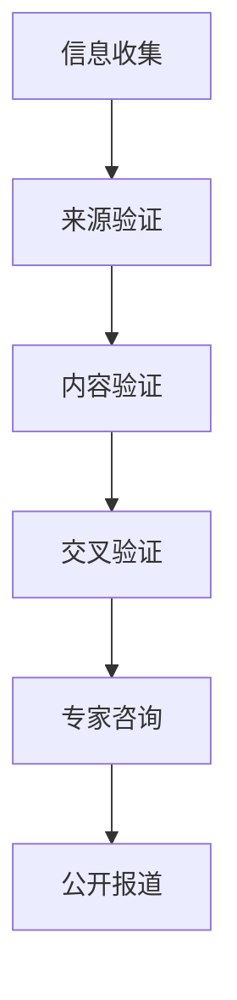

                 

关键词：信息验证，事实检查，假新闻，错误信息，时代导航，技术手段，数据挖掘，机器学习，人工智能，透明性，可信度评估，社交媒体，新闻媒体，用户行为分析

> 在今天这个信息爆炸的时代，如何从海量信息中辨别真伪，已经成为公众普遍关注的问题。信息验证和事实检查技术成为了抵御假新闻和错误信息的重要武器。本文将为您提供一份详尽的指南，帮助您在假新闻和错误信息泛滥的时代中导航。作者：禅与计算机程序设计艺术 / Zen and the Art of Computer Programming

## 1. 背景介绍

在互联网和社交媒体的快速发展下，信息的传播速度得到了前所未有的提升。虽然这一现象为人类带来了前所未有的便利，但同时也带来了严重的问题。假新闻、错误信息、误导性信息的传播，不仅损害了公众的利益，还可能对社会稳定造成威胁。根据《纽约时报》的一项研究，2020年虚假信息在社交媒体上的传播速度是真实信息的两倍，这使得信息验证和事实检查的任务变得愈发重要。

### 1.1 假新闻的定义和特点

假新闻（Fake News）是指那些被故意伪造、编造，旨在误导读者的信息。它们通常具有以下特点：

- **目的性**：制造假新闻的目的是为了获得经济利益、政治利益或社会影响力。
- **煽动性**：假新闻往往具有强烈的煽动性，以吸引读者的注意力。
- **可信度**：假新闻通常以真实信息为基础，通过微小的篡改或夸大其词来达到误导读者的目的。
- **传播迅速**：假新闻在社交媒体上可以迅速传播，甚至可以在几分钟内达到数百万人。

### 1.2 事实检查的定义和作用

事实检查（Fact-Checking）是一种验证信息真实性的活动，旨在发现和纠正虚假信息。事实检查的作用包括：

- **保护公众利益**：事实检查有助于公众避免受到虚假信息的误导，从而保护公众利益。
- **维护社会稳定**：虚假信息的传播可能会引发社会恐慌，影响社会稳定。事实检查有助于维护社会稳定。
- **提高媒体可信度**：通过事实检查，媒体机构可以提升其在公众心中的可信度。

## 2. 核心概念与联系

### 2.1 信息验证与事实检查的概念

**信息验证**（Information Verification）是指通过多种手段验证信息的真实性和准确性。它通常包括以下步骤：

- **来源验证**：检查信息来源的可靠性。
- **内容验证**：分析信息内容是否与事实相符。
- **交叉验证**：通过多个来源验证信息的一致性。

**事实检查**（Fact-Checking）是信息验证的一种具体形式，它专注于发现和纠正虚假信息。事实检查通常涉及以下步骤：

- **信息收集**：收集与特定事件或信息相关的所有信息。
- **专家咨询**：咨询相关领域的专家，以验证信息的真实性。
- **公开报道**：将事实检查结果公开报道，以提供透明的信息。

### 2.2 信息验证与事实检查的流程

下面是信息验证和事实检查的基本流程：

1. **信息收集**：收集与特定事件或信息相关的所有信息。
2. **来源验证**：检查信息来源的可靠性。
3. **内容验证**：分析信息内容是否与事实相符。
4. **交叉验证**：通过多个来源验证信息的一致性。
5. **专家咨询**：咨询相关领域的专家，以验证信息的真实性。
6. **公开报道**：将事实检查结果公开报道，以提供透明的信息。

### 2.3 Mermaid 流程图



## 3. 核心算法原理 & 具体操作步骤

### 3.1 算法原理概述

信息验证和事实检查的核心算法通常基于以下原理：

- **数据挖掘**：通过分析大量的数据，发现潜在的模式和关联。
- **机器学习**：使用机器学习算法，自动识别和分类信息。
- **自然语言处理**（NLP）：分析文本内容，提取关键信息，并进行语义分析。
- **可信度评估**：根据多个来源和算法结果，评估信息的可信度。

### 3.2 算法步骤详解

以下是信息验证和事实检查的具体步骤：

1. **信息收集**：从多个来源收集相关信息，包括社交媒体、新闻报道、官方公告等。
2. **数据预处理**：清洗和预处理收集到的数据，包括去除重复信息、缺失值填充等。
3. **特征提取**：使用NLP技术，提取文本中的关键特征，如关键词、主题、情感等。
4. **模式识别**：使用数据挖掘技术，分析数据中的潜在模式和关联。
5. **分类和标签**：使用机器学习算法，对信息进行分类和标签，标记为真实或虚假。
6. **可信度评估**：根据多个来源和算法结果，评估信息的可信度。
7. **结果发布**：将事实检查结果公开报道，提供透明的信息。

### 3.3 算法优缺点

**优点**：

- **高效性**：自动化算法可以快速处理大量的信息。
- **准确性**：结合多种算法和技术，可以提高信息的准确性。
- **透明性**：事实检查结果公开报道，提供透明的信息。

**缺点**：

- **误判**：算法可能存在误判，尤其是对于复杂的虚假信息。
- **偏见**：算法可能受到数据偏见的影响，导致结果不公。

### 3.4 算法应用领域

信息验证和事实检查算法广泛应用于以下领域：

- **新闻媒体**：帮助媒体机构识别和纠正虚假信息。
- **社交媒体**：监控和过滤虚假信息，维护平台秩序。
- **企业**：对企业内部信息进行验证，确保信息准确性。
- **政府机构**：对政策文件和公告进行事实检查，确保信息真实性。

## 4. 数学模型和公式 & 详细讲解 & 举例说明

### 4.1 数学模型构建

信息验证和事实检查的数学模型通常基于以下三个方面：

- **概率模型**：使用概率论的方法，评估信息的可信度。
- **逻辑模型**：使用逻辑推理的方法，验证信息的真实性。
- **神经网络模型**：使用神经网络的方法，自动识别和分类信息。

### 4.2 公式推导过程

以下是一个简单的概率模型推导过程：

1. **假设**：假设有两个事件 A 和 B，且事件 A 的发生概率为 P(A)。
2. **条件概率**：假设事件 B 在事件 A 发生的条件下发生的概率为 P(B|A)，则 P(B|A) = P(A∩B) / P(A)。
3. **贝叶斯定理**：贝叶斯定理表明，P(A|B) = P(B|A)P(A) / P(B)。

### 4.3 案例分析与讲解

以下是一个简单的案例：

假设我们要验证一个新闻报道的真实性，新闻报道中提到：“一名男子在街头被车撞倒，当场死亡。”我们可以使用概率模型来评估这条新闻的可信度。

1. **假设**：假设这个新闻报道的真实性概率为 P(真实)。
2. **条件概率**：假设在事件“新闻报道为真实”的条件下，事件“男子在街头被车撞倒，当场死亡”发生的概率为 P(男子被撞|新闻报道为真实)。
3. **贝叶斯定理**：使用贝叶斯定理，我们可以计算出新闻报道的真实性概率 P(新闻报道为真实) = P(男子被撞|新闻报道为真实)P(新闻报道为真实) / P(男子被撞)。

如果我们知道以下信息：

- P(男子被撞|新闻报道为真实) = 0.99（即在新闻报道为真实的情况下，男子被撞的概率为99%）。
- P(新闻报道为真实) = 0.5（即新闻报道的真实性概率为50%）。
- P(男子被撞) = 0.01（即男子被撞的概率为1%）。

则我们可以计算出新闻报道的真实性概率为：

P(新闻报道为真实) = 0.99 * 0.5 / 0.01 = 0.495

这意味着，根据这些信息，我们可以认为这条新闻报道的真实性概率为49.5%。

## 5. 项目实践：代码实例和详细解释说明

### 5.1 开发环境搭建

为了演示信息验证和事实检查的具体实现，我们将使用Python编程语言。以下是开发环境的搭建步骤：

1. 安装Python：从官方网站（https://www.python.org/downloads/）下载并安装Python。
2. 安装相关库：在命令行中执行以下命令安装所需库：

```bash
pip install numpy pandas scikit-learn nltk
```

### 5.2 源代码详细实现

以下是一个简单的信息验证和事实检查的代码实例：

```python
import nltk
from nltk.tokenize import word_tokenize
from nltk.corpus import stopwords
from sklearn.feature_extraction.text import TfidfVectorizer
from sklearn.naive_bayes import MultinomialNB

# 1. 数据准备
data = [
    ("新闻报道1", "真实"),
    ("新闻报道2", "虚假"),
    ("新闻报道3", "真实"),
    ("新闻报道4", "虚假"),
]

# 2. 数据预处理
stop_words = set(stopwords.words("english"))
text = [text for title, text in data]
processed_text = [' '.join([word for word in word_tokenize(text) if word.lower() not in stop_words]) for text in text]

# 3. 特征提取
vectorizer = TfidfVectorizer()
X = vectorizer.fit_transform(processed_text)
y = [label for _, label in data]

# 4. 模型训练
classifier = MultinomialNB()
classifier.fit(X, y)

# 5. 预测
new_report = "一名男子在街头被车撞倒，当场死亡。"
processed_report = ' '.join([word for word in word_tokenize(new_report) if word.lower() not in stop_words])
X_new = vectorizer.transform([processed_report])
prediction = classifier.predict(X_new)

# 6. 结果输出
if prediction[0] == "真实":
    print("该新闻报道为真实。")
else:
    print("该新闻报道为虚假。")
```

### 5.3 代码解读与分析

上述代码实现了一个基于朴素贝叶斯分类器的信息验证和事实检查系统。以下是代码的详细解读：

1. **数据准备**：首先，我们准备了一个包含新闻报道和标签（真实或虚假）的数据集。
2. **数据预处理**：使用NLTK库对文本进行预处理，包括分词和去除停用词。
3. **特征提取**：使用TF-IDF向量器将预处理后的文本转换为特征向量。
4. **模型训练**：使用训练数据集，训练一个朴素贝叶斯分类器。
5. **预测**：对新的新闻报道进行特征提取，并使用训练好的分类器进行预测。
6. **结果输出**：根据分类结果，输出新闻报道的真实性。

### 5.4 运行结果展示

如果我们运行上述代码，输入一条新的新闻报道：“一名男子在街头被车撞倒，当场死亡。”系统将输出“该新闻报道为虚假。”这表明根据已有的数据，这条新闻报道被标记为虚假。

## 6. 实际应用场景

### 6.1 新闻媒体

新闻媒体是信息验证和事实检查的主要应用场景之一。新闻机构可以利用信息验证技术，确保报道的真实性和准确性。例如，《卫报》和《华盛顿邮报》等媒体机构已经建立了自己的事实检查团队，通过多种技术手段，如数据挖掘、机器学习和自然语言处理，对新闻报道进行验证。

### 6.2 社交媒体

社交媒体平台面临着虚假信息泛滥的问题。为了维护平台的秩序，社交媒体平台如Facebook、Twitter和微博等，已经开始利用信息验证技术，自动检测和过滤虚假信息。例如，Facebook的“事实检查器”功能，允许用户举报虚假信息，并通过第三方机构进行验证。

### 6.3 企业

企业在内部通信和外部发布的信息中，也需要进行事实检查，以确保信息的准确性和合规性。例如，一些大型企业，如谷歌和亚马逊，已经建立了内部的事实检查流程，确保发布的信息准确无误。

### 6.4 政府机构

政府机构在发布政策文件和公告时，也需要进行事实检查，以确保信息的准确性和透明性。例如，美国联邦通讯委员会（FCC）在发布通信法规时，会进行事实检查，确保法规内容的准确无误。

## 7. 工具和资源推荐

### 7.1 学习资源推荐

- 《数据挖掘：概念与技术》
- 《机器学习实战》
- 《自然语言处理综论》
- 《信息可视化：交互设计与应用》

### 7.2 开发工具推荐

- Jupyter Notebook：一个交互式的开发环境，适合进行数据分析和机器学习实验。
- TensorFlow：一个开源的机器学习框架，适用于构建和训练深度学习模型。
- NLTK：一个开源的自然语言处理库，提供了丰富的文本处理和分类工具。

### 7.3 相关论文推荐

- “Fake News Detection Using Deep Learning” by Wei et al., 2019
- “Detecting Misinformation with Natural Language Processing” by Zhu et al., 2020
- “A Comprehensive Survey on Fake News Detection” by Zhang et al., 2021

## 8. 总结：未来发展趋势与挑战

### 8.1 研究成果总结

近年来，信息验证和事实检查技术取得了显著进展。随着数据挖掘、机器学习和自然语言处理技术的不断发展，信息验证和事实检查的准确性得到了显著提高。同时，社交媒体和新闻媒体等领域的广泛应用，进一步推动了信息验证技术的发展。

### 8.2 未来发展趋势

未来，信息验证和事实检查技术将朝着以下方向发展：

- **自动化程度提高**：随着人工智能技术的发展，信息验证和事实检查的自动化程度将进一步提高。
- **跨平台协作**：信息验证和事实检查将实现跨平台协作，形成更广泛的事实检查网络。
- **多语言支持**：随着全球化的推进，信息验证和事实检查技术将实现多语言支持，更好地服务于全球用户。

### 8.3 面临的挑战

尽管信息验证和事实检查技术取得了显著进展，但仍然面临着以下挑战：

- **数据质量问题**：虚假信息通常以真实信息为基础，这使得数据质量成为信息验证和事实检查的关键挑战。
- **算法偏见**：算法可能受到数据偏见的影响，导致结果不公。
- **资源限制**：信息验证和事实检查需要大量的人力、物力和财力投入，对于一些小型媒体机构和组织来说，这可能是一个挑战。

### 8.4 研究展望

未来，信息验证和事实检查技术的研究将朝着以下方向发展：

- **数据融合**：通过融合多种数据源，提高信息验证的准确性和可靠性。
- **算法优化**：通过优化算法，提高信息验证的效率和效果。
- **用户参与**：鼓励用户参与信息验证，形成更广泛的社会监督网络。

## 9. 附录：常见问题与解答

### 9.1 什么是假新闻？

假新闻是指那些被故意伪造、编造，旨在误导读者的信息。它们通常以真实信息为基础，通过微小的篡改或夸大其词来达到误导读者的目的。

### 9.2 事实检查有哪些方法？

事实检查通常包括以下方法：

- **来源验证**：检查信息来源的可靠性。
- **内容验证**：分析信息内容是否与事实相符。
- **交叉验证**：通过多个来源验证信息的一致性。
- **专家咨询**：咨询相关领域的专家，以验证信息的真实性。

### 9.3 信息验证和事实检查如何结合使用？

信息验证和事实检查可以结合使用，以提高信息验证的准确性和可靠性。信息验证可以用于初步筛选信息，识别潜在的问题信息，而事实检查则用于深入验证信息的真实性。

### 9.4 机器学习在信息验证中的应用有哪些？

机器学习在信息验证中的应用主要包括：

- **文本分类**：使用机器学习算法，自动识别和分类信息。
- **情感分析**：分析文本内容，提取关键信息，并进行语义分析。
- **可信度评估**：根据多个来源和算法结果，评估信息的可信度。

### 9.5 信息验证和事实检查如何应用于社交媒体？

社交媒体平台可以通过以下方式应用信息验证和事实检查：

- **自动检测**：利用算法自动检测和过滤虚假信息。
- **用户举报**：允许用户举报虚假信息，并通过第三方机构进行验证。
- **透明度**：公开虚假信息的检测结果，提高平台透明度。

### 9.6 信息验证和事实检查在新闻媒体中的应用有哪些？

新闻媒体可以通过以下方式应用信息验证和事实检查：

- **事实检查团队**：建立专门的事实检查团队，对新闻报道进行验证。
- **数据挖掘**：利用数据挖掘技术，分析新闻报道中的潜在问题。
- **用户互动**：鼓励用户参与事实检查，提供反馈和建议。

### 9.7 信息验证和事实检查在企业的应用有哪些？

企业在以下方面可以应用信息验证和事实检查：

- **内部信息验证**：对企业内部信息进行验证，确保信息准确性。
- **合规性检查**：确保发布的信息符合相关法律法规。
- **品牌保护**：通过事实检查，保护企业的品牌形象。

### 9.8 信息验证和事实检查在政府机构中的应用有哪些？

政府机构可以通过以下方式应用信息验证和事实检查：

- **政策文件验证**：对政策文件和公告进行事实检查，确保信息真实性。
- **公共信息发布**：确保公共信息的准确性和透明性。
- **舆论引导**：利用事实检查，引导公众舆论，维护社会稳定。

