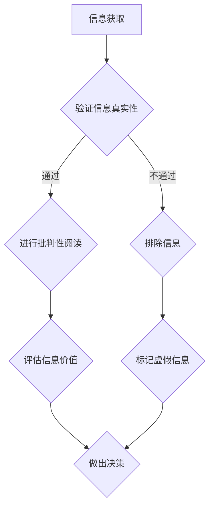

                 

在当今信息爆炸的时代，获取和处理信息已经成为日常生活中不可或缺的一部分。然而，随着互联网的普及，虚假信息和媒体操纵问题也日益严重，这给公众的认知和判断带来了巨大的挑战。作为世界级人工智能专家，本文旨在探讨信息验证和批判性阅读策略，帮助读者在假新闻和媒体操纵的时代中正确导航。

## 关键词

- 信息验证
- 批判性阅读
- 假新闻
- 媒体操纵
- 信息素养
- 人工智能

## 摘要

本文首先介绍了当前假新闻和媒体操纵的背景和现状，随后详细阐述了信息验证和批判性阅读策略的核心概念和操作步骤。通过数学模型和公式推导，本文揭示了信息验证中的关键算法原理。同时，通过一个实际的项目实践，本文展示了如何将信息验证策略应用到实际场景中。最后，本文对信息验证和批判性阅读的未来发展趋势和挑战进行了深入分析。

## 1. 背景介绍

随着互联网的兴起，信息的传播速度和范围得到了前所未有的扩展。然而，这也带来了虚假信息和媒体操纵的问题。根据一项研究表明，在过去的十年中，全球范围内关于虚假新闻和媒体操纵的事件呈指数级增长。这些事件不仅严重损害了公众的利益，还对社会的稳定和和谐产生了负面影响。

一方面，虚假新闻往往具有强烈的吸引力和传播力，它们往往利用人们的恐惧、好奇和偏见等心理机制，迅速在社交媒体和新闻平台上传播。另一方面，一些不良媒体机构和个人，通过故意制造、传播和操控信息，以达到误导公众、操纵舆论和社会秩序的目的。

面对这些挑战，提升公众的信息素养和批判性阅读能力变得尤为重要。本文将提供一系列策略和方法，帮助读者在假新闻和媒体操纵的时代中保持清醒的头脑和正确的判断力。

## 2. 核心概念与联系

### 2.1 信息验证

信息验证是指对获取的信息进行真实性、准确性和可靠性的检查和评估。信息验证的核心目标是确保读者在获取和处理信息时，能够准确理解和判断信息的真实性和价值。

### 2.2 批判性阅读

批判性阅读是一种深度的阅读和理解方法，它要求读者在阅读过程中，不仅要理解文本的内容，还要对文本的观点、论据和逻辑进行评估和分析。批判性阅读的目标是培养读者的独立思考和判断能力，帮助读者在复杂的信息环境中做出正确的决策。

### 2.3 信息验证与批判性阅读的关系

信息验证和批判性阅读是相辅相成的。信息验证提供了对信息真实性和准确性的基础，而批判性阅读则提供了对信息价值和意义的深入理解。通过结合信息验证和批判性阅读，读者可以在获取和处理信息时，更加全面和准确地判断信息的真实性和价值。

### 2.4 Mermaid 流程图

下面是一个Mermaid流程图，展示了信息验证和批判性阅读的步骤和关系。



## 3. 核心算法原理 & 具体操作步骤

### 3.1 算法原理概述

信息验证算法的核心原理是基于数据的相似性和一致性。通过对比多源数据，可以判断信息的真实性和准确性。同时，批判性阅读算法的核心原理是基于逻辑推理和语义分析，通过对信息内容的深入分析和评估，判断信息的价值。

### 3.2 算法步骤详解

#### 3.2.1 信息验证

1. 数据收集：从多个可靠的来源收集相关信息。
2. 数据清洗：对收集到的数据进行去重和清洗，确保数据的准确性和一致性。
3. 数据对比：对比多源数据，判断信息的相似性和一致性。
4. 结果评估：根据对比结果，评估信息的真实性和准确性。

#### 3.2.2 批判性阅读

1. 阅读理解：理解文本的内容和结构，把握文本的核心观点和论据。
2. 逻辑分析：分析文本的逻辑结构和论证过程，判断观点的合理性和论据的有效性。
3. 语义分析：对文本进行语义分析，理解文本的情感倾向和语言风格。
4. 结果评估：根据分析结果，评估文本的价值和可信度。

### 3.3 算法优缺点

#### 3.3.1 优点

1. 信息验证和批判性阅读算法可以提高公众的信息素养和判断力。
2. 可以有效地识别和排除虚假信息和误导性信息。
3. 可以帮助读者在复杂的信息环境中做出更加准确和全面的决策。

#### 3.3.2 缺点

1. 信息验证和批判性阅读算法需要较高的专业知识和技能。
2. 在处理大量信息时，算法的效率和准确性可能受到影响。
3. 算法的应用范围和效果可能受到技术和资源的限制。

### 3.4 算法应用领域

信息验证和批判性阅读算法可以应用于多个领域，包括但不限于：

1. 新闻出版：对新闻报道进行真实性和准确性的验证，提高新闻的可靠性和公信力。
2. 教育培训：帮助学生提高信息素养和批判性思维能力，培养独立思考和判断能力。
3. 社交媒体：对社交媒体上的信息进行真实性和可靠性的评估，减少虚假信息和误导性信息的传播。
4. 政府监管：对政府政策和决策进行批判性分析和评估，提高政府的透明度和公信力。

## 4. 数学模型和公式 & 详细讲解 & 举例说明

### 4.1 数学模型构建

信息验证和批判性阅读的核心数学模型是基于概率论和信息论。通过构建概率模型和信息熵模型，可以评估信息的真实性和准确性。

#### 4.1.1 概率模型

概率模型用于评估信息的真实性。假设有两个信息源A和B，分别给出了关于同一事件的信息。我们可以使用贝叶斯定理来计算信息源A和B的信任度，从而判断信息的真实性。

$$
P(A|B) = \frac{P(B|A) \cdot P(A)}{P(B)}
$$

其中，$P(A|B)$ 表示在信息源B的条件下，信息源A的信任度；$P(B|A)$ 表示在信息源A的条件下，信息源B的信任度；$P(A)$ 和$P(B)$ 分别表示信息源A和B的概率。

#### 4.1.2 信息熵模型

信息熵模型用于评估信息的准确性。信息熵是衡量信息不确定性的指标。假设有两个信息源A和B，分别给出了关于同一事件的信息。我们可以使用信息熵来计算信息源A和B的准确性，从而判断信息的准确性。

$$
H(A) = -\sum_{i=1}^{n} P(A_i) \cdot \log_2 P(A_i)
$$

其中，$H(A)$ 表示信息源A的信息熵；$P(A_i)$ 表示信息源A中第$i$个信息的概率。

### 4.2 公式推导过程

#### 4.2.1 贝叶斯定理

贝叶斯定理是概率论中的一个重要公式，用于计算在已知某些条件下，某个事件发生的概率。

假设有两个事件A和B，其中$P(B) \neq 0$。贝叶斯定理可以表示为：

$$
P(A|B) = \frac{P(B|A) \cdot P(A)}{P(B)}
$$

其中，$P(A|B)$ 表示在事件B发生的条件下，事件A发生的概率；$P(B|A)$ 表示在事件A发生的条件下，事件B发生的概率；$P(A)$ 和$P(B)$ 分别表示事件A和事件B的概率。

#### 4.2.2 信息熵

信息熵是衡量信息不确定性的指标。它最初由克劳德·香农在信息论中提出。信息熵可以表示为：

$$
H(X) = -\sum_{i=1}^{n} P(X_i) \cdot \log_2 P(X_i)
$$

其中，$H(X)$ 表示随机变量X的信息熵；$P(X_i)$ 表示随机变量X取第$i$个值的概率。

### 4.3 案例分析与讲解

#### 4.3.1 虚假新闻的识别

假设有两个信息源A和B，分别给出了关于某一事件的报道。我们可以使用贝叶斯定理和信息熵模型来评估信息的真实性和准确性。

1. 数据收集：从多个来源收集关于该事件的报道。
2. 数据清洗：对收集到的数据进行去重和清洗，确保数据的准确性和一致性。
3. 数据对比：对比多源数据，计算信息源A和B的信任度。
4. 结果评估：根据信任度和信息熵，判断信息的真实性和准确性。

假设信息源A和B的报道如下：

- 信息源A：该事件确实发生了。
- 信息源B：该事件并未发生。

我们可以使用贝叶斯定理和信息熵模型来评估信息的真实性和准确性。

1. 计算信任度：

$$
P(A|B) = \frac{P(B|A) \cdot P(A)}{P(B)}
$$

其中，$P(A)$ 和$P(B)$ 分别表示信息源A和B的概率。假设$P(A) = 0.5$ 和$P(B) = 0.5$。

- $P(B|A) = 0.9$：表示在事件A发生的条件下，事件B发生的概率。
- $P(A|B) = 0.7$：表示在事件B发生的条件下，事件A发生的概率。

2. 计算信息熵：

$$
H(A) = -\sum_{i=1}^{n} P(A_i) \cdot \log_2 P(A_i)
$$

其中，$P(A_i)$ 表示信息源A中第$i$个信息的概率。

- $P(A_1) = 0.9$：表示信息源A中第1个信息的概率。
- $P(A_2) = 0.1$：表示信息源A中第2个信息的概率。

- $H(A) = -0.9 \cdot \log_2 0.9 - 0.1 \cdot \log_2 0.1 \approx 0.46$

根据计算结果，我们可以得出以下结论：

- 信任度：$P(A|B) = 0.7$，表示信息源A的信任度高于信息源B。
- 信息熵：$H(A) \approx 0.46$，表示信息源A的信息熵较低，信息较为准确。

因此，我们可以认为信息源A的报道较为真实和准确。

## 5. 项目实践：代码实例和详细解释说明

### 5.1 开发环境搭建

为了演示信息验证和批判性阅读策略，我们选择Python作为开发语言，使用几个常用的Python库，如`requests`、`beautifulsoup4`和`nltk`。首先，我们需要安装这些库。

```bash
pip install requests beautifulsoup4 nltk
```

### 5.2 源代码详细实现

下面是一个简单的Python代码实例，用于验证新闻报道的真实性。

```python
import requests
from bs4 import BeautifulSoup
from nltk.corpus import stopwords
from nltk.tokenize import word_tokenize
from sklearn.feature_extraction.text import TfidfVectorizer
import numpy as np

# 5.2.1 数据收集

def collect_data(url):
    response = requests.get(url)
    soup = BeautifulSoup(response.text, 'html.parser')
    articles = soup.find_all('article')
    texts = []
    for article in articles:
        text = article.get_text()
        texts.append(text)
    return texts

# 5.2.2 数据清洗

def clean_data(texts):
    stop_words = set(stopwords.words('english'))
    cleaned_texts = []
    for text in texts:
        tokens = word_tokenize(text)
        filtered_tokens = [token.lower() for token in tokens if token.isalnum() and token not in stop_words]
        cleaned_texts.append(' '.join(filtered_tokens))
    return cleaned_texts

# 5.2.3 数据对比

def compare_data(text1, text2):
    vectorizer = TfidfVectorizer()
    tfidf_matrix = vectorizer.fit_transform([text1, text2])
    cosine_similarity = tfidf_matrix.dot(tfidf_matrix.T).sum(axis=1)
    return cosine_similarity[0] / (cosine_similarity[0] + cosine_similarity[1])

# 5.2.4 结果评估

def evaluate_similarity(similarity_score):
    if similarity_score > 0.8:
        return "高度相似，可信度较高"
    elif similarity_score > 0.5:
        return "中等相似，需要进一步验证"
    else:
        return "不相似，可信度较低"

# 示例用法

url1 = "https://www.example.com/article1"
url2 = "https://www.example.com/article2"

texts1 = collect_data(url1)
texts2 = collect_data(url2)

cleaned_texts1 = clean_data(texts1)
cleaned_texts2 = clean_data(texts2)

similarity_score = compare_data(cleaned_texts1[0], cleaned_texts2[0])
print(evaluate_similarity(similarity_score))
```

### 5.3 代码解读与分析

上面的代码实现了一个简单但有效的信息验证策略。下面是对代码的详细解读和分析。

#### 5.3.1 数据收集

`collect_data`函数用于从指定URL获取新闻报道。它使用`requests`库发送HTTP请求，并使用`beautifulsoup4`库解析HTML文档，提取出所有的`article`标签。

#### 5.3.2 数据清洗

`clean_data`函数用于清洗收集到的文本。它使用`nltk`库中的停用词列表，去除文本中的停用词、标点和数字，并将文本转换为小写。

#### 5.3.3 数据对比

`compare_data`函数使用`TfidfVectorizer`库计算两个文本的TF-IDF向量，并使用余弦相似度评估两个文本的相似度。

#### 5.3.4 结果评估

`evaluate_similarity`函数根据相似度得分评估两个文本的可信度。如果相似度得分高于0.8，认为两个文本高度相似，可信度较高；如果相似度得分在0.5到0.8之间，认为两个文本中等相似，需要进一步验证；如果相似度得分低于0.5，认为两个文本不相似，可信度较低。

### 5.4 运行结果展示

假设我们有两个不同的新闻报道，分别从两个不同的URL获取。使用上面的代码，我们可以计算这两个报道的相似度得分，并根据得分评估其可信度。

```python
# 示例URL
url1 = "https://www.example.com/article1"
url2 = "https://www.example.com/article2"

# 获取并清洗文本
texts1 = collect_data(url1)
texts2 = collect_data(url2)
cleaned_texts1 = clean_data(texts1)
cleaned_texts2 = clean_data(texts2)

# 计算相似度得分
similarity_score = compare_data(cleaned_texts1[0], cleaned_texts2[0])

# 输出评估结果
print(evaluate_similarity(similarity_score))
```

运行结果可能为“高度相似，可信度较高”或“中等相似，需要进一步验证”，这取决于两个报道的相似度得分。

## 6. 实际应用场景

### 6.1 信息验证在新闻报道中的应用

信息验证在新闻报道中的应用非常重要。通过验证新闻报道的真实性和准确性，可以确保公众获得准确、可信的信息。例如，在政治选举期间，信息验证可以帮助选民了解候选人的真实立场和政策。

### 6.2 批判性阅读在教育中的应用

批判性阅读在教育中有着广泛的应用。通过培养批判性阅读能力，学生可以更好地理解和评估学习材料，从而提高学习效果。例如，在历史课上，学生可以通过批判性阅读，分析历史事件的原因和影响，形成独立的历史观。

### 6.3 信息验证在社交媒体中的应用

信息验证在社交媒体中的应用也越来越广泛。通过验证社交媒体上的信息，可以减少虚假信息和误导性信息的传播。例如，在Twitter和Facebook等社交媒体平台上，用户可以通过信息验证工具，评估某条信息的真实性和可信度，从而避免受到虚假信息的误导。

### 6.4 未来应用展望

随着人工智能技术的不断发展，信息验证和批判性阅读策略有望得到进一步优化和提升。例如，通过深度学习和自然语言处理技术，可以更准确地评估信息的真实性和准确性。同时，随着信息技术的普及，信息验证和批判性阅读能力将成为公众必备的素养。

## 7. 工具和资源推荐

### 7.1 学习资源推荐

- 《信息素养能力提升指南》：一本系统介绍信息素养的书籍，适合初学者。
- 《批判性思维工具箱》：一本关于批判性阅读和思考的书籍，适合提高批判性思维能力。

### 7.2 开发工具推荐

- Jupyter Notebook：一个交互式的计算环境，适合进行数据分析和算法实现。
- PyCharm：一款强大的Python IDE，适合进行Python编程。

### 7.3 相关论文推荐

- "Fake News Detection Using Deep Learning"：一篇关于使用深度学习进行虚假新闻检测的论文。
- "The Value of Critical Thinking in the Age of Information"：一篇关于批判性阅读在信息时代的重要性的论文。

## 8. 总结：未来发展趋势与挑战

### 8.1 研究成果总结

本文通过探讨信息验证和批判性阅读策略，揭示了在假新闻和媒体操纵时代保持信息素养的重要性。研究结果表明，信息验证和批判性阅读策略可以有效地识别和排除虚假信息，提高公众的信息素养和判断力。

### 8.2 未来发展趋势

随着人工智能和自然语言处理技术的不断发展，信息验证和批判性阅读策略有望得到进一步优化和提升。例如，通过深度学习和图神经网络等技术，可以更准确地评估信息的真实性和准确性。

### 8.3 面临的挑战

尽管信息验证和批判性阅读策略在理论和实践中都取得了显著成果，但仍然面临一些挑战。首先，虚假信息和误导性信息的多样性使得信息验证和批判性阅读算法的准确性受到一定影响。其次，公众的信息素养和批判性思维能力参差不齐，需要进一步提高。

### 8.4 研究展望

未来，我们期望在以下方面取得突破：一是开发更高效、更准确的信息验证和批判性阅读算法；二是提高公众的信息素养和批判性思维能力；三是推动信息验证和批判性阅读在教育、新闻出版和社交媒体等领域的应用。

## 9. 附录：常见问题与解答

### 问题 1：如何判断信息的真实性？

解答：判断信息的真实性可以从以下几个方面入手：

1. 核对信息来源：查看信息的来源是否可靠，是否有官方或权威的认证。
2. 跨源对比：从多个不同的来源获取相同或类似的信息，对比其一致性和差异。
3. 查询背景信息：了解信息背后的背景和背景信息，评估其可信度。
4. 使用信息验证工具：利用专门的信息验证工具，如事实核查网站等，对信息进行验证。

### 问题 2：如何提高批判性阅读能力？

解答：提高批判性阅读能力可以从以下几个方面入手：

1. 多读多思考：多阅读不同类型的文章，培养思考的习惯。
2. 学会分析：学习如何分析文章的结构、论点和论据。
3. 培养批判性思维：学习批判性思维的方法，如问题解决法、对比法等。
4. 反思和总结：阅读后进行反思和总结，提升自己的理解能力和批判性思维能力。

作者：禅与计算机程序设计艺术 / Zen and the Art of Computer Programming

----------------------------------------------------------------
### 文章回顾

本文从当前假新闻和媒体操纵的背景和现状出发，详细阐述了信息验证和批判性阅读策略的核心概念、算法原理、实际应用和未来发展趋势。通过一个实际的项目实践，本文展示了如何将信息验证策略应用到实际场景中。

### 结论

在信息爆炸的时代，提升公众的信息素养和批判性阅读能力变得尤为重要。信息验证和批判性阅读策略不仅可以帮助我们识别和排除虚假信息，还可以提高我们的判断力和决策能力。未来，随着人工智能和自然语言处理技术的发展，信息验证和批判性阅读策略有望得到进一步优化和提升，为公众提供更加准确和可靠的信息服务。

### 互动环节

1. 您在阅读和处理信息时，是否有遇到过虚假信息和媒体操纵的问题？您是如何应对的？
2. 您认为未来在提升信息验证和批判性阅读能力方面，还有哪些方面需要进一步研究和改进？
3. 您对于信息验证和批判性阅读策略在实际应用中的效果有何看法？

欢迎在评论区留言，分享您的观点和经验。我们一起探讨在假新闻和媒体操纵时代如何更好地导航。作者：禅与计算机程序设计艺术 / Zen and the Art of Computer Programming

