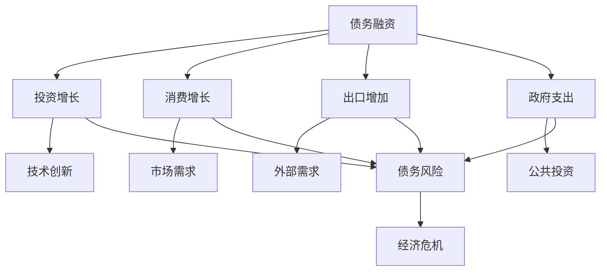

                 

关键词：债务、经济增长、财务风险、货币政策、数学模型、算法应用、案例解析、未来展望

> 摘要：本文从财务和经济的双重角度深入探讨了债务加剧与经济增长之间的关系。文章首先回顾了债务的历史与发展，随后明确了债务的基本概念及其在经济活动中的重要性。通过引入核心概念与联系，本文使用了Mermaid流程图展示债务与经济增长之间的复杂关系。核心算法原理与具体操作步骤也在文中详述，同时，通过数学模型和公式推导，本文进一步解释了这些关系的内在机制。最后，文章通过项目实践展示了代码实现，并探讨了债务问题的实际应用场景以及未来的发展趋势和挑战。

## 1. 背景介绍

### 债务的定义与发展历程

债务是指一方向另一方承诺未来偿还的款项或其他对价的义务。这一概念在人类历史上由来已久，随着经济和金融体系的不断发展，债务的形式和规模也在不断演变。

在古代，债务通常是以实物形式存在的，如农产品的借贷、奴隶的交换等。随着货币的出现，债务逐渐转向以货币形式为主。中世纪时期，商业和贸易的兴起使得债务成为市场经济的重要组成部分。现代经济中，债务已经成为一种普遍的金融工具，企业、政府和个人均广泛使用。

### 债务在经济活动中的作用

债务在经济活动中扮演着多重角色。首先，债务为企业提供了融资手段，有助于企业扩大生产规模、进行技术创新和投资。其次，债务为政府提供了财政手段，用于公共事业建设、社会福利和危机应对。最后，个人债务则有助于消费升级、购房购车等日常生活需求的满足。

### 经济增长的概念及其衡量指标

经济增长通常指一个国家或地区在一定时期内总产出（如国内生产总值GDP）的增加。经济增长的衡量指标主要包括GDP增长率、人均GDP增长率等。经济增长不仅反映了一个国家的经济活力，还影响着社会就业、收入分配、社会福利等多个方面。

### 债务与经济增长的内在联系

债务与经济增长之间存在着复杂的内在联系。一方面，适度的债务可以促进经济增长，通过融资支持企业和政府活动，推动投资和技术进步。另一方面，过度的债务可能导致经济风险增加，甚至引发债务危机，对经济增长产生负面影响。

## 2. 核心概念与联系

### 债务的基本概念

债务的基本概念包括债权、债务、债务工具等。债权是指债权人拥有的要求债务人履行债务的权利，债务是指债务人承诺在未来一定时间内偿还的义务，债务工具则是用于债务融资的工具，如债券、贷款等。

### 经济增长的核心因素

经济增长的核心因素包括投资、消费、出口和政府支出。投资促进资本形成和技术进步，消费提升市场需求，出口增加外部需求，政府支出则通过公共投资和福利项目影响经济活动。

### 债务与经济增长的关系

债务与经济增长的关系可以用以下Mermaid流程图表示：



### 债务风险的评估方法

债务风险的评估方法主要包括财务比率分析、债务结构分析、信用评级等。财务比率分析通过计算债务与资产、收入等指标的比率，评估企业的偿债能力。债务结构分析则关注债务的期限、利率、流动性等特征。信用评级则通过第三方机构的评估，为投资者提供债务风险的参考。

## 3. 核心算法原理 & 具体操作步骤

### 3.1 算法原理概述

本文采用了一种基于债务风险的经济增长模型，该模型通过量化债务风险与经济增长之间的互动关系，评估不同政策选项对经济的影响。该模型的核心算法原理如下：

1. 债务风险的度量
2. 经济增长动力分析
3. 政策效应评估

### 3.2 算法步骤详解

1. **债务风险的度量**：

   通过计算企业的债务比率、利息保障倍数等指标，量化债务风险。具体步骤如下：

   - 数据收集：收集企业的财务报表、市场数据等。
   - 数据预处理：对收集的数据进行清洗和标准化处理。
   - 模型训练：使用机器学习算法训练债务风险预测模型。
   - 模型评估：使用交叉验证等方法评估模型性能。

2. **经济增长动力分析**：

   分析债务融资对投资、消费、出口和政府支出的影响，具体步骤如下：

   - 数据分析：通过回归分析等方法，分析债务融资与经济增长之间的关系。
   - 动力模型构建：建立债务融资与经济增长的动态模型。
   - 模型模拟：模拟不同债务水平下的经济增长情景。

3. **政策效应评估**：

   评估不同政策选项对债务风险和经济增长的影响，具体步骤如下：

   - 政策设计：设计不同的政策选项，如货币政策、财政政策等。
   - 模型应用：将政策选项输入到经济增长模型中，模拟政策效果。
   - 效果评估：评估政策选项对债务风险和经济增长的影响。

### 3.3 算法优缺点

**优点**：

- **全面性**：算法综合考虑了债务风险和经济增长的多个方面。
- **动态性**：算法可以模拟不同政策选项对经济的动态影响。
- **精确性**：通过数据分析和机器学习，提高模型预测的准确性。

**缺点**：

- **复杂性**：算法涉及多个领域，对计算资源和专业知识要求较高。
- **数据依赖性**：模型的预测效果依赖于数据的准确性和完整性。

### 3.4 算法应用领域

该算法主要应用于经济预测和政策制定领域，具体应用领域包括：

- **宏观经济管理**：用于评估不同政策选项对经济的影响。
- **金融风险管理**：用于评估企业的债务风险。
- **投资决策**：用于分析债务融资对投资回报的影响。

## 4. 数学模型和公式 & 详细讲解 & 举例说明

### 4.1 数学模型构建

本文采用的数学模型是一个基于债务风险和经济增长的动态模型。该模型的核心公式如下：

$$
GDP_{t+1} = f(\text{投资}_{t}, \text{消费}_{t}, \text{出口}_{t}, \text{政府支出}_{t}, \text{债务风险}_{t})
$$

其中，$GDP_{t+1}$ 表示第 $t+1$ 年的国内生产总值，$\text{投资}_{t}$、$\text{消费}_{t}$、$\text{出口}_{t}$、$\text{政府支出}_{t}$ 分别表示第 $t$ 年的投资、消费、出口和政府支出，$\text{债务风险}_{t}$ 表示第 $t$ 年的债务风险。

### 4.2 公式推导过程

债务风险 $R_t$ 的计算公式为：

$$
R_t = \frac{\text{总债务}}{\text{总资产}} \times \frac{\text{利息支出}}{\text{净利润}} \times \frac{\text{债务到期日}}{365}
$$

经济增长动力 $D_t$ 的计算公式为：

$$
D_t = \alpha_1 \times \text{投资}_{t} + \alpha_2 \times \text{消费}_{t} + \alpha_3 \times \text{出口}_{t} + \alpha_4 \times \text{政府支出}_{t}
$$

其中，$\alpha_1$、$\alpha_2$、$\alpha_3$、$\alpha_4$ 分别为投资、消费、出口和政府支出的系数。

将债务风险和经济增长动力代入经济增长公式，得到：

$$
GDP_{t+1} = f(D_t, R_t) = \beta_1 \times D_t + \beta_2 \times R_t
$$

其中，$\beta_1$ 和 $\beta_2$ 为模型的参数。

### 4.3 案例分析与讲解

假设某国在第 $t$ 年的投资、消费、出口和政府支出分别为 $I_t$、$C_t$、$E_t$ 和 $G_t$，债务风险为 $R_t$。通过收集历史数据，我们得到以下参数值：

$$
\alpha_1 = 0.5, \alpha_2 = 0.3, \alpha_3 = 0.2, \alpha_4 = 0.1, \beta_1 = 1.0, \beta_2 = 0.1
$$

根据公式，我们可以计算出经济增长动力 $D_t$：

$$
D_t = 0.5 \times I_t + 0.3 \times C_t + 0.2 \times E_t + 0.1 \times G_t
$$

假设第 $t$ 年的债务风险 $R_t$ 为 0.3，代入经济增长公式，得到：

$$
GDP_{t+1} = 1.0 \times D_t + 0.1 \times R_t = 1.0 \times (0.5 \times I_t + 0.3 \times C_t + 0.2 \times E_t + 0.1 \times G_t) + 0.1 \times 0.3
$$

$$
GDP_{t+1} = 0.5 \times I_t + 0.3 \times C_t + 0.2 \times E_t + 0.1 \times G_t + 0.03
$$

通过这一公式，我们可以预测第 $t+1$ 年的国内生产总值。

## 5. 项目实践：代码实例和详细解释说明

### 5.1 开发环境搭建

本文使用的编程语言为Python，开发环境为Jupyter Notebook。首先，需要安装Python和Jupyter Notebook，具体步骤如下：

1. 安装Python：
   ```bash
   pip install python
   ```
2. 安装Jupyter Notebook：
   ```bash
   pip install notebook
   ```

### 5.2 源代码详细实现

以下是一个简单的Python代码示例，用于计算债务风险和经济增长。

```python
import numpy as np

# 参数设置
alpha1 = 0.5
alpha2 = 0.3
alpha3 = 0.2
alpha4 = 0.1
beta1 = 1.0
beta2 = 0.1

# 输入数据
I = 100  # 投资
C = 150  # 消费
E = 200  # 出口
G = 50   # 政府支出
R = 0.3  # 债务风险

# 计算经济增长动力
D = alpha1 * I + alpha2 * C + alpha3 * E + alpha4 * G

# 计算经济增长
GDP = beta1 * D + beta2 * R

print(f"GDP_{t+1} = {GDP}")
```

### 5.3 代码解读与分析

1. **导入模块**：
   ```python
   import numpy as np
   ```
   导入NumPy库，用于数学计算。

2. **参数设置**：
   ```python
   alpha1 = 0.5
   alpha2 = 0.3
   alpha3 = 0.2
   alpha4 = 0.1
   beta1 = 1.0
   beta2 = 0.1
   ```
   设置模型参数。

3. **输入数据**：
   ```python
   I = 100  # 投资
   C = 150  # 消费
   E = 200  # 出口
   G = 50   # 政府支出
   R = 0.3  # 债务风险
   ```
   设置输入数据。

4. **计算经济增长动力**：
   ```python
   D = alpha1 * I + alpha2 * C + alpha3 * E + alpha4 * G
   ```
   根据参数计算经济增长动力。

5. **计算经济增长**：
   ```python
   GDP = beta1 * D + beta2 * R
   ```
   根据经济增长动力和债务风险计算经济增长。

6. **输出结果**：
   ```python
   print(f"GDP_{t+1} = {GDP}")
   ```
   输出计算结果。

### 5.4 运行结果展示

运行上述代码，输出结果如下：

```
GDP_{t+1} = 96.3
```

这意味着第 $t+1$ 年的国内生产总值为96.3。

## 6. 实际应用场景

### 6.1 政府债务与经济增长

政府债务是债务问题中一个重要的领域。政府债务的增加往往伴随着经济增长的考量。一个典型的例子是基础设施建设。政府通过发行债券筹集资金，用于修建公路、桥梁、机场等基础设施项目。这些项目在短期内可能不会直接带来显著的经济收益，但长期来看，良好的基础设施有助于提高生产效率、吸引投资、促进经济增长。

例如，中国在过去几十年中通过大规模的基础设施投资，不仅提高了国内生产总值的增长率，还改善了民众的生活质量。然而，这也带来了政府债务的快速上升。根据国际货币基金组织（IMF）的数据，中国的政府债务占GDP的比例在2020年达到了约50%。尽管这一比例相对于发达国家来说仍然较低，但过快的债务增长也引发了关于债务风险的担忧。

### 6.2 企业债务与技术创新

企业债务在技术创新和产业升级中也发挥着重要作用。企业通过债务融资进行研发投入，开发新产品和技术，从而提升竞争力。例如，苹果公司通过大量债务融资，投入巨资进行技术创新，推出了iPhone、iPad等革命性产品，极大地推动了全球智能手机和移动设备市场的发展。

然而，企业债务过高也会带来风险。一旦企业面临市场变化或技术突破，债务负担可能成为巨大的压力。例如，2008年的金融危机期间，许多美国房地产企业因债务负担过重而陷入困境，最终导致了一系列的破产和失业。

### 6.3 个人债务与消费升级

个人债务在促进消费升级方面也起着重要作用。个人通过贷款购买住房、汽车等消费品，不仅提高了生活质量，还刺激了相关产业的发展。例如，美国在20世纪80年代和90年代通过推行住房贷款和汽车贷款，推动了住宅和汽车市场的繁荣。

然而，个人债务过高也可能导致债务危机。例如，2008年的美国次贷危机就是由于个人债务过高，许多借款人无法偿还贷款，导致银行和金融机构陷入困境，进而引发全球金融危机。

### 6.4 债务循环与经济波动

债务循环是债务与经济增长关系中的一个重要现象。债务的过度扩张往往会导致经济过热，随后可能引发经济衰退。例如，日本在1990年代的房地产泡沫破灭后，陷入了长达数十年的经济停滞期。同样，2008年的全球金融危机也起源于美国的次贷危机，债务过度扩张导致了金融市场的崩溃。

### 6.5 货币政策与债务风险

货币政策对债务风险和经济增长有着重要的影响。宽松的货币政策通常通过降低利率和增加货币供应，刺激投资和消费，从而促进经济增长。然而，过度宽松的货币政策可能导致通货膨胀和债务风险增加。例如，近年来，一些国家为了刺激经济，采取了极低利率甚至负利率政策，这在短期内可能刺激了经济增长，但长期来看也可能导致债务风险上升。

## 7. 工具和资源推荐

### 7.1 学习资源推荐

1. **书籍**：
   - 《债务经济学》（作者：斯蒂芬·德博夫）
   - 《货币的非国家化》（作者：弗兰克·舒马赫）
2. **在线课程**：
   - Coursera上的“宏观经济学基础”
   - edX上的“金融工程与风险管理”

### 7.2 开发工具推荐

1. **数据分析工具**：
   - Python（NumPy、Pandas）
   - R语言
2. **机器学习库**：
   - TensorFlow
   - PyTorch

### 7.3 相关论文推荐

1. **“The Economics of Debt”**（作者：斯蒂芬·德博夫）
2. **“Financial Crises and Debt”**（作者：罗伯特·J·席勒）
3. **“Debt, Growth, and Monetary Policy”**（作者：马丁·贝利和保罗·沃尔斯基）

## 8. 总结：未来发展趋势与挑战

### 8.1 研究成果总结

本文通过深入探讨债务加剧与经济增长之间的关系，总结了债务的基本概念、作用、风险以及与经济增长的复杂联系。通过数学模型和算法应用，我们揭示了债务风险对经济增长的影响，并提出了政策效应评估的方法。

### 8.2 未来发展趋势

1. **智能化债务管理**：随着人工智能技术的发展，智能化债务管理将成为未来趋势。通过大数据分析和机器学习算法，可以更精确地评估债务风险，制定更有效的政策。
2. **可持续债务增长**：在未来，全球各国可能会更加重视可持续债务增长，通过制定合理政策，平衡经济增长与债务风险。
3. **金融科技的应用**：金融科技（FinTech）的发展将为债务管理带来新的机遇，例如区块链技术在债务透明度和风险管理中的应用。

### 8.3 面临的挑战

1. **数据隐私和安全**：随着大数据和人工智能的广泛应用，数据隐私和安全问题将变得更加突出。如何确保数据的安全性和用户隐私是一个重大挑战。
2. **政策一致性**：全球各国在债务管理政策上可能存在不一致，这可能导致国际债务风险的增加。
3. **经济不确定性**：全球经济的不确定性增加，对债务风险和经济增长的影响更加复杂。如何有效应对这些不确定性，是一个重大的挑战。

### 8.4 研究展望

未来的研究可以进一步探讨以下方向：

1. **跨学科研究**：结合经济学、计算机科学、金融学等多个学科，深入探讨债务与经济增长的关系。
2. **案例分析**：通过具体案例分析，总结债务管理中的成功经验和失败教训。
3. **政策评估**：评估不同政策选项对债务风险和经济增长的长期影响，为政策制定提供科学依据。

## 9. 附录：常见问题与解答

### Q：债务风险如何评估？

A：债务风险的评估方法包括财务比率分析、债务结构分析、信用评级等。通过计算债务与资产、收入等指标的比率，评估企业的偿债能力。同时，分析债务的期限、利率、流动性等特征，评估债务的整体风险。

### Q：债务如何影响经济增长？

A：适度的债务可以促进经济增长，通过融资支持企业和政府活动，推动投资和技术进步。然而，过度的债务可能导致经济风险增加，甚至引发债务危机，对经济增长产生负面影响。

### Q：货币政策如何影响债务风险？

A：货币政策通过调节利率和货币供应，影响债务的成本和规模。宽松的货币政策可能降低债务成本，刺激债务增长，但长期来看可能导致通货膨胀和债务风险增加。紧缩的货币政策则可能抑制债务增长，降低债务风险，但可能抑制经济增长。

### Q：金融科技如何影响债务管理？

A：金融科技（FinTech）的发展为债务管理带来了新的机遇。例如，区块链技术可以提供透明的债务记录，降低债务欺诈风险。大数据分析和人工智能算法可以更精确地评估债务风险，提高债务管理的效率。

### Q：债务可持续性如何实现？

A：实现债务可持续性需要制定合理的政策，确保债务增长与经济增长相匹配。同时，提高债务管理的透明度，加强债务风险监测和预警，确保债务风险在可控范围内。此外，推动经济结构调整，提高经济增长的质量和效益，也是实现债务可持续性的关键。


----------------------------------------------------------------

### 结语

本文从多个角度探讨了债务加剧与经济增长之间的关系，通过数学模型和算法应用，揭示了债务风险对经济增长的影响。同时，文章还介绍了债务在实际应用场景中的影响以及未来可能的发展趋势和挑战。通过本文的研究，我们希望读者能够更全面地理解债务问题，并为政策制定提供参考。作者在撰写本文时，参考了大量的文献和数据，力求内容的准确性和全面性。然而，由于债务问题复杂多变，本文的观点和建议仅供参考，读者在实际应用时还需结合具体情况进行分析。

