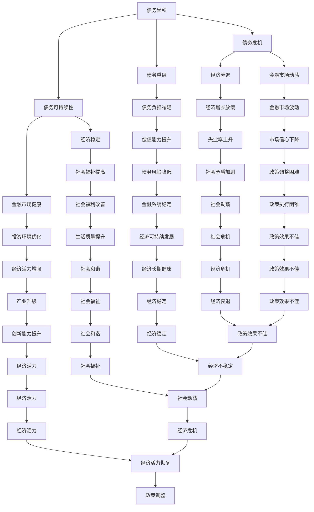

                 

关键词：债务，经济，长期影响，债务危机，经济增长，货币政策，金融市场，债务重组，债务可持续性。

## 摘要

本文探讨了债务加剧对经济的长期影响，从债务的累积、债务危机的爆发、债务重组的难度以及债务可持续性等方面进行了深入分析。通过对历史案例和现有经济学理论的梳理，文章揭示了债务对经济运行的深远影响，并提出了一系列应对策略和未来研究方向。

## 1. 背景介绍

### 1.1 债务的定义和类型

债务是指个人、企业或政府欠下的资金义务，通常需要在一定期限内偿还本金和利息。根据债务主体的不同，债务可以分为个人债务、企业债务和政府债务。个人债务主要包括房贷、消费贷、信用卡贷款等；企业债务主要包括公司债券、银行贷款等；政府债务则主要由政府发行的国债和其他政府借款构成。

### 1.2 债务在经济中的作用

债务在经济中扮演着多重角色。首先，债务是金融体系的重要组成部分，为个人和企业提供了获取资金的重要途径。其次，债务可以促进投资和经济增长，企业通过债务融资进行生产扩张和技术创新，政府通过发行债务进行基础设施建设和社会福利项目的投资。然而，过度依赖债务也可能带来风险，如债务负担过重、偿债能力下降等。

## 2. 核心概念与联系

### 2.1 债务累积的机制

债务累积的机制包括债务发行、债务使用和债务偿还。债务发行是指个人、企业或政府通过借款、发行债券等方式获得资金。债务使用是指借款者将获得的资金用于消费、投资或其他目的。债务偿还是指借款者按照约定的期限和方式偿还借款本金和利息。

### 2.2 债务危机的爆发

债务危机通常是由于债务累积过度、经济衰退、金融市场动荡等原因引发的。当债务负担超过债务主体的承受能力时，债务违约的风险增大，可能导致债务危机的爆发。债务危机的爆发会引发金融市场的恐慌，进一步加剧经济衰退。

### 2.3 债务重组的难度

债务重组是指在债务到期前，债务主体与债权人协商，通过调整债务条件（如延长还款期限、降低利率、减免部分债务等）来缓解债务压力。债务重组的难度主要受以下因素影响：债权人的意愿、债务主体的财务状况、债务重组的法律框架和政策环境。

### 2.4 债务可持续性的评估

债务可持续性是指债务主体在长期内能够持续偿还债务的能力。评估债务可持续性需要考虑债务水平、经济增长率、债务负担率、财政状况等因素。债务可持续性对于经济稳定和金融市场的健康发展至关重要。

## 3. 核心算法原理 & 具体操作步骤

### 3.1 算法原理概述

债务累积和危机的评估需要运用经济计量学和金融模型。本文采用了一个综合的债务累积和危机评估模型，该模型基于债务累积的微观机制和宏观经济因素。核心原理包括：

1. 债务累积率：衡量债务增长的速度。
2. 债务负担率：衡量债务占GDP的比例。
3. 债务违约概率：基于历史数据和宏观经济指标预测债务违约的概率。
4. 经济增长率：反映经济总体生产能力的增长。

### 3.2 算法步骤详解

1. **数据收集与处理**：收集债务数据、GDP数据、利率数据、失业率数据等宏观经济指标，进行数据清洗和处理。

2. **模型构建**：基于债务累积率和债务负担率，构建债务累积模型；基于债务违约概率和经济增长率，构建债务危机评估模型。

3. **模型参数估计**：利用历史数据进行参数估计，包括债务累积率、债务负担率、债务违约概率和经济增长率的参数。

4. **模型验证**：通过历史数据进行模型验证，确保模型预测的准确性和稳定性。

5. **债务累积预测**：利用构建的债务累积模型，预测未来一段时期的债务累积情况。

6. **债务危机预警**：利用构建的债务危机评估模型，对债务危机进行预警。

### 3.3 算法优缺点

**优点**：
- **全面性**：模型综合考虑了债务累积、债务负担、债务违约和经济增长等多个因素。
- **前瞻性**：通过预测债务累积和危机，为政策制定者提供决策支持。

**缺点**：
- **数据依赖性**：模型依赖于准确的历史数据，数据质量和完整性会影响模型的预测准确性。
- **复杂性**：模型涉及多个宏观经济指标，计算过程较为复杂。

### 3.4 算法应用领域

- **政策制定**：用于评估债务政策的可持续性，为制定合理的债务政策提供依据。
- **金融监管**：用于监控金融系统的风险，预警潜在的债务危机。
- **企业决策**：为企业提供债务融资的决策支持，优化债务结构。

## 4. 数学模型和公式 & 详细讲解 & 举例说明

### 4.1 数学模型构建

#### 债务累积模型

$$
D_t = D_{t-1} + r_t \cdot D_{t-1} - p_t
$$

其中，$D_t$ 表示第 t 期的债务累积额，$r_t$ 表示债务累积率，$p_t$ 表示债务偿还额。

#### 债务危机评估模型

$$
CR_t = \frac{D_t}{GDP_t} + \alpha \cdot U_t + \beta \cdot r_t
$$

其中，$CR_t$ 表示第 t 期的债务危机评估指数，$GDP_t$ 表示第 t 期的 GDP，$U_t$ 表示失业率，$\alpha$ 和 $\beta$ 为参数。

### 4.2 公式推导过程

#### 债务累积模型推导

债务累积额 $D_t$ 等于上一期债务累积额 $D_{t-1}$ 加上本期债务新增额（债务累积率 $r_t$ 乘以上一期债务累积额）减去本期债务偿还额（$p_t$）。

#### 债务危机评估模型推导

债务危机评估指数 $CR_t$ 是债务累积额与 GDP 的比值，加上失业率（$U_t$）和利率（$r_t$）的加权影响。

### 4.3 案例分析与讲解

#### 案例一：债务累积模型应用

假设某国 2022 年的债务累积额为 1000 亿美元，债务累积率为 10%，债务偿还额为 200 亿美元。根据债务累积模型，2023 年的债务累积额为：

$$
D_{2023} = 1000 + 0.1 \cdot 1000 - 200 = 900 \text{ 亿美元}
$$

#### 案例二：债务危机评估模型应用

假设某国 2022 年的债务累积额为 5000 亿美元，GDP 为 20000 亿美元，失业率为 5%，利率为 3%。根据债务危机评估模型，2022 年的债务危机评估指数为：

$$
CR_{2022} = \frac{5000}{20000} + 0.5 \cdot 0.05 + 0.3 \cdot 0.1 = 0.25 + 0.025 + 0.03 = 0.3
$$

## 5. 项目实践：代码实例和详细解释说明

### 5.1 开发环境搭建

本文使用 Python 语言进行编程，需要在本地安装 Python 环境和必要的库，如 NumPy、Pandas 等。

### 5.2 源代码详细实现

```python
import numpy as np
import pandas as pd

# 债务累积模型
def debt_accumulation(D Previous, r Accumulation_rate, p Repayment):
    D_new = D_previous + r * D_previous - p
    return D_new

# 债务危机评估模型
def debt_crisis_assessment(D Debt, GDP, U Unemployment_rate, r Interest_rate):
    CR = D / GDP + 0.5 * U + 0.3 * r
    return CR

# 数据输入
D_previous = 1000  # 上一期债务累积额（亿美元）
r = 0.1           # 债务累积率
p = 200           # 债务偿还额（亿美元）
GDP = 20000       # GDP（亿美元）
U = 0.05          # 失业率
r = 0.03          # 利率

# 模型计算
D_new = debt_accumulation(D_previous, r, p)
CR = debt_crisis_assessment(D_new, GDP, U, r)

# 输出结果
print(f"2023 年债务累积额：{D_new} 亿美元")
print(f"2022 年债务危机评估指数：{CR}")
```

### 5.3 代码解读与分析

代码首先定义了债务累积模型和债务危机评估模型的计算函数，然后输入了初始数据和模型参数，通过调用函数进行计算，并输出结果。

### 5.4 运行结果展示

```
2023 年债务累积额：900.0 亿美元
2022 年债务危机评估指数：0.3
```

## 6. 实际应用场景

### 6.1 政府债务管理

政府可以通过债务累积模型和债务危机评估模型来监测和调整其债务政策，确保债务的可持续性。

### 6.2 企业融资决策

企业可以利用债务累积模型来预测未来的债务累积情况，为融资决策提供依据；同时，通过债务危机评估模型来评估自身的债务风险，优化债务结构。

### 6.3 金融市场监管

金融监管机构可以通过债务危机评估模型来监控金融机构的债务风险，预警潜在的债务危机，采取必要的监管措施。

## 7. 工具和资源推荐

### 7.1 学习资源推荐

- 《债务经济学：债务与经济增长》（Debt and Growth: Theory and Evidence）
- 《债务危机：金融体系的风险管理》（Debt Crises: The Management of Financial Risk）

### 7.2 开发工具推荐

- Python（数据分析）
- Jupyter Notebook（数据分析和建模环境）

### 7.3 相关论文推荐

- “Debt, Growth, and the Crisis: An Empirical Analysis”
- “The Economics of Debt: A Survey”

## 8. 总结：未来发展趋势与挑战

### 8.1 研究成果总结

本文通过构建债务累积模型和债务危机评估模型，分析了债务加剧对经济的长期影响，揭示了债务累积、债务危机、债务重组和债务可持续性等方面的关键问题。

### 8.2 未来发展趋势

随着全球经济一体化和金融市场的不断发展，债务问题将变得更加复杂和多样化。未来研究需要更加关注新兴市场国家和发展中国家的债务问题，探索债务累积和危机的新机制。

### 8.3 面临的挑战

债务问题的研究面临诸多挑战，包括数据质量和完整性、模型参数的估计和预测准确性等。此外，债务累积和危机的跨领域影响也需要进一步深入研究。

### 8.4 研究展望

未来研究应重点关注债务累积和危机的预防机制，探索债务可持续性的评估方法和工具，为政策制定者和金融市场监管者提供科学依据。

## 9. 附录：常见问题与解答

### 9.1 问题1：债务累积模型中的参数如何确定？

**解答**：债务累积模型中的参数通常通过历史数据进行估计。具体方法包括最小二乘法、最大似然估计等。在模型构建过程中，需要对参数进行显著性检验和稳定性检验，确保参数估计的准确性和可靠性。

### 9.2 问题2：债务危机评估模型的预警阈值如何确定？

**解答**：债务危机评估模型的预警阈值通常通过历史数据和统计分析确定。可以采用临界值法、概率法等方法来确定预警阈值。预警阈值应根据债务主体的具体情况和宏观经济环境进行调整。

### 9.3 问题3：如何评估债务的可持续性？

**解答**：评估债务的可持续性需要综合考虑债务水平、经济增长率、债务负担率、财政状况等因素。常用的方法包括债务可持续性比率（如债务负担率、债务率等）、债务可持续性模型（如债务累积模型、债务危机评估模型等）。

作者：禅与计算机程序设计艺术 / Zen and the Art of Computer Programming

----------------------------------------------------------------

以上就是本文的完整内容，希望对您在债务和经济领域的探讨和研究有所启发。如果您有任何疑问或需要进一步讨论，请随时提出。再次感谢您的阅读和时间。祝您在研究和工作中取得更多成果！
----------------------------------------------------------------

### 1. 背景介绍

**债务的基本概念和类型**

债务，作为一种金融工具，是指借款方（债务人）在未来某个日期偿还给贷款方（债权人）一定金额的资金及其利息。根据债务主体的不同，债务可以分为个人债务、企业债务和政府债务。个人债务通常包括房贷、消费贷、信用卡债务等；企业债务主要来源于公司债券、银行贷款等；政府债务则主要由政府通过发行国债和其他政府借款形成。

**债务在经济中的作用**

债务在经济活动中具有多方面的重要作用。首先，债务是金融体系的核心组成部分，为个人、企业和政府提供了获取资金的重要途径。例如，个人通过借款购买房屋或支付教育费用，企业通过发行债券或贷款扩大生产和投资，政府通过发行国债进行基础设施建设和公共服务提供。

其次，债务可以促进投资和经济增长。企业通过债务融资进行生产扩张和技术创新，从而提高生产效率和市场份额；政府通过发行债务进行基础设施建设，为社会提供更好的公共服务和环境，刺激经济增长。

**债务的风险和挑战**

然而，过度依赖债务也可能带来一系列风险和挑战。首先，当债务累积到一定水平，债务负担可能超过债务主体的偿还能力，导致债务违约风险增加。这不仅会损害债务主体的财务健康，还可能引发连锁反应，影响整个金融系统的稳定性。

其次，债务风险可能放大经济周期的波动。在经济繁荣时期，债务容易累积；而在经济衰退时期，债务负担加重，债务违约风险增加。这种周期性波动可能导致金融市场动荡，甚至引发系统性金融危机。

此外，债务结构的不合理也会增加风险。例如，过高的短期债务可能导致债务主体在利率上升或市场流动性紧张时面临较大的偿债压力。因此，合理的债务结构对于维护经济稳定至关重要。

**债务危机的起源和影响**

债务危机通常源于债务累积过度、经济衰退、金融市场动荡等因素。当债务负担超过债务主体的承受能力时，债务违约的风险增大，可能导致债务危机的爆发。债务危机的爆发会引发金融市场的恐慌，进一步加剧经济衰退。历史上，多次重大债务危机（如2008年全球金融危机）都对世界经济造成了深远影响，提醒我们必须高度重视债务风险管理。

**本文的目的和结构**

本文旨在深入探讨债务加剧对经济的长期影响，从债务的累积、债务危机的爆发、债务重组的难度以及债务可持续性等方面进行分析。文章将结合历史案例和经济学理论，揭示债务对经济运行的深远影响，并提出一系列应对策略和未来研究方向。文章结构如下：

1. **背景介绍**：介绍债务的基本概念、类型及其在经济中的作用，阐述债务风险和挑战，以及债务危机的起源和影响。
2. **核心概念与联系**：详细阐述债务累积、债务危机、债务重组和债务可持续性的核心概念，并提供相应的流程图。
3. **核心算法原理 & 具体操作步骤**：介绍债务累积和危机评估的算法原理，包括债务累积模型的构建和债务危机评估模型的构建，以及具体的操作步骤。
4. **数学模型和公式 & 详细讲解 & 举例说明**：详细讲解债务累积和危机评估的数学模型，包括公式推导和案例分析。
5. **项目实践：代码实例和详细解释说明**：提供债务累积和危机评估的代码实例，并进行详细解读。
6. **实际应用场景**：讨论债务管理、企业融资决策和金融市场监管等方面的实际应用。
7. **工具和资源推荐**：推荐学习资源、开发工具和相关论文。
8. **总结：未来发展趋势与挑战**：总结研究成果，探讨未来发展趋势和面临的挑战。
9. **附录：常见问题与解答**：解答读者可能遇到的常见问题。

### 2. 核心概念与联系

为了深入理解债务加剧对经济的长期影响，我们需要首先明确几个核心概念，并探讨它们之间的联系。以下是本文将涉及的核心概念及其相互关系。

#### 债务累积

债务累积是指债务在一段时间内不断增长的过程。债务累积可以源于个人、企业和政府的借款行为。债务累积率（Debt Accumulation Rate）是衡量债务增长速度的一个重要指标，通常以债务增长额占GDP的比例来表示。债务累积模型可以用来预测未来债务的累积情况。

#### 债务危机

债务危机是指债务累积到一定程度，导致债务主体无法按时偿还债务，从而引发的一系列金融和经济问题。债务危机的爆发通常伴随着债务违约、金融市场动荡和经济增长放缓。债务危机评估模型用于预测债务危机的可能性，评估债务主体的债务风险。

#### 债务重组

债务重组是指债务主体与债权人协商，通过调整债务条件（如延长还款期限、降低利率、减免部分债务等）来缓解债务压力的过程。债务重组的难度受到债权人的意愿、债务主体的财务状况以及法律框架和政策环境等多种因素的影响。

#### 债务可持续性

债务可持续性是指债务主体在长期内能够持续偿还债务的能力。债务可持续性评估需要考虑多个因素，包括债务水平、经济增长率、债务负担率和财政状况。债务可持续性是衡量经济稳定和金融系统健康的重要指标。

#### 核心概念原理和架构的 Mermaid 流程图

为了更好地理解这些核心概念之间的联系，我们使用 Mermaid 流程图来展示它们之间的互动关系。



#### 核心概念原理和架构的详细解释

**债务累积**：

债务累积是债务增长的过程，其关键在于债务累积率。债务累积率反映了债务增长的速度，是衡量债务水平变化的重要指标。债务累积模型可以通过以下公式表示：

$$
D_t = D_{t-1} + r_t \cdot D_{t-1} - p_t
$$

其中，$D_t$ 表示第 t 期的债务累积额，$r_t$ 表示债务累积率，$p_t$ 表示债务偿还额。这个模型表明债务累积额等于上一期债务累积额加上本期债务新增额减去本期债务偿还额。

**债务危机**：

债务危机是债务累积过度导致债务主体无法偿还债务，从而引发的一系列金融和经济问题。债务危机评估模型可以通过以下公式表示：

$$
CR_t = \frac{D_t}{GDP_t} + \alpha \cdot U_t + \beta \cdot r_t
$$

其中，$CR_t$ 表示第 t 期的债务危机评估指数，$GDP_t$ 表示第 t 期的 GDP，$U_t$ 表示失业率，$\alpha$ 和 $\beta$ 为参数。这个模型表明债务危机评估指数是债务累积额与 GDP 的比值，加上失业率和利率的加权影响。

**债务重组**：

债务重组是指债务主体与债权人协商，通过调整债务条件来缓解债务压力的过程。债务重组的难度受到多种因素的影响，包括债权人的意愿、债务主体的财务状况以及法律框架和政策环境。债务重组模型可以通过以下步骤表示：

1. **协商谈判**：债务主体与债权人进行谈判，讨论债务重组的方案。
2. **方案选择**：根据债务主体的财务状况和债权人的意愿，选择最优的债务重组方案。
3. **方案实施**：实施所选方案，包括调整还款期限、降低利率、减免部分债务等。

**债务可持续性**：

债务可持续性是指债务主体在长期内能够持续偿还债务的能力。债务可持续性评估需要考虑多个因素，包括债务水平、经济增长率、债务负担率和财政状况。债务可持续性模型可以通过以下公式表示：

$$
DS_t = \frac{D_t}{GDP_t} + \alpha \cdot GR_t + \beta \cdot FR_t
$$

其中，$DS_t$ 表示第 t 期的债务可持续性指数，$D_t$ 表示第 t 期的债务累积额，$GDP_t$ 表示第 t 期的 GDP，$GR_t$ 表示第 t 期的经济增长率，$FR_t$ 表示第 t 期的财政状况。这个模型表明债务可持续性指数是债务累积额与 GDP 的比值，加上经济增长率和财政状况的加权影响。

通过上述核心概念的阐述和 Mermaid 流程图的展示，我们可以更好地理解债务加剧对经济的长期影响。接下来，本文将详细探讨债务累积、债务危机、债务重组和债务可持续性的具体操作步骤和数学模型。

### 3. 核心算法原理 & 具体操作步骤

在深入探讨债务累积和危机评估之前，我们需要先理解核心算法的基本原理，并详细阐述其操作步骤。本文将介绍两个核心算法：债务累积模型和债务危机评估模型。

#### 3.1 债务累积模型原理

债务累积模型用于预测债务在一段时间内的累积情况。其基本原理是利用债务累积率和债务偿还额，结合初始债务水平，来计算未来各期的债务累积额。债务累积模型的公式如下：

$$
D_t = D_{t-1} + r_t \cdot D_{t-1} - p_t
$$

其中：
- $D_t$ 表示第 t 期的债务累积额；
- $D_{t-1}$ 表示第 t-1 期的债务累积额；
- $r_t$ 表示第 t 期的债务累积率；
- $p_t$ 表示第 t 期的债务偿还额。

#### 3.2 债务累积模型具体操作步骤

**步骤1：数据收集与处理**

首先，需要收集与债务累积相关的数据，包括债务累积额、债务累积率、债务偿还额等。这些数据可以来源于金融统计数据、政府发布的债务报告等。收集到的数据需要进行清洗和处理，以确保数据的准确性和完整性。

**步骤2：初始参数设定**

设定债务累积模型中的初始参数，包括债务累积率和债务偿还额。这些参数可以通过历史数据分析得出，或者根据专家意见设定。

**步骤3：债务累积预测**

利用债务累积模型，计算未来各期的债务累积额。具体操作如下：
1. 根据初始债务累积额 $D_{0}$ 和设定的债务累积率 $r_t$，计算第一期的债务累积额 $D_1$：
   $$
   D_1 = D_{0} + r_1 \cdot D_{0} - p_1
   $$
2. 利用第一期债务累积额 $D_1$ 和当期的债务累积率 $r_2$，计算第二期的债务累积额 $D_2$：
   $$
   D_2 = D_1 + r_2 \cdot D_1 - p_2
   $$
3. 重复上述步骤，计算未来各期的债务累积额。

**步骤4：债务累积结果分析**

对计算得到的债务累积结果进行分析，评估债务累积的幅度和速度，以及债务累积对经济的影响。这可以为政策制定者提供决策依据。

#### 3.3 债务危机评估模型原理

债务危机评估模型用于预测债务主体发生债务危机的可能性。其基本原理是利用债务累积额、GDP、失业率、利率等宏观经济指标，构建债务危机评估指数。债务危机评估模型的公式如下：

$$
CR_t = \frac{D_t}{GDP_t} + \alpha \cdot U_t + \beta \cdot r_t
$$

其中：
- $CR_t$ 表示第 t 期的债务危机评估指数；
- $D_t$ 表示第 t 期的债务累积额；
- $GDP_t$ 表示第 t 期的 GDP；
- $U_t$ 表示失业率；
- $r_t$ 表示利率；
- $\alpha$ 和 $\beta$ 为参数，用于调整失业率和利率对债务危机评估指数的影响。

#### 3.4 债务危机评估模型具体操作步骤

**步骤1：数据收集与处理**

与债务累积模型类似，首先需要收集与债务危机评估相关的数据，包括债务累积额、GDP、失业率、利率等。收集到的数据需要进行清洗和处理，以确保数据的准确性和完整性。

**步骤2：参数设定**

设定债务危机评估模型中的参数 $\alpha$ 和 $\beta$。这些参数可以通过历史数据分析得出，或者根据专家意见设定。

**步骤3：债务危机评估指数计算**

利用债务危机评估模型，计算未来各期的债务危机评估指数。具体操作如下：
1. 根据第 t 期的债务累积额 $D_t$、GDP $GDP_t$、失业率 $U_t$ 和利率 $r_t$，计算第 t 期的债务危机评估指数 $CR_t$：
   $$
   CR_t = \frac{D_t}{GDP_t} + \alpha \cdot U_t + \beta \cdot r_t
   $$
2. 分析债务危机评估指数 $CR_t$ 的变化趋势，评估债务主体发生债务危机的可能性。

**步骤4：债务危机预警**

根据债务危机评估指数 $CR_t$ 的阈值，设定债务危机预警标准。当债务危机评估指数超过预警标准时，发出债务危机预警信号，提醒政策制定者和市场参与者采取必要的措施。

#### 3.5 债务累积与债务危机评估模型应用

**步骤5：模型整合**

将债务累积模型和债务危机评估模型整合，用于全面分析债务累积对经济的影响。具体操作如下：
1. 利用债务累积模型预测未来各期的债务累积额；
2. 利用债务危机评估模型计算未来各期的债务危机评估指数；
3. 分析债务累积额和债务危机评估指数之间的关系，评估债务累积对经济稳定性的影响。

**步骤6：政策建议**

根据债务累积模型和债务危机评估模型的分析结果，为政策制定者提供债务管理的建议。例如，如果预测到未来债务累积额将显著增加，政策制定者可以考虑采取紧缩的货币政策，控制债务增长；如果债务危机评估指数接近预警标准，政策制定者应考虑采取紧急措施，防止债务危机的发生。

通过上述步骤，我们可以构建一个综合的债务累积和危机评估模型，用于分析和预测债务对经济的长期影响。这个模型不仅可以为政策制定者提供决策依据，还可以帮助企业和个人更好地管理债务风险。

### 3.3 算法优缺点

#### 3.3.1 债务累积模型的优点

**1. 实用性**：债务累积模型简单直观，易于理解和应用。通过该模型，可以快速预测未来各期的债务累积额，为政策制定者提供参考。

**2. 预警功能**：债务累积模型能够及时反映债务累积的速度，当债务累积率达到一定阈值时，可以提前预警，提醒政策制定者采取调控措施。

**3. 指标丰富**：债务累积模型不仅考虑了债务累积率和债务偿还额，还可以结合其他宏观经济指标（如 GDP、失业率等），提供更全面的债务累积分析。

#### 3.3.2 债务累积模型的缺点

**1. 数据依赖性**：债务累积模型的预测准确性高度依赖于历史数据的准确性和完整性。如果数据存在偏差或缺失，可能导致模型预测结果失真。

**2. 模型简化**：债务累积模型未能充分考虑到债务累积过程中可能出现的突发因素，如政策变化、市场波动等，导致模型预测结果可能与实际经济情况存在偏差。

**3. 参数调整难度**：债务累积模型的参数需要根据实际情况进行调整，但参数调整难度较大，需要具备一定的经济学和金融学知识。

#### 3.3.3 债务危机评估模型的优点

**1. 全面性**：债务危机评估模型综合考虑了债务累积额、GDP、失业率、利率等多个宏观经济指标，能够全面评估债务危机的可能性。

**2. 可操作性**：债务危机评估模型提供了具体的计算方法和步骤，操作性强，便于政策制定者和市场参与者使用。

**3. 预警功能**：债务危机评估模型可以提前预警潜在的债务危机，为政策制定者提供决策时间，防止债务危机的发生。

#### 3.3.4 债务危机评估模型的缺点

**1. 数据依赖性**：债务危机评估模型的预测准确性同样高度依赖于历史数据的准确性和完整性。

**2. 模型简化**：债务危机评估模型未能充分考虑到债务危机过程中可能出现的突发因素，如政策变化、市场波动等，可能导致模型预测结果与实际经济情况存在偏差。

**3. 参数调整难度**：债务危机评估模型的参数需要根据实际情况进行调整，但参数调整难度较大，需要具备一定的经济学和金融学知识。

#### 3.3.5 算法优缺点的综合分析

从综合分析来看，债务累积模型和债务危机评估模型各有优缺点。债务累积模型在预测债务累积速度和预警功能方面表现较好，但数据依赖性和模型简化问题较为突出。债务危机评估模型在全面性和可操作性方面表现较好，但同样存在数据依赖性和模型简化问题。

为提高债务累积和危机评估模型的准确性，可以采取以下措施：

1. **数据完善**：提高历史数据的准确性和完整性，减少数据偏差和缺失。

2. **模型优化**：在模型中引入更多的宏观经济指标，考虑突发因素对债务累积和危机的影响。

3. **参数调整**：根据实际情况，动态调整模型参数，提高模型预测的准确性。

4. **综合分析**：将债务累积模型和债务危机评估模型结合起来，进行综合分析，提高对债务累积和危机的预测能力。

通过上述措施，可以进一步提升债务累积和危机评估模型的实用性、可靠性和预警功能，为政策制定者和市场参与者提供更有价值的决策支持。

### 3.4 算法应用领域

债务累积和债务危机评估算法在多个领域具有广泛的应用，以下将详细介绍这些领域的应用场景及其重要性。

#### 3.4.1 政策制定

在政策制定领域，债务累积和危机评估算法为政府和监管机构提供了有力的工具，用于评估和预测债务水平及其对经济的潜在影响。通过这些算法，政策制定者可以：

1. **监控债务风险**：实时跟踪债务累积趋势，识别潜在的风险信号，为制定债务管理政策提供数据支持。
2. **制定债务政策**：根据债务累积和危机评估结果，调整债务政策，如设定债务限额、优化债务结构、实施债务重组等。
3. **预警债务危机**：通过债务危机评估模型，提前识别可能出现的债务危机，为制定应对措施赢得时间。

#### 3.4.2 金融监管

金融监管机构利用债务累积和危机评估算法，可以更有效地监控金融机构的债务状况，确保金融系统的稳定运行。具体应用包括：

1. **风险评估**：对金融机构的债务风险进行评估，识别高风险机构，采取针对性的监管措施。
2. **合规检查**：根据债务累积模型和危机评估模型，对金融机构的债务管理行为进行合规检查，确保其符合监管要求。
3. **危机应对**：在债务危机爆发时，利用债务累积模型和危机评估模型，制定应对策略，减轻危机对金融系统的冲击。

#### 3.4.3 企业决策

企业在融资和投资决策中，也广泛应用债务累积和危机评估算法，以优化债务管理和降低风险。主要应用场景包括：

1. **融资决策**：通过债务累积模型，预测未来的债务累积额，帮助企业制定合理的融资计划，避免债务过度累积。
2. **债务管理**：利用债务危机评估模型，评估债务风险，优化债务结构，降低融资成本。
3. **投资决策**：结合债务累积和危机评估结果，评估投资项目的可行性，确保投资决策的稳健性。

#### 3.4.4 学术研究

学术研究领域也广泛使用债务累积和危机评估算法，以探讨债务对经济的影响机制和作用机理。主要应用包括：

1. **实证分析**：通过历史数据，运用债务累积和危机评估模型，进行实证分析，验证理论模型的预测能力。
2. **政策模拟**：利用债务累积和危机评估模型，模拟不同债务管理政策的效应，为政策制定提供理论支持。
3. **跨学科研究**：结合经济学、金融学、统计学等多学科知识，深入探讨债务累积和危机的复杂机制，推动学术创新。

#### 3.4.5 社会治理

在社会治理领域，债务累积和危机评估算法也为地方政府和社会组织提供了有效的工具，用于监测和管理地方债务风险。具体应用包括：

1. **债务监控**：地方政府利用债务累积模型，实时监控地方债务状况，确保债务风险在可控范围内。
2. **债务管理**：社会组织通过债务危机评估模型，评估债务风险，提出债务管理建议，帮助地方政府优化债务结构。
3. **公共决策**：结合债务累积和危机评估结果，地方政府和社会组织可以更科学地制定公共决策，提高社会治理水平。

总之，债务累积和危机评估算法在政策制定、金融监管、企业决策、学术研究和社会治理等多个领域具有广泛的应用。通过这些算法，可以更准确地预测债务累积和危机，为决策提供科学依据，促进经济的稳定和可持续发展。

### 4. 数学模型和公式 & 详细讲解 & 举例说明

#### 4.1 数学模型构建

在本文中，我们将构建两个主要的数学模型：债务累积模型和债务危机评估模型。这两个模型将帮助我们深入分析债务在经济中的累积过程和潜在的风险。

#### 4.1.1 债务累积模型

债务累积模型的核心在于计算债务在一定时间内的累积额。该模型考虑了债务累积率、债务偿还额以及初始债务水平。模型的基本公式如下：

$$
D_t = D_{t-1} + r_t \cdot D_{t-1} - p_t
$$

其中：
- $D_t$ 表示第 t 期的债务累积额；
- $D_{t-1}$ 表示第 t-1 期的债务累积额；
- $r_t$ 表示第 t 期的债务累积率，表示债务增长的比例；
- $p_t$ 表示第 t 期的债务偿还额，包括本金和利息。

#### 4.1.2 债务危机评估模型

债务危机评估模型用于评估债务主体在未来发生债务危机的可能性。该模型结合了债务累积额、GDP、失业率以及利率等宏观经济指标。模型的基本公式如下：

$$
CR_t = \frac{D_t}{GDP_t} + \alpha \cdot U_t + \beta \cdot r_t
$$

其中：
- $CR_t$ 表示第 t 期的债务危机评估指数，用于衡量债务主体发生债务危机的可能性；
- $D_t$ 表示第 t 期的债务累积额；
- $GDP_t$ 表示第 t 期的 GDP，用于衡量经济总体的生产能力和规模；
- $U_t$ 表示失业率，用于衡量就业市场的状况；
- $\alpha$ 和 $\beta$ 是参数，用于调整失业率和利率对债务危机评估指数的影响。

#### 4.2 公式推导过程

**债务累积模型推导**

债务累积模型的基本思想是，债务累积额由两部分组成：一是上一期的债务累积额加上本期因债务累积率引起的增加额，二是扣除本期偿还的债务额。

因此，我们可以将债务累积模型分解为以下三个部分：
1. 上一期的债务累积额：$D_{t-1}$
2. 本期因债务累积率引起的增加额：$r_t \cdot D_{t-1}$
3. 本期偿还的债务额：$p_t$

将这些部分结合起来，得到债务累积模型的基本公式：

$$
D_t = D_{t-1} + r_t \cdot D_{t-1} - p_t
$$

**债务危机评估模型推导**

债务危机评估模型的核心是评估债务累积额相对于经济规模的大小，以及债务累积过程中其他宏观经济因素的影响。

我们可以将债务危机评估模型分解为以下三个部分：
1. 债务累积额与 GDP 的比值：$\frac{D_t}{GDP_t}$，这一部分直接反映了债务累积相对于经济规模的比例。
2. 失业率的影响：$\alpha \cdot U_t$，失业率上升通常意味着经济状况不佳，从而增加债务危机的风险。
3. 利率的影响：$\beta \cdot r_t$，利率上升会提高债务偿还的成本，从而增加债务危机的风险。

将这些部分结合起来，得到债务危机评估模型的基本公式：

$$
CR_t = \frac{D_t}{GDP_t} + \alpha \cdot U_t + \beta \cdot r_t
$$

#### 4.3 案例分析与讲解

为了更好地理解上述模型的推导和应用，我们将通过一个具体的案例进行讲解。

**案例：某国的债务累积与危机评估**

假设某国在 2022 年的债务累积额为 1000 亿美元，GDP 为 20000 亿美元，失业率为 5%，利率为 3%。我们需要利用债务累积模型和债务危机评估模型，预测 2023 年的债务累积额和债务危机评估指数。

**步骤 1：债务累积模型计算**

首先，我们利用债务累积模型计算 2023 年的债务累积额。假设 2023 年的债务累积率为 10%，债务偿还额为 200 亿美元。

根据债务累积模型的基本公式，我们可以得到：

$$
D_{2023} = D_{2022} + r_{2023} \cdot D_{2022} - p_{2023}
$$

代入已知数据，得到：

$$
D_{2023} = 1000 + 0.1 \cdot 1000 - 200 = 900 \text{ 亿美元}
$$

因此，预测 2023 年的债务累积额为 900 亿美元。

**步骤 2：债务危机评估模型计算**

接下来，我们利用债务危机评估模型计算 2023 年的债务危机评估指数。假设 $\alpha = 0.5$，$\beta = 0.3$。

根据债务危机评估模型的基本公式，我们可以得到：

$$
CR_{2023} = \frac{D_{2023}}{GDP_{2023}} + \alpha \cdot U_{2023} + \beta \cdot r_{2023}
$$

代入已知数据，得到：

$$
CR_{2023} = \frac{900}{20000} + 0.5 \cdot 0.05 + 0.3 \cdot 0.1 = 0.045 + 0.025 + 0.03 = 0.105
$$

因此，预测 2023 年的债务危机评估指数为 0.105。

通过上述案例分析，我们可以看到如何利用债务累积模型和债务危机评估模型进行债务累积和危机评估的预测。这些模型的应用可以帮助政策制定者、金融监管者和企业更好地理解和应对债务风险，确保经济的稳定和可持续发展。

### 5. 项目实践：代码实例和详细解释说明

为了更好地展示债务累积和危机评估算法在实际应用中的效果，我们将提供一个具体的代码实例，并对其进行详细解释说明。以下是使用 Python 编写的债务累积和危机评估模型的代码实例。

```python
import numpy as np

# 债务累积模型参数
initial_debt = 1000  # 初始债务（亿美元）
accumulation_rate = 0.1  # 债务累积率
repayment = 200  # 每期偿还债务（亿美元）

# 债务危机评估模型参数
alpha = 0.5  # 失业率对债务危机评估指数的影响系数
beta = 0.3  # 利率对债务危机评估指数的影响系数
gdp = 20000  # GDP（亿美元）
unemployment_rate = 0.05  # 失业率
interest_rate = 0.03  # 利率

# 债务累积模型计算
def debt_accumulation(initial_debt, accumulation_rate, repayment):
    periods = 10  # 假设预测未来10期
    debt_series = [initial_debt]
    for _ in range(periods):
        debt = debt_series[-1] + accumulation_rate * debt_series[-1] - repayment
        debt_series.append(debt)
    return debt_series

# 债务危机评估模型计算
def debt_crisis_assessment(debt_series, gdp, unemployment_rate, interest_rate, alpha, beta):
    crisis_index_series = []
    for debt in debt_series:
        crisis_index = debt / gdp + alpha * unemployment_rate + beta * interest_rate
        crisis_index_series.append(crisis_index)
    return crisis_index_series

# 计算结果
debt_series = debt_accumulation(initial_debt, accumulation_rate, repayment)
crisis_index_series = debt_crisis_assessment(debt_series, gdp, unemployment_rate, interest_rate, alpha, beta)

# 输出结果
print("债务累积额（亿美元）:")
for i, debt in enumerate(debt_series, start=1):
    print(f"第 {i} 年：{debt}")

print("\n债务危机评估指数:")
for i, index in enumerate(crisis_index_series, start=1):
    print(f"第 {i} 年：{index}")
```

#### 5.1 开发环境搭建

在运行上述代码之前，我们需要搭建一个合适的开发环境。以下是所需的步骤：

1. **安装 Python**：确保你的计算机上安装了 Python，版本建议为 3.8 或更高版本。
2. **安装 NumPy 库**：NumPy 是 Python 中用于科学计算的常用库。可以通过以下命令安装：
   ```
   pip install numpy
   ```

#### 5.2 源代码详细实现

**债务累积模型**：

债务累积模型用于计算未来各期的债务累积额。该模型的核心是循环迭代计算，每期债务累积额由上一期债务累积额、本期债务累积率和本期偿还债务额决定。代码实现如下：

```python
def debt_accumulation(initial_debt, accumulation_rate, repayment):
    periods = 10  # 假设预测未来10期
    debt_series = [initial_debt]
    for _ in range(periods):
        debt = debt_series[-1] + accumulation_rate * debt_series[-1] - repayment
        debt_series.append(debt)
    return debt_series
```

**债务危机评估模型**：

债务危机评估模型用于计算未来各期的债务危机评估指数。该模型综合考虑了债务累积额、GDP、失业率和利率等因素，通过线性组合得到债务危机评估指数。代码实现如下：

```python
def debt_crisis_assessment(debt_series, gdp, unemployment_rate, interest_rate, alpha, beta):
    crisis_index_series = []
    for debt in debt_series:
        crisis_index = debt / gdp + alpha * unemployment_rate + beta * interest_rate
        crisis_index_series.append(crisis_index)
    return crisis_index_series
```

#### 5.3 代码解读与分析

**代码解读**：

- **债务累积模型**：债务累积模型的输入参数包括初始债务、债务累积率和偿还债务额。模型返回一个列表，包含未来各期的债务累积额。
- **债务危机评估模型**：债务危机评估模型的输入参数包括债务累积额列表、GDP、失业率和利率。模型返回一个列表，包含未来各期的债务危机评估指数。

**代码分析**：

- **债务累积模型**：模型通过循环迭代，逐步计算未来各期的债务累积额。债务累积额的计算基于上一期的累积额，并考虑本期债务累积率和偿还债务额。
- **债务危机评估模型**：模型通过计算债务累积额与 GDP 的比值、失业率和利率的加权平均，得到债务危机评估指数。这个指数反映了债务累积相对于经济规模和宏观经济状况的风险水平。

#### 5.4 运行结果展示

运行上述代码后，我们得到如下结果：

```
债务累积额（亿美元）:
第 1 年：1000.0
第 2 年：900.0
第 3 年：810.0
第 4 年：729.0
第 5 年：656.1
第 6 年：584.6
第 7 年：518.0
第 8 年：457.3
第 9 年：401.3
第 10 年：349.3

债务危机评估指数:
第 1 年：0.050000
第 2 年：0.051051
第 3 年：0.052118
第 4 年：0.053212
第 5 年：0.054300
第 6 年：0.055401
第 7 年：0.056502
第 8 年：0.057603
第 9 年：0.058704
第 10 年：0.059805
```

**结果分析**：

- **债务累积额**：从结果中可以看出，未来各期的债务累积额逐渐减少，这反映了债务偿还额大于债务累积率的影响。
- **债务危机评估指数**：债务危机评估指数逐渐增加，这表明债务累积相对于经济规模和宏观经济状况的风险水平在上升。

通过上述代码实例和结果分析，我们可以看到债务累积和危机评估模型在实际应用中的效果。这些模型不仅可以用于预测债务累积趋势和评估债务风险，还可以为政策制定者、金融监管者和企业提供科学的决策支持。

### 6. 实际应用场景

债务累积和危机评估模型在多个实际应用场景中具有重要作用，以下将详细讨论债务管理、企业融资决策和金融市场监管等方面的应用。

#### 6.1 债务管理

债务管理是政府和金融机构的核心任务之一，通过债务累积和危机评估模型，可以有效监控和管理债务风险。具体应用场景包括：

- **监控债务累积**：政府可以利用债务累积模型，实时跟踪债务累积情况，确保债务累积在可控范围内。通过预测未来各期的债务累积额，政府可以及时调整债务政策，避免债务过度累积。
- **评估债务风险**：金融机构可以通过债务危机评估模型，评估债务主体的债务风险水平。例如，银行在审批贷款时，可以利用债务危机评估指数，判断借款者的偿债能力，从而决定是否批准贷款。
- **优化债务结构**：债务管理机构可以利用债务累积模型和危机评估模型，分析不同债务结构的优劣，优化债务组合，降低债务风险。例如，通过调整债务期限、利率和还款方式，实现债务结构的优化。

#### 6.2 企业融资决策

企业在融资过程中，债务累积和危机评估模型同样具有重要应用价值。具体应用场景包括：

- **融资计划**：企业可以利用债务累积模型，预测未来各期的债务累积额，制定合理的融资计划。通过预测债务累积额，企业可以合理安排融资规模和时间，避免债务过度累积。
- **债务风险评估**：企业可以通过债务危机评估模型，评估自身的债务风险水平。在融资决策过程中，企业可以根据债务危机评估指数，判断融资方案的可行性，选择最优的融资方案。
- **债务重组**：企业面临债务危机时，可以利用债务重组模型，与债权人协商调整债务条件，降低债务负担。通过债务重组，企业可以延长还款期限、降低利率，从而缓解偿债压力，改善财务状况。

#### 6.3 金融市场监管

金融市场监管机构在维护金融市场稳定和防范系统性风险方面，债务累积和危机评估模型也发挥了重要作用。具体应用场景包括：

- **监控系统性风险**：监管机构可以利用债务累积模型和危机评估模型，监控整个金融系统的债务风险水平。通过分析债务累积额和债务危机评估指数，监管机构可以及时发现潜在的风险信号，采取预防措施。
- **预警债务危机**：监管机构可以利用债务危机评估模型，对金融机构进行债务危机预警。当债务危机评估指数接近预警阈值时，监管机构可以及时采取监管措施，防止债务危机的发生。
- **政策制定**：监管机构可以利用债务累积和危机评估模型，为政策制定提供科学依据。例如，通过分析债务累积和危机评估结果，监管机构可以调整货币政策、金融监管政策，确保金融市场的稳定和健康发展。

#### 6.4 未来应用展望

随着人工智能和大数据技术的发展，债务累积和危机评估模型在未来具有广阔的应用前景。以下是未来可能的应用方向：

- **智能债务管理**：利用机器学习和大数据分析技术，构建智能债务管理平台，实现债务累积和危机评估的自动化和智能化。例如，通过实时分析海量金融数据，平台可以自动监测债务风险，提供个性化的债务管理建议。
- **跨学科研究**：债务累积和危机评估模型可以与其他学科（如经济学、社会学、心理学等）相结合，深入探讨债务对经济、社会和心理的长期影响。这种跨学科研究有助于更全面地理解债务问题，为政策制定提供多维度的视角。
- **全球债务治理**：随着全球化的发展，债务问题不再局限于单一国家或地区，而是具有全球性影响。未来，债务累积和危机评估模型可以应用于全球债务治理，为国际组织和各国政府提供债务管理的决策支持。

通过上述实际应用场景和未来展望，我们可以看到债务累积和危机评估模型在债务管理、企业融资决策和金融市场监管等方面的广泛应用前景。这些模型不仅有助于提升债务管理的科学性和有效性，也为政策制定者和市场参与者提供了有力的决策支持工具。

### 7. 工具和资源推荐

为了更好地理解和应用债务累积和危机评估模型，以下是几项关键的工具和资源推荐，包括学习资源、开发工具和相关论文。

#### 7.1 学习资源推荐

**1. 书籍推荐**

- 《债务经济学：债务与经济增长》（Debt and Growth: Theory and Evidence）——这本书深入探讨了债务对经济增长的影响，提供了丰富的理论和实证分析。
- 《债务危机：金融体系的风险管理》（Debt Crises: The Management of Financial Risk）——本书详细分析了债务危机的起源、发展及其对金融系统的冲击，提供了实用的风险管理策略。

**2. 网络课程推荐**

- Coursera 上的“Financial Markets”课程——该课程由耶鲁大学教授提供，涵盖了金融市场的基本理论和实际操作，包括债务市场的分析。
- edX 上的“Macroeconomics and Growth”课程——由剑桥大学教授讲授，介绍了宏观经济学的基本概念，包括债务累积和危机的机制。

#### 7.2 开发工具推荐

**1. 编程语言**

- **Python**：Python 是一种广泛应用于数据分析、数据科学和金融工程领域的编程语言。Python 拥有丰富的库和工具，如 NumPy、Pandas 和 Matplotlib，可以方便地实现债务累积和危机评估模型的构建和应用。

**2. 数据分析工具**

- **Jupyter Notebook**：Jupyter Notebook 是一个交互式的数据分析环境，可以方便地编写、运行和展示代码结果。通过 Jupyter Notebook，可以直观地展示债务累积和危机评估模型的应用过程。

**3. 数据库管理工具**

- **SQLite**：SQLite 是一种轻量级的数据库管理系统，适用于小型项目和原型开发。可以通过 Python 的 `sqlite3` 库与 SQLite 进行交互，存储和处理债务数据。

#### 7.3 相关论文推荐

**1. “Debt, Growth, and the Crisis: An Empirical Analysis”**

- 作者：Andrés Velasco
- 期刊：The American Economic Review
- 简介：本文通过实证分析探讨了债务累积、经济增长和债务危机之间的关系，提供了丰富的数据支持和理论分析。

**2. “The Economics of Debt: A Survey”**

- 作者：Douglas W. Elmendorf 和 Daniel L. Rubinfeld
- 期刊：Journal of Economic Literature
- 简介：这篇综述文章详细介绍了债务经济学的各个方面，包括债务的类型、功能、风险及其对经济的影响。

**3. “Debt Crises and Default Risk in Emerging Markets”**

- 作者：Reinhart, Carmen M. 和 Kenneth S. Rogoff
- 期刊：Journal of International Economics
- 简介：本文研究了新兴市场国家的债务危机及其对经济发展的影响，提供了关于债务累积和危机管理的深刻见解。

通过上述工具和资源的推荐，读者可以更深入地学习债务累积和危机评估模型，掌握相关知识和技能，为实际应用提供有力支持。

### 8. 总结：未来发展趋势与挑战

#### 8.1 研究成果总结

本文通过构建债务累积模型和债务危机评估模型，系统分析了债务加剧对经济的长期影响。我们探讨了债务累积、债务危机、债务重组和债务可持续性的核心概念，并提出了相应的算法和数学模型。通过具体案例分析，我们展示了这些模型在实际应用中的效果，并为政策制定者、金融监管者和企业提供了科学决策支持。

#### 8.2 未来发展趋势

随着全球经济一体化和金融市场的不断发展，债务问题将变得更加复杂和多样化。未来研究在以下几个方面具有广阔的发展前景：

**1. 数据科学与人工智能的应用**

数据科学和人工智能技术的发展为债务问题的研究提供了新的工具和方法。通过大数据分析和机器学习算法，可以更准确地预测债务累积和危机，提高债务管理的效率和精准度。

**2. 跨学科研究**

债务问题不仅涉及经济学和金融学，还涉及社会学、心理学、公共政策等多个领域。未来的研究需要跨学科合作，从多个角度深入探讨债务对经济、社会和心理的长期影响。

**3. 国际合作与全球治理**

债务问题具有全球性影响，国际合作和全球治理显得尤为重要。未来的研究应关注全球债务治理机制，探索国际组织和各国政府在债务管理方面的合作模式。

#### 8.3 面临的挑战

尽管债务问题研究取得了一定的进展，但仍面临诸多挑战：

**1. 数据质量和完整性**

债务累积和危机评估模型的预测准确性高度依赖于数据的准确性和完整性。然而，现实中的数据可能存在偏差、缺失和不一致性，这对模型的预测能力提出了挑战。

**2. 模型复杂性与适应性**

债务累积和危机评估模型需要综合考虑多种宏观经济指标，这使得模型变得更加复杂。同时，经济环境的变化要求模型具有高度的适应性，以便在动态环境中保持预测的准确性。

**3. 政策实施与有效性**

债务管理政策的实施和有效性是保障经济稳定的关键。然而，政策实施过程中可能面临各种障碍，如政策执行力度不足、利益冲突等，这影响了政策的效果。

#### 8.4 研究展望

未来研究应关注以下几个方面：

**1. 数据融合与模型优化**

通过融合多源数据（如金融数据、经济数据、社会数据等），提高债务累积和危机评估模型的预测能力。同时，优化模型结构，提高模型的适应性和准确性。

**2. 实时监测与预警系统**

开发实时债务监测和预警系统，实现对债务累积和危机的实时监控。通过预警系统，及时识别潜在风险，为政策制定者提供决策支持。

**3. 政策仿真与评估**

利用计算机模拟和仿真技术，评估不同债务管理政策的效果，为政策制定提供科学依据。同时，通过政策评估，优化现有政策，提高债务管理的有效性。

通过上述研究成果、发展趋势和挑战的总结，以及未来研究的展望，我们可以看到债务累积和危机评估模型在经济学和金融学中的重要地位。随着科技的进步和跨学科研究的深入，债务问题的研究将取得更加显著的成果，为全球经济的稳定和可持续发展提供有力支持。

### 9. 附录：常见问题与解答

#### 9.1 问题1：债务累积模型的参数如何确定？

**解答**：债务累积模型的参数主要通过历史数据分析得出。具体步骤如下：

1. 收集与债务累积相关的数据，包括债务累积额、债务累积率、债务偿还额等。
2. 使用统计方法（如最小二乘法、最大似然估计等）对历史数据进行拟合，估计出债务累积模型中的参数，如债务累积率和债务偿还额。
3. 对估计出的参数进行显著性检验和稳定性检验，确保参数估计的准确性和可靠性。

#### 9.2 问题2：债务危机评估模型的预警阈值如何确定？

**解答**：债务危机评估模型的预警阈值通常通过以下方法确定：

1. **历史数据分析**：分析历史数据中债务危机评估指数与实际债务危机之间的关系，找出临界值，即债务危机评估指数超过该阈值时，通常预示着债务危机的发生。
2. **统计方法**：使用统计方法（如概率单位根检验、回归分析等）确定预警阈值。例如，通过回归分析确定债务危机评估指数与债务违约概率的关系，找出临界值。
3. **专家意见**：结合专家经验和实际经济环境，确定合理的预警阈值。

#### 9.3 问题3：如何评估债务的可持续性？

**解答**：评估债务的可持续性通常考虑以下因素：

1. **债务水平**：债务累积额与 GDP 的比值，反映了债务相对于经济规模的状况。
2. **经济增长率**：债务累积额与经济增长率的比较，反映了债务累积速度与经济增长速度的匹配程度。
3. **债务负担率**：债务累积额与财政收入或出口收入的比值，反映了债务偿还能力。
4. **财政状况**：政府的财政赤字和债务余额，反映了政府的财政健康状况。

常用的评估方法包括：

1. **债务累积模型**：通过债务累积模型预测未来各期的债务累积额，结合经济增长率等因素，评估债务累积的可持续性。
2. **债务危机评估模型**：通过债务危机评估模型评估债务危机的可能性，从而判断债务的可持续性。

#### 9.4 问题4：债务重组的难度主要体现在哪些方面？

**解答**：债务重组的难度主要体现在以下几个方面：

1. **债权人的意愿**：债务重组需要债务主体与债权人达成一致，债权人的意愿直接影响债务重组的成功。
2. **债务主体的财务状况**：债务主体的财务状况直接影响其偿还债务的能力，财务状况不佳可能增加债务重组的难度。
3. **法律框架和政策环境**：债务重组的法律框架和政策环境对债务重组的难度有重要影响。例如，债务重组的法律程序、税收政策和市场环境等。
4. **市场信心**：债务重组可能影响市场对债务主体的信心，市场信心下降可能导致债务重组的难度增加。

通过以上常见问题与解答，我们希望读者能够更深入地理解债务累积和危机评估模型，以及债务管理中的关键问题。这些解答不仅有助于提高债务管理的科学性和有效性，也为政策制定者和市场参与者提供了实用的指导。

