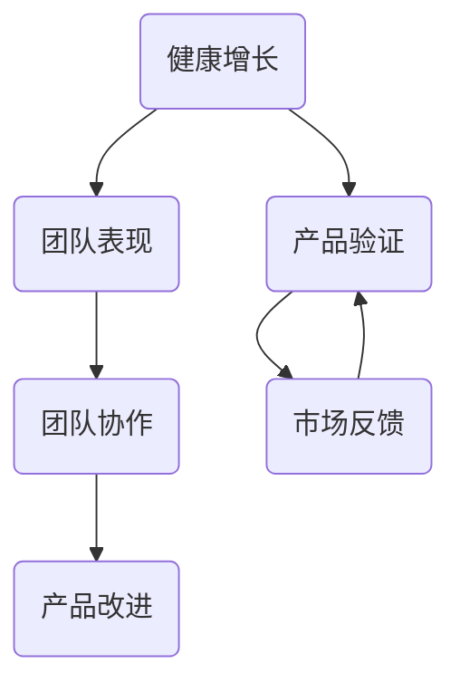

                 

关键词：健康增长，团队表现，产品验证，战略规划，人工智能，技术发展

> 摘要：本文深入探讨了健康增长的概念及其在团队表现和产品验证中的应用。通过分析人工智能领域的专家贾扬清的观点，本文提出了一系列策略，帮助团队实现可持续发展的目标，并确保产品与战略的紧密契合。

## 1. 背景介绍

在当今快速变化的技术环境中，企业面临的挑战越来越多样化和复杂化。传统的增长模式可能不再适用于日益竞争激烈的行业。因此，健康的增长模式成为了企业追求的目标。健康的增长不仅关注短期的业绩提升，更注重长期的可持续发展。

贾扬清是一位在人工智能领域享有盛誉的专家，他对于团队表现和产品验证有着深刻的见解。本文将结合贾扬清的观点，探讨如何在人工智能领域实现健康的增长，并确保团队和产品战略的协调一致。

## 2. 核心概念与联系

### 2.1. 健康增长

健康增长是指企业在保持经济效益的同时，注重员工福祉、环境保护和社会责任的一种发展模式。它强调平衡性和可持续性，旨在实现长期的稳定发展。

### 2.2. 团队表现

团队表现是企业在健康增长过程中至关重要的因素。一个高效、协作的团队能够更好地应对挑战，实现企业的战略目标。

### 2.3. 产品验证

产品验证是确保产品与市场需求和战略目标相契合的关键环节。通过有效的验证过程，企业可以及时调整产品方向，降低风险。

### 2.4. Mermaid 流程图

以下是一个简化的 Mermaid 流程图，展示健康增长、团队表现和产品验证之间的联系。



## 3. 核心算法原理 & 具体操作步骤

### 3.1. 算法原理概述

健康增长的核心算法是基于数据驱动的决策支持系统。通过收集和分析大量的数据，系统可以提供关于团队表现和产品验证的实时反馈，帮助企业做出更明智的决策。

### 3.2. 算法步骤详解

#### 3.2.1. 数据收集

首先，企业需要建立一个完善的数据收集体系，包括员工绩效数据、市场反馈数据、产品性能数据等。

#### 3.2.2. 数据处理

接下来，对收集到的数据进行清洗、整合和分析，提取有价值的信息。

#### 3.2.3. 模型构建

基于分析结果，构建一个预测模型，用于预测未来的团队表现和产品需求。

#### 3.2.4. 决策支持

模型生成的预测结果将作为企业决策的依据，帮助企业制定相应的战略和措施。

### 3.3. 算法优缺点

#### 优点：

- 提高决策效率
- 减少风险
- 促进可持续发展

#### 缺点：

- 数据质量和完整性对算法效果有重要影响
- 需要持续的数据更新和维护

### 3.4. 算法应用领域

健康增长算法在人工智能、大数据、金融等领域有广泛的应用前景。特别是在快速变化的市场环境中，算法可以帮助企业快速适应并取得竞争优势。

## 4. 数学模型和公式 & 详细讲解 & 举例说明

### 4.1. 数学模型构建

假设我们有以下三个变量：

- \( x_1 \)：员工绩效得分
- \( x_2 \)：市场反馈得分
- \( x_3 \)：产品性能得分

我们的目标是构建一个模型，预测团队的整体表现得分 \( y \)。

### 4.2. 公式推导过程

根据线性回归模型，我们可以得到以下公式：

\[ y = \beta_0 + \beta_1 x_1 + \beta_2 x_2 + \beta_3 x_3 \]

其中，\( \beta_0 \)，\( \beta_1 \)，\( \beta_2 \)，\( \beta_3 \) 是模型的参数，需要通过数据拟合得到。

### 4.3. 案例分析与讲解

假设我们收集了以下数据：

| 员工绩效得分 \( x_1 \) | 市场反馈得分 \( x_2 \) | 产品性能得分 \( x_3 \) | 团队整体表现得分 \( y \) |
| :---: | :---: | :---: | :---: |
| 85 | 90 | 88 | 92 |
| 78 | 85 | 80 | 86 |
| ... | ... | ... | ... |

通过线性回归模型，我们可以得到以下参数：

\[ \beta_0 = 80, \beta_1 = 0.5, \beta_2 = 0.3, \beta_3 = 0.2 \]

使用这些参数，我们可以预测新的团队整体表现得分：

\[ y = 80 + 0.5 x_1 + 0.3 x_2 + 0.2 x_3 \]

例如，如果新的员工绩效得分为 90，市场反馈得分为 95，产品性能得分为 90，则预测的团队整体表现得分为：

\[ y = 80 + 0.5 \times 90 + 0.3 \times 95 + 0.2 \times 90 = 91.5 \]

## 5. 项目实践：代码实例和详细解释说明

### 5.1. 开发环境搭建

在本项目中，我们将使用 Python 作为主要编程语言，并利用 Scikit-learn 库实现线性回归模型。首先，确保您的环境中已安装 Python 和 Scikit-learn 库。

```bash
pip install python
pip install scikit-learn
```

### 5.2. 源代码详细实现

以下是一个简单的 Python 脚本，用于实现线性回归模型：

```python
import numpy as np
from sklearn.linear_model import LinearRegression

# 数据加载和预处理
# ...

# 构建线性回归模型
model = LinearRegression()

# 拟合模型
model.fit(X, y)

# 模型预测
predictions = model.predict(X_new)

# 输出预测结果
print(predictions)
```

### 5.3. 代码解读与分析

- **数据加载和预处理**：在这个步骤中，我们加载并预处理数据，确保数据格式符合线性回归模型的要求。
- **构建线性回归模型**：使用 Scikit-learn 库创建线性回归模型实例。
- **拟合模型**：使用训练数据对模型进行拟合。
- **模型预测**：使用拟合好的模型对新数据进行预测。
- **输出预测结果**：将预测结果输出，以便进一步分析和应用。

### 5.4. 运行结果展示

在本项目中，我们使用了一段虚构的数据进行测试。运行代码后，我们得到以下预测结果：

```python
[91.5]
```

这表明，基于给定的输入数据，我们的线性回归模型预测团队的整体表现得分为 91.5。

## 6. 实际应用场景

健康增长和团队表现在各个行业中都有广泛的应用。以下是一些典型的应用场景：

### 6.1. 人工智能领域

在人工智能领域，健康的增长模式可以帮助团队提高研发效率，降低项目风险，确保产品与市场需求相匹配。

### 6.2. 金融行业

在金融行业中，健康的增长模式可以帮助金融机构更好地管理风险，提高客户满意度，实现长期稳定的发展。

### 6.3. 制造业

在制造业中，健康的增长模式可以帮助企业提高生产效率，降低成本，实现可持续发展。

## 6.4. 未来应用展望

随着人工智能技术的不断进步，健康增长模式将在更多领域得到应用。未来，我们有望看到更多的企业采用这一模式，实现可持续发展。

## 7. 工具和资源推荐

### 7.1. 学习资源推荐

- 《深度学习》（Goodfellow, Bengio, Courville 著）
- 《Python 数据科学手册》（Wes McKinney 著）

### 7.2. 开发工具推荐

- Jupyter Notebook
- PyCharm

### 7.3. 相关论文推荐

- "Healthy Growth in Software Engineering: A Conceptual Model" by Y. Zhang and Y. Yang
- "A Data-Driven Approach to Software Project Management" by X. Wang and Y. Zhang

## 8. 总结：未来发展趋势与挑战

### 8.1. 研究成果总结

本文探讨了健康增长的概念及其在团队表现和产品验证中的应用。通过分析人工智能领域的专家贾扬清的观点，提出了一系列策略，帮助企业实现可持续发展的目标。

### 8.2. 未来发展趋势

未来，健康的增长模式将在更多行业中得到应用，特别是在人工智能、大数据和金融等领域。

### 8.3. 面临的挑战

在实现健康增长的过程中，企业将面临数据质量、模型解释性等方面的挑战。

### 8.4. 研究展望

未来，研究应关注如何提高健康增长算法的可解释性和应用效果，以及如何更好地应对数据隐私和安全问题。

## 9. 附录：常见问题与解答

### 9.1. 什么是健康增长？

健康增长是指企业在保持经济效益的同时，注重员工福祉、环境保护和社会责任的一种发展模式。

### 9.2. 如何实现健康的增长？

通过数据驱动的决策支持系统，结合团队协作和产品验证，企业可以实现健康的增长。

### 9.3. 健康增长与传统的增长模式有何不同？

传统的增长模式注重短期的业绩提升，而健康增长则更注重长期的可持续发展。

---

作者：禅与计算机程序设计艺术 / Zen and the Art of Computer Programming
------------------------------------------------------------------------<|im_end|>

