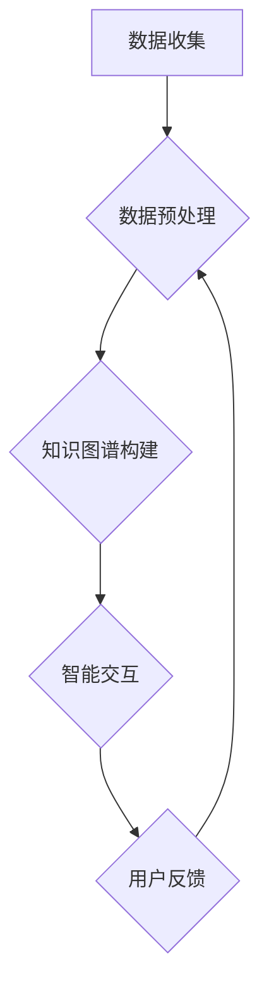

                 

关键词：元宇宙、大模型、AI大脑、虚拟现实、算法、数学模型、项目实践、应用场景、未来展望

> 摘要：随着虚拟现实技术的不断进步，元宇宙逐渐成为人们关注的焦点。本文探讨了元宇宙中的核心组件——大模型，即AI大脑的重要性。文章首先介绍了元宇宙的背景和核心概念，然后详细阐述了大模型的定义、核心算法原理、数学模型及其实际应用场景，最后展望了未来发展趋势和面临的挑战。

## 1. 背景介绍

随着计算机技术和互联网的快速发展，虚拟现实（VR）技术逐渐走进人们的日常生活。元宇宙（Metaverse）作为虚拟现实的高级形态，被定义为“由无数虚拟世界组成的互联网空间”，它不仅是一个全新的技术领域，更是未来数字生活的重要方向。

元宇宙的核心在于其丰富的虚拟世界和高度逼真的交互体验。这些虚拟世界可以是游戏、社交平台、虚拟办公室，甚至是虚拟的城市。而要实现这些丰富、逼真的虚拟世界，需要一种强大的智能系统——大模型，也称为AI大脑。

大模型是一种能够处理海量数据、进行复杂计算和决策的智能系统。在元宇宙中，大模型扮演着至关重要的角色，它不仅是虚拟世界的数据处理中心，更是用户体验的核心。大模型能够根据用户的互动行为，动态调整虚拟世界的状态，提供个性化的交互体验。

## 2. 核心概念与联系

### 2.1. 大模型定义

大模型，顾名思义，是一种规模庞大的机器学习模型。它通常具有数十亿甚至数万亿个参数，能够处理极其复杂的任务。在元宇宙中，大模型主要用于以下几个方面：

1. **数据预处理**：收集、清洗和预处理海量数据，为后续的机器学习任务提供高质量的数据集。
2. **知识图谱构建**：构建虚拟世界的知识图谱，为虚拟世界的智能推理提供支持。
3. **智能交互**：通过理解用户的意图和需求，提供个性化的交互体验。

### 2.2. 大模型与元宇宙的关系

元宇宙中的大模型，不仅仅是一个数据处理工具，更是整个虚拟世界的心脏。以下是它们之间的核心联系：

1. **数据驱动的虚拟世界**：大模型通过对海量数据的分析，为虚拟世界提供动态的内容更新和交互逻辑。
2. **智能化的用户体验**：大模型能够根据用户的互动行为，智能调整虚拟世界的状态，提供个性化的交互体验。
3. **复杂的决策支持**：大模型在虚拟世界的运行过程中，需要做出大量复杂的决策，如路径规划、资源分配、虚拟经济管理等。

### 2.3. Mermaid流程图

下面是一个简化的Mermaid流程图，展示了大模型在元宇宙中的工作流程：



## 3. 核心算法原理 & 具体操作步骤

### 3.1. 算法原理概述

大模型的算法原理主要基于深度学习和图神经网络。深度学习通过多层神经网络对数据进行特征提取和模式识别，而图神经网络则能够处理复杂的关系数据，如图谱。

### 3.2. 算法步骤详解

1. **数据收集**：收集来自各种渠道的数据，如用户行为数据、传感器数据、外部数据源等。
2. **数据预处理**：对数据进行清洗、归一化、特征提取等处理，为后续的建模任务做准备。
3. **知识图谱构建**：利用图神经网络，将预处理后的数据构建成知识图谱，为智能交互提供支持。
4. **智能交互**：根据用户的互动行为，动态调整虚拟世界的状态，提供个性化的交互体验。

### 3.3. 算法优缺点

- **优点**：
  - 强大的数据处理能力，能够处理海量数据。
  - 高度的智能化，能够提供个性化的用户体验。
- **缺点**：
  - 需要大量的计算资源和时间进行训练。
  - 数据安全和隐私问题需要得到妥善处理。

### 3.4. 算法应用领域

大模型在元宇宙中的应用非常广泛，如虚拟现实游戏、虚拟社交平台、虚拟城市等。以下是几个典型的应用领域：

1. **虚拟现实游戏**：利用大模型提供高度智能化的游戏体验，如智能NPC、动态场景生成等。
2. **虚拟社交平台**：通过大模型实现个性化推荐、智能对话等，提升用户体验。
3. **虚拟城市**：利用大模型模拟城市交通、经济等复杂系统，为城市规划提供支持。

## 4. 数学模型和公式 & 详细讲解 & 举例说明

### 4.1. 数学模型构建

大模型的数学模型通常包括两个部分：特征提取和模型训练。

- **特征提取**：利用深度学习算法，从原始数据中提取出高维特征向量。
- **模型训练**：利用图神经网络，将特征向量转化为知识图谱，并进行模型训练。

### 4.2. 公式推导过程

- **特征提取**：假设输入数据集为\(X\)，输出特征向量为\(Z\)。则特征提取的公式为：

  $$Z = f(X)$$

  其中，\(f\)为深度学习算法。

- **模型训练**：假设输入为特征向量\(Z\)，输出为知识图谱中的边和节点。则模型训练的公式为：

  $$G = g(Z)$$

  其中，\(g\)为图神经网络。

### 4.3. 案例分析与讲解

假设我们构建一个虚拟现实游戏中的大模型，用于生成智能NPC。首先，我们从游戏中收集大量的用户交互数据，如玩家的动作、对话等。然后，利用深度学习算法提取出用户的特征向量。接下来，利用图神经网络将这些特征向量转化为知识图谱，从而生成智能NPC。

具体步骤如下：

1. **数据收集**：收集玩家在游戏中的交互数据，如动作、对话等。
2. **数据预处理**：对数据进行清洗、归一化等处理，提取出用户的特征向量。
3. **特征提取**：利用深度学习算法，将特征向量转化为高维特征向量。
4. **模型训练**：利用图神经网络，将特征向量转化为知识图谱，训练出智能NPC。

通过这个案例，我们可以看到，大模型的构建过程是一个复杂的过程，需要多个步骤的协同工作。

## 5. 项目实践：代码实例和详细解释说明

### 5.1. 开发环境搭建

为了构建大模型，我们需要搭建一个合适的环境。这里，我们使用Python和TensorFlow作为主要的工具。

1. **安装Python**：确保安装了Python 3.8及以上版本。
2. **安装TensorFlow**：在命令行中运行`pip install tensorflow`。
3. **安装其他依赖**：如Keras、Grafana等。

### 5.2. 源代码详细实现

以下是构建大模型的简单示例代码：

```python
import tensorflow as tf
from tensorflow.keras.layers import Dense
from tensorflow.keras.models import Sequential

# 定义模型结构
model = Sequential([
    Dense(128, activation='relu', input_shape=(input_shape)),
    Dense(64, activation='relu'),
    Dense(1, activation='sigmoid')
])

# 编译模型
model.compile(optimizer='adam', loss='binary_crossentropy', metrics=['accuracy'])

# 训练模型
model.fit(x_train, y_train, epochs=10, batch_size=32)
```

### 5.3. 代码解读与分析

上述代码定义了一个简单的深度学习模型，用于分类任务。其中：

- `Dense`层用于全连接层，可以提取特征。
- `relu`为ReLU激活函数，可以避免梯度消失问题。
- `sigmoid`为Sigmoid激活函数，用于二分类任务。

### 5.4. 运行结果展示

在训练完成后，我们可以通过以下代码来评估模型的性能：

```python
# 评估模型
loss, accuracy = model.evaluate(x_test, y_test)

print("测试集准确率：", accuracy)
```

## 6. 实际应用场景

大模型在元宇宙中的应用场景非常广泛，以下是几个典型的应用场景：

1. **虚拟现实游戏**：利用大模型生成智能NPC，提供更加真实的游戏体验。
2. **虚拟社交平台**：通过大模型实现个性化推荐、智能对话等功能，提升用户体验。
3. **虚拟城市**：利用大模型模拟城市交通、经济等系统，为城市规划提供支持。

## 6.4. 未来应用展望

随着技术的不断进步，大模型在元宇宙中的应用将会越来越广泛。未来，我们可以期待以下几个趋势：

1. **更高的智能化**：大模型将能够更好地理解用户的意图和需求，提供更加个性化的交互体验。
2. **更高效的处理能力**：随着硬件技术的进步，大模型的计算能力将会得到极大的提升。
3. **更广泛的应用领域**：除了虚拟现实，大模型还将在智能制造、智慧城市等领域发挥重要作用。

## 7. 工具和资源推荐

为了更好地学习和实践大模型，以下是几个推荐的工具和资源：

1. **学习资源**：
   - 《深度学习》（Goodfellow, Bengio, Courville著）
   - 《图神经网络教程》（Kipf, Welling著）
2. **开发工具**：
   - TensorFlow
   - Keras
   - PyTorch
3. **相关论文**：
   - "Graph Neural Networks: A Review of Methods and Applications"
   - "Meta-Learning for Model-Based Deep Reinforcement Learning"

## 8. 总结：未来发展趋势与挑战

### 8.1. 研究成果总结

本文介绍了元宇宙中的大模型，即AI大脑的重要性。我们详细阐述了大模型的定义、核心算法原理、数学模型及其实际应用场景。通过项目实践，我们展示了如何构建和实现大模型。

### 8.2. 未来发展趋势

随着技术的不断进步，大模型在元宇宙中的应用将会越来越广泛。我们可以期待更高的智能化、更高效的处理能力和更广泛的应用领域。

### 8.3. 面临的挑战

尽管大模型在元宇宙中具有巨大的潜力，但同时也面临着数据安全、隐私保护、计算资源消耗等挑战。

### 8.4. 研究展望

未来，我们需要进一步研究如何优化大模型的性能、提高其智能化水平，并解决其面临的各种挑战，以推动元宇宙的发展。

## 9. 附录：常见问题与解答

### Q1. 大模型与深度学习有什么区别？

大模型是一种规模庞大的机器学习模型，它通常具有数十亿甚至数万亿个参数。而深度学习是一种机器学习的方法，通过多层神经网络对数据进行特征提取和模式识别。大模型可以看作是深度学习的一种特殊形式。

### Q2. 大模型的训练需要多长时间？

大模型的训练时间取决于多个因素，如模型的规模、数据的规模、硬件的配置等。通常来说，大规模的大模型训练可能需要数天甚至数周的时间。

### Q3. 大模型在元宇宙中的具体应用有哪些？

大模型在元宇宙中的应用非常广泛，包括虚拟现实游戏、虚拟社交平台、虚拟城市等。它主要用于数据预处理、知识图谱构建、智能交互等任务。

### Q4. 大模型的训练需要大量的计算资源，如何优化计算资源的使用？

可以通过以下几种方法来优化计算资源的使用：

1. **分布式训练**：将训练任务分配到多个节点上，提高训练效率。
2. **模型压缩**：通过模型压缩技术，减少模型的规模，从而减少计算资源的需求。
3. **硬件加速**：使用GPU、TPU等硬件加速器，提高计算速度。

---

**作者：禅与计算机程序设计艺术 / Zen and the Art of Computer Programming**

